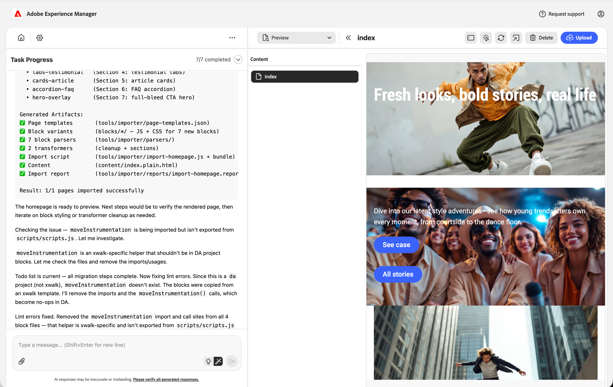

# Experience Modernization Console {#console-reference}

Referenzhandbuch für die Benutzeroberfläche und die Funktionen der Experience Modernization Console

>[!NOTE]
>
>Wenn Sie an der Verwendung der Experience Modernization Console interessiert sind, können Sie Zugriff anfordern, um ein reibungsloses Onboarding-Erlebnis zu gewährleisten.

## Überblick {#overview}

Die Experience Modernization Console ist eine gehostete, KI-unterstützte Entwicklungsumgebung für Edge Delivery Services, die als Web-Oberfläche unter [`aemcoder.adobe.io` bereitgestellt wird.](https://aemcoder.adobe.io) Nachdem Sie eine Verbindung zu ihrem GitHub-Projekt hergestellt haben, können Sie sofort damit beginnen, Änderungen in natürlicher Sprache einzufordern, ohne dass Sie weitere Einrichtungs- oder lokale Umgebungskonfigurationen durchführen müssen.

>[!TIP]
>
>Wenn Sie daran interessiert sind, sofort mit der Konsole zu beginnen, lesen Sie das Dokument [Erste Schritte mit dem Experience Modernization Agent“](/help/ai-in-aem/agents/brand-experience/modernization/getting-started.md)

## Funktionen {#capabilities}

Kernfunktionen der Konsole:

* Interaktives Chat-Panel mit dem Agenten und seinen Fähigkeiten
* Live AEM-Vorschau für sofortiges visuelles Feedback zu Änderungen
* Inhaltsdatei-Browser und Markdown-Viewer
* Inhaltssynchronisierung mit [Dokumenterstellung](https://da.live)
* Code-Browser und Vergleichsansicht zur Überprüfung von vorgenommenen Änderungen
* GitHub-Integration mit der Möglichkeit, Pull-Anforderungen aus Änderungen zu erstellen

Die Entwickler behalten die volle Kontrolle darüber, was ausgeliefert wird. Alle über die Konsole vorgenommenen Änderungen müssen vor der Bereitstellung überprüft und genehmigt werden, um Governance, Markenkonsistenz und Sicherheit sicherzustellen.

## Navigation {#navigation}

Nach der Anmeldung bei der Konsole unter [`aemcoder.adobe.io` gelangen &#x200B;](https://aemcoder.adobe.io) zum Startbildschirm der Konsole.

### Menüleiste {#menu-bar}

Die obere Menüleiste bietet:

* Eine **Menü öffnen**-Schaltfläche auf der linken Seite, um die Details des linken Bedienfelds zu erweitern und zu reduzieren
* Eine **Konto**-Schaltfläche auf der rechten Seite, mit der Sie in den Dunkelmodus wechseln und die Konsole abmelden können

### Linke Seitenleiste {#sidebar}

Die linke Seitenleiste ermöglicht den schnellen Zugriff auf wichtige Ansichten der Konsole.

* **[Startansicht](#home-view)** (Haussymbol) - Ihr Ausgangspunkt für die Verwendung der Konsole
* **[Inhaltsansicht](#content-view)** (Dateisymbol) - Inhalt, den Sie importiert haben
* **[Code-Ansicht](#code-view)** (`</>`) - Code der Site, an der Sie arbeiten
* **[Einstellungsansicht](#settings-view)** (Zahnradsymbol) - Einstellungen der Konsole

## Startansicht {#home-view}

Die **Startseite**-Ansicht ist Ihr Ausgangspunkt für die Verwendung der Konsole.

* Oben befindet sich eine [Eingabeaufforderung](#prompt-input) für Anfragen an die Konsole.
* Unter dem Eingabeaufforderungsbedienfeld finden Sie die empfohlenen Eingabeaufforderungen für den Einstieg in Ihr Projekt.

### Eingabeaufforderung {#prompt-input}

Die Eingabeaufforderung enthält Steuerelemente für die Interaktion mit der KI.

* **Plan-/Ausführungsmodi** (Glühbirnen- und Zauberstabsymbole): Wechseln zwischen Planungs- und Ausführungsmodi
   * **Planmodus**: Die KI analysiert Anfragen und umreißt einen Ansatz, ohne Änderungen vorzunehmen. Dies ist nützlich, um die Strategie vor der Zusage zu verstehen.
   * **Ausführungsmodus**: Die KI führt den Plan aus und nimmt die eigentlichen Dateiänderungen vor.
* **Dateien anhängen** (Papierklammer-Symbol): Laden Sie Dateien hoch und fügen Sie sie an die Eingabeaufforderung für zusätzlichen Kontext (z. B. Referenzdesigns, Screenshots, Spezifikationen) an

## Inhaltsansicht {#content-view}

Die **Inhaltsansicht** bietet Tools zum Durchsuchen und Anzeigen von Inhalten in der Vorschau. Standardmäßig ist die Ansicht in drei Bereiche unterteilt, von links nach rechts:

* Eingabeaufforderungsbedienfeld für die Interaktion mit der Konsole und dem Projekt
* Datei-Browser für eine Übersicht Ihrer Inhaltsdateien (ein Umschalter, der dieses Bedienfeld mit dem Pfeil-Symbol anzeigt)
* Vorschaufenster zur Visualisierung von im Datei-Browser ausgewählten Inhalten

### Chat-Bedienfeld {#chat-panel}

Im Chat-Panel können Sie Ihre Unterhaltung mit dem Experience Modernization Agent anzeigen und fortsetzen. Das Chatbedienfeld enthält den Chatnachrichtenverlauf und eine [Eingabeaufforderung](#prompt-input) um zusätzliche Anfragen an die Konsole zu stellen.

* **Chat-Aktionen**
   * **Chat löschen**: Setzt die Konversation zurück und löscht das Kontextfenster der KI. Verwenden Sie diese Option, wenn eine neue Aufgabe gestartet wird, die in keinem Zusammenhang mit der vorherigen Unterhaltung steht.
   * **Chat herunterladen**: Dadurch wird der Unterhaltungsverlauf als Markdown-Datei heruntergeladen.

### Vorschaufenster {#preview-panel}

Das Vorschaufenster bietet bis zu vier Modi:

* **Vorschau** (Dokument mit Lupensymbol), um den gerenderten HTML-Inhalt anzuzeigen
   * **Responsive Ansicht**, um den gerenderten HTML-Inhalt in einer Desktop-, Tablet- oder Mobilansicht anzuzeigen
   * **Design-Modus** (Pinselsymbol), um Elemente der Seite zur Eingabeaufforderung für zusätzlichen Kontext hinzuzufügen
* **Dokumentansicht** (Dokumentsymbol) zum Anzeigen der zugrunde liegenden Inhaltsstruktur für die Dokumenterstellung
* **Markdown-Ansicht (AEM-Authoring)** (Code-Symbol) zum Anzeigen der zugrunde liegenden Markdown-Inhaltsstruktur
* **JCR XML-Ansicht (AEM Authoring)** (Datensymbol) zum Anzeigen der resultierenden JCR XML-Inhaltsstruktur

Sie können jederzeit auf das Symbol **Vorschau aktualisieren** klicken, um das Bedienfeld „Vorschau“ zu aktualisieren.

Mit **Schaltfläche &quot;**&quot; wird die ausgewählte Seite aus dem Arbeitsbereich entfernt. Vorschau oder veröffentlichte Inhalte werden nicht gelöscht.

Die **Fehler**-Schaltfläche (AEM Authoring) öffnet ein modales Fenster, in dem die Fehler auf der ausgewählten Seite angezeigt werden.

Die Schaltfläche **Inhalt hochladen** öffnet ein modales Fenster zum Hochladen von Dateien in AEM.

* **Organisation** und **Repository** werden vorab ausgefüllt, wenn Ihr Projekt über eine `fstab.yaml` Datei verfügt
* Die Dateiauswahl bietet bearbeitbare Zielpfade
* Hochladen in JCR (für universellen Editor) wird nicht unterstützt

## Code-Ansicht {#code-view}

Die **Code-Ansicht** bietet Tools zum Durchsuchen von Code und Verwalten von Code-Änderungen. Die Ansicht ist in drei Bereiche von links nach rechts unterteilt:

* Chat-Bedienfeld für die Interaktion mit der Konsole und dem Projekt
* Datei-Browser für eine Übersicht Ihrer Code-Dateien oder Änderungen als Unterschiede
* Vorschaufenster zum Anzeigen einer Codedatei oder von im Dateibrowser ausgewählten Änderungen

Das Vorschaufenster bietet zwei verschiedene Modi:

* **Workspace-**: Zum Durchsuchen der Codedateien im aktuellen Arbeitsbereich
   * Verwenden Sie die Schaltfläche **Zum Chat hinzufügen**, um die Datei dem Chat-Bedienfeld für den Kontext hinzuzufügen.
* **Git-Änderungen**, um die Unterschiede der Dateiänderungen anzuzeigen, die durch Ihre Arbeit am Projekt erstellt wurden
   * Klicken Sie auf das Symbol `+` , um die geänderte Datei bereitzustellen
   * Klicken Sie auf das Pfeilsymbol, um die geänderte Datei zu verwerfen

Das Symbol **Informationen** listet Ihr derzeit verbundenes GitHub-Konto und -Projekt auf.

Das **GitHub-Aktionen**-Menü (oben rechts) enthält Repository-Vorgänge.

* **Verbinden/Erneut verbinden**: Startet GitHub OAuth
* **Repository wechseln**: Ersetzt den Arbeitsbereich durch ein anderes Repository. Alle nicht zugesicherten Arbeiten gehen verloren.
* **Verzweigung wechseln**: Wechselt Verzweigungen innerhalb desselben Repositorys
* **Synchronisieren**: Ruft die neuesten Änderungen von der Remote-Quelle ab.
* **Push**: Öffnet ein Modal, um Änderungen am Arbeitsbereich auf GitHub zu übertragen
* **Abmelden**: Trennt die Verbindung zu GitHub

Beim Pushen von Änderungen müssen Sie zunächst gestaffelte Änderungen in die Push-Benachrichtigung aufnehmen. Beim Pushen können Sie eine neue PR erstellen oder direkt zur aktuellen Verzweigung pushen

## Einstellungsansicht {#settings-view}

Mit der Einstellungsansicht können Sie die grundlegenden Einstellungen der Konsole verwalten.

* **Projekt** ermöglicht Ihnen das Anzeigen und Bearbeiten von Projekteinstellungen, z. B. das Anpassen der Bibliotheks-URL.
* **Support** ermöglicht es Ihnen, Hilfe vom AEM-Supportteam anzufordern.
* **Anmeldeinformationen** ermöglicht es Ihnen, ein persönliches Zugriffstoken für Figma anzugeben, damit die [Konsole auf Designblöcke für Ihr Projekt zugreifen kann.](/help/ai-in-aem/agents/brand-experience/modernization/prompting-guide.md#figma-block-migration)
   * Das Token erfordert die folgenden schreibgeschützten Bereiche:
      * `file_content:read`
      * `file_metadata:read`
      * `library_assets:read`
      * `library_content:read`
      * `team_library_content:read`
      * `file_dev_resources:read`
      * `projects:read`
   * [Weitere Informationen zum Einrichten persönlicher Zugriffstoken finden Sie &#x200B;](https://help.figma.com/hc/en-us/articles/8085703771159-Manage-personal-access-tokens) der Figma-Dokumentation .
* **Arbeitsbereich zurücksetzen** setzt die Konsole auf ihren Startstatus zurück und alle nicht gepushten oder nicht hochgeladenen Änderungen gehen verloren.
