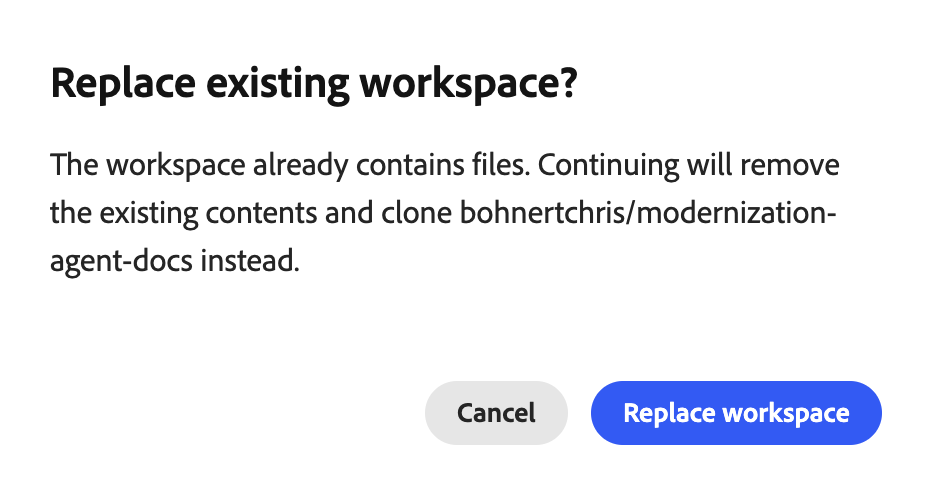
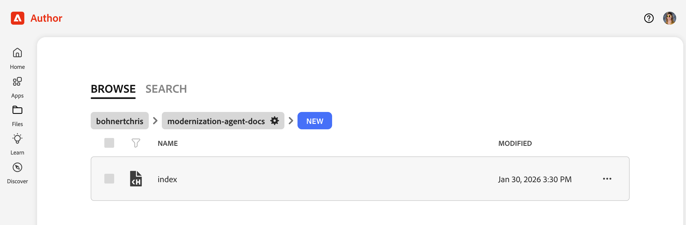
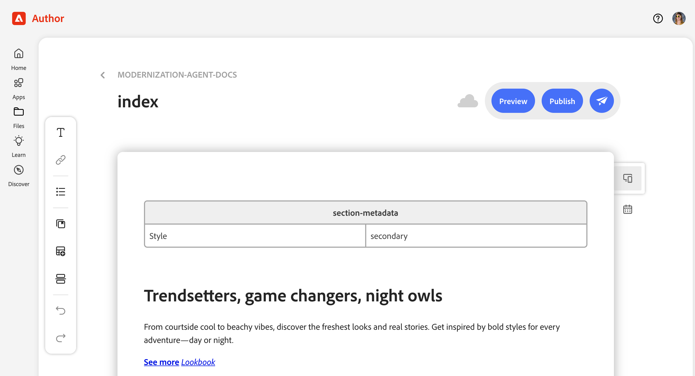

# Erste Schritte mit dem Experience Modernization Agent {#getting-started}

Erfahren Sie mehr über die ersten Schritte mit dem Experience Modernization Agent und der Experience Modernization Console.

>[!NOTE]
>
>Wenn Sie an der Verwendung der Experience Modernization Console interessiert sind, können Sie den Zugriff über Ihren Account Manager anfordern, um ein reibungsloses Onboarding-Erlebnis zu gewährleisten.

## Vorbereiten eines Edge Delivery GitHub-Repositorys {#prepare-repo}

>[!NOTE]
>
>Verwenden eines AEM Sites- und universellen Editor-Projekts? Führen [&#x200B; die Einrichtungsschritte unter „Erste Schritte mit dem AEM Sites](/help/ai-in-aem/agents/brand-experience/modernization/getting-started-aem-authoring.md)universellen Editor“ aus.

1. Wählen Sie ein [Edge Delivery Services](/help/edge/overview.md)-Repository zur Verwendung mit der Experience Modernization Console aus.
   * Dabei kann es sich um ein bestehendes Edge Delivery Services-Projekt handeln. Sie können aber auch nach dem [Entwickler-Tutorial](https://www.aem.live/developer/tutorial) ein neues erstellen, indem Sie das [Textbausteinrepository“ verwenden.](https://github.com/adobe/aem-boilerplate)
1. Stellen Sie sicher, dass der [AEM Code Connector](https://github.com/apps/aem-code-connector) im Repository installiert ist.
   * Dadurch kann die Konsole Ihren Code überprüfen.
1. Stellen Sie sicher, dass die [AEM Code Sync GitHub](https://github.com/apps/aem-code-sync)App im Repository installiert ist.
   * Dadurch kann Edge Delivery Services Ihren Code synchronisieren.
   * Wenn Ihr Repository auf dem Tutorial basiert, ist dieser Schritt bereits abgeschlossen.

## Öffnen der Experience Modernization Console {#open-console}

1. Navigieren Sie zu [`aemcoder.adobe.io`.](https://aemcoder.adobe.io)
1. Melden Sie sich mit Ihrer Adobe ID an.

## Demomodus {#demo-mode}

Die Konsole wird im Demomodus gestartet, wenn Sie sich zum ersten Mal anmelden. In diesem Modus können Sie eine vorhandene Site erkunden, auf der Sie zusätzliche Seiten migrieren können. Ein Banner am unteren Bildschirmrand zeigt an, dass Sie sich im Demomodus befinden.

## Verbinden Ihrer Site {#connect-repo}

Wenn Sie bereit sind, Ihre eigene Website zu bearbeiten, können Sie den Demomodus beenden, indem Sie eine Verbindung zu Ihrem eigenen Projekt herstellen.

1. Klicken Sie **Site wechseln** im Demomodus-Banner.
1. Dadurch werden Sie aufgefordert, die AEM Code Connector-App mit Ihren GitHub-Anmeldeinformationen zu autorisieren. Klicken Sie **AEM Code Connector autorisieren**.
1. Geben Sie zurück in der Konsole die Vorschau-URL der Site an. Die Vorschau-URL kann durch Vorschau eines beliebigen Dokuments auf der Website oder durch Erstellen aus einer Verzweigung, einem Site-Namen und einer Organisation abgerufen werden. Das System ruft das zugehörige GitHub-Projekt automatisch ab. Alternativ können Sie Ihre autorisierten GitHub-Projekte durchsuchen, um eine Site zu finden.
   
1. Klicken Sie **Auschecken in den Arbeitsbereich**, nachdem die Website überprüft wurde.
1. Wenn Sie aufgefordert werden **„Vorhandenen Arbeitsbereich ersetzen**, klicken Sie auf **Arbeitsbereich ersetzen**.
   

Ihr GitHub-Projekt und Ihre Site sind jetzt mit der Konsole verbunden.

Wenn der Demomodus beendet wurde, aber kein neues Projekt verbunden wurde, erzwingen nachfolgende Besuche beim Experience Modernization Agent die Verbindung einer Site.

## Konsolen-Startseite {#console-home}

Beim Besuch [aemcoder](https://aemcoder.adobe.io) wird die Startseite angezeigt, bis ein Chat-Gespräch gestartet wurde. Auf der Startseite können Sie mit dem Chat beginnen, indem Sie entweder Ihre erste Eingabeaufforderung eingeben oder eine der vorgeschlagenen Eingabeaufforderungen auswählen.

## Eingabeaufforderung starten {#start-prompting}

Jetzt, da Ihre Konsole auf Ihren Code zugreifen kann, können Sie mit der Eingabeaufforderung beginnen.

1. Zu Beginn können Sie den Inhalt einer Site importieren:
   * „Migrieren Sie die `https://wknd-trendsetters.site`.“
1. Dadurch wird der Inhalt der Site importiert.
   * Die Konsole beobachtet die Trennung von Belangen und verarbeitet Inhalte und Präsentation separat.
   * Der erste Import des Inhalts einer Site kann mehrere Minuten dauern.
   * Die Konsole bietet Ihnen laufendes Feedback zu Beginn ihrer Arbeit, einschließlich eines Überblicks über die geplanten Schritte.
     
1. Nachdem die Site importiert wurde, werden die Seiten im Bedienfeld **Workspace** angezeigt. Wählen Sie eine Seite aus, um sie im rechten Bedienfeld in der Vorschau anzuzeigen.
   
1. Nachdem Sie nun über Inhalte verfügen, können Sie auffordern, die Stile aus derselben Quelle zu importieren.
   * „Importieren Sie die allgemeinen Stile aus `https://wknd-trendsetters.site`.“
1. Wie beim ersten Inhaltsimport kann der Import mehrere Minuten dauern. Die Konsole gibt Feedback bei der Verarbeitung Ihrer Anfrage und beim Importieren der Stile. Sobald die Aufgabe abgeschlossen ist, klicken Sie im rechten Bedienfeld **Vorschau aktualisieren**, um den formatierten Inhalt anzuzeigen.
   

Jetzt haben Sie sowohl den Inhalt als auch die Stile in die Konsole importiert.

>[!TIP]
>
>[Lesen Sie die Anleitung zur Eingabeaufforderung](/help/ai-in-aem/agents/brand-experience/modernization/prompting-guide.md) um weitere Ideen dazu zu erhalten, wie der Agent aufgefordert werden kann und welche Fähigkeiten er haben kann.

## Inhalt hochladen {#upload-content}

So laden Sie Ihre Inhalte in [Dokumenterstellung](https://da.live) hoch:

1. Vergewissern Sie sich, dass Sie sich in **Inhalt** befinden, und klicken Sie dann oben rechts auf **Schaltfläche** Inhalt hochladen.
   * Standardmäßig befinden Sie sich in der **Content**-Ansicht, wenn Sie die Konsole aufrufen.
   * Ihre Ansicht wird durch das ausgewählte Element der Ansichtsauswahl im Arbeitsbereich der Konsole angezeigt.
1. Das Dialogfeld **Inhalt hochladen** wird mit der Zielorg und dem Repository geöffnet, die aus Ihren Projekteinstellungen vorausgefüllt sind.
   * Wenn in Ihrem verbundenen Repository keine `fstab.yaml` vorhanden ist, müssen Sie Ihre **Organisation“** „Repository **manuell**.
   * Wenn Sie das Textbaustein verwendet haben, wird ein `fstab.yaml` bereitgestellt.
1. Wählen Sie die Dateien aus, die Sie hochladen möchten, und klicken Sie auf **Hochladen**.
   
1. Die Konsole zeigt den Upload-Prozess an, indem sie die Schaltfläche **Hochladen** deaktiviert.
1. Nach Abschluss des Vorgangs wird unten in der Konsole eine Benachrichtigung angezeigt.
   

Um auf die hochgeladenen Inhalte in der Dokumenterstellung zuzugreifen, klicken Sie optional auf **In AEM anzeigen** in der Benachrichtigung, wenn der Upload abgeschlossen ist, oder navigieren Sie zu `https://da.live/#/{organization}/{repository}`.

Ihr importierter Inhalt befindet sich jetzt in der Dokumenterstellung.

>[!TIP]
>
>Wenn Sie an einem AEM Sites- und einem universellen Editor-Projekt arbeiten, funktioniert das Hochladen von Inhalten in AEM etwas anders. Spezifische Upload-[&#x200B; finden Sie unter „Erste Schritte mit dem Experience Modernization Agent für AEM Sites/Universal Editor &#x200B;](/help/ai-in-aem/agents/brand-experience/modernization/getting-started-aem-authoring.md#upload-content)&quot;.

## Push-Code-Änderungen {#push-code-changes}

Sobald Sie mit den Änderungen zufrieden sind, die Sie an Ihrem Code vorgenommen haben, können Sie sie an Ihr GitHub-Repository pushen.

1. Wechseln Sie **Ansicht**&#x200B;Änderungen“ (Verzweigungssymbol in der Ansichtsauswahl).
   
1. Wenn in der Liste der geänderten Dateien einige Dateien als nicht verfolgt angezeigt werden, klicken Sie auf ihre `+`-Schaltfläche, um sie bereitzustellen.
1. Klicken Sie **rechts oben** die Schaltfläche „Push“.
1. Wählen **Dialogfeld „Änderungen** Push übertragen“, um Änderungen an eine neue PR (Standard) oder die aktuelle Verzweigung zu pushen, und klicken Sie auf **Bestätigen**, um sie zu pushen.
   * Im Zweifelsfall können Sie zum aktuellen Zweig pushen, um die Dinge einfach zu halten.
1. Nach Abschluss des Vorgangs wird unten in der Konsole eine Benachrichtigung angezeigt.
   

Wenn Sie direkt auf die gepushten Änderungen in GitHub zugreifen möchten, klicken Sie auf **PR anzeigen** in der Benachrichtigung, wenn die Push-Benachrichtigung abgeschlossen ist.

Ihr Code befindet sich jetzt in GitHub.

## Site-Vorschau {#preview-site}

So zeigen Sie die Änderungen in der Vorschau-Umgebung an:

1. Zurück zur Dokumenterstellung.
   * Möglicherweise ist sie weiterhin in einer Browser-Registerkarte geöffnet, die Sie nach dem Hochladen des Inhalts durch Klicken **In AEM anzeigen** geöffnet haben.
   * Oder navigieren Sie zu `https://da.live/#/{organization}/{repository}`
1. Öffnen Sie eine der Seiten, die Sie zuvor in AEM hochgeladen haben.
1. Klicken Sie oben rechts auf das Papierebenensymbol und wählen Sie **Vorschau** aus.
   

Herzlichen Glückwunsch! Ihre migrierten Inhalte und Stile sind jetzt in der AEM-Vorschauumgebung verfügbar.

Wenn Sie den Code an eine andere Verzweigung als `main` gepusht haben, werden die Stile in der aus der Dokumenterstellung geöffneten Vorschau nicht angezeigt. Wechseln Sie zur Verzweigung, indem Sie die URL der Vorschau aktualisieren, damit Ihre Stile angezeigt werden.

## Fehlerbehebung {#troubleshooting}

### Zulassungsliste von IP-Adressen {#allowlist-ip-addresses}

Wenn sich Ihre Site hinter einer Firewall oder Zugriffsbeschränkungen befindet, können Sie die folgenden IP-Adressen ändern, damit die Backend-Services Ihre Site durchsuchen können:

* `34.228.136.112`
* `54.90.51.39`
* `3.224.194.242`

## Zusätzliche Ressourcen {#additional-resources}

Die folgenden Dokumente können nützlich sein, um den Experience Modernization Agent und seine Konsole weiter zu erkunden.

* [Experience Modernization Console](/help/ai-in-aem/agents/brand-experience/modernization/console.md) - Details zur Konsole, ihren Ansichten, Optionen und Funktionen
* [Prompting Guide for Experience Modernization Agent](/help/ai-in-aem/agents/brand-experience/modernization/prompting-guide.md) - Ideen, wie der Agent aufgefordert werden kann und was seine Fähigkeiten tun können
* [Edge Delivery Services-Entwickler-](https://www.aem.live/developer/tutorial): Nützlich, wenn Sie neu bei AEM- und Edge Delivery Services-Projekten sind
* [Dokumenterstellung](https://da.live) Nützlich, wenn Sie mit der Dokumenterstellung für das Content-Management noch nicht vertraut sind
