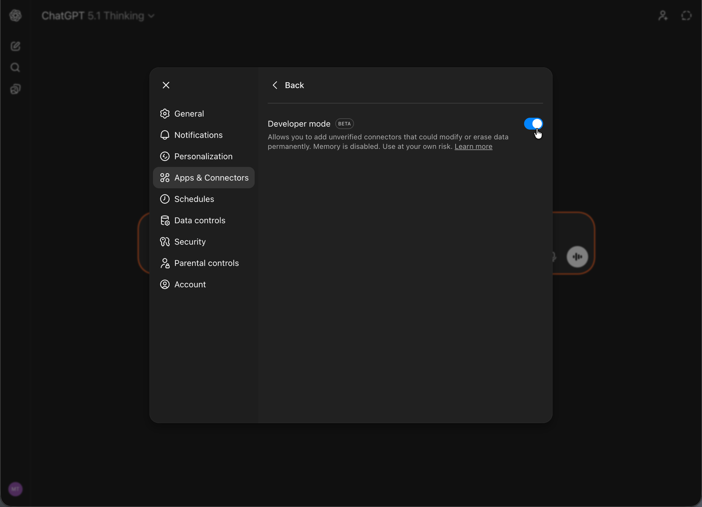

# Einrichten von OpenAI ChatGPT mit AEM MCP {#setup-chatgpt}

Führen Sie diese Schritte aus, um OpenAI ChatGPT mit den MCP-Servern von AEM zu verbinden.

* Fügen Sie eine oder mehrere AEM MCP-Server-URLs in dem Bereich hinzu, in dem MCP-Verbindungen oder -Tools konfiguriert sind.
* Erstellen Sie einen Trigger für die Verbindung und melden Sie sich bei der Weiterleitung mit Ihrer Adobe ID an.
* Verweisen Sie in einem Chat auf die konfigurierten AEM-Tools in Ihren Eingabeaufforderungen, z. B.:

  ```
  "Using the configured AEM MCP tools, list all sites in the author environment."
  ```





