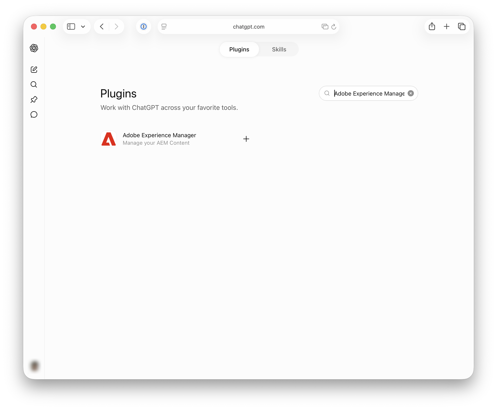

# Einrichten von OpenAI ChatGPT mit AEM MCP {#setup-chatgpt}

Dieser Artikel behandelt zwei verschiedene Möglichkeiten, OpenAI ChatGPT mit AEM zu verwenden:

- Konfigurieren Sie manuell einen oder mehrere MCP-Server von AEM in ChatGPT (die unter &quot;[ von MCP mit AEM as a Cloud Service - MCP-Server](/help/ai-in-aem/mcp-support/using-mcp-with-aem-as-a-cloud-service.md#mcp-servers) beschriebenen Server).
- Installieren Sie das Adobe Experience Manager-Plug-in über den ChatGPT-Plug-in-Marketplace. Es weist derzeit eine Funktionsparität mit Content MCP Server auf und stellt eine wachsende Untergruppe von Tools zur Verfügung, die in AEM MCP-Servern verfügbar sind.

## Manuelles Konfigurieren der AEM-MCP-Server in ChatGPT {#manual-configure-aems-mcp-servers-in-chatgpt}

In diesem Abschnitt wird der Ansatz **manuelle Konfiguration** beschrieben, bei dem Sie einen oder mehrere MCP-Server von AEM als benutzerdefinierte Programme oder Connectoren zu ChatGPT hinzufügen.

* Fügen Sie eine oder mehrere AEM MCP-Server-URLs in dem Bereich hinzu, in dem MCP-Verbindungen oder -Tools konfiguriert sind.
* Erstellen Sie einen Trigger für die Verbindung und melden Sie sich bei der Weiterleitung mit Ihrer Adobe ID an.
* Verweisen Sie in einem Chat auf die konfigurierten AEM-Tools in Ihren Eingabeaufforderungen, z. B.:

  ```
  "Using the configured AEM MCP tools, list all sites in the author environment."
  ```

>[!NOTE]
>
>Die OpenAI ChatGPT-Benutzeroberfläche kann sich ändern und ist nicht endgültig. Diese Anweisungen dienen nur zur Veranschaulichung.

1. Öffnen Sie **Einstellungen**, um den Bereich zu erreichen, in dem MCP-Verbindungen oder -Tools konfiguriert sind.

   

1. Öffnen Sie **Programme und Connectoren** die Option **Erweiterte Einstellungen**, um Connector- und MCP-bezogene Optionen zu verwalten.

   

1. Aktivieren Sie **Entwicklermodus** in **Apps und Connectoren**, damit Sie ein benutzerdefiniertes Plug-in hinzufügen und konfigurieren können.

   

1. Starten Sie **Neue App erstellen** (oder das entsprechende Steuerelement), um einen App-Eintrag für Ihren AEM MCP-Server hinzuzufügen.

   

1. Füllen Sie das Formular **Neue App** aus, z. B. benennen Sie die App und geben Sie Ihre AEM MCP-Server-URL und alle anderen erforderlichen Felder ein. **Speichern**.

   

1. Bestätigen Sie, dass **AEM Content MCP Service** (oder Ihre konfigurierte App) in &quot;**und Connectoren“ angezeigt wird** damit ChatGPT ihn verwenden kann.

   

1. Schreiben Sie in einem Chat eine Eingabeaufforderung, die ChatGPT anweist, die konfigurierten **AEM-Tools zu verwenden** (z. B. um Autoreninhalte oder Sites abzufragen).

   

## Installieren des Adobe Experience Manager-Plug-ins (ChatGPT-Plug-in-Marketplace) {#install-adobe-experience-manager-plugin}

In diesem Abschnitt wird das **installierbare Plug-in** aus dem ChatGPT-Plug-in-Marktplatz beschrieben (im Gegensatz zum Hinzufügen einer benutzerdefinierten MCP-Server-URL). Es enthält eine Teilmenge der Tools, die in den MCP-Servern von AEM verfügbar sind.

>[!NOTE]
>
>Die OpenAI ChatGPT-Benutzeroberfläche kann sich ändern und ist nicht endgültig. Diese Anweisungen dienen nur zur Veranschaulichung.

Sie können das Adobe Experience Manager-Plug-in auf zwei Arten erreichen. Verwenden Sie den bequemeren Schlüssel und fahren Sie dann mit den folgenden Schritten zur Anmeldung fort.

**Option 1: Öffnen Sie die Plug-in-Seite direkt**

Wechseln Sie zu [https://chatgpt.com/plugins/plugin_asdk_app_6a35d3c1258081919c084a1fd22cd02d](https://chatgpt.com/plugins/plugin_asdk_app_6a35d3c1258081919c084a1fd22cd02d) und wählen Sie **Plug-in installieren**.


**Option 2: Finden Sie das Plug-in im Marktplatz**

1. Wählen **Einstellungen** die Option **Plug-ins** und wählen Sie dann unten in der Liste **Plug-ins durchsuchen**.

   

1. Suchen Sie nach **Adobe Experience Manager** und wählen Sie es aus.

   

**Anmelden und bestätigen**

Nachdem Sie das Plug-in mit einer der oben genannten Optionen gefunden oder installiert haben, schließen Sie die Verbindung ab:

1. Wählen Sie **Mit Adobe Experience Manager anmelden** und melden Sie sich bei AEM an, wenn Sie umgeleitet werden.

   

1. Bestätigen Sie, dass das grüne Banner anzeigt, dass Adobe Experience Manager jetzt verbunden ist.

   
