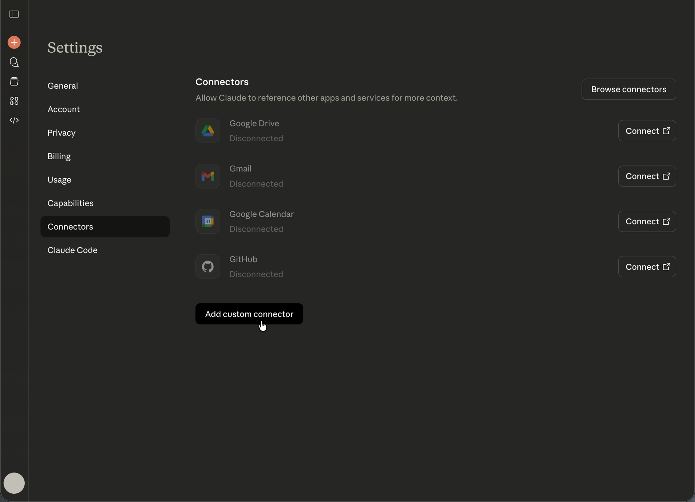

# Anthropic Claude mit AEM MCP einrichten {#setup-claude}

Führen Sie diese Schritte aus, um Anthropic Claude mit den MCP-Servern von AEM zu verbinden.

* Registrieren Sie in Claudes MCP-Konfiguration eine oder mehrere AEM MCP-Server-URLs.
* Schließen Sie den Adobe-Anmeldeablauf ab.
* Aktivieren Sie optional die automatische Bestätigung für bestimmte Tools im Konfigurationsbereich. Diese Option wird für Suchvorgänge oder schreibgeschützte Vorgänge empfohlen.
* Stellen Sie sicher, dass der MCP-Server ausgewählt ist, bevor Sie mit der Konversation beginnen.
* Bitten Sie Claude, AEM-bezogene Aufgaben auszuführen. Claude wählt die vom MCP-Server bereitgestellten AEM-Tools anhand Ihrer Eingabeaufforderung aus.

