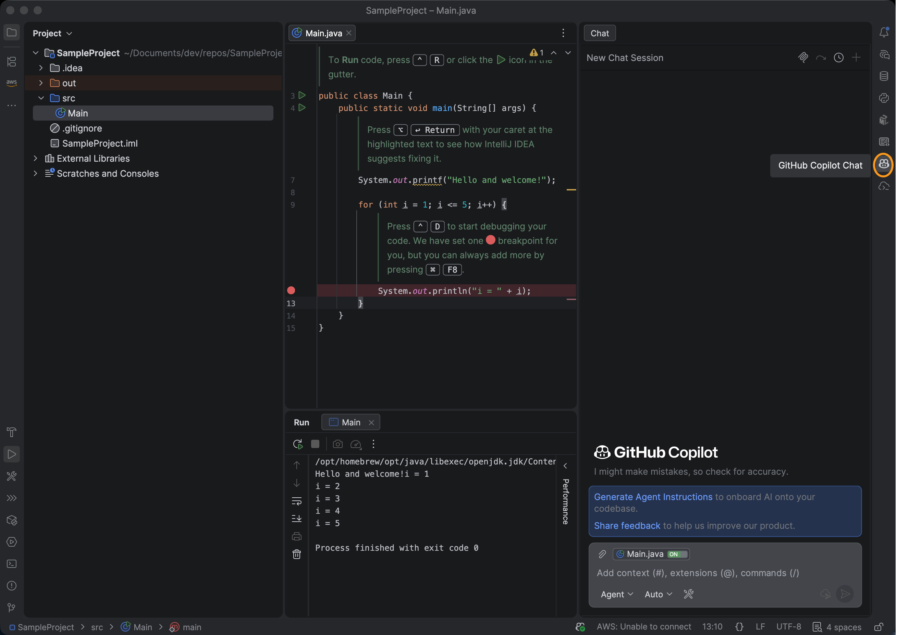

# Einrichten von JetBrains mit GitHub Copilot und AEM MCP {#setup-jetbrains-copilot}

Führen Sie diese Schritte aus, um GitHub Copilot in einer JetBrains-IDE (wie IntelliJ IDEA, WebStorm oder PyCharm) mit den MCP-Servern von AEM zu verbinden.

1. Öffnen Sie den GitHub-Copilot-Chat in Ihrer JetBrains-IDE, indem Sie auf **GitHub-Copilot-Chat** rechts im Editor klicken.

   

1. Klicken Sie auf **Einstellungen** im Bedienfeld Kopilot-Chat, um die MCP-Konfiguration zu öffnen.

   

1. Navigieren **Einstellungen** zu **Tools > GitHub-Copilot > Model Context Protocol (MCP)** und klicken Sie auf **Konfigurieren**, um die `mcp.json` Konfigurationsdatei zu öffnen.

   

1. Fügen Sie eine oder mehrere AEM MCP-Server-URLs zur `mcp.json` hinzu. Zum Beispiel:

   ```json
   {
     "servers": {
       "aem": {
         "url": "https://mcp.adobeaemcloud.com/adobe/mcp/content"
       }
     }
   }
   ```


   


1. Speichern Sie die Datei. GitHub Copilot erkennt die neue Server-Konfiguration automatisch und zeigt eine **Start**-Aktion an.

   

1. Klicken Sie auf **Start** und melden Sie sich bei Aufforderung bei Ihrer Adobe ID an, um den Authentifizierungsvorgang abzuschließen.

1. Sie können die gefundenen Tools überprüfen und verwalten, indem Sie auf die **tools** Anzeige klicken, die im Bedienfeld Copilot Chat angezeigt wird. Optional können Sie einzelne Tools aktivieren oder deaktivieren.


   

1. Verwenden Sie den GitHub-Copilot-Chat, um AEM-Tools als Teil Ihrer Entwicklungs- oder Inhalts-Workflows aufzurufen.