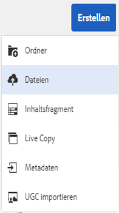
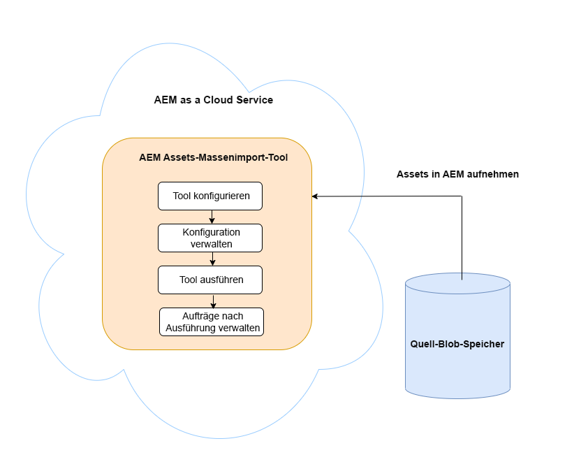
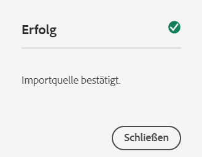
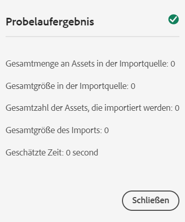
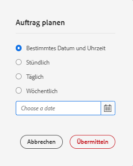
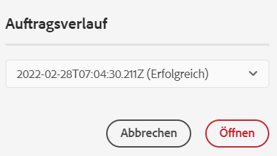

# Hinzufügen digitaler Assets zu [!DNL Adobe Experience Manager] as a [!DNL Cloud Service] [!DNL Assets] {#add-assets-to-experience-manager}

<table>
    <tr>
        <td>
            <sup style= "background-color:#008000; color:#FFFFFF; font-weight:bold"><i>Neu</i></sup> <a href="/help/assets/dynamic-media/dm-prime-ultimate.md"><b>Dynamic Media Prime und Ultimate</b></a>
        </td>
        <td>
            <sup style= "background-color:#008000; color:#FFFFFF; font-weight:bold"><i>Neu</i></sup> <a href="/help/assets/assets-ultimate-overview.md"><b>AEM Assets Ultimate</b></a>
        </td>
        <td>
            <sup style= "background-color:#008000; color:#FFFFFF; font-weight:bold"><i>Neu</i></sup> <a href="/help/assets/integrate-aem-assets-edge-delivery-services.md"><b>AEM Assets-Integration mit Edge Delivery Services</b></a>
        </td>
        <td>
            <sup style= "background-color:#008000; color:#FFFFFF; font-weight:bold"><i>Neu</i></sup> <a href="/help/assets/aem-assets-view-ui-extensibility.md"><b>Erweiterbarkeit der Benutzeroberfläche</b></a>
        </td>
          <td>
            <sup style= "background-color:#008000; color:#FFFFFF; font-weight:bold"><i>Neu</i></sup> <a href="/help/assets/dynamic-media/enable-dynamic-media-prime-and-ultimate.md"><b>Aktivieren von Dynamic Media Prime und Ultimate</b></a>
        </td>
    </tr>
    <tr>
        <td>
            <a href="/help/assets/search-best-practices.md"><b>Best Practices für die Suche</b></a>
        </td>
        <td>
            <a href="/help/assets/metadata-best-practices.md"><b>Best Practices für Metadaten</b></a>
        </td>
        <td>
            <a href="/help/assets/product-overview.md"><b>Content Hub</b></a>
        </td>
        <td>
            <a href="/help/assets/dynamic-media-open-apis-overview.md"><b>Dynamic Media mit OpenAPI-Funktionen</b></a>
        </td>
        <td>
            <a href="https://developer.adobe.com/experience-cloud/experience-manager-apis/"><b>Entwicklerdokumentation zu AEM Assets</b></a>
        </td>
    </tr>
</table>

[!DNL Adobe Experience Manager Assets] akzeptiert viele Arten von digitalen Assets aus vielen Quellen. Es speichert die Binärdateien und die erstellten Ausgabedarstellungen, kann die Asset-Verarbeitung mithilfe einer Vielzahl von Workflows durchführen und [!DNL Adobe Sensei]-Services durchführen und ermöglicht die Verteilung über viele Kanäle auf vielen Oberflächen.

[!DNL Adobe Experience Manager] In wird der binäre Inhalt der hochgeladenen digitalen Dateien mit Rich-Metadaten, Smart-Tags, Ausgabedarstellungen und anderen DAM (Digital Asset Management)-Services erweitert. Sie können verschiedene Arten von Dateien (z. B. Bilder, Dokumente und Raw-Dateien) von Ihrem lokalen Ordner oder Netzlaufwerk in [!DNL Experience Manager Assets] hochladen.

Neben dem am häufigsten verwendeten Browser-Upload gibt es auch andere Methoden, Assets zum [!DNL Experience Manager]-Repository hinzuzufügen. Zu diesen anderen Methoden gehören Desktop-Clients wie die Desktop-Anwendungen Adobe Asset Link oder [!DNL Experience Manager], Upload- und Aufnahmeskripte, die von Kundinnen und Kunden erstellt werden, und automatisierte Aufnahmeintegrationen, die als [!DNL Experience Manager]-Erweiterungen hinzugefügt werden.

Sie können zwar jede beliebige Binärdatei in [!DNL Experience Manager] hochladen und verwalten, aber die am häufigsten verwendeten Dateiformate bieten Unterstützung für zusätzliche Services, wie z. B. die Extraktion von Metadaten oder die Vorschau-/Ausgabedarstellungsgenerierung. Siehe [Unterstützte Dateiformate](file-format-support.md), um Einzelheiten zu erfahren.

Sie können sich auch dafür entscheiden, die hochgeladenen Assets zusätzlich zu bearbeiten. Für den Ordner, in den die Assets hochgeladen werden, können eine Reihe von Asset-Verarbeitungsprofilen konfiguriert werden, um spezifische Metadaten, Ausgabedarstellungen oder Bildbearbeitungs-Services hinzuzufügen. Weitere Informationen finden Sie unter [Verarbeiten von Assets beim Hochladen](#process-when-uploaded).

[!DNL Assets] bietet die folgenden Upload-Methoden. Adobe empfiehlt, dass Sie Ihren Anwendungsfall und die Anwendbarkeit einer Upload-Option verstehen, bevor Sie sie verwenden.

| Upload-Methode | Anwendungsfall | Primärpersonen |
|---------------------|----------------|-----------------|
| [Benutzeroberfläche der Assets-Konsole](#upload-assets) | Gelegentliches Hochladen, einfaches Drücken und Ziehen, Finder-Upload. Verwenden Sie sie nicht zum Hochladen vieler Assets. | Alle Benutzer |
| [Upload-API](#upload-using-apis) | Für dynamische Entscheidungen beim Hochladen. | Entwickler |
| [[!DNL Experience Manager] -Desktop-Programm](https://experienceleague.adobe.com/docs/experience-manager-desktop-app/using/using.html?lang=de) | Asset-Aufnahme mit niedrigem Volumen, jedoch nicht zur Migration. | Administrator, Marketingexperte |
| [[!DNL Adobe Asset Link]](https://helpx.adobe.com/de/enterprise/using/adobe-asset-link.html) | Nützlich, wenn Kreative und Marketingexperten mit Assets aus den unterstützten [!DNL Creative Cloud]-Desktop-Programmen arbeiten. | Kreative, Marketingexperte |
| [Tool zur Asset-Massenaufnahme](#asset-bulk-ingestor) | Empfohlen für umfangreiche Migrationen und gelegentliche Massenaufnahmen. Nur für unterstützte Datenspeicher. | Administrator, Entwickler |

## Hochladen von Assets {#upload-assets}

<!-- #ENGCHECK do we support pausing? I couldn't get pause to show with 1.5GB upload.... If not, this should be removed#

   You can pause the uploading of large assets (greater than 500 MB) and resume it later from the same page. Select the **[!UICONTROL Pause]** icon beside progress bar that appears when an upload starts.

   The size above which an asset is considered a large asset is configurable. For example, you can configure the system to consider assets above 1000 MB (instead of 500 MB) as large assets. In this case, **[!UICONTROL Pause]** appears on the progress bar when assets of size greater than 1000 MB are uploaded.

   The [!UICONTROL Pause] option does not show if a file greater than 1000 MB is uploaded with a file less than 1000 MB. However, if you cancel the less than 1000 MB file upload, the **[!UICONTROL Pause]** option appears.

   To modify the size limit, configure the `chunkUploadMinFileSize` property of the `fileupload` node in the CRX repository.

   When you click the **[!UICONTROL Pause]** icon, it toggles to a **[!UICONTROL Play]** icon. To resume uploading, click **[!UICONTROL Play]** option.
-->

<!-- #ENGCHECK do we support pausing? I couldn't get pause to show with 1.5GB upload.... If not, this should be removed#
   The ability to resume uploading is especially helpful in low-bandwidth scenarios and network glitches, where it takes a long time to upload a large asset. You can pause the upload operation and continue later when the situation improves. When you resume, uploading starts from the point where you paused it.
-->

<!-- #ENGCHECK assuming this is not relevant? remove after confirming#
   During the upload operation, [!DNL Experience Manager] saves the portions of the asset being uploaded as chunks of data in the CRX repository. When the upload completes, [!DNL Experience Manager] consolidates these chunks into a single block of data in the repository.

   To configure the cleanup task for the unfinished chunk upload jobs, go to `https://[aem_server]:[port]/system/console/configMgr/org.apache.sling.servlets.post.impl.helper.ChunkCleanUpTask`.
-->

Um eine Datei (oder mehrere Dateien) hochzuladen, können Sie diese auf Ihrem Desktop auswählen und in der Benutzeroberfläche (Webbrowser) in den Zielordner ziehen. Sie können den Upload alternativ auch über die Benutzeroberfläche starten.

>[!IMPORTANT]
>
>Assets, die Sie in Experience Manager hochladen und deren Dateinamen 100 Zeichen überschreiten, haben einen gekürzten Namen, wenn sie in Dynamic Media verwendet werden.
>
>Die ersten 100 Zeichen im Dateinamen werden unverändert verwendet und alle übrigen Zeichen werden durch eine alphanumerische Zeichenfolge ersetzt. Diese Umbenennungsmethode stellt einen eindeutigen Namen sicher, wenn das Asset in Dynamic Media verwendet wird. Sie soll auch die maximale Länge der Asset-Dateinamen berücksichtigen, die in Dynamic Media zulässig ist.


1. Navigieren Sie in der [!DNL Assets]-Benutzeroberfläche zu dem Speicherort, an dem Sie digitale Assets hinzufügen möchten.
1. Führen Sie einen der folgenden Schritte aus, um die Assets hochzuladen:

   * Klicken Sie in der Symbolleiste auf **[!UICONTROL Erstellen]** > **[!UICONTROL Dateien]**. Sie können die Datei im angezeigten Dialogfeld bei Bedarf umbenennen.
   * Ziehen Sie die Assets in einem Browser, der HTML5 unterstützt, direkt auf die [!DNL Assets]-Benutzeroberfläche. Das Dialogfeld zum Umbenennen der Datei wird nicht angezeigt.

   

   Wenn Sie die Assets im Dialogfeld für die Dateiauswahl bei gedrückter `Ctrl`- oder `Command`-Taste markieren, können Sie mehrere Dateien auswählen. Bei Verwendung eines iPads können Sie jeweils nur eine Datei auswählen.

1. Um einen laufenden Upload abzubrechen, klicken Sie auf „Schließen“ (`X`) neben der Fortschrittsleiste. Wenn Sie den Upload abbrechen, löscht [!DNL Assets] den teilweise hochgeladenen Teil des Assets.
Wenn Sie das Hochladen abbrechen, bevor die Dateien hochgeladen sind, unterbricht [!DNL Assets] den Upload der aktuellen Datei und aktualisiert den Inhalt. Dateien, die bereits hochgeladen wurden, werden jedoch nicht gelöscht.

1. Das Dialogfeld für den Upload-Fortschritt in [!DNL Assets] zeigt die Anzahl der erfolgreich hochgeladenen Dateien und die der Dateien an, die nicht hochgeladen werden konnten.
Darüber hinaus zeigt die [!DNL Assets]-Benutzeroberfläche das zuletzt hochgeladene Asset oder den Ordner an, den Sie zuerst erstellt haben.

>[!NOTE]
>
>Informationen zum Hochladen verschachtelter Ordnerhierarchien finden Sie unter [Massen-Upload von Assets](#bulk-upload).

<!-- #ENGCHECK I'm assuming this is no longer relevant.... If yes, this should be removed#

### Serial uploads {#serialuploads}

Uploading numerous assets in bulk consumes significant I/O resources, which may adversely impact the performance of [!DNL Assets]. In particular, if you have a slow internet connection, the time to upload drastically increases due to a spike in disk I/O. Moreover, your web browser may introduce additional restrictions to the number of POST requests [!DNL Assets] can handle for concurrent asset uploads. As a result, the upload operation fails or terminate prematurely. In other words, [!DNL Assets] may miss some files while ingesting a bunch of files or altogether fail to ingest any file.

To overcome this situation, [!DNL Assets] ingests one asset at a time (serial upload) during a bulk upload operation, instead of the concurrently ingesting all the assets.

Serial uploading of assets is enabled by default. To disable the feature and allow concurrent uploading, overlay the `fileupload` node in CRX-DE and set the value of the `parallelUploads` property to `true`.

### Streamed uploads {#streamed-uploads}

If you upload many assets to [!DNL Experience Manager], the I/O requests to server increase drastically, which reduces the upload efficiency and can even cause some upload task to time out. [!DNL Assets] supports streamed uploading of assets. Streamed uploading reduces the disk I/O during the upload operation by avoiding asset storage in a temporary folder on the server before copying it to the repository. Instead, the data is transferred directly to the repository. This way, the time to upload large assets and the possibility of timeouts is reduced. Streamed upload is enabled by default in [!DNL Assets].

>[!NOTE]
>
>Streaming upload is disabled for [!DNL Experience Manager] running on JEE server with servlet-api version lower than 3.1.
-->

### Handhaben von Uploads für vorhandene Assets {#handling-upload-existing-file}

Sie können ein Asset mit demselben Pfad (demselben Namen und demselben Speicherort) hochladen wie ein vorhandenes Asset. Es wird jedoch ein Warndialogfeld mit den folgenden Optionen angezeigt:

* Vorhandenes Asset ersetzen: Wenn Sie ein vorhandenes Asset ersetzen, werden die Metadaten für das Asset und sämtliche vorherigen Änderungen daran (z. B. Anmerkungen und Zuschnitte) gelöscht.

  >[!NOTE]
  >
  >Die Option zum Ersetzen von Assets ist nicht verfügbar, wenn das Asset gesperrt oder ausgecheckt ist.

* Eine andere Version erstellen: Eine neue Version des vorhandenen Assets wird im Repository erstellt. Sie können die beiden Versionen in der [!UICONTROL Timeline] anzeigen und bei Bedarf zur bereits vorhandenen Version zurückkehren.
* Beides beibehalten: Wenn Sie beide Assets beibehalten, wird das neue Asset umbenannt.

Um das doppelte Asset in [!DNL Assets] beizubehalten, klicken Sie auf **[!UICONTROL Behalten]**. Tippen oder klicken Sie auf **[!UICONTROL Löschen]**, um das doppelte Asset zu löschen, das Sie gerade hochgeladen haben.

### Behandlung von Dateinamen und unzulässige Zeichen {#filename-handling}

[!DNL Experience Manager Assets] verhindert, dass Sie Assets hochladen, deren Dateinamen unzulässige Zeichen enthalten. Wenn Sie versuchen, ein Asset mit einem Dateinamen, der ein oder mehreren nicht zulässige Zeichen enthält, hochzuladen, zeigt [!DNL Assets] eine Warnmeldung an und stoppt den Upload, bis Sie diese Zeichen entfernen oder mit einem zulässigen Namen hochladen.

Um bestimmte Dateibenennungskonventionen für Ihre Organisation einzuhalten, können Sie im Dialogfeld [!UICONTROL Assets hochladen] lange Namen für die Dateien angeben, die Sie hochladen möchten. Die folgenden Zeichen (in der Liste durch Leerzeichen getrennt) werden nicht unterstützt:

* Ungültige Zeichen für den Asset-Dateinamen: `* / : [ \\ ] | # % { } ? &`
* Ungültige Zeichen für den Asset-Ordnernamen: `* / : [ \\ ] | # % { } ? \" . ^ ; + & \t`

## Massen-Upload von Assets {#bulk-upload}

Das Tool zur Asset-Massenaufnahme kann viele Assets effizient handhaben. Eine Aufnahme in großem Umfang ist jedoch nicht nur ein großer Datei-Dump oder eine gelegentliche Migration. Damit eine umfangreiche Aufnahme ein aussagekräftiges Projekt ist, das Ihrem Geschäftszweck dient und effizient ist, müssen Sie die Migration planen und die Organisation der Assets kuratieren. Alle Aufnahmen sind unterschiedlich. Berücksichtigen Sie daher anstelle einer Verallgemeinerung die differenzierte Zusammensetzung des Repositorys und die Geschäftsanforderungen. Im Folgenden finden Sie einige übergreifende Vorschläge zum Planen und Ausführen einer Massenaufnahme:

* Assets kuratieren: Entfernen Sie Assets, die im DAM nicht benötigt werden. Sie sollten nicht verwendete, veraltete oder doppelte Assets entfernen. Dadurch werden die übertragenen Daten und die aufgenommenen Assets reduziert, was zu schnelleren Aufnahmen führt.
* Assets organisieren: Sie sollten den Inhalt in einer logischen Reihenfolge organisieren, z. B. nach Dateigröße, Dateiformat, Anwendungsfall oder Priorität. Im Allgemeinen erfordern große, komplexe Dateien mehr Verarbeitung. Sie können auch in Betracht ziehen, große Dateien mithilfe der Dateigrößenfilteroption (siehe unten) separat aufzunehmen.
* Aufnahmen staffeln: Erwägen Sie, Ihre Aufnahme in mehrere Massenaufnahmen zu unterteilen. Auf diese Weise können Sie Inhalte früher anzeigen und Ihre Aufnahme bei Bedarf aktualisieren. Beispielsweise können Sie verarbeitungsintensive Assets außerhalb der Spitzenzeiten oder schrittweise in mehreren Blöcken aufnehmen. Sie können aber auch kleinere und einfachere Assets, die nicht viel Verarbeitung erfordern, in einem Schritt aufnehmen.

Verwenden Sie einen der folgenden Ansätze, um eine größere Anzahl von Dateien hochzuladen. Weitere Informationen finden Sie unter [Anwendungsfälle und Methoden](#upload-methods-comparison).

* [Asset-Upload-APIs](developer-reference-material-apis.md#asset-upload): Verwenden Sie ein benutzerdefiniertes Upload-Skript oder -Tool, das APIs nutzt, um bei Bedarf zusätzliche Verarbeitungsschritte für Assets hinzuzufügen (z. B. Metadaten übersetzen oder Dateien umbenennen).
* [[!DNL Experience Manager] -Desktop-Programm](https://experienceleague.adobe.com/docs/experience-manager-desktop-app/using/using.html?lang=de): Nützlich für Kreativprofis und Marketing-Experten, die Assets aus ihrem lokalen Dateisystem hochladen. Verwenden Sie diese Option, um lokal verfügbare verschachtelte Ordner hochzuladen.
* [Tool zur Massenaufnahme](#asset-bulk-ingestor): Wird zum gelegentlichen oder anfänglichen Aufnehmen großer Mengen von Assets bei der Bereitstellung von [!DNL Experience Manager] verwendet.

### Tool für den Massenimport von Assets {#asset-bulk-ingestor}

Das Tool wird nur der Administratorgruppe zur Verfügung gestellt, um Assets in großem Umfang aus Azure- oder S3-Datenspeichern aufzunehmen. Sehen Sie sich eine Video-Anleitung zur Konfiguration und Aufnahme an.

>[!VIDEO](https://video.tv.adobe.com/v/329680/?quality=12&learn=on)

Die folgende Abbildung zeigt die verschiedenen Phasen der Aufnahme von Assets in Experience Manager aus einem Datenspeicher:



**Voraussetzungen**

Zur Verwendung dieser Funktion ist ein externes Speicherkonto oder ein Behälter aus Azure oder AWS erforderlich.

>[!NOTE]
>
>Erstellen Sie den Container oder Behälter des Speicherkontos als privat und akzeptieren Sie Verbindungen nur von autorisierten Anfragen. Es werden jedoch keine zusätzlichen Beschränkungen für eingehende Netzwerkverbindungen unterstützt.

>[!NOTE]
>
>Externe Speicherkonten verfügen möglicherweise über andere Regeln für Datei-/Ordnernamen als das Tool zum Massenimport. Unter [Umgang mit Dateinamen beim Massenimport](#filename-handling-bulkimport) finden Sie weitere Details zu unzulässigen Namen oder Namen mit Escape-Zeichen.


### Konfigurieren des Tools für den Massenimport {#configure-bulk-ingestor-tool}

Gehen Sie wie folgt vor, um das Tool für den Massenimport zu konfigurieren:

1. Navigieren Sie zu **[!UICONTROL Tools]** > **[!UICONTROL Assets]** > **[!UICONTROL Massenimport]**. Wählen Sie die Option **[!UICONTROL Erstellen]** aus.

1. Geben Sie im Feld **[!UICONTROL Titel]** einen Titel für die Konfiguration des Massenimports an.

1. Wählen Sie den Datenquellentyp aus der Dropdown-Liste der **[!UICONTROL Importquellen]**.

1. Geben Sie die Werte an, um eine Verbindung mit der Datenquelle herzustellen. Wenn Sie zum Beispiel **Azure Blob Storage** als Datenquelle auswählen, geben Sie die Werte für das Azure-Speicherkonto, den Azure-Blob-Container und den Azure-Zugriffsschlüssel an.

1. Wählen Sie in der Dropdown-Liste den gewünschten Authentifizierungsmodus aus. Der **Azure-Zugriffsschlüssel** bietet vollständigen Zugriff auf das Azure-Speicherkonto, während das **Azure SAS-Token** dem Admin ermöglicht, die Funktionen des Tokens mithilfe von Berechtigungen und Ablaufrichtlinien zu beschränken.

1. Geben Sie den Namen des Stammordners, der Assets in der Datenquelle enthält, im Feld **[!UICONTROL Quellordner]** an.

1. (Optional) Geben Sie im Feld **[!UICONTROL Nach Mindestgröße filtern]** die minimale Dateigröße der Assets in MB an, die in den Aufnahmeprozess einbezogen werden sollen.

1. (Optional) Geben Sie im Feld **[!UICONTROL Nach Maximalgröße filtern]** die maximale Dateigröße der Assets in MB an, die in den Aufnahmeprozess einbezogen werden sollen.

1. (Optional) Geben Sie im Feld **[!UICONTROL MIME-Typen ausschließen]** eine kommagetrennte Liste von MIME-Typen an, die von der Aufnahme ausgeschlossen werden sollen. Beispiel: `image/jpeg, image/.*, video/mp4`. Hier finden Sie [alle unterstützten Dateiformate](/help/assets/file-format-support.md).

1. Geben Sie im Feld **[!UICONTROL MIME-Typen einschließen]** eine kommagetrennte Liste der MIME-Typen an, die bei der Aufnahme berücksichtigt werden sollen. Hier finden Sie [alle unterstützten Dateiformate](/help/assets/file-format-support.md).

1. Wählen Sie die Option **[!UICONTROL Quelldatei nach Import löschen]**, um die Originaldateien aus dem Quelldatenspeicher zu löschen, nachdem die Dateien in [!DNL Experience Manager] importiert wurden.

1. Wählen Sie den **[!UICONTROL Importmodus]**. Wählen Sie **Überspringen**, **Ersetzen** oder **Version erstellen**. Der Modus „Überspringen“ ist der Standardmodus. In diesem Modus überspringt das Aufnahme-Tool den Import eines Assets, wenn es bereits vorhanden ist. Siehe die Bedeutung der [Optionen zum Ersetzen und Erstellen von Versionen](#handling-upload-existing-file).

1. Um einen Speicherort in DAM zu definieren, in den Assets importiert werden sollen, indem Sie das Feld **[!UICONTROL Zielordner für Assets]** verwenden, geben Sie einen Pfad an. Zum Beispiel: `/content/dam/imported_assets`.

1. (Optional) Geben Sie im Feld **[!UICONTROL Metadatendatei]** die zu importierende Metadatendatei im CSV-Format an. Geben Sie die CSV-Datei im Quell-Blob-Speicherort an und verweisen Sie beim Konfigurieren des Tools für den Massenimport auf den Pfad. Das CSV-Dateiformat, auf das in diesem Feld verwiesen wird, ist dasselbe wie das CSV-Dateiformat beim [Massenimport und -export von Asset-Metadaten](https://experienceleague.adobe.com/docs/experience-manager-cloud-service/content/assets/admin/metadata-import-export.html?lang=de). Wenn Sie die Option **Quelldatei nach Import löschen** wählen, filtern Sie CSV-Dateien entweder mit den Feldern **Ausschließen** oder **MIME-Typ einschließen** oder **Nach Pfad/Datei filtern**. Sie können in diesen Feldern einen regulären Ausdruck verwenden, um CSV-Dateien zu filtern.

1. Klicken Sie auf **[!UICONTROL Speichern]**, um die Konfiguration zu speichern.

### Verwalten der Konfiguration des Tools für den Massenimport {#manage-bulk-import-configuration}

Nach der Erstellung der Konfiguration des Tools für den Massenimport können Sie Aufgaben ausführen, um die Konfiguration vor der Massenaufnahme von Assets in Ihre Experience Manager-Instanz zu bewerten. Um die verfügbaren Optionen zur Verwaltung der Konfiguration des Tools für den Massenimport anzuzeigen, wählen Sie die Konfiguration unter **[!UICONTROL Tools]** > **[!UICONTROL Assets]** > **[!UICONTROL Massenimport]** aus.

### Bearbeiten der Konfiguration {#edit-configuration}

Um die Konfigurationsdetails zu bearbeiten, wählen Sie die Konfiguration aus und klicken Sie dann auf **[!UICONTROL Bearbeiten]**. Sie können den Titel der Konfiguration und die Importdatenquelle beim Ausführen des Bearbeitungsvorgangs nicht bearbeiten.

### Löschen der Konfiguration {#delete-configuration}

Wählen Sie die Konfiguration aus und klicken Sie auf **[!UICONTROL Löschen]**, um die Konfiguration des Massenimports zu löschen.

### Überprüfen der Verbindung zur Datenquelle {#validate-connection}

Um die Verbindung mit der Datenquelle zu überprüfen, wählen Sie die Konfiguration aus und klicken Sie auf **[!UICONTROL Überprüfen]**. Wenn die Verbindung erfolgreich hergestellt wurde, zeigt Experience Manager die folgende Meldung an:



### Aufrufen eines Testlaufs für den Massenimportauftrag {#invoke-test-run-bulk-import}

Wählen Sie die Konfiguration aus und klicken Sie auf **[!UICONTROL Probelauf]**, um einen Testlauf für den Massenimportvorgang aufzurufen. Experience Manager zeigt die folgenden Details zum Massenimportvorgang an:



### Umgang mit Dateinamen beim Massenimport {#filename-handling-bulkimport}

Wenn Sie Assets oder Ordner massenhaft importieren, importiert [!DNL Experience Manager Assets] die gesamte Struktur dessen, was in der Importquelle vorhanden ist. [!DNL Experience Manager] befolgt die integrierten Regeln für Sonderzeichen in den Asset- und Ordnernamen. Daher müssen diese Dateinamen bereinigt werden. Sowohl für den Ordnernamen als auch für den Asset-Namen bleibt der von den Benutzerinnen oder Benutzern definierte Titel unverändert und wird in `jcr:title` gespeichert.

Während des Massenimports sucht [!DNL Experience Manager] nach den vorhandenen Ordnern, um das erneute Importieren der Assets und Ordner zu vermeiden, und überprüft auch die Bereinigungsregeln, die im übergeordneten Ordner angewendet werden, in dem der Import stattfindet. Wenn die Bereinigungsregeln im übergeordneten Ordner angewendet werden, werden dieselben Regeln auf die Importquelle angewendet. Für neue Importe werden die folgenden Bereinigungsregeln angewendet, um die Dateinamen von Assets und Ordnern zu verwalten.

**Unzulässige Namen beim Massenimport**

Die folgenden Zeichen sind in Datei- und Ordnernamen nicht zulässig:

* Zeichen für Kontrolle und private Verwendung (0x00 bis 0x1F, \u0081, \uE000)
* Datei- oder Ordnernamen, die mit einem Punkt (.) enden

Dateien oder Ordner mit Namen, die diesen Bedingungen entsprechen, werden während des Importvorgangs übersprungen und als fehlgeschlagen markiert.

**Umgang mit Asset-Namen beim Massenimport**

Bei Asset-Dateinamen werden der JCR-Name und der Pfad mithilfe der API bereinigt: `JcrUtil.escapeIllegalJcrChars`.

* Unicode-Zeichen werden nicht geändert
* Ersetzen Sie die Sonderzeichen durch ihren URL-Escape-Code, zum Beispiel wird `new%asset.png` zu `new%25asset.png` geändert:

  ```
                  URL escape code   
  
  "               %22
  %               %25
  '               %27
  *               %2A
  /               %2F
  :               %3A
  [               %5B
  \n              %0A
  \r              %0D
  \t              %09
  ]               %5D
  |               %7C
  ```

**Umgang mit Ordnernamen beim Massenimport**

Bei Ordnernamen werden der JCR-Name und der Pfad mithilfe der API bereinigt: `DamUtil.getSanitizedFolderName`.

* Großbuchstaben werden in Kleinbuchstaben umgewandelt
* Unicode-Zeichen werden nicht geändert
* Ersetzen Sie die Sonderzeichen durch einen Bindestrich („-“), z. B. wird `new folder` zu `new-folder` geändert:

  ```
  "                           
  #                         
  %                           
  &                          
  *                           
  +                          
  .                           
  :                           
  ;                          
  ?                          
  [                           
  ]                           
  ^                         
  {                         
  }                         
  |                           
  /         It is used for split folder in cloud storage and is pre-handled, no conversion here.
  \         Not allowed in Azure, allowed in AWS.
  \t
  space     It is the space character.
  ```

<!-- 
[!DNL Experience Manager Assets] manages the forbidden characters in the filenames while you upload assets or folders. [!DNL Experience Manager] updates only the node names in the DAM repository. However, the `title` of the asset or folder remains unchanged.

Following are the file naming conventions that are applied while uploading assets or folders in [!DNL Experience Manager Assets]:

| Characters &Dagger; | When occurring in file names | When occurring in folder names | Example |
|---|---|---|---|
| `. / : [ ] | *` | Replaced with `-` (hyphen). | Replaced with `-` (hyphen). A `.` (dot) in the filename extension is retained as is. | Replaced with `-` (hyphen). | `myimage.jpg` remains as is and `my.image.jpg` changes to `my-image.jpg`. |
| `% ; # , + ? ^ { } "` and whitespaces | Whitespaces are retained | Replaced with `-` (hyphen). | `My Folder.` changes to `my-folder-`. |
| `# % { } ? & .` | Replaced with `-` (hyphen). | NA. | `#My New File.` changes to `-My New File-`. |
| Uppercase characters | Casing is retained as is. | Changed to lowercase characters. | `My New Folder` changes to `my-new-folder`. |
| Lppercase characters | Casing is retained as is. | Casing is retained as is. | NA. |

&Dagger; The list of characters is a whitespace-separated list.
-->

#### Planen eines einmaligen oder wiederkehrenden Massenimports {#schedule-bulk-import}

Gehen Sie wie folgt vor, um einen einmaligen oder einen wiederkehrenden Massenimport zu planen:

1. Erstellen Sie eine Konfiguration für den Massenimport.
1. Wählen Sie die Konfiguration aus und wählen Sie **[!UICONTROL Zeitplan]** aus der Symbolleiste aus.
1. Legen Sie eine einmalige Aufnahme fest oder erstellen Sie einen stündlichen, täglichen oder wöchentlichen Zeitplan. Klicken Sie auf **[!UICONTROL Senden]**.

   


#### Anzeigen des Zielordners der Elemente {#view-assets-target-folder}

Um den Zielspeicherort für Assets anzuzeigen, in den die Assets importiert werden, nachdem der Massenimportauftrag ausgeführt wurde, wählen Sie die Konfiguration aus und klicken Sie dann auf **[!UICONTROL Assets anzeigen]**.

#### Ausführen des Tools für den Massenimport {#run-bulk-import-tool}

Nach dem [Konfigurieren des Tools für den Massenimport](#configure-bulk-ingestor-tool) und dem optionalen [Verwalten der Konfiguration des Tools für den Massenimport](#manage-bulk-import-configuration) können Sie den Konfigurationsvorgang ausführen, um die Massenaufnahme von Elementen zu starten.

Um den Massenimport zu starten, navigieren Sie zu **[!UICONTROL Tools]** > **[!UICONTROL Assets]** > **[!UICONTROL Massenimport]**, wählen Sie die [Massenimportkonfiguration](#configure-bulk-ingestor-tool) aus und klicken Sie anschließend auf **[!UICONTROL Ausführen]**. Klicken zum Bestätigen erneut auf **[!UICONTROL Ausführen]**.

Experience Manager aktualisiert den Status des Vorgangs auf **Verarbeitung** und dann nach erfolgreichem Abschluss des Vorgangs auf **Erfolgreich**. Um die importierten Assets in Experience Manager anzuzeigen, klicken Sie auf **Assets anzeigen**.

Wenn der Vorgang ausgeführt wird, können Sie auch die Konfiguration auswählen und auf **Anhalten** klicken, um die Massenaufnahme anzuhalten. Klicken Sie erneut auf **Ausführen**, um den Prozess fortzusetzen. Sie können auch auf **Probelauf** klicken, um die Details der Elemente zu sehen, die noch nicht importiert wurden.

#### Verwalten von Vorgängen nach Ausführung {#manage-jobs-after-execution}

Mit Experience Manager können Sie den Verlauf der Massenimportiervorgänge anzeigen. Der Vorgangsverlauf umfasst den Status des Vorgangs, die Person, die den Vorgang erstellt hat, Protokolle sowie weitere Details wie Startdatum und -zeit, Erstellungsdatum und -zeit sowie Enddatum und -zeit.

Um auf den Vorgangsverlauf für eine Konfiguration zuzugreifen, wählen Sie die Konfiguration aus und klicken Sie auf **[!UICONTROL Vorgangsverlauf]**. Wählen Sie einen Vorgang aus und klicken Sie auf **Öffnen**.



Experience Manager zeigt den Auftragsverlauf an. Auf der Seite mit dem Verlauf des Massenimportvorgangs können Sie auch auf **Löschen** klicken, um diesen Vorgang aus der Massenimportkonfiguration zu löschen.


## Hochladen von Assets mit Desktop-Clients {#upload-assets-desktop-clients}

Zusätzlich zur Webbrowser-Benutzeroberfläche unterstützt [!DNL Experience Manager] auch andere Clients auf dem Desktop. Sie bieten außerdem ein Upload-Erlebnis, ohne dass der Browser aufgerufen werden muss.

* [[!DNL Adobe Asset Link]](https://helpx.adobe.com/de/enterprise/using/adobe-asset-link.html) bietet den Zugriff auf Assets aus [!DNL Experience Manager] in Adobe Photoshop-, Adobe Illustrator- und Adobe InDesign-Desktop-Programmen. Sie können das aktuell geöffnete Dokument direkt über die Adobe Asset Link-Benutzeroberfläche in diesen Desktop-Programme in [!DNL Experience Manager] hochladen.
* Das [[!DNL Experience Manager] -Desktop-Programm](https://experienceleague.adobe.com/docs/experience-manager-desktop-app/using/using.html?lang=de) vereinfacht die Arbeit mit Assets auf dem Desktop, unabhängig vom Dateityp oder dem nativen Programm, das diese verarbeitet. Es ist nützlich, um Dateien in verschachtelten Ordnerhierarchien aus Ihrem lokalen Dateisystem hochzuladen, da der Browser-Upload nur das Hochladen flacher Dateilisten unterstützt.

## Verarbeiten von Assets beim Hochladen {#process-when-uploaded}

Um zusätzliche Verarbeitungsschritte für die hochgeladenen Assets durchzuführen, können Sie Verarbeitungsprofile auf die Upload-Ordner anwenden. Die Profile sind auf der Seite **[!UICONTROL Eigenschaften]** eines Ordners in [!DNL Assets] verfügbar. Ein digitales Asset ohne Erweiterung oder mit einer falschen Erweiterung wird nicht wie gewünscht verarbeitet. Beim Hochladen solcher Assets passiert beispielsweise nichts oder es kann ein falsches Profil für die Verarbeitung auf das Asset angewendet werden. Benutzer können die Binärdateien weiterhin im DAM speichern.


Die folgenden Registerkarten sind verfügbar:

* Mit [Metadatenprofilen](metadata-profiles.md) können Sie Standardeigenschaften für Metadaten auf Assets anwenden, die in diesen Ordner hochgeladen wurden.
* Mit [Verarbeitungsprofilen](asset-microservices-configure-and-use.md) können Sie mehr Ausgabedarstellungen generieren, als standardmäßig möglich sind.

Wenn [!DNL Dynamic Media] in Ihrer Bereitstellung aktiviert ist, stehen außerdem die folgenden Registerkarten zur Verfügung:

* Mit [[!DNL Dynamic Media] Bildprofilen](dynamic-media/image-profiles.md) können Sie bestimmte Zuschneidefunktionen (**[!UICONTROL Smarter Zuschnitt]** und Pixelzuschnitt) und Scharfzeichnungskonfigurationen auf die hochgeladenen Assets anwenden.
* Mit [[!DNL Dynamic Media] Videoprofilen](dynamic-media/video-profiles.md) können Sie bestimmte Videokodierungsprofile (Auflösung, Format, Parameter) anwenden.

>[!NOTE]
>
>[!DNL Dynamic Media]-Zuschnitt und andere Vorgänge für Assets sind zerstörungsfrei. Die Vorgänge ändern das hochgeladene Original nicht. Stattdessen werden Parameter zum Zuschneiden oder Transformieren bei der Übergabe der Assets bereitgestellt.

Für Ordner mit zugewiesenem Verarbeitungsprofil wird der Profilname in der Miniatur der Kartenansicht angezeigt. In der Listenansicht wird der Profilname in der Spalte **[!UICONTROL Verarbeitungsprofil]** angezeigt.

## Hochladen oder Aufnehmen von Assets mit APIs {#upload-using-apis}

Technische Details zu den Upload-APIs und dem Protokoll sowie Links zu Open-Source-SDK und Beispiel-Clients finden Sie im Abschnitt zum [Asset-Upload](developer-reference-material-apis.md#asset-upload) in der Entwicklerreferenz.

## Tipps, Best Practices und Einschränkungen {#tips-limitations}

* Der direkte binäre Upload ist eine neue Methode zum Hochladen von Assets. Sie wird standardmäßig von den Produktfunktionen und Clients wie der [!DNL Experience Manager]-Benutzeroberfläche, [!DNL Adobe Asset Link] und dem [!DNL Experience Manager]-Desktop-Programm unterstützt. Jeder benutzerdefinierte Code, der von den technischen Teams des Kunden angepasst oder erweitert wird, muss die neuen Kunde-APIs und Protokolle verwenden.

* Adobe empfiehlt, in jedem Ordner unter [!DNL Experience Manager Assets] maximal 1.000 Assets hinzuzufügen. Wenn Sie dies versuchen, erhalten Sie möglicherweise einen Warnhinweis mit der Meldung: „Dieses Verzeichnis enthält mehr als 1000 Elemente. Uploads und das Erstellen neuer Ordner können verzögert sein.“ Sie können zwar mehr Assets zu einem Ordner hinzufügen, es können jedoch Leistungsprobleme auftreten, z. B. eine langsamere Navigation zu diesen Ordnern.

* Wenn Sie die Option **[!UICONTROL Ersetzen]** im Dialogfeld [!UICONTROL Namenskonflikt] auswählen, wird die Asset-ID für das neue Asset neu generiert. Diese ID unterscheidet sich von der ID des vorherigen Assets. Wenn [Asset Insights](/help/assets/assets-insights.md) zur Verfolgung von Impressions oder Klicks mit [!DNL Adobe Analytics] aktiviert ist, werden die für das Asset in [!DNL Analytics] erfassten Daten durch die erneut generierte Asset-ID ungültig.

* Einige Upload-Methoden verhindern nicht, Assets mit [unzulässigen Zeichen](#filename-handling) in den Dateinamen hochzuladen. Die Zeichen werden durch das Symbol `-` ersetzt.

* Das Hochladen von Assets mit dem Browser unterstützt nur flache Dateilisten und keine verschachtelten Ordnerhierarchien. Wenn Sie alle Assets in verschachtelten Ordnern hochladen möchten, sollten Sie das [Desktop-Programm](#upload-assets-desktop-clients) verwenden.

* Die Massenimportmethode importiert die gesamte Ordnerstruktur so, wie sie in der Datenquelle vorhanden ist. Allerdings werden nur die nicht leeren Ordner in [!DNL Experience Manager] erstellt.


<!-- TBD: Link to file name handling in DA docs when it is documented. 
-->

**Siehe auch**

* [Assets übersetzen](translate-assets.md)
* [Assets-HTTP-API](mac-api-assets.md)
* [Von AEM Assets unterstützte Dateiformate](file-format-support.md)
* [Suchen von Assets](search-assets.md)
* [Connected Assets](use-assets-across-connected-assets-instances.md)
* [Asset-Berichte](asset-reports.md)
* [Metadatenschemata](metadata-schemas.md)
* [Herunterladen von Assets](download-assets-from-aem.md)
* [Verwalten von Metadaten](manage-metadata.md)
* [Suchfacetten](search-facets.md)
* [Verwalten von Sammlungen](manage-collections.md)
* [Massenimport von Metadaten](metadata-import-export.md)
* [Veröffentlichen von Assets in AEM und Dynamic Media](/help/assets/publish-assets-to-aem-and-dm.md)

>[!MORELIKETHIS]
>
>* [[!DNL Adobe Experience Manager] -Desktop-Programm](https://experienceleague.adobe.com/docs/experience-manager-desktop-app/using/introduction.html?lang=de)
>* [Info [!DNL Adobe Asset Link]](https://www.adobe.com/de/creativecloud/business/enterprise/adobe-asset-link.html)
>* [[!DNL Adobe Asset Link] Dokumentation](https://helpx.adobe.com/de/enterprise/using/adobe-asset-link.html)
>* [Technische Referenz zum Asset-Upload](developer-reference-material-apis.md#asset-upload)
