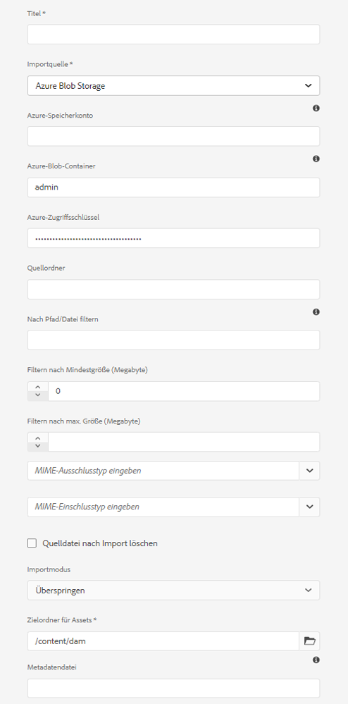

# hinzufügen digitale Assets als [!DNL Adobe Experience Manager] [!DNL Cloud Service] [!DNL Assets] {#add-assets-to-experience-manager} 

[!DNL Adobe Experience Manager Assets] akzeptiert viele Arten digitaler Assets aus vielen Quellen. Es speichert die Binärdateien und erstellten Darstellungen, kann die Asset-Verarbeitung mit einer Vielzahl von Workflows und [!DNL Adobe Sensei]-Dienste durchführen, ermöglicht die Verteilung durch viele Kanal über viele Oberflächen.

[!DNL Adobe Experience Manager]In wird der binäre Inhalt der hochgeladenen digitalen Dateien mit Rich-Metadaten, Smart-Tags, Ausgabedarstellungen und anderen DAM (Digital Asset Management)-Services erweitert. Sie können verschiedene Arten von Dateien (z. B. Bilder, Dokumente und Raw-Dateien) von Ihrem lokalen Ordner oder Netzlaufwerk in [!DNL Experience Manager Assets] hochladen.

Neben dem am häufigsten verwendeten Browser-Upload gibt es noch weitere Methoden zum Hinzufügen von Assets zum [!DNL Experience Manager]-Repository, einschließlich Desktop-Clients wie Adobe Asset Link oder [!DNL Experience Manager]-Desktop-Programm, Upload- und Aufnahmeskripte, die Kunden erstellen, und automatisierte Aufnahmeintegrationen, die als [!DNL Experience Manager]-Erweiterungen hinzugefügt werden.

Sie können zwar jede beliebige Binärdatei in [!DNL Experience Manager] hochladen und verwalten, aber die am häufigsten verwendeten Dateiformate bieten Unterstützung für zusätzliche Services, wie z. B. die Extraktion von Metadaten oder die Vorschau-/Ausgabedarstellungsgenerierung. Weitere Informationen finden Sie unter [Unterstützte Dateiformate](file-format-support.md).

Sie können sich auch dafür entscheiden, die hochgeladenen Assets zusätzlich zu bearbeiten. Für den Ordner, in den die Assets hochgeladen werden, kann eine Reihe von Asset-Verarbeitungsprofilen konfiguriert werden, um spezifische Metadaten, Ausgabedarstellungen oder Bildbearbeitungs-Service hinzuzufügen. Weitere Informationen finden Sie unter [Verarbeiten von Assets beim Hochladen](#process-when-uploaded).

[!DNL Assets] stellt die folgenden Methoden zum Hochladen bereit. Adobe empfiehlt, dass Sie Ihren Anwendungsfall und die Anwendbarkeit einer Upload-Option verstehen, bevor Sie sie verwenden.

| Upload-Methode | Anwendungsfall | Primärpersonen |
|---------------------|----------------|-----------------|
| [Benutzeroberfläche der Assets-Konsole](#upload-assets) | Gelegentliches Hochladen, einfaches Drücken und Ziehen, Finder-Upload. Verwenden Sie diese Option nicht, um eine große Anzahl von Assets hochzuladen. | Alle Benutzer |
| [Upload-API](#upload-using-apis) | Für dynamische Entscheidungen beim Hochladen. | Entwickler |
| [[!DNL Experience Manager] -Desktop-Programm](https://experienceleague.adobe.com/docs/experience-manager-desktop-app/using/using.html?lang=de) | Asset-Erfassung mit niedrigem Volumen, jedoch nicht für die Migration. | Administrator, Marketingexperte |
| [[!DNL Adobe Asset Link]](https://helpx.adobe.com/de/enterprise/admin-guide.html/enterprise/using/adobe-asset-link.ug.html) | Nützlich, wenn Kreative und Marketingexperten mit Assets aus den unterstützten [!DNL Creative Cloud]-Desktop-Programmen arbeiten. | Kreative, Marketingexperte |
| [Tool zur Asset-Massenaufnahme](#asset-bulk-ingestor) | Empfohlen für umfangreiche Migrationen und gelegentliche Massenaufnahmen. Nur für unterstützte Datenspeicher. | Administrator, Entwickler |

## Hochladen von Assets {#upload-assets}

<!-- #ENGCHECK do we support pausing? I couldn't get pause to show with 1.5GB upload.... If not, this should be removed#

   You can pause the uploading of large assets (greater than 500 MB) and resume it later from the same page. Tap the **[!UICONTROL Pause]** icon beside progress bar that appears when an upload starts.

   The size above which an asset is considered a large asset is configurable. For example, you can configure the system to consider assets above 1000 MB (instead of 500 MB) as large assets. In this case, **[!UICONTROL Pause]** appears on the progress bar when assets of size greater than 1000 MB are uploaded.

   The [!UICONTROL Pause] option does not show if a file greater than 1000 MB is uploaded with a file less than 1000 MB. However, if you cancel the less than 1000 MB file upload, the **[!UICONTROL Pause]** option appears.

   To modify the size limit, configure the `chunkUploadMinFileSize` property of the `fileupload` node in the CRX repository.

   When you click the **[!UICONTROL Pause]** icon, it toggles to a **[!UICONTROL Play]** icon. To resume uploading, click **[!UICONTROL Play]** option.
-->

<!-- #ENGCHECK do we support pausing? I couldn't get pause to show with 1.5GB upload.... If not, this should be removed#
   The ability to resume uploading is especially helpful in low-bandwidth scenarios and network glitches, where it takes a long time to upload a large asset. You can pause the upload operation and continue later when the situation improves. When you resume, uploading starts from the point where you paused it.
-->

<!-- #ENGCHECK assuming this is not relevant? remove after confirming#
   During the upload operation, [!DNL Experience Manager] saves the portions of the asset being uploaded as chunks of data in the CRX repository. When the upload completes, [!DNL Experience Manager] consolidates these chunks into a single block of data in the repository.

   To configure the cleanup task for the unfinished chunk upload jobs, go to `https://[aem_server]:[port]/system/console/configMgr/org.apache.sling.servlets.post.impl.helper.ChunkCleanUpTask`.
-->

Um eine Datei (oder mehrere Dateien) hochzuladen, können Sie diese auf Ihrem Desktop auswählen und in der Benutzeroberfläche (Webbrowser) in den Zielordner ziehen. Sie können den Upload auch über die Benutzeroberfläche starten.

1. Navigieren Sie in der [!DNL Assets]-Benutzeroberfläche zu dem Speicherort, an dem Sie digitale Assets hinzufügen möchten.
1. Führen Sie einen der folgenden Schritte aus, um die Assets hochzuladen:

   * Klicken Sie in der Symbolleiste auf **[!UICONTROL Erstellen]** > **[!UICONTROL Dateien]**. Sie können die Datei im angezeigten Dialogfeld bei Bedarf umbenennen.
   * Ziehen Sie die Assets in einem Browser, der HTML5 unterstützt, direkt auf die [!DNL Assets]-Benutzeroberfläche. Das Dialogfeld zum Umbenennen der Datei wird nicht angezeigt.

   

   Wenn Sie die Assets im Dialogfeld für die Dateiauswahl bei gedrückter `Ctrl`- oder `Command`-Taste markieren, können Sie mehrere Dateien auswählen. Bei Verwendung eines iPads können Sie jeweils nur eine Datei auswählen.

1. Um einen laufenden Upload abzubrechen, klicken Sie auf „Schließen“ (`X`) neben der Fortschrittsleiste. Wenn Sie den Upload abbrechen, löscht [!DNL Assets] den teilweise hochgeladenen Teil des Assets.
Wenn Sie das Hochladen abbrechen, bevor die Dateien hochgeladen sind, unterbricht [!DNL Assets] den Upload der aktuellen Datei und aktualisiert den Inhalt. Dateien, die bereits hochgeladen wurden, werden jedoch nicht gelöscht.

1. Das Dialogfeld für den Upload-Fortschritt in [!DNL Assets] zeigt die Anzahl der erfolgreich hochgeladenen Dateien und die der Dateien an, die nicht hochgeladen werden konnten.
Darüber hinaus zeigt die [!DNL Assets]-Benutzeroberfläche das zuletzt hochgeladene Asset oder den Ordner an, den Sie zuerst erstellt haben.

>[!NOTE]
>
>Informationen zum Hochladen verschachtelter Ordnerhierarchien finden Sie unter [Massen-Upload von Assets](#bulk-upload).

<!-- #ENGCHECK I'm assuming this is no longer relevant.... If yes, this should be removed#

### Serial uploads {#serialuploads}

Uploading numerous assets in bulk consumes significant I/O resources, which may adversely impact the performance of [!DNL Assets]. In particular, if you have a slow internet connection, the time to upload drastically increases due to a spike in disk I/O. Moreover, your web browser may introduce additional restrictions to the number of POST requests [!DNL Assets] can handle for concurrent asset uploads. As a result, the upload operation fails or terminate prematurely. In other words, [!DNL Assets] may miss some files while ingesting a bunch of files or altogether fail to ingest any file.

To overcome this situation, [!DNL Assets] ingests one asset at a time (serial upload) during a bulk upload operation, instead of the concurrently ingesting all the assets.

Serial uploading of assets is enabled by default. To disable the feature and allow concurrent uploading, overlay the `fileupload` node in CRX-DE and set the value of the `parallelUploads` property to `true`.

### Streamed uploads {#streamed-uploads}

If you upload many assets to [!DNL Experience Manager], the I/O requests to server increase drastically, which reduces the upload efficiency and can even cause some upload task to time out. [!DNL Assets] supports streamed uploading of assets. Streamed uploading reduces the disk I/O during the upload operation by avoiding asset storage in a temporary folder on the server before copying it to the repository. Instead, the data is transferred directly to the repository. This way, the time to upload large assets and the possibility of timeouts is reduced. Streamed upload is enabled by default in [!DNL Assets].

>[!NOTE]
>
>Streaming upload is disabled for [!DNL Experience Manager] running on JEE server with servlet-api version lower than 3.1.
-->

### Handhabung von Uploads, wenn das Asset bereits vorhanden ist {#handling-upload-existing-file}

Sie können ein Asset mit demselben Pfad (demselben Namen und demselben Speicherort) hochladen wie ein vorhandenes Asset. Es wird jedoch ein Warndialogfeld mit den folgenden Optionen angezeigt:

* Vorhandenes Asset ersetzen: Wenn Sie ein vorhandenes Asset ersetzen, werden die Metadaten für das Asset und sämtliche vorherigen Änderungen daran (z. B. Anmerkungen, Zuschnitte usw.) gelöscht.
* Eine andere Version erstellen: Eine neue Version des vorhandenen Assets wird im Repository erstellt. Sie können die beiden Versionen in der [!UICONTROL Zeitleiste] anzeigen und bei Bedarf zur bereits vorhandenen Version zurückkehren.
* Beibehalten: Wenn Sie beide Assets beibehalten möchten, wird das neue Asset umbenannt.

Um das doppelte-Asset in [!DNL Assets] beizubehalten, klicken Sie auf **[!UICONTROL Behalten]**. Klicken Sie zum Löschen des hochgeladenen Duplikat-Assets auf **[!UICONTROL Löschen]**.

### Behandlung von Dateinamen und unzulässige Zeichen {#filename-handling}

[!DNL Experience Manager Assets] versucht zu verhindern, dass Sie Assets hochladen, deren Dateinamen unzulässige Zeichen enthalten. Wenn Sie versuchen, ein Asset mit einem Dateinamen mit einem oder mehreren nicht zulässigen Zeichen hochzuladen, zeigt [!DNL Assets] eine Warnmeldung an und stoppt den Upload, bis Sie diese Zeichen entfernen oder mit einem zulässigen Namen hochladen.

Um bestimmte Dateibenennungskonventionen für Ihre Organisation einzuhalten, können Sie im Dialogfeld [!UICONTROL Assets hochladen] lange Namen für die Dateien angeben, die Sie hochladen möchten. Die folgenden Zeichen (in der Liste durch Leerzeichen getrennt) werden nicht unterstützt:

* Ungültige Zeichen für den Asset-Dateinamen `* / : [ \\ ] | # % { } ? &`
* Ungültige Zeichen für den Asset-Ordnernamen `* / : [ \\ ] | # % { } ? \" . ^ ; + & \t`

## Massen-Upload von Assets {#bulk-upload}

Das Tool zur Asset-Massenaufnahme kann eine sehr große Anzahl von Assets effizient verarbeiten. Eine Aufnahme in großem Umfang ist jedoch nicht nur ein großer Datei-Dump oder eine gelegentliche Migration. Damit eine umfangreiche Aufnahme ein aussagekräftiges Projekt ist, das Ihrem Geschäftszweck dient und effizient ist, müssen Sie die Migration planen und die Organisation der Assets kuratieren. Alle Aufnahmen sind unterschiedlich. Berücksichtigen Sie daher anstelle einer Verallgemeinerung die differenzierte Zusammensetzung des Repositorys und die Geschäftsanforderungen. Im Folgenden finden Sie einige übergreifende Vorschläge zum Planen und Ausführen einer Massenaufnahme:

* Assets kuratieren: Entfernen Sie Assets, die im DAM nicht benötigt werden. Sie sollten nicht verwendete, veraltete oder doppelte Assets entfernen. Dadurch werden die übertragenen Daten und die aufgenommenen Assets reduziert, was zu schnelleren Aufnahmen führt.
* Assets organisieren: Sie sollten den Inhalt in einer logischen Reihenfolge organisieren, z. B. nach Dateigröße, Dateiformat, Anwendungsfall oder Priorität. Im Allgemeinen erfordern große, komplexe Dateien mehr Verarbeitung. Sie können auch in Betracht ziehen, große Dateien mithilfe der Dateigrößenfilteroption (siehe unten) separat aufzunehmen.
* Aufnahmen staffeln: Erwägen Sie, Ihre Aufnahme in mehrere Massenaufnahmen zu unterteilen. Auf diese Weise können Sie Inhalte früher anzeigen und Ihre Aufnahme bei Bedarf aktualisieren. Beispielsweise können Sie verarbeitungsintensive Assets außerhalb der Spitzenzeiten oder schrittweise in mehreren Blöcken aufnehmen. Sie können aber auch kleinere und einfachere Assets, die nicht viel Verarbeitung erfordern, in einem Schritt aufnehmen.

Verwenden Sie einen der folgenden Ansätze, um eine größere Anzahl von Dateien hochzuladen. Weitere Informationen finden Sie unter [Anwendungsfälle und Methoden](#upload-methods-comparison).

* [Asset-Upload-APIs](developer-reference-material-apis.md#asset-upload-technical): Verwenden Sie ein benutzerdefiniertes Upload-Skript oder -Tool, das APIs nutzt, um bei Bedarf zusätzliche Verarbeitungsschritte für Assets hinzuzufügen (z. B. Metadaten übersetzen oder Dateien umbenennen).
* [[!DNL Experience Manager] -Desktop-Programm](https://experienceleague.adobe.com/docs/experience-manager-desktop-app/using/using.html): Nützlich für Kreativprofis und Marketing-Experten, die Assets aus ihrem lokalen Dateisystem hochladen. Verwenden Sie diese Option, um lokal verfügbare verschachtelte Ordner hochzuladen.
* [Tool zur Massenaufnahme](#asset-bulk-ingestor): Wird zum gelegentlichen oder anfänglichen Aufnehmen großer Mengen von Assets bei der Bereitstellung von [!DNL Experience Manager] verwendet.

### Tool zur Asset-Massenaufnahme {#asset-bulk-ingestor}

Das Tool wird nur der Administratorgruppe zur Verfügung gestellt, um Assets in großem Umfang aus Azure- oder S3-Datenspeichern aufzunehmen. Sehen Sie sich eine Video-Anleitung zur Konfiguration und Aufnahme an.

>[!VIDEO](https://video.tv.adobe.com/v/329680/?quality=12&learn=on)

Gehen Sie wie folgt vor, um das Tool zu konfigurieren:

1. Navigieren Sie zu **[!UICONTROL Tools]** > **[!UICONTROL Assets]** > **[!UICONTROL Massenimport]**. Wählen Sie die Option **[!UICONTROL Erstellen]** aus.

1. Geben Sie auf der Seite [!UICONTROL Konfiguration für Massenimport] die erforderlichen Werte ein.

   * [!UICONTROL Titel]: Ein beschreibender Titel.
   * [!UICONTROL Importquelle]: Wählen Sie die entsprechende Datenquelle aus.
   * [!UICONTROL Nach Mindestgröße filtern]: Geben Sie die Mindestdateigröße für Assets in MB an.
   * [!UICONTROL Nach Maximalgröße filtern]: Geben Sie die maximale Dateigröße für Assets in MB an.
   * [!UICONTROL Mime-Typen ausschließen]: Kommagetrennte Liste von MIME-Typen, die von der Aufnahme ausgeschlossen werden sollen. Beispiel: `image/jpeg, image/.*, video/mp4`.
   * [!UICONTROL Mime-Typen einschließen]: Kommagetrennte Liste von MIME-Typen, die in die Aufnahme einbezogen werden sollen. Siehe [alle unterstützten Dateiformate](/help/assets/file-format-support.md).
   * [!UICONTROL Importmodus]: Wählen Sie „Überspringen“, „Ersetzen“ oder „Version erstellen“ aus. Der Modus „Überspringen“ ist der Standardmodus. In diesem Modus überspringt das Aufnahme-Tool den Import eines Assets, wenn es bereits vorhanden ist. Siehe die Bedeutung der [Optionen zum Ersetzen und Erstellen von Versionen](#handling-upload-existing-file).
   * [!UICONTROL Zielordner für Assets]: Importordner in DAM, in den Assets importiert werden sollen. Beispiel: `/content/dam/imported_assets`

1. Sie können Ihre erstellten Konfigurationen für das Aufnahme-Tool löschen, ändern, ausführen und mehr. Wenn Sie eine Konfiguration für das Aufnahme-Tool auswählen, steht die folgende Option in der Symbolleiste zur Verfügung.

   * [!UICONTROL Bearbeiten]: Bearbeitet die ausgewählte Konfiguration.
   * [!UICONTROL Löschen] Löscht die ausgewählte Konfiguration.
   * [!UICONTROL Überprüfen]: Überprüft die Verbindung zum Datenspeicher.
   * [!UICONTROL Probelauf]: Ruft einen Testlauf der Massenaufnahme auf.
   * [!UICONTROL Ausführen]: Führt die ausgewählte Konfiguration aus.
   * [!UICONTROL Stopp]: Beendet eine aktive Konfiguration.
   * [!UICONTROL Plan]: Legen Sie einen einmaligen oder wiederkehrenden Zeitplan fest, um Assets zu erfassen.
   * [!UICONTROL Vorgangsstatus]: Zeigt den Status der Konfiguration an, wenn sie in einem laufenden Importauftrag oder für einen abgeschlossenen Auftrag verwendet wird.
   * [!UICONTROL Auftragsverlauf]: Frühere Instanzen des Auftrags.
   * [!UICONTROL Assets anzeigen]: Zeigt den Zielordner an, falls vorhanden.

   

Gehen Sie wie folgt vor, um einen einmaligen oder wiederholten Massenimport zu planen:

1. Erstellen Sie eine Massenimportkonfiguration.
1. Wählen Sie die Konfiguration aus und wählen Sie **[!UICONTROL Plan]** aus der Symbolleiste.
1. Legen Sie eine einmalige Erfassung fest oder planen Sie einen stündlichen, täglichen oder wöchentlichen Plan. Klicken Sie auf **[!UICONTROL Übermitteln]**.

   

## Hochladen von Assets mit Desktop-Clients {#upload-assets-desktop-clients}

Zusätzlich zur Webbrowser-Benutzeroberfläche unterstützt [!DNL Experience Manager] auch andere Clients auf dem Desktop. Sie bieten außerdem ein Upload-Erlebnis, ohne dass der Browser aufgerufen werden muss.

* [[!DNL Adobe Asset Link]](https://helpx.adobe.com/de/enterprise/using/adobe-asset-link.html) bietet den Zugriff auf Assets aus [!DNL Experience Manager] in Adobe Photoshop-, Adobe Illustrator- und Adobe InDesign-Desktop-Programmen. Sie können das aktuell geöffnete Dokument direkt über die Adobe Asset Link-Benutzeroberfläche in diesen Desktop-Programme in [!DNL Experience Manager] hochladen.
* Das [[!DNL Experience Manager] -Desktop-Programm](https://experienceleague.adobe.com/docs/experience-manager-desktop-app/using/using.html) vereinfacht die Arbeit mit Assets auf dem Desktop, unabhängig vom Dateityp oder dem nativen Programm, das diese verarbeitet. Es ist besonders nützlich, um Dateien in verschachtelten Ordnerhierarchien aus Ihrem lokalen Dateisystem hochzuladen, da der Browser-Upload nur das Hochladen flacher Dateilisten unterstützt.

## Verarbeiten von Assets beim Hochladen {#process-when-uploaded}

Um zusätzliche Verarbeitungsschritte für die hochgeladenen Assets durchzuführen, können Sie Verarbeitungsprofile auf die Upload-Ordner anwenden. Die Profile sind auf der Seite **[!UICONTROL Eigenschaften]** eines Ordners in [!DNL Assets] verfügbar. Ein digitales Asset ohne Erweiterung oder mit einer falschen Erweiterung wird nicht wie gewünscht verarbeitet. Beim Hochladen solcher Assets passiert beispielsweise nichts oder es kann ein falsches Profil für die Verarbeitung auf das Asset angewendet werden. Benutzer können die Binärdateien weiterhin im DAM speichern.

Die folgenden Registerkarten sind verfügbar:

* Mit [Metadatenprofilen](metadata-profiles.md) können Sie Standardeigenschaften für Metadaten auf Assets anwenden, die in diesen Ordner hochgeladen wurden.
* Mit [Verarbeitungsprofilen](asset-microservices-configure-and-use.md) können Sie mehr Ausgabedarstellungen generieren, als standardmäßig möglich sind.

Wenn [!DNL Dynamic Media] in Ihrer Bereitstellung aktiviert ist, stehen außerdem die folgenden Registerkarten zur Verfügung:

* Mit [[!DNL Dynamic Media] Bildprofilen](dynamic-media/image-profiles.md) können Sie bestimmte Zuschneidefunktionen (**[!UICONTROL Smarter Zuschnitt]** und Pixelzuschnitt) und Scharfzeichnungskonfigurationen auf die hochgeladenen Assets anwenden.
* Mit [[!DNL Dynamic Media] Videoprofilen](dynamic-media/video-profiles.md) können Sie bestimmte Videokodierungsprofile (Auflösung, Format, Parameter) anwenden.

>[!NOTE]
>
>[!DNL Dynamic Media]-Zuschnitt und andere Vorgänge für Assets sind zerstörungsfrei. Die Vorgänge ändern das hochgeladene Original nicht. Stattdessen werden Parameter zum Zuschneiden oder Transformieren bei der Übergabe der Assets bereitgestellt.

Für Ordner mit zugewiesenem Verarbeitungsprofil wird der Profilname in der Miniaturansicht der Kartenansicht angezeigt. In der Listenansicht wird der Profilname in der Spalte **[!UICONTROL Verarbeitungsprofil]** angezeigt.

## Hochladen oder Aufnehmen von Assets mit APIs {#upload-using-apis}

Technische Details zu den Upload-APIs und dem Protokoll sowie Links zu Open-Source-SDK und Beispiel-Clients finden Sie im Abschnitt zum [Asset-Upload](developer-reference-material-apis.md#asset-upload-technical) in der Entwicklerreferenz.

## Tipps, Best Practices und Einschränkungen {#tips-limitations}

* Das direkte binäre Hochladen ist eine neue Methode zum Hochladen von Assets. Es wird standardmäßig von den Produktfunktionen und Clients wie [!DNL Experience Manager]-Benutzeroberfläche, [!DNL Adobe Asset Link] und [!DNL Experience Manager] Desktop-App unterstützt. Jeder benutzerspezifische Code, der von technischen Teams von Kunden angepasst oder erweitert wird, muss die neuen Upload-APIs und -Protokolle verwenden.

* Adobe empfiehlt, in jedem Ordner unter [!DNL Experience Manager Assets] nicht mehr als 1000 Assets hinzuzufügen. Sie können zwar weitere Assets zu einem Ordner hinzufügen, es kann jedoch zu Leistungsproblemen wie einer langsameren Navigation in diesen Ordnern kommen.

* Wenn Sie im Dialogfeld [!UICONTROL Namenskonflikt] die Option **[!UICONTROL Ersetzen]** auswählen, wird die Asset-ID für das neue Asset neu generiert. Diese ID unterscheidet sich von der ID des vorherigen Assets. Wenn [Asset Insights](/help/assets/assets-insights.md) aktiviert ist, um Impressionen oder Klicks mit [!DNL Adobe Analytics] zu verfolgen, macht die neu generierte Asset-ID die für das Asset erfassten Daten für [!DNL Analytics] ungültig.

* Einige Methoden zum Hochladen hindern Sie nicht daran, Assets mit [verbotenen Zeichen](#filename-handling) in die Dateinamen hochzuladen. Die Zeichen werden durch das Symbol `-` ersetzt.

* Beim Hochladen von Assets mit dem Browser werden nur einfache Listen und nicht verschachtelte Ordnerhierarchien unterstützt. Um alle Assets innerhalb des verschachtelten Ordners hochzuladen, sollten Sie [Desktop-App](#upload-assets-desktop-clients) verwenden.

<!-- TBD: Link to file name handling in DA docs when it is documented. 
-->

>[!MORELIKETHIS]
>
>* [[!DNL Adobe Experience Manager] -Desktop-Programm](https://experienceleague.adobe.com/docs/experience-manager-desktop-app/using/introduction.html?lang=de)
>* [Info [!DNL Adobe Asset Link]](https://www.adobe.com/de/creativecloud/business/enterprise/adobe-asset-link.html)
>* [[!DNL Adobe Asset Link] Dokumentation](https://helpx.adobe.com/enterprise/using/adobe-asset-link.html)
>* [Technische Referenz zum Asset-Upload](developer-reference-material-apis.md#asset-upload-technical)

