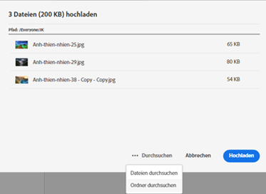
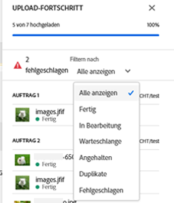
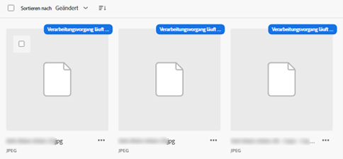
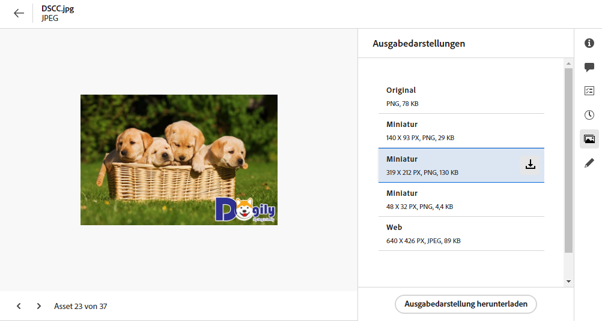
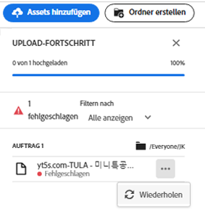
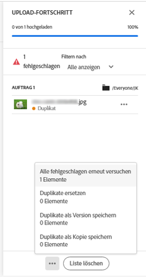

# Hochladen von Assets {#add-assets}

Um neue Assets hinzuzufügen, mit denen Sie arbeiten können, laden Sie einige Assets aus Ihrem lokalen Dateisystem hoch. <!-- TBD: Many of the [common file formats are supported](/help/assets/supported-file-formats-assets-view.md). -->

Sie können die folgenden Methoden verwenden, um ein oder mehrere Assets oder einen Ordner mit Assets hochzuladen:

* Ziehen Sie Assets oder Ordner auf die Benutzeroberfläche und befolgen Sie die Anweisungen auf dem Bildschirm.
* Klicken Sie in der Symbolleiste auf die Option **[!UICONTROL Assets hinzufügen]** und fügen Sie einige Dateien zum Upload-Dialogfeld hinzu.

<!-- TBD: Update this GIF
 -->

Nachdem Sie einen Ordner erstellt haben, können Sie eine dieser Methoden verwenden, um Assets hochzuladen. Um einen leeren Ordner zu erstellen, klicken Sie in der Symbolleiste auf **[!UICONTROL Ordner erstellen]**. [!DNL Assets view] bietet eine leistungsstarke Volltext-Suchfunktion, Sie können aber auch Ordner verwenden, um Ihre Assets besser zu organisieren.

Nachdem Sie die Dateien ausgewählt haben, sehen Sie ein Bestätigungsdialogfeld, in dem Sie weitere Dateien hinzufügen oder bereits ausgewählte Dateien entfernen können. Um einer Auswahl weitere Dateien hinzuzufügen, klicken Sie auf **[!UICONTROL Durchsuchen]** und wählen Sie **[!UICONTROL Dateien durchsuchen]** oder **[!UICONTROL Ordner durchsuchen]** aus. Fügen Sie weitere Dateien oder Ordner aus demselben oder einem anderen Ordner hinzu.

Sobald alle Dateien in die Warteschlange gestellt sind, klicken Sie auf **[!UICONTROL Hochladen]**.

*Abbildung: Vor dem Hochladen der ausgewählten Assets können Sie Assets zur Warteschlange hinzufügen oder daraus entfernen.*

>[!TIP]
>
>Sie können Ordnerstrukturen in der Assets-Ansicht direkt hochladen und müssen keine ZIP-Datei mit der Ordnerstruktur erstellen. Eine in die Assets-Ansicht hochgeladene ZIP-Datei wird als ein einzelnes ZIP-Asset gespeichert und nach dem Hochladen nicht automatisch extrahiert.

## Anzeigen von Upload-Fortschritt und -Status {#upload-progress}

Wenn Sie viele Assets oder verschachtelte Ordner in [!DNL Assets view] hochladen, werden einige Assets möglicherweise aus verschiedenen Gründen (z. B. Probleme mit doppelten Assets oder dem Netzwerk) nicht hochgeladen.

Um den Upload-Fortschritt zu verfolgen, klicken Sie in der Symbolleiste auf die Option **[!UICONTROL Upload-Fortschritt]**. In einem Bedienfeld wird der Upload-Fortschritt aller Assets angezeigt.

Um eine Teilmenge von Assets basierend auf dem Upload-Fortschritt oder -Status anzuzeigen, verwenden Sie den Filter in der Seitenleiste **[!UICONTROL Upload-Fortschritt]**. Die verschiedenen Filter umfassen die Anzeige aller Assets, abgeschlossener Uploads, laufender Uploads, hochzuladender Assets in der Warteschlange, angehaltener Uploads, doppelter Assets und Assets, die nicht hochgeladen werden konnten.

*Abbildung: Filtern der Assets, die Sie hochzuladen versucht haben, nach ihrem Upload-Status oder Upload-Fortschritt.*

Unmittelbar nach dem Hochladen der Assets verarbeitet [!DNL Assets view] die Assets, um Miniaturansichten zu generieren und Metadaten zu verarbeiten. Bei vielen Assets dauert die Verarbeitung einige Zeit. Wenn keine Miniaturansicht angezeigt wird und eine Verarbeitungsmeldung an der Platzhalter-Miniaturansicht angezeigt wird, überprüfen Sie den Ordner nach einigen Minuten erneut. Während der Verarbeitung generiert [!DNL Assets view] u. a. die Ausgabedarstellungen, fügt Smart-Tags hinzu und indiziert die Asset-Details für die Suche.

*Abbildung: Hochgeladene Assets zeigen auf der Kachel an, dass sie verarbeitet werden.*

## Asset-Ausgabedarstellungen {#renditions}

[!DNL Assets view] verarbeitet die hochgeladenen Assets nahezu in Echtzeit und generiert für viele unterstützte Dateitypen Ausgabedarstellungen. Bei Bildern sind die Ausgabedarstellungen verkleinerte Versionen des hochgeladenen Bildes. Sie können nicht nur das Asset, sondern auch die Ausgabedarstellungen herunterladen, um eine passende Version zu verwenden. Sie können alle Ausgabedarstellungen eines Assets sehen, wenn Sie [ein Asset in der Vorschau anzeigen](/help/assets/navigate-assets-view.md#preview-assets).

*Abbildung: Anzeigen und Herunterladen von Ausgabedarstellungen.*

## Fehlgeschlagene Uploads verwalten {#resolve-upload-fails}

Wenn das Hochladen eines unterstützten Assets aus irgendeinem Grund fehlschlägt, klicken Sie im Bereich [!UICONTROL Upload-Fortschritt] auf **[!UICONTROL Wiederholen]**.

*Abbildung: Wiederholung, wenn eine unterstützte Datei aus irgendeinem Grund nicht hochgeladen werden konnte.*

Wenn Sie versuchen, doppelte Assets hochzuladen, werden die Assets erst hochgeladen, nachdem Sie den Upload ausdrücklich bestätigt haben. Zunächst werden die doppelten Assets als fehlgeschlagene Uploads markiert. Um dieses Problem zu beheben, können Sie einfach eine Version erstellen, die vorhandenen Assets löschen und ersetzen oder ein Duplikat erstellen, indem Sie das Asset umbenennen. Sie können solche Fehler einzeln für jeweils ein Asset beheben oder diesen Vorgang in einem Schritt für alle fehlgeschlagenen Duplikate durchführen.

*Abbildung: Beheben Sie das Problem bei doppelten Assets, die standardmäßig nicht hochgeladen werden konnten, einzeln.*

*Abbildung: Beheben Sie bei doppelten Assets, die standardmäßig nicht hochgeladen werden können, die Probleme bei allen Assets gleichzeitig.*

>[!TIP]
>
>Sie können Assets direkt aus Ihren [!DNL Creative Cloud]-Desktop-Anwendungen in das DAM-Repository hochladen.
<!--TBD
See how [[!DNL Assets view] integrates with [!DNL Adobe Asset Link]](/help/assets/integration-assets-view.md).
-->

## Löschen von Assets oder Ordnern {#delete-assets}

Benutzer können nicht mehr benötigte einzelne Assets oder Ordner löschen. Führen Sie einen der folgenden Schritte aus, um ein Asset oder einen Ordner zu löschen:

* Verwenden Sie die Option, die auf der Miniaturansicht eines Assets oder Ordners verfügbar ist.

  

  *Abbildung: Aktionen für Dateien und Ordner sind auf der Asset- oder Ordnerkachel verfügbar.*

* Wählen Sie ein Asset oder einen Ordner aus und klicken Sie in der Symbolleiste auf **[!UICONTROL Löschen]** .

## Nächste Schritte {#next-steps}

* [Sehen Sie sich ein Video zum Hochladen von Assets in der Assets-Ansicht an](https://experienceleague.adobe.com/docs/experience-manager-learn/assets-essentials/basics/creating.html?lang=de)

* Geben Sie Produkt-Feedback über die Option [!UICONTROL Feedback] in der Benutzeroberfläche der Assets-Ansicht

* Geben Sie Feedback zur Dokumentation durch  über die Option [!UICONTROL Diese Seite bearbeiten] oder durch  über die Option [!UICONTROL Problem protokollieren] in der rechten Seitenleiste

* Kontaktieren Sie die [Kundenunterstützung](https://experienceleague.adobe.com/?support-solution=General&lang=de#support)
