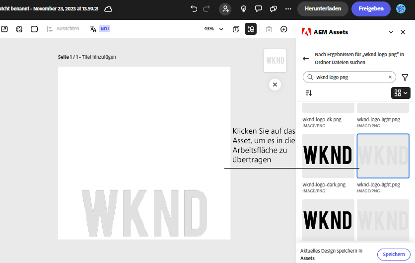

# AEM Assets-Add-on für Adobe Express {#assets-addon-adobe-express}

Mit dem AEM Assets-Add-on für Adobe Express können Sie über die Adobe Express-Benutzeroberfläche direkt auf die in AEM Assets gespeicherten Assets zugreifen. Sie können in AEM Assets verwaltete Inhalte auf der Express-Arbeitsfläche platzieren und dann neue oder bearbeitete Inhalte in einem AEM Assets-Repository speichern. Das Add-on bietet die folgenden Hauptvorteile:

* Verbesserte Wiederverwendung von Inhalten durch Bearbeiten und Speichern neuer Assets in AEM

* Verringerter Zeit- und Arbeitsaufwand beim Erstellen neuer Assets oder Erstellen neuer Versionen vorhandener Assets

## Voraussetzungen {#prerequisites}

Berechtigungen für den Zugriff auf Adobe Express und mindestens eine Umgebung in AEM Assets. Die Umgebung kann eines der Repositorys in Assets as a Cloud Service oder Assets Essentials sein.

## Hinzufügen des AEM Assets-Add-ons zu Adobe Express {#access-assets-addon}

Führen Sie die folgenden Schritte aus, um das AEM Assets-Add-zu Adobe Express hinzuzufügen:

1. Öffnen Sie die Adobe Express-Web-Anwendung.

1. Öffnen Sie eine neue leere Arbeitsfläche, indem Sie eine neue Vorlage oder ein Projekt laden oder ein Asset erstellen.

1. Klicken Sie im linken Navigationsbereich auf **[!UICONTROL Add-ons]**.

1. Geben Sie **[!UICONTROL AEM Assets]** in der Suchleiste oben im Abschnitt [!UICONTROL Add-ons] ein und klicken Sie auf das AEM Assets-Add-on.

   

1. Klicken Sie auf **[!UICONTROL Hinzufügen]**. Das Add-on wird in der Liste des Abschnitts **[!UICONTROL Ihre Add-ons]** angezeigt. Klicken Sie erneut auf das Add-on, um die Inhalte im rechten Navigationsbereich anzuzeigen. Das Add-on zeigt die Liste der Repositorys an, auf die Sie Zugriff haben, zusammen mit der Liste der Assets und Ordner, die auf der Stammebene verfügbar sind.

   Verwenden Sie die Suchleiste, um nach Assets zu suchen, die Sie auf der Arbeitsfläche verwenden müssen.

   

   A. Wählen Sie Ihr AEM Assets-Repository aus B. Suchen Sie mithilfe der Suchleiste nach Assets C. Sortieren Sie die Assets in auf- oder absteigender Reihenfolge D. Die am ausgewählten Speicherort verfügbaren Assets und Ordner. E. Speichern Sie Ihre Änderungen in AEM Assets

## Verwenden von AEM Assets im Adobe Express-Editor {#use-aem-assets-in-express}

Nachdem Sie das AEM Assets-Add-on zu Adobe Express hinzugefügt haben, können Sie mit der Verwendung von PNG- und JPEG-Bildern beginnen, die im AEM Assets-Repository auf der Express-Arbeitsfläche gespeichert sind. Navigieren Sie zum entsprechenden Ordner und klicken Sie auf das Asset, um es in die Arbeitsfläche aufzunehmen.

## Speichern von Adobe Express-Projekten in AEM Assets {#save-express-projects-in-assets}

Nachdem Sie entsprechende Änderungen in die Express-Arbeitsfläche eingefügt haben, können Sie sie im AEM Assets-Repository speichern.

1. Klicken Sie auf **[!UICONTROL Speichern]**, um das Dialogfeld **[!UICONTROL Hochladen]** zu öffnen.
1. Geben Sie einen Namen und ein Format für das Asset an. Sie können den Inhalt der Arbeitsfläche im PNG- oder JPEG-Format speichern.

1. Klicken Sie auf das Ordnersymbol neben dem Feld **[!UICONTROL Speicherort]**, navigieren Sie zu dem Speicherort, an dem Sie das Asset speichern müssen, und klicken Sie auf **[!UICONTROL Auswählen]**. Der Name des Ordners wird im Feld **[!UICONTROL Speicherort]** angezeigt.

1. Klicken Sie auf **[!UICONTROL Hochladen]**, um das Asset in AEM Assets hochzuladen.

   
