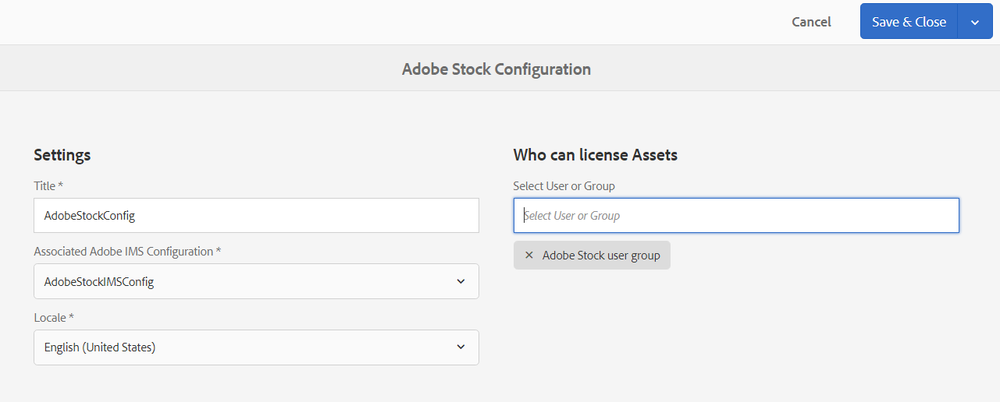

# Verwenden von [!DNL Adobe Stock]-Assets in [!DNL Adobe Experience Manager Assets] {#use-adobe-stock-assets-in-aem-assets}

<table>
    <tr>
        <td>
            <i>Neu</i> <a href="/help/assets/dynamic-media/dm-prime-ultimate.md"><b>Dynamic Media Prime und Ultimate</b></a>
        </td>
        <td>
            <i>Neu</i> <a href="/help/assets/assets-ultimate-overview.md"><b>AEM Assets Ultimate</b></a>
        </td>
        <td>
            <i>Neu</i> <a href="/help/assets/integrate-aem-assets-edge-delivery-services.md"><b>AEM Assets-Integration mit Edge Delivery Services</b></a>
        </td>
        <td>
            <i>Neu</i> <a href="/help/assets/aem-assets-view-ui-extensibility.md"><b>Erweiterbarkeit der Benutzeroberfläche</b></a>
        </td>
          <td>
            <i>Neu</i> <a href="/help/assets/dynamic-media/enable-dynamic-media-prime-and-ultimate.md"><b>Aktivieren von Dynamic Media Prime und Ultimate</b></a>
        </td>
    </tr>
    <tr>
        <td>
            <a href="/help/assets/search-best-practices.md"><b>Best Practices für die Suche</b></a>
        </td>
        <td>
            <a href="/help/assets/metadata-best-practices.md"><b>Best Practices für Metadaten</b></a>
        </td>
        <td>
            <a href="/help/assets/product-overview.md"><b>Content Hub</b></a>
        </td>
        <td>
            <a href="/help/assets/dynamic-media-open-apis-overview.md"><b>Dynamic Media mit OpenAPI-Funktionen</b></a>
        </td>
        <td>
            <a href="https://developer.adobe.com/experience-cloud/experience-manager-apis/"><b>Entwicklerdokumentation zu AEM Assets</b></a>
        </td>
    </tr>
</table>

| Version | Artikel-Link |
| -------- | ---------------------------- |
| AEM 6.5 | [Hier klicken](https://experienceleague.adobe.com/docs/experience-manager-65/assets/using/aem-assets-adobe-stock.html?lang=de) |
| AEM as a Cloud Service | Dieser Artikel |

Der [!DNL Adobe Stock]-Service bietet Designern und Unternehmen Zugang zu Millionen von hochwertigen, kuratierten und gebührenfreien Fotos, Vektorgrafiken, Illustrationen, Videos, Vorlagen und 3D-Assets für sämtliche Kreativprojekte. 

Das Angebot von [!DNL Adobe Stock] für Unternehmen umfasst standardmäßig Freigabeberechtigungen innerhalb der Organisation. Nachdem ein Asset von einem Benutzer Ihrer Organisation lizenziert wurde, können andere Benutzer Ihrer Organisation dieses Asset identifizieren, herunterladen und verwenden, ohne es erneut lizenzieren zu müssen. Sobald ein Asset von Ihrer Organisation lizenziert wurde, ist das Recht zur Verwendung dieses Assets dauerhaft.

Organisationen können ihr [!DNL Adobe Stock]-Unternehmensabo mit [!DNL Experience Manager Assets] integrieren, damit lizenzierte Assets für kreative und Marketing-Projekte umfassend verfügbar sind und mit den leistungsstarken Asset-Management-Funktionen von [!DNL Experience Manager] verwaltet werden können. [!DNL Experience Manager]-Benutzer können Adobe Stock-Assets, die in [!DNL Experience Manager] gespeichert sind, schnell finden, eine Vorschau anzeigen und die Lizenz abrufen, ohne die [!DNL Experience Manager]-Oberfläche zu verlassen.

## Voraussetzungen zur Integration von [!DNL Experience Manager] und [!DNL Adobe Stock] {#integrate-aem-and-adobe-stock}

[!DNL Experience Manager Assets] bietet Benutzenden die Möglichkeit, [!DNL Adobe Stock]-Assets direkt von [!DNL Experience Manager] aus zu suchen, eine Vorschau anzuzeigen, sie zu speichern und zu lizenzieren.

Die folgenden Anforderungen müssen für diese Integration erfüllt sein:

* Es muss eine [!DNL Experience Manager Assets] as a [!DNL Cloud Service]-Instanz ausgeführt werden.
* Es muss ein Unternehmens-Abo für [!DNL Adobe Stock] vorhanden sein.
* Eine Benutzerin oder ein Benutzer muss in der [!DNL Admin Console] über Berechtigungen für das standardmäßige Stock-Produktprofil verfügen.
* Eine Benutzerin oder ein Benutzer muss über Berechtigungen für das [!DNL Developer Access profile] zum Erstellen der Integration in [!DNL Adobe Developer Console] verfügen.

Ein Unternehmens-Abo von [!DNL Adobe Stock],

* bietet Produktberechtigungen für [!DNL Adobe Stock] (Stocks im Zusammenhang mit Experience Manager),
* umfasst die Credits, die für Ihre Stock-Berechtigung in der [!DNL Adobe Admin Console] erworben wurden,
* ermöglicht die globale Verwaltung von Credits und Lizenzen innerhalb der [!DNL Adobe Admin Console].

Im Rahmen der Berechtigung ist ein standardmäßiges Produktprofil für [!DNL Adobe Stock] in [!DNL Admin Console] vorhanden. Es können mehrere Profile erstellt werden. Diese Profile bestimmen, wer Stock-Assets lizenzieren kann. Ein Benutzer mit direktem Zugriff auf das Produktprofil kann auf [https://stock.adobe.com/de](https://stock.adobe.com/de) zugreifen und Stock-Assets lizenzieren. Es gibt jedoch eine andere Methode, mit dem Entwicklerzugriff eine Integration (API) zu erstellen. Diese Integration authentifiziert die Kommunikation zwischen [!DNL Experience Manager Assets] und [!DNL Adobe Stock].

<!--
### Create an IMS configuration {#create-an-ims-configuration}

1. In the [!DNL Experience Manager] user interface, navigate to **[!UICONTROL Tools]** > **[!UICONTROL Security]** > **[!UICONTROL Adobe IMS Configurations]**. Click **[!UICONTROL Create]** and select **[!UICONTROL Cloud Solution]** > **[!UICONTROL Adobe Stock]**.
1. Either reuse an existing certificate or select **[!UICONTROL Create new certificate]**.
1. Click **[!UICONTROL Create certificate]**. Once created, download the public key. Click **[!UICONTROL Next]**. Leave the [!UICONTROL Adobe IMS Technical Account Configuration] screen open to provide the required values shortly.
1. Access [Adobe Developer Console](https://console.adobe.io). Ensure that your account has administrator permissions for the organization for which the integration is required.
1. Click **[!UICONTROL Create new project]** and click **[!UICONTROL Add API]**. Select **[!UICONTROL Adobe Stock]** from the list of APIs that are available to you. Select [!UICONTROL OAUTH 2.0 Web].
1. Provide **[!UICONTROL Default redirect URI]** and **[!UICONTROL Redirect URI pattern]** values. Click **[!UICONTROL Save configured API]**. Copy the generated ID and secret.
1. In [!UICONTROL Adobe IMS Technical Account Configuration] screen, provide the values in the boxes titled **[!UICONTROL Title]**, **[!UICONTROL Authorization Server]**, **[!UICONTROL API Key]**, **[!UICONTROL Client Secret]**, and **[!UICONTROL Payload]**. For detailed information about these values, see [JWT authentication quick start](https://www.adobe.io/authentication/auth-methods.html#!AdobeDocs/adobeio-auth/master/JWT/JWT.md).
-->

<!-- 
TBD: Update the URL to update the terminology when AIO team updates their documentation URL. Logged issue github.com/AdobeDocs/adobeio-auth/issues/63.
-->

<!--
### Create [!DNL Adobe Stock] configuration in [!DNL Experience Manager] {#create-adobe-stock-configuration-in-aem}

1. In the [!DNL Experience Manager], navigate to **[!UICONTROL Tools]** > **[!UICONTROL Cloud Services]** > **[!UICONTROL Adobe Stock]**.
1. Click **[!UICONTROL Create]** to create a configuration and associate it with your existing IMS Configuration. Select `PROD` as the environment parameter.
1. In **[!UICONTROL Licensed Assets Path]** field, leave a location as is. Do not change the location where you want to store the [!DNL Adobe Stock] assets.
1. Complete creation by adding all the required properties. Click **[!UICONTROL Save & Close]**.
1. Add [!DNL Experience Manager] users or groups, who can license the assets.

>[!NOTE]
>
>If there are multiple [!DNL Adobe Stock] configurations, select the desired configuration in User Preferences panel. To access the panel from Experience Manager home page, click the user icon and then click **[!UICONTROL User Preferences]** > **[!UICONTROL Stock Configuration]**.
-->

## Integrieren von [!DNL Experience Manager] und [!DNL Adobe Stock] {#integrate-adobe-stock-with-aem-assets}

Führen Sie als Entwicklungsperson die folgenden Schritte aus, um [!DNL Adobe Experience Manager] und [!DNL Adobe Stock] zu integrieren:

<!--
1. [Obtain public certificate](#public-certificate)
   
   In [!DNL Experience Manager], create an IMS account and generate a public certificate (public key).

1. [Create service account (JWT) connection](#createnewintegration) 
   
   In [!DNL Adobe Developer Console], create a project for your [!DNL Adobe Stock] organization. Under the project, configure an API using the public key to create a service account (JWT) connection. Get the service account credentials and JWT payload information.

1. [Configure IMS account](#create-ims-account-configuration)

   In [!DNL Experience Manager], configure the IMS account using the service account credentials and JWT payload.

1. [Configure cloud service](#configure-the-cloud-service)

   In [!DNL Experience Manager], configure an [!DNL Adobe Stock] cloud service using the IMS account.

### Create an IMS configuration {#create-an-ims-configuration}

The IMS configuration authenticates your [!DNL Experience Manager Assets] author instance with the [!DNL Adobe Stock] entitlement. 

IMS configuration includes two steps:

* [Obtain public certificate](#public-certificate) 
* [Configure IMS account](#create-ims-account-configuration)

### Obtain public certificate {#public-certificate}

The public key (certificate) authenticates your product profile in Adobe Developer Console.

1. Log in to your [!DNL Experience Manager Assets] cloud instance.

1. From the **[!UICONTROL Tools]** panel, navigate to **[!UICONTROL Security]** > **[!UICONTROL Adobe IMS Configurations]**.

1. In Adobe IMS Configurations page, click **[!UICONTROL Create]**. The **[!UICONTROL Adobe IMS Technical Account Configuration]** page opens. 

1. In the **[!UICONTROL Certificate]** tab, select **[!UICONTROL Adobe Stock]** from the **[!UICONTROL Cloud Solution]** drop-down list.  

1. You can create a certificate or reuse an existing certificate for the configuration. 

   To create a certificate, select the **[!UICONTROL Create new certificate]** check box and specify an **alias** for the public key. The alias serves as name of the public key. 

1. Click **[!UICONTROL Create certificate]**. Then, click **[!UICONTROL OK]** to generate the public key.

1. Click the **[!UICONTROL Download Public Key]** icon and save the public key (.crt) file on your machine. The public key is used later to configure API for your Brand Portal tenant and generate service account credentials in Adobe Developer Console.

   Click **[!UICONTROL Next]**.

   

1. In the **Account** tab, Adobe IMS account is created which requires the service account credentials.

   Open a new tab and [create a service account (JWT) connection in Adobe Developer Console](#createnewintegration). 

### Create service account (JWT) connection {#createnewintegration}

In Adobe Developer Console, projects and APIs are configured at organization level. Configuring an API creates a service account (JWT) connection. There are two methods to configure API, by generating a key pair (private and public keys) or by uploading a public key. In this example, the service account credentials are generated by uploading the public key.

To generate the service account credentials and JWT payload:

1. Log in to Adobe Developer Console with system administrator privileges. The default URL is [https://www.adobe.com/go/devs_console_ui](https://www.adobe.com/go/devs_console_ui).

   Ensure that you have selected the correct IMS organization (Stock entitlement) from the drop-down (organization) list.

1. Click **[!UICONTROL Create new project]**. A blank project with a system-generated name is created for your organization. 

   Click **[!UICONTROL Edit project]**. Update the **[!UICONTROL Project Title]** and **[!UICONTROL Description]**, and then click **[!UICONTROL Save]**.
   
1. In the **[!UICONTROL Project overview]** tab, click **[!UICONTROL Add API]**.

1. In the **[!UICONTROL Add an API window]**, select **[!UICONTROL Adobe Stock]**. Click **[!UICONTROL Next]**. 

1. In the **[!UICONTROL Configure API]** window, select **[!UICONTROL Service Account (JWT)]** authentication. Click **[!UICONTROL Next]**.

   

1. Click **[!UICONTROL Upload your public key]**. Click **[!UICONTROL Select a File]** and upload the public key (.crt file) that you have downloaded in the [obtain public certificate](#public-certificate) section. Click **[!UICONTROL Next]**.

1. Verify the public key and click **[!UICONTROL Next]**.

1. Select the default **[!UICONTROL Adobe Stock]** product profile and click **[!UICONTROL Save configured API]**. 

1. Once the API is configured, you are redirected to the API overview page. From the left navigation under **[!UICONTROL Credentials]**, click the **[!UICONTROL Service Account (JWT)]** option. Here, you can view the credentials and perform actions such as generate JWT tokens, copy credential details, and retrieve client secret.

1. From the **[!UICONTROL Client Credentials]** tab, copy the **[!UICONTROL client ID]**. 

   Click **[!UICONTROL Retrieve Client Secret]** and copy the **[!UICONTROL client secret]**.

   

1. Navigate to the **[!UICONTROL Generate JWT]** tab and copy the **[!UICONTROL JWT Payload]** information. 

You can now use the client ID (API key), client secret, and JWT payload to [configure the IMS account](#create-ims-account-configuration) in [!DNL Experience Manager Assets].

### Configure IMS account {#create-ims-account-configuration}

You must have the [certificate](#public-certificate) and [service account (JWT) credentials](#createnewintegration) to configure the IMS account.

To configure the IMS account: 

1. Open the IMS Configuration and navigate to the **[!UICONTROL Account]** tab. You kept the page open while [obtaining the public certificate](#public-certificate).

1. Specify a **[!UICONTROL Title]** for the IMS account.

   In the **[!UICONTROL Authorization Server]** field, enter the URL: [https://ims-na1.adobelogin.com/](https://ims-na1.adobelogin.com/).  

   Enter the client ID in the **[!UICONTROL API key]** field, **[!UICONTROL Client Secret]**, and **[!UICONTROL Payload]** (JWT payload) that you have copied while [creating the service account (JWT) connection](#createnewintegration).

1. Click **[!UICONTROL Create]**. An IMS account configuration is created. 

   
   
1. Select the IMS account configuration and click **[!UICONTROL Check Health]**.

   Click **[!UICONTROL Check]** in the dialog box. On successful configuration, a message appears that the *Token is retrieved successfully*.

   
-->

1. [Einrichten eines Programms in der [!DNL Developer Console]](#set-up-a-program-in-developer-console)
1. [Hinzufügen der Konfiguration in der Autoreninstanz von [!DNL AEM] ](#add-configuration-in-the-aem-author-instance)

### Einrichten eines Programms in der [!DNL Developer Console] {#set-up-a-program-in-developer-console}

Führen Sie die folgenden Schritte aus, um ein Programm in der [!DNL Developer Console] einzurichten:
1. Navigieren Sie zur [[!DNL Adobe Developer Console]](https://developer.adobe.com/console/14431/user/servicesandapis) und melden Sie sich bei Ihrer Organisation an.
1. Wählen Sie die Option **[!UICONTROL Create new project]** (Neues Projekt erstellen) aus, die im Dashboard **[!UICONTROL Projects]** (Projekte) verfügbar ist.
   
1. Klicken Sie auf **[!UICONTROL Add to project]** (Zum Projekt hinzufügen) und wählen Sie **[!UICONTROL API]** aus.
1. Wählen Sie **[!UICONTROL Adobe Stock]** aus und klicken Sie auf **[!UICONTROL Next]** (Weiter).
1. Geben Sie einen **[!UICONTROL Berechtigungsnamen]** an, stellen Sie sicher, dass **[!UICONTROL OAuth Server-to-Server]** (OAuth-Server-zu-Server) ausgewählt ist, und klicken Sie dann auf **[!UICONTROL Next]** (Weiter).
1. Wählen Sie das **[!UICONTROL Produktprofil]** für **[!UICONTROL AEM Assets]** aus und klicken Sie auf **[!UICONTROL Save Configured API]** (Konfiguriertes API speichern). Es wird eine Erfolgsmeldung angezeigt, die bestätigt, dass Sie ein Projekt in der [!DNL Developer Console] erstellt haben. Das Dashboard Ihres Projekts wird geöffnet und zeigt oben den Projektnamen, **[!UICONTROL Adobe Stock]** unter **[!UICONTROL APIS]**, **[!UICONTROL AEM Assets]** unter **[!UICONTROL Product profile]** (Produktprofil) und die Berechtigungskarte **[!UICONTROL OAuth Server-to-Server]** unter **[!UICONTROL Connected Credentials]** (Verbundene Anmeldedaten) an.
   
1. Wählen Sie die Berechtigungskarte **[!UICONTROL OAuth Server-to-Server]** aus. Daraufhin werden die **[!UICONTROL Berechtigungsdetails]** angezeigt. Verwenden Sie diese [!DNL OAuth Server-to-Server]-Berechtigungsdetails Ihres Projekts wie **[!UICONTROL Client-ID]**, **[!UICONTROL Client-Geheimnis]**, **[!UICONTROL Bereich]**, **[!UICONTROL Berechtigungsname]**, **[!UICONTROL ID des technischen Kontos]** und **[!UICONTROL Organisations-ID]**, um die [Konfiguration in der AEM-Autoreninstanz hinzuzufügen](#add-configuration-in-the-aem-author-instance).
   

### Hinzufügen der Konfiguration in der [!DNL AEM]-Autoreninstanz {#add-configuration-in-the-aem-author-instance}

Führen Sie die folgenden Schritte aus, um die Konfiguration in Ihrer [!DNL AEM]-Autoreninstanz hinzuzufügen:

1. [Einrichten einer neuen [!DNL Adobe Stock IMS configuration] in Ihrer Autoreninstanz von [!DNL AEM] ](#set-up-adobe-stock-ims-configuration-in-aem-author-instance)
1. [Hinzufügen der Cloud-Konfiguration zum Verbinden mit [!DNL Adobe Stock]](#add-cloud-configuration-to-connect-adobe-stock)

#### Einrichten einer neuen [!DNL Adobe Stock IMS configuration] in Ihrer [!DNL AEM author]-Instanz {#set-up-adobe-stock-ims-configuration-in-aem-author-instance}

Führen Sie die folgenden Schritte aus, um eine neue [!DNL Adobe Stock IMS configuration] in Ihrer [!DNL AEM]-Autoreninstanz einzurichten:
1. Navigieren Sie zu Ihrer [!DNL AEM]-Autoreninstanz.
1. Klicken Sie auf . Wählen Sie **[!UICONTROL Sicherheit]** und dann **[!UICONTROL Adobe IMS-Konfigurationen]** aus.
1. Klicken Sie auf **[!UICONTROL Erstellen]**, um eine neue IMS-Konfiguration zu erstellen. Auf der Seite **[!UICONTROL Konfiguration des technischen Adobe IMS-Kontos]** werden mehrere Felder angezeigt, z. B. **[!UICONTROL Cloud-Lösung]**, **[!UICONTROL Titel]**, **[!UICONTROL Autorisierungsserver]**, **[!UICONTROL Client-ID]**, **[!UICONTROL Client-Geheimnis]**, **[!UICONTROL Bereich]** und **[!UICONTROL Organisations-ID]**. Befolgen Sie diese Anweisungen, um die Details in diesen Feldern anzugeben:
   * **[!UICONTROL Cloud-Lösung]**: Wählen Sie **[!UICONTROL Adobe Stock]** aus.
   * **[!UICONTROL Titel]**: Geben Sie einen Namen für diese Integration an.
   * **[!UICONTROL Autorisierungsserver]**: Fügen Sie [https://ims-na1.adobelogin.com/](https://ims-na1.adobelogin.com/) als Autorisierungs-Server hinzu.
   * **[!UICONTROL Client-ID]**: Navigieren Sie zum Dashboard Ihres Projekts, klicken Sie im linken Bereich auf die Option für **[!UICONTROL OAuth-Server-zu-Server]**, wählen Sie **[!UICONTROL Berechtigungsdetails]** aus, kopieren Sie die **[!UICONTROL Client-ID]** und fügen Sie sie hier ein (siehe [Schritt 7](#set-up-a-program-in-developer-console)).

   * **[!UICONTROL Client-Geheimnis]**: Navigieren Sie zum Dashboard Ihres Projekts, klicken Sie im linken Bereich auf die Option für **[!UICONTROL OAuth-Server-zu-Server]**, wählen Sie **[!UICONTROL Berechtigungsdetails]** aus, klicken Sie auf **[!UICONTROL Client-Geheimnis abrufen]**, kopieren Sie das **[!UICONTROL Client-Geheimnis]** und fügen Sie es hier ein (siehe [Schritt 7](#set-up-a-program-in-developer-console)).

   * **[!UICONTROL Bereich]**: Navigieren Sie zum Dashboard Ihres Projekts, klicken Sie im linken Bereich auf die Option für **[!UICONTROL OAuth-Server-zu-Server]**, wählen Sie **[!UICONTROL Berechtigungsdetails]** aus, kopieren Sie den **[!UICONTROL Bereich]** und fügen Sie ihn hier ein ([Schritt 7](#set-up-a-program-in-developer-console)).

   * **[!UICONTROL Organisations-ID]**: Navigieren Sie zum Dashboard Ihres Projekts, klicken Sie im linken Bereich auf die Option für **[!UICONTROL OAuth-Server-zu-Server]**, wählen Sie **[!UICONTROL Berechtigungsdetails]** aus, kopieren Sie die **[!UICONTROL Organisations-ID]** und fügen Sie sie hier ein (siehe [Schritt 7](#set-up-a-program-in-developer-console)).
     
1. Klicken Sie auf **[!UICONTROL Erstellen]**. Daraufhin wird die Seite **[!UICONTROL Adobe IMS-Konfigurationen]** mit der von Ihnen erstellten [!DNL Adobe Stock]-Integration angezeigt.

#### Hinzufügen der Cloud-Konfiguration zum Verbinden mit [!DNL Adobe Stock] {#add-cloud-configuration-to-connect-adobe-stock}

Führen Sie die folgenden Schritte aus, um die Cloud-Konfiguration zum Verbinden mit [!DNL Adobe Stock] hinzuzufügen:

1. Navigieren Sie zu Ihrer [!DNL AEM author]-Instanz.
1. Klicken Sie auf , wählen Sie **[!UICONTROL Cloud-Services]** aus, suchen Sie nach **[!UICONTROL Adobe Stock]** und wählen Sie den entsprechenden Eintrag aus.
   
1. Klicken Sie auf **[!UICONTROL Erstellen]**. Daraufhin werden auf der Seite **[!UICONTROL Adobe Stock-Konfiguration]** mehrere Felder angezeigt. Befolgen Sie diese Anweisungen, um die Details in diesen Feldern anzugeben:
   * **[!UICONTROL Titel]**: Navigieren Sie zur Seite **[!UICONTROL Konfiguration des technischen Adobe IMS-Kontos]** (siehe [Schritt 3](#set-up-adobe-stock-ims-configuration-in-aem-author-instance)), kopieren Sie den Titel und fügen Sie ihn hier ein.
   * **[!UICONTROL Verknüpfte Adobe IMS-Konfiguration]**: Wählen Sie die von Ihnen erstellte [!DNL Adobe Stock]-Integration aus.
   * **[!UICONTROL Gebietsschema]**: Wählen Sie **[!UICONTROL Englisch (Vereinigte Staaten)]** aus.
1. Klicken Sie auf **[!UICONTROL Speichern und schließen]**.
   

<!--
### Configure cloud service {#configure-the-cloud-service}

To configure the [!DNL Adobe Stock] cloud service:

1. In the [!DNL Experience Manager] user interface, navigate to **[!UICONTROL Tools]** > **[!UICONTROL Cloud Services]** > **[!UICONTROL Adobe Stock]**.

1. In the [!DNL Adobe Stock Configurations] page, click **[!UICONTROL Create]**.

1. Specify a **[!UICONTROL Title]** for the cloud configuration. 

   Select the IMS configuration that you have created while [configuring the IMS account](#create-ims-account-configuration).

   Select your locale from the drop-down list.

   

1. Click **[!UICONTROL Save & Close]**. 
-->
Ihre [!DNL Experience Manager Assets]-Autoreninstanz ist jetzt in [!DNL Adobe Stock] integriert. Sie können mehrere [!DNL Adobe Stock]-Konfigurationen (z. B. gebietsschemabasierte Konfigurationen) erstellen. Sie können nun über die [!DNL Experience Manager]-Benutzeroberfläche auf die [!DNL Adobe Stock]-Assets zugreifen, sie durchsuchen und lizenzieren.

>[!NOTE]
>
>In diesem Stadium der Integration können nur die Administratoren auf die [!DNL Adobe Stock]-Assets zugreifen, Stock-Assets suchen (mit Omnisearch) und die [!DNL Adobe Stock]-Assets lizenzieren.
>
>Administratoren können außerdem Benutzer oder Gruppen zum [!DNL Adobe Stock]-Cloud-Service hinzufügen und diesen Benutzern ohne Administratorrechte in [!DNL Experience Manager] Berechtigungen für den Zugriff auf die Stock-Konfiguration erteilen.

1. Um Benutzer oder Gruppen hinzuzufügen, wählen Sie die [!DNL Adobe Stock]-Cloud-Konfiguration und klicken Sie auf **[!UICONTROL Eigenschaften]**.

1. Suchen Sie nach den Benutzern oder Gruppen, denen Sie Zugriffsberechtigungen für die Adobe Stock-Konfiguration zugewiesen haben. Siehe [Zuweisen von Berechtigungen an Benutzergruppen](#assign-permissions-to-group).

## Zuweisen von Berechtigungen an Benutzergruppen {#assign-permissions-to-group}

Administratoren können Benutzergruppen erstellen und bestimmten Benutzern oder Gruppen Berechtigungen für den Zugriff auf den [!DNL Adobe Stock]-Cloud-Service erteilen.

Im Folgenden finden Sie die Berechtigungen, die ein Benutzer benötigt, um Adobe Stock-Assets zu suchen und zu lizenzieren:

* Konfigurieren des Pfads: `/conf/global/settings/stock`
* Berechtigungen: `jcr:read`
* Berechtigungstyp: `Allow`

Sie können eine Benutzergruppe erstellen oder einer vorhandenen Benutzergruppe Berechtigungen zuweisen. Berechtigungen können über die [!DNL Experience Manager Assets]-Benutzeroberfläche oder über die [!DNL User Admin]-Konsole erteilt werden.

**So gewähren Sie einer Benutzergruppe von [!DNL Experience Manager] Zugriff:**

1. Navigieren Sie in der [!DNL Experience Manager]-Benutzeroberfläche zu **[!UICONTROL Tools]** > **[!UICONTROL Sicherheit]** > **[!UICONTROL Gruppen]**. Erstellen Sie eine Benutzergruppe für [!DNL Adobe Stock].

1. Navigieren Sie zu **[!UICONTROL Tools]** > **[!UICONTROL Sicherheit]** > **[!UICONTROL Berechtigungen]**.

1. Suchen Sie im linken Bereich nach der Benutzergruppe und fügen Sie einen neuen **[!UICONTROL Zugriffskontrolleintrag (ACE)]** für Adobe Stock hinzu.

   * Konfigurieren des Pfads: `/conf/global/settings/stock`
   * Berechtigungen: `jcr:read`
   * Berechtigungstyp: `Allow`

   Klicken Sie auf **[!UICONTROL Hinzufügen]**.

   

1. Navigieren Sie zu **[!UICONTROL Tools]** > **[!UICONTROL Cloud-Services]** > **[!UICONTROL Adobe Stock]**. Wählen Sie die [!DNL Adobe Stock]-Cloud-Konfiguration und klicken Sie auf **[!UICONTROL Eigenschaften]**.

1. Fügen Sie die erstellte Benutzergruppe zur [!DNL Adobe Stock]-Konfiguration hinzu. Klicken Sie auf **[!UICONTROL Speichern und schließen]**.

   

**So gewähren Sie einem Benutzer von [!DNL User Admin Console] Zugriff:**

1. Öffnen Sie die Admin Console des [!DNL Experience Manager]-Benutzers. Die Standard-URL ist `http://localhost:4502/userdamin`.

1. Suchen Sie im linken Bereich nach dem Benutzer, indem Sie die `user_id` oder `name` eingeben. Doppelklicken Sie, um die Benutzereigenschaften zu öffnen.

1. Navigieren Sie zur Registerkarte **[!UICONTROL Berechtigungen]** und erlauben Sie `read`-Berechtigungen für die [!DNL Adobe Stock]-Cloud-Konfiguration: `/conf/global/settings/stock`.

   >[!CAUTION]
   >
   >Wenn die Cloud-Konfiguration nicht zulässig ist, kann der Benutzer nur in der [!DNL Experience Manager]-Benutzeroberfläche auf **[!UICONTROL Assets]** zugreifen.
   >
   >Um den Zugriff auf [!UICONTROL Assets] und [!DNL Adobe Stock]-Assets zu ermöglichen, stellen Sie sicher, dass die Cloud-Konfiguration für den Benutzer zulässig ist.

1. Klicken Sie auf **[!UICONTROL Speichern]**, um die Berechtigungen zu aktualisieren.

   

1. Fügen Sie den Benutzer oder die Gruppe zur [!DNL Adobe Stock]-Cloud-Konfiguration hinzu.

## Zugreifen auf Adobe Stock-Assets {#access-stock-assets}

Ein Benutzer, der kein Administrator ist, aber Berechtigungen für die [!DNL Adobe Stock]-Cloud-Konfiguration hat, kann die [!DNL Adobe Stock]-Assets über die [!DNL Experience Manager]-Benutzeroberfläche suchen und lizenzieren.

Der Benutzer muss in einem zusätzlichen Schritt die [!DNL Adobe Stock]-Cloud-Konfiguration aktivieren, bevor er auf [!DNL Adobe Stock]-Assets zugreifen kann. Es handelt sich um eine einmalige Aktivität. Wenn dem Benutzer Berechtigungen für mehrere [!DNL Adobe Stock]-Cloud-Konfigurationen zugewiesen sind, kann der Benutzer die gewünschte Konfiguration in den **[!UICONTROL Benutzereinstellungen]** auswählen.

So aktivieren Sie die [!DNL Adobe Stock]-Cloud-Konfiguration:

1. Melden Sie sich bei [!DNL Experience Manager] an.

1. Klicken Sie oben rechts auf das Benutzersymbol und dann auf **[!UICONTROL Benutzereinstellungen]**. Das Fenster **[!UICONTROL Benutzereinstellungen]** wird geöffnet.

1. Wählen Sie die gewünschte **[!UICONTROL Stock-Konfiguration]** aus der Dropdown-Liste aus und klicken Sie auf **[!UICONTROL Akzeptieren]**, um die Konfiguration zu aktivieren.

   

1. Navigieren Sie zu **[!UICONTROL Assets]** > **[!UICONTROL Adobe Stock]**. Sie können jetzt [!DNL Adobe Stock]-Assets anzeigen, suchen und lizenzieren.

In der folgenden Tabelle wird erläutert, wie die Benutzerberechtigungen beim Zugriff auf die [!DNL Adobe Stock]-Assets funktionieren:

| Benutzer | Gruppe | Berechtigungen | Akzeptieren der Stock-Konfiguration in den Benutzereinstellungen | Zugriff auf Assets | Zugriff auf Adobe Stock |
| --- | --- | --- | --- | --- | --- |
| admin | Nicht zutreffend | Alle | Nicht zutreffend | Ja | Ja |
| test-doc1 | DAM-Benutzer | /conf/global/settings/stock/cloud-config | Ja | Ja | Ja |
| test-doc1 | DAM-Benutzer | /conf/global/settings/stock/cloud-config | Nein | Fehler: Laden der Daten fehlgeschlagen | Nein |
| test-doc1 | DAM-Benutzer | **allow**: /conf/global/settings/stock **deny**: /cloud-config | Stock-Konfiguration ist nicht sichtbar | Ja | Nein |

## Verwenden und Verwalten von [!DNL Adobe Stock]-Assets in [!DNL Experience Manager] {#usemanage}

Mit dieser Funktion können Organisationen ihren Benutzern die Arbeit mit [!DNL Adobe Stock]-Assets in [!DNL Experience Manager Assets] ermöglichen. Benutzer können aus der [!DNL Experience Manager]-Benutzeroberfläche heraus nach [!DNL Adobe Stock]-Assets suchen und die erforderlichen Assets lizenzieren.

Sobald ein [!DNL Adobe Stock]-Asset in [!DNL Experience Manager] lizenziert ist, kann es wie ein typisches Asset verwendet und verwaltet werden. Benutzer können Assets in [!DNL Experience Manager] suchen und eine Vorschau zu diesen anzeigen, Assets kopieren und veröffentlichen, Assets in [!DNL Brand Portal] teilen, Assets per [!DNL Experience Manager]-Desktop-Programm aufrufen und verwenden und vieles mehr.

![Suchen nach [!DNL Adobe Stock]-Assets und Filtern der Ergebnisse aus Ihrem [!DNL Adobe Experience Manager]-Arbeitsbereich](assets/adobe-stock-search-results-workspace.png)

**A.** Suche nach Assets, die den Assets ähneln, deren [!DNL Adobe Stock]-ID angegeben ist. **B.** Suche nach Assets, die Ihrer Form- und Ausrichtungswahl entsprechen. **C.** Suche nach einem von mehreren unterstützten Asset-Typen **D.** Öffnen oder Reduzieren des Filterbereichs **E.** Lizenzieren und Speichern des ausgewählten Assets in [!DNL Experience Manager] **F.** Speichern des Assets in [!DNL Experience Manager] mit Wasserzeichen **G.** Erkunden von Assets auf der [!DNL Adobe Stock]-Website, die dem ausgewählten Asset ähnlich sind **H.** Anzeigen der ausgewählten Assets auf der [!DNL Adobe Stock]-Website **I.** Anzahl der ausgewählten Assets aus den Suchergebnissen **J.** Umschalten zwischen Kartenansicht und Listenansicht

### Suchen von Assets {#find-assets}

Ihre [!DNL Experience Manager]-Benutzer können in [!DNL Experience Manager] und [!DNL Adobe Stock] nach Assets suchen. Wenn die Suche nicht auf [!DNL Adobe Stock] beschränkt ist, werden Suchergebnisse aus [!DNL Experience Manager] und [!DNL Adobe Stock] angezeigt.

* Um nach [!DNL Adobe Stock]-Assets zu suchen, klicken Sie auf **[!UICONTROL Navigation]** > **[!UICONTROL Assets]** > **[!UICONTROL Adobe Stock durchsuchen]**.

* Um in [!DNL Adobe Stock] und [!DNL Experience Manager Assets] nach Assets zu suchen, klicken Sie auf .

Geben Sie alternativ `Location: Adobe Stock` in die Suchleiste ein, um [!DNL Adobe Stock]-Assets auszuwählen. [!DNL Experience Manager] bietet erweiterte Filterfunktionen, mit denen Benutzer schnell die gewünschten Assets finden können. Hierzu stehen Filter, wie z. B. unterstützte Asset-Typen, Bildausrichtung und Lizenzstatus, zur Verfügung.

>[!NOTE]
>
>Assets, die in [!DNL Adobe Stock] gesucht wurden, werden in [!DNL Experience Manager] angezeigt. [!DNL Adobe Stock]-Assets werden nur dann abgerufen und im [!DNL Experience Manager]-Repository gespeichert, wenn Benutzer [Assets speichern](/help/assets/aem-assets-adobe-stock.md#saveassets) oder [Assets lizenzieren und speichern](/help/assets/aem-assets-adobe-stock.md#licenseassets). Assets, die bereits in [!DNL Experience Manager] gespeichert sind, werden angezeigt und hervorgehoben, um einfachen Zugriff und eine schnelle Referenzierung zu ermöglichen. Außerdem werden die [!DNL Stock]-Assets mit einigen zusätzlichen Metadaten gespeichert, um die Quelle als [!DNL Stock] anzugeben.

![Suchfilter in [!DNL Experience Manager] und hervorgehobene [!DNL Adobe Stock]-Assets in den Suchergebnissen](assets/aem-search-filters2.jpg)

### Speichern und Anzeigen erforderlicher Assets {#saveassets}

Wählen Sie ein Asset aus, das Sie in [!DNL Experience Manager] speichern möchten. Klicken Sie in der oberen Symbolleiste auf [!UICONTROL Speichern] und geben Sie den Namen und Speicherort des Assets an. Unlizenzierte Assets werden lokal mit Wasserzeichen gespeichert.

Wenn Sie erneut nach Assets suchen, werden die gespeicherten Assets durch ein Symbol hervorgehoben, um anzuzeigen, dass diese Assets in [!DNL Experience Manager Assets] verfügbar sind.

>[!NOTE]
>
>Bei den kürzlich hinzugefügten Assets wird das Symbol „Neu“ anstelle des Symbols „Lizenziert“ angezeigt.

### Lizenzieren von Assets {#licenseassets}

Benutzer können [!DNL Adobe Stock]-Assets über das Kontingent ihres [!DNL Adobe Stock]-Unternehmensplans lizenzieren. Wenn Sie ein Asset lizenzieren, wird es ohne Wasserzeichen gespeichert und ist in der Suche sowie für die Verwendung in [!DNL Experience Manager Assets] verfügbar.

![Dialogfeld zum Lizenzieren und Speichern von [!DNL Adobe Stock]-Assets in [!DNL Experience Manager Assets]](assets/aem-stock_licenseandsave.jpg)

### Anzeigen von Metadaten und Asset-Eigenschaften {#access-metadata-and-asset-properties}

Benutzer können Metadaten, einschließlich der [!DNL Adobe Stock]-Metadateneigenschaften für Assets, die in [!DNL Experience Manager] gespeichert wurden, öffnen bzw. eine Vorschau dieser Daten anzeigen und **[!UICONTROL Lizenzreferenzen]** für Assets hinzufügen. Die Änderungen an der Lizenzreferenz werden zwischen [!DNL Experience Manager] und der [!DNL Adobe Stock]-Website jedoch nicht synchronisiert.

Benutzer können die Eigenschaften für lizenzierte und unlizenzierte Assets anzeigen.

## Bekannte Einschränkungen {#known-limitations}

* **Die Funktion zur Einschränkung von Benutzern bei der Lizenzierung funktioniert nicht ordnungsgemäß**: Alle Benutzer mit `read`-Berechtigungen für die Stock-Konfiguration dürfen die [!DNL Adobe Stock]-Assets suchen und lizenzieren.

* **Benutzer ohne Administratorrechte müssen die [!DNL Adobe Stock]-Cloud-Konfiguration manuell aktivieren**: Im Fenster **[!UICONTROL Benutzereinstellungen]** zeigt die **[!UICONTROL Stock-Konfiguration]** die [!DNL Adobe Stock]-Cloud-Konfiguration zwar als aktiviert an, aber sie funktioniert für Benutzer ohne Administratorrechte nicht. Die Person muss auf die Schaltfläche **[!UICONTROL Akzeptieren]** klicken, um die Stock-Konfiguration zu aktivieren. In Ermangelung dieses Schritts gibt das System eine Fehlermeldung beim Zugriff auf **[!UICONTROL Assets]** zurück.

* **Redaktionelle Bildwarnung wird nicht angezeigt**: Bei der Lizenzierung eines Bilds können Benutzer nicht prüfen, ob ein Bild ausschließlich der redaktionellen Verwendung dient. Um zu verhindern, dass Bilder falsch verwendet werden, können Administratoren den Zugriff auf redaktionelle Assets über die Admin Console deaktivieren.

* **Falscher Lizenztyp wird angezeigt**: Es ist möglich, dass in [!DNL Experience Manager] ein falscher Lizenztyp für ein Asset angezeigt wird. Benutzer können sich bei der [!DNL Adobe Stock]-Website anmelden, um den richtigen Lizenztyp zu ermitteln.

* **Referenzfelder und Metadaten werden nicht synchronisiert**: Wenn ein Benutzer ein Lizenzreferenzfeld aktualisiert, werden die Lizenzreferenzdaten in [!DNL Experience Manager] aktualisiert, jedoch nicht auf der [!DNL Adobe Stock]-Website. Ebenso werden Änderungen, die Benutzer an den Referenzfeldern auf der [!DNL Adobe Stock]-Website vornehmen, nicht mit [!DNL Experience Manager] synchronisiert.

<!--
## Use and manage [!DNL Adobe Stock] assets in [!DNL Experience Manager] {#usemanage}

Using this capability, organizations users can work using [!DNL Adobe Stock] assets in [!DNL Experience Manager Assets]. From within the [!DNL Experience Manager] user interface, users can search [!DNL Adobe Stock] assets and license the required assets.

Once an [!DNL Adobe Stock] asset is licensed in [!DNL Experience Manager], it can be used and managed like a typical asset. In [!DNL Experience Manager], the users can search and preview the assets; copy and publish the assets; share the assets on [!DNL Brand Portal]; access and use the assets via [!DNL Experience Manager] desktop app; and so on.
-->

<!--  

*Figure: Search for [!DNL Adobe Stock] assets and filter results from your [!DNL Experience Manager] interface.*

**A.** Search assets similar to the assets whose [!DNL Adobe Stock] ID is provided. **B.** Search assets that match your selection of shape or orientation. **C.** Search for one of more supported asset types **D.** Open or collapse the filters pane **E.** License and save the selected asset in [!DNL Experience Manager] **F.** Save the asset in [!DNL Experience Manager] with watermark **G.** Explore assets on [!DNL Adobe Stock] website that are similar to the selected asset **H.** View the selected assets on [!DNL Adobe Stock] website **I.** Number of selected assets from the search results **J.** Switch between Card view and List view -->

<!--
### Find assets {#find-assets}

Your [!DNL Experience Manager] users, can search for assets in both, [!DNL Experience Manager] and [!DNL Adobe Stock]. When the search location is not limited to [!DNL Adobe Stock], the search results from [!DNL Experience Manager] and [!DNL Adobe Stock] are displayed.

* To search for [!DNL Adobe Stock] assets, click **[!UICONTROL Navigation]** > **[!UICONTROL Assets]** > **[!UICONTROL Search Adobe Stock]**.

* To search for assets across [!DNL Adobe Stock] and [!DNL Experience Manager Assets], click search .

Alternatively, start typing `Location: Adobe Stock` in the search bar to select [!DNL Adobe Stock] assets. [!DNL Experience Manager] offers advanced filtering capabilities on the searched assets, allowing users to quickly zero-in on the required assets using filters, such as types of supported assets, image orientation, and licensed state.

>[!NOTE]
>
>Assets searched from [!DNL Adobe Stock] are just displayed in [!DNL Experience Manager]. [!DNL Adobe Stock] assets are fetched and stored in [!DNL Experience Manager] repository only after a user either [saves an asset](/help/assets/aem-assets-adobe-stock.md#saveassets) or [licenses and saves an asset](/help/assets/aem-assets-adobe-stock.md#licenseassets). Assets that are already stored in [!DNL Experience Manager] are displayed and highlighted for ease of reference and access. Also, the [!DNL Stock] assets are saved with some additional metadata to indicate the source as [!DNL Stock].

*Figure: Search filters in [!DNL Experience Manager] and highlighted [!DNL Adobe Stock] assets in search results.*

### Save and view the required assets {#saveassets}

Select an asset that you want to save in [!DNL Experience Manager]. Click [!UICONTROL Save] in the toolbar at the top and provide the name and location of the asset. The unlicensed assets are saved locally with a watermark.

Next time when you search for assets, the saved assets are highlighted with a badge, to indicate that such assets are available in [!DNL Experience Manager Assets].

>[!NOTE]
>
>The recently added assets display a New badge instead of Licensed badge.

### License assets {#licenseassets}

Users can license [!DNL Adobe Stock] assets by using the quota of their [!DNL Adobe Stock] enterprise plan. When you license an asset, it is saved without a watermark and is available for searching and using in [!DNL Experience Manager Assets].

*Figure: Dialog to license and save [!DNL Adobe Stock] assets in [!DNL Experience Manager Assets].*

### Access metadata and asset properties {#access-metadata-and-asset-properties}

Users can access and preview the metadata, including the [!DNL Adobe Stock] metadata properties for the assets saved in [!DNL Experience Manager], and add **[!UICONTROL License References]** for an asset. However, the updates to license reference are not synced between [!DNL Experience Manager] and [!DNL Adobe Stock] website.

Users can see the properties for both, licensed and unlicensed assets.

*Figure: View and access metadata and license references of saved assets.*

## Known limitations {#known-limitations}

* **Editorial image warning is not displayed**: When licensing an image, users cannot check if an image is Editorial Use Only. To prevent possible misuse, the administrators can turn off the access to editorial assets from the Admin Console.

* **Wrong license type is displayed**: It is possible that an incorrect license type is displayed in [!DNL Experience Manager] for an asset. Users can log into the [!DNL Adobe Stock] website to see the license type.

* **Reference fields and metadata are not synced**: When a user updates a license reference field, the license reference information is updated in [!DNL Experience Manager] but not on the [!DNL Adobe Stock] website. Similarly, if the user updates the reference fields on the [!DNL Adobe Stock] website, the updates are not synchronized in [!DNL Experience Manager].
-->

**Siehe auch**

* [Assets übersetzen](translate-assets.md)
* [Assets-HTTP-API](mac-api-assets.md)
* [Von AEM Assets unterstützte Dateiformate](file-format-support.md)
* [Suchen von Assets](search-assets.md)
* [Connected Assets](use-assets-across-connected-assets-instances.md)
* [Asset-Berichte](asset-reports.md)
* [Metadatenschemata](metadata-schemas.md)
* [Herunterladen von Assets](download-assets-from-aem.md)
* [Verwalten von Metadaten](manage-metadata.md)
* [Suchfacetten](search-facets.md)
* [Verwalten von Sammlungen](manage-collections.md)
* [Massenimport von Metadaten](metadata-import-export.md)
* [Veröffentlichen von Assets in AEM und Dynamic Media](/help/assets/publish-assets-to-aem-and-dm.md)

>[!MORELIKETHIS]
>
>* [Video-Tutorial zur Verwendung von Adobe Stock-Assets mit Experience Manager Assets](https://experienceleague.adobe.com/docs/experience-manager-learn/assets/creative-workflows/adobe-stock.html?lang=de)
>* [Hilfe zum Adobe Stock-Unternehmensplan](https://helpx.adobe.com/de/enterprise/using/adobe-stock-enterprise.html)
>* [Häufig gestellte Fragen zu Adobe Stock](https://helpx.adobe.com/de/stock/faq.html)
