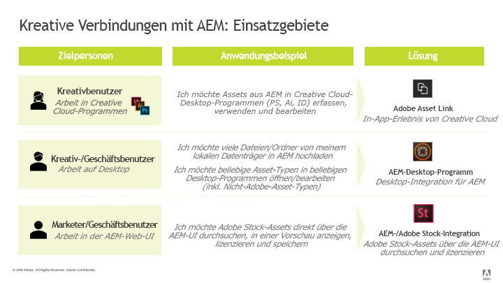

# Best Practices für die Integration von Adobe Experience Manager und Adobe Creative Cloud {#aem-and-creative-cloud-integration-best-practices}

| Version | Artikel-Link |
| -------- | ---------------------------- |
| AEM 6.5 | [Hier klicken](https://experienceleague.adobe.com/docs/experience-manager-65/assets/administer/aem-cc-integration-best-practices.html?lang=de) |
| AEM as a Cloud Service | Dieser Artikel |

Adobe Experience Manager Assets ist eine DAM-Lösung (Digital Asset Management), die mit Adobe Creative Cloud integriert werden kann, um DAM-Benutzer bei der Zusammenarbeit mit Kreativ-Teams zu unterstützen und so die Kooperation beim Erstellen von Inhalten zu optimieren.

Adobe Creative Cloud bietet Kreativ-Teams ein System von Lösungen und Services, um digitale Assets zu erstellen. Es enthält Desktop-Programme und Mobile Apps, Cloud-Services wie Speicher mit Desktop-Synchronisierung oder Web-Erlebnis sowie Marktplätze wie Adobe Stock.

Lesen Sie weiter, um mehr darüber zu erfahren, welche Integration Sie zwischen Desktop und DAM-Enterprise-System abhängig vom Nutzungsszenario und von den entsprechenden Best Practices für die Verbindungs-Workflows wählen sollten.

>[!NOTE]
>
>Die Ordnerfreigabe von Experience Manager in Creative Cloud wird nicht mehr unterstützt und nachfolgend nicht mehr behandelt. Adobe empfiehlt neuere Funktionen wie Adobe Asset Link oder das Experience Manager-Desktop-Programm, um kreativen Benutzern den Zugriff auf in Experience Manager verwaltete Assets zu ermöglichen.

## Kooperationsanforderungen von Kreativen, Marketern und DAM-Benutzern {#collaboration-need-of-creatives-marketers-and-dam-users}

| Voraussetzungen | Nutzungsszenario | Betroffene Oberflächen |
|---|---|---|
| Vereinfachtes Desktop-Erlebnis für Kreative | Für Kreativprofis oder allgemein für Desktop-Benutzer, die mit nativen Anwendungen zur Asset-Erstellung arbeiten, soll der Zugriff auf Assets von einem DAM-System ([!DNL Assets]) optimiert werden. Sie benötigen eine einfache und unkomplizierte Möglichkeit zum Entdecken, Verwenden (Öffnen), Bearbeiten und Speichern von Änderungen in Experience Manager sowie zum Hochladen neuer Dateien. | Windows- oder Mac-Desktop, Creative Cloud-Programme |
| Bereitstellen von hochwertigen, gebrauchsfertigen Assets aus [!DNL Adobe Stock] | Marketer tragen zu einer schnelleren Inhaltserstellung bei, indem sie beim Beschaffen von und Suchen nach Assets helfen. Kreativprofis verwenden die genehmigten Assets direkt in ihren Kreativ-Tools. | [!DNL Assets]; Marktplatz [!DNL Adobe Stock]; Metadatenfelder |
| Verteilen und Freigeben von Assets nach Organisationen | Interne Abteilungen/lokale Zweigstellen und externe Partner, Distributoren und Agenturen verwenden die genehmigten Assets, die von der übergeordneten Organisation gemeinsam genutzt werden. Die Organisation möchte die erstellten Assets sicher und nahtlos für eine größere Wiederverwendung freigeben. | [!DNL Brand Portal], [!DNL Asset Share Commons] |
| Automatisches Generieren vordefinierter Varianten hochgeladener Assets | Verarbeiten Sie Assets automatisch mithilfe der einzigartigen Medien-Handling- und Transformationstechnologie von Adobe für vordefinierte Aktionen. Erstellen Sie benutzerdefinierte Logik, um eigene Aktionen mithilfe von APIs und Asset-Microservices zu definieren. | Benutzeroberfläche von [!DNL Assets] |

## Adobe-Angebote zur Unterstützung von Kooperationsbedarf {#adobe-offerings-to-support-the-collaboration-need}

| Wertvorschlag für die beteiligten Rollen | Adobe-Angebot | Betroffene Oberflächen |
|---|---|---|
| Kreative Benutzende entdecken Assets aus [!DNL Experience Manager], öffnen und verwenden diese, nehmen Änderungen an [!DNL Experience Manager] vor und laden neue Dateien in [!DNL Experience Manager] hoch, ohne ihre [!DNL Creative Cloud]-Anwendung verlassen zu müssen. | [Adobe Asset Link](https://helpx.adobe.com/de/enterprise/using/adobe-asset-link.html) | Photoshop, Illustrator und InDesign. |
| Business-Anwender vereinfachen das Öffnen und Verwenden von Assets, das Bearbeiten und Hochladen von Änderungen in [!DNL Experience Manager] sowie das Hochladen neuer Dateien aus der Desktop-Umgebung in [!DNL Experience Manager]. Sie nutzen eine generische Integration, um jeden Asset-Typ in nativen Desktop-Programmen zu öffnen, auch von anderen Anbietern als Adobe. | [[!DNL Experience Manager] -Desktop-Programm](https://experienceleague.adobe.com/docs/experience-manager-desktop-app/using/using.html?lang=de) | Experience Manager-Desktop-Programm auf Windows- und Mac-Desktop |
| Marketer und Business-Anwender können Adobe Stock-Assets in Experience Manager entdecken, in einer Vorschau anzeigen, lizenzieren sowie speichern und verwalten. Lizenzierte und gespeicherte Assets liefern ausgewählte Adobe Stock-Metadaten für eine bessere Governance. | [Integration von Experience Manager und Adobe Stock](aem-assets-adobe-stock.md) | [!DNL Experience Manager]-Web-Oberfläche |
| Verbessern Sie die Zusammenarbeit zwischen Digital-Product-Designern und Marketing-Experten. Ermöglichen Sie es Designern, die digitalen Assets in Design- und Wireframe-Modellen auf der Adobe XD-Arbeitsfläche zu verwenden. | [[!DNL Adobe Asset Link] für [!DNL Adobe XD]](https://helpx.adobe.com/de/enterprise/using/adobe-asset-link-for-xd.html) | [!DNL Adobe XD] |
| Marketing-Experten können automatisch Varianten und Ableitungen basierend auf hochgeladenen Assets und vordefinierten Aktionen erstellen, die mithilfe von Anpassung erzeugt wurden. Verwenden Sie diese Automatisierung, um die Inhaltsgeschwindigkeit zu erhöhen und den manuellen Aufwand zu reduzieren. | [Inhaltsautomatisierung](/help/assets/cc-api-integration.md) | [!DNL Experience Manager Assets]-Web-Oberfläche |

Dieser Artikel konzentriert sich in erster Linie auf die ersten beiden Aspekte der Zusammenarbeit. Die Verteilung und Beschaffung von Vermögenswerten im entsprechende Maß wird kurz als Verwendungsfall genannt. Für solche Lösungen sollten Sie Adobe Brand Portal oder Asset Share Commons beachten. Alternative Lösungen wie [Experience Manager Assets Brand Portal](https://experienceleague.adobe.com/docs/experience-manager-brand-portal/using/home.html?lang=de), Lösungen, die auf Basis von [Asset Share Commons](https://opensource.adobe.com/asset-share-commons/)-Komponenten oder [Linkfreigabe](share-assets.md) erstellt werden können oder die [Experience Manager Assets-Web-Benutzeroberfläche](/help/assets/manage-digital-assets.md) verwenden, sind auf Grundlage bestimmter Anforderungen zu prüfen.

Festlegen der zu verwendenden Funktion

### Zuordnen von Nutzungsszenarien und Adobe-Lösungen {#mapping-of-use-cases-and-adobe-solutions}

| Nutzungsszenario | Adobe Asset Link | Experience Manager-Desktop-Programm | Bemerkungen oder alternative Methoden |
|----------------------------------------------------------|-----------------------------------------------------------------------------------|--------------------------------------------------------------------|------------------------------------------------------------------------------------------------------------------------------------------|
| Entdecken – Durchsuchen von Ordnern | Ja | Experience Manager-Web-Benutzeroberfläche + Desktop-Aktionen | Deaktivieren Sie beim Durchsuchen der Netzwerkfreigabe die Miniaturen, um das Herunterladen binärer Asset-Dateien zu vermeiden. |
| Entdecken – Zugreifen auf Sammlungen | Ja | Experience Manager-Web-Benutzeroberfläche + Desktop-Aktionen |  |
| Entdecken – Suchen von Assets | Ja | Experience Manager-Web-Benutzeroberfläche + Desktop-Aktionen |  |
| Verwenden – Asset öffnen | Ja | Ja – für jede App | [Öffnen über die Web-Benutzeroberfläche](/help/assets/manage-digital-assets.md#previewing-assets) oder den Finder |
| Verwenden – Platzieren von Assets aus Experience Manager in ein Dokument | Ja – Einbetten | Ja – Verknüpfen oder Einbetten | Das Experience Manager-Desktop-Programm ermöglicht den Zugriff auf Assets als Dateien im lokalen Dateisystem. Diese Links in den nativen Programmen werden durch lokale Pfade dargestellt. |
| Bearbeiten – zur Bearbeitung öffnen | Ja – Aktion zum Auschecken | Ja – Aktion zum Öffnen (über die Netzwerkfreigabe) | Beim [Checkout in AAL](https://helpx.adobe.com/de/enterprise/using/manage-assets-using-adobe-asset-link.html) wird standardmäßig das Asset für das Creative Cloud-Speicherkonto des Benutzers (synchronisiert durch das Creative Cloud-Programm) gespeichert. |
| Bearbeiten – Laufende Arbeiten außerhalb von Experience Manager | Ja – Asset im mit dem Desktop synchronisierten Creative Cloud-Speicherkonto des Benutzers verfügbar. | Ja |  |
| Bearbeiten – Änderungen hochladen | Ja – [Aktion zum Einchecken](https://helpx.adobe.com/de/enterprise/using/manage-assets-using-adobe-asset-link.html) mit optionalem Kommentar | Ja |  |
| Hochladen – einzelne Datei | Ja – lädt das aktuelle aktive Dokument hoch | Ja | [Hochladen über die Web-Oberfläche](/help/assets/manage-digital-assets.md#uploading-assets) |
| Hochladen – mehrere Dateien / hierarchische Ordnerstrukturen | Nein | Ja | [Hochladen über die Web-Oberfläche](/help/assets/manage-digital-assets.md#uploading-assets); benutzerdefiniertes Skript oder Tool |
| Sonstiges – Benutzende und Anmeldung | Erkennung des Creative Cloud-Benutzers, der beim Creative Cloud-Desktop-Programm angemeldet ist (SSO) | Experience Manager-Benutzer/-Anmeldung | Benutzer beider Lösungen werden mit dem Experience Manager-Benutzerkontingent verrechnet. |
| Sonstiges – Netzwerk und Zugriff | Zugriff vom Desktop des Benutzers auf die Experience Manager-Bereitstellung über das Netzwerk erforderlich | Zugriff vom Desktop des Benutzers auf die Experience Manager-Bereitstellung über das Netzwerk erforderlich | Adobe Asset Link gibt keine Netzwerk-Proxy-Umgebung frei. |

<!-- Removing this row from table as migration guide is not yet final.
| Misc - Migrate large number of assets | No | No | [Migration Guide](/help/assets/assets-migration-guide.md) |
-->

Zur Unterstützung von Nutzungsszenarien für die Asset-Verteilung haben Sie die folgenden Optionen:

* [Experience Manager Assets Brand Portal](https://experienceleague.adobe.com/docs/experience-manager-brand-portal/using/home.html?lang=de) als konfigurierbares Add-on für Assets, um Assets zu veröffentlichen.

* Benutzerdefinierte Lösungen auf Grundlage der [Asset Share Commons](https://opensource.adobe.com/asset-share-commons/)-Code-Basis.
* [Link-Freigabe](/help/assets/share-assets.md) in Experience Manager, um Assets nach Bedarf mithilfe von Links freizugeben.
* [Assets-Web-Oberfläche](/help/assets/manage-digital-assets.md) mit Bereichen für externe Parteien, die über die Experience Manager-Zugriffssteuerung und mit notwendigen IT-/Netzwerkkonfigurationsanpassungen abgesichert sind, sodass diese externen Benutzer Zugriff auf Experience Manager erhalten.

## Grundlegende Konzepte und Nutzungsszenarien {#key-concepts-and-use-cases}

### Glossar der allgemeinen Begriffe {#glossary-of-common-terms}

* **Laufende Arbeit oder laufende kreative Arbeit (Work-In-Progress, WIP):** Eine Phase im Asset-Lebenszyklus, in der ein Asset mehrfach geändert wird und in der Regel noch nicht zur Freigabe für breitere Teams bereit ist.
* **Fertige Kreativ-Assets:** Assets, die für ein breiteres Team freigegeben werden können oder die vom Kreativ-Team für die Freigabe mit Marketing- oder LOB-Teams ausgewählt/genehmigt wurden.

* **Asset-Genehmigungen:** Der Genehmigungsprozess, der für Assets ausgeführt wird, die bereits auf DAM hochgeladen wurden. Dazu gehören in der Regel Markengenehmigungen, rechtliche Genehmigungen usw.
* **Endgültiges Asset:** Ein Asset, das alle Genehmigungen/Metadaten-Taggingprozesse durchlaufen hat und für das breitere Team verwendet werden kann. Ein solches Asset wird in DAM gespeichert und allen (bzw. allen interessierten) Benutzern zur Verfügung gestellt. Es kann in Marketing-Kanälen oder von Kreativ-Teams verwendet werden, um Designs zu erstellen.

* **Kleinere Asset-Aktualisierung/-Änderung:** Schnelle, kleine Änderung an einem digitalen Asset. Diese wird häufig aufgrund einer Retuschieranfrage oder einer kleineren Bearbeitungsanfrage, einer Asset-Überprüfung oder einer Genehmigung (z. B. Neupositionierung, Änderung der Textgröße, Anpassung der Sättigung/Helligkeit, Farbe usw.) durchgeführt.
* **Größere Asset-Aktualisierung/-Änderung:** Änderung eines digitalen Assets, die viel Arbeit erfordert und manchmal über einen längeren Zeitraum erfolgen muss. Diese umfasst in der Regel mehrere Änderungen. Das Asset muss während der Aktualisierung mehrmals gespeichert werden. Bei umfangreichen Asset-Aktualisierungen wird das Asset in der Regel in eine WIP-Phase versetzt.
* **DAM:** Digital Asset Management. In diesem Dokument wird der Begriff synonym mit Experience Manager-Assets verwendet, sofern nicht ausdrücklich anders angegeben.
* **Kreativer Benutzer:** Kreativprofi, der digitale Assets mit Creative Cloud-Programmen und -Services erstellt. In einigen Fällen kann ein kreativer Benutzer Mitglied eines Kreativ-Teams sein, das möglicherweise Creative Cloud verwendet, aber keine digitalen Assets erstellt (z. B. Creative Director oder Creative Team Manager).
* **DAM-Benutzer:** Ein typischer Benutzer eines DAM-Systems. Je nach Organisation können DAM-Benutzende Marketing- oder Nicht-Marketing-Benutzende sein, z. B. „Line-of-Business“(LOB)-Benutzende, Bibliothekarinnen und Bibliothekare oder Vertriebspersonal.

### Überlegungen zur Integration von Experience Manager und Creative Cloud {#considerations-when-using-aem-and-creative-cloud-integration}

<!--incomplete and TBD: 

* DA2.0 best practices: See troubleshooting.md
* Stock integration: See ?
* AAL: See ?
* BP: See ?

-->

Dies ist eine kurze Zusammenfassung von Best Practices für die Integration von Experience Manager und Creative Cloud. Lesen Sie den Rest dieses Dokuments, um detaillierte Informationen dazu zu erhalten.

* **Für kreative Benutzer, die in Photoshop, InDesign oder Illustrator arbeiten:** Adobe Asset Link bietet ein optimales Benutzererlebnis, einschließlich der ordnungsgemäßen Abwicklung laufender Arbeiten an aus Experience Manager ausgecheckten Assets.
* **Für einen vereinfachten Desktop-Zugriff auf Assets mit allgemeinen Dateiformaten oder Programmen:** Verwenden Sie das Experience Manager-Desktop-Programm.
* **Verstehen, warum und wann Assets in DAM gespeichert werden:** Aktualisierungen, die dem größeren Team in Ihrer Organisation zur Verfügung zu stellen sind
* **Beachten des Volumens freigegebener Assets:** Wenn Ihr Anwendungsfall die Asset-Verteilung ist, könnten Governance und Sicherheit die wichtigsten Aspekte sein. Erwägen Sie die Verwendung von Tools, die für eine skalierte Vorgehensweise entwickelt wurden, wie z. B. Brand Portal.
* **Wissenswertes über den Asset-Lebenszyklus:** Sie müssen wissen, welche Assets in Ihrer Organisation von den verschiedenen Teams genutzt werden.
* **Sorgfältige Verarbeitung häufiger Asset-Speichervorgänge:** Adobe Asset Link übernimmt diese Aufgabe für Sie – mit PS, AI und ID. Führen Sie für andere Anwendungen keine laufenden Arbeitsaufgaben im zugeordneten/freigegebenen Ordner aus, es sei denn, Sie benötigen alle Änderungen in DAM

### Zugreifen auf Adobe Stock-Assets über Experience Manager Assets {#access-to-adobe-stock-assets-from-aem-assets}

[Die Integration von Experience Manager und Adobe Stock](/help/assets/aem-assets-adobe-stock.md) ermöglicht Experience Manager-Anwendern die Suche, Vorschau, Lizenzierung und Speicherung von Assets aus Adobe Stock in Experience Manager. Lizenzierte und gespeicherte Adobe Stock-Assets verfügen über ausgewählte Adobe Stock-Metadaten, mit denen Suchvorgänge über zusätzliche Filter durchgeführt werden können.

Einige wichtige Punkte zu dieser Integration:

* Wenn Assets aus Adobe Stock in Experience Manager gespeichert werden, werden sie zu regulären Experience Manager-Assets. Binärdateien werden dabei im Experience Manager-Repository gespeichert. Einige zu Adobe Stock gehörige Metadaten werden für das Asset in Experience Manager gespeichert. Ansonsten verläuft die Erfassung wie bei jeder anderen Datei. Wenn beispielsweise Smart-Tags aktiv sind, werden die Tags beim Speichern diesen Assets hinzugefügt.
* Das in Experience Manager gespeicherte Asset ist eine Kopie, kein Link zurück zu Adobe Stock.

**Arbeiten mit Assets in Creative Cloud, die aus Adobe Stock in Experience Manager gespeichert wurden**. Diese Integration ist zwar unabhängig von Adobe Asset Link, aber Adobe Asset Link erkennt diese so aus Adobe Stock gespeicherten Assets und zeigt zusätzliche Metadaten sowie ein Adobe Stock-Symbol auf diesen Assets in der Adobe Asset Link-Erweiterungsoberfläche in Photoshop, Illustrator bzw. InDesign an. Die Dateien sind zum Durchsuchen, Öffnen usw. verfügbar, da sie durch Speichern in Experience Manager zu regulären Experience Manager-Assets werden.
Kreative Benutzer, die in Creative Cloud-Programmen mit vorhandener Adobe Asset Link-Erweiterung arbeiten, haben zusätzlich zum Zugriff auf bereits lizenzierte Assets aus Adobe Stock in Experience Manager auch Zugriff auf das Creative Cloud Libraries-Bedienfeld, um Adobe Stock-Assets zu suchen, in einer Vorschau anzuzeigen und zu lizenzieren.
Lizenzierte und in Experience Manager gespeicherte Assets aus Adobe Stock werden allgemeineren Teams zur Verfügung gestellt, die auf die Experience Manager Assets-Bereitstellung zugreifen. Kreative hingegen, die Assets aus Adobe Stock über das Creative Cloud Libraries-Bedienfeld lizenzieren, können die Assets standardmäßig lediglich sich selbst in ihrem Creative Cloud-Konto zur Verfügung stellen.

## Informationen zum Speichern von Assets in DAM {#about-storing-assets-in-a-dam}

Für das Entwickeln eines effizienten Workflows zwischen Kreativ-Teams und Marketing-/Branchen-Teams sowie für die Auswahl der besten Begleitfunktionen ist es wichtig zu verstehen, wann und warum Assets in DAM gespeichert werden.

### Warum Assets in DAM gespeichert werden {#why-assets-are-stored-in-dam}

Das Speichern von Assets in DAM macht sie leicht zugänglich und auffindbar. Dadurch wird sichergestellt, dass die Assets von zahlreichen Benutzenden im gesamten Unternehmen oder Ökosystem genutzt werden können, wozu Partnerinnen bzw. Partner, Kundinnen bzw. Kunden usw. gehören.

Die meisten Unternehmen entscheiden sich dafür, nur Assets zu speichern, die für nachgelagerte Marketing-/Branchenprozesse (Veröffentlichen in Kanälen wie dem Internet über Experience Manager Sites oder anderen Kanälen wie Marketing Cloud oder Advertising Cloud, die von Adobe Experience Cloud bereitgestellt und von Analytics Cloud bewertet werden, Bereitstellung für Benutzer/Partner usw.) relevant sind. Darüber hinaus speichern Unternehmen in DAM Assets, die einem Überprüfungs-/Genehmigungsprozess unterzogen werden können. Auf diese Weise speichert DAM hauptsächlich Assets, die mit hoher Wahrscheinlichkeit genutzt werden, und vermeidet das Speichern inaktiver Assets.

Das Speichern von Assets unterliegt auch technischen Überlegungen und Überlegungen zur Ressourcenauslastung. DAM bietet zusätzliche Services rund um gespeicherte Assets, darunter Extrahieren von Metadaten, Versionierung, Erstellen von Vorschauen/Transcodierung, Verwalten von Referenzen und Hinzufügen von Informationen zur Zugriffssteuerung. Diese Services erfordern zusätzlich Zeit und Infrastrukturressourcen.

Häufig ist es nicht wünschenswert, alle Assets und Updates zu speichern. Wenn beispielsweise Aktualisierungen an bestimmten Assets von schlechter Qualität sind und übermäßige Ressourcen verbrauchen, werden die Assets möglicherweise nicht in DAM gespeichert.

#### Wann Assets in DAM gespeichert werden {#when-assets-are-stored-in-dam}

Kreativ-Teams (und Organisationen) sind in der Regel nicht daran interessiert, Assets in jeder Phase des Asset-Lebenszyklus zu speichern. Sie vermeiden beispielsweise das Speichern von Assets in den folgenden Fällen:

* Assets, die noch nicht abgeschlossen sind oder getestet werden müssen
* Assets, die den Prüfungszyklus des Kreativ-Teams/internen Teams nicht bestehen
* Verglichen mit dem betreffenden Asset verfügt das Team über bessere Beispiele für seine Arbeit, um sie externen Teams vorzustellen

Normalerweise werden die folgenden Klassen-Assets in DAM gespeichert:

* Assets, die eine bestimmte Laufzeit erreicht haben und als zur Freigabe bereit gelten
* Assets, die vorab vom Kreativ-Team ausgewählt wurden
* Bestimmte Asset-Formate, die vom Marketing-Team verwendet werden können oder abhängig von einem bestimmten Vertrag bzw. einer Vereinbarung angefordert wurden (z. B. aus RAW-Dateien konvertierte JPG-Dateien, TIFF-Dateien/-Bilder aus PSD-Originaldateien)

#### Wann Aktualisierungen von Assets in DAM gespeichert werden {#when-updates-to-assets-are-stored-in-dam}

In der Regel sollten nur Aktualisierungen von Assets in DAM gespeichert werden, die für den Großteil der DAM-Benutzenden relevant sind. Dadurch wird sichergestellt, dass Benutzende (Marketing- und ähnliche Funktionen) nur relevante Versionen in der DAM-Asset-Timeline sehen.

Normalerweise handelt es sich um Änderungen im Zusammenhang mit wichtigen Meilensteinen im Asset-Lebenszyklus. Beispielsweise sollte das ursprüngliche fertige Marketing-Asset oder eine offizielle Aktualisierung basierend auf Anfragen/Überprüfungen durch das Kreativ-Team in DAM gespeichert und versioniert werden.

Die Aktualisierung des Kreativ-Teams zur Überprüfung durch das Marketing-Team nach einer Änderungsanfrage für ein vorhandenes Asset in DAM ist ein Beispiel für eine relevante Aktualisierung. Sie sollte in DAM gespeichert und versioniert werden, um weitere Informationen zu erhalten oder zur vorherigen Version zurückzukehren.

Im Folgenden finden Sie Beispiele für Aktualisierungen, die normalerweise nicht relevant sind:

* Frühzeitige Versionen von Assets, die hochgeladen wurden, bevor sie zur Marketing-Überprüfung bereit sind
* Häufige kreative Änderungen am Asset in der WIP-Phase, bevor die Kreativ- und Marketing-Teams das Asset für fertig erklären

### Benutzerzugriff auf DAM {#user-access-to-dam}

Experience Manager Assets unterstützt zwei Arten von Benutzern, die sich in ihrem Zugriff auf die Experience Manager Assets-Bereitstellung unterscheiden. Normalerweise haben Benutzende im Unternehmensnetzwerk (Firewall) direkten Zugriff auf DAM. Andere Benutzende außerhalb des Unternehmensnetzwerks hätten keinen direkten Zugriff. Der Benutzertyp bestimmt aus technischer Sicht, welche Integrationen verwendet werden können.

#### Kreative Benutzer mit direktem Zugriff auf DAM {#creative-users-with-direct-access-to-dam}

In der Regel haben interne Kreativ-Teams oder Agenturen/Kreativprofis, die an das interne Netzwerk angeschlossen sind, Zugriff auf die DAM-Instanz, einschließlich Experience Manager-Anmeldung. Die Experience Manager- und Netzwerkinfrastruktur kann eingerichtet werden, um externen Parteien – normalerweise vertrauenswürdige Organisationen wie Agenturen, die für einen Kunden arbeiten – direkten Zugriff zu ermöglichen, damit diese über das Netzwerk (z. B. über VPN oder IP-Zulassungsliste) auf Experience Manager zugreifen können.

In solchen Fällen bietet Adobe Asset Link oder das Experience Manager-Desktop-Programm einfachen Zugriff auf abgeschlossene/genehmigte Assets und ermöglicht das Speichern fertiger Kreativ-Assets in DAM.

#### Kreative Benutzer ohne Zugriff auf DAM {#creative-users-without-access-to-dam}

Externe Agenturen oder Freiberufler ohne direkten Zugriff auf die DAM-Instanz benötigen möglicherweise Zugriff auf genehmigte Assets oder möchten ihre neuen Designs in DAM hinzufügen.

Stellen Sie mit den folgenden Strategien Zugriff auf abgeschlossene/genehmigte Assets bereit:

* Verwenden des Desktop-Programms, wenn Asset Link nicht funktioniert.
* Verwenden von [Experience Manager Assets Brand Portal](https://experienceleague.adobe.com/docs/experience-manager-brand-portal/using/home.html?lang=de), um Assets sicher an externe Partner zu verteilen.
* Verwenden einer benutzerdefinierten Implementierung eines Verteilungs- und Quellportals auf Basis von [Asset Share Commons](https://adobe-marketing-cloud.github.io/asset-share-commons/).
* Verwenden der in Experience Manager eingerichteten Zugriffssteuerung und der erforderlichen Netzwerkinfrastruktur (z. B. VPN und IP-Zulassungsliste), um externen Parteien Zugriff auf einen speziellen Inhaltsbereich in Ihrem DAM-System zu gewähren. Sie können über die Experience Manager-Web-Benutzeroberfläche Assets abrufen und neue Inhalte in Ihr DAM-System hochladen.

#### Laufende Arbeiten an Assets über Experience Manager {#work-in-progress-on-assets-from-aem}

Wie in diesem Dokument erläutert, wird empfohlen, umfangreiche Aktualisierungen für Assets, auch als laufende Arbeiten bezeichnet, durchzuführen, ohne dass alle in der lokalen Datei gespeicherten Bearbeitungen ebenfalls als Änderungen in Experience Manager hochgeladen werden. Dies beschleunigt die Arbeit von Desktop-Benutzern, schränkt die verwendete Netzwerkbandbreite ein und sorgt dafür, dass die Assets-Zeitleiste „sauber“ bleibt und auf kontrollierte, größere Aktualisierungen ausgerichtet ist.

Adobe Asset Link bietet eine gute Unterstützung für diesen Anwendungsfall:

* Wenn Benutzende in Photoshop, InDesign oder Illustrator eine Datei bearbeiten möchten, checken sie das jeweilige Asset aus.
* Das Asset wird im Hintergrund heruntergeladen und in die vom Creative Cloud-Desktop-Programm mit der Festplatte synchronisierten Creative Cloud-Konten der Benutzer platziert. In Experience Manager wird die Checkout-Markierung auf dem Asset umgeschaltet, um Bearbeitungskonflikte zu minimieren.
* Von dort aus arbeiten die Benutzenden in einer Datei, die lokal am synchronisierten Speicherort gespeichert ist, und können in beliebiger Häufigkeit weiterarbeiten und notwendige Änderungen speichern
* Da sich das Asset im Creative Cloud-Konto befindet, ist es auch auf etwaigen anderen Benutzergeräten verfügbar (z. B. zum Öffnen oder Bearbeiten in einer dedizierten Creative Cloud-Mobile-App). Außerdem kann es für andere Creative Cloud-Benutzende für die Zusammenarbeit freigegeben werden.
* Wenn kreative Benutzende keine weiteren Änderungen vornehmen möchten, können sie diese Datei in ihrem Creative Cloud-Programm mit einem optionalen Kommentar einchecken. Das entsprechende Asset in Experience Manager wird versioniert und mit der neuen Binärdatei aktualisiert. Experience Manager-Benutzer wie Marketer oder Branchenbenutzer haben über die Asset-Zeitleiste von Experience Manager Zugriff auf wichtige Asset-Änderungen oder Meilensteine.

Das Experience Manager-Desktop-Programm bietet eine Netzwerkfreigabe für in der nativen App geöffnete Assets. Standardmäßig werden alle lokalen Änderungen nach kurzer Zeit automatisch in Experience Manager hochgeladen. Mit einer solchen Konfiguration würden alle häufig gespeicherten Inhalte während der laufenden Arbeitsphase in Experience Manager hochgeladen und versioniert, sodass beträchtlicher Netzwerk-Traffic und potenzielle Herausforderungen bezüglich der Skalierbarkeit entstünden – ganz zu schweigen von unnötigen Versionen in Experience Manager.

In diesem Fall wird empfohlen, die Experience Manager-Desktop-Anwendung zum Deaktivieren automatischer Aktualisierungen zu verwenden und Asset-Änderungen manuell in Experience Manager hochzuladen. Dabei wird die Aktion zum Hochladen von Assets in der Asset-Status-Benutzeroberfläche der Anwendung genutzt.

#### Massen-Upload in DAM {#bulk-upload-to-dam}

In einigen Szenarien müssen Sie möglicherweise eine größere Anzahl von Dateien gleichzeitig in DAM hochladen. Beispiele dafür sind:

* Hochladen von Ergebnissen von Foto-Shootings oder größeren Projekten
* Hochladen von Assets von Kreativagenturen
* Hochladen ausgewählter Assets aus einem größeren Satz, wenn die Auswahl außerhalb von DAM erfolgt

Die Beschreibung bezieht sich auf das betriebsbedingte Hochladen von Dateien (z. B. wöchentlich oder bei jedem Foto-Shooting) als normaler Teil des Workflows von Desktop-Benutzenden. Große Asset-Migrationen werden hier nicht behandelt.

Sie können die folgenden Upload-Funktionen nutzen:

* Wenn Sie große/hierarchische Ordner stapelweise hochladen möchten, verwenden Sie das Experience Manager-Desktop-Programm mit Funktionen zum [Hochladen von Ordnern](https://experienceleague.adobe.com/docs/experience-manager-desktop-app/using/using.html?lang=de#bulk-upload-assets). Sie können auch hierarchische Ordnerstrukturen hochladen. Das Hochladen von Assets erfolgt im Hintergrund und ist daher nicht an eine Webbrowser-Sitzung gebunden.
* Wenn Sie mehrere Dateien aus einem einzelnen Ordner hochladen möchten, ziehen Sie die Dateien direkt in die Web-Oberfläche oder verwenden Sie die Option „Erstellen“ in der Web-Benutzeroberfläche von Experience Manager Assets.
* Je nach Ihren Geschäftsanforderungen können Sie auch benutzerdefinierte Upload-Programme verwenden.

#### Verwalten digitaler Assets direkt auf dem Desktop {#managing-digital-assets-directly-from-desktop}

Wenn Sie digitale Assets in Netzwerk-Dateifreigaben verwalten, kann stattdessen einfach die vom Experience Manager-Desktop-Programm zugeordnete Netzwerkfreigabe verwendet werden. Beim Übergang von Netzwerk-Dateifreigaben stellt die Web-Benutzeroberfläche von Experience Manager einen umfangreichen Satz von DAM-Funktionen (Digital Asset Management) bereit, die weit über die Möglichkeiten einer Netzwerkfreigabe hinausgehen (Suche, Sammlungen, Metadaten, Zusammenarbeit, Vorschauen usw.). Außerdem bietet das Experience Manager-Desktop-Programm einen praktischen Link zur Verbindung des Server-seitigen DAM-Repositorys mit Arbeiten auf dem Desktop.

Verwenden Sie das Experience Manager-Desktop-Programm nicht für die direkte Verwaltung von Assets in der Netzwerkfreigabe von Experience Manager Assets. Verwenden Sie das Experience Manager-Desktop-Programm beispielsweise nicht zum Verschieben/Kopieren mehrerer Dateien. Verwenden Sie stattdessen die Web-Benutzeroberfläche von Experience Manager Assets, um Ordner aus dem Finder/Explorer in die Netzwerkfreigabe zu ziehen, oder verwenden Sie die Funktion „Ordner hochladen“ von Experience Manager Assets.

**Siehe auch**

* [Assets übersetzen](translate-assets.md)
* [Assets-HTTP-API](mac-api-assets.md)
* [Von AEM Assets unterstützte Dateiformate](file-format-support.md)
* [Suchen von Assets](search-assets.md)
* [Connected Assets](use-assets-across-connected-assets-instances.md)
* [Asset-Berichte](asset-reports.md)
* [Metadatenschemata](metadata-schemas.md)
* [Herunterladen von Assets](download-assets-from-aem.md)
* [Verwalten von Metadaten](manage-metadata.md)
* [Suchfacetten](search-facets.md)
* [Verwalten von Sammlungen](manage-collections.md)
* [Massenimport von Metadaten](metadata-import-export.md)
* [Veröffentlichen von Assets in AEM und Dynamic Media](/help/assets/publish-assets-to-aem-and-dm.md)
