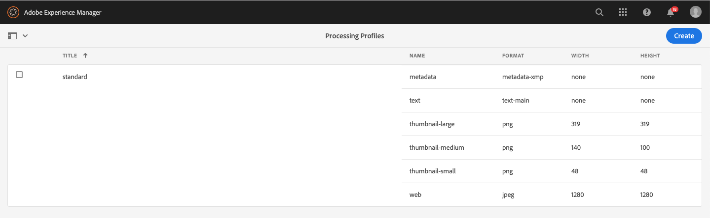

# Erste Schritte mit Asset-Microservices {#get-started-using-asset-microservices}

<!--
* Current capabilities of asset microservices offered. If workers have names then list the names and give a one-liner description. (The feature-set is limited for now and continues to grow. So will this article continue to be updated.)
* How to access the microservices. UI. API. Is extending possible right now?
* Detailed list of what file formats and what processing is supported by which workflows/workers process.
* How/where can admins check what's already configured and provisioned.
* How to create new config or request for new provisioning/purchase.

* [DO NOT COVER?] Exceptions or limitations or link back to lack of parity with AEM 6.5.
-->

Asset-Microservices bieten eine skalierbare und widerstandsfähige Verarbeitung von Assets mithilfe von Cloud Services. Adobe verwaltet die Dienste für eine optimale Handhabung verschiedener Asset-Typen und Verarbeitungsoptionen.

Die Verarbeitung von Assets hängt von der Konfiguration in den **[!UICONTROL Verarbeitungsprofilen]** ab, die eine Standardeinstellung bieten und es einem Administrator ermöglichen, spezifischere Asset-Verarbeitungskonfigurationen hinzuzufügen. Administratoren können die Konfigurationen von Nachbearbeitungs-Workflows erstellen und verwalten, einschließlich optionaler Anpassungen. Die Anpassung von Workflows ermöglicht Erweiterbarkeit und vollständige Anpassung.

Mit Asset Microservices können Sie eine [breite Palette von Dateitypen](/help/assets/file-format-support.md) verarbeiten, die mehr Formate standardmäßig abdecken als mit früheren Versionen von Experience Manager möglich ist. Beispielsweise ist jetzt eine Miniaturansicht-Extraktion von PSD- und PSB-Formaten möglich, die zuvor von Drittanbietern wie ImageMagick benötigt wurde.

<!-- Proposed DRAFT diagram for asset microservices flow - see section "asset-microservices-flow.png (asset-microservices-configure-and-use.md)" in the PPTX deck

https://adobe-my.sharepoint.com/personal/gklebus_adobe_com/_layouts/15/guestaccess.aspx?guestaccesstoken=jexDC5ZnepXSt6dTPciH66TzckS1BPEfdaZuSgHugL8%3D&docid=2_1ec37f0bd4cc74354b4f481cd420e07fc&rev=1&e=CdgElS
-->

>[!NOTE]
>
> Die hier beschriebene Asset-Verarbeitung ersetzt das `DAM Update Asset`-Workflow-Modell, das in früheren Versionen von Experience Manager verwendet wurde. Die meisten Schritte zum Generieren von Standardausgaben und zum Erstellen von Metadaten werden durch die Verarbeitung von Asset-Microservices ersetzt. Die verbleibenden Schritte können, falls vorhanden, durch die Konfiguration des Nacharbeitungs-Workflows ersetzt werden.

## Erste Schritte mit der Asset-Verarbeitung {#get-started}

Die Asset-Verarbeitung mit Asset-Microservices wird mit einer Standardkonfiguration vorkonfiguriert, sodass die vom System benötigten Standardausgaben verfügbar sind. Außerdem stellt sie sicher, dass Metadatenextraktion und Textextraktion verfügbar sind. Benutzer können sofort mit dem Hochladen oder Aktualisieren von Assets beginnen. Die grundlegende Verarbeitung ist standardmäßig verfügbar.

Für bestimmte Anforderungen an die Generierung und Verarbeitung von Ausgabeformaten kann ein AEM-Administrator zusätzliche [!UICONTROL Verarbeitungsprofile]erstellen. Benutzer können eines oder mehrere der verfügbaren Profile bestimmten Ordnern zuweisen, um zusätzliche Verarbeitungen zu erhalten. Angenommen, Sie erstellen Web-, Mobile- und Tablet-spezifische Ausgabeformate. Das folgende Video zeigt, wie Sie [!UICONTROL Verarbeitungsprofile] erstellen und anwenden und auf die erstellten Ausgabeformate zugreifen.

>[!VIDEO](https://video.tv.adobe.com/v/29832?quality=9)

Informationen zum Ändern des vorhandenen Profils finden Sie unter [Konfigurationen für Asset-Microservices](#configure-asset-microservices).
Informationen zum Erstellen benutzerdefinierter Verarbeitungsprofile, die spezifisch für Ihre benutzerdefinierten Anforderungen sind, wie z. B. zur Integration in andere Systeme, finden Sie unter [Nacharbeitungs-Workflows](#post-processing-workflows).

## Konfigurationen für Asset Microservices {#configure-asset-microservices}

Um Asset-Microservices zu konfigurieren, können Administratoren die Konfigurationsoberfläche unter **[!UICONTROL Tools > Assets > Verarbeitungsprofile]** verwenden.

### Standardkonfiguration {#default-config}

Bei der Standardkonfiguration wird nur das standardmäßige Verarbeitungsprofil konfiguriert. Das standardmäßige Verarbeitungsprofil ist in der Benutzeroberfläche nicht sichtbar und kann nicht geändert werden. Es wird immer ausgeführt, um hochgeladene Assets zu verarbeiten. Mit einem standardmäßigen Verarbeitungsprofil wird sichergestellt, dass alle für Experience Manager erforderlichen grundlegenden Verarbeitungen für alle Assets durchgeführt werden.

<!--  -->

Das standardmäßige Verarbeitungsprofil bietet die folgende Verarbeitungskonfiguration:

* Standardmäßige Miniaturansichten, die von der Asset-Benutzeroberfläche verwendet werden (48, 140 und 319 Pixel)
* Große Vorschau (Web-Ausgabe - 1280 Pixel)
* Metadatenextraktion
* Textextraktion

### Unterstützte Dateiformate {#supported-file-formats}

Asset-Microservices bieten Unterstützung für eine Vielzahl von Dateiformaten, um Ausgabeformate zu generieren oder Metadaten zu extrahieren. Die vollständige Liste finden Sie unter [Unterstützte Dateiformate](file-format-support.md) .

### Hinzufügen zusätzlicher Verarbeitungsprofile {#processing-profiles}

Zusätzliche Verarbeitungsprofile können mit der Aktion **[!UICONTROL Erstellen]** hinzugefügt werden.

Jede Konfiguration des Verarbeitungsprofils enthält eine Liste der Ausgabeformate. Für jedes Ausgabeformat können Sie Folgendes angeben:

* Name des Ausgabeformats.
* Unterstütztes Ausgabeformat, z. B. JPEG, PNG oder GIF.
* Ausgabebreite und -höhe in Pixel. Wenn nichts angegeben wird, wird die volle Pixelgröße des Originalbilds verwendet.
* Ausgabequalität für JPEG in Prozent.
* Eingeschlossene und ausgeschlossene MIME-Typen zur Definition der Anwendbarkeit eines Profils.

Wenn Sie ein neues Verarbeitungsprofil erstellen und speichern, wird es der Liste der konfigurierten Verarbeitungsprofile hinzugefügt. Sie können diese Verarbeitungsprofile auf Ordner in der Ordnerhierarchie anwenden, um sie beim Hochladen und Verarbeiten von Assets anzuwenden.

<!-- Removed per cqdoc-15624 request by engineering.
  -->

#### Ausgabebreite und -höhe {#rendition-width-height}

Die Angabe der Breite und Höhe des Ausgabeformats bietet die maximale Größe des generierten Ausgabebildes. Der Asset-Microservice versucht, das größtmögliche Format zu erstellen, dessen Breite und Höhe nicht größer als die angegebene Breite bzw. Höhe ist. Das Seitenverhältnis wird beibehalten, d. h. es entspricht dem Original.

Ein leerer Wert bedeutet, dass bei der Asset-Verarbeitung die Pixelabmessungen des Originals berücksichtigt werden.

#### Einschlussregeln für MIME-Typen {#mime-type-inclusion-rules}

Wenn ein Asset mit einem bestimmten Mime-Typ verarbeitet wird, wird der Mime-Typ zunächst mit dem Wert für die ausgeschlossenen Mime-Typen für die Ausgabespezifikation verglichen. Wenn es mit dieser Liste übereinstimmt, wird dieses spezifische Ausgabeformat nicht für das Asset generiert („Blacklisting“).

Andernfalls wird der Mime-Typ mit dem eingeschlossenen Mime-Typ verglichen. Wenn er mit der Liste übereinstimmt, wird das Ausgabeformat generiert („Whitelisting“).

#### Spezielle FPO-Ausgabe {#special-fpo-rendition}

Wenn großformatige Assets von AEM in Adobe InDesign-Dokumente einfügt werden, muss der Kreativschaffende nach dem [Einfügen eines Assets](https://helpx.adobe.com/de/indesign/using/placing-graphics.html) eine beträchtliche Zeit warten. In der Zwischenzeit kann der Benutzer InDesign nicht verwenden. Dies unterbricht den kreativen Fluss und wirkt sich negativ auf das Kundenerlebnis aus. Adobe ermöglicht die zeitweilige Platzierung kleinformatiger Ausgabeversionen in InDesign-Dokumenten. Diese können später bei Bedarf durch Assets in voller Auflösung ersetzt werden. Experience Manager bietet Ausgabeversionen, die nur für die Platzierung (FPO) verwendet werden. Diese FPO-Darstellungen haben eine kleine Dateigröße, weisen aber dasselbe Seitenverhältnis auf.

Das Verarbeitungsprofil kann eine FPO-Wiedergabe (nur für Platzierung) enthalten. In der Adobe Asset Link-[Dokumentation](https://helpx.adobe.com/de/enterprise/using/manage-assets-using-adobe-asset-link.html) erfahren Sie, ob Sie das Programm für Ihr Verarbeitungsprofil aktivieren müssen. Weitere Informationen finden Sie in der [vollständigen Dokumentation von Adobe Asset Link](https://helpx.adobe.com/de/enterprise/using/adobe-asset-link.html).

## Verwenden von Asset-Microservices zur Verarbeitung von Assets {#use-asset-microservices}

Erstellen Sie die zusätzlichen benutzerdefinierten Verarbeitungsprofile und wenden Sie sie auf bestimmte Ordner an, damit Experience Manager sie für Assets verarbeitet, die in diese Ordner hochgeladen oder in diesen aktualisiert wurden. Das standardmäßige integrierte Verarbeitungsprofil wird immer ausgeführt, ist jedoch auf der Benutzeroberfläche nicht sichtbar. Wenn Sie ein benutzerdefiniertes Profil hinzufügen, werden beide Profil zur Verarbeitung der hochgeladenen Assets verwendet.

Es gibt zwei Möglichkeiten, Verarbeitungsprofile auf Ordner anzuwenden:

* Administratoren können unter **[!UICONTROL Tools > Assets > Verarbeitungsprofile]** eine Definition des Verarbeitungsprofils auswählen und die Aktion **[!UICONTROL Profil auf Ordner anwenden]** verwenden. Dadurch wird ein Inhalts-Browser geöffnet, mit dem Sie zu bestimmten Ordnern navigieren, diese auswählen und die Anwendung des Profils bestätigen können.
* Die Benutzer können einen Ordner in der Benutzeroberfläche „Assets“ auswählen, die Aktion **[!UICONTROL Eigenschaften]** zum Öffnen der Ordnereigenschaften verwenden, auf die Registerkarte **[!UICONTROL Verarbeitungsprofile]** klicken und in der Dropdown-Liste das richtige Verarbeitungsprofil für diesen Ordner auswählen. Die Auswahl wird bei der Aktion **[!UICONTROL Speichern und schließen]** gespeichert.

>[!NOTE]
>
>Nur ein Verarbeitungsprofil kann auf einen bestimmten Ordner angewendet werden. Wenn Sie weitere Ausgabeformate erstellen müssen, können Sie dem Verarbeitungsprofil weitere Ausgabedefinitionen hinzufügen.

Nachdem ein Verarbeitungsprofil auf einen Ordner angewendet wurde, werden alle neuen Assets, die in diesen Ordner oder in dessen Unterordnern hochgeladen (oder aktualisiert) werden, mit dem konfigurierten zusätzlichen Verarbeitungsprofil verarbeitet. Diese zusätzliche Verarbeitung erfolgt zusätzlich zum Standardprofil. Wenn Sie mehrere Profile auf einen Ordner anwenden, werden die hochgeladenen oder aktualisierten Elemente mit jedem dieser Profile verarbeitet.

>[!NOTE]
>
>Wenn Assets in einen Ordner hochgeladen werden, prüft Experience Manager die Eigenschaften des zugehörigen Ordners auf ein Verarbeitungsprofil. Wenn keines angewendet wird, geht Experience Manager in der Ordnerstruktur nach oben, bis ein angewendetes Verarbeitungsprofil gefunden und für das Asset verwendet wird. Das bedeutet, dass ein Verarbeitungsprofil, das auf einen Ordner angewendet wird, für die gesamte Struktur funktioniert, aber mit einem anderen Profil, das auf einen Unterordner angewendet wird, überschrieben werden kann.

Benutzer können überprüfen, ob die Verarbeitung tatsächlich stattgefunden hat, indem sie ein neu hochgeladenes Asset öffnen, für das die Verarbeitung abgeschlossen ist, die Asset-Vorschau öffnen und auf die Ansicht **[!UICONTROL Ausgabeformate]** in der linken Leiste klicken. Die spezifischen Ausgabeformate im Verarbeitungsprofil, für die der Typ des jeweiligen Assets mit den Einschlussregeln des MIME-Typs übereinstimmt, sollten sichtbar und zugänglich sein.

*Abbildung: Beispiel zweier zusätzlicher Ausgabeformate, die von einem Verarbeitungsprofil generiert wurden, das auf den übergeordneten Ordner angewendet wurde*

## Nachbearbeitungs-Workflows {#post-processing-workflows}

In Fällen, in denen zusätzliche Verarbeitung von Assets erforderlich ist, die mit den Verarbeitungsprofilen nicht erreicht werden können, können der Konfiguration zusätzliche Nachbearbeitungs-Workflows hinzugefügt werden. Dies ermöglicht es, zusätzlich zu der konfigurierbaren Verarbeitung mithilfe von Asset-Microservices eine vollständig angepasste Verarbeitung hinzuzufügen.

Nachbearbeitungs-Workflows werden, falls konfiguriert, automatisch von AEM ausgeführt, nachdem die Verarbeitung der Microservices abgeschlossen ist. Es ist nicht notwendig, Workflow-Starter manuell hinzuzufügen, um sie auszulösen.

Beispiele dafür sind:

* benutzerdefinierte Workflow-Schritte zur Verarbeitung von Assets, z. B. Java-Code zur Generierung von Ausgabeformaten aus proprietären Dateiformaten.
* Integrationen, um Assets von externen Systemen Metadaten oder Eigenschaften hinzuzufügen, z. B. Produkt- oder Prozessinformationen.
* zusätzliche Verarbeitung durch externe Dienste

Das Hinzufügen einer Workflow-Konfiguration für die Nachbearbeitung zu Experience Manager umfasst die folgenden Schritte:

* Erstellen eines oder mehrerer Workflow-Modelle. Sie werden als „Nachbearbeitungs-Workflow-Modelle“ bezeichnet. Es handelt sich jedoch um normale AEM-Workflow-Modelle.
* Hinzufügen spezifischer Workflow-Schritte zu diesen Modellen. Diese Schritte werden basierend auf der Konfiguration des Workflow-Modells für die Assets ausgeführt.
* Der letzte Schritt eines solchen Modells muss der Schritt `DAM Update Asset Workflow Completed Process` sein. Dies ist erforderlich, um sicherzustellen, dass AEM weiß, dass die Verarbeitung beendet wurde und das Asset als verarbeitet („Neu“) gekennzeichnet werden kann.
* Erstellen einer Konfiguration für den Custom Workflow Runner Service, mit der die Ausführung eines Nachbearbeitungs-Workflow-Modells entweder nach Pfad (Ordnerspeicherort) oder nach regulären Ausdrücken konfiguriert werden kann

### Erstellen von Nachbearbeitungs-Workflow-Modellen {#create-post-processing-workflow-models}

Nachbearbeitungs-Workflow-Modelle sind normale AEM-Workflow-Modelle. Erstellen Sie verschiedene Modelle, wenn Sie für verschiedene Repository-Standorte oder Asset-Typen eine unterschiedliche Verarbeitung benötigen.

Verarbeitungsschritte sollten je nach Bedarf hinzugefügt werden. Sie können alle verfügbaren unterstützten Schritte sowie alle benutzerdefinierten Workflow-Schritte verwenden.

Stellen Sie sicher, dass der letzte Schritt jedes Nachbearbeitungs-Workflows `DAM Update Asset Workflow Completed Process` ist. Der letzte Schritt stellt sicher, dass Experience Manager weiß, wann die Asset-Verarbeitung abgeschlossen ist.

### Konfigurieren der Ausführung von Nachbearbeitungs-Workflows {#configure-post-processing-workflow-execution}

Um die Nachbearbeitungs-Workflow-Modelle zu konfigurieren, die für Assets ausgeführt werden sollen, die nach Abschluss der Verarbeitung der Asset-Microservices in das System hochgeladen oder aktualisiert werden, muss der Custom Workflow Runner-Dienst konfiguriert werden.

Der Custom Workflow Runner Service (`com.adobe.cq.dam.processor.nui.impl.workflow.CustomDamWorkflowRunnerImpl`) ist ein OSGi-Dienst und bietet zwei Konfigurationsoptionen:

* Nachbearbeitungs-Workflows nach Pfad (`postProcWorkflowsByPath`): Es können mehrere Workflow-Modelle basierend auf unterschiedlichen Repository-Pfaden aufgeführt werden. Pfade und Modelle sollten durch einen Doppelpunkt voneinander getrennt werden. Einfache Repository-Pfade werden unterstützt und sollten einem Workflow-Modell im `/var`-Pfad zugeordnet werden. Beispiel: `/content/dam/my-brand:/var/workflow/models/my-workflow`.
* Nachbearbeitungs-Workflows nach Ausdruck (`postProcWorkflowsByExpression`): Es können mehrere Workflow-Modelle basierend auf unterschiedlichen regulären Ausdrücken aufgelistet werden. Ausdrücke und Modelle sollten durch einen Doppelpunkt getrennt werden. Der reguläre Ausdruck sollte direkt auf den Asset-Knoten verweisen und nicht auf eine der Ausgaben oder Dateien. Beispiel: `/content/dam(/.*/)(marketing/seasonal)(/.*):/var/workflow/models/my-workflow`.

>[!NOTE]
>
>Die Konfiguration von Custom Workflow Runner ist eine Konfiguration eines OSGi-Dienstes. Informationen zum Bereitstellen einer OSGi-Konfiguration finden Sie unter [Bereitstellung in Experience Manager](/help/implementing/deploying/overview.md).
> Die OSGi-Web-Konsole ist im Gegensatz zu On-Premise- und Managed Services-Bereitstellungen von AEM nicht direkt in den Cloud Services-Bereitstellungen verfügbar.

Weitere Informationen dazu, welcher standardmäßige Workflow-Schritt im Nachbearbeitungs-Workflow verwendet werden kann, finden Sie unter [Workflow-Schritte im Nachbearbeitungs-Workflow](developer-reference-material-apis.md#post-processing-workflows-steps) in der Entwicklerreferenz.

## Best practices and limitations {#best-practices-limitations-tips}

* Berücksichtigen Sie beim Entwerfen von Workflows Ihre Anforderungen für alle Darstellungsarten. Wenn Sie nicht vorhersehen, dass eine Darstellung in Zukunft erforderlich sein soll, entfernen Sie den Erstellungsschritt aus dem Workflow. Darstellungen können danach nicht mehr stapelweise gelöscht werden. Unerwünschte Darstellungen können nach längerer Nutzung von [!DNL Experience Manager]Daten viel Datenspeicherung in Anspruch nehmen. Bei einzelnen Assets können Sie Darstellungen manuell aus der Benutzeroberfläche entfernen. Bei mehreren Assets können Sie entweder anpassen, [!DNL Experience Manager] um bestimmte Darstellungen zu löschen, oder die Assets löschen und erneut hochladen.
