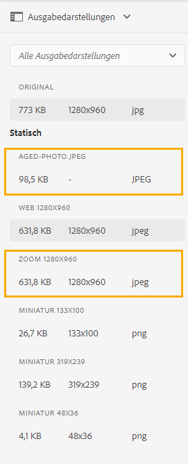

# Asset-Microservices und Verarbeitungsprofile verwenden {#get-started-using-asset-microservices}

Asset-Microservices erlauben eine skalierbare und zuverlässige Verarbeitung von Assets mithilfe von Cloud-nativen Anwendungen (auch als „Sekundäre“ bezeichnet). Adobe verwaltet die Service für eine optimale Handhabung verschiedener Asset-Typen und Verarbeitungsoptionen.

Mit Asset-Microservices können Sie eine [breite Palette von Dateitypen](/help/assets/file-format-support.md) verarbeiten, die mehr Formate standardmäßig abdecken, als dies mit früheren Versionen von [!DNL Experience Manager] möglich war. Beispielsweise ist jetzt die Extraktion von Miniaturansichten von PSD- und PSB-Formaten möglich, für die zuvor Lösungen von Drittanbietern wie [!DNL ImageMagick] erforderlich waren.

Die Asset-Verarbeitung hängt von der Konfiguration in **[!UICONTROL Verarbeitungsprofilen]** ab. Experience Manager bietet eine einfache Standardeinrichtung und ermöglicht es Admins, spezifischere Asset-Verarbeitungskonfigurationen hinzuzufügen. Administratoren können die Konfigurationen von Nachbearbeitungs-Workflows erstellen, verwalten und ändern, einschließlich optionaler Anpassungen. Durch Anpassen der Workflows können Entwickler das Standardangebot erweitern.

<!-- Proposed DRAFT diagram for asset microservices flow - see section "asset-microservices-flow.png (asset-microservices-configure-and-use.md)" in the PPTX deck

https://adobe-my.sharepoint.com/personal/gklebus_adobe_com/_layouts/15/guestaccess.aspx?guestaccesstoken=jexDC5ZnepXSt6dTPciH66TzckS1BPEfdaZuSgHugL8%3D&docid=2_1ec37f0bd4cc74354b4f481cd420e07fc&rev=1&e=CdgElS
-->

>[!NOTE]
>
>Die hier beschriebene Asset-Verarbeitung ersetzt das `DAM Update Asset`-Workflow-Modell, das in früheren Versionen von [!DNL Experience Manager] verwendet wurde. Die Asset-Microservices-Verarbeitung ersetzt die meisten Schritte zur Generierung von Standardausgabedarstellungen und Schritte in Zusammenhang mit Metadaten. Die Konfiguration des Nachbearbeitungs-Workflows kann die verbleibenden Schritte ersetzen, falls vorhanden.

## Optionen zur Asset-Verarbeitung verstehen {#get-started}

[!DNL Experience Manager] unterstützt die folgenden Verarbeitungsstufen.

| Option | Beschreibung | Anwendungsfälle |
|---|---|---|
| [Standardkonfiguration](#default-config) | Sie ist im Istzustand verfügbar und kann nicht geändert werden. Diese Konfiguration bietet eine einfache Funktion zur Erstellung von Ausgabedarstellungen. | <ul> <li>Standardmäßige Miniaturen, die von der [!DNL Assets]-Benutzeroberfläche verwendet werden (48, 140 und 319 Pixel) </li> <li> Große Vorschau (Web-Ausgabedarstellung – 1.280 Pixel) </li><li> Metadaten und Textextraktion.</li></ul> |
| [Benutzerdefinierte Konfiguration](#standard-config) | Wird von Admins über die Benutzeroberfläche konfiguriert. Durch Erweitern der Standardoption werden weitere Optionen für die Generierung von Ausgabedarstellungen bereitgestellt. Erweitert die vordefinierte Option, um verschiedene Formate und Ausgabedarstellungen bereitzustellen. | <ul><li>FPO-Ausgabedarstellung (nur für Platzierung). </li> <li>Dateiformat und Auflösung von Bildern ändern</li> <li> Bedingte Anwendung auf konfigurierte Dateitypen. </li> </ul> |
| [Benutzerdefiniertes Profil](#custom-config) | Von Administratoren über die Benutzeroberfläche konfiguriert, um benutzerdefinierten Code über benutzerdefinierte Programme zum Aufrufen des [Asset Compute-Service](https://experienceleague.adobe.com/de/docs/asset-compute/using/introduction) zu verwenden. Unterstützt komplexere Anforderungen in einer Cloud-nativen und skalierbaren Methode. | Siehe [Zulässige Anwendungsfälle](#custom-config). |

<!-- To create custom processing profiles specific to your custom requirements, say to integrate with other systems, see [post-processing workflows](#post-processing-workflows).
-->

## Unterstützte Dateiformate {#supported-file-formats}

Asset-Microservices bieten Unterstützung für eine Vielzahl von Dateiformaten, um Daten zu verarbeiten, Ausgabedarstellungen zu generieren oder Metadaten zu extrahieren. Unter [Unterstützte Dateiformate](file-format-support.md) finden Sie eine vollständige Liste der MIME-Typen und der jeweils unterstützten Funktionen.

## Standardkonfiguration {#default-config}

Einige Standardwerte sind vorkonfiguriert, um sicherzustellen, dass die in Experience Manager erforderlichen Standardausgabedarstellungen verfügbar sind. Außerdem stellt die Standardkonfiguration sicher, dass Metadatenextraktion und Textextraktion verfügbar sind. Benutzer können sofort mit dem Hochladen oder Aktualisieren von Assets beginnen. Die grundlegende Verarbeitung ist standardmäßig verfügbar.

Bei der Standardkonfiguration wird nur das einfachste Verarbeitungsprofil konfiguriert. Solch ein Verarbeitungsprofil ist in der Benutzeroberfläche nicht sichtbar und kann nicht geändert werden. Es wird immer ausgeführt, um hochgeladene Assets zu verarbeiten. Mit einem standardmäßigen Verarbeitungsprofil wird sichergestellt, dass die von [!DNL Experience Manager] benötigte grundlegende Verarbeitung für alle Assets durchgeführt wird.

<!-- 
-->

## Standardkonfiguration {#standard-config}

[!DNL Experience Manager] bietet Funktionen zum Generieren spezifischerer Ausgabedarstellungen für gängige Formate gemäß den Anforderungen der Benutzenden. Ein Administrator kann zusätzliche [!UICONTROL Verarbeitungsprofile] anlegen, um die Erstellung solcher Ausgabedarstellungen zu erleichtern. Benutzer können dann eines oder mehrere der verfügbaren Profile bestimmten Ordnern zuweisen, um die zusätzliche Verarbeitung zu erhalten. Beispielsweise kann die zusätzliche Verarbeitung Ausgabedarstellungen für Web, Smartphone und Tablet generieren. [In diesem Video erfahren Sie, wie Sie [!UICONTROL Verarbeitungsprofile“ erstellen und anwenden ] auf die erstellten Ausgabedarstellungen zugreifen](https://experienceleague.adobe.com/en/docs/experience-manager-learn/assets/content-automation/creative-operations).

* **Breite und Höhe der Ausgabedarstellung**: Das Angeben der Breite und Höhe der Ausgabedarstellung sorgt für die maximale Größe des generierten Ausgabebilds. Asset-Microservices versuchen, die größtmögliche Ausgabedarstellung zu erstellen, dessen Breite und Höhe nicht größer als die angegebene Breite bzw. Höhe sind. Das Seitenverhältnis wird beibehalten, d. h. es entspricht dem Original. Ein leerer Wert bedeutet, dass bei der Asset-Verarbeitung die Pixelabmessungen des Originals berücksichtigt werden.

* **Einschlussregeln für MIME-Typen**: Wenn ein Asset mit einem bestimmten MIME-Typ verarbeitet wird, wird der MIME-Typ zunächst mit dem Wert für die ausgeschlossenen MIME-Typen für die Ausgabespezifikation verglichen. Wenn er mit dieser Liste übereinstimmt, wird diese spezifische Ausgabedarstellung nicht für das Asset generiert (Blockierungsliste). Andernfalls wird der MIME-Typ mit dem eingeschlossenen MIME-Typ verglichen. Wenn er mit der Liste übereinstimmt, wird die Ausgabedarstellung generiert (Zulassungsliste).

* **Spezielle FPO-Ausgabedarstellung**: Beim Platzieren großer Assets aus [!DNL Experience Manager] in [!DNL Adobe InDesign]-Dokumenten muss ein Kreativprofi eine ganze Weile warten, nachdem er [ein Asset platziert](https://helpx.adobe.com/de/indesign/using/placing-graphics.html) hat. In der Zwischenzeit kann der Benutzer [!DNL InDesign] nicht verwenden. Dies unterbricht den kreativen Fluss und wirkt sich negativ auf das Kundenerlebnis aus. Adobe ermöglicht die zeitweilige Platzierung kleinformatiger Ausgabedarstellungen in [!DNL InDesign]-Dokumenten. Diese können später bei Assets On-Demand in voller Auflösung ersetzt werden. [!DNL Experience Manager] bietet Ausgabedarstellungen, die nur für die Platzierung verwendet werden. Diese FPO-Ausgabedarstellungen haben eine kleine Dateigröße, weisen aber dasselbe Seitenverhältnis auf.

Das Verarbeitungsprofil kann eine FPO-Wiedergabe (nur für Platzierung) enthalten. In der [!DNL Adobe Asset Link]-[Dokumentation](https://helpx.adobe.com/de/enterprise/using/manage-assets-using-adobe-asset-link.html) erfahren Sie, ob Sie es für Ihr Verarbeitungsprofil aktivieren müssen. Weitere Informationen finden Sie in der [vollständigen Dokumentation von Adobe Asset Link](https://helpx.adobe.com/de/enterprise/using/adobe-asset-link.html).

### Erstellen eines Standardprofils {#create-standard-profile}

1. Administratoren greifen auf **[!UICONTROL Tools]** > **[!UICONTROL Assets]** > **[!UICONTROL Verarbeitungsprofile]** zu. Klicken Sie auf **[!UICONTROL Erstellen]**.
1. Geben Sie einen Namen ein, der Ihnen hilft, das Profil beim Anwenden auf einen Ordner eindeutig zu identifizieren.
1. Um FPO-Ausgabedarstellungen zu erzeugen, aktivieren Sie auf der Registerkarte **[!UICONTROL Bild]** die Option **[!UICONTROL FPO-Ausgabedarstellung erstellen]**. Geben Sie für die **[!UICONTROL Qualität]** einen Wert von 1–100 ein.
1. Um andere Ausgabedarstellungen zu erstellen, klicken Sie auf **[!UICONTROL Neu hinzufügen]** und geben Sie die folgenden Informationen ein:

   * Dateiname der jeweiligen Ausgabedarstellung.
   * Dateiformat (PNG, JPEG, GIF oder WebP) der jeweiligen Ausgabedarstellung.
   * Breite und Höhe der jeweiligen Ausgabedarstellung in Pixel. Wenn nichts angegeben wird, wird die volle Pixelgröße des Originalbilds verwendet.
   * Qualität in Prozent der jeweiligen JPEG- und WebP-Ausgabedarstellung.
   * Eingeschlossene und ausgeschlossene MIME-Typen zur Definition der Anwendbarkeit eines Profils.

   

1. Klicken Sie auf **[!UICONTROL Speichern]**.

<!-- TBD: Update the video link when a new video is available from Tech Marketing.

The following video demonstrates the usefulness and usage of standard profile.

>[!VIDEO](https://video.tv.adobe.com/v/29832?quality=9)
-->

<!-- This image was removed per cqdoc-15624, as requested by engineering.
  
 -->

## Benutzerdefiniertes Profil und Anwendungsfälle {#custom-config}

Der [!DNL Asset Compute Service] unterstützt eine Vielzahl von Anwendungsfällen, einschließlich der standardmäßigen Verarbeitung und Verarbeitung von Adobe-spezifischen Formaten wie Photoshop-Dateien. Außerdem können benutzerdefinierte oder unternehmensspezifische Verarbeitungsschritte implementiert werden. Die zuvor erforderliche Anpassung des Workflows „DAM Update Asset“ wird entweder automatisch oder über die Konfiguration von Verarbeitungsprofilen vorgenommen. Falls diese Verarbeitungsoptionen Ihre Geschäftsanforderungen nicht erfüllen, empfiehlt Adobe, den [!DNL Asset Compute Service] zu entwickeln und zu verwenden, um die Standardfunktionen zu erweitern. Einen Überblick finden Sie unter [Erweiterbarkeit und Verwendungszeitpunkt](https://experienceleague.adobe.com/de/docs/asset-compute/using/extend/understand-extensibility).

>[!NOTE]
>
>Adobe empfiehlt die Verwendung eines benutzerdefinierten Programms nur dann, wenn die Geschäftsanforderungen mit den Standardkonfigurationen oder dem Standardprofil nicht erfüllt werden können.

Sie können Bild-, Video-, Dokument- und andere Dateiformate in verschiedene Ausgabedarstellungen umwandeln, einschließlich Miniaturen, extrahiertem Text und Metadaten sowie Archiven.

Entwickler können den [!DNL Asset Compute Service] verwenden, um [benutzerdefinierte Programme](https://experienceleague.adobe.com/de/docs/asset-compute/using/extend/develop-custom-application) für die unterstützten Anwendungsfälle zu erstellen. [!DNL Experience Manager] kann diese benutzerdefinierten Programme über die Benutzeroberfläche aufrufen, indem benutzerdefinierte Profile verwendet werden, die Administratoren konfigurieren. [!DNL Asset Compute Service] unterstützt die folgenden Anwendungsfälle beim Aufrufen externer Services:

* Verwenden Sie die [ImageCutout-API](https://developer.adobe.com/photoshop/photoshop-api-docs/) von [!DNL Adobe Photoshop] und speichern Sie das Ergebnis als Ausgabedarstellung.
* Rufen Sie Drittanbietersysteme auf, um Änderungen vorzunehmen, z. B. ein PIM-System.
* Verwenden Sie die [!DNL Photoshop]-API, um basierend auf der Photoshop-Vorlage verschiedene Ausgabedarstellungen zu erstellen.
* Verwenden Sie die [Adobe Lightroom-API](https://developer.adobe.com/photoshop/photoshop-api-docs/), um die aufgenommenen Assets zu optimieren und als Ausgabedarstellungen zu speichern.

>[!NOTE]
>
>Sie können Standardmetadaten nicht mit den benutzerdefinierten Programmen bearbeiten. Sie können nur benutzerdefinierte Metadaten ändern.

### Benutzerdefiniertes Profil erstellen {#create-custom-profile}

1. Admins greifen auf **[!UICONTROL Tools]** > **[!UICONTROL Assets]** > **[!UICONTROL Verarbeitungsprofile]** > **[!UICONTROL Erstellen]** zu.
1. Klicken Sie auf der Seite „Verarbeitungsprofil“ auf die Registerkarte **[!UICONTROL Benutzerdefiniert]** und dann auf **[!UICONTROL Neu hinzufügen]**.
1. Geben Sie im Textfeld „Name“ den gewünschten Dateinamen der Ausgabedarstellung ein und geben Sie dann die folgenden Informationen ein.

   * Dateiname der jeweiligen Ausgabedarstellung und eine unterstützte Dateierweiterung.
   * [Endpunkt-URL einer benutzerdefinierten App von App Builder](https://experienceleague.adobe.com/de/docs/asset-compute/using/extend/deploy-custom-application). Die Mobile App muss aus derselben Organisation stammen wie das Experience Manager-Konto.
   * Fügen Sie Service-Parameter hinzu, um [zusätzliche Informationen oder Parameter an das benutzerdefinierte Programm zu übergeben](https://experienceleague.adobe.com/de/docs/asset-compute/using/extend/develop-custom-application#extend).
   * Schließen Sie MIME-Typen ein und aus, um die Verarbeitung auf einige bestimmte Dateiformate zu beschränken.

1. Klicken Sie oben rechts auf der Seite auf **[!UICONTROL Speichern]**.

Bei den benutzerdefinierten Anwendungen handelt es sich um Headless-Apps von [Project App Builder](https://developer.adobe.com/app-builder/docs/overview/). Die benutzerdefinierte Anwendung erhält alle bereitgestellten Dateien, wenn sie mit einem Verarbeitungsprofil eingerichtet wurden. Die Anwendung muss die Dateien filtern.

>[!CAUTION]
>
>Wenn die App Builder-App und das [!DNL Experience Manager]-Konto nicht von derselben Organisation stammen, funktioniert die Integration nicht.

### Beispiel für ein benutzerdefiniertes Profil {#custom-profile-example}

Zur Veranschaulichung der Nutzung eines benutzerdefinierten Profils sollten wir uns einen Anwendungsfall ansehen, bei dem Kampagnenbilder mit benutzerdefiniertem Text versehen werden. Sie können ein Verarbeitungsprofil erstellen, das die Photoshop-API zum Bearbeiten der Bilder verwendet.

Die Asset Compute-Service-Integration ermöglicht es Experience Manager, diese Parameter mithilfe des Felds [!UICONTROL Dienstparameter] an das benutzerdefinierte Programm zu übergeben. Die benutzerdefinierte Anwendung ruft dann die Photoshop-API auf und übergibt die Werte an die API. Sie können beispielsweise Schriftartname, Textfarbe, Textstärke und Textgröße übergeben, um den benutzerdefinierten Text Kampagnenbildern hinzuzufügen.

<!-- TBD: Check screenshot against the interface. -->

*Abbildung: Verwenden des Felds [!UICONTROL Dienstparameter], um zusätzliche Informationen an vordefinierte Parameter zu übergeben, die in das benutzerdefinierte Programm eingebunden sind. In diesem Beispiel werden hochgeladene Kampagnenbilder mit `Jumanji`-Text in der `Arial-BoldMT`-Schriftart aktualisiert.*

## Verarbeitungsprofile zur Verarbeitung von Assets verwenden {#use-profiles}

Erstellen Sie zusätzliche benutzerdefinierte Verarbeitungsprofile und wenden Sie sie auf bestimmte Ordner an. Dieser Workflow ermöglicht es Experience Manager, Assets zu verarbeiten, die in diese Ordner hochgeladen oder in ihnen aktualisiert werden. Das standardmäßige integrierte Verarbeitungsprofil wird immer ausgeführt, ist jedoch in der Benutzeroberfläche nicht sichtbar. Wenn Sie ein benutzerdefiniertes Profil hinzufügen, werden beide Profil zur Verarbeitung der hochgeladenen Assets verwendet.

Verwenden Sie eine der folgenden Methoden, um Verarbeitungsprofile auf Ordner anzuwenden:

* Admins können unter **[!UICONTROL Tools]** > **[!UICONTROL Assets]** > **[!UICONTROL Verarbeitungsprofile]** eine Verarbeitungsprofildefinition auswählen und die Aktion **[!UICONTROL Profil auf Ordner anwenden]** nutzen. Dadurch wird ein Inhalts-Browser geöffnet, mit dem Sie zu bestimmten Ordnern navigieren, diese auswählen und die Anwendung des Profils bestätigen können.
* Wählen Sie einen Ordner in der Assets-Benutzeroberfläche aus und verwenden Sie zum Öffnen der Ordnereigenschaften die Aktion **[!UICONTROL Eigenschaften]**. Klicken Sie auf die Registerkarte **[!UICONTROL Asset-Verarbeitung]** und wählen Sie das entsprechende Verarbeitungsprofil für den Ordner aus der Liste [!UICONTROL Verarbeitungsprofil] aus. Klicken Sie auf **[!UICONTROL Speichern und schließen]**, um die Änderungen zu speichern.
  

* Benutzer können Ordner oder bestimmte Assets in der Assets-Benutzeroberfläche auswählen, um ein Verarbeitungsprofil anzuwenden, und dann die Option  **[!UICONTROL Assets erneut verarbeiten]** aus den oben verfügbaren Optionen auswählen.

>[!TIP]
>
>Auf einen Ordner kann nur ein Verarbeitungsprofil angewendet werden. Um weitere Ausgabedarstellungen zu generieren, fügen Sie dem bestehenden Verarbeitungsprofil weitere Darstellungsdefinitionen hinzu.

Nachdem ein Verarbeitungsprofil auf einen Ordner angewendet wurde, werden alle neuen Elemente, die in diesen Ordner oder in dessen Unterordnern hochgeladen (oder aktualisiert) werden, mit dem konfigurierten zusätzlichen Verarbeitungsprofil verarbeitet. Diese Verarbeitung erfolgt zusätzlich zum Standardprofil.

>[!NOTE]
>
>Ein Verarbeitungsprofil, das auf einen Ordner angewendet wird, funktioniert für die gesamte Struktur, kann aber mit einem anderen Profil überschrieben werden, das auf einen Unterordner angewendet wird. Wenn Assets in einen Ordner hochgeladen werden, prüft Experience Manager die Eigenschaften des zugehörigen Ordners auf ein Verarbeitungsprofil. Wenn nichts angewendet wird, wird in einem übergeordneten Ordner in der Hierarchie geprüft, ob ein Verarbeitungsprofil angewendet werden soll.

Um sicherzustellen, dass Assets verarbeitet werden, müssen Sie die erzeugten Ausgabedarstellungen in der Ansicht [!UICONTROL Ausgabedarstellungen] in der linken Leiste als Vorschau anzeigen. Öffnen Sie die Asset-Vorschau und dann die linke Leiste, um auf die Ansicht **[!UICONTROL Ausgabedarstellungen]** zuzugreifen. Die spezifischen Ausgabedarstellungen im Verarbeitungsprofil, für die der Typ des jeweiligen Assets mit den Einschlussregeln des MIME-Typs übereinstimmt, sollten sichtbar und zugänglich sein.

*Abbildung: Beispiel zweier zusätzlicher Ausgabedarstellungen, die von einem Verarbeitungsprofil generiert wurden, das auf den übergeordneten Ordner angewendet wurde.*

## Nachbearbeitungs-Workflows {#post-processing-workflows}

In Fällen, in denen eine zusätzliche Verarbeitung von Assets erforderlich ist, die mit den Verarbeitungsprofilen nicht erreicht werden kann, lassen sich zusätzliche Nachbearbeitungs-Workflows zur Konfiguration hinzufügen. Mit der Nachbearbeitung können Sie zusätzlich zur konfigurierbaren Verarbeitung mithilfe von Asset-Microservices eine vollständig angepasste Verarbeitung hinzufügen.

Nachdem die Verarbeitung der Microservices abgeschlossen ist, führt [!DNL Experience Manager] automatisch Nachbearbeitungs-Workflows aus, oder es kann [Workflows automatisch starten](https://experienceleague.adobe.com/de/docs/experience-manager-learn/assets/configuring/auto-start-workflows), wenn dies konfiguriert ist. Es ist nicht notwendig, Workflow-Starter manuell hinzuzufügen, um die Workflows auszulösen. Zu den Beispielen gehören:

* Benutzerdefinierte Workflow-Schritte zur Verarbeitung von Assets.
* Integrationen, um Assets von externen Systemen Metadaten oder Eigenschaften hinzuzufügen, z. B. Produkt- oder Prozessinformationen.
* Die zusätzliche Verarbeitung geschieht durch externe Dienste.

Gehen Sie wie folgt vor, um [!DNL Experience Manager] eine Workflow-Konfiguration für die Nachbearbeitung hinzuzufügen:

* Erstellen eines oder mehrerer Workflow-Modelle. Diese benutzerdefinierten Modelle werden in dieser Dokumentation als *Nachbearbeitungs-Workflow-Modelle* bezeichnet. Es handelt sich um normale [!DNL Experience Manager]-Workflow-Modelle.
* Fügen Sie diesen Modellen die erforderlichen Workflow-Schritte hinzu. Überprüfen Sie die Schritte aus dem Standard-Workflow und fügen Sie dem benutzerdefinierten Workflow alle erforderlichen Standardschritte hinzu. Die Schritte werden basierend auf einer Workflow-Modellkonfiguration für die Assets ausgeführt. Wenn beispielsweise beim Hochladen von Assets automatisch ein Smart-Tagging erfolgen soll, fügen Sie den Schritt zum benutzerdefinierten Workflow-Modell für die Nachbearbeitung hinzu.
* Fügen Sie am Ende den Schritt [!UICONTROL Workflow „DAM Update Asset“ abgeschlossen] hinzu. Durch Hinzufügen dieses Schritts wird sichergestellt, dass Experience Manager weiß, wann die Verarbeitung abgeschlossen ist, und das Asset als verarbeitet markiert werden kann, d. h., dass beim Asset der Wert *Neu* angezeigt wird.
* Erstellen Sie eine Konfiguration für den Custom Workflow Runner Service, mit der die Ausführung eines Nachbearbeitungs-Workflow-Modells entweder nach Pfad (Speicherort für Ordner) oder nach regulären Ausdrücken konfiguriert werden kann.

Weitere Informationen dazu, welcher standardmäßige Workflow-Schritt im Nachbearbeitungs-Workflow verwendet werden kann, finden Sie unter [Workflow-Schritte im Nachbearbeitungs-Workflow](developer-reference-material-apis.md#post-processing-workflows-steps) in der Entwicklerreferenz.

### Erstellen von Nachbearbeitungs-Workflow-Modellen {#create-post-processing-workflow-models}

Nachbearbeitungs-Workflow-Modelle sind normale [!DNL Experience Manager]-Workflow-Modelle. Erstellen Sie verschiedene Modelle, wenn Sie für verschiedene Repository-Standorte oder Asset-Typen eine unterschiedliche Verarbeitung benötigen.

Die Verarbeitungsschritte werden nach Bedarf hinzugefügt. Sie können sowohl die zur Verfügung stehenden unterstützten Schritte als auch beliebige benutzerdefinierte Workflow-Schritte verwenden.

Stellen Sie sicher, dass der letzte Schritt jedes Nachbearbeitungs-Workflows `DAM Update Asset Workflow Completed Process` ist. Der letzte Schritt stellt sicher, dass Experience Manager weiß, wann die Asset-Verarbeitung abgeschlossen ist.

### Konfigurieren der Ausführung von Nachbearbeitungs-Workflows {#configure-post-processing-workflow-execution}

Nachdem die Asset-Microservices die Verarbeitung der hochgeladenen Assets abgeschlossen haben, können Sie einen Nachbearbeitungs-Workflow definieren, um die Assets noch weiter zu verarbeiten. Um die Nachbearbeitung mithilfe von Workflow-Modellen zu konfigurieren, haben Sie folgende Möglichkeiten:

* [Wenden Sie ein Workflow-Modell im Ordner „Eigenschaften“ an](#apply-workflow-model-to-folder).
* [Konfigurieren Sie den Custom Workflow Runner-Service](#configure-custom-workflow-runner-service).

#### Anwenden eines Workflow-Modells auf einen Ordner {#apply-workflow-model-to-folder}

Für typische Anwendungsfälle nach der Verarbeitung sollten Sie den Einsatz der Methode, einen Workflow auf einen Ordner anzuwenden, erwägen. Gehen Sie wie folgt vor, um ein Workflow-Modell im Ordner [!UICONTROL Eigenschaften] anzuwenden:

1. Erstellen Sie ein Workflow-Modell.
1. Wählen Sie einen Ordner aus und klicken Sie in der Symbolleiste auf **[!UICONTROL Eigenschaften]** und dann auf die Registerkarte **[!UICONTROL Asset-Verarbeitung]**.
1. Wählen Sie unter **[!UICONTROL Workflow automatisch starten]** den gewünschten Workflow aus, geben Sie einen Titel für den Workflow ein und speichern Sie dann die Änderungen.

   

#### Konfigurieren des Custom Workflow Runner-Services {#configure-custom-workflow-runner-service}

Sie können den Custom Workflow Runner-Service für die erweiterten Konfigurationen konfigurieren, die nicht ohne Weiteres erfüllt werden können, indem Sie einen Workflow auf einen Ordner anwenden. Beispiel: ein Workflow, der einen regulären Ausdruck verwendet. Der Adobe CQ DAM Custom Workflow Runner (`com.adobe.cq.dam.processor.nui.impl.workflow.CustomDamWorkflowRunnerImpl`) ist ein OSGi-Service. Er bietet die beiden folgenden Konfigurationsoptionen:

* Nachbearbeitungs-Workflows nach Pfad (`postProcWorkflowsByPath`): Es können mehrere Workflow-Modelle basierend auf unterschiedlichen Repository-Pfaden aufgeführt werden. Trennen Sie Pfade und Modelle mithilfe eines Doppelpunkts. Einfache Repository-Pfade werden unterstützt. Ordnen Sie diese einem Workflow-Modell im Pfad `/var` zu. Beispiel: `/content/dam/my-brand:/var/workflow/models/my-workflow`.
* Nachbearbeitungs-Workflows nach Ausdruck (`postProcWorkflowsByExpression`): Es können mehrere Workflow-Modelle basierend auf unterschiedlichen regulären Ausdrücken aufgelistet werden. Trennen Sie Pfade und Modelle mithilfe eines Doppelpunkts. Der reguläre Ausdruck sollte direkt auf den Asset-Knoten verweisen und nicht auf eine der Ausgabedarstellungen oder Dateien. Beispiel: `/content/dam(/.*/)(marketing/seasonal)(/.*):/var/workflow/models/my-workflow`.

Informationen zum Bereitstellen einer OSGi-Konfiguration finden Sie unter [Bereitstellen für [!DNL Experience Manager]](/help/implementing/deploying/overview.md).

#### Deaktivieren der Ausführung von Nachbearbeitungs-Workflows

Wenn keine Nachbearbeitung erforderlich ist, erstellen und verwenden Sie ein „leeres“ Workflow-Modell in der Auswahl **Workflow automatisch starten**.

##### Erstellen des deaktivierten Modells „Workflow automatisch starten“

1. Gehen Sie zu **Tools** > **Workflow** > **Modelle**.
1. Wählen Sie in der oberen Aktionsleiste **Erstellen** > **Modell erstellen** aus.
1. Geben Sie einen Titel und einen Namen für das neue Workflow-Modell an, Beispiel:
   * Titel: Deaktivieren des automatisch gestarteten Workflows
   * Name: disable-auto-start-workflow
1. Klicken Sie auf **Fertig**, um das Workflow-Modell zu erstellen.
1. Wählen Sie das erstellte Workflow-Modell aus und bearbeiten Sie es.
1. Wählen Sie im Workflow-Modell-Editor die Option **Schritt 1** aus der Modelldefinition aus und löschen Sie sie.
1. Klicken Sie im seitlichen Bedienfeld auf **Schritte**.
1. Ziehen Sie den Schritt **Workflow „DAM Update Asset“ abgeschlossen** in die Modelldefinition.
1. Klicken Sie auf die Schaltfläche **Seiteninformationen** (neben dem Umschalter für das **seitliche Bedienfeld**) aus und dann auf **Eigenschaften öffnen**.
1. Klicken Sie unter der Registerkarte „Allgemein“ auf die Option **Übergangs-Workflow**.
1. Klicken Sie in der oberen Aktionsleiste auf **Speichern und schließen**.
1. Klicken Sie in der oberen Aktionsleiste auf **Synchronisieren**.
1. Schließen Sie den Workflow-Modell-Editor.

##### Anwenden des Modells „Workflow für automatischen Start deaktivieren“

Befolgen Sie die Schritte unter [Anwenden eines Workflow-Modells auf einen Ordner](#apply-workflow-model-to-folder) und legen Sie **Workflow für automatischen Start deaktivieren** für **Workflow automatisch starten** für Ordner fest, bei denen keine Nachbearbeitung von Assets erforderlich ist.

## Best Practices und Einschränkungen {#best-practices-limitations-tips}

* Berücksichtigen Sie beim Entwickeln von Workflows Ihre Anforderungen für alle Arten von Ausgabedarstellungen. Wenn Sie der Meinung sind, dass eine Ausgabedarstellung in Zukunft nicht erforderlich sein wird, entfernen Sie den Erstellungsschritt aus dem Workflow. Ausgabedarstellungen können später nicht mehr stapelweise gelöscht werden. Unerwünschte Ausgabedarstellungen können nach längerer Nutzung von [!DNL Experience Manager] viel Speicherplatz beanspruchen. Bei einzelnen Assets können Sie Ausgabedarstellungen manuell aus der Benutzeroberfläche entfernen. Bei mehreren Assets können Sie [!DNL Experience Manager] so anpassen, dass entweder bestimmte Ausgabedarstellungen gelöscht oder die Assets gelöscht und dann die gelöschten Assets erneut hochgeladen werden.
* Derzeit ist die Unterstützung auf das Erzeugen von Ausgabedarstellungen beschränkt. Das Erstellen neuer Assets wird nicht unterstützt.
* Derzeit beträgt die maximale Dateigröße für die Extraktion von Metadaten etwa 15 GB. Beim Hochladen sehr großer Assets schlägt die Metadatenextraktion manchmal fehl.

**Siehe auch**

* [Assets übersetzen](translate-assets.md)
* [Assets-HTTP-API](mac-api-assets.md)
* [Von AEM Assets unterstützte Dateiformate](file-format-support.md)
* [Suchen von Assets](search-assets.md)
* [Connected Assets](use-assets-across-connected-assets-instances.md)
* [Asset-Berichte](asset-reports.md)
* [Metadatenschemata](metadata-schemas.md)
* [Herunterladen von Assets](download-assets-from-aem.md)
* [Verwalten von Metadaten](manage-metadata.md)
* [Suchfacetten](search-facets.md)
* [Verwalten von Sammlungen](manage-collections.md)
* [Massenimport von Metadaten](metadata-import-export.md)
* [Veröffentlichen von Assets in AEM und Dynamic Media](/help/assets/publish-assets-to-aem-and-dm.md)

>[!MORELIKETHIS]
>
>* [Einführung in den Asset Compute-Service](https://experienceleague.adobe.com/de/docs/asset-compute/using/introduction).
>* [Erweiterbarkeit und Verwendungszeitpunkt](https://experienceleague.adobe.com/de/docs/asset-compute/using/extend/understand-extensibility).
>* [So erstellen Sie benutzerdefinierte Programme](https://experienceleague.adobe.com/de/docs/asset-compute/using/extend/develop-custom-application).
>* [Interstützte MIME-Typen für verschiedene Anwendungsfälle](/help/assets/file-format-support.md).

<!-- TBD: 
* How/where can admins check what's already configured and provisioned.
* How/where to request for new provisioning/purchase.
-->
