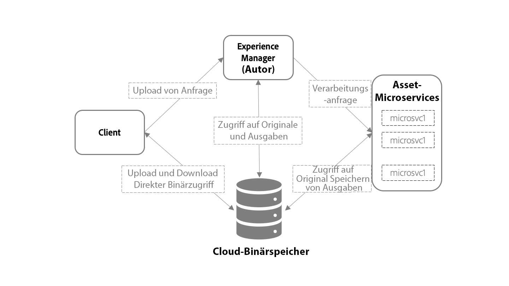

# Übersicht über die Asset-Erfassung und -Verarbeitung mit Asset-Mikrodiensten {#asset-microservices-overview}

<!--
First half of content at https://git.corp.adobe.com/aklimets/project-nui/blob/master/docs/Project-Nui-Asset-Compute-Service.md is useful for this article.
TBD: Post-GA we will provide detailed information at \help\assets\asset-microservices-configure-and-use.md. However, for GA, all information is added, in short, in this article.
-->

Adobe Experience Manager als Cloud-Dienst bietet eine Cloud-native Möglichkeit, Experience Manager-Anwendungen und -Funktionen zu nutzen. Eines der Schlüsselelemente dieser neuen Architektur ist die Asset-Erfassung und -Verarbeitung, die auf Asset-Mikrodiensten basiert.

Asset-Mikrodienste bieten eine skalierbare und widerstandsfähige Verarbeitung von Assets mithilfe von Cloud-Diensten, die von Adobe verwaltet werden, um eine optimale Verarbeitung verschiedener Asset-Typen und Verarbeitungsoptionen zu gewährleisten. Die wichtigsten Vorteile sind:

* Skalierbare Architektur, die eine nahtlose Verarbeitung für ressourcenintensive Vorgänge ermöglicht.
* Effiziente Indizierung und Textanpassung, die die Performance Ihrer Experience Manager-Umgebung nicht beeinträchtigen.
* Minimieren Sie die Notwendigkeit, dass Workflows die Verarbeitung von Assets in der Experience Manager-Umgebung verarbeiten. Dadurch werden Ressourcen freigesetzt, die Belastung mit Experience Manager minimiert und Skalierbarkeit gewährleistet.
* Verbesserte Widerstandsfähigkeit bei der Verarbeitung von Assets. Potenzielle Probleme beim Umgang mit atypischen Dateien, wie beschädigte Dateien oder extrem große Dateien, wirken sich nicht mehr auf die Leistung der Bereitstellung aus.
* Vereinfachte Konfiguration der Asset-Verarbeitung für Administratoren.
* Das Setup zur Verarbeitung von Assets wird von Adobe verwaltet und verwaltet, um die bestbekannte Konfiguration für die Verarbeitung von Darstellungen, Metadaten und Textdateien für verschiedene Dateitypen bereitzustellen.
* Native Adobe-Dateiverarbeitungsdienste werden gegebenenfalls verwendet, um eine hohe Originaltreue und [effiziente Verarbeitung von Adobe-proprietären Formaten](file-format-support.md)zu gewährleisten.
* Möglichkeit zur Konfiguration des Arbeitsablaufs für die Nachbearbeitung, um benutzerspezifische Aktionen und Integrationen hinzuzufügen.

Mithilfe von Asset-Mikrodiensten können Sie die Notwendigkeit von Rendering-Tools von Drittanbietern (wie ImageMagick) vermeiden und die Konfiguration des Systems vereinfachen. Gleichzeitig erhalten Sie sofort verfügbare Funktionen für gängige Dateitypen.

## Hochrangige Architektur {#asset-microservices-architecture}

In einem übergeordneten Architekturdiagramm werden die Schlüsselelemente der Asset-Erfassung, -Verarbeitung und -Fluss im System dargestellt.

<!-- Proposed DRAFT diagram for asset microservices overview - see section "Asset processing - high-level diagram" in the PPTX deck

https://adobe-my.sharepoint.com/personal/gklebus_adobe_com/_layouts/15/guestaccess.aspx?guestaccesstoken=jexDC5ZnepXSt6dTPciH66TzckS1BPEfdaZuSgHugL8%3D&docid=2_1ec37f0bd4cc74354b4f481cd420e07fc&rev=1&e=CdgElS
-->

Die wichtigsten Schritte zur Erfassung und Verarbeitung mithilfe von Asset-Mikrodiensten sind:

* Clients wie Webbrowser oder Adobe Asset Link senden eine Upload-Anfrage an Experience Manager und Beginn, um die Binärdatei direkt in die binäre Cloud-Datenspeicherung hochzuladen.
* Nach Abschluss des direkten binären Uploads benachrichtigt der Client Experience Manager.
* Experience Manager sendet eine Verarbeitungsanfrage an Asset Microservices. Der Inhalt der Anforderung hängt von der Konfiguration der verarbeitenden Profil in Experience Manager ab, die angeben, welche Darstellungen generiert werden sollen.
* Assets microservices Back-End empfängt die Anforderung, sendet sie basierend auf der Anforderung an einen oder mehrere Mikrodienste. Jeder Mikroservice greift direkt vom binären Cloud-Store auf die ursprüngliche Binärdatei zu.
* Die Verarbeitungsergebnisse, z. B. Darstellungen, werden in der binären Cloud-Datenspeicherung gespeichert.
* Experience Manager wird benachrichtigt, dass die Verarbeitung abgeschlossen ist und direkte Verweise auf die generierten Binärdateien (Darstellungen) vorhanden sind, die dann in Experience Manager für das hochgeladene Asset verfügbar sind

Dies ist der grundlegende Fluss der Asset-Erfassung und -Verarbeitung. Wenn dies konfiguriert ist, kann Experience Manager auch das Workflow-Modell des Beginns verwenden, um die Nachbearbeitung des Assets durchzuführen, z. B. um einige benutzerdefinierte Schritte auszuführen, die für die Umgebung des Kunden spezifisch sind, z. B. das Abrufen von Informationen aus den Unternehmenssystemen des Kunden, die den Asset-Eigenschaften hinzugefügt werden sollen.

Die Erfassung und der Verarbeitungsfluss sind Schlüsselkonzepte der Asset Microservices-Architektur für Experience Manager.

* **Direkter binärer Zugriff**: Assets werden in den Cloud Binary Store übertragen (und hochgeladen), sobald sie für Experience Manager-Umgebung konfiguriert wurden. Anschließend erhalten AEM, Asset-Mikrodienste und schließlich Clients direkten Zugriff auf sie, um ihre Arbeit auszuführen. Dadurch wird die Belastung in Netzwerken und die Duplizierung der gespeicherten Binärdateien minimiert
* **Externalisierte Verarbeitung**: Die Verarbeitung von Assets erfolgt außerhalb von AEM Umgebung und spart ihre Ressourcen (CPU, Arbeitsspeicher), um wichtige Digital Asset Management-Funktionen bereitzustellen und die interaktive Arbeit mit dem System für Endbenutzer zu unterstützen.

## Asset-Upload mit direktem binären Zugriff {#asset-upload-with-direct-binary-access}

Experience Manager-Clients, die Teil des Produktangebots sind, unterstützen standardmäßig alle Uploads mit direktem binären Zugriff. Dazu gehören das Hochladen über die Weboberfläche, Adobe Asset Link und AEM-Desktop-App.

Sie können benutzerdefinierte Upload-Tools verwenden, die direkt mit AEM HTTP-APIs funktionieren. Sie können diese APIs direkt verwenden oder die folgenden Open-Source-Projekte verwenden und erweitern, die das Upload-Protokoll implementieren:

* [Open-Source-Upload-Bibliothek](https://github.com/adobe/aem-upload)
* [Open-Source-Befehlszeilenwerkzeug](https://github.com/adobe/aio-cli-plugin-aem)

For more information, see [upload assets](add-assets.md).

## Hinzufügen Nachbearbeitung benutzerdefinierter Assets {#add-custom-asset-post-processing}

Während die meisten Kunden alle ihre Asset-Verarbeitungsanforderungen von den konfigurierbaren Asset-Mikrodiensten erhalten sollten, benötigen einige möglicherweise zusätzliche Asset-Verarbeitung. Dies gilt insbesondere dann, wenn Assets auf der Grundlage von Informationen aus anderen Systemen über Integrationen verarbeitet werden müssen. In solchen Fällen können benutzerdefinierte Workflows verwendet werden.

Nachbearbeitungs-Workflows sind normale AEM-Workflow-Modelle, die im AEM Workflow-Editor erstellt und verwaltet werden. Kunden können die Workflows so konfigurieren, dass sie zusätzliche Verarbeitungsschritte für ein Asset ausführen, einschließlich der verfügbaren vordefinierten Arbeitsablaufschritte und benutzerdefinierter Workflows.

Adobe Experience Manager kann so konfiguriert werden, dass nach Abschluss der Asset-Verarbeitung automatisch Workflows nach der Verarbeitung ausgelöst werden.

<!-- TBD asgupta, Engg: Create some asset-microservices-data-flow-diagram.
-->

>[!MORELIKETHIS]
>
>* [Erste Schritte mit Asset-Microservices](asset-microservices-configure-and-use.md)
>* [Unterstützte Dateiformate](file-format-support.md)
>* [Adobe Asset Link](https://helpx.adobe.com/enterprise/using/adobe-asset-link.html)
>* [AEM Desktop App](https://docs.adobe.com/content/help/en/experience-manager-desktop-app/using/introduction.html)
>* [Apache Oak-Dokumentation für direkten binären Zugriff](https://jackrabbit.apache.org/oak/docs/features/direct-binary-access.html)

