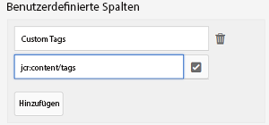

# Asset-Berichte {#asset-reports}

Asset-Berichte stellen ein wesentliches Tool für die Bewertung der Funktionalität Ihrer Bereitstellung von Adobe Experience Manager (AEM) Assets dar. Mit AEM Assets können Sie eine Vielzahl von Berichten zu Ihren digitalen Assets generieren. Die Berichte bieten hilfreiche Informationen über die Nutzung Ihres Systems, über die Art und Weise, wie Benutzer mit Assets interagieren und welche Assets heruntergeladen und freigegeben werden.

Verwenden Sie die Informationen in den Berichten, um wichtige Erfolgsmetriken abzuleiten, um die Akzeptanz von AEM Assets in Ihrem Unternehmen und nach Kunden zu messen.

Das Berichterstellungs-Framework von AEM Assets nutzt Sling-Aufträge, um Berichtsanfragen auf überschaubare Art asynchron zu verarbeiten. Es ist für große Repositorys skalierbar. Die asynchrone Berichtsverarbeitung steigert die Effizienz und Geschwindigkeit der Berichtsgenerierung.

Die Berichtsverwaltungsoberfläche ist intuitiv und umfasst detaillierte Optionen und Steuerelemente für den Zugriff auf archivierte Berichte und das Anzeigen des Ausführungsstatus von Berichten („Erfolg“, „Fehlgeschlagen“ und „In Warteschlange“).

Wenn ein Bericht generiert wird, werden Sie mit einer E-Mail (optional) und einer Benachrichtigung im Posteingang benachrichtigt. Sie können einen Bericht auf der Berichtslistenseite anzeigen, herunterladen oder löschen. Dort werden alle zuvor generierten Berichte angezeigt.

## Erstellen von Berichten {#generate-reports}

AEM Assets generiert die folgenden standardmäßigen Berichte für Sie:

* Hochladen
* Download
* Ablauf
* Änderung
* Veröffentlichen
* Veröffentlichung in Brand Portal
* Festplattenauslastung
* Dateien
* Linkfreigabe

AEM-Administratoren können diese Berichte einfach für Ihre Implementierung erstellen und anpassen. Um einen Bericht zu erstellen, müssen Administratoren folgende Schritte durchführen:

1. Tippen/Klicken Sie auf das AEM-Logo und gehen Sie zu **[!UICONTROL Werkzeuge]** > **[!UICONTROL Assets]** > **[!UICONTROL Berichte]**.

   

1. In the Asset Reports page, tap/click **[!UICONTROL Create]** from the toolbar.
1. Wählen Sie auf der Seite **[!UICONTROL Bericht erstellen]** den Bericht aus, den Sie erstellen möchten, und tippen/klicken Sie auf **[!UICONTROL Weiter]**.

   

   >[!NOTE]
   >
   >Bevor Sie einen **[!UICONTROL Asset-Download]**-Bericht erstellen können, stellen Sie sicher, dass der Asset-Download-Service aktiviert ist. Öffnen Sie in der Web Console (`https://[aem_server]:[port]/system/console/configMgr`) die **[!UICONTROL Day CQ DAM Event Recorder]**-Konfiguration und wählen Sie die Option **[!UICONTROL Asset heruntergeladen (HERUNTERGELADEN)]** in den Ereignistypen, falls nicht bereits ausgewählt.

   >[!NOTE]
   >
   >Standardmäßig sind die Inhaltsfragmente und Linkfreigaben im Bericht „Asset heruntergeladen“ enthalten. Wählen Sie die passende Option aus, um einen Bericht zu Linkfreigaben zu erstellen oder Inhaltsfragmente aus dem Downloadbericht auszuschließen.

1. Konfigurieren Sie die Berichtdetails wie Titel, Beschreibung, Miniaturansicht sowie den Ordnerpfad im CRX-Repository, der den Speicherort des Berichts angibt. By default, the folder path is */content/dam*. Sie können auch einen anderen Pfad festlegen.

   

   Wählen Sie den Datumsbereich für Ihren Bericht aus.

   Sie können den Bericht wahlweise sofort oder zu einem zukünftigen Zeitpunkt generieren lassen.

   >[!NOTE]
   >
   >Wenn Sie sich dafür entscheiden, den Bericht für einen späteren Zeitpunkt zu planen, geben Sie unbedingt das Datum und die Uhrzeit in das Feld „Datum und Uhrzeit“ ein. Wenn Sie keinen Wert angeben, behandelt die Berichterstattungs-Engine den Bericht als einen sofort zu erstellenden Bericht.

   Die Konfigurationsfelder unterscheiden sich möglicherweise basierend auf der Art des erstellten Berichts.

   Beispielsweise bietet der Bericht zur **[!UICONTROL Festplattenauslastung]** Optionen, um bei der Berechnung des von Assets genutzten Festplattenvolumens Asset-Ausgabeformate miteinzubeziehen. Sie können Assets in Unterordnern bei der Berechnung der Festplattenauslastung miteinbeziehen oder ausschließen.

   >[!NOTE]
   >
   >Der Bericht **[!UICONTROL Festplattennutzung]** enthält keine Datumsbereichsfelder, da er nur die aktuelle Festplattenspeichernutzung angibt.

   

   Wenn Sie den Bericht zu **[!UICONTROL Dateien]** erstellen, können Sie Unterordner miteinbeziehen/ausschließen. Bei diesem Bericht können Sie jedoch keine Asset-Ausgabeformate miteinbeziehen.

   

   Der Bericht **[!UICONTROL Linkfreigabe]** zeigt URLs zu Assets an, die für externe Benutzer aus AEM Assets freigegeben wurden. Er enthält E-Mail-IDs des Benutzers, der die Assets freigegeben hat, E-Mail-IDs von Benutzern, für die die Assets freigegeben wurden, Freigabedatum und Ablaufdatum des Links. Die Spalten können nicht angepasst werden.

   Der Bericht **[!UICONTROL Linkfreigabe]** enthält keine Optionen für Unterordner und Ausgabedarstellungen, da er lediglich die freigegebenen URLs veröffentlicht, die unter */var/dam/share* angezeigt werden.

   

1. Tippen/klicken Sie in der Symbolleiste auf **[!UICONTROL Weiter]**.

1. Auf der Seite **[!UICONTROL Spalten konfigurieren]** sind einige Spalten standardmäßig für den Bericht ausgewählt. Sie können zusätzliche Spalten auswählen. Heben Sie die Auswahl einer Spalte auf, wenn sie nicht im Bericht angezeigt werden soll.

   

   Um einen benutzerdefinierten Spaltennamen oder Eigenschaftenpfad anzuzeigen, konfigurieren Sie die Eigenschaften für die Asset-Binärdatei unter dem Knoten &quot;jcr:content&quot;in CRX. Alternativ können Sie sie über die Eigenschaftenpfadauswahl hinzufügen.

   

1. Tap/click **[!UICONTROL Create]** from the toolbar. Eine Meldung benachrichtigt Sie darüber, dass die Berichtserstellung startet.
1. Auf der Seite &quot;Asset-Berichte&quot;basiert der Status der Berichtgenerierung auf dem aktuellen Status des Berichtsauftrags, z. B. &quot;Erfolg&quot;, &quot;Fehlgeschlagen&quot;, &quot;Warteschlange&quot;oder &quot;Eingeplant&quot;. Derselbe Status wird im Posteingang für Benachrichtigungen angezeigt.

   Um die Berichtsseite aufzurufen, tippen/klicken Sie auf den Link zum Bericht. Alternativ wählen Sie den Bericht aus und tippen/klicken Sie in der Symbolleiste auf das Symbol „Anzeigen“.

   

   Tippen/klicken Sie in der Symbolleiste auf das Symbol „Download“, um den Bericht im CSV-Format herunterzuladen.

## Hinzufügen benutzerdefinierter Spalten {#add-custom-columns}

Sie können folgenden Berichten benutzerdefinierte Spalten hinzufügen, um weitere Daten für Ihre speziellen Anforderungen anzuzeigen:

* Hochladen
* Download
* Ablauf
* Änderung
* Veröffentlichen
* Veröffentlichung in Brand Portal
* Dateien

1. Tippen/Klicken Sie auf das AEM-Logo und gehen Sie zu **[!UICONTROL Werkzeuge]** > **[!UICONTROL Assets]** > **[!UICONTROL Berichte]**.
1. In the Asset Reports page, tap/click **[!UICONTROL Create]** from the toolbar.

1. Wählen Sie auf der Seite **[!UICONTROL Bericht erstellen]** den Bericht aus, den Sie erstellen möchten, und tippen/klicken Sie auf **[!UICONTROL Weiter]**.
1. Konfigurieren Sie je nach Bedarf Berichtdetails wie den Titel, eine Beschreibung, eine Miniaturansicht, den Ordnerpfad, den Datumsbereich usw.

1. Um eine benutzerspezifische Spalte anzuzeigen, geben Sie den Namen der Spalte unter **[!UICONTROL Benutzerdefinierte Spalten]** an.

   

1. Add the property path under the `jcr:content` node in CRXDE using the property path picker.

   

   Alternativ können Sie den Pfad im Feld „Eigenschaftspfad“ eingeben.

   

   Tippen/klicken Sie auf **[!UICONTROL Hinzufügen]** und wiederholen Sie die Schritte 5 und 6, um weitere benutzerdefinierte Spalten hinzuzufügen.

1. Tap/click **[!UICONTROL Create]** from the toolbar. Eine Meldung benachrichtigt Sie darüber, dass die Berichtserstellung startet.

## Konfigurieren des Bereinigungsdiensts {#configure-purging-service}

Um nicht mehr benötigte Berichte zu entfernen, konfigurieren Sie den Bereinigungsdienst für DAM-Berichte über die Web-Konsole, um vorhandene Berichte basierend auf Menge und Alter zu bereinigen.

1. Access the web console (configuration manager) from `https://[aem_server]:[port]/system/console/configMgr`.
1. Open the **[!UICONTROL DAM Report Purge Service]** configuration.
1. Specify the frequency (time interval) for the purging service in the `scheduler.expression.name` field. Sie können auch die Schwellenwerte für das Alter und die Menge der Berichte konfigurieren.
1. Speichern Sie die Änderungen.
