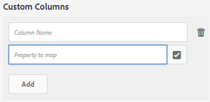

# Asset-Berichte {#asset-reports}

<table>
    <tr>
        <td>
            <i>Neu</i> <a href="/help/assets/dynamic-media/dm-prime-ultimate.md"><b>Dynamic Media Prime und Ultimate</b></a>
        </td>
        <td>
            <i>Neu</i> <a href="/help/assets/assets-ultimate-overview.md"><b>AEM Assets Ultimate</b></a>
        </td>
        <td>
            <i>Neu</i> <a href="/help/assets/integrate-aem-assets-edge-delivery-services.md"><b>AEM Assets-Integration mit Edge Delivery Services</b></a>
        </td>
        <td>
            <i>Neu</i> <a href="/help/assets/aem-assets-view-ui-extensibility.md"><b>Erweiterbarkeit der Benutzeroberfläche</b></a>
        </td>
          <td>
            <i>Neu</i> <a href="/help/assets/dynamic-media/enable-dynamic-media-prime-and-ultimate.md"><b>Aktivieren von Dynamic Media Prime und Ultimate</b></a>
        </td>
    </tr>
    <tr>
        <td>
            <a href="/help/assets/search-best-practices.md"><b>Best Practices für die Suche</b></a>
        </td>
        <td>
            <a href="/help/assets/metadata-best-practices.md"><b>Best Practices für Metadaten</b></a>
        </td>
        <td>
            <a href="/help/assets/product-overview.md"><b>Content Hub</b></a>
        </td>
        <td>
            <a href="/help/assets/dynamic-media-open-apis-overview.md"><b>Dynamic Media mit OpenAPI-Funktionen</b></a>
        </td>
        <td>
            <a href="https://developer.adobe.com/experience-cloud/experience-manager-apis/"><b>Entwicklerdokumentation zu AEM Assets</b></a>
        </td>
    </tr>
</table>

| Version | Artikel-Link |
| -------- | ---------------------------- |
| AEM 6.5 | [Hier klicken](https://experienceleague.adobe.com/docs/experience-manager-65/assets/administer/asset-reports.html?lang=de) |
| AEM as a Cloud Service | Dieser Artikel |

Mit Asset-Berichten können Sie die Nützlichkeit Ihrer [!DNL Adobe Experience Manager Assets]-Bereitstellung bewerten. Mit [!DNL Assets] können Sie verschiedene Berichte für Ihre digitalen Assets erstellen. Die Berichte bieten hilfreiche Informationen über die Nutzung Ihres Systems, über die Art und Weise, wie Benutzende mit Assets interagieren, und darüber, welche Assets <!-- downloaded and --> freigegeben werden.

Verwenden Sie die Informationen aus den Berichten, um wesentliche Erfolgsmetriken abzuleiten und so zu messen, wie gut [!DNL Assets] innerhalb Ihrer Organisation und von Ihren Kunden angenommen wird.

Das [!DNL Assets]-Reporting-Framework verwendet [!DNL Sling]-Aufträge asynchron, um Berichtsanfragen in einer geordneten Weise zu verarbeiten. Es ist für große Repositorys skalierbar. Die asynchrone Berichtsverarbeitung erhöht die Effizienz und Geschwindigkeit der Berichterstellung.

Die Berichtsverwaltungsoberfläche ist intuitiv und umfasst detaillierte Optionen und Steuerelemente für den Zugriff auf archivierte Berichte und das Anzeigen des Ausführungsstatus von Berichten („Erfolg“, „Fehlgeschlagen“ und „In Warteschlange“).

Wenn ein Bericht generiert wird, werden Sie über <!-- through an email (optional) and --> eine Benachrichtigung im Posteingang benachrichtigt. Auf der Berichtslistenseite können Sie einen Bericht anzeigen, herunterladen oder löschen. Dort werden alle zuvor generierten Berichte angezeigt.

## Erzeugen von Berichten {#generate-reports}

[!DNL Experience Manager Assets] generiert die folgenden standardmäßigen Berichte für Sie:

* Hochladen
* Herunterladen
* Ablauf
* Änderung
* Veröffentlichen
* [!DNL Brand Portal]-Veröffentlichung
* Speichernutzung
* Dateien
* Link-Freigabe

<!-- Removed download report.
* Upload
* Download
* Expiration
* Modification
* Publish
* [!DNL Brand Portal] publish
* Disk Usage
* Files
* Link Share
-->

[!DNL Adobe Experience Manager]-Administratoren können diese Berichte einfach für Ihre Implementierung erstellen und anpassen. Um einen Bericht zu erstellen, müssen Administratoren folgende Schritte durchführen:

1. Klicken Sie in der [!DNL Experience Manager]-Benutzeroberfläche auf **[!UICONTROL Tools]** > **[!UICONTROL Assets]** > **[!UICONTROL Berichte]**.

   

1. Klicken Sie auf der Seite [!UICONTROL Asset-Berichte] in der Symbolleiste auf **[!UICONTROL Erstellen]**.
1. Wählen Sie auf der Seite **[!UICONTROL Bericht erstellen]** den Bericht aus, den Sie erstellen möchten, und klicken Sie auf **[!UICONTROL Weiter]**.

   >[!NOTE]
   >
   >Weisen Sie sich ein **AEM-Admin-Produktprofil** zu, um einen **Download**-Bericht zu erstellen. Siehe [Zuweisen von AEM-Produktprofilen](https://experienceleague.adobe.com/de/docs/experience-manager-cloud-service/content/onboarding/journey/assign-profiles-aem), um zu erfahren, wie Sie sich einem AEM Administrator-Produktprofil zuweisen.

   

1. Konfigurieren Sie Berichtsdetails wie Titel, Beschreibung, Miniaturansicht und Ordnerpfad. Der standardmäßige Ordnerpfad lautet `/content/dam`. Sie können einen anderen Pfad angeben, um den Bericht für einen bestimmten Ordner auszuführen.

   

   Wählen Sie den Datumsbereich für Ihren Bericht aus. Sie können den Bericht wahlweise sofort oder zu einem zukünftigen Zeitpunkt generieren lassen.

   >[!NOTE]
   >
   >Wenn Sie sich dafür entscheiden, den Bericht für einen späteren Zeitpunkt zu planen, geben Sie unbedingt das Datum und die Uhrzeit in das Feld „Datum und Uhrzeit“ ein. Wenn Sie keinen Wert angeben, behandelt die Reporting-Engine den Bericht als einen sofort zu erstellenden Bericht.

   Die Konfigurationsfelder unterscheiden sich möglicherweise basierend auf der Art des erstellten Berichts. Beispielsweise bietet der Bericht zur **[!UICONTROL Festplattenauslastung]** Optionen, um bei der Berechnung des von Assets genutzten Festplattenvolumens Asset-Ausgabedarstellungen miteinzubeziehen. Sie können Assets in Unterordnern bei der Berechnung der Festplattenauslastung miteinbeziehen oder ausschließen.

   >[!NOTE]
   >
   >Der Bericht zur **[!UICONTROL Festplattenauslastung]** umfasst keine Felder für den Datumsbereich, da er nur den aktuellen Speicherbedarf angibt.

   

   Wenn Sie den Bericht **[!UICONTROL Dateien]** erstellen, können Sie Unterordner miteinbeziehen/ausschließen. Bei diesem Bericht können Sie jedoch keine Asset-Ausgabedarstellungen miteinbeziehen.

   

   Der Bericht **[!UICONTROL Linkfreigabe]** zeigt URLs zu Assets an, die für externe Benutzer aus [!DNL Assets] freigegeben wurden. <!-- It includes email ids of the user who shared the assets, emails ids of users with which the assets are shared, share date, and expiration date for the link. --> Die Spalten können nicht angepasst werden.

   Der Bericht **[!UICONTROL Linkfreigabe]** umfasst keine Optionen für Unterordner und Ausgabedarstellungen, da er lediglich die freigegebenen URLs veröffentlicht, die unter `/var/dam/share` zu finden sind.

   

1. Klicken Sie in der Symbolleiste auf **[!UICONTROL Weiter]**.

1. Auf der Seite **[!UICONTROL Spalten konfigurieren]** sind einige Spalten standardmäßig für den Bericht ausgewählt. Sie können zusätzliche Spalten auswählen. Heben Sie die Auswahl einer Spalte auf, um sie im Bericht auszuschließen.

   

   Um einen benutzerdefinierten Spaltennamen oder Eigenschaftspfad anzuzeigen, konfigurieren Sie die Eigenschaften für die Asset-Binärdatei im Knoten `jcr:content` in CRX. Alternativ können Sie sie über die Auswahl für den Eigenschaftspfad hinzufügen.

   

1. Klicken Sie in der Symbolleiste auf **[!UICONTROL Erstellen]**. Eine Meldung benachrichtigt Sie darüber, dass die Berichtserstellung startet.
1. Auf der Seite [!UICONTROL Asset-Berichte] basiert der angezeigte Reporting-Status auf dem aktuellen Status des Berichtsauftrags, zum Beispiel [!UICONTROL Erfolg], [!UICONTROL Fehlgeschlagen], [!UICONTROL Zur Ausgabe bereit] oder [!UICONTROL Geplant]. Derselbe Status wird im Posteingang für Benachrichtigungen angezeigt. Klicken Sie auf den Link „Bericht“, um die Berichtsseite anzuzeigen. Alternativ wählen Sie den Bericht aus und klicken Sie in der Symbolleiste auf **[!UICONTROL Anzeigen]**.

   <!---->
   

   Klicken Sie in der Symbolleiste auf **[!UICONTROL Download]**, um den Bericht im CSV-Format herunterzuladen.

   >[!NOTE]
   >
   >Sie können Berichte auf der Grundlage der Ereignisse erstellen, die in den letzten 360 Tagen generiert wurden. Experience Manager bewahrt die Benutzer-ID-Daten 30 Tage lang auf.

## Hinzufügen benutzerdefinierter Spalten zu Berichten {#add-custom-columns}

Sie können folgenden Berichten benutzerdefinierte Spalten hinzufügen, um weitere Daten für Ihre speziellen Anforderungen anzuzeigen:

<!-- Remove download report.
* Upload
* Download
* Expiration
* Modification
* Publish
* [!DNL Brand Portal] publish
* Files
-->

* Hochladen
* Ablauf
* Änderung
* Veröffentlichen
* [!DNL Brand Portal]-Veröffentlichung
* Dateien

Gehen Sie wie folgt vor, um den Berichten benutzerspezifische Spalten hinzuzufügen:

1. Klicken Sie in der [!DNL Manager interface] auf **[!UICONTROL Tools]** > **[!UICONTROL Assets]** > **[!UICONTROL Berichte]**.
1. Klicken Sie auf der Seite [!UICONTROL Asset-Berichte] in der Symbolleiste auf **[!UICONTROL Erstellen]**.

1. Wählen Sie auf der Seite **[!UICONTROL Bericht erstellen]** einen zu erstellenden Bericht aus. Klicken Sie auf **[!UICONTROL Weiter]**.

1. Konfigurieren Sie je nach Bedarf Berichtdetails wie den Titel, eine Beschreibung, eine Miniatur, den Ordnerpfad und den Datumsbereich. Klicken Sie auf **[!UICONTROL Weiter]**.

1. Wählen Sie die entsprechenden Informationen aus der Liste **[!UICONTROL Standardspalten]**. Um eine benutzerdefinierte Spalte anzuzeigen, geben Sie den Namen der Spalte unter **[!UICONTROL Benutzerdefinierte Spalten]** an.

   

1. Fügen Sie den Eigenschaftspfad mit der Auswahl für den Eigenschaftspfad im `jcr:content`-Knoten in CRXDE hinzu. Alternativ können Sie den Pfad im Feld „Eigenschaftspfad“ eingeben.

   

   Klicken Sie auf **[!UICONTROL Hinzufügen]** und wiederholen Sie die Schritte oben, um weitere benutzerdefinierte Spalten hinzuzufügen.

1. Klicken Sie in der Symbolleiste auf **[!UICONTROL Erstellen]**. Eine Meldung weist darauf hin, dass die Berichtgenerierung eingeleitet wurde.

<!-- TBD: How to configure purge now? Is it using OSGi configurations?

## Configure purging service {#configure-purging-service}

To remove reports that you no longer require, configure the DAM Report Purge service from the web console to purge existing reports based on their quantity and age.

1. Access the web console (configuration manager) from `https://[aem_server]:[port]/system/console/configMgr`.
1. Open the **[!UICONTROL DAM Report Purge Service]** configuration.
1. Specify the frequency (time interval) for the purging service in the `scheduler.expression.name` field. You can also configure the age and the quantity threshold for reports.
1. Save the changes.
-->

## Informationen zur Fehlerbehebung {#tips-troubleshoot}

* Wenn der [!UICONTROL Bericht zur Speichernutzung] nicht generiert wird und Sie [!DNL Dynamic Media] verwenden, stellen Sie sicher, dass alle Assets ordnungsgemäß verarbeitet werden. Verarbeiten Sie zur Behebung die Assets erneut und erstellen Sie dann den Bericht erneut.

<!-- These notes were present in generate report section above. Removing commented text from in between the instructions to preserve the numbering of the ordered list.

TBD: How do enable this in CS now? Is it done using some OSGi config now?
   >[!NOTE]
   >
   >Before you can generate an **[!UICONTROL Asset Downloaded]** report, ensure that the Asset Download service is enabled. From the web console (`https://[aem_server]:[port]/system/console/configMgr`), open the **[!UICONTROL Day CQ DAM Event Recorder]** configuration, and select the **[!UICONTROL Asset Downloaded (DOWNLOADED)]** option in Event Types if not already selected.
-->

<!-- Removed download report.
   >[!NOTE]
   >
   >By default, the Content Fragments and link shares are included in the asset [!UICONTROL Download] report. Select the appropriate option to create a report of link shares or to exclude Content Fragments from the download report.

   >[!NOTE]
   >
   >The [!UICONTROL Download] report displays details of only those assets which are downloaded after selecting individually or are downloaded using Quick Action. However, it does not include the details of the assets that are inside a downloaded folder.
-->

**Siehe auch**

* [Assets übersetzen](translate-assets.md)
* [Assets-HTTP-API](mac-api-assets.md)
* [Von AEM Assets unterstützte Dateiformate](file-format-support.md)
* [Suchen von Assets](search-assets.md)
* [Connected Assets](use-assets-across-connected-assets-instances.md)
* [Metadatenschemata](metadata-schemas.md)
* [Herunterladen von Assets](download-assets-from-aem.md)
* [Verwalten von Metadaten](manage-metadata.md)
* [Suchfacetten](search-facets.md)
* [Verwalten von Sammlungen](manage-collections.md)
* [Massenimport von Metadaten](metadata-import-export.md)
* [Veröffentlichen von Assets in AEM und Dynamic Media](/help/assets/publish-assets-to-aem-and-dm.md)
