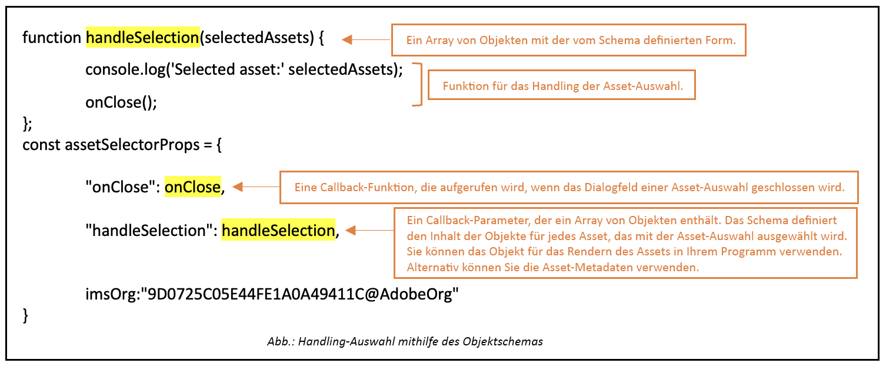

# Anpassungen des Asset-Wählers {#asset-selector-customization}

<table>
    <tr>
        <td>
            <sup style= "background-color:#008000; color:#FFFFFF; font-weight:bold"><i>Neu</i></sup> <a href="/help/assets/dynamic-media/dm-prime-ultimate.md"><b>Dynamic Media Prime und Ultimate</b></a>
        </td>
        <td>
            <sup style= "background-color:#008000; color:#FFFFFF; font-weight:bold"><i>Neu</i></sup> <a href="/help/assets/assets-ultimate-overview.md"><b>AEM Assets Ultimate</b></a>
        </td>
        <td>
            <sup style= "background-color:#008000; color:#FFFFFF; font-weight:bold"><i>Neu</i></sup> <a href="/help/assets/integrate-aem-assets-edge-delivery-services.md"><b>AEM Assets-Integration mit Edge Delivery Services</b></a>
        </td>
        <td>
            <sup style= "background-color:#008000; color:#FFFFFF; font-weight:bold"><i>Neu</i></sup> <a href="/help/assets/aem-assets-view-ui-extensibility.md"><b>Erweiterbarkeit der Benutzeroberfläche</b></a>
        </td>
          <td>
            <sup style= "background-color:#008000; color:#FFFFFF; font-weight:bold"><i>Neu</i></sup> <a href="/help/assets/dynamic-media/enable-dynamic-media-prime-and-ultimate.md"><b>Aktivieren von Dynamic Media Prime und Ultimate</b></a>
        </td>
    </tr>
    <tr>
        <td>
            <a href="/help/assets/search-best-practices.md"><b>Best Practices für die Suche</b></a>
        </td>
        <td>
            <a href="/help/assets/metadata-best-practices.md"><b>Best Practices für Metadaten</b></a>
        </td>
        <td>
            <a href="/help/assets/product-overview.md"><b>Content Hub</b></a>
        </td>
        <td>
            <a href="/help/assets/dynamic-media-open-apis-overview.md"><b>Dynamic Media mit OpenAPI-Funktionen</b></a>
        </td>
        <td>
            <a href="https://developer.adobe.com/experience-cloud/experience-manager-apis/"><b>Entwicklerdokumentation zu AEM Assets</b></a>
        </td>
    </tr>
</table>

Mit dem Asset-Wähler können Sie verschiedene Komponenten entsprechend Präferenzen, Ansprüchen oder funktionalen Anforderungen anpassen. Sie können die folgenden Komponenten anpassen: [Micro-Frontend-Asset-Wähler](#overview-asset-selector.md):

* [Anpassen des Bedienfelds „Filter“](#customize-filter-panel)
* [Anpassen von Informationen in der modalen Ansicht](#customize-info-in-modal-view)
* [Aktivieren oder Deaktivieren des Drag-and-Drop-Modus](#enable-disable-drag-and-drop)
* [Auswahl von Assets](#selection-of-assets)
* [Anpassen abgelaufener Assets](#customize-expired-assets)
* [Kontextaufruffilter](#contextual-invocation-filter)
* [dragOptions-Eigenschaft](#drag-options-property)

Sie müssen die Voraussetzungen in der Datei **index.html** oder in einer ähnlichen Datei innerhalb Ihrer Anwendungsimplementierung definieren, um die Authentifizierungsdetails für den Zugriff auf das [!DNL Experience Manager Assets]-Repository festzulegen. Danach können Sie Code-Fragmente gemäß Ihren Anforderungen hinzufügen.

## Anpassen des Bedienfelds „Filter“ {#customize-filter-panel}

Sie können das folgende Code-Fragment im Objekt `assetSelectorProps` hinzufügen, um das Filter-Bedienfeld anzupassen:

```
filterSchema: [
    {
    header: 'File Type',
    groupKey: 'TopGroup',
    fields: [
    {
    element: 'checkbox',
    name: 'type',
    options: [
    {
    label: 'Images',
    value: '<comma separated mimetypes, without space, that denote all images, for e.g., image/>',
    },
    {
    label: 'Videos',
    value: '<comma separated mimetypes, without space, that denote all videos for e.g., video/,model/vnd.mts,application/mxf>'
    }
    ]
    }
    ]
    },
    {
    fields: [
    {
    element: 'checkbox',
    name: 'type',
    options: [
    { label: 'JPG', value: 'image/jpeg' },
    { label: 'PNG', value: 'image/png' },
    { label: 'TIFF', value: 'image/tiff' },
    { label: 'GIF', value: 'image/gif' },
    { label: 'MP4', value: 'video/mp4' }
    ],
    columns: 3,
    },
    ],
    header: 'Mime Types',
    groupKey: 'MimeTypeGroup',
    },
    {
    fields: [
    {
    element: 'checkbox',
    name: 'property=metadata.application.xcm:keywords.value',
    options: [
    { label: 'Fruits', value: 'fruits' },
    { label: 'Vegetables', value: 'vegetables'}
    ],
    columns: 3,
    },
    ],
    header: 'Food Category',
    groupKey: 'FoodCategoryGroup',
    }
],
```

## Anpassen von Informationen in der modalen Ansicht {#customize-info-in-modal-view}

Sie können die Detailansicht eines Assets anpassen, wenn Sie auf das Symbol  klicken. Führen Sie den folgenden Code aus:

```
// Create an object infoPopoverMap and set the property `infoPopoverMap` with it in assetSelectorProps
const infoPopoverMap = (map) => {
// for example, to skip `path` from the info popover view
let defaultPopoverData = PureJSSelectors.getDefaultInfoPopoverData(map);
return defaultPopoverData.filter((i) => i.label !== 'Path')
};
assetSelectorProps.infoPopoverMap = infoPopoverMap;
```

## Aktivieren oder Deaktivieren des Drag-and-Drop-Modus {#enable-disable-drag-and-drop}

Fügen Sie die folgenden Eigenschaften zu `assetSelectorProp` hinzu, um den Drag-and-Drop-Modus zu aktivieren. Um Drag-and-Drop zu deaktivieren, ersetzen Sie den Parameter `true` durch `false`.

```
rail: true,
acvConfig: {
dragOptions: {
allowList: {
'*': true,
},
},
selectionType: 'multiple'
}

// the drop handler to be implemented
function drop(e) {
e.preventDefault();
// following helps you get the selected assets – an array of objects.
const data = JSON.parse(e.dataTransfer.getData('collectionviewdata'));
}
```

## Auswahl von Assets {#selection-of-assets}

Der ausgewählte Asset-Typ ist ein Array von Objekten, das die Asset-Informationen bei Verwendung der Funktionen `handleSelection`, `handleAssetSelection` und `onDrop` enthält.

Führen Sie die folgenden Schritte aus, um die Auswahl einzelner oder mehrerer Assets zu konfigurieren:

```
acvConfig: {
selectionType: 'multiple' // 'single' for single selection
}
// the `handleSelection` callback, always gets you the array of selected assets
```

**Schemasyntax**

```
interface SelectedAsset {
    'repo:id': string;
    'repo:name': string;
    'repo:path': string;
    'repo:size': number;
    'repo:createdBy': string;
    'repo:createDate': string;
    'repo:modifiedBy': string; 
    'repo:modifyDate': string; 
    'dc:format': string; 
    'tiff:imageWidth': number;
    'tiff:imageLength': number;
    'repo:state': string;
    computedMetadata: Record<string, any>;
    _links: {
        'https://ns.adobe.com/adobecloud/rel/rendition': Array<{
            href: string;
            type: string;
            'repo:size': number;
            width: number;
            height: number;
            [others: string]: any;
        }>;
    };
}
```

Die folgende Tabelle beschreibt einige der wichtigen Eigenschaften des ausgewählten Asset-Objekts.

| Eigenschaft | Typ | Beschreibung |
|---|---|---|
| *repo:repositoryId* | Zeichenfolge | Eindeutige Kennung für das Repository, in dem das Asset gespeichert ist. |
| *repo:id* | Zeichenfolge | Eindeutige Kennung für das Asset. |
| *repo:assetClass* | Zeichenfolge | Die Klassifizierung des Assets (z. B. Bild oder Video, Dokument). |
| *repo:name* | Zeichenfolge | Der Name des Assets, einschließlich der Dateierweiterung. |
| *repo:size* | Number (Zahl) | Die Größe des Assets in Bytes. |
| *repo:path* | Zeichenfolge | Der Speicherort des Assets im Repository. |
| *repo:ancestors* | `Array<string>` | Ein Array von Vorgängerelementen für das Asset im Repository. |
| *repo:state* | Zeichenfolge | Aktueller Status des Assets im Repository (z. B. aktiv, gelöscht). |
| *repo:createdBy* | Zeichenfolge | Die Person oder das System, welches das Asset erstellt hat. |
| *repo:createDate* | Zeichenfolge | Datum und Uhrzeit der Erstellung des Assets. |
| *repo:modifiedBy* | Zeichenfolge | Die Person oder das System, welches das Asset zuletzt geändert hat. |
| *repo:modifyDate* | Zeichenfolge | Datum und Uhrzeit der letzten Änderung des Assets. |
| *dc:format* | Zeichenfolge | Das Format des Assets, z. B. der Dateityp (z. B. JPEG, PNG usw.). |
| *tiff:imageWidth* | Number (Zahl) | Die Breite eines Assets. |
| *tiff:imageLength* | Number (Zahl) | Die Höhe eines Assets. |
| *computedMetadata* | `Record<string, any>` | Ein Objekt, das einen Behälter für alle Metadaten des Assets aller Art (Repository, Applikation oder eingebettete Metadaten) darstellt. |
| *_links* | `Record<string, any>` | Hypermedia-Links für das verknüpfte Asset. Enthält Links für Ressourcen wie Metadaten und Ausgabedarstellungen. |
| *`_links.<https://ns.adobe.com/adobecloud/rel/rendition>`* | `Array<Object>` | Array von Objekten, das Informationen zu Ausgabedarstellungen des Assets enthält. |
| *`_links.<https://ns.adobe.com/adobecloud/rel/rendition[].href>`* | Zeichenfolge | Der URI zur Ausgabedarstellung. |
| *`_links.<https://ns.adobe.com/adobecloud/rel/rendition[].type>`* | Zeichenfolge | Der MIME-Typ der Ausgabedarstellung. |
| *`_links.<https://ns.adobe.com/adobecloud/rel/rendition[].repo:size>`* | Number (Zahl) | Die Größe der Ausgabedarstellung in Byte. |
| *`_links.<https://ns.adobe.com/adobecloud/rel/rendition[].width>`* | Number (Zahl) | Die Breite der Ausgabedarstellung. |
| *`_links.<https://ns.adobe.com/adobecloud/rel/rendition[].height>`* | Number (Zahl) | Die Höhe der Ausgabedarstellung. |

### Umgang mit der Auswahl von Assets mithilfe des Objektschemas {#handling-selection}

Die `handleSelection`-Eigenschaft wird verwendet, um einzelne oder mehrere Auswahlen von Assets in dem Asset-Selektor zu verarbeiten. Das folgende Beispiel zeigt die Syntax der Verwendung von `handleSelection`.



### Deaktivieren der Auswahl von Assets {#disable-selection}

Die Funktion „disableSelection“ wird verwendet, um die Möglichkeit zur Auswahl der Assets oder Ordner auszublenden bzw. zu deaktivieren. Dabei wird das Kontrollkästchen „Auswählen“ auf der Karte oder im Asset ausgeblendet und eine Auswahl verhindert. Um diese Funktion zu verwenden, können Sie die Position eines in einem Array zu deaktivierenden Assets oder Ordners deklarieren. Wenn Sie z. B. die Auswahl eines Ordners deaktivieren möchten, der an der ersten Position angezeigt wird, können Sie den folgenden Code hinzufügen:
`disableSelection: [0]:folder`

Sie können dem Array eine Liste von MIME-Typen (z. B. Bild, Ordner, Datei oder andere MIME-Typen wie Bild/jpeg) bereitstellen, die deaktiviert werden sollen. Die von Ihnen deklarierten MIME-Typen werden den Attributen `data-card-type` und `data-card-mimetype` eines Assets zugeordnet.

Darüber hinaus sind Assets mit deaktivierter Auswahl ziehbar. Um das Drag-and-Drop eines bestimmten Asset-Typs zu deaktivieren, können Sie die Eigenschaft `dragOptions.allowList` verwenden.

Die Syntax zum Deaktivieren einer Auswahl ist wie folgt:

```
(args)=> {
    return(
        <ASDialogWrapper
            {...args}
            disableSelection={args.disableSelection}
            handleAssetSelection={action('handleAssetSelection')}
            handleSelection={action('handleSelection')}
            selectionType={args.selectionType}
        />
    );
}
```

>[!NOTE]
>
> Bei einem Asset ist das Kontrollkästchen „Auswählen“ ausgeblendet, während bei einem Ordner der Ordner nicht ausgewählt werden kann, aber eine Navigation im genannten Ordner weiterhin möglich ist.

<!--For a complete list of properties and detailed example, visit [Asset Selector Code Example](https://github.com/adobe/aem-assets-selectors-mfe-examples).-->

## Anpassen abgelaufener Assets {#customize-expired-assets}

Mit dem Asset-Wähler können Sie die Verwendung eines abgelaufenen Assets steuern. Sie können das abgelaufene Asset mit dem Zeichen **Läuft bald ab** anpassen, sodass Sie im Voraus wissen, welche Assets innerhalb von 30 Tagen ab dem aktuellen Datum ablaufen werden. Darüber hinaus kann dies entsprechend den Anforderungen angepasst werden. Sie können auch die Auswahl eines abgelaufenen Assets auf der Arbeitsfläche zulassen oder umgekehrt. Die Anpassung eines abgelaufenen Assets kann mithilfe einiger Code-Snippets auf verschiedene Weise durchgeführt werden:

<!--{
    getExpiryStatus: function, // to control Expired/Expiring soon badges of the asset
    allowSelectionAndDrag: boolean, // set true to allow the selection of expired assets on canvas, set false, otherwise.
}-->

```
expiryOptions: {
    getExpiryStatus: getExpiryStatus;
}
```

### Auswahl eines abgelaufenen Assets {#selection-of-expired-asset}

Sie können die Verwendung eines abgelaufenen Assets anpassen, damit es auswählbar oder nicht auswählbar wird. Sie können anpassen, ob Sie Drag-and-Drop für ein abgelaufenes Asset auf die Arbeitsfläche des Asset-Wählers zulassen möchten oder nicht. Verwenden Sie die folgenden Parameter, damit ein Asset auf der Arbeitsfläche nicht auswählbar wird:

```
expiryOptions:{
    allowSelectionAndDrop: false;
}
```
<!--
Additionally, To do this, navigate to **[!UICONTROL Disable default expiry behavior]** under the [!UICONTROL Controls] tab and set the boolean value to `true` or `false` as per the requirement. If `true` is selected, you can see the select box over the expired asset, otherwise it remains unselected. You can hover to the info icon of an asset to know the details of an expired asset. 

-->

### Festlegen der Dauer eines abgelaufenen Assets {#set-duration-of-expired-asset}

Mit dem folgenden Code-Snippet können Sie das Zeichen **Läuft bald ab** für die Assets festlegen, die in den nächsten fünf Tagen ablaufen: <!--The `expirationDate` property is used to set the expiration duration of an asset. Refer to the code snippet below:-->

```
/**
  const getExpiryStatus = async (asset) => {
  if (!asset.expirationDate) {
    return null;
  }
  const currentDate = new Date();
  const millisecondsInDay = 1000 * 60 * 60 * 24;
  const fiveDaysFromNow = new Date(value: currentDate.getTime() + 5 * millisecondsInDay);
  const expirationDate = new Date(asset.expirationDate);
  if (expirationDate.getTime() < currentDate.getTime()) {
    return 'EXPIRED';
  } else if (expirationDate.getTime() < fiveDaysFromNow.getTime()) {
    return 'EXPIRING_SOON';
  } else {
    return 'NOT_EXPIRED';
  }
};
```

<!--In the above code snippet, the `getExpiryStatus` function is used to show the **Expiring soon** badge that have expiration date stored in `customExpirationDate`. Additionally, it sets the expiration date of an asset to five days from the current date. The `millisecondsInDay` helps you set expiry of an asset by specifying the time range in milliseconds. You can replace milliseconds with hours directly or customize function as per the requirement. Whereas, the `getTime()` function returns the number of milliseconds for the mentioned date. See [properties](#asset-selector-properties) to know about `expirationDate` property.-->

Im folgenden Beispiel erfahren Sie, wie die Eigenschaft zum Abrufen des aktuellen Datums und der aktuellen Uhrzeit funktioniert:

```
const currentData = new Date();
currentData.getTime(),
```

Es wird `1718779013959` zurückgegeben, was dem Datumsformat 2024-06-19T06:36:53.959Z entspricht.

### Anpassen der Popup-Meldung eines abgelaufenen Assets {#customize-toast-message}

Die Eigenschaft `showToast` wird verwendet, um die Popup-Meldung anzupassen, die für ein abgelaufenes Asset angezeigt werden soll.

Syntax:

```
{
    type: 'ERROR', 'NEUTRAL', 'INFO', 'SUCCESS',
    message: '<message to be shown>',
    timeout: optional,
}
```

Der Standardwert des Timeouts ist 500 Millisekunden. Sie können ihn jedoch entsprechend den Anforderungen ändern. Durch Übergabe des Werts `timeout: 0` bleibt die Popup-Meldung geöffnet, bis Sie auf die X-Schaltfläche klicken.

Im Folgenden finden Sie ein Beispiel für die Anzeige einer Popup-Meldung, wenn die Auswahl eines Ordners nicht erlaubt und eine entsprechende Meldung angezeigt werden soll:

```
const showToast = {
    type: 'ERROR',
    message: 'Folder cannot be selected',
    timeout: 5000,
}
```

Verwenden Sie das folgende Code-Snippet, um eine Popup-Meldung zur Nutzung eines abgelaufenen Assets anzuzeigen:

```
(args) => {
    const [selectedAssets, setSelectedAssets] = useState([]);
    const [showToast, setShowToast] = React.useState(false);
    const handleAssetSelection = (assets) => {
        let directorySelectedFlag = false;
        const temp = assets.filter((asset) => {
            if (asset['repo:assetClass'] === 'directory') {
                directorySelectedFlag = true;
                setShowToast(true);
            }
            return !(asset['repo:assetClass'] === 'directory');
        });
        if (!directorySelectedFlag) {
            setShowToast(false);
        }
        setSelectedAssets(temp);
    };
    return (
        <ASDialogWrapper
            {...args}
            showToast={showToast ? args.showToast : null}
            selectedAssets={selectedAssets}
            handleAssetSelection={handleAssetSelection}
        />
    );
}
```

## Kontextaufruffilter{#contextual-invocation-filter}

Mit dem Asset-Wähler können Sie einen Filter zur Auswahl von Tags hinzufügen. Dies unterstützt eine Tag-Gruppe, die alle relevanten Tags mit einer bestimmten Tagging-Gruppe kombiniert. Darüber hinaus können Sie zusätzliche Tags auswählen, die dem gesuchten Asset entsprechen. Außerdem können Sie unter dem Kontextaufruffilter auch die standardmäßigen Tag-Gruppen festlegen, die Sie hauptsächlich nutzen, damit Sie unterwegs darauf zugreifen können.

>
>
> * Sie müssen ein Code-Fragment für kontextbezogene Aufrufe hinzufügen, um den Tagging-Filter bei der Suche zu aktivieren.
> * Es muss zwingend die Eigenschaft „name“ verwendet werden, die dem Tag-Gruppentyp `(property=xcm:keywords.id=)` entspricht.

Syntax:

```
const filterSchema=useMemo(() => {
    return: [
        {
            element: 'taggroup',
            name: 'property=xcm:keywords.id='
        },
    ];
}, []);
```

Um im Filterbereich Tag-Gruppen hinzuzufügen, muss standardmäßig mindestens eine Tag-Gruppe hinzugefügt werden. Verwenden Sie außerdem das folgende Code-Fragment, um die standardmäßigen Tags hinzuzufügen, die aus der Tag-Gruppe vorausgewählt sind.

```
export const WithAssetTags = (props) = {
const [selectedTags, setSelectedTags] = useState (
new Set(['orientation', 'color', 'facebook', 'experience-fragments:', 'dam', 'monochrome'])
const handleSelectTags = (selected) => {
setSelectedTags (new Set (selected)) ;
};
const filterSchema = useMemo ((); => {
    return {
        schema: [
            ｛
                fields: [
                    {
                    element: 'checkbox', 
                    name: 'property=xcm:keywords=', 
                    defaultValue: Array. from(selectedTags), 
                    options: assetTags, 
                    orientation: 'vertical',
                    },
                ],
    header: 'Asset Tags', 
    groupkey: 'AssetTagsGroup',
        ],
    },
｝；
}, [selectedTags]);
```


## Hochladen in den Asset-Wähler {#upload-in-asset-selector}

Sie können Dateien oder Ordner aus Ihrem lokalen Dateisystem in den Asset-Wähler hochladen. Um Dateien mit dem lokalen Dateisystem hochzuladen, müssen Sie im Allgemeinen eine Upload-Funktion verwenden, die von einer Mikro-Frontend-Anwendung des Asset-Wählers bereitgestellt wird. Zu den verschiedenen Code-Snippets, die zum Aufrufen des Uploads im Asset-Wähler erforderlich sind, gehören:

* [Code-Snippet für einfache Upload-Formulare](#basic-upload)
* [Hochladen mit Metadaten](#upload-with-metadata)
* [Benutzerdefinierter Upload](#customized-upload)
* [Hochladen mit Drittanbieterquellen](#upload-using-third-party-source)

### Einfaches Upload-Formular {#basic-upload}

```
import { AllInOneUpload } from '@assets/upload';
import { TextField, ContextualHelp } from '@adobe/react-spectrum';

const repoId = 'author-p52554-e145207-cmstg.adobeaemcloud.com'
const apiToken = 'eyJhbG....';
const targetUploadPath = '/content/dam/hydrated-assets/cq/as/cq-assets-upload-storybook-testing';

export const UploadExample = () => {
    return (
        <>
            <TextField
                marginStart="size-200"
                width="size-6000"
                isDisabled={true}
                label="Target Upload Path"
                value={targetUploadPath}
                contextualHelp={
                    <ContextualHelp>
                        <Content>Use Storybook Controls panel to change the default upload location</Content>
                    </ContextualHelp>
                }
            />
            <AllInOneUpload
                repositoryId={repoId}
                apiToken={apiToken}
                targetUploadPath={targetUploadPath}
            />
        <>
    )
}
```

### Hochladen mit Metadaten {#upload-with-metadata}

```
import { AllInOneUpload } from '@assets/upload';

const repoId = 'author-p52554-e145207-cmstg.adobeaemcloud.com'
const apiToken = 'eyJhbG....';
const targetUploadPath = '/content/dam/hydrated-assets/cq/as/cq-assets-upload-storybook-testing';

/**
 * see https://git.corp.adobe.com/CQ/assets-upload/blob/main/packages/@assets/upload/stories/data/SampleMetadataSchemas.ts
 * for full schema shape used in rendered example below
 */
const metadataSchema = [
    {
        mapToProperty: 'gmo:lineofBusiness',
        label: 'Line of Business',
        placeholder: 'Select one',
        required: true,
        element: 'dropdown',
        dropdownOptions: [
            {
                id: 'corporate',
                name: 'Corporate',
            },
            {
                id: 'digital-media-dme',
                name: 'Digital Media (DMe)',
            },
            {
                id: 'digital-experience-dx',
                name: 'Digital Experience (DX)',
            },
            {
                id: 'business-solutions',
                name: 'Business Solutions',
            },
        ],
    },
    // ... see link above for full schema
    {
        mapToProperty: 'dam:assetStatus',
        value: 'approved',
        // hidden metadata element, this metadata will be applied to the asset without rendering UI for user input
        element: 'hidden',
    },
];

const handleMetadataFormChange = (event: MetadataChangeEvent) => {
    const { property, value } = event;

    console.log({ property, value });
}

const UploadExampleWithMetadataForm = () => {
    return (
        <AllInOneUpload
            repositoryId={repoId}
            apiToken={apiToken}
            targetUploadPath={targetUploadPath}
            metadataSchema={sampleMetadataSchema}
            onMetadataFormChange={handleMetadataFormChange}
        />
    )
}
```

### Benutzerdefinierter Upload {#customized-upload}

```
const MultipleAllInOneUploadExample = () => {
    const mfeRef = React.useRef<{ iframeRef: { current: HTMLIFrameElement } }>(null);

    return (
        <>
            <Button
                onPress={() => UploadCoordinator.initiateUpload(mfeRef.current?.iframeRef?.current)}
            >
                External Initiate Upload
            </Button>
            <AllInOneUpload
                {...otherProps}
                ref={mfeRef}
            />
        <>
    );
}
```

### Hochladen mit Drittanbieterquellen {#upload-using-third-party-source}

```
import { useState, useRef } from 'react';
import { AllInOneUpload, UploadCoordinator } from '@assets/upload';
import { Button, Flex, Divider } from '@adobe/react-spectrum';
import { sampleMetadataSchema } from './SampleMetadataSchemas';

const repoId = 'author-p52554-e145207-cmstg.adobeaemcloud.com'
const apiToken = 'eyJhbG....';
const targetUploadPath = '/content/dam/hydrated-assets/cq/as/cq-assets-upload-storybook-testing';

const defaultFiles = [
    new File(['file-content'], 'Controlled File 1'),
    new File(['file-content-with-more'], 'Controlled File 2')
];

const ControlledUploadExample = () => {
    const [controlledFiles, setControlledFiles] = useState<File[]>(defaultFiles)
    const inputRef = React.useRef<HTMLInputElement>(null);

    const handleFileInputChange = useCallback((e: ChangeEvent<HTMLInputElement>) => {
        if (e.target.files) {
            setMyFiles([...e.target.files]);
        }
    }, []);

    return (
        <Flex height="100%" alignItems="center" direction="column">
            <Flex direction="row" alignItems="center" justifyContent="center">
                <Button
                    variant="accent"
                    onPress={() => UploadCoordinator.initiateUpload()}
                    isDisabled={files.length < 1}
                >
                    External Initiate Upload
                </Button>
                <Button
                    variant="secondary"
                    onPress={() => {
                        inputRef.current?.click();
                    }}
                >
                    External Browse files
                </Button>
            </Flex>
            <Divider size="M" marginTop="size-200" />
            <AllInOneUpload
                repositoryId={repoId}
                apiToken={apiToken}
                targetUploadPath={targetUploadPath}
                files={controlledFiles}
                onFilesChange={setControlledFiles}
                hideUploadButton={true}
                metadataSchema={sampleMetadataSchema}
            />
            <input
                ref={inputRef}
                type="file"
                style={{ display: 'none' }}
                onChange={handleFileInputChange}
                multiple={true}
            />
        </Flex>
    )
}
```

### dragOptions-Eigenschaft {#drag-options-property}

```
dragOptions: {
            allowList: {
                '*': true,          // allow all types to be dragged
                'folder': false,    // except those explicitly set to disallow
                'image/jpeg': false // or those with specific mimeTypes
            },
         }
```

>[!MORELIKETHIS]
>
>* [Eigenschaften des Asset-Wählers](/help/assets/asset-selector-properties.md)
>* [Integrieren des Asset-Wählers in verschiedene Anwendungen](/help/assets/integrate-asset-selector.md)
>* [Eigenschaften des Asset-Wählers](/help/assets/asset-selector-properties.md)
>* [Integrieren des Asset-Wählers in Dynamic Media mit OpenAPI-Funktionen](/help/assets/integrate-asset-selector-dynamic-media-open-api.md)
