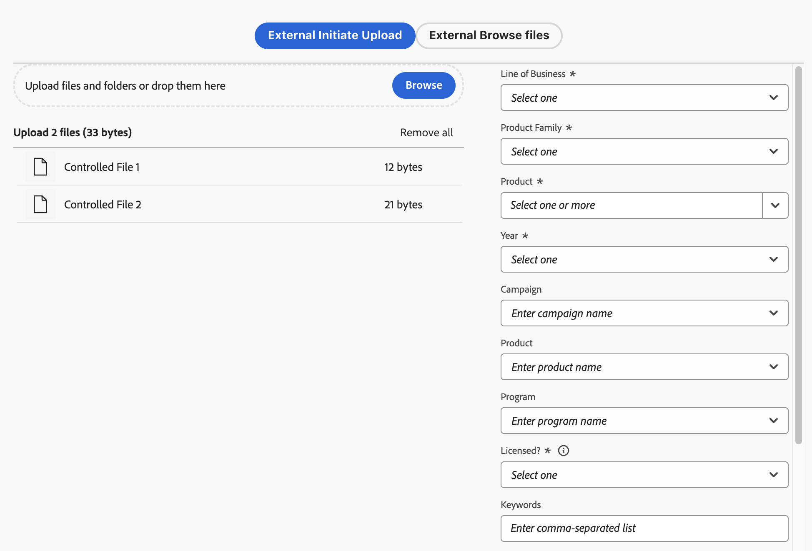

# Hochladen von Dateien und Ordnern in den Asset-Wähler {#upload-files-folders}

Sie können Dateien oder Ordner aus Ihrem lokalen Dateisystem in den Asset-Wähler hochladen. Um Dateien mit dem lokalen Dateisystem hochzuladen, müssen Sie im Allgemeinen eine Upload-Funktion verwenden, die von einer Mikro-Frontend-Anwendung des Asset-Wählers bereitgestellt wird.

## Hochladen von Assets aus dem lokalen Dateisystem {#basic-upload}

Um Assets zum Asset-Wähler hinzuzufügen, führen Sie die folgenden Schritte aus:

1. Wenn Sie die Leistenansicht verwenden, klicken Sie auf die Auslassungspunkte und anschließend auf  **[!UICONTROL Hochladen]**. Klicken Sie anderenfalls in einer modalen Ansicht oben rechts auf  **[!UICONTROL Hochladen]**. Der Bildschirm [!UICONTROL Assets hochladen] wird angezeigt.

   

   Darüber hinaus können Sie im Abschnitt **[!UICONTROL Dateien oder Ordner hierher ziehen]** die Assets entweder aus dem lokalen Dateisystem ziehen oder auf **[!UICONTROL Durchsuchen]** klicken, um die im lokalen Dateisystem verfügbaren Dateien oder Ordner manuell auszuwählen. Diese Liste der Dateien, die Teil Ihres Uploads sind, ist als Liste verfügbar.

   

   Sie können auch mithilfe der Miniaturansichten eine Vorschau ausgewählter Bilder anzeigen und auf das X-Symbol klicken, um ein bestimmtes Bild aus der Liste zu entfernen. Das X-Symbol wird nur angezeigt, wenn Sie den Mauszeiger über den Bildnamen oder die Bildgröße bewegen. Sie können auch auf **[!UICONTROL Alle entfernen]** klicken, um alle Elemente aus Ihrer Upload-Liste zu löschen.

1. Um das Hochladen abzuschließen, klicken Sie auf **[!UICONTROL Hochladen]**. Ihre hochgeladenen Assets werden angezeigt. Den konfigurierbaren Code finden Sie unter [Einfacher Upload](/help/assets/asset-selector-customization.md#basic-upload).

## Hochladen von Assets mit Metadaten {#upload-assets-with-metadata}

Sie können den Assets Metadaten hinzufügen, während Sie sie sofort in Ihre Anwendung hochladen. Metadaten umfassen verschiedene Felder wie Geschäftsbetreffzeile, Produktdetails und Kampagne. Hierfür wird die Eigenschaft `metadataSchema` verwendet. Navigieren Sie zu [Eigenschaften des Asset-Wählers](/help/assets/asset-selector-properties.md), um mehr über die Eigenschaft `metadataSchema` zu erfahren.

Das für die Konfiguration erforderliche Code-Snippet finden Sie unter [Hochladen mit Metadaten](/help/assets/asset-selector-customization.md#upload-with-metadata).

1. Definieren Sie den Namen für den Upload mithilfe des Felds **[!UICONTROL Kampagnenname]**. Sie können einen vorhandenen Namen verwenden oder einen neuen erstellen. Der Asset-Wähler bietet Ihnen beim Eingeben des Namens weitere Optionen.

   Adobe empfiehlt als Best Practice, in den restlichen Feldern ebenfalls Werte anzugeben, da hierdurch ein verbessertes Sucherlebnis für Ihre hochgeladenen Assets geschaffen wird.

1. Definieren Sie auf ähnliche Weise Werte für die Felder **[!UICONTROL Keywords]**, **[!UICONTROL Kanäle]**, **[!UICONTROL Zeitraum]** und **[!UICONTROL Region]**. Durch das Tagging und Gruppieren von Assets nach Keywords, Kanälen und Speicherorten kann jede Person, die Ihre genehmigten Unternehmensinhalte verwendet, nach diesen Assets suchen und sie organisieren.

1. Klicken Sie auf **[!UICONTROL Hochladen]**, um Assets in den Asset-Wähler hochzuladen. Das Bestätigungsfeld [!UICONTROL Details überprüfen] wird angezeigt. Klicken Sie auf [!UICONTROL Weiter].

1. Der Asset-Upload wird gestartet. Klicken Sie auf [!UICONTROL Neuer Upload], um den Upload neu zu starten. Klicken Sie auf [!UICONTROL Fertig], um den Upload abzuschließen.

## Benutzerdefinierter Upload {#customize-upload}

Mit dem Asset-Wähler können Sie ein benutzerdefiniertes Upload-Formular hinzufügen. Es stehen verschiedene Anpassungen zur Verfügung. Beispielsweise können Sie mit der Eigenschaft [hideUploadButton](/help/assets/asset-selector-properties.md) die Schaltfläche „Hochladen“ ausblenden, die standardmäßig in der Anwendung angezeigt wird. Stattdessen können Sie sie so anpassen, dass sie gemäß der Anforderung außerhalb der MFE-Anwendung gerendert wird. Die Konfiguration finden Sie unter [Benutzerdefinierter Upload](/help/assets/asset-selector-customization.md#customized-upload).

>[!MORELIKETHIS]
>
>* [Beispiele für den Asset-Wähler](/help/assets/asset-selector-examples.md)
>* [Integrieren des Asset-Wählers in verschiedene Anwendungen](/help/assets/integrate-asset-selector.md)
>* [Eigenschaften des Asset-Wählers](/help/assets/asset-selector-properties.md)
