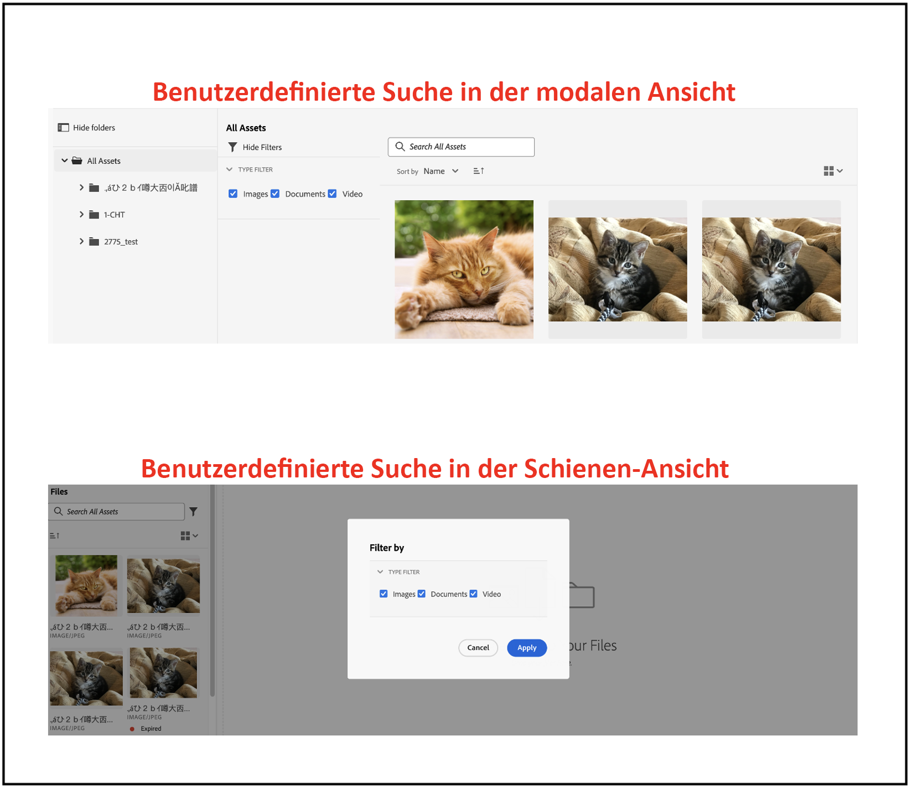

# Micro-Frontend-Asset-Auswahl {#Overview}

Die Micro-Frontend-Asset-Auswahl bietet eine Benutzeroberfläche, die einfach in die [!DNL Experience Manager Assets as a Cloud Service] Repository, damit Sie digitale Assets durchsuchen oder durchsuchen können, die im Repository verfügbar sind, und sie in Ihrer Anwendungsbearbeitung verwenden können.

Die Micro-Frontend-Benutzeroberfläche wird in Ihrem Anwendungserlebnis mithilfe des Asset Selector-Pakets zur Verfügung gestellt. Alle Aktualisierungen des Pakets werden automatisch importiert und die zuletzt bereitgestellte Asset-Auswahl wird automatisch in Ihre Anwendung geladen.


Die Asset-Auswahl bietet viele Vorteile, z. B.:

* Einfache Integration in Adobe- oder Nicht-Adobe-Apps mit der Vanilla JavaScript-Bibliothek.
* Einfach zu verwalten, da Aktualisierungen des Assets-Selektor-Pakets automatisch in der Asset-Auswahl bereitgestellt werden, die für Ihre Anwendung verfügbar ist. Es sind keine Aktualisierungen innerhalb Ihrer Anwendung erforderlich, um die neuesten Änderungen zu laden.
* Einfachere Anpassung, da Eigenschaften verfügbar sind, die die Anzeige der Asset-Auswahl in Ihrer Anwendung steuern.

* Volltextsuche, vordefinierte und benutzerdefinierte Filter, um schnell zu Assets zu navigieren, die für das Authoring-Erlebnis verwendet werden können.

* Möglichkeit, Repositorys innerhalb einer IMS-Organisation zur Asset-Auswahl zu wechseln.

* Möglichkeit, Assets nach Namen, Dimensionen und Größe zu sortieren und in der Listen-, Raster-, Galerie- oder Wasserfallansicht anzuzeigen.

In diesem Artikel wird gezeigt, wie der Asset-Selektor mit einer [!DNL Adobe] unter Unified Shell oder wenn Sie bereits ein imsToken zur Authentifizierung generiert haben. Diese Workflows werden in diesem Artikel als Nicht-SUSI-Fluss bezeichnet.

Führen Sie die folgenden Aufgaben aus, um die Asset-Auswahl in Ihre [!DNL Experience Manager Assets as a Cloud Service] repository:

* [Integrieren der Asset-Auswahl mit Vanilla JS](#integration-with-vanilla-js)
* [Anzeigeeigenschaften der Asset-Auswahl definieren](#asset-selector-properties)
* [Verwenden der Asset-Auswahl](#using-asset-selector)

## Integrieren der Asset-Auswahl mit Vanilla JS {#integration-with-vanilla-js}

Sie können jede [!DNL Adobe] oder Nicht-Adobe-Anwendung mit [!DNL Experience Manager Assets] as a [!DNL Cloud Service] Repository erstellen und Assets aus der Anwendung auswählen.

Die Integration erfolgt durch Importieren des Asset-Selektor-Pakets und Verbinden mit den as a Cloud Service Assets mithilfe der Vanilla JavaScript-Bibliothek. Sie müssen eine `index.html` oder einer entsprechenden Datei in Ihrer Anwendung auf -
* Authentifizierungsdetails definieren
* Zugriff auf das as a Cloud Service Asset-Repository
* Anzeigeeigenschaften der Asset-Auswahl konfigurieren

<!--
Asset Selector supports authentication to the [!DNL Experience Manager Assets] as a [!DNL Cloud Service] repository using Identity Management System (IMS) properties such as `imsScope` or `imsClientID`. Authentication using these IMS properties is referred to as SUSI (Sign Up Sign In) flow in this article.

You can perform authentication without defining some of the IMS properties, such as `imsScope` or `imsClientID`, if:

*   You are integrating an [!DNL Adobe] application on [Unified Shell](https://experienceleague.adobe.com/docs/experience-manager-cloud-service/content/overview/aem-cloud-service-on-unified-shell.html?lang=en).
*   You already have an IMS token generated for authentication.

Accessing [!DNL Experience Manager Assets] as a [!DNL Cloud Service] repository without defining `imsScope` or `imsClientID` IMS properties is referred to as a non-SUSI flow in this article.
-->

Sie können eine Authentifizierung durchführen, ohne einige der IMS-Eigenschaften zu definieren, wenn:

* Sie integrieren eine [!DNL Adobe] Anwendung auf [Unified Shell](https://experienceleague.adobe.com/docs/experience-manager-cloud-service/content/overview/aem-cloud-service-on-unified-shell.html?lang=en).
* Für die Authentifizierung wurde bereits ein IMS-Token generiert.

## Voraussetzungen {#prerequisites}

<!--
If your application requires user based authentication, out-of-the-box Asset Selector also supports a flow for authentication to the [!DNL Experience Manager Assets] as a [!DNL Cloud Service] repository using Identity Management System (IMS.)

You can use properties such as `imsScope` or `imsClientID` to retrieve `imsToken` automatically. You can use SUSI (Sign Up Sign In) flow and IMS properties. Also, you can obtain your own imsToken and pass it to Asset Selector by integrating within [!DNL Adobe] application on Unified Shell or if you already have an imsToken obtained via other methods (for example, using technical account). Accessing [!DNL Experience Manager Assets] as a [!DNL Cloud Service] repository without defining IMS properties (For example, `imsScope` and `imsClientID`) is referred to as a non-SUSI flow.
-->

Definieren Sie die Voraussetzungen in der `index.html` Datei oder einer ähnlichen Datei in Ihrer Anwendungsimplementierung, um die Authentifizierungsdetails für den Zugriff auf die [!DNL Experience Manager Assets] as a [!DNL Cloud Service] Repository. Zu den Voraussetzungen gehören:
* imsOrg
* imsToken
* apikey

<!--
The prerequisites vary if you are authenticating using a SUSI flow or a non-SUSI flow.

**Non-SUSI flow**

*   imsOrg
*   imsToken
*   apikey

For more information on these properties, refer to [Asset Selector Properties](#asset-selector-properties).

**SUSI flow**

*   imsClientId
*   imsScope
*   redirectUrl
*   imsOrg
*   apikey

For more information on these properties, refer to [Example for the SUSI flow](#susi-vanilla) and [Asset Selector Properties](#asset-selector-properties).
-->

## Installation {#installation}

Asset-Selektoren sind über beide ESM-CDN verfügbar (z. B. [esm.sh](https://esm.sh/)/[Skypack](https://www.skypack.dev/)) und [UMD](https://github.com/umdjs/umd) -Version.

In Browsern mit **UMD-Version** (empfohlen):

```
<script src="https://experience.adobe.com/solutions/CQ-assets-selectors/assets/resources/assets-selectors.js"></script>

<script>
  const { renderAssetSelector } = PureJSSelectors;
</script>
```

In Browsern mit `import maps` Support verwenden **ESM CDN-Version**:

```
<script type="module">
  import { AssetSelector } from 'https://experience.adobe.com/solutions/CQ-assets-selectors/assets/resources/@assets/selectors/index.js'
</script>
```

In der Deno/Webpack Module Federation mit **ESM CDN-Version**:

```
import { AssetSelector } from 'https://experience.adobe.com/solutions/CQ-assets-selectors/assets/resources/@assets/selectors/index.js'
```

### Ausgewählter Asset-Typ {#selected-asset-type}

Der ausgewählte Asset-Typ ist ein Array von Objekten, die bei Verwendung der `handleSelection`, `handleAssetSelection`und `onDrop` Funktionen.

**Schemasyntax**

```
interface SelectedAsset {
    'repo:id': string;
    'repo:name': string;
    'repo:path': string;
    'repo:size': number;
    'repo:createdBy': string;
    'repo:createDate': string;
    'repo:modifiedBy': string; 
    'repo:modifyDate': string; 
    'dc:format': string; 
    'tiff:imageWidth': number;
    'tiff:imageLength': number;
    'repo:state': string;
    computedMetadata: Record<string, any>;
    _links: {
        'http://ns.adobe.com/adobecloud/rel/rendition': Array<{
            href: string;
            type: string;
            'repo:size': number;
            width: number;
            height: number;
            [others: string]: any;
        }>;
    };
}
```

In der folgenden Tabelle werden einige der wichtigen Eigenschaften des Objekts &quot;Ausgewähltes Asset&quot;beschrieben.

| Eigenschaft | Typ | Erklärung |
|---|---|---|
| *repo:repositoryId* | Zeichenfolge | Eindeutige Kennung für das Repository, in dem das Asset gespeichert ist. |
| *repo:id* | Zeichenfolge | Eindeutige Kennung für das Asset. |
| *repo:assetClass* | Zeichenfolge | Die Classification des Assets (z. B. Bild oder Video, Dokument). |
| *repo:name* | Zeichenfolge | Der Name des Assets, einschließlich der Dateierweiterung. |
| *repo:size* | Number (Zahl) | Die Größe des Assets in Bytes. |
| *repo:path* | Zeichenfolge | Der Speicherort des Assets im Repository. |
| *repo:ancestors* | `Array<string>` | Ein Array von Vorgängerelementen für das Asset im Repository. |
| *repo:state* | Zeichenfolge | Aktueller Status des Assets im Repository (z. B. aktiv, gelöscht usw.). |
| *repo:createdBy* | Zeichenfolge | Der Benutzer oder das System, der bzw. das das Asset erstellt hat. |
| *repo:createDate* | Zeichenfolge | Datum und Uhrzeit der Erstellung des Assets. |
| *repo:modifiedBy* | Zeichenfolge | Der Benutzer oder das System, der bzw. das das Asset zuletzt geändert hat. |
| *repo:modifyDate* | Zeichenfolge | Datum und Uhrzeit der letzten Änderung des Assets. |
| *dc:format* | Zeichenfolge | Das Format des Assets, z. B. der Dateityp (z. B. JPEG, PNG usw.). |
| *tiff:imageWidth* | Number (Zahl) | Die Breite eines Assets. |
| *tiff:imageLength* | Number (Zahl) | Die Höhe eines Assets. |
| *computedMetadata* | `Record<string, any>` | Ein Objekt, das einen Behälter für alle Metadaten des Assets aller Art (Repository, Anwendung oder eingebettete Metadaten) darstellt. |
| *_links* | `Record<string, any>` | Hypermedia-Links für das verknüpfte Asset. Enthält Links für Ressourcen wie Metadaten und Ausgabedarstellungen. |
| *_links.http://ns.adobe.com/adobecloud/rel/rendition* | `Array<Object>` | Array von Objekten, die Informationen zu Ausgabeformaten des Assets enthalten. |
| *_links.http://ns.adobe.com/adobecloud/rel/rendition[].href* | Zeichenfolge | Der URI zur Ausgabedarstellung. |
| *_links.http://ns.adobe.com/adobecloud/rel/rendition[].type* | Zeichenfolge | Der MIME-Typ der Ausgabedarstellung. |
| *_links.http://ns.adobe.com/adobecloud/rel/rendition[].&#39;repo:size&#39;* | Number (Zahl) | Die Größe der Ausgabedarstellung in Byte. |
| *_links.http://ns.adobe.com/adobecloud/rel/rendition[].width* | Number (Zahl) | Die Breite der Ausgabedarstellung. |
| *_links.http://ns.adobe.com/adobecloud/rel/rendition[].height* | Number (Zahl) | Die Höhe der Ausgabedarstellung. |

Eine vollständige Liste der Eigenschaften und ein detailliertes Beispiel finden Sie unter [Beispiel für Asset-Selektor-Code](https://github.com/adobe/aem-assets-selectors-mfe-examples).

<!--
### ImsAuthProps {#ims-auth-props}

The `ImsAuthProps` properties define the authentication information and flow that the Asset Selector uses to obtain an `imsToken`. By setting these properties, you can control how the authentication flow should behave and register listeners for various authentication events.

| Property Name | Description|
|---|---|
| `imsClientId`| A string value representing the IMS client ID used for authentication purposes. This value is provided by Adobe and is specific to your Adobe AEM CS organization.|
| `imsScope`| Describes the scopes used in authentication. The scopes determine the level of access that the application has to your organization resources. Multiple scopes can be separated by commas.|
| `redirectUrl` | Represents the URL where the user is redirected after authentication. This value is typically set to the current URL of the application. If a `redirectUrl` is not supplied, `ImsAuthService` will use the redirectUrl used to register the `imsClientId`|
| `modalMode`| A boolean indicating whether the authentication flow should be displayed in a modal (pop-up) or not. If set to `true`, the authentication flow is displayed in a pop-up. If set to `false`, the authentication flow is displayed in a full page reload. _Note:_ for better UX, you can dynamically control this value if the user has browser pop-up disabled. |
| `onImsServiceInitialized`| A callback function that is called when the Adobe IMS authentication service is initialized. This function takes one parameter, `service`, which is an object representing the Adobe IMS service. See [`ImsAuthService`](#imsauthservice-ims-auth-service) for more details.|
| `onAccessTokenReceived`| A callback function that is called when an `imsToken` is received from the Adobe IMS authentication service. This function takes one parameter, `imsToken`, which is a string representing the access token. |
| `onAccessTokenExpired`| A callback function that is called when an access token has expired. This function is typically used to trigger a new authentication flow to obtain a new access token. |
| `onErrorReceived`| A callback function that is called when an error occurs during authentication. This function takes two parameters: the error type and error message. The error type is a string representing the type of error and the error message is a string representing the error message. |

### ImsAuthService {#ims-auth-service}

`ImsAuthService` class handles the authentication flow for the Asset Selector. It is responsible for obtaining an `imsToken` from the Adobe IMS authentication service. The `imsToken` is used to authenticate the user and authorize access to the Adobe Experience Manager (AEM) CS Assets repository. ImsAuthService uses the `ImsAuthProps` properties to control the authentication flow and register listeners for various authentication events. You can use the convenient [`registerAssetsSelectorsAuthService`](#purejsselectorsregisterassetsselectorsauthservice) function to register the _ImsAuthService_ instance with the Asset Selector. The following functions are available on the `ImsAuthService` class. However, if you're using the _registerAssetsSelectorsAuthService_ function, you do not need to call these functions directly.

| Function Name | Description |
|---|---|
| `isSignedInUser` | Determines whether the user is currently signed in to the service and returns a boolean value accordingly.|
| `getImsToken`    | Retrieves the authentication `imsToken` for the currently signed-in user, which can be used to authenticate requests to other services such as generating asset _rendition.|
| `signIn`| Initiates the sign-in process for the user. This function uses the `ImsAuthProps` to show authentication in either a pop-up or a full page reload |
| `signOut`| Signs the user out of the service, invalidating their authentication token and requiring them to sign in again to access protected resources. Invoking this function will reload the current page.|
| `refreshToken`| Refreshes the authentication token for the currently signed-in user, preventing it from expiring and ensuring uninterrupted access to protected resources. Returns a new authentication token that can be used for subsequent requests. |
-->

### Beispiel für Nicht-SUSI-Fluss {#non-susi-vanilla}

In diesem Beispiel wird gezeigt, wie der Asset-Selektor bei Ausführung eines [!DNL Adobe] Anwendung unter Unified Shell oder wenn Sie bereits `imsToken` zur Authentifizierung generiert wurde.

Fügen Sie das Asset-Selektor-Paket mit dem `script` Tag, wie in _Zeilen 6 bis 15_ des unten stehenden Beispiels. Sobald das Skript geladen wurde, wird die `PureJSSelectors` Die globale Variable ist verfügbar. Definieren der Asset-Auswahl [properties](#asset-selector-properties) wie in _Zeilen 16 bis 23_. Die `imsOrg` und `imsToken` -Eigenschaften sind beide für die Authentifizierung im Nicht-SUSI-Fluss erforderlich. Die `handleSelection` -Eigenschaft wird verwendet, um die ausgewählten Assets zu verarbeiten. Rufen Sie zum Rendern der Asset-Auswahl die `renderAssetSelector` -Funktion gemäß _Zeile 17_. Die Asset-Auswahl wird im `<div>` Container-Element, wie in _Zeilen 21 und 22_.

Wenn Sie diese Schritte ausführen, können Sie die Asset-Auswahl mit einem Nicht-SUSI-Fluss in Ihrem [!DNL Adobe] Anwendung.

```html {line-numbers="true"}
<!DOCTYPE html>
<html>
<head>
    <title>Asset Selector</title>
    <script src="https://experience.adobe.com/solutions/CQ-assets-selectors/assets/resources/assets-selectors.js"></script>
    <script>
        // get the container element in which we want to render the AssetSelector component
        const container = document.getElementById('asset-selector-container');
        // imsOrg and imsToken are required for authentication in non-SUSI flow
        const assetSelectorProps = {
            imsOrg: 'example-ims@AdobeOrg',
            imsToken: "example-imsToken",
            apiKey: "example-apiKey-associated-with-imsOrg",
            handleSelection: (assets: SelectedAssetType[]) => {},
        };
        // Call the `renderAssetSelector` available in PureJSSelectors globals to render AssetSelector
        PureJSSelectors.renderAssetSelector(container, assetSelectorProps);
    </script>
</head>

<body>
    <div id="asset-selector-container" style="height: calc(100vh - 80px); width: calc(100vw - 60px); margin: -20px;">
    </div>
</body>

</html>
```

Ein detailliertes Beispiel finden Sie unter [Beispiel für Asset-Selektor-Code](https://github.com/adobe/aem-assets-selectors-mfe-examples).

<!--
### Example for the SUSI flow {#susi-vanilla}

Use this example `index.html` file for authentication if you are integrating your application using SUSI flow.

Access the Asset Selector package using the `Script` Tag, as shown in *line 9* to *line 11* of the example `index.html` file.

*Line 14* to *line 38* of the example describes the IMS flow properties, such as `imsClientId`, `imsScope`, and `redirectURL`. The function requires that you define at least one of the `imsClientId` and `imsScope` properties. If you do not define a value for `redirectURL`, the registered redirect URL for the client ID is used.

As you do not have an `imsToken` generated, use the `registerAssetsSelectorsAuthService` and `renderAssetSelectorWithAuthFlow` functions, as shown in line 40 to line 50 of the example `index.html` file. Use the `registerAssetsSelectorsAuthService` function before `renderAssetSelectorWithAuthFlow` to register the `imsToken` with the Asset Selector. [!DNL Adobe] recommends to call `registerAssetsSelectorsAuthService` when you instantiate the component.

Define the authentication and other Assets as a Cloud Service access-related properties in the `const props` section, as shown in *line 54* to *line 60* of the example `index.html` file.

The `PureJSSelectors` global variable, mentioned in *line 65*, is used to render the Asset Selector in the web browser.

Asset Selector is rendered on the `<div>` container element, as mentioned in *line 74* to *line 81*. The example uses a dialog to display the Asset Selector.

```html {line-numbers="true"}
<!DOCTYPE html>
<html>

<head>
    <meta http-equiv="X-UA-Compatible" content="IE=edge">
    <meta charset="utf-8">
    <title>Asset Selectors</title>
    <link rel="stylesheet" href="index.css">
    <script id="asset-selector"
        src="https://experience.adobe.com/solutions/CQ-assets-selectors/assets/resources/asset-selectors.js"></script>
    <script>

        const imsProps = {
            imsClientId: "<obtained from IMS team>",
            imsScope: "openid, <other scopes>",
            redirectUrl: window.location.href,
            modalMode: true, // false to open in a full page reload flow
            onImsServiceInitialized: (service) => {
                // invoked when the ims service is initialized and is ready
                console.log("onImsServiceInitialized", service);
            },
            onAccessTokenReceived: (token) => {
                console.log("onAccessTokenReceived", token);
            },
            onAccessTokenExpired: () => {
                console.log("onAccessTokenError");
                // re-trigger sign-in flow
            },
            onErrorReceived: (type, msg) => {
                console.log("onErrorReceived", type, msg);
            },
        }

        function load() {
            const registeredTokenService = PureJSSelectors.registerAssetsSelectorsAuthService(imsProps);
            imsInstance = registeredTokenService;
        };

        // initialize the IMS flow before attempting to render the asset selector
        load();
        

        //function that will render the asset selector
            const otherProps = {
            // any other props supported by asset selector
            }
            const assetSelectorProps = {
                "imsOrg": "imsorg",
                ...otherProps
            }
             // container element on which you want to render the AssetSelector/DestinationSelector component
            const container = document.getElementById('asset-selector');

            /// Use the PureJSSelectors in globals to render the AssetSelector/DestinationSelector component
            PureJSSelectors.renderAssetSelectorWithAuthFlow(container, assetSelectorProps, () => {
                const assetSelectorDialog = document.getElementById('asset-selector-dialog');
                assetSelectorDialog.showModal();
            });
        }
    </script>

</head>
<body class="asset-selectors">
    <div>
        <button onclick="renderAssetSelectorWithAuthFlowFlow()">Asset Selector - Select Assets with Ims Flow</button>
    </div>
        <dialog id="asset-selector-dialog">
            <div id="asset-selector" style="height: calc(100vh - 80px); width: calc(100vw - 60px); margin: -20px;">
            </div>
        </dialog>
    </div>
</body>

</html>

```
-->

## Verwenden der Asset-Selektor-Eigenschaften {#asset-selector-properties}

Sie können die Asset-Selektor-Eigenschaften verwenden, um die Darstellung der Asset-Auswahl anzupassen. In der folgenden Tabelle sind die Eigenschaften aufgeführt, die Sie zum Anpassen und Verwenden der Asset-Auswahl verwenden können.

| Eigenschaft | Typ | Erforderlich | Standard | Beschreibung |
|---|---|---|---|---|
| *Leiste* | Boolean (Boolesch) | Nein | Nein | Wenn markiert `true`, wird die Asset-Auswahl in einer Ansicht in der linken Leiste gerendert. Wenn es markiert ist `false`, wird die Asset-Auswahl in der modalen Ansicht gerendert. |
| *imsOrg* | Zeichenfolge | Ja |  | Adobe Identity Management System (IMS)-ID, die bei der Bereitstellung zugewiesen wird [!DNL Adobe Experience Manager] as a [!DNL Cloud Service] für Ihre Organisation. Die `imsOrg` -Schlüssel ist erforderlich, um zu authentifizieren, ob sich die Organisation, auf die Sie zugreifen, unter Adobe IMS befindet oder nicht. |
| *imsToken* | Zeichenfolge | Nein |  | Für die Authentifizierung verwendetes IMS-Trägertoken. `imsToken` ist erforderlich, wenn Sie den Nicht-SUSI-Fluss verwenden. |
| *apiKey* | Zeichenfolge | Nein |  | API-Schlüssel, der für den Zugriff auf den AEM Discovery-Dienst verwendet wird. `apiKey` ist erforderlich, wenn Sie den Nicht-SUSI-Fluss verwenden. |
| *rootPath* | Zeichenfolge | Nein | /content/dam/ | Ordnerpfad, aus dem der Asset-Selektor Ihre Assets anzeigt. `rootPath` kann auch in Form von Kapselung verwendet werden. Beispiel: Unter dem folgenden Pfad: `/content/dam/marketing/subfolder/`: Die Asset-Auswahl ermöglicht es Ihnen nicht, durch einen übergeordneten Ordner zu navigieren, sondern zeigt nur die untergeordneten Ordner an. |
| *path* | Zeichenfolge | Nein |  | Pfad, der zum Navigieren zu einem bestimmten Asset-Verzeichnis verwendet wird, wenn der Asset-Selektor gerendert wird. |
| *filterSchema* | array | Nein |  | Modell, das zum Konfigurieren von Filtereigenschaften verwendet wird. Dies ist nützlich, wenn Sie bestimmte Filteroptionen in der Asset-Auswahl einschränken möchten. |
| *filterFormProps* | Objekt | Nein |  | Geben Sie die Filtereigenschaften an, die Sie zur Verfeinerung Ihrer Suche verwenden müssen. Beispielsweise MIME-Typ JPG, PNG, GIF. |
| *selectedAssets* | Array `<Object>` | Nein |  | Geben Sie ausgewählte Assets an, wenn die Asset-Auswahl gerendert wird. Es ist ein Array von Objekten erforderlich, das eine ID-Eigenschaft der Assets enthält. Beispiel: `[{id: 'urn:234}, {id: 'urn:555'}]` Ein Asset muss im aktuellen Verzeichnis verfügbar sein. Wenn Sie einen anderen Ordner verwenden müssen, geben Sie einen Wert für `path` -Eigenschaft. |
| *acvConfig* | Objekt | Nein |  | Asset Collection View-Eigenschaft, die ein Objekt enthält, das eine benutzerdefinierte Konfiguration enthält, um Standardwerte zu überschreiben. |
| *i18nSymbols* | `Object<{ id?: string, defaultMessage?: string, description?: string}>` | Nein |  | Wenn die OOTB-Übersetzungen nicht ausreichen, um die Anforderungen Ihrer Anwendung zu erfüllen, können Sie eine Benutzeroberfläche bereitstellen, über die Sie Ihre eigenen lokalisierten Werte über die `i18nSymbols` prop. Wenn Sie über diese Schnittstelle einen Wert übergeben, werden die bereitgestellten Standardübersetzungen überschrieben und stattdessen Ihre eigenen verwendet.  Um die Überschreibung durchzuführen, müssen Sie eine gültige [Nachrichtendeskriptor](https://formatjs.io/docs/react-intl/api/#message-descriptor) -Objekt auf den Schlüssel von `i18nSymbols` die Sie überschreiben möchten. |
| *intl* | Objekt | Nein |  | Asset Selector bietet standardmäßige OOTB-Übersetzungen. Sie können die Übersetzungssprache auswählen, indem Sie eine gültige Gebietsschemazeichenfolge über die `intl.locale` prop. Beispiel: `intl={{ locale: "es-es" }}` </br></br> Die unterstützten Gebietsschema-Zeichenfolgen folgen dem [ISO 639 - Codes](https://www.iso.org/iso-639-language-codes.html) für die Darstellung der Namen von Sprachstandards. </br></br> Liste der unterstützten Gebietsschemata: Englisch - &#39;en-us&#39; (Standard) Spanisch - &#39;es-es&#39; Deutsch - &#39;de-de&#39; Französisch - &#39;fr-fr&#39; Italienisch - &#39;it-it&#39; Japanisch - &#39;ja-jp&#39; Koreanisch - &#39;ko-kr&#39; Portugiesisch - &#39;pt-br&#39; Chinesisch (traditionell) - &#39;zh-cn&#39; Chinesisch (Taiwan) - &#39;zh-tw&#39; |
| *repositoryId* | Zeichenfolge | Nein | &#39;&#39; | Repository, aus dem der Asset-Selektor den Inhalt lädt. |
| *additionalAemSolutions* | `Array<string>` | Nein | [ ] | Damit können Sie eine Liste mit zusätzlichen AEM Repositorys hinzufügen. Wenn in dieser Eigenschaft keine Informationen bereitgestellt werden, werden nur die Medienbibliothek oder AEM Assets-Repositorys berücksichtigt. |
| *hideTreeNav* | Boolean (Boolesch) | Nein |  | Gibt an, ob die Navigationsseitenleiste der Asset-Baumstruktur ein- oder ausgeblendet werden soll. Sie wird nur in der modalen Ansicht verwendet und daher gibt es keine Auswirkung dieser Eigenschaft in der Schienenansicht. |
| *onDrop* | Funktion | Nein |  | Die -Eigenschaft ermöglicht die Ablagefunktion eines Assets. |
| *dropOptions* | `{allowList?: Object}` | Nein |  | Konfiguriert Dropoptionen mit &quot;Zulassungsliste&quot;. |
| *colorScheme* | Zeichenfolge | Nein |  | Design konfigurieren (`light` oder `dark`) für die Asset-Auswahl. |
| *handleSelection* | Funktion | Nein |  | Wird mit einem Array von Asset-Elementen aufgerufen, wenn Assets ausgewählt sind, und die `Select` auf das Modal klicken. Diese Funktion wird nur in der modalen Ansicht aufgerufen. Verwenden Sie für die Schienenansicht den `handleAssetSelection` oder `onDrop` Funktionen. Beispiel: <pre>handleSelection=(assets: Asset[])=> {...}</pre> Siehe [Ausgewählter Asset-Typ](#selected-asset-type) für Details. |
| *handleAssetSelection* | Funktion | Nein |  | Wird mit einem Array von Elementen aufgerufen, während die Assets ausgewählt oder deren Auswahl aufgehoben wird. Dies ist nützlich, wenn Sie auf Assets warten möchten, während der Benutzer sie auswählt. Beispiel: <pre>handleSelection=(assets: Asset[])=> {...}</pre> Siehe [Ausgewählter Asset-Typ](#selected-asset-type) für Details. |
| *onClose* | Funktion | Nein |  | Wird aufgerufen, wenn `Close` -Schaltfläche in der modalen Ansicht gedrückt wird. Dies wird nur in aufgerufen `modal` nicht berücksichtigt `rail` anzeigen. |
| *onFilterSubmit* | Funktion | Nein |  | Wird mit Filterelementen aufgerufen, wenn der Benutzer andere Filterkriterien ändert. |
| *selectionType* | Zeichenfolge | Nein | Einzelperson | Konfiguration für `single` oder `multiple` Auswahl von Assets nach dem anderen. |

## Beispiele zur Verwendung der Asset-Selektor-Eigenschaften {#usage-examples}

Sie können die Asset-Auswahl definieren [properties](#asset-selector-properties) im `index.html` -Datei, um die Asset-Auswahl-Anzeige in Ihrer Anwendung anzupassen.

### Beispiel 1: Asset-Auswahl in der Schienenansicht


Wenn der Wert des AssetSelector `rail` auf `false` oder in den Eigenschaften nicht erwähnt wird, wird die Asset-Auswahl standardmäßig in der Modal-Ansicht angezeigt.

<!--
### Example 2: Use selectedAssets property in addition to the path property

Use the `path` property to define the folder name that displays automatically when the Asset Selector is rendered. In addition, use the `selectedAssets` property to define the IDs for the assets that you need to select within the folder. Moreover, when you want to display assets that are pre-defined within the folder, you can use selectedAssets property.

   
-->

### Beispiel 2: Metadaten-Popup

Verwenden Sie verschiedene Eigenschaften, um Metadaten eines Assets zu definieren, das Sie mit einem Informationssymbol anzeigen möchten. Das Info-Popup bietet die Sammlung von Informationen über das Asset oder den Ordner, einschließlich Titel, Dimensionen, Änderungsdatum, Speicherort und Beschreibung eines Assets. Im folgenden Beispiel werden verschiedene Eigenschaften verwendet, um Metadaten eines Assets anzuzeigen, z. B. `repo:path` -Eigenschaft gibt den Speicherort eines Assets an. <!--`repo` represents the repository from where the asset is showing, whereas, `path` represents the route from where the asset or folder is rendered.-->


### Beispiel 3: Benutzerdefinierte Filtereigenschaft in der Schienenansicht

Zusätzlich zur Facettensuche können Sie mit der Asset-Auswahl verschiedene Attribute anpassen, um Ihre Suche von [!DNL Adobe Experience Manager] as a [!DNL Cloud Service] Anwendung. Sie müssen den folgenden Code hinzufügen, um benutzerdefinierte Suchfilter zu Ihrer Anwendung hinzuzufügen. Im folgenden Beispiel wird die Variable `Type Filter` Suchen Sie nach dem Asset-Typ unter &quot;Bilder&quot;, &quot;Dokumente&quot;oder &quot;Videos&quot;oder nach dem Filtertyp, den Sie für die Suche hinzugefügt haben.


<!--

## Customization after integrating Asset Selector 

### Custom metadata

Assets display panel shows the out of the box metadata that can be displayed in the info of the asset. In addition to this, [!DNL Adobe Experience Manager] as a [!DNL Cloud Service] application allows configuration of the asset selector by adding custom metadata that is shown in info panel of the asset.
-->

<!-- Property details to be added here. Referred the ticket https://jira.corp.adobe.com/browse/ASSETS-19023-->

<!--
## Asset Selector Object Schema {#object-schema}

Schema describes the object properties associated with an asset selected using Asset Selector. It uses the combination of data types and their values to validate the object describing the selected Asset using an Asset Selector.

**Schema Syntax**
````
interface SelectedAsset {
    'repo:id': string;
    'repo:name': string;
    'repo:path': string;
    'repo:size': number;
    'repo:createdBy': string;
    'repo:createDate': string;
    'repo:modifiedBy': string; 
    'repo:modifyDate': string; 
    'dc:format': string; 
    'tiff:imageWidth': number;
    'tiff:imageLength': number;
    'repo:state': string;
    computedMetadata: Record<string, any>;
    _links: {
        'http://ns.adobe.com/adobecloud/rel/rendition': Array<{
            href: string;
            type: string;
            'repo:size': number;
            width: number;
            height: number;
            [others: string]: any;
        }>;
    };
}
````

**Query Parameters**

| Parameter | Type | Description |
|---|---|---|
| repo:id | string | ID of an Asset |
| repo:name | string | The name of an Asset |
| repo:path | string | The path of an Asset |
| repo:size | number | Size of an Asset (in bytes) |
| repo:createdBy | string | ID of a user who created an Asset |
| repo: createdDate | string | The timestamp when an asset was created |
| repo:modifiedBy | string | ID of a user who modified the asset recently |
| repo:modifyDate | string | The timestamp when the asset was last modified |
| dc:format | string | MIME type of an Asset |
| tiff:imageWidth | number | The width of an image type of Asset |
| tiff:imageLength | number | The height of an image type of Asset |
| repo:state | string | The `Approved`, `Rejected`, or `Expired`state of an Asset |
| computedMetadata | string | It is an object that represents a bucket for all the Asset's metadata of all kinds (repository, application or embedded metadata) |
| _links | string | It represents the collection of links used in the Asset Selector. The links are represented in the form of an array. The parameters of an array include: `href`, `type`, `repo:size`, `width`, `height`, etc.  |

For the detailed example of Object Schema, click 
-->

## Umgang mit der Auswahl von Assets mithilfe des Objektschemas {#handling-selection}

Die `handleSelection` -Eigenschaft wird verwendet, um einzelne oder mehrere Auswahlen von Assets in der Asset-Auswahl zu verarbeiten. Im folgenden Beispiel wird die Syntax der Verwendung von `handleSelection`.


## Verwenden der Asset-Auswahl {#using-asset-selector}

Nachdem der Asset-Selektor eingerichtet wurde und Sie authentifiziert sind, um den Asset-Selektor mit Ihrem [!DNL Adobe Experience Manager] as a [!DNL Cloud Service] -Anwendung können Sie Assets auswählen oder verschiedene andere Vorgänge ausführen, um im Repository nach Assets zu suchen.


* **A**: [Bedienfeld ausblenden/einblenden](#hide-show-panel)
* **B**: [Repository-Umschalter](#repository-switcher)
* **C**: [Assets](#repository)
* **D**: [Filter](#filters)
* **E**: [Suchleiste](#search-bar)
* **F**: [Sortierung](#sorting)
* **G**: [Sortieren in auf- oder absteigender Reihenfolge](#sorting)
* **H**: [Ansicht](#types-of-view)

### Bedienfeld ausblenden/einblenden {#hide-show-panel}

Um Ordner im linken Navigationsbereich auszublenden, klicken Sie auf **[!UICONTROL Ordner ausblenden]** Symbol. Um die Änderungen rückgängig zu machen, klicken Sie auf **[!UICONTROL Ordner ausblenden]** erneut.

### Repository-Umschalter {#repository-switcher}

Mit der Asset-Auswahl können Sie auch Repositorys für die Asset-Auswahl wechseln. Sie können das gewünschte Repository aus der Dropdown-Liste im linken Bereich auswählen. Die in der Dropdown-Liste verfügbaren Repository-Optionen basieren auf dem `repositoryId` -Eigenschaft, die in der `index.html` -Datei. Sie basiert auf den Umgebungen der ausgewählten IMS-Organisation, auf die der angemeldete Benutzer zugreifen kann. Verbraucher können eine bevorzugte `repositoryID` und in diesem Fall stoppt der Asset-Selektor das Rendern des Repo Switchers und rendert Assets nur aus dem angegebenen Repository.
<!--
It is based on the `imsOrg` that is provided in the application. If you want to see the list of repositories, then `repositoryId` is required to view those specific repositories in your application.
-->

### Assets-Repository

Es handelt sich um eine Sammlung von Asset-Ordnern, mit denen Sie Vorgänge durchführen können.

### Native Filter {#filters}

Die Asset-Auswahl bietet außerdem vordefinierte Filteroptionen, mit denen Sie Ihre Suchergebnisse verfeinern können. Die folgenden Filter sind verfügbar:

* `File type`: enthält Ordner, Datei, Bilder, Dokumente oder Video
* `MIME type`: umfasst JPG, GIF, PPTX, PNG, MP4, DOCX, TIFF, PDF, XLSX
* `Image Size`: enthält minimale/maximale Breite, minimale/maximale Höhe des Bildes


### Benutzerdefinierte Suche

Mit der Asset-Auswahl können Sie neben der Volltextsuche Assets in Dateien mithilfe der benutzerdefinierten Suche suchen. Sie können benutzerdefinierte Suchfilter sowohl im Modal- als auch im Schienenansichtsmodus verwenden.



Sie können auch einen Standardsuchfilter erstellen, um die häufig gesuchten Felder zu speichern und sie später zu verwenden. Um eine benutzerdefinierte Suche für Ihre Assets zu erstellen, können Sie `filterSchema` -Eigenschaft.

### Suchleiste {#search-bar}

Mit der Asset-Auswahl können Sie eine Volltextsuche nach Assets im ausgewählten Repository durchführen. Wenn Sie beispielsweise den Suchbegriff `wave` in der Suchleiste alle Assets mit der `wave` -Keyword, das in einer der Metadateneigenschaften erwähnt wird, wird angezeigt.

### Sortierung {#sorting}

Sie können Assets in der Asset-Auswahl nach Namen, Dimensionen oder Größe eines Assets sortieren. Sie können die Assets auch in auf- oder absteigender Reihenfolge sortieren.

### Ansichtstypen {#types-of-view}

Mit der Asset-Auswahl können Sie das Asset in vier verschiedenen Ansichten anzeigen:

* ** [!UICONTROL Listenansicht]**: Die Listenansicht zeigt bildlauffähige Dateien und Ordner in einer Spalte an.
* ** [!UICONTROL Rasteransicht]**: Die Rasteransicht zeigt bildlauffähige Dateien und Ordner in einem Raster aus Zeilen und Spalten an.
* ** [!UICONTROL Galerie-Ansicht]**: Die Galerie-Ansicht zeigt Dateien oder Ordner in einer zentrierten horizontalen Liste an.
* ** [!UICONTROL Wasserfallansicht]**: Die Wasserfallansicht zeigt Dateien oder Ordner in Form von Bridge an.

<!--
### Modes to view Asset Selector

Asset Selector supports two types of out of the box views:

**  Modal view or Inline view:** The modal view or inline view is the default view of Asset Selector that represents Assets folders in the front area. The modal view allows users to view assets in a full screen to ease the selection of multiple assets for import. Use `<AssetSelector rail={false}>` to enable modal view.

    

**  Rail view:** The rail view represents Assets folders in a left panel. The drag and drop of assets can be performed in this view. Use `<AssetSelector rail={true}>` to enable rail view.

    
-->
<!--

### Application Integration

Asset Selector is flexible and can be integrated within your existing [!DNL Adobe Experience Manager] as a [!DNL Cloud Service] application. It is accessible and localized to add, search, and select assets in your application. With Asset Selector you can:
*   **Configure** You can configure the files/folders that you want to show at the upfront. The assets that are chosen to view can be of any supported formats, for example, JPEG. It allows you to control the display of various text or symbols as per your choice.
*   **Perfect fit** Asset selector easily fits in your existing [!DNL Adobe Experience Manager] as a [!DNL Cloud Service] application and choose the way you want to view. The mode of view can be inline, rail, or modal view.
*   **Accessible** With Asset Selector, you can reach the desired asset in an easy manner.
*   **Localize** Assets can be availed for the various locales available as per Adobe's localization standards.
-->
<!--

### Support for multiple instances

The micro front-end design supports the display of multiple instances of Asset Selector on a single screen.


-->

<!--

### Controlled selection with multi-select

You can make default multi-selection of assets by specifying the assets to the component using `selectedAssets` property. You should specify an array of asset IDs. For example, `[{id: 'urn:234}, {id: 'urn:555'}].`
-->
<!--

### Action buttons

When you customize your application with Asset Selector based on ReactJS, you are provided with the following action buttons to perform various actions:
*   **Open in media library** Allows you to open the asset in media library.
*   **Upload** Allows you to upload an asset directly.
*   **Download** Downloads the asset in [!DNL Adobe Experience Manager] as a [!DNL Cloud Service].
-->
<!--

### Status of an asset

Asset Selector allows you to know the status of your uploaded assets. The status can be `Approved`, `Rejected`, or `Expired` of the asset. 
-->
<!--

### Localization

The integration of Asset Selector with [!DNL Adobe Experience Manager] as a [!DNL Cloud Service] allows localized content appear in your application.
-->