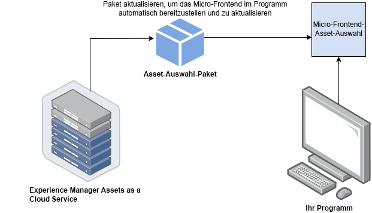
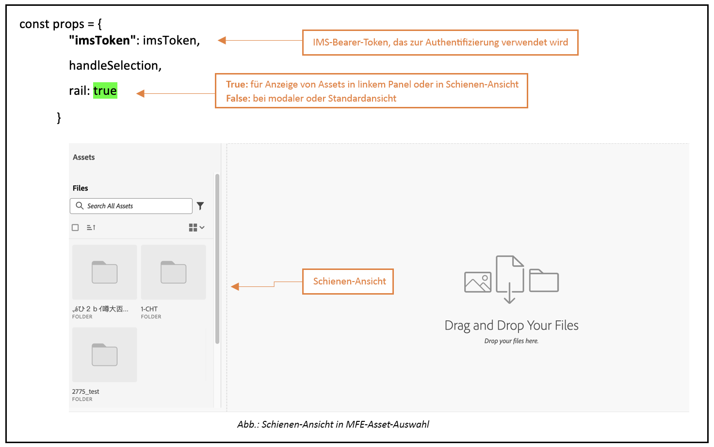
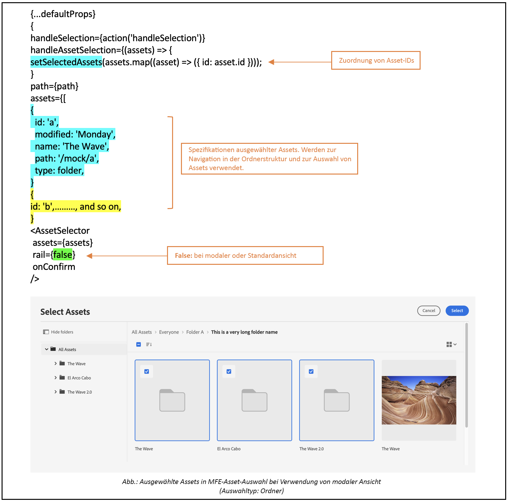
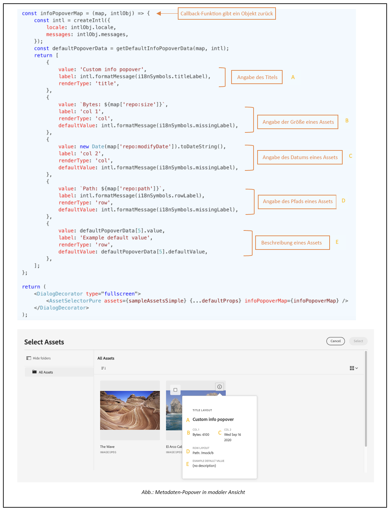
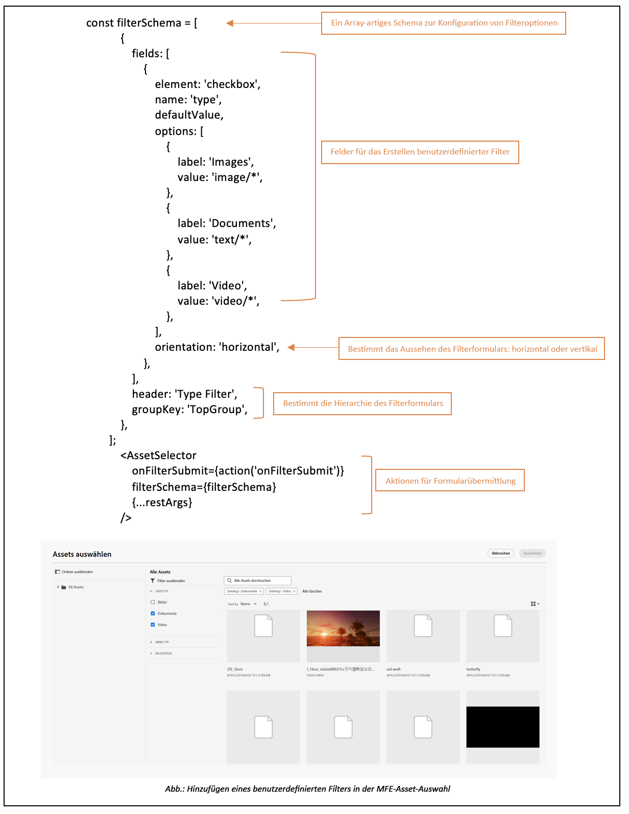
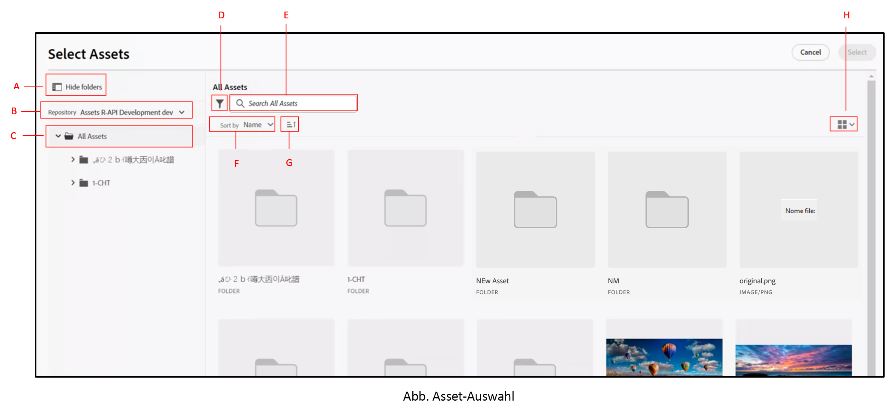
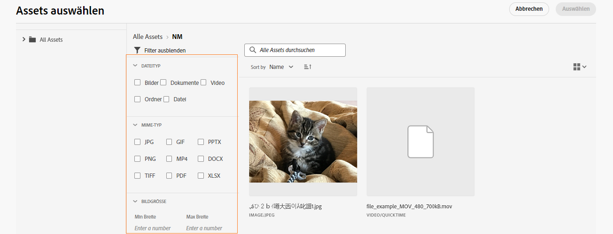
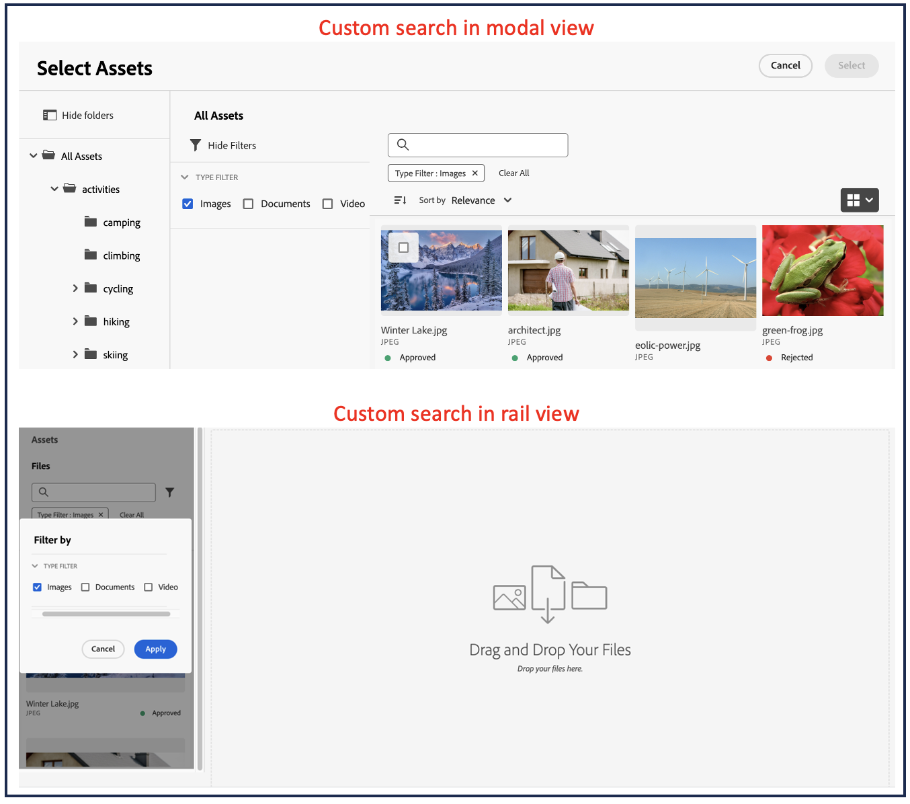

# Micro-Front-End-Asset-Selektor {#Overview}

Der Micro-Front-End-Asset-Selektor bietet eine Benutzeroberfläche, die sich problemlos in das [!DNL Experience Manager Assets]-Repository integrieren lässt, sodass Sie die im Repository verfügbaren digitalen Assets durchsuchen und für die Erstellung von Applikationen verwenden können.

Die Micro-Front-End-Benutzeroberfläche wird über das Asset-Selektor-Paket in Ihrer Applikation verfügbar gemacht. Alle Aktualisierungen des Pakets werden automatisch importiert, und der zuletzt bereitgestellte Asset-Selektor wird automatisch in Ihrer Applikation geladen.



Der Asset-Selektor bietet viele Vorteile, z. B.:

* Einfache Integration in [Adobe](#asset-selector-ims)- oder [Nicht-Adobe](#asset-selector-non-ims)-Anwendungen unter Verwendung der Vanilla JavaScript-Bibliothek.
* Einfach zu verwalten, da Aktualisierungen des Assets-Wähler-Pakets automatisch für den Asset-Selektor bereitgestellt werden, der für Ihre Applikation verfügbar ist. Es sind keine Aktualisierungen innerhalb Ihrer Applikation erforderlich, um die neuesten Änderungen zu laden.
* Einfachere Anpassung, da Eigenschaften verfügbar sind, die die Anzeige des Asset-Selektors in Ihrer Applikation steuern.
* Volltextsuche, vordefinierte und benutzerdefinierte Filter, um schnell zu Assets zu navigieren, die für das Authoring-Erlebnis verwendet werden können.
* Möglichkeit, innerhalb einer IMS-Organisation zur Asset-Auswahl zwischen Repositorys zu wechseln.
* Möglichkeit, Assets nach Namen, Abmessungen und Größe zu sortieren und in der Listen-, Raster-, Galerie- oder Wasserfallansicht anzuzeigen.

<!--Perform the following tasks to integrate and use Asset Selector with your [!DNL Experience Manager Assets] repository:

1. [Install Asset Selector](#installation)
2. [Integrate Asset Selector using Vanilla JS](#integration-using-vanilla-js)
3. [Use Asset Selector](#using-asset-selector)
-->

<!--
## Setting up Asset Selector {#asset-selector-setup}


-->

## Voraussetzungen{#prereqs}

Sie müssen die folgenden Kommunikationsmethoden sicherstellen:

* Die Anwendung wird unter HTTPS ausgeführt.
* Die URL der Anwendung befindet sich in der Zulassungsliste der Umleitungs-URLs des IMS-Clients.
* Der IMS-Anmeldefluss wird mithilfe eines Popup-Fensters im Webbrowser konfiguriert und gerendert. Daher sollten Popup-Fenster im Ziel-Browser aktiviert oder zugelassen werden.

Wenden Sie die oben genannten Voraussetzungen an, wenn Sie einen IMS-Authentifizierungs-Workflow des Asset-Wählers benötigen. Wenn Sie bereits mit dem IMS-Workflow authentifiziert sind, können Sie stattdessen die IMS-Informationen hinzufügen.

>[!IMPORTANT]
>
> Dieses Repository dient als zusätzliche Dokumentation, die die verfügbaren APIs und Anwendungsbeispiele für die Integration des Asset-Wählers beschreibt. Bevor Sie versuchen, den Asset-Wähler zu installieren oder zu verwenden, stellen Sie sicher, dass Ihr Unternehmen Zugriff auf den Asset-Wähler im Experience Manager Assets as a Cloud Service-Profil erhalten hat. Wenn diese Komponenten noch nicht bereitgestellt wurden, können Sie sie weder integrieren noch verwenden. Um die Bereitstellung anzufordern, sollten Ihre Programmadmins ein Support-Ticket erstellen, das von Admin Console als P2 gekennzeichnet ist, und die folgenden Informationen einschließen:
>
>* Domain-Namen, auf denen die integrierende Anwendung gehostet wird.
>* Nach der Bereitstellung wird Ihrem Unternehmen entsprechend den angeforderten Umgebungen, die für die Konfiguration des Asset-Wählers erforderlich sind, `imsClientId`, `imsScope` und eine `redirectUrl` bereitgestellt. Ohne diese gültigen Eigenschaften können Sie die Installationsschritte nicht ausführen.

## Installation {#installation}

Der Asset-Wähler ist sowohl über die ESM CDN-Version (z. B. [esm.sh](https://esm.sh/)/[skypack](https://www.skypack.dev/)) als auch über die [UMD](https://github.com/umdjs/umd)-Version verfügbar.

In Browsern mit **UMD-Version** (empfohlen):

```
<script src="https://experience.adobe.com/solutions/CQ-assets-selectors/static-assets/resources/assets-selectors.js"></script>

<script>
  const { renderAssetSelector } = PureJSSelectors;
</script>
```

In Browsern mit `import maps`-Unterstützung mit **ESM CDN-Version**:

```
<script type="module">
  import { AssetSelector } from 'https://experience.adobe.com/solutions/CQ-assets-selectors/static-assets/resources/@assets/selectors/index.js'
</script>
```

In der Deno/Webpack Module Federation mit **ESM CDN-Version**:

```
import { AssetSelector } from 'https://experience.adobe.com/solutions/CQ-assets-selectors/static-assets/resources/@assets/selectors/index.js'
```

## Integrieren des Asset-Wählers mithilfe von Vanilla JS {#integration-using-vanilla-js}

Sie können jede [!DNL Adobe]- oder Nicht-Adobe-Anwendung mit dem [!DNL Experience Manager Assets]-Repository integrieren und Assets aus der Anwendung heraus auswählen. Siehe [Integration des Asset-Wählers mit verschiedenen Anwendungen](#asset-selector-integration-with-apps).

Die Integration erfolgt durch den Import des Asset-Selektor-Pakets und die Verbindung zu Assets as a Cloud Service unter Verwendung der Vanilla JavaScript-Bibliothek. Bearbeiten Sie eine Datei `index.html` oder eine andere geeignete Datei innerhalb Ihrer Anwendung, um:

* Authentifizierungsdetails zu definieren
* Zugriff auf das Assets as a Cloud Service-Repository zu erhalten
* Anzeigeeigenschaften des Asset-Selektors zu konfigurieren

Sie können eine Authentifizierung durchführen, ohne einige der IMS-Eigenschaften zu definieren, wenn:

* Sie eine [!DNL Adobe]-Applikation auf [Unified Shell](https://experienceleague.adobe.com/docs/experience-manager-cloud-service/content/overview/aem-cloud-service-on-unified-shell.html?lang=de) integrieren.
* Für die Authentifizierung wurde bereits ein IMS-Token generiert.

## Integrieren des Asset-Wählers mit verschiedenen Anwendungen {#asset-selector-integration-with-apps}

Sie können den Asset-Wähler mit verschiedenen Anwendungen integrieren, z. B.:

* [Integrieren des Asset-Wählers mit einer [!DNL Adobe] -Anwendung](#adobe-app-integration-vanilla)
* [Integrieren des Asset-Wählers mit einer Nicht-Adobe-Anwendung](#adobe-non-app-integration)
* [Integrieren in Dynamic Media mit OpenAPI-Funktionen](#adobe-app-integration-polaris)

>[!BEGINTABS]

<!--Integration with an Adobe application content starts here-->

>[!TAB Integration mit einer Adobe-Anwendung]

### Voraussetzungen{#prereqs-adobe-app}

Wenden Sie die folgenden Voraussetzungen an, wenn Sie den Asset-Wähler mit einer [!DNL Adobe]-Anwendung integrieren:

* [Kommunikationsmethoden](#prereqs)
* imsOrg
* imsToken
* apikey

### Integrieren des Asset-Wählers mit einer [!DNL Adobe]-Anwendung {#adobe-app-integration-vanilla}

Das folgende Beispiel zeigt die Verwendung des Asset-Wählers bei Ausführung einer [!DNL Adobe]-Anwendung unter Unified Shell oder wenn Sie bereits `imsToken` für die Authentifizierung generiert haben.

Fügen Sie das Asset-Wähler-Paket mit dem `script`-Tag in Ihren Code ein, wie in _Zeilen 6 bis 15_ des folgenden Beispiels zu sehen. Sobald das Skript geladen ist, kann die globale Variable `PureJSSelectors` verwendet werden. Definieren Sie die [Eigenschaften](#asset-selector-properties) des Asset-Wählers wie in _Zeilen 16 bis 23_ zu sehen. Die Eigenschaften `imsOrg` und `imsToken` sind beide für die Authentifizierung in der Adobe-Anwendung erforderlich. Die `handleSelection`-Eigenschaft wird verwendet, um die ausgewählten Assets zu behandeln. Um den Asset-Wähler zu rendern, rufen Sie die `renderAssetSelector`-Funktion wie in _Zeile 17_ erwähnt auf. Der Asset-Wähler wird im Container-Element `<div>` angezeigt, wie in _Zeilen 21 und 22_ zu sehen.

Wenn Sie diese Schritte befolgen, können Sie den Asset-Wähler mit Ihrer [!DNL Adobe]-Anwendung verwenden.

```html {line-numbers="true"}
<!DOCTYPE html>
<html>
<head>
    <title>Asset Selector</title>
    <script src="https://experience.adobe.com/solutions/CQ-assets-selectors/assets/resources/assets-selectors.js"></script>
    <script>
        // get the container element in which we want to render the AssetSelector component
        const container = document.getElementById('asset-selector-container');
        // imsOrg and imsToken are required for authentication in Adobe application
        const assetSelectorProps = {
            imsOrg: 'example-ims@AdobeOrg',
            imsToken: "example-imsToken",
            apiKey: "example-apiKey-associated-with-imsOrg",
            handleSelection: (assets: SelectedAssetType[]) => {},
        };
        // Call the `renderAssetSelector` available in PureJSSelectors globals to render AssetSelector
        PureJSSelectors.renderAssetSelector(container, assetSelectorProps);
    </script>
</head>

<body>
    <div id="asset-selector-container" style="height: calc(100vh - 80px); width: calc(100vw - 60px); margin: -20px;">
    </div>
</body>

</html>
```

<!--For detailed example, visit [Asset Selector Code Example](https://github.com/adobe/aem-assets-selectors-mfe-examples).-->

+++**ImsAuthProps**
Die `ImsAuthProps`-Eigenschaften definieren die Authentifizierungsinformationen und den Ablauf, mit dem der Asset-Selektor ein `imsToken` abruft. Durch Festlegen dieser Eigenschaften können Sie steuern, wie sich der Authentifizierungsfluss verhält, und Listener für verschiedene Authentifizierungsereignisse registrieren.

| Eigenschaftsname | Beschreibung |
|---|---|
| `imsClientId` | Ein Zeichenfolgenwert, der die für Authentifizierungszwecke verwendete IMS-Client-ID darstellt. Dieser Wert wird von Adobe bereitgestellt und ist spezifisch für Ihre Adobe AEM CS-Organisation. |
| `imsScope` | Beschreibt die bei der Authentifizierung verwendeten Bereiche. Die Bereiche bestimmen den Umfang des Zugriffs, den die Anwendung auf die Ressourcen Ihrer Organisation hat. Mehrere Bereiche werden durch Kommas voneinander getrennt. |
| `redirectUrl` | Stellt die URL dar, an die Benutzende nach der Authentifizierung weitergeleitet werden. Dieser Wert wird normalerweise auf die aktuelle URL der Anwendung gesetzt. Wenn keine `redirectUrl` bereitgestellt wird, verwendet `ImsAuthService` die zum Registrieren der `imsClientId` verwendete redirectUrl |
| `modalMode` | Ein boolescher Wert, der angibt, ob der Authentifizierungsfluss in einem Modal (Popup-Fenster) angezeigt werden soll oder nicht. Wenn `true` festgelegt ist, wird der Authentifizierungsfluss in einem Popup-Fenster angezeigt. Wenn `false` festgelegt ist, wird der Authentifizierungsfluss bei vollständigem Neuladen der Seite angezeigt. Hinweis::_Für ein besseres Anwendererlebnis können Sie diesen Wert dynamisch steuern, wenn Popup-Fenster des Browsers deaktiviert sind. |
| `onImsServiceInitialized` | Eine Rückruffunktion, die aufgerufen wird, wenn der Adobe IMS-Authentifizierungsdienst initialisiert wird. Diese Funktion akzeptiert einen Parameter namens `service`, ein Objekt, das den Adobe IMS-Dienst darstellt. Siehe [`ImsAuthService`](#imsauthservice-ims-auth-service) für weitere Informationen. |
| `onAccessTokenReceived` | Eine Rückruffunktion, die aufgerufen wird, wenn ein `imsToken` vom Adobe IMS-Authentifizierungsdienst empfangen wird. Diese Funktion akzeptiert einen Parameter namens `imsToken`, eine Zeichenfolge, die das Zugriffstoken darstellt. |
| `onAccessTokenExpired` | Eine Rückruffunktion, die aufgerufen wird, wenn ein Zugriffstoken abgelaufen ist. Diese Funktion wird normalerweise verwendet, um einen neuen Authentifizierungsfluss auszulösen und so ein neues Zugriffstoken zu erhalten. |
| `onErrorReceived` | Eine Rückruffunktion, die aufgerufen wird, wenn während der Authentifizierung ein Fehler auftritt. Diese Funktion akzeptiert zwei Parameter: den Fehlertyp und die Fehlermeldung. Der Fehlertyp ist eine Zeichenfolge, die den Fehlertyp darstellt, und die Fehlermeldung ist eine Zeichenfolge, die die Fehlermeldung darstellt. |

+++

+++**ImsAuthService**
Die `ImsAuthService`-Klasse regelt den Authentifizierungsfluss für den Asset-Wähler. Sie ist für den Erhalt eines `imsToken` über den Adobe IMS-Authentifizierungsdienst verantwortlich. Das `imsToken` wird verwendet, um die Benutzerin oder den Benutzer zu authentifizieren und den Zugriff auf das [!DNL Adobe Experience Manager] as a [!DNL Cloud Service] Assets-Repository zu autorisieren. ImsAuthService verwendet die `ImsAuthProps`-Eigenschaften, um den Authentifizierungsfluss zu steuern und Listener für verschiedene Authentifizierungsereignisse zu registrieren. Sie können die praktische Funktion [`registerAssetsSelectorsAuthService`](#purejsselectorsregisterassetsselectorsauthservice) zum Registrieren der _ImsAuthService_-Instanz mit dem Asset-Wähler verwenden. Die folgenden Funktionen sind in der `ImsAuthService`-Klasse verfügbar. Wenn Sie jedoch die Funktion _registerAssetsSelectorsAuthService_ verwenden, müssen Sie diese Funktionen nicht direkt aufrufen.

| Funktionsname | Beschreibung |
|---|---|
| `isSignedInUser` | Bestimmt, ob die Person derzeit beim Dienst angemeldet ist, und gibt entsprechend einen booleschen Wert zurück. |
| `getImsToken` | Ruft das Authentifizierungs-`imsToken` für die derzeit angemeldete Person ab, das zum Authentifizieren von Anforderungen für andere Dienste wie zum Beispiel zum Generieren von Asset-Ausgabedarstellungen verwendet werden kann. |
| `signIn` | Startet den Anmeldeprozess für die Person. Diese Funktion verwendet `ImsAuthProps`, um die Authentifizierung in einem Popup-Fenster oder beim vollständigem Neuladen einer Seite anzuzeigen |
| `signOut` | Meldet die Person vom Dienst ab, macht ihr Authentifizierungs-Token ungültig und fordert sie auf, sich erneut anzumelden, um auf geschützte Ressourcen zuzugreifen. Durch Aufrufen dieser Funktion wird die aktuelle Seite neu geladen. |
| `refreshToken` | Aktualisiert das Authentifizierungs-Token für die derzeit angemeldete Person, verhindert das Ablaufen des Tokens und stellt einen unterbrechungsfreien Zugriff auf geschützte Ressourcen sicher. Gibt ein neues Authentifizierungs-Token zurück, das für nachfolgende Anforderungen verwendet werden kann. |

+++

+++**Validierung mit bereitgestelltem IMS-Token**

```
<script>
    const apiToken="<valid IMS token>";
    function handleSelection(selection) {
    console.log("Selected asset: ", selection);
    };
    function renderAssetSelectorInline() {
    console.log("initializing Asset Selector");
    const props = {
    "repositoryId": "delivery-p64502-e544757.adobeaemcloud.com",
    "apiKey": "ngdm_test_client",
    "imsOrg": "<IMS org>",
    "imsToken": apiToken,
    handleSelection,
    hideTreeNav: true
    }
    const container = document.getElementById('asset-selector-container');
    PureJSSelectors.renderAssetSelector(container, props);
    }
    $(document).ready(function() {
    renderAssetSelectorInline();
    });
</script>
```

+++

+++**Registrieren von Rückrufen des IMS-Dienstes**

```
// object `imsProps` to be defined as below 
let imsProps = {
    imsClientId: <IMS Client Id>,
        imsScope: "openid",
        redirectUrl: window.location.href,
        modalMode: true,
        adobeImsOptions: {
            modalSettings: {
            allowOrigin: window.location.origin,
},
        useLocalStorage: true,
},
onImsServiceInitialized: (service) => {
            console.log("onImsServiceInitialized", service);
},
onAccessTokenReceived: (token) => {
            console.log("onAccessTokenReceived", token);
},
onAccessTokenExpired: () => {
            console.log("onAccessTokenError");
// re-trigger sign-in flow
},
onErrorReceived: (type, msg) => {
            console.log("onErrorReceived", type, msg);
},
}
```

+++

<!--Integration with non-Adobe application content starts here-->

>[!TAB Integration mit einer Nicht-Adobe-Anwendung]

<!--### Integrate Asset Selector with a [!DNL non-Adobe] application {#adobe-non-app-integration}-->

### Voraussetzungen {#prereqs-non-adobe-app}

Wenden Sie die folgenden Voraussetzungen an, wenn Sie den Asset-Wähler mit einer Nicht-Adobe-Anwendung integrieren:

* [Kommunikationsmethoden](#prereqs)
* imsClientId
* imsScope
* redirectURL
* imsOrg
* apikey

Der Asset-Wähler unterstützt die Authentifizierung für das [!DNL Experience Manager Assets]-Repository mit Eigenschaften des Identity Management System (IMS), z. B. `imsScope` oder `imsClientID`, wenn Sie es mit einer Nicht-Adobe-Anwendung integrieren.

+++**Konfigurieren des Asset-Wählers für eine Nicht-Adobe-Anwendung**
Um den Asset-Wähler für eine Nicht-Adobe-Anwendung zu konfigurieren, müssen Sie zunächst ein Support-Ticket für die Bereitstellung einreichen und dann die Integrationsschritte befolgen.

**Einreichen eines Support-Tickets**
Schritte zum Einreichen eines Support-Tickets über die Admin Console:

1. Fügen Sie **Asset-Wähler mit AEM Assets** zum Titel des Tickets hinzu.

1. Geben Sie in der Beschreibung die folgenden Details an:

   * [!DNL Experience Manager Assets] as a [!DNL Cloud Service]-URL (Programm-ID und Umgebungs-ID).
   * Domain-Namen, auf denen die Nicht-Adobe-Web-Anwendung gehostet wird.
+++

+++**Integrationsschritte**
Verwenden Sie diese `index.html`-Beispieldatei zur Authentifizierung bei der Integration des Asset-Wählers mit einer Nicht-Adobe-Anwendung.

Greifen Sie mithilfe des `Script`-Tags auf das Asset-Wählerpaket zu, wie in *Zeile 9* bis *Zeile 11* der `index.html`-Beispieldatei dargestellt.

In *Zeile 14* bis *Zeile 38* des Beispiels werden die Eigenschaften des IMS-Flusses beschrieben, z. B. `imsClientId`, `imsScope` und `redirectURL`. Die Funktion erfordert, dass Sie mindestens eine der Eigenschaften `imsClientId` und `imsScope` definieren. Wenn Sie keinen Wert für `redirectURL` definieren, wird die registrierte Umleitungs-URL für die Client-ID verwendet.

Da Sie kein `imsToken` generiert haben, verwenden Sie die Funktionen `registerAssetsSelectorsAuthService` und `renderAssetSelectorWithAuthFlow`, wie in den Zeilen 40 bis 50 der `index.html`-Beispieldatei dargestellt. Verwenden Sie die Funktion `registerAssetsSelectorsAuthService` vor `renderAssetSelectorWithAuthFlow`, um das `imsToken` mit dem Asset-Wähler zu registrieren. [!DNL Adobe] empfiehlt, `registerAssetsSelectorsAuthService` aufzurufen, wenn Sie die Komponente instanziieren.

Definieren Sie die Authentifizierung und andere Zugriffseigenschaften für Assets as a Cloud Service im Abschnitt `const props`, wie in *Zeile 54* bis *Zeile 60* der `index.html`-Beispieldatei dargestellt.

Die globale Variable `PureJSSelectors`, erwähnt in *Zeile 65*, wird zum Rendern des Asset-Wählers im Webbrowser verwendet.

Der Asset-Wähler wird im Container-Element `<div>` gerendert, wie in *Zeile 74* bis *Zeile 81* angegeben. Das Beispiel verwendet ein Dialogfeld zum Anzeigen des Asset-Wählers.

```html {line-numbers="true"}
<!DOCTYPE html>
<html>

<head>
    <meta http-equiv="X-UA-Compatible" content="IE=edge">
    <meta charset="utf-8">
    <title>Asset Selectors</title>
    <link rel="stylesheet" href="index.css">
    <script id="asset-selector"
        src="https://experience.adobe.com/solutions/CQ-assets-selectors/assets/resources/asset-selectors.js"></script>
    <script>

        const imsProps = {
            imsClientId: "<obtained from IMS team>",
            imsScope: "openid, <other scopes>",
            redirectUrl: window.location.href,
            modalMode: true, // false to open in a full page reload flow
            onImsServiceInitialized: (service) => {
                // invoked when the ims service is initialized and is ready
                console.log("onImsServiceInitialized", service);
            },
            onAccessTokenReceived: (token) => {
                console.log("onAccessTokenReceived", token);
            },
            onAccessTokenExpired: () => {
                console.log("onAccessTokenError");
                // re-trigger sign-in flow
            },
            onErrorReceived: (type, msg) => {
                console.log("onErrorReceived", type, msg);
            },
        }

        function load() {
            const registeredTokenService = PureJSSelectors.registerAssetsSelectorsAuthService(imsProps);
            imsInstance = registeredTokenService;
        };

        // initialize the IMS flow before attempting to render the asset selector
        load();
        

        //function that will render the asset selector
            const otherProps = {
            // any other props supported by asset selector
            }
            const assetSelectorProps = {
                "imsOrg": "imsorg",
                ...otherProps
            }
             // container element on which you want to render the AssetSelector/DestinationSelector component
            const container = document.getElementById('asset-selector');

            /// Use the PureJSSelectors in globals to render the AssetSelector/DestinationSelector component
            PureJSSelectors.renderAssetSelectorWithAuthFlow(container, assetSelectorProps, () => {
                const assetSelectorDialog = document.getElementById('asset-selector-dialog');
                assetSelectorDialog.showModal();
            });
        }
    </script>

</head>
<body class="asset-selectors">
    <div>
        <button onclick="renderAssetSelectorWithAuthFlowFlow()">Asset Selector - Select Assets with Ims Flow</button>
    </div>
        <dialog id="asset-selector-dialog">
            <div id="asset-selector" style="height: calc(100vh - 80px); width: calc(100vw - 60px); margin: -20px;">
            </div>
        </dialog>
    </div>
</body>

</html>
```

+++

+++**Zugriff auf das Bereitstellungs-Repository nicht möglich**

>[!TIP]
>
>Wenn Sie den Asset-Wähler mithilfe des Workflows zum Registrieren und Anmelden integriert haben, aber trotzdem nicht auf das Bereitstellungs-Repository zugreifen können, stellen Sie sicher, dass die Browser-Cookies bereinigt wurden. Andernfalls tritt der Fehler `invalid_credentials All session cookies are empty` in der Konsole auf.

+++

<!--Integration with Polaris application content starts here-->

>[!TAB Integration in Dynamic Media mit OpenAPI-Funktionen]

### Voraussetzungen {#prereqs-polaris}

Wenden Sie die folgenden Voraussetzungen an, wenn Sie den Asset-Wähler in Dynamic Media mit OpenAPI-Funktionen integrieren:

* [Kommunikationsmethoden](#prereqs)
* Für den Zugriff auf Dynamic Media mit OpenAPI-Funktionen benötigen Sie folgende Lizenzen:
   * Assets-Repository (z. B. Experience Manager Assets as a Cloud Service)
   * AEM und Dynamic Media.
* Nur [genehmigte Assets](#approved-assets.md) zur Verwendung verfügbar, um die Markenkonsistenz sicherzustellen.

### Integrieren in Dynamic Media mit OpenAPI-Funktionen{#adobe-app-integration-polaris}

Die Integration des Asset-Wählers mit dem OpenAPI-Prozess von Dynamic Media umfasst verschiedene Schritte, darunter die Erstellung einer benutzerdefinierten oder auswahlbereiten Dynamic Media-URL.

+++**Integrieren des Asset-Wählers in Dynamic Media mit OpenAPI-Funktionen**

Die Eigenschaften `rootPath` und `path` sollten nicht Teil von Dynamic Media mit OpenAPI-Funktionen sein. Stattdessen können Sie die Eigenschaft `aemTierType` konfigurieren. Die Syntax der Konfiguration ist wie folgt:

```
aemTierType:[1: "delivery"]
```

Mit dieser Konfiguration können Sie alle genehmigten Assets ohne Ordner oder als flache Struktur anzeigen. Weitere Informationen finden Sie im Abschnitt [Eigenschaften des Asset-Wählers](#asset-selector-properties) unter der Eigenschaft `aemTierType`.

+++

+++**Erstellen einer dynamischen Versand-URL anhand genehmigter Assets**
Nachdem Sie den Asset-Wähler eingerichtet haben, wird ein Objektschema verwendet, um eine dynamische Versand-URL anhand der genehmigten Assets zu erstellen.
Hier ist ein Beispiel für ein Schema eines Objekts aus einem Array von Objekten, das bei Auswahl eines Assets empfangen wird:

```
{
"dc:format": "image/jpeg",
"repo:assetId": "urn:aaid:aem:xxxxxxxx-xxxx-xxxx-xxxx-xxxxxxxxxxxx",
"repo:name": "image-7.jpg",
"repo:repositoryId": "delivery-pxxxx-exxxxxx.adobe.com",
...
}
```

Der Carrier für alle ausgewählten Assets ist die `handleSelection`-Funktion, die als JSON-Objekt fungiert. Beispiel: `JsonObj`. Die dynamische Versand-URL wird durch die Kombination der folgenden Carrier erstellt:

| Objekt | JSON |
|---|---|
| Host | `assetJsonObj["repo:repositoryId"]` |
| API-Stamm | `/adobe/assets` |
| asset-id | `assetJsonObj["repo:assetId"]` |
| seo-name | `assetJsonObj["repo:name"].split(".").slice(0,-1).join(".")` |
| format | `.jpg` |

**API-Spezifikation für die Bereitstellung genehmigter Assets**

URL-Format:
`https://<delivery-api-host>/adobe/assets/<asset-id>/as/<seo-name>.<format>?<image-modification-query-parameters>`

Dabei gilt Folgendes:

* Der Host ist `https://delivery-pxxxxx-exxxxxx.adobe.com`
* Der API-Stamm lautet `"/adobe/assets"`
* `<asset-id>` ist die Asset-Kennung
* `as` ist der konstante Teil der OpenAPI-Spezifikation, der angibt, wie das Asset bezeichnet werden soll
* `<seo-name>` ist der Name eines Assets
* `<format>` ist das Ausgabeformat
* `<image modification query parameters>`, wie von der API-Spezifikation für die Bereitstellung genehmigter Assets unterstützt

**API für die Bereitstellung genehmigter Assets für die Original-Ausgabedarstellung**

Die dynamische Versand-URL weist die folgende Syntax auf:
`https://<delivery-api-host>/adobe/assets/<asset-id>/original/as/<seo-name>`, wobei Folgendes gilt:

* Der Host ist `https://delivery-pxxxxx-exxxxxx.adobe.com`
* Der API-Stamm für die Bereitstellung der Original-Ausgabedarstellung lautet `"/adobe/assets"`
* `<asset-id>` ist die Asset-Kennung
* `/original/as` ist der konstante Teil der OpenAPI-Spezifikation, der angibt, wie die Original-Ausgabedarstellung bezeichnet werden soll
* `<seo-name>`ist der Name des Assets, das eine Erweiterung aufweisen kann.

+++

+++**Auswahlbereite dynamische Versand-URL**
Der Carrier für alle ausgewählten Assets ist die `handleSelection`-Funktion, die als JSON-Objekt fungiert. Zum Beispiel: `JsonObj`. Die dynamische Versand-URL wird durch die Kombination der folgenden Carrier erstellt:

| Objekt | JSON |
|---|---|
| Host | `assetJsonObj["repo:repositoryId"]` |
| API-Stamm | `/adobe/assets/deliver` |
| asset-id | `assetJsonObj["repo:assetId"]` |
| seo-name | `assetJsonObj["repo:name"]` |

Im Folgenden werden die beiden Möglichkeiten zum Durchlaufen des JSON-Objekts beschrieben:


* **Miniaturansicht:** Bei Miniaturansichten kann es sich um Bilder und Assets wie PDF, Videos usw. handeln. Sie können jedoch die Höhe- und Breitenattribute der Miniaturansicht eines Assets als Ausgabedarstellung für die dynamische Bereitstellung verwenden.
Der folgende Satz von Ausgabedarstellungen kann für Assets vom Typ PDF verwendet werden:
Sobald eine PDF-Datei im Sidekick ausgewählt ist, bietet der Auswahlkontext die folgenden Informationen. Nachstehend wird beschrieben, wie Sie das JSON-Objekt durchlaufen:

  <!---->

  Im Screenshot oben finden Sie unter `selection[0].....selection[4]` den Link für das Array der Ausgabedarstellung. Die Haupteigenschaften einer der Miniaturausgabedarstellungen umfassen beispielsweise Folgendes:

  ```
  { 
      "height": 319, 
      "width": 319, 
      "href": "https://delivery-pxxxxx-exxxxx.adobeaemcloud.com/adobe/assets/urn:aaid:aem:8560f3a1-d9cf-429d-a8b8-d81084a42d41/as/algorithm design.jpg?width=319&height=319", 
      "type": "image/webp" 
  } 
  ```

Im obigen Screenshot muss die Versand-URL der Original-Ausgabedarstellung der PDF-Datei in das Zielerlebnis integriert werden, wenn eine PDF-Datei erforderlich ist und nicht ihre Miniaturansicht. Zum Beispiel: `https://delivery-pxxxxx-exxxxx-cmstg.adobeaemcloud.com/adobe/assets/urn:aaid:aem:8560f3a1-d9cf-429d-a8b8-d81084a42d41/original/as/algorithm design.pdf`

* **Video:** Sie können die Video-Player-URL für die Assets vom Typ „Video“ verwenden, die einen eingebetteten iFrame verwenden. Sie können die folgenden Array-Ausgabedarstellungen im Zielerlebnis verwenden:
  <!---->

  ```
  { 
      "height": 319, 
      "width": 319, 
      "href": "https://delivery-pxxxxx-exxxxx.adobeaemcloud.com/adobe/assets/urn:aaid:aem:2fdef732-a452-45a8-b58b-09df1a5173cd/as/asDragDrop.2.jpg?width=319&height=319", 
      "type": "image/webp" 
  } 
  ```

  Im Screenshot oben finden Sie unter `selection[0].....selection[4]` den Link für das Array der Ausgabedarstellung. Die Haupteigenschaften einer der Miniaturausgabedarstellungen umfassen beispielsweise Folgendes:

  Das Code-Fragment im obigen Screenshot ist ein Beispiel für ein Video-Asset. Es enthält das Array der Ausgabedarstellungs-Links. `selection[5]` im Auszug ist das Beispiel für die Miniaturansicht eines Bildes, die als Platzhalter für die Miniaturansicht eines Videos im Zielerlebnis verwendet werden kann. `selection[5]` im Array der Ausgabedarstellungen ist für den Video-Player vorgesehen. Dies dient als HTML und kann als `src` des iFrames festgelegt werden. Es unterstützt das Streaming mit adaptiver Bitrate (die Web-optimierte Bereitstellung des Videos).

  Im obigen Beispiel lautet die URL des Video-Players wie folgt: `https://delivery-pxxxxx-exxxxx.adobeaemcloud.com/adobe/assets/urn:aaid:aem:2fdef732-a452-45a8-b58b-09df1a5173cd/play`

+++**Benutzeroberfläche des Asset-Wählers für Dynamic Media mit OpenAPI-Funktionen**

Nach der Integration mit dem Micro-Frontend-Asset-Wähler von Adobe können Sie die reine Asset-Struktur aller genehmigten Assets sehen, die im Experience Manager-Asset-Repository verfügbar sind.


* **A**: [Bedienfeld aus-/einblenden](#hide-show-panel)
* **B**: [Assets](#repository)
* **C**: [Sortieung](#sorting)
* **D**: [Filter](#filters)
* **E**: [Suchleiste](#search-bar)
* **G**: [Sortierung in auf- oder absteigender Reihenfolge](#sorting)
* **G**: Auswahl abbrechen
* **H**: Einzelne oder mehrere Assets auswählen

+++

+++**Konfigurieren benutzerdefinierter Filter**
Mit dem Asset-Wähler für Dynamic Media mit OpenAPI-Funktionen können Sie benutzerdefinierte Eigenschaften und die darauf basierenden Filter konfigurieren. Die Eigenschaft `filterSchema` wird zum Konfigurieren solcher Eigenschaften verwendet. Die Anpassung kann als `metadata.<metadata bucket>.<property name>.` verfügbar gemacht werden, womit die Filter konfiguriert werden können. Dabei gilt Folgendes:

* Bei `metadata` handelt es sich um die Informationen eines Assets
* Bei `embedded` handelt es sich um den statischen Parameter, der für die Konfiguration verwendet wird
* Bei `<propertyname>` handelt es sich um den Filternamen, den Sie konfigurieren

Für die Konfiguration werden die auf Ebene `jcr:content/metadata/` definierten Eigenschaften für die zu konfigurierenden Filter als `metadata.<metadata bucket>.<property name>.` verfügbar gemacht.

Beispielsweise wird im Asset-Wähler für Dynamic Media mit OpenAPI-Funktionen eine Eigenschaft unter `asset jcr:content/metadata/client_name:market` für die Filterkonfiguration in `metadata.embedded.client_name:market` umgewandelt.

Um den Namen abzurufen, muss eine einmalige Aktivität durchgeführt werden. Führen Sie einen Such-API-Aufruf für das Asset aus und rufen Sie den Eigenschaftsnamen (also den Bucket) ab.

+++

>[!ENDTABS]

## Eigenschaften des Asset-Wählers {#asset-selector-properties}

Sie können die Asset-Wähler-Eigenschaften verwenden, um die Darstellung des Asset-Wählers anzupassen. In der folgenden Tabelle sind die Eigenschaften aufgeführt, mit denen Sie den Asset-Wähler anpassen und verwenden können.

| Eigenschaft | Typ | Erforderlich | Standard | Beschreibung |
|---|---|---|---|---|
| *Leiste* | Boolesch | Nein | False | Wenn als `true` markiert, wird der Asset-Wähler in der linken Leistenansicht gerendert. Wenn als `false` markiert, wird der Asset-Wähler in der modalen Ansicht gerendert. |
| *imsOrg* | Zeichenfolge | Ja | | Die Adobe Identity Management System (IMS)-ID, die bei der Bereitstellung von [!DNL Adobe Experience Manager] als [!DNL Cloud Service] für Ihre Organisation zugewiesen wird. Der `imsOrg`-Schlüssel ist erforderlich, damit authentifiziert wird, ob sich die Organisation, auf die Sie zugreifen, unter Adobe IMS befindet oder nicht. |
| *imsToken* | Zeichenfolge | Nein | | Für die Authentifizierung verwendeter IMS-Bearer-Token. Das `imsToken` ist erforderlich, wenn Sie eine [!DNL Adobe]-Anwendung für die Integration verwenden. |
| *apiKey* | Zeichenfolge | Nein | | API-Schlüssel, der für den Zugriff auf den AEM Discovery-Dienst verwendet wird. Der `apiKey` ist erforderlich, wenn Sie eine Integration mit einer [!DNL Adobe]-Anwendung verwenden. |
| *filterSchema* | Array | Nein | | Modell, das zum Konfigurieren von Filtereigenschaften verwendet wird. Dies ist nützlich, wenn Sie bestimmte Filteroptionen des Asset-Wählers einschränken möchten. |
| *filterFormProps* | Objekt | Nein | | Geben Sie die Filtereigenschaften an, die Sie zur Verfeinerung Ihrer Suche verwenden müssen. Beispiel: MIME-Typ JPG, PNG, GIF. |
| *selectedAssets* | Array `<Object>` | Nein |                 | Geben Sie ausgewählte Assets an, wenn der Asset-Wähler gerendert wird. Es ist ein Array von Objekten erforderlich, das eine ID-Eigenschaft der Assets enthält. Zum Beispiel: `[{id: 'urn:234}, {id: 'urn:555'}]` Ein Asset muss im aktuellen Verzeichnis verfügbar sein. Wenn Sie ein anderes Verzeichnis verwenden müssen, geben Sie auch einen Wert für die Eigenschaft `path` an. |
| *acvConfig* | Objekt | Nein | | Asset Collection View-Eigenschaft, die ein Objekt enthält, das eine benutzerdefinierte Konfiguration enthält, um Standardwerte zu überschreiben. Diese Eigenschaft wird auch mit der Eigenschaft `rail` verwendet, um die Leistenansicht des Asset-Wählers zu aktivieren. |
| *i18nSymbols* | `Object<{ id?: string, defaultMessage?: string, description?: string}>` | Nein |                 | Wenn die vorkonfigurierten Übersetzungen für die Bedürfnisse Ihrer Anwendung unzureichend sind, können Sie eine Schnittstelle bereitstellen, über die Sie Ihre eigenen lokalisierten Werte durch die Eigenschaft `i18nSymbols` übergeben können. Wenn Sie über diese Schnittstelle einen Wert übergeben, werden die bereitgestellten Standardübersetzungen überschrieben und stattdessen Ihre eigenen verwendet. Um die Überschreibung vorzunehmen, müssen Sie ein gültiges [Message Descriptor](https://formatjs.io/docs/react-intl/api/#message-descriptor)-Objekt an den Schlüssel von `i18nSymbols` übergeben, den Sie überschreiben möchten. |
| *intl* | Objekt | Nein | | Der Asset-Wähler bietet standardmäßige, vorkonfigurierte Übersetzungen. Sie können die Übersetzungssprache auswählen, indem Sie eine gültige Gebietsschema-Zeichenfolge durch die `intl.locale`-Eigenschaft bereitstellen. Zum Beispiel: `intl={{ locale: "es-es" }}` </br></br> Die unterstützten Gebietsschema-Zeichenfolgen folgen den [ISO 639 – Codes](https://www.iso.org/iso-639-language-codes.html) für die Darstellung von Namen von Sprachen. </br></br> Liste der unterstützten Gebietsschemata: Englisch: „en-us“ (Standard), Spanisch: „es-es“, Deutsch: „de-de“, Französisch: „fr-fr“, Italienisch: „it-it“, Japanisch: „ja-jp“, Koreanisch: „ko-kr“, Portugiesisch: „pt-br“, Chinesisch (Vereinfacht): „zh-cn“, Chinesisch (Taiwan): „zh-tw“ |
| *repositoryId* | Zeichenfolge | Nein | &#39;&#39; | Repository, aus dem der Asset-Wähler den Inhalt lädt. |
| *additionalAemSolutions* | `Array<string>` | Nein | [ ] | Damit können Sie eine Liste mit zusätzlichen AEM-Repositorys hinzufügen. Wenn in dieser Eigenschaft keine Informationen bereitgestellt werden, werden nur die Medienbibliothek oder AEM Assets-Repositorys berücksichtigt. |
| *hideTreeNav* | Boolesch | Nein |  | Gibt an, ob die Navigationsseitenleiste der Asset-Baumstruktur ein- oder ausgeblendet werden soll. Sie wird nur in der modalen Ansicht verwendet und daher gibt es keine Auswirkung dieser Eigenschaft in der Leistenansicht. |
| *onDrop* | Funktion | Nein | | Die Eigenschaft ermöglicht die Ablagefunktion eines Assets. |
| *dropOptions* | `{allowList?: Object}` | Nein | | Konfiguriert Ablagefunktionen mithilfe der „Zulassungsliste“. |
| *colorScheme* | Zeichenfolge | Nein | | Design konfigurieren (`light` oder `dark`) für den Asset-Wähler. |
| *handleSelection* | Funktion | Nein | | Wird mit einem Array von Asset-Elementen aufgerufen, wenn Assets ausgewählt sind und die Schaltfläche `Select` im Modal angeklickt wird. Diese Funktion wird nur in der modalen Ansicht aufgerufen. Verwenden Sie für die Leistenansicht die Funktionen `handleAssetSelection` oder `onDrop`. Zum Beispiel: <pre>handleSelection=(assets: Asset[])=> {...}</pre> Siehe [Ausgewählter Asset-Typ](#selected-asset-type) für Details. |
| *handleAssetSelection* | Funktion | Nein | | Wird mit einem Array von Elementen aufgerufen, während die Assets ausgewählt oder deren Auswahl aufgehoben wird. Dies ist nützlich, wenn Sie auf Assets warten möchten, während die Benutzenden sie auswählen. Zum Beispiel: <pre>handleSelection=(assets: Asset[])=> {...}</pre> Siehe [Ausgewählter Asset-Typ](#selected-asset-type) für Details. |
| *onClose* | Funktion | Nein | | Wird aufgerufen, wenn die `Close`-Schaltfläche in der modalen Ansicht gedrückt wird. Dies wird nur in der `modal`-Ansicht aufgerufen und in der `rail`-Ansicht nicht beachtet. |
| *onFilterSubmit* | Funktion | Nein | | Wird mit Filterelementen aufgerufen, wenn Benutzende andere Filterkriterien ändern. |
| *selectionType* | Zeichenfolge | Nein | Einzeln | Konfiguration für `single`- oder `multiple`-Auswahl von Assets auf einmal. |
| *dragOptions.allowList* | Boolesch | Nein | | Die Eigenschaft wird verwendet, um das Drag-and-Drop von nicht auswählbaren Assets zuzulassen oder zu verweigern. |
| *aemTierType* | Zeichenfolge | Nein |  | Sie können damit festlegen, ob Assets aus der Bereitstellungsebene, der Autorenebene oder beiden Ebenen angezeigt werden sollen. <br><br> Syntax: `aemTierType:[0]: "author" 1: "delivery"` <br><br> Wenn zum Beispiel beide Ebenen `["author","delivery"]` verwendet werden, zeigt der Repository-Umschalter Optionen für Author und Bereitstellung an. |
| *handleNavigateToAsset* | Funktion | Nein | | Es handelt sich um eine Rückruffunktion, die die Auswahl eines Assets verarbeitet. |
| *noWrap* | Boolesch | Nein | | Die Eigenschaft *noWrap* hilft beim Rendern des Asset-Wählers im Bedienfeld der Seitenleiste. Wenn diese Eigenschaft nicht erwähnt wird, wird standardmäßig die *Dialogfeldansicht* gerendert. |
| *dialogSize* | Klein, mittelgroß, groß, Vollbild oder Vollbild-Übernahme | Zeichenfolge | Optional | Sie können das Layout kontrollieren, indem Sie dessen Größe mithilfe der angegebenen Optionen festlegen. |
| *colorScheme* | Hell oder dunkel | Nein | | Diese Eigenschaft wird verwendet, um das Design einer Asset-Wähler-Anwendung festzulegen. Sie können zwischen einem hellen und dunklen Design wählen. |
| *filterRepoList* | Funktion | Nein |  | Sie können die Rückruffunktion `filterRepoList` verwenden, die das Experience Manager-Repository aufruft und eine gefilterte Liste von Repositorys zurückgibt. |
| *expiryOptions* | Funktion | | | Sie können eine der beiden folgenden Eigenschaften verwenden: **getExpiryStatus**, was den Status eines abgelaufenen Assets angibt. Die Funktion gibt je nach dem Ablaufdatum eines von Ihnen angegebenen Assets `EXPIRED`, `EXPIRING_SOON` oder `NOT_EXPIRED` zurück. Siehe [Anpassen abgelaufener Assets](#customize-expired-assets). Darüber hinaus können Sie die Option **allowSelectionAndDrag** verwenden, in der der Wert der Funktion entweder `true` oder `false` sein kann. Wenn der Wert auf `false` festgelegt ist, kann das abgelaufene Asset weder ausgewählt noch auf die Arbeitsfläche gezogen werden. |
| *showToast* | | Nein | | Dadurch kann der Asset-Wähler eine benutzerdefinierte Popup-Meldung für das abgelaufene Asset anzeigen. |

<!--
| *rootPath* | String | No | /content/dam/ | Folder path from which Asset Selector displays your assets. `rootPath` can also be used in the form of encapsulation. For example, given the following path, `/content/dam/marketing/subfolder/`, Asset Selector does not allow you to traverse through any parent folder, but only displays the children folders. |
| *path* | String | No | | Path that is used to navigate to a specific directory of assets when the Asset Selector is rendered. |
| *expirationDate* | Function | No | | This function is used to set the usability period of an asset. |
| *disableDefaultBehaviour* | Boolean | No | False | It is a function that is used to enable or disable the selection of an expired asset. You can customize the default behavior of an asset that is set to expire. See [customize expired assets](#customize-expired-assets). |
-->

## Beispiele zur Verwendung der Asset-Selektor-Eigenschaften {#usage-examples}

Sie können die Asset-Selektor-[Eigenschaften](#asset-selector-properties) in der Datei `index.html` definieren, um die Anzeige des Asset-Selektors in Ihrer Applikation anzupassen.

### Beispiel 1: Asset-Selektor in der Leistenansicht



Wenn der Wert `rail` des Asset-Wählers auf `false` gesetzt ist oder in den Eigenschaften nicht erwähnt wird, wird der Asset-Wähler standardmäßig in der Modal-Ansicht angezeigt. Die Eigenschaft `acvConfig` ermöglicht einige tief greifende Konfigurationen wie etwa Drag-and-Drop. Lesen Sie [Aktivieren oder Deaktivieren von Drag-and-Drop](#enable-disable-drag-and-drop), um zu erfahren, wie die Eigenschaft `acvConfig` verwendet wird.

<!--
### Example 2: Use selectedAssets property in addition to the path property

Use the `path` property to define the folder name that displays automatically when the Asset Selector is rendered. In addition, use the `selectedAssets` property to define the IDs for the assets that you need to select within the folder. Moreover, when you want to display assets that are pre-defined within the folder, you can use selectedAssets property.

   
-->

### Beispiel 2: Metadaten-Popover

Verwenden Sie verschiedene Eigenschaften, um Metadaten eines Assets zu definieren, das Sie mit einem Informationssymbol anzeigen möchten. Das Info-Popover bietet die Sammlung von Informationen über das Asset oder den Ordner, einschließlich Titel, Abmessungen, Änderungsdatum, Speicherort und Beschreibung eines Assets. Im folgenden Beispiel werden verschiedene Eigenschaften verwendet, um Metadaten eines Assets anzuzeigen, z. B. gibt die Eigenschaft `repo:path` den Speicherort eines Assets an. <!--`repo` represents the repository from where the asset is showing, whereas, `path` represents the route from where the asset or folder is rendered.-->



### Beispiel 3: Benutzerdefinierte Filtereigenschaft in der Leistenansicht

Zusätzlich zur Facettensuche können Sie mit dem Asset-Selektor verschiedene Attribute anpassen, um Ihre Suche von [!DNL Adobe Experience Manager] als eine [!DNL Cloud Service]-Anwendung zu verfeinern. Fügen Sie den folgenden Code hinzu, um benutzerdefinierte Suchfilter zu Ihrer Anwendung hinzuzufügen. Im folgenden Beispiel ist die `Type Filter`-Suche, die den Asset-Typ nach Bildern, Dokumenten oder Videos filtert, oder der Filtertyp, den Sie für die Suche hinzugefügt haben.



<!--

## Customization after integrating Asset Selector 

### Custom metadata

Assets display panel shows the out of the box metadata that can be displayed in the info of the asset. In addition to this, [!DNL Adobe Experience Manager] as a [!DNL Cloud Service] application allows configuration of the asset selector by adding custom metadata that is shown in info panel of the asset.
-->

## Code-Fragmente für die funktionale Einrichtung{#code-snippets}

Definieren Sie die Voraussetzungen in der Datei `index.html` oder in einer ähnlichen Datei innerhalb Ihrer Anwendungsimplementierung, um die Authentifizierungsdetails für den Zugriff auf das [!DNL Experience Manager Assets]-Repository festzulegen. Danach können Sie Code-Fragmente gemäß Ihren Anforderungen hinzufügen.

### Anpassen des Bedienfelds „Filter“ {#customize-filter-panel}

Sie können das folgende Code-Fragment im Objekt `assetSelectorProps` hinzufügen, um das Filter-Bedienfeld anzupassen:

```
filterSchema: [
    {
    header: 'File Type',
    groupKey: 'TopGroup',
    fields: [
    {
    element: 'checkbox',
    name: 'type',
    options: [
    {
    label: 'Images',
    value: '<comma separated mimetypes, without space, that denote all images, for e.g., image/>',
    },
    {
    label: 'Videos',
    value: '<comma separated mimetypes, without space, that denote all videos for e.g., video/,model/vnd.mts,application/mxf>'
    }
    ]
    }
    ]
    },
    {
    fields: [
    {
    element: 'checkbox',
    name: 'type',
    options: [
    { label: 'JPG', value: 'image/jpeg' },
    { label: 'PNG', value: 'image/png' },
    { label: 'TIFF', value: 'image/tiff' },
    { label: 'GIF', value: 'image/gif' },
    { label: 'MP4', value: 'video/mp4' }
    ],
    columns: 3,
    },
    ],
    header: 'Mime Types',
    groupKey: 'MimeTypeGroup',
    }},
    {
    fields: [
    {
    element: 'checkbox',
    name: 'property=metadata.application.xcm:keywords.value',
    options: [
    { label: 'Fruits', value: 'fruits' },
    { label: 'Vegetables', value: 'vegetables'}
    ],
    columns: 3,
    },
    ],
    header: 'Food Category',
    groupKey: 'FoodCategoryGroup',
    }
],
```

### Anpassen von Informationen in der modalen Ansicht {#customize-info-in-modal-view}

Sie können die Detailansicht eines Assets anpassen, wenn Sie auf das Symbol  klicken. Führen Sie den folgenden Code aus:

```
// Create an object infoPopoverMap and set the property `infoPopoverMap` with it in assetSelectorProps
const infoPopoverMap = (map) => {
// for example, to skip `path` from the info popover view
let defaultPopoverData = PureJSSelectors.getDefaultInfoPopoverData(map);
return defaultPopoverData.filter((i) => i.label !== 'Path'
};
assetSelectorProps.infoPopoverMap = infoPopoverMap;
```

### Aktivieren oder Deaktivieren des Drag-and-Drop-Modus {#enable-disable-drag-and-drop}

Fügen Sie die folgenden Eigenschaften zu `assetSelectorProp` hinzu, um den Drag-and-Drop-Modus zu aktivieren. Um Drag-and-Drop zu deaktivieren, ersetzen Sie den Parameter `true` durch `false`.

```
rail: true,
acvConfig: {
dragOptions: {
allowList: {
'*': true,
},
},
selectionType: 'multiple'
}

// the drop handler to be implemented
function drop(e) {
e.preventDefault();
// following helps you get the selected assets – an array of objects.
const data = JSON.parse(e.dataTransfer.getData('collectionviewdata'));
}
```

### Auswahl von Assets {#selection-of-assets}

Der ausgewählte Asset-Typ ist ein Array von Objekten, das die Asset-Informationen bei Verwendung der Funktionen `handleSelection`, `handleAssetSelection` und `onDrop` enthält.

Führen Sie die folgenden Schritte aus, um die Auswahl einzelner oder mehrerer Assets zu konfigurieren:

```
acvConfig: {
selectionType: 'multiple' // 'single' for single selection
}
// the `handleSelection` callback, always gets you the array of selected assets
```

**Schemasyntax**

```
interface SelectedAsset {
    'repo:id': string;
    'repo:name': string;
    'repo:path': string;
    'repo:size': number;
    'repo:createdBy': string;
    'repo:createDate': string;
    'repo:modifiedBy': string; 
    'repo:modifyDate': string; 
    'dc:format': string; 
    'tiff:imageWidth': number;
    'tiff:imageLength': number;
    'repo:state': string;
    computedMetadata: Record<string, any>;
    _links: {
        'https://ns.adobe.com/adobecloud/rel/rendition': Array<{
            href: string;
            type: string;
            'repo:size': number;
            width: number;
            height: number;
            [others: string]: any;
        }>;
    };
}
```

Die folgende Tabelle beschreibt einige der wichtigen Eigenschaften des ausgewählten Asset-Objekts.

| Eigenschaft | Typ | Beschreibung |
|---|---|---|
| *repo:repositoryId* | Zeichenfolge | Eindeutige Kennung für das Repository, in dem das Asset gespeichert ist. |
| *repo:id* | Zeichenfolge | Eindeutige Kennung für das Asset. |
| *repo:assetClass* | Zeichenfolge | Die Klassifizierung des Assets (z. B. Bild oder Video, Dokument). |
| *repo:name* | Zeichenfolge | Der Name des Assets, einschließlich der Dateierweiterung. |
| *repo:size* | Number (Zahl) | Die Größe des Assets in Bytes. |
| *repo:path* | Zeichenfolge | Der Speicherort des Assets im Repository. |
| *repo:ancestors* | `Array<string>` | Ein Array von Vorgängerelementen für das Asset im Repository. |
| *repo:state* | Zeichenfolge | Aktueller Status des Assets im Repository (z. B. aktiv, gelöscht). |
| *repo:createdBy* | Zeichenfolge | Die Person oder das System, welches das Asset erstellt hat. |
| *repo:createDate* | Zeichenfolge | Datum und Uhrzeit der Erstellung des Assets. |
| *repo:modifiedBy* | Zeichenfolge | Die Person oder das System, welches das Asset zuletzt geändert hat. |
| *repo:modifyDate* | Zeichenfolge | Datum und Uhrzeit der letzten Änderung des Assets. |
| *dc:format* | Zeichenfolge | Das Format des Assets, z. B. der Dateityp (z. B. JPEG, PNG usw.). |
| *tiff:imageWidth* | Number (Zahl) | Die Breite eines Assets. |
| *tiff:imageLength* | Number (Zahl) | Die Höhe eines Assets. |
| *computedMetadata* | `Record<string, any>` | Ein Objekt, das einen Behälter für alle Metadaten des Assets aller Art (Repository, Applikation oder eingebettete Metadaten) darstellt. |
| *_links* | `Record<string, any>` | Hypermedia-Links für das verknüpfte Asset. Enthält Links für Ressourcen wie Metadaten und Ausgabedarstellungen. |
| *_links.<https://ns.adobe.com/adobecloud/rel/rendition>* | `Array<Object>` | Array von Objekten, das Informationen zu Ausgabedarstellungen des Assets enthält. |
| *_links.<https://ns.adobe.com/adobecloud/rel/rendition[].href>* | Zeichenfolge | Der URI zur Ausgabedarstellung. |
| *_links.<https://ns.adobe.com/adobecloud/rel/rendition[].type>* | Zeichenfolge | Der MIME-Typ der Ausgabedarstellung. |
| *_links.<https://ns.adobe.com/adobecloud/rel/rendition[].repo:size>&#39;* | Number (Zahl) | Die Größe der Ausgabedarstellung in Byte. |
| *_links.<https://ns.adobe.com/adobecloud/rel/rendition[].width>* | Number (Zahl) | Die Breite der Ausgabedarstellung. |
| *_links.<https://ns.adobe.com/adobecloud/rel/rendition[].height>* | Number (Zahl) | Die Höhe der Ausgabedarstellung. |

<!--For a complete list of properties and detailed example, visit [Asset Selector Code Example](https://github.com/adobe/aem-assets-selectors-mfe-examples).-->

### Anpassen abgelaufener Assets {#customize-expired-assets}

Mit dem Asset-Wähler können Sie die Verwendung eines abgelaufenen Assets steuern. Sie können das abgelaufene Asset mit dem Zeichen **Läuft bald ab** anpassen, sodass Sie im Voraus wissen, welche Assets innerhalb von 30 Tagen ab dem aktuellen Datum ablaufen werden. Darüber hinaus kann dies entsprechend den Anforderungen angepasst werden. Sie können auch die Auswahl eines abgelaufenen Assets auf der Arbeitsfläche zulassen oder umgekehrt. Die Anpassung eines abgelaufenen Assets kann mithilfe einiger Code-Snippets auf verschiedene Weise durchgeführt werden:

<!--{
    getExpiryStatus: function, // to control Expired/Expiring soon badges of the asset
    allowSelectionAndDrag: boolean, // set true to allow the selection of expired assets on canvas, set false, otherwise.
}-->

```
expiryOptions: {
    getExpiryStatus: getExpiryStatus;
}
```

#### Auswahl eines abgelaufenen Assets {#selection-of-expired-asset}

Sie können die Verwendung eines abgelaufenen Assets anpassen, damit es auswählbar oder nicht auswählbar wird. Sie können anpassen, ob Sie Drag-and-Drop für ein abgelaufenes Asset auf die Arbeitsfläche des Asset-Wählers zulassen möchten oder nicht. Verwenden Sie die folgenden Parameter, damit ein Asset auf der Arbeitsfläche nicht auswählbar wird:

```
expiryOptions:{
    allowSelectionAndDrop: false;
}
```

<!--
Additionally, To do this, navigate to **[!UICONTROL Disable default expiry behavior]** under the [!UICONTROL Controls] tab and set the boolean value to `true` or `false` as per the requirement. If `true` is selected, you can see the select box over the expired asset, otherwise it remains unselected. You can hover to the info icon of an asset to know the details of an expired asset. 

-->

#### Festlegen der Dauer eines abgelaufenen Assets {#set-duration-of-expired-asset}

Mit dem folgenden Code-Snippet können Sie das Zeichen **Läuft bald ab** für die Assets festlegen, die in den nächsten fünf Tagen ablaufen: <!--The `expirationDate` property is used to set the expiration duration of an asset. Refer to the code snippet below:-->

```
/**
  const getExpiryStatus = async (asset) => {
  if (!asset.expirationDate) {
    return null;
  }
  const currentDate = new Date();
  const millisecondsInDay = 1000 * 60 * 60 * 24;
  const fiveDaysFromNow = new Date(value: currentDate.getTime() + 5 * millisecondsInDay);
  const expirationDate = new Date(asset.expirationDate);
  if (expirationDate.getTime() < currentDate.getTime()) {
    return 'EXPIRED';
  } else if (expirationDate.getTime() < fiveDaysFromNow.getTime()) {
    return 'EXPIRING_SOON';
  } else {
    return 'NOT_EXPIRED';
  }
};
```

<!--In the above code snippet, the `getExpiryStatus` function is used to show the **Expiring soon** badge that have expiration date stored in `customExpirationDate`. Additionally, it sets the expiration date of an asset to five days from the current date. The `millisecondsInDay` helps you set expiry of an asset by specifying the time range in milliseconds. You can replace milliseconds with hours directly or customize function as per the requirement. Whereas, the `getTime()` function returns the number of milliseconds for the mentioned date. See [properties](#asset-selector-properties) to know about `expirationDate` property.-->

Im folgenden Beispiel erfahren Sie, wie die Eigenschaft zum Abrufen des aktuellen Datums und der aktuellen Uhrzeit funktioniert:

```
const currentData = new Date();
currentData.getTime(),
```

Es wird `1718779013959` zurückgegeben, was dem Datumsformat 2024-06-19T06:36:53.959Z entspricht.

#### Anpassen der Popup-Meldung eines abgelaufenen Assets {#customize-toast-message}

Die Eigenschaft `showToast` wird verwendet, um die Popup-Meldung anzupassen, die für ein abgelaufenes Asset angezeigt werden soll.

Syntax:

```
{
    type: 'ERROR', 'NEUTRAL', 'INFO', 'SUCCESS',
    message: '<message to be shown>',
    timeout: optional,
}
```

Der Standardwert des Timeouts ist 500 Millisekunden. Sie können ihn jedoch entsprechend den Anforderungen ändern. Durch Übergabe des Werts `timeout: 0` bleibt die Popup-Meldung geöffnet, bis Sie auf die X-Schaltfläche klicken.

Im Folgenden finden Sie ein Beispiel für die Anzeige einer Popup-Meldung, wenn die Auswahl eines Ordners nicht erlaubt und eine entsprechende Meldung angezeigt werden soll:

```
const showToast = {
    type: 'ERROR',
    message: 'Folder cannot be selected',
    timeout: 5000,
}
```

Verwenden Sie das folgende Code-Snippet, um eine Popup-Meldung zur Nutzung eines abgelaufenen Assets anzuzeigen:


### Kontextaufruffilter{#contextual-invocation-filter}

Mit dem Asset-Wähler können Sie einen Filter zur Auswahl von Tags hinzufügen. Dies unterstützt eine Tag-Gruppe, die alle relevanten Tags mit einer bestimmten Tagging-Gruppe kombiniert. Darüber hinaus können Sie zusätzliche Tags auswählen, die dem gesuchten Asset entsprechen. Außerdem können Sie unter dem Kontextaufruffilter auch die standardmäßigen Tag-Gruppen festlegen, die Sie hauptsächlich nutzen, damit Sie unterwegs darauf zugreifen können.

>
>
> * Sie müssen ein Code-Fragment für kontextbezogene Aufrufe hinzufügen, um den Tagging-Filter bei der Suche zu aktivieren.
> * Es muss zwingend die Eigenschaft „name“ verwendet werden, die dem Tag-Gruppentyp `(property=xcm:keywords.id=)` entspricht.

Syntax:

```
const filterSchema=useMemo(() => {
    return: [
        {
            element: 'taggroup',
            name: 'property=xcm:keywords.id='
        },
    ];
}, []);
```

Um im Filterbereich Tag-Gruppen hinzuzufügen, muss standardmäßig mindestens eine Tag-Gruppe hinzugefügt werden. Verwenden Sie außerdem das folgende Code-Fragment, um die standardmäßigen Tags hinzuzufügen, die aus der Tag-Gruppe vorausgewählt sind.

```
export const WithAssetTags = (props) = {
const [selectedTags, setSelectedTags] = useState (
new Set(['orientation', 'color', 'facebook', 'experience-fragments:', 'dam', 'monochrome'])
const handleSelectTags = (selected) => {
setSelectedTags (new Set (selected)) ;
};
const filterSchema = useMemo ((); => {
    return {
        schema: [
            ｛
                fields: [
                    {
                    element: 'checkbox', 
                    name: 'property=xcm:keywords=', 
                    defaultValue: Array. from(selectedTags), 
                    options: assetTags, 
                    orientation: 'vertical',
                    },
                ],
    header: 'Asset Tags', 
    groupkey: 'AssetTagsGroup',
        ],
    },
｝；
}, [selectedTags]);
```


## Umgang mit der Auswahl von Assets mithilfe des Objektschemas {#handling-selection}

Die `handleSelection`-Eigenschaft wird verwendet, um einzelne oder mehrere Auswahlen von Assets in dem Asset-Selektor zu verarbeiten. Das folgende Beispiel zeigt die Syntax der Verwendung von `handleSelection`.


## Deaktivieren der Auswahl von Assets {#disable-selection}

Die Funktion „disableSelection“ wird verwendet, um die Möglichkeit zur Auswahl der Assets oder Ordner auszublenden bzw. zu deaktivieren. Dabei wird das Kontrollkästchen „Auswählen“ auf der Karte oder im Asset ausgeblendet und eine Auswahl verhindert. Um diese Funktion zu verwenden, können Sie die Position eines in einem Array zu deaktivierenden Assets oder Ordners deklarieren. Wenn Sie z. B. die Auswahl eines Ordners deaktivieren möchten, der an der ersten Position angezeigt wird, können Sie den folgenden Code hinzufügen:
`disableSelection: [0]:folder`

Sie können dem Array eine Liste von MIME-Typen (z. B. Bild, Ordner, Datei oder andere MIME-Typen wie Bild/jpeg) bereitstellen, die deaktiviert werden sollen. Die von Ihnen deklarierten MIME-Typen werden den Attributen `data-card-type` und `data-card-mimetype` eines Assets zugeordnet.

Darüber hinaus sind Assets mit deaktivierter Auswahl ziehbar. Um das Drag-and-Drop eines bestimmten Asset-Typs zu deaktivieren, können Sie die Eigenschaft `dragOptions.allowList` verwenden.

Die Syntax zum Deaktivieren einer Auswahl ist wie folgt:

```
(args)=> {
    return(
        <ASDialogWrapper
            {...args}
            disableSelection={args.disableSelection}
            handleAssetSelection={action('handleAssetSelection')}
            handleSelection={action('handleSelection')}
            selectionType={args.selectionType}
        />
    );
}
```

>[!NOTE]
>
> Bei einem Asset ist das Kontrollkästchen „Auswählen“ ausgeblendet, während bei einem Ordner der Ordner nicht ausgewählt werden kann, aber eine Navigation im genannten Ordner weiterhin möglich ist.

## Verwenden des Asset-Selektors {#using-asset-selector}

Sobald der Asset-Selektor eingerichtet ist und Sie für die Verwendung mit Ihrem [!DNL Adobe Experience Manager] als [!DNL Cloud Service]-Applikation authentifiziert sind, können Sie Assets auswählen oder verschiedene andere Vorgänge durchführen, um Ihre Assets im Repository zu suchen.



* **A**: [Bedienfeld aus-/einblenden](#hide-show-panel)
* **B**: [Repository-Umschalter](#repository-switcher)
* **C**: [Assets](#repository)
* **D**: [Filter](#filters)
* **E**: [Suchleiste](#search-bar)
* **F**: [Sortierung](#sorting)
* **G**: [Sortierung nach auf- oder absteigender Reihenfolge](#sorting)
* **H**: [Ansicht](#types-of-view)

### Bedienfeld aus-/einblenden {#hide-show-panel}

Um Ordner im linken Navigationsbereich auszublenden, klicken Sie auf das Symbol **[!UICONTROL Ordner ausblenden]**. Um die Änderungen rückgängig zu machen, klicken Sie erneut auf das Symbol **[!UICONTROL Ordner ausblenden]**.

### Repository-Umschalter {#repository-switcher}

Mit dem Asset-Selektor können Sie auch Repositorys für die Asset-Auswahl wechseln. Sie können das gewünschte Repository aus der Dropdown-Liste im linken Bedienfeld auswählen. Die in der Dropdown-Liste verfügbaren Repository-Optionen basieren auf der `repositoryId`-Eigenschaft, die in der `index.html`-Datei definiert ist. Sie basiert auf der Umgebung der ausgewählten IMS-Organisation, auf die die angemeldeten Benutzenden zugreifen können. Nutzerinnen und Nutzer können eine bevorzugte `repositoryID` übergeben. In diesem Fall stoppt der Asset-Selektor das Rendern des Repository-Umschalters und rendert Assets nur aus dem angegebenen Repository.

### Assets-Repository

Es handelt sich um eine Sammlung von Asset-Ordnern, mit denen Sie Vorgänge durchführen können.

### Vorkonfigurierte Filter {#filters}

Der Asset-Selektor bietet außerdem vordefinierte Filteroptionen, mit denen Sie Ihre Suchergebnisse verfeinern können. Die folgenden Filter sind verfügbar:

* **[!UICONTROL Status]:** enthält den aktuellen Status des Assets, entweder `all`, `approved`, `rejected` oder `no status`.
* **[!UICONTROL Dateityp]:** enthält `folder`, `file`, `images`, `documents` oder `video`.
* **[!UICONTROL Ablaufstatus]:** erwähnt die Assets basierend auf ihrer Gültigkeitsdauer. Sie können entweder das Kontrollkästchen `[!UICONTROL Expired]` aktivieren, um abgelaufene Assets zu filtern, oder `[!UICONTROL Expiration Duration]` eines Assets so einstellen, dass Assets basierend auf ihrer Ablaufdauer angezeigt werden. Wenn ein Asset bereits abgelaufen ist oder kurz vor seinem Ablauf steht, wird ein Zeichen angezeigt, das darauf hinweist. Darüber hinaus können Sie steuern, ob Sie die Verwendung (oder das Ziehen per Drag-and-Drop) eines abgelaufenen Assets zulassen möchten. Weitere Informationen zum [Anpassen abgelaufener Assets](#customize-expired-assets). Standardmäßig wird für Assets, die in den nächsten 30 Tagen ablaufen, das Zeichen **Läuft bald ab** angezeigt. Sie können die Gültigkeitsdauer jedoch mit der Eigenschaft `expirationDate` konfigurieren.

  >[!TIP]
  >
  > Wenn Sie Assets anhand ihres künftigen Ablaufdatums anzeigen oder filtern möchten, geben Sie den künftigen Datumsbereich im Feld `[!UICONTROL Expiration Duration]` an. Es werden die Assets mit dem Zeichen **Läuft bald ab** angezeigt.

* **[!UICONTROL MIME-Typ]:** enthält `JPG`, `GIF`, `PPTX`, `PNG`, `MP4`, `DOCX`, `TIFF`, `PDF`, `XLSX`.
* **[!UICONTROL Bildgröße]:**: umfasst minimale/maximale Breite, minimale/maximale Höhe des Bildes.

  

### Benutzerdefinierte Suche

Neben der Volltextsuche ermöglicht der Asset-Selektor die Suche nach Assets innerhalb von Dateien mithilfe einer benutzerdefinierten Suche. Sie können benutzerdefinierte Suchfilter sowohl im Modal- als auch im Leistenansichtsmodus verwenden.



Sie können auch einen Standardsuchfilter erstellen, um die häufig gesuchten Felder zu speichern und sie später zu verwenden. Um eine benutzerdefinierte Suche für Ihre Assets zu erstellen, können Sie die `filterSchema`-Eigenschaft verwenden.

### Suchleiste {#search-bar}

Mit dem Asset-Selektor können Sie eine Volltextsuche nach Assets im ausgewählten Repository durchführen. Wenn Sie zum Beispiel den Suchbegriff `wave` in die Suchleiste eingeben, werden alle Assets angezeigt, die den Suchbegriff `wave` in einer der Metadateneigenschaften enthalten.

### Sortierung {#sorting}

Sie können Assets im Asset-Selektor nach Namen, Abmessungen oder Größe eines Assets sortieren. Sie können die Assets auch in auf- oder absteigender Reihenfolge sortieren.

### Ansichtstypen {#types-of-view}

Mit dem Asset-Selektor können Sie das Asset in vier verschiedenen Ansichten anzeigen:

* ** [!UICONTROL Listenansicht]**: Die Listenansicht zeigt scrollbare Dateien und Ordner in einer Spalte an.
* ** [!UICONTROL Rasteransicht]**: Die Rasteransicht zeigt scrollbare Dateien und Ordner in einem Raster aus Zeilen und Spalten an.
* ** [!UICONTROL Galerieansicht]**: Die Galerie-Ansicht zeigt Dateien oder Ordner in einer zentrierten, horizontalen Liste an.
* ** [!UICONTROL Wasserfallansicht]**: Die Wasserfallansicht zeigt Dateien oder Ordner in Form einer Brücke an.

<!--
### Modes to view Asset Selector

Asset Selector supports two types of out of the box views:

**  Modal view or Inline view:** The modal view or inline view is the default view of Asset Selector that represents Assets folders in the front area. The modal view allows users to view assets in a full screen to ease the selection of multiple assets for import. Use `<AssetSelector rail={false}>` to enable modal view.

    

**  Rail view:** The rail view represents Assets folders in a left panel. The drag and drop of assets can be performed in this view. Use `<AssetSelector rail={true}>` to enable rail view.

    
-->
<!--

### Application Integration

Asset Selector is flexible and can be integrated within your existing [!DNL Adobe Experience Manager] as a [!DNL Cloud Service] application. It is accessible and localized to add, search, and select assets in your application. With Asset Selector you can:
*   **Configure** You can configure the files/folders that you want to show at the upfront. The assets that are chosen to view can be of any supported formats, for example, JPEG. It lets you control the display of various text or symbols as per your choice.
*   **Perfect fit** Asset selector easily fits in your existing [!DNL Adobe Experience Manager] as a [!DNL Cloud Service] application and choose the way you want to view. The mode of view can be inline, rail, or modal view.
*   **Accessible** With Asset Selector, you can reach the desired asset in an easy manner.
*   **Localize** Assets can be availed for the various locales available as per Adobe's localization standards.
-->
<!--

### Support for multiple instances

The micro front-end design supports the display of multiple instances of Asset Selector on a single screen.


-->

<!--

### Controlled selection with multi-select

You can make default multi-selection of assets by specifying the assets to the component using `selectedAssets` property. You should specify an array of asset IDs. For example, `[{id: 'urn:234}, {id: 'urn:555'}].`
-->
<!--

### Action buttons

When you customize your application with Asset Selector based on ReactJS, you are provided with the following action buttons to perform various actions:
*   **Open in media library** Lets you open the asset in media library.
*   **Upload** Lets you upload an asset directly.
*   **Download** Downloads the asset in [!DNL Adobe Experience Manager] as a [!DNL Cloud Service].
-->
<!--

### Status of an asset

Asset Selector lets you know the status of your uploaded assets. The status can be `Approved`, `Rejected`, or `Expired` of the asset. 
-->
<!--

### Localization

The integration of Asset Selector with [!DNL Adobe Experience Manager] as a [!DNL Cloud Service] allows localized content appear in your application.
-->


<!--Best Practice-->
<!--
+++**Control default selection of the filter**
You can make the selection of filter default by implementing the following code snippet:

```
"defaultValue": [
    "image/*",
    "application/*"
],

{
    "label": "Documents",
    "value": "application/*"
}
```

+++
-->
