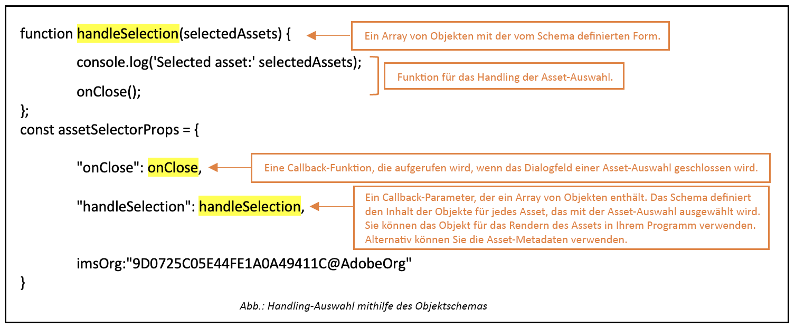

# Micro-Front-End-Asset-Selektor {#Overview}

| Version | Artikel-Link |
| -------- | ---------------------------- |
| AEM 6.5 | [Hier klicken](https://experienceleague.adobe.com/docs/experience-manager-65/assets/managing/asset-selector.html?lang=en) |
| AEM as a Cloud Service | Dieser Artikel |

Der Micro-Front-End-Asset-Selektor bietet eine Benutzeroberfläche, die sich problemlos in das [!DNL Experience Manager Assets as a Cloud Service]-Repository integrieren lässt, sodass Sie die im Repository verfügbaren digitalen Assets durchsuchen und für die Erstellung von Applikationen verwenden können.

Die Micro-Front-End-Benutzeroberfläche wird über das Asset-Selektor-Paket in Ihrer Applikation verfügbar gemacht. Alle Aktualisierungen des Pakets werden automatisch importiert, und der zuletzt bereitgestellte Asset-Selektor wird automatisch in Ihrer Applikation geladen.


Der Asset-Selektor bietet viele Vorteile, z. B.:

* Einfache Integration in Adobe- oder Nicht-Adobe-Applikationen unter Verwendung der Vanilla JavaScript-Bibliothek.
* Einfach zu verwalten, da Aktualisierungen des Assets-Wähler-Pakets automatisch für den Asset-Selektor bereitgestellt werden, der für Ihre Applikation verfügbar ist. Es sind keine Aktualisierungen innerhalb Ihrer Applikation erforderlich, um die neuesten Änderungen zu laden.
* Einfachere Anpassung, da Eigenschaften verfügbar sind, die die Anzeige des Asset-Selektors in Ihrer Applikation steuern.

* Volltextsuche, vordefinierte und benutzerdefinierte Filter, um schnell zu Assets zu navigieren, die für das Authoring-Erlebnis verwendet werden können.

* Möglichkeit, innerhalb einer IMS-Organisation zur Asset-Auswahl zwischen Repositorys zu wechseln.

* Möglichkeit, Assets nach Namen, Abmessungen und Größe zu sortieren und in der Listen-, Raster-, Galerie- oder Wasserfallansicht anzuzeigen.

In diesem Artikel soll gezeigt werden, wie der Asset-Selektor mit einer [!DNL Adobe]-Applikation unter Unified Shell verwendet werden kann oder wenn Sie bereits ein imsToken für die Authentifizierung generiert haben. Diese Workflows werden in diesem Artikel als Nicht-SUSI-Fluss bezeichnet.

Führen Sie die folgenden Aufgaben aus, um den Asset-Selektor in Ihr [!DNL Experience Manager Assets as a Cloud Service]-Repository zu integrieren und zu verwenden:

* [Asset-Selektor mit Vanilla JS integrieren](#integration-with-vanilla-js)
* [Anzeigeeigenschaften des Asset-Selektors definieren](#asset-selector-properties)
* [Verwenden des Asset-Selektors](#using-asset-selector)

## Asset-Selektor mit Vanilla JS integrieren {#integration-with-vanilla-js}

Sie können jede [!DNL Adobe] oder Nicht-Adobe-Applikation mit [!DNL Experience Manager Assets] als [!DNL Cloud Service]-Repository integrieren und Assets aus der Applikation heraus auswählen.

Die Integration erfolgt durch den Import des Asset-Selektor-Pakets und die Verbindung zu Assets as a Cloud Service unter Verwendung der Vanilla JavaScript-Bibliothek. Sie müssen eine `index.html` oder eine andere geeignete Datei innerhalb Ihrer Applikation bearbeiten, um:

* Authentifizierungsdetails zu definieren
* Zugriff auf das Assets as a Cloud Service-Repository zu erhalten
* Anzeigeeigenschaften des Asset-Selektors zu konfigurieren

<!--
Asset Selector supports authentication to the [!DNL Experience Manager Assets] as a [!DNL Cloud Service] repository using Identity Management System (IMS) properties such as `imsScope` or `imsClientID`. Authentication using these IMS properties is referred to as SUSI (Sign Up Sign In) flow in this article.

You can perform authentication without defining some of the IMS properties, such as `imsScope` or `imsClientID`, if:

*   You are integrating an [!DNL Adobe] application on [Unified Shell](https://experienceleague.adobe.com/docs/experience-manager-cloud-service/content/overview/aem-cloud-service-on-unified-shell.html?lang=en).
*   You already have an IMS token generated for authentication.

Accessing [!DNL Experience Manager Assets] as a [!DNL Cloud Service] repository without defining `imsScope` or `imsClientID` IMS properties is referred to as a non-SUSI flow in this article.
-->

Sie können eine Authentifizierung durchführen, ohne einige der IMS-Eigenschaften zu definieren, wenn:

* Sie eine [!DNL Adobe]-Applikation auf [Unified Shell](https://experienceleague.adobe.com/docs/experience-manager-cloud-service/content/overview/aem-cloud-service-on-unified-shell.html?lang=de) integrieren.
* Für die Authentifizierung wurde bereits ein IMS-Token generiert.

## Voraussetzungen {#prerequisites}

<!--
If your application requires user based authentication, out-of-the-box Asset Selector also supports a flow for authentication to the [!DNL Experience Manager Assets] as a [!DNL Cloud Service] repository using Identity Management System (IMS.)

You can use properties such as `imsScope` or `imsClientID` to retrieve `imsToken` automatically. You can use SUSI (Sign Up Sign In) flow and IMS properties. Also, you can obtain your own imsToken and pass it to Asset Selector by integrating within [!DNL Adobe] application on Unified Shell or if you already have an imsToken obtained via other methods (for example, using technical account). Accessing [!DNL Experience Manager Assets] as a [!DNL Cloud Service] repository without defining IMS properties (For example, `imsScope` and `imsClientID`) is referred to as a non-SUSI flow.
-->

Definieren Sie die Voraussetzungen in der `index.html`-Datei oder einer ähnlichen Datei innerhalb Ihrer Anwendungsimplementierung, um die Authentifizierungsdetails für den Zugriff auf das [!DNL Experience Manager Assets] als [!DNL Cloud Service]-Repository festzulegen. Zu den Voraussetzungen gehören:

* imsOrg
* imsToken
* apikey
<!--
The prerequisites vary if you are authenticating using a SUSI flow or a non-SUSI flow.

**Non-SUSI flow**

*   imsOrg
*   imsToken
*   apikey

For more information on these properties, see [Asset Selector Properties](#asset-selector-properties).

**SUSI flow**

*   imsClientId
*   imsScope
*   redirectUrl
*   imsOrg
*   apikey

For more information on these properties, see [Example for the SUSI flow](#susi-vanilla) and [Asset Selector Properties](#asset-selector-properties).
-->

## Installation {#installation}

Assets-Wähler sind sowohl über die ESM CDN-Version (z. B. [esm.sh](https://esm.sh/)/[skypack](https://www.skypack.dev/)) als auch über die [UMD](https://github.com/umdjs/umd)-Version verfügbar.

In Browsern mit **UMD-Version** (empfohlen):

```
<script src="https://experience.adobe.com/solutions/CQ-assets-selectors/static-assets/resources/assets-selectors.js"></script>

<script>
  const { renderAssetSelector } = PureJSSelectors;
</script>
```

In Browsern mit `import maps`-Unterstützung mit **ESM CDN-Version**:

```
<script type="module">
  import { AssetSelector } from 'https://experience.adobe.com/solutions/CQ-assets-selectors/static-assets/resources/@assets/selectors/index.js'
</script>
```

In der Deno/Webpack Module Federation mit **ESM CDN-Version**:

```
import { AssetSelector } from 'https://experience.adobe.com/solutions/CQ-assets-selectors/static-assets/resources/@assets/selectors/index.js'
```

### Ausgewählter Asset-Typ {#selected-asset-type}

Der ausgewählte Asset-Typ ist ein Array von Objekten, das die Asset-Informationen bei Verwendung der Funktionen `handleSelection`, `handleAssetSelection` und `onDrop` enthält.

**Schemasyntax**

```
interface SelectedAsset {
    'repo:id': string;
    'repo:name': string;
    'repo:path': string;
    'repo:size': number;
    'repo:createdBy': string;
    'repo:createDate': string;
    'repo:modifiedBy': string; 
    'repo:modifyDate': string; 
    'dc:format': string; 
    'tiff:imageWidth': number;
    'tiff:imageLength': number;
    'repo:state': string;
    computedMetadata: Record<string, any>;
    _links: {
        'http://ns.adobe.com/adobecloud/rel/rendition': Array<{
            href: string;
            type: string;
            'repo:size': number;
            width: number;
            height: number;
            [others: string]: any;
        }>;
    };
}
```

Die folgende Tabelle beschreibt einige der wichtigen Eigenschaften des ausgewählten Asset-Objekts.

| Eigenschaft | Typ | Erklärung |
|---|---|---|
| *repo:repositoryId* | Zeichenfolge | Eindeutige Kennung für das Repository, in dem das Asset gespeichert ist. |
| *repo:id* | Zeichenfolge | Eindeutige Kennung für das Asset. |
| *repo:assetClass* | Zeichenfolge | Die Klassifizierung des Assets (z. B. Bild oder Video, Dokument). |
| *repo:name* | Zeichenfolge | Der Name des Assets, einschließlich der Dateierweiterung. |
| *repo:size* | Number (Zahl) | Die Größe des Assets in Bytes. |
| *repo:path* | Zeichenfolge | Der Speicherort des Assets im Repository. |
| *repo:ancestors* | `Array<string>` | Ein Array von Vorgängerelementen für das Asset im Repository. |
| *repo:state* | Zeichenfolge | Aktueller Status des Assets im Repository (z. B. aktiv, gelöscht). |
| *repo:createdBy* | Zeichenfolge | Die Person oder das System, welches das Asset erstellt hat. |
| *repo:createDate* | Zeichenfolge | Datum und Uhrzeit der Erstellung des Assets. |
| *repo:modifiedBy* | Zeichenfolge | Die Person oder das System, welches das Asset zuletzt geändert hat. |
| *repo:modifyDate* | Zeichenfolge | Datum und Uhrzeit der letzten Änderung des Assets. |
| *dc:format* | Zeichenfolge | Das Format des Assets, z. B. der Dateityp (z. B. JPEG, PNG usw.). |
| *tiff:imageWidth* | Number (Zahl) | Die Breite eines Assets. |
| *tiff:imageLength* | Number (Zahl) | Die Höhe eines Assets. |
| *computedMetadata* | `Record<string, any>` | Ein Objekt, das einen Behälter für alle Metadaten des Assets aller Art (Repository, Applikation oder eingebettete Metadaten) darstellt. |
| *_links* | `Record<string, any>` | Hypermedia-Links für das verknüpfte Asset. Enthält Links für Ressourcen wie Metadaten und Ausgabedarstellungen. |
| *_links.http://ns.adobe.com/adobecloud/rel/rendition* | `Array<Object>` | Array von Objekten, das Informationen zu Ausgabedarstellungen des Assets enthält. |
| *_links.http://ns.adobe.com/adobecloud/rel/rendition[].href* | Zeichenfolge | Der URI zur Ausgabedarstellung. |
| *_links.http://ns.adobe.com/adobecloud/rel/rendition[].type* | Zeichenfolge | Der MIME-Typ der Ausgabedarstellung. |
| *_links.http://ns.adobe.com/adobecloud/rel/rendition[].‚repo:size&#39;* | Number (Zahl) | Die Größe der Ausgabedarstellung in Byte. |
| *_links.http://ns.adobe.com/adobecloud/rel/rendition[].width* | Number (Zahl) | Die Breite der Ausgabedarstellung. |
| *_links.http://ns.adobe.com/adobecloud/rel/rendition[].height* | Number (Zahl) | Die Höhe der Ausgabedarstellung. |

Eine vollständige Liste der Eigenschaften und ein ausführliches Beispiel finden Sie unter [Asset-Wähler-Code-Beispiel](https://github.com/adobe/aem-assets-selectors-mfe-examples).

<!--
### ImsAuthProps {#ims-auth-props}

The `ImsAuthProps` properties define the authentication information and flow that the Asset Selector uses to obtain an `imsToken`. By setting these properties, you can control how the authentication flow should behave and register listeners for various authentication events.

| Property Name | Description|
|---|---|
| `imsClientId`| A string value representing the IMS client ID used for authentication purposes. This value is provided by Adobe and is specific to your Adobe AEM CS organization.|
| `imsScope`| Describes the scopes used in authentication. The scopes determine the level of access that the application has to your organization resources. Multiple scopes can be separated by commas.|
| `redirectUrl` | Represents the URL where the user is redirected after authentication. This value is typically set to the current URL of the application. If a `redirectUrl` is not supplied, `ImsAuthService` will use the redirectUrl used to register the `imsClientId`|
| `modalMode`| A boolean indicating whether the authentication flow should be displayed in a modal (pop-up) or not. If set to `true`, the authentication flow is displayed in a pop-up. If set to `false`, the authentication flow is displayed in a full page reload. _Note:_ for better UX, you can dynamically control this value if the user has browser pop-up disabled. |
| `onImsServiceInitialized`| A callback function that is called when the Adobe IMS authentication service is initialized. This function takes one parameter, `service`, which is an object representing the Adobe IMS service. See [`ImsAuthService`](#imsauthservice-ims-auth-service) for more details.|
| `onAccessTokenReceived`| A callback function that is called when an `imsToken` is received from the Adobe IMS authentication service. This function takes one parameter, `imsToken`, which is a string representing the access token. |
| `onAccessTokenExpired`| A callback function that is called when an access token has expired. This function is typically used to trigger a new authentication flow to obtain a new access token. |
| `onErrorReceived`| A callback function that is called when an error occurs during authentication. This function takes two parameters: the error type and error message. The error type is a string representing the type of error and the error message is a string representing the error message. |

### ImsAuthService {#ims-auth-service}

`ImsAuthService` class handles the authentication flow for the Asset Selector. It is responsible for obtaining an `imsToken` from the Adobe IMS authentication service. The `imsToken` is used to authenticate the user and authorize access to the Adobe Experience Manager (AEM) CS Assets repository. ImsAuthService uses the `ImsAuthProps` properties to control the authentication flow and register listeners for various authentication events. You can use the convenient [`registerAssetsSelectorsAuthService`](#purejsselectorsregisterassetsselectorsauthservice) function to register the _ImsAuthService_ instance with the Asset Selector. The following functions are available on the `ImsAuthService` class. However, if you are using the _registerAssetsSelectorsAuthService_ function, you do not need to call these functions directly.

| Function Name | Description |
|---|---|
| `isSignedInUser` | Determines whether the user is currently signed in to the service and returns a boolean value accordingly.|
| `getImsToken`    | Retrieves the authentication `imsToken` for the currently signed-in user, which can be used to authenticate requests to other services such as generating asset _rendition.|
| `signIn`| Initiates the sign-in process for the user. This function uses the `ImsAuthProps` to show authentication in either a pop-up or a full page reload |
| `signOut`| Signs the user out of the service, invalidating their authentication token and requiring them to sign in again to access protected resources. Invoking this function will reload the current page.|
| `refreshToken`| Refreshes the authentication token for the currently signed-in user, preventing it from expiring and ensuring uninterrupted access to protected resources. Returns a new authentication token that can be used for subsequent requests. |
-->

### Beispiel für Nicht-SUSI-Fluss {#non-susi-vanilla}

Dieses Beispiel zeigt, wie der Asset-Wähler mit einem Nicht-SUSI-Fluss verwendet wird, wenn eine [!DNL Adobe]-Applikation unter Unified Shell läuft oder wenn Sie bereits `imsToken` für die Authentifizierung generiert haben.

Fügen Sie das Asset-Wähler-Paket mit dem `script`-Tag in Ihren Code ein, wie in _Zeilen 6 bis 15_ des folgenden Beispiels zu sehen. Sobald das Skript geladen ist, kann die globale Variable `PureJSSelectors` verwendet werden. Definieren Sie die [Eigenschaften](#asset-selector-properties) des Asset-Wählers wie in _Zeilen 16 bis 23_ zu sehen. Die Eigenschaften `imsOrg` und `imsToken` sind beide für die Authentifizierung im Nicht-SUSI-Fluss erforderlich. Die `handleSelection`-Eigenschaft wird verwendet, um die ausgewählten Assets zu behandeln. Um den Asset-Wähler zu rendern, rufen Sie die `renderAssetSelector`-Funktion wie in _Zeile 17_ erwähnt auf. Der Asset-Wähler wird im Container-Element `<div>` angezeigt, wie in _Zeilen 21 und 22_ zu sehen.

Wenn Sie diese Schritte befolgen, können Sie den Asset-Wähler mit einem Nicht-SUSI-Fluss in Ihrer [!DNL Adobe]-Applikation verwenden.

```html {line-numbers="true"}
<!DOCTYPE html>
<html>
<head>
    <title>Asset Selector</title>
    <script src="https://experience.adobe.com/solutions/CQ-assets-selectors/assets/resources/assets-selectors.js"></script>
    <script>
        // get the container element in which we want to render the AssetSelector component
        const container = document.getElementById('asset-selector-container');
        // imsOrg and imsToken are required for authentication in non-SUSI flow
        const assetSelectorProps = {
            imsOrg: 'example-ims@AdobeOrg',
            imsToken: "example-imsToken",
            apiKey: "example-apiKey-associated-with-imsOrg",
            handleSelection: (assets: SelectedAssetType[]) => {},
        };
        // Call the `renderAssetSelector` available in PureJSSelectors globals to render AssetSelector
        PureJSSelectors.renderAssetSelector(container, assetSelectorProps);
    </script>
</head>

<body>
    <div id="asset-selector-container" style="height: calc(100vh - 80px); width: calc(100vw - 60px); margin: -20px;">
    </div>
</body>

</html>
```

Ein ausführliches Beispiel finden Sie unter [Asset-Wähler-Code-Beispiel](https://github.com/adobe/aem-assets-selectors-mfe-examples).

<!--
### Example for the SUSI flow {#susi-vanilla}

Use this example `index.html` file for authentication if you are integrating your application using SUSI flow.

Access the Asset Selector package using the `Script` Tag, as shown in *line 9* to *line 11* of the example `index.html` file.

*Line 14* to *line 38* of the example describes the IMS flow properties, such as `imsClientId`, `imsScope`, and `redirectURL`. The function requires that you define at least one of the `imsClientId` and `imsScope` properties. If you do not define a value for `redirectURL`, the registered redirect URL for the client ID is used.

As you do not have an `imsToken` generated, use the `registerAssetsSelectorsAuthService` and `renderAssetSelectorWithAuthFlow` functions, as shown in line 40 to line 50 of the example `index.html` file. Use the `registerAssetsSelectorsAuthService` function before `renderAssetSelectorWithAuthFlow` to register the `imsToken` with the Asset Selector. [!DNL Adobe] recommends to call `registerAssetsSelectorsAuthService` when you instantiate the component.

Define the authentication and other Assets as a Cloud Service access-related properties in the `const props` section, as shown in *line 54* to *line 60* of the example `index.html` file.

The `PureJSSelectors` global variable, mentioned in *line 65*, is used to render the Asset Selector in the web browser.

Asset Selector is rendered on the `<div>` container element, as mentioned in *line 74* to *line 81*. The example uses a dialog to display the Asset Selector.

```html {line-numbers="true"}
<!DOCTYPE html>
<html>

<head>
    <meta http-equiv="X-UA-Compatible" content="IE=edge">
    <meta charset="utf-8">
    <title>Asset Selectors</title>
    <link rel="stylesheet" href="index.css">
    <script id="asset-selector"
        src="https://experience.adobe.com/solutions/CQ-assets-selectors/assets/resources/asset-selectors.js"></script>
    <script>

        const imsProps = {
            imsClientId: "<obtained from IMS team>",
            imsScope: "openid, <other scopes>",
            redirectUrl: window.location.href,
            modalMode: true, // false to open in a full page reload flow
            onImsServiceInitialized: (service) => {
                // invoked when the ims service is initialized and is ready
                console.log("onImsServiceInitialized", service);
            },
            onAccessTokenReceived: (token) => {
                console.log("onAccessTokenReceived", token);
            },
            onAccessTokenExpired: () => {
                console.log("onAccessTokenError");
                // re-trigger sign-in flow
            },
            onErrorReceived: (type, msg) => {
                console.log("onErrorReceived", type, msg);
            },
        }

        function load() {
            const registeredTokenService = PureJSSelectors.registerAssetsSelectorsAuthService(imsProps);
            imsInstance = registeredTokenService;
        };

        // initialize the IMS flow before attempting to render the asset selector
        load();
        

        //function that will render the asset selector
            const otherProps = {
            // any other props supported by asset selector
            }
            const assetSelectorProps = {
                "imsOrg": "imsorg",
                ...otherProps
            }
             // container element on which you want to render the AssetSelector/DestinationSelector component
            const container = document.getElementById('asset-selector');

            /// Use the PureJSSelectors in globals to render the AssetSelector/DestinationSelector component
            PureJSSelectors.renderAssetSelectorWithAuthFlow(container, assetSelectorProps, () => {
                const assetSelectorDialog = document.getElementById('asset-selector-dialog');
                assetSelectorDialog.showModal();
            });
        }
    </script>

</head>
<body class="asset-selectors">
    <div>
        <button onclick="renderAssetSelectorWithAuthFlowFlow()">Asset Selector - Select Assets with Ims Flow</button>
    </div>
        <dialog id="asset-selector-dialog">
            <div id="asset-selector" style="height: calc(100vh - 80px); width: calc(100vw - 60px); margin: -20px;">
            </div>
        </dialog>
    </div>
</body>

</html>

```
-->

## Verwenden von Asset-Wähler-Eigenschaften {#asset-selector-properties}

Sie können die Asset-Wähler-Eigenschaften verwenden, um die Darstellung des Asset-Wählers anzupassen. In der folgenden Tabelle sind die Eigenschaften aufgeführt, mit denen Sie den Asset-Wähler anpassen und verwenden können.

| Eigenschaft | Typ | Erforderlich | Standard | Beschreibung |
|---|---|---|---|---|
| *Leiste* | Boolesch | Nein | Falsch | Wenn als `true` markiert, wird der Asset-Wähler in der linken Leistenansicht gerendert. Wenn als `false` markiert, wird der Asset-Wähler in der modalen Ansicht gerendert. |
| *imsOrg* | Zeichenfolge | Ja | | Die Adobe Identity Management System (IMS)-ID, die bei der Bereitstellung von [!DNL Adobe Experience Manager] als [!DNL Cloud Service] für Ihre Organisation zugewiesen wird. Der `imsOrg`-Schlüssel ist erforderlich, damit authentifiziert wird, ob sich die Organisation, auf die Sie zugreifen, unter Adobe IMS befindet oder nicht. |
| *imsToken* | Zeichenfolge | Nein | | Für die Authentifizierung verwendeter IMS-Bearer-Token. `imsToken` ist erforderlich, wenn Sie den Nicht-SUSI-Fluss verwenden. |
| *apiKey* | Zeichenfolge | Nein | | API-Schlüssel, der für den Zugriff auf den AEM Discovery-Dienst verwendet wird. `apiKey` ist erforderlich, wenn Sie den Nicht-SUSI-Fluss verwenden. |
| *rootPath* | Zeichenfolge | Nein | /content/dam/ | Ordnerpfad, aus dem der Asset-Wähler Ihre Assets anzeigt. `rootPath` kann auch in Form einer Verkapselung verwendet werden. Bei dem folgenden Pfad `/content/dam/marketing/subfolder/` können Sie mit dem Asset-Wähler beispielsweise nicht durch übergeordnete Ordner navigieren, sondern nur die untergeordneten Ordner anzeigen. |
| *path* | Zeichenfolge | Nein | | Pfad, der zum Navigieren zu einem bestimmten Asset-Verzeichnis verwendet wird, wenn der Asset-Wähler gerendert wird. |
| *filterSchema* | Array | Nein | | Modell, das zum Konfigurieren von Filtereigenschaften verwendet wird. Dies ist nützlich, wenn Sie bestimmte Filteroptionen des Asset-Wählers einschränken möchten. |
| *filterFormProps* | Objekt | Nein | | Geben Sie die Filtereigenschaften an, die Sie zur Verfeinerung Ihrer Suche verwenden müssen. Beispielsweise MIME-Typ, JPG, PNG, GIF. |
| *selectedAssets* | Array `<Object>` | Nein |                 | Geben Sie ausgewählte Assets an, wenn der Asset-Wähler gerendert wird. Es ist ein Array von Objekten erforderlich, das eine ID-Eigenschaft der Assets enthält. Zum Beispiel: `[{id: 'urn:234}, {id: 'urn:555'}]` Ein Asset muss im aktuellen Verzeichnis verfügbar sein. Wenn Sie ein anderes Verzeichnis verwenden müssen, geben Sie auch einen Wert für die Eigenschaft `path` an. |
| *acvConfig* | Objekt | Nein | | Asset Collection View-Eigenschaft, die ein Objekt enthält, das eine benutzerdefinierte Konfiguration enthält, um Standardwerte zu überschreiben. |
| *i18nSymbols* | `Object<{ id?: string, defaultMessage?: string, description?: string}>` | Nein |                 | Wenn die OOTB-Übersetzungen für die Bedürfnisse Ihrer Applikation unzureichend sind, können Sie eine Schnittstelle bereitstellen, über die Sie Ihre eigenen lokalisierten Werte durch die `i18nSymbols`-Eigenschaft übergeben können. Wenn Sie über diese Schnittstelle einen Wert übergeben, werden die bereitgestellten Standardübersetzungen überschrieben und stattdessen Ihre eigenen verwendet. Um die Überschreibung vorzunehmen, müssen Sie ein gültiges [Message Descriptor](https://formatjs.io/docs/react-intl/api/#message-descriptor)-Objekt an den Schlüssel von `i18nSymbols` übergeben, den Sie überschreiben möchten. |
| *intl* | Objekt | Nein | | Der Asset-Wähler bietet standardmäßige OOTB-Übersetzungen. Sie können die Übersetzungssprache auswählen, indem Sie eine gültige Gebietsschema-Zeichenfolge durch die `intl.locale`-Eigenschaft bereitstellen. Zum Beispiel: `intl={{ locale: "es-es" }}` </br></br> Die unterstützten Gebietsschema-Zeichenfolgen folgen den [ISO 639 – Codes](https://www.iso.org/iso-639-language-codes.html) für die Darstellung von Namen von Sprachen. </br></br> Liste der unterstützten Gebietsschemata: Englisch: „en-us“ (Standard), Spanisch: „es-es“, Deutsch: „de-de“, Französisch: „fr-fr“, Italienisch: „it-it“, Japanisch: „ja-jp“, Koreanisch: „ko-kr“, Portugiesisch: „pt-br“, Chinesisch (Vereinfacht): „zh-cn“, Chinesisch (Taiwan): „zh-tw“ |
| *repositoryId* | Zeichenfolge | Nein | &#39;&#39; | Repository, aus dem der Asset-Wähler den Inhalt lädt. |
| *additionalAemSolutions* | `Array<string>` | Nein | [ ] | Damit können Sie eine Liste mit zusätzlichen AEM-Repositorys hinzufügen. Wenn in dieser Eigenschaft keine Informationen bereitgestellt werden, werden nur die Medienbibliothek oder AEM Assets-Repositorys berücksichtigt. |
| *hideTreeNav* | Boolesch | Nein |  | Gibt an, ob die Navigationsseitenleiste der Asset-Baumstruktur ein- oder ausgeblendet werden soll. Sie wird nur in der modalen Ansicht verwendet und daher gibt es keine Auswirkung dieser Eigenschaft in der Leistenansicht. |
| *onDrop* | Funktion | Nein | | Die Eigenschaft ermöglicht die Ablagefunktion eines Assets. |
| *dropOptions* | `{allowList?: Object}` | Nein | | Konfiguriert Ablagefunktionen mithilfe der „Zulassungsliste“. |
| *colorScheme* | Zeichenfolge | Nein | | Design konfigurieren (`light` oder `dark`) für den Asset-Wähler. |
| *handleSelection* | Funktion | Nein | | Wird mit einem Array von Asset-Elementen aufgerufen, wenn Assets ausgewählt sind und die Schaltfläche `Select` im Modal angeklickt wird. Diese Funktion wird nur in der modalen Ansicht aufgerufen. Verwenden Sie für die Leistenansicht die Funktionen `handleAssetSelection` oder `onDrop`. Beispiel: <pre>handleSelection=(assets: Asset[])==> {...}</pre> Siehe [Ausgewählter Asset-Typ](#selected-asset-type) für Details. |
| *handleAssetSelection* | Funktion | Nein | | Wird mit einem Array von Elementen aufgerufen, während die Assets ausgewählt oder deren Auswahl aufgehoben wird. Dies ist nützlich, wenn Sie auf Assets warten möchten, während die Benutzenden sie auswählen. Beispiel: <pre>handleSelection=(assets: Asset[])==> {...}</pre> Siehe [Ausgewählter Asset-Typ](#selected-asset-type) für Details. |
| *onClose* | Funktion | Nein | | Wird aufgerufen, wenn die `Close`-Schaltfläche in der modalen Ansicht gedrückt wird. Dies wird nur in der `modal`-Ansicht aufgerufen und in der `rail`-Ansicht nicht beachtet. |
| *onFilterSubmit* | Funktion | Nein | | Wird mit Filterelementen aufgerufen, wenn Benutzende andere Filterkriterien ändern. |
| *selectionType* | Zeichenfolge | Nein | Einzelperson | Konfiguration für `single`- oder `multiple`-Auswahl von Assets auf einmal. |

## Beispiele zur Verwendung der Asset-Selektor-Eigenschaften {#usage-examples}

Sie können die Asset-Selektor-[Eigenschaften](#asset-selector-properties) in der Datei `index.html` definieren, um die Anzeige des Asset-Selektors in Ihrer Applikation anzupassen.

### Beispiel 1: Asset-Selektor in der Leistenansicht


Wenn der Wert des Asset-Selector `rail` auf `false` oder in den Eigenschaften nicht erwähnt wird, wird der Asset-Selector standardmäßig in der Modal-Ansicht angezeigt.

<!--
### Example 2: Use selectedAssets property in addition to the path property

Use the `path` property to define the folder name that displays automatically when the Asset Selector is rendered. In addition, use the `selectedAssets` property to define the IDs for the assets that you need to select within the folder. Moreover, when you want to display assets that are pre-defined within the folder, you can use selectedAssets property.

   
-->

### Beispiel 2: Metadaten-Popover

Verwenden Sie verschiedene Eigenschaften, um Metadaten eines Assets zu definieren, das Sie mit einem Informationssymbol anzeigen möchten. Das Info-Popover bietet die Sammlung von Informationen über das Asset oder den Ordner, einschließlich Titel, Abmessungen, Änderungsdatum, Speicherort und Beschreibung eines Assets. Im folgenden Beispiel werden verschiedene Eigenschaften verwendet, um Metadaten eines Assets anzuzeigen, z. B. gibt die Eigenschaft `repo:path` den Speicherort eines Assets an. <!--`repo` represents the repository from where the asset is showing, whereas, `path` represents the route from where the asset or folder is rendered.-->


### Beispiel 3: Benutzerdefinierte Filtereigenschaft in der Leistenansicht

Zusätzlich zur Facettensuche können Sie mit dem Asset-Selektor verschiedene Attribute anpassen, um Ihre Suche von [!DNL Adobe Experience Manager] als eine [!DNL Cloud Service]-Anwendung zu verfeinern. Sie müssen den folgenden Code hinzufügen, um benutzerdefinierte Suchfilter zu Ihrer Applikation hinzuzufügen. Im folgenden Beispiel ist die `Type Filter`-Suche, die den Asset-Typ nach Bildern, Dokumenten oder Videos filtert, oder der Filtertyp, den Sie für die Suche hinzugefügt haben.


<!--

## Customization after integrating Asset Selector 

### Custom metadata

Assets display panel shows the out of the box metadata that can be displayed in the info of the asset. In addition to this, [!DNL Adobe Experience Manager] as a [!DNL Cloud Service] application allows configuration of the asset selector by adding custom metadata that is shown in info panel of the asset.
-->

<!-- Property details to be added here. Referred the ticket https://jira.corp.adobe.com/browse/ASSETS-19023-->

<!--
## Asset Selector Object Schema {#object-schema}

Schema describes the object properties associated with an asset selected using Asset Selector. It uses the combination of data types and their values to validate the object describing the selected Asset using an Asset Selector.

**Schema Syntax**
````
interface SelectedAsset {
    'repo:id': string;
    'repo:name': string;
    'repo:path': string;
    'repo:size': number;
    'repo:createdBy': string;
    'repo:createDate': string;
    'repo:modifiedBy': string; 
    'repo:modifyDate': string; 
    'dc:format': string; 
    'tiff:imageWidth': number;
    'tiff:imageLength': number;
    'repo:state': string;
    computedMetadata: Record<string, any>;
    _links: {
        'http://ns.adobe.com/adobecloud/rel/rendition': Array<{
            href: string;
            type: string;
            'repo:size': number;
            width: number;
            height: number;
            [others: string]: any;
        }>;
    };
}
````

**Query Parameters**

| Parameter | Type | Description |
|---|---|---|
| repo:id | string | ID of an Asset |
| repo:name | string | The name of an Asset |
| repo:path | string | The path of an Asset |
| repo:size | number | Size of an Asset (in bytes) |
| repo:createdBy | string | ID of a user who created an Asset |
| repo: createdDate | string | The timestamp when an asset was created |
| repo:modifiedBy | string | ID of a user who modified the asset recently |
| repo:modifyDate | string | The timestamp when the asset was last modified |
| dc:format | string | MIME type of an Asset |
| tiff:imageWidth | number | The width of an image type of Asset |
| tiff:imageLength | number | The height of an image type of Asset |
| repo:state | string | The `Approved`, `Rejected`, or `Expired`state of an Asset |
| computedMetadata | string | It is an object that represents a bucket for all the Asset's metadata of all kinds (repository, application or embedded metadata) |
| _links | string | It represents the collection of links used in the Asset Selector. The links are represented in the form of an array. The parameters of an array include: `href`, `type`, `repo:size`, `width`, `height`, and so on  |

For the detailed example of Object Schema, click 
-->

## Umgang mit der Auswahl von Assets mithilfe des Objektschemas {#handling-selection}

Die `handleSelection`-Eigenschaft wird verwendet, um einzelne oder mehrere Auswahlen von Assets in dem Asset-Selektor zu verarbeiten. Das folgende Beispiel zeigt die Syntax der Verwendung von `handleSelection`.



## Verwenden des Asset-Selektors {#using-asset-selector}

Sobald der Asset-Selektor eingerichtet ist und Sie für die Verwendung mit Ihrem [!DNL Adobe Experience Manager] als [!DNL Cloud Service]-Applikation authentifiziert sind, können Sie Assets auswählen oder verschiedene andere Vorgänge durchführen, um Ihre Assets im Repository zu suchen.


* **A**: [Bedienfeld aus-/einblenden](#hide-show-panel)
* **B**: [Repository-Umschalter](#repository-switcher)
* **C**: [Assets](#repository)
* **D**: [Filter](#filters)
* **E**: [Suchleiste](#search-bar)
* **F**: [Sortierung](#sorting)
* **G**: [Sortierung nach auf- oder absteigender Reihenfolge](#sorting)
* **H**: [Ansicht](#types-of-view)

### Bedienfeld aus-/einblenden {#hide-show-panel}

Um Ordner im linken Navigationsbereich auszublenden, klicken Sie auf das Symbol **[!UICONTROL Ordner ausblenden]**. Um die Änderungen rückgängig zu machen, klicken Sie erneut auf das Symbol **[!UICONTROL Ordner ausblenden]**.

### Repository-Umschalter {#repository-switcher}

Mit dem Asset-Selektor können Sie auch Repositorys für die Asset-Auswahl wechseln. Sie können das gewünschte Repository aus der Dropdown-Liste im linken Bedienfeld auswählen. Die in der Dropdown-Liste verfügbaren Repository-Optionen basieren auf der `repositoryId`-Eigenschaft, die in der `index.html`-Datei definiert ist. Sie basiert auf den Umgebungen der ausgewählten IMS-Organisation, auf die die angemeldeten Benutzenden zugreifen können. Nutzerinnen und Nutzer können eine bevorzugte `repositoryID` übergeben. In diesem Fall stoppt der Asset-Selektor das Rendern des Repository-Umschalters und rendert Assets nur aus dem angegebenen Repository.
<!--
It is based on the `imsOrg` that is provided in the application. If you want to see the list of repositories, then `repositoryId` is required to view those specific repositories in your application.
-->

### Assets-Repository

Es handelt sich um eine Sammlung von Asset-Ordnern, mit denen Sie Vorgänge durchführen können.

### Vorkonfigurierte Filter {#filters}

Der Asset-Selektor bietet außerdem vordefinierte Filteroptionen, mit denen Sie Ihre Suchergebnisse verfeinern können. Die folgenden Filter sind verfügbar:

* `File type`: umfasst Ordner, Dateien, Bilder, Dokumente oder Videos
* `MIME type`: umfasst JPG, GIF, PPTX, PNG, MP4, DOCX, TIFF, PDF, XLSX
* `Image Size`: umfasst minimale/maximale Breite, minimale/maximale Höhe des Bildes

  

### Benutzerdefinierte Suche

Neben der Volltextsuche ermöglicht der Asset-Selektor die Suche nach Assets innerhalb von Dateien mithilfe einer benutzerdefinierten Suche. Sie können benutzerdefinierte Suchfilter sowohl im Modal- als auch im Leistenansichtsmodus verwenden.


Sie können auch einen Standardsuchfilter erstellen, um die häufig gesuchten Felder zu speichern und sie später zu verwenden. Um eine benutzerdefinierte Suche für Ihre Assets zu erstellen, können Sie die `filterSchema`-Eigenschaft verwenden.

### Suchleiste {#search-bar}

Mit dem Asset-Selektor können Sie eine Volltextsuche nach Assets im ausgewählten Repository durchführen. Wenn Sie zum Beispiel den Suchbegriff `wave` in die Suchleiste eingeben, werden alle Assets angezeigt, die den Suchbegriff `wave` in einer der Metadateneigenschaften enthalten.

### Sortierung {#sorting}

Sie können Assets im Asset-Selektor nach Namen, Abmessungen oder Größe eines Assets sortieren. Sie können die Assets auch in auf- oder absteigender Reihenfolge sortieren.

### Ansichtstypen {#types-of-view}

Mit dem Asset-Selektor können Sie das Asset in vier verschiedenen Ansichten anzeigen:

* ** [!UICONTROL Listenansicht]**: Die Listenansicht zeigt scrollbare Dateien und Ordner in einer Spalte an.
* ** [!UICONTROL Rasteransicht]**: Die Rasteransicht zeigt scrollbare Dateien und Ordner in einem Raster aus Zeilen und Spalten an.
* ** [!UICONTROL Galerieansicht]**: Die Galerie-Ansicht zeigt Dateien oder Ordner in einer zentrierten horizontalen Liste an.
* ** [!UICONTROL Wasserfallansicht]**: Die Wasserfallansicht zeigt Dateien oder Ordner in Form einer Brücke an.

<!--
### Modes to view Asset Selector

Asset Selector supports two types of out of the box views:

**  Modal view or Inline view:** The modal view or inline view is the default view of Asset Selector that represents Assets folders in the front area. The modal view allows users to view assets in a full screen to ease the selection of multiple assets for import. Use `<AssetSelector rail={false}>` to enable modal view.

    

**  Rail view:** The rail view represents Assets folders in a left panel. The drag and drop of assets can be performed in this view. Use `<AssetSelector rail={true}>` to enable rail view.

    
-->
<!--

### Application Integration

Asset Selector is flexible and can be integrated within your existing [!DNL Adobe Experience Manager] as a [!DNL Cloud Service] application. It is accessible and localized to add, search, and select assets in your application. With Asset Selector you can:
*   **Configure** You can configure the files/folders that you want to show at the upfront. The assets that are chosen to view can be of any supported formats, for example, JPEG. It lets you control the display of various text or symbols as per your choice.
*   **Perfect fit** Asset selector easily fits in your existing [!DNL Adobe Experience Manager] as a [!DNL Cloud Service] application and choose the way you want to view. The mode of view can be inline, rail, or modal view.
*   **Accessible** With Asset Selector, you can reach the desired asset in an easy manner.
*   **Localize** Assets can be availed for the various locales available as per Adobe's localization standards.
-->
<!--

### Support for multiple instances

The micro front-end design supports the display of multiple instances of Asset Selector on a single screen.


-->

<!--

### Controlled selection with multi-select

You can make default multi-selection of assets by specifying the assets to the component using `selectedAssets` property. You should specify an array of asset IDs. For example, `[{id: 'urn:234}, {id: 'urn:555'}].`
-->
<!--

### Action buttons

When you customize your application with Asset Selector based on ReactJS, you are provided with the following action buttons to perform various actions:
*   **Open in media library** Lets you open the asset in media library.
*   **Upload** Lets you upload an asset directly.
*   **Download** Downloads the asset in [!DNL Adobe Experience Manager] as a [!DNL Cloud Service].
-->
<!--

### Status of an asset

Asset Selector lets you know the status of your uploaded assets. The status can be `Approved`, `Rejected`, or `Expired` of the asset. 
-->
<!--

### Localization

The integration of Asset Selector with [!DNL Adobe Experience Manager] as a [!DNL Cloud Service] allows localized content appear in your application.
-->
