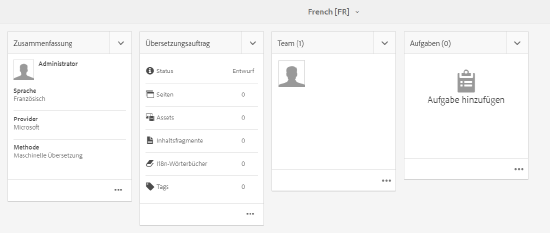

# Asset-Insights{#asset-insights}

<!-- TBD: Add uicontrol tags  -->

Mit der Funktion „Asset Insights“ können Sie Benutzerbewertungen und Nutzungsstatistiken von Bildern nachverfolgen, die auf Drittanbieter-Websites, in Marketingkampagnen und den Kreativlösungen von Adobe verwendet werden. Sie hilft, Erkenntnisse über ihre Leistung und Beliebtheit abzuleiten.

Assets Insights hält Details zu Benutzeraktivitäten wie Anzahl der Bildbewertungen, Klickraten und Impressionen (Häufigkeit des Ladens eines Bildes auf einer Website) fest. Er weist Bildern anhand dieser Statistiken Punktzahlen zu. Sie können die Bewertungen und Leistungsstatistiken verwenden, um beliebte Bilder zur Aufnahme in Kataloge, Marketing-Kampagnen usw. auszuwählen. Sie können außerdem Richtlinien zu Archivierungen und Lizenzerneuerungen anhand dieser Statistiken formulieren.

Damit Assets Insights Nutzungsstatistiken für Bilder von einer Website festhalten kann, müssen Sie den eingebetteten Code für das Bild im Website-Code einfügen.

Damit Asset Insights Nutzungsstatistiken für Assets anzeigen kann, konfigurieren Sie zunächst die Funktion für den Abruf von Berichtsdaten aus Adobe Analytics. Weitere Details finden Sie unter [Asset Insights konfigurieren](#configure-asset-insights).

>[!NOTE]
>
>Einblicke werden nur für Bilder unterstützt und bereitgestellt.

## View statistics for an image {#viewing-statistics-for-an-image}

Sie können die Asset Insights-Bewertungen über die Metadatenseite anzeigen.

1. From the Assets user interface (UI), select the image and then tap **[!UICONTROL Properties]** from the toolbar.
1. Tippen Sie auf der Seite Eigenschaften auf **[!UICONTROL Einblicke]**.
1. Überprüfen Sie die Nutzungsdetails für das Asset auf der Registerkarte **[!UICONTROL Statistiken]**. The **[!UICONTROL Score]** section describes the total asset usage and performance sores of an asset .

   Die Nutzungsbewertung beschreibt, wie oft ein Asset in verschiedenen Lösungen verwendet wird.

   Die Bewertung **[!UICONTROL Impressionen]** beschreibt, wie oft das Asset auf der Website geladen wurde. Die unter **[!UICONTROL Klicks]** angezeigte Zahl beschreibt, wie oft Benutzer auf das Asset geklickt haben.

1. Review the **[!UICONTROL Usage Statistics]** section to know which entities the asset was part of and which creative solutions recently used it. Je höher die Nutzung, desto größer ist die Wahrscheinlichkeit, dass das Asset bei Benutzern beliebt ist. Nutzungsdaten werden unter den folgenden Überschriften angezeigt:

   * **Asset**: Wie oft war das Asset Teil einer Sammlung oder eines zusammengesetzten Assets
   * **Web und Mobil**: Wie oft das Asset Teil von Websites und Apps war
   * **Sozial**: Wie oft wurde das Asset in Lösungen wie Adobe Social und Adobe Campaign verwendet
   * **E-Mail**: Wie oft wurde das Asset in E-Mail-Kampagnen verwendet
   

   >[!NOTE]
   >
   >Da die Asset Insights-Funktion in der Regel die Lösungsdaten regelmäßig aus Adobe Analytics abruft, werden im Abschnitt &quot;Lösungen&quot;möglicherweise nicht die aktuellsten Daten angezeigt. Der Zeitraum, für den die Daten angezeigt werden, hängt vom Zeitplan des Abholvorgangs ab, mit dem Asset Insights ausgeführt wird, um Daten aus Analytics abzurufen.

1. Um Leistungsstatistiken für das Asset für einen bestimmten Zeitraum grafisch anzuzeigen, wählen Sie den gewünschten Zeitraum im Abschnitt **[!UICONTROL Leistungsstatistiken]** aus. Details, einschließlich Klicks und Impressionen, werden als Trendlinien eines Diagramms angezeigt.

   

   >[!NOTE]
   >
   >Im Gegensatz zu den Daten im Abschnitt „Lösungen“ zeigt der Abschnitt „Leistungsstatistiken“ die neuesten Daten an.

1. To obtain the embed code for the asset that you include in websites to gets performance data, tap/click **[!UICONTROL Get Embed Code]** below the asset thumbnail. <!-- For more information on how to include your Embed code in third-party web pages, see [Using Page Tracker and Embed code in web pages](/help/assets/use-page-tracker.md). -->

   

## View aggregate statistics for images {#viewing-aggregate-statistics-for-images}

Sie können mit der **[!UICONTROL Insight-Ansicht]** Bewertungen aller Assets gleichzeitig in einem Ordner anzeigen.

1. Navigieren Sie in der Assets-Benutzeroberfläche zum Ordner, in dem die Assets enthalten sind, für die Sie Statistiken anzeigen möchten.
1. Tippen oder klicken Sie auf das Layout-Symbol und wählen Sie **[!UICONTROL Insight-Ansicht]** aus.
1. Die Seite zeigt die Nutzungsbewertungen für die Assets an. Vergleichen Sie die Bewertungen der verschiedenen Assets und ziehen Sie Ihre Erkenntnisse daraus.

## Hintergrundauftrag planen {#scheduling-background-job}

Asset Insights ruft regelmäßig Nutzungsdaten für Assets aus den Adobe Analytics-Report Suites ab. Standardmäßig führt Asset Insights alle 24 Stunden um 2 Uhr Hintergrundjobs aus, um Daten abzurufen. Sie können jedoch die Häufigkeit und die Zeit ändern, indem Sie den Dienst **[!UICONTROL Adobe CQ DAM Asset Performance Report Sync Job]** von der Web-Konsole aus konfigurieren.

1. Tippen Sie auf das AEM-Logo und gehen Sie zu **[!UICONTROL Werkzeuge]** > **[!UICONTROL Vorgänge]** > **[!UICONTROL Web Console]**.
1. Open the **[!UICONTROL Adobe CQ DAM Asset Performance Report Sync Job]** service configuration.

   

1. Geben Sie die gewünschte Terminplaner-Häufigkeit und Startzeit für den Auftrag im Eigenschaftsplanerausdruck ein. Speichern Sie die Änderungen.

## Konfigurieren von Asset Insights {#configure-asset-insights}

Adobe Experience Manager (AEM) Assets ruft Nutzungsdaten rund um AEM-Assets von Websites von Drittanbietern aus Adobe Analytics ab. Um Asset Insights zu aktivieren und diese Daten abzurufen und Statistiken zu erzeugen, konfigurieren Sie zuerst die Funktion zur Integration mit Adobe Analytics.

>[!NOTE]
>
>Einblicke werden nur für Bilder unterstützt und bereitgestellt.

1. Klicken Sie in AEM auf **[!UICONTROL Werkzeuge]** > **[!UICONTROL Assets]**.

   

1. Klicken Sie auf die Karte **[!UICONTROL Insight-Konfiguration]**.
1. Wählen Sie im Assistenten ein Rechenzentrum aus und geben Sie Ihre Anmeldedaten an, z. B. den Namen Ihres Unternehmens, den Benutzernamen und gemeinsamen geheimen Schlüssel.

   
   *Abbildung: Adobe Analytics für Assets Insights in AEM konfigurieren*

1. Tippen/Klicken Sie auf **[!UICONTROL Authentifizieren]**. Nachdem AEM Ihre Anmeldedaten authentifiziert hat, wählen Sie aus der Liste **[!UICONTROL Report Suite]** eine Adobe Analytics Report Suite aus, aus der Asset Insights Daten abrufen soll. Klicken Sie auf **[!UICONTROL Hinzufügen]**.
1. After AEM sets up your report suite, tap **[!UICONTROL Done]**.

### Seitenverfolgung {#page-tracker}

Nachdem Sie Ihr Adobe Analytics-Konto konfiguriert haben, wird der Seiten-Tracker-Code für Sie generiert. Um Asset Insights zur Verfolgung von AEM-Assets in Websites von Drittanbietern zu aktivieren, beziehen Sie den Seitenverfolgungscode in den Website-Code ein. Verwenden Sie das Seitenverfolgungs-Dienstprogramm in AEM Assets, um den Seitenverfolgungscode zu erzeugen. <!--  For more information on how to include your Page Tracker code in third-party web pages, see [Using Page Tracker and Embed code in web pages](/help/assets/use-page-tracker.md). -->

1. Klicken Sie in AEM auf **[!UICONTROL Werkzeuge]** > **[!UICONTROL Assets]**.

   

1. Klicken Sie auf der Seite **[!UICONTROL Navigation]** auf die Karte **[!UICONTROL Insights Page Tracker]**.
1. Click **[!UICONTROL Download]** to download the page tracker code.

<!--

## Using demo package for Asset Insights {#using-demo-package-for-asset-insights}

Using the demo package, you can enable Adobe Asset Insights to capture data from and generate insights for a sample web page.

1. Configure Asset Insights using the instructions in [Configure Asset Insights](#configure-asset-insights).
1. Download the sample AEM Assets package from below and install the package from CRXDE package manager.

   [Get File](assets/insightsdemo.zip)

1. Download the ZIP file containing the sample web page from below and extract on your local file system.

   [Get File](assets/demosite.zip)

1. Click the web page to open it in the web browser.

   >[!CAUTION]
   >
   >Web Page is configured to load asset from the localhost server . In case your server is running somewhere else change server address from localhost to server address in the HTML content of the web page.

   >[!NOTE]
   >
   >The external web page can be in AEM itself.

-->
