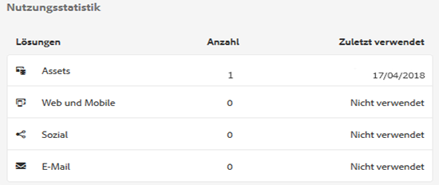
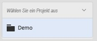
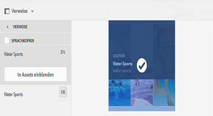
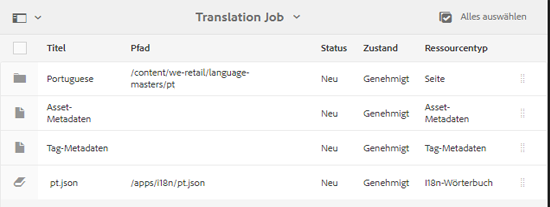

# Assets Insights {#asset-insights}

<table>
    <tr>
        <td>
            <sup style= "background-color:#008000; color:#FFFFFF; font-weight:bold"><i>Neu</i></sup> <a href="/help/assets/dynamic-media/dm-prime-ultimate.md"><b>Dynamic Media Prime und Ultimate</b></a>
        </td>
        <td>
            <sup style= "background-color:#008000; color:#FFFFFF; font-weight:bold"><i>Neu</i></sup> <a href="/help/assets/assets-ultimate-overview.md"><b>AEM Assets Ultimate</b></a>
        </td>
        <td>
            <sup style= "background-color:#008000; color:#FFFFFF; font-weight:bold"><i>Neu</i></sup> <a href="/help/assets/integrate-aem-assets-edge-delivery-services.md"><b>AEM Assets-Integration mit Edge Delivery Services</b></a>
        </td>
        <td>
            <sup style= "background-color:#008000; color:#FFFFFF; font-weight:bold"><i>Neu</i></sup> <a href="/help/assets/aem-assets-view-ui-extensibility.md"><b>Erweiterbarkeit der Benutzeroberfläche</b></a>
        </td>
          <td>
            <sup style= "background-color:#008000; color:#FFFFFF; font-weight:bold"><i>Neu</i></sup> <a href="/help/assets/dynamic-media/enable-dynamic-media-prime-and-ultimate.md"><b>Aktivieren von Dynamic Media Prime und Ultimate</b></a>
        </td>
    </tr>
    <tr>
        <td>
            <a href="/help/assets/search-best-practices.md"><b>Best Practices für die Suche</b></a>
        </td>
        <td>
            <a href="/help/assets/metadata-best-practices.md"><b>Best Practices für Metadaten</b></a>
        </td>
        <td>
            <a href="/help/assets/product-overview.md"><b>Content Hub</b></a>
        </td>
        <td>
            <a href="/help/assets/dynamic-media-open-apis-overview.md"><b>Dynamic Media mit OpenAPI-Funktionen</b></a>
        </td>
        <td>
            <a href="https://developer.adobe.com/experience-cloud/experience-manager-apis/"><b>Entwicklerdokumentation zu AEM Assets</b></a>
        </td>
    </tr>
</table>

| Version | Artikel-Link |
| -------- | ---------------------------- |
| AEM 6.5 | [Hier klicken](https://experienceleague.adobe.com/docs/experience-manager-65/assets/managing/asset-insights.html?lang=de) |
| AEM as a Cloud Service | Dieser Artikel |

Mit der Funktion „Asset Insights“ verfolgen Sie Benutzerbewertungen und Nutzungsstatistiken von Bildern, die auf Drittanbieter-Websites, in Marketing-Kampagnen und in den Kreativlösungen von Adobe verwendet werden. Sie bietet Einblicke in die Leistung und Beliebtheit der Bilder.

Assets Insights hält Details zu Benutzeraktivitäten wie Anzahl der Bildbewertungen, Klickraten und Impressionen (Häufigkeit des Ladens eines Bildes auf einer Website) fest. Basierend auf diesen Statistiken werden Bildern Bewertungen zugewiesen. Sie können Bewertungs- und Leistungsstatistiken nutzen, um beliebte Bilder für Kataloge, Marketing-Kampagnen usw. auszuwählen. Sie können außerdem Richtlinien zu Archivierungen und Lizenzerneuerungen anhand dieser Statistiken formulieren.

Damit Assets Insights Nutzungsstatistiken für Bilder von einer Website erfassen kann, müssen Sie den Einbettungscode für das Bild in den Code der Website einfügen.

Damit Asset Insights Nutzungsstatistiken für Assets anzeigen kann, konfigurieren Sie zunächst die Funktion für den Abruf von Berichtsdaten aus [!DNL Adobe Analytics]. Weitere Details finden Sie unter [Asset Insights konfigurieren](#configure-asset-insights). Um diese Funktion zu verwenden, kaufen Sie die Lizenz für [!DNL Adobe Analytics] separat.

>[!NOTE]
>
>Insights wird nur für Bilder unterstützt und bereitgestellt.

## Anzeigen von Statistiken für Bilder {#viewing-statistics-for-an-image}

Sie können die Asset Insights-Bewertungen über die Metadatenseite anzeigen.

1. Wählen Sie in der Assets-Benutzeroberfläche das Bild aus und klicken Sie dann in der Symbolleiste auf **[!UICONTROL Eigenschaften]**.
1. Klicken Sie auf der Seite „Eigenschaften“ auf **[!UICONTROL Insights]**.
1. Überprüfen Sie die Nutzungsdetails für das Asset auf der Registerkarte **[!UICONTROL Insights]**. Der Abschnitt **[!UICONTROL Bewertung]** beschreibt die gesamte Asset-Nutzung und die Leistungsbewertungen eines Assets.

   Die Nutzungsbewertung beschreibt, wie oft ein Asset in verschiedenen Lösungen verwendet wird.

   Die **[!UICONTROL Impressionen]**-Bewertung ist die Anzahl der Ladevorgänge des Assets auf der Website. Die unter **[!UICONTROL Klicks]** angezeigte Zahl beschreibt die Anzahl der Klicks auf das Asset.

1. Im Abschnitt **[!UICONTROL Nutzungsstatistiken]** können Sie ermitteln, in welchen Elementen das Asset enthalten war und in welchen Kreativlösungen es vor Kurzem verwendet wurde. Je höher die Nutzung ist, desto größer ist die Wahrscheinlichkeit, dass das Asset bei Benutzenden beliebt ist. Nutzungsdaten werden unter den folgenden Überschriften angezeigt:

   * **[!UICONTROL Asset]**: Wie oft war das Asset Teil einer Sammlung oder eines zusammengesetzten Assets.
   * **[!UICONTROL Web und Mobile]**: Wie oft wurde das Asset in Websites und Mobile Apps verwendet.
   * **[!UICONTROL Sozial]**: Die Häufigkeit, mit der das Asset in anderen Lösungen wie [!DNL Adobe Campaign] verwendet wurde.
   * **[!UICONTROL E-Mail]**: Wie oft wurde das Asset in E-Mail-Kampagnen verwendet.

   

   >[!NOTE]
   >
   >Da die Funktion „Asset Insights“ normalerweise die Lösungsdaten aus [!DNL Adobe Analytics] in bestimmten Abständen abruft, werden im Abschnitt „Lösungen“ möglicherweise nicht die neuesten Daten angezeigt. Der Zeitraum, für den die Daten angezeigt werden, hängt vom Zeitplan des Abholvorgangs ab, mit dem Asset Insights ausgeführt wird, um Daten aus Analytics abzurufen.

1. Um Leistungsstatistiken für das Asset für einen bestimmten Zeitraum grafisch anzuzeigen, wählen Sie den gewünschten Zeitraum im Abschnitt **[!UICONTROL Leistungsstatistiken]** aus. Details wie Klicks und Impressions werden als Trend-Linien eines Diagramms angezeigt.

   

   >[!NOTE]
   >
   >Im Gegensatz zu den Daten im Abschnitt „Lösungen“ zeigt der Abschnitt „Leistungsstatistiken“ die neuesten Daten an.

1. Um den Einbettungs-Code für das Asset zu erhalten, das Sie in die Websites einbeziehen, um Leistungsdaten zu erhalten, klicken Sie unter dem Asset-Miniaturbild auf **[!UICONTROL Einbettungs-Code abrufen]**. <!-- For more information on how to include your Embed code in third-party web pages, see [Using Page Tracker and Embed code in web pages](/help/assets/use-page-tracker.md). -->

   

## Anzeigen von zusammengefassten Statistiken für Bilder {#viewing-aggregate-statistics-for-images}

Mit der **[!UICONTROL Insights-Ansicht]** können Sie Bewertungen aller Assets in einem Ordner gleichzeitig anzeigen.

1. Gehen Sie in der Assets-Benutzeroberfläche zum Ordner, in dem die Assets enthalten sind, für die Sie Statistiken anzeigen möchten.
1. Klicken Sie auf die Option **[!UICONTROL Layout]** und wählen Sie **[!UICONTROL Insights-Ansicht]** aus.
1. Auf der Seite werden Nutzungsbewertungen für die Assets angezeigt. Vergleichen Sie die Bewertungen der verschiedenen Assets und ziehen Sie Ihre Erkenntnisse daraus.

<!-- TBD: Commenting as Web Console is not available. Document the appropriate OSGi config method if available in CS.

## Schedule background job {#scheduling-background-job}

Assets Insights fetches usage data for assets from Adobe Analytics report suites in a periodic manner. By default, Assets Insights runs a background job every 24 hours at 2 AM to the fetch data. However, you can modify both the frequency and the time by configuring the **[!UICONTROL Adobe CQ DAM Asset Performance Report Sync Job]** service from the web console.

1. Click the [!DNL Experience Manager] logo, and go to **[!UICONTROL Tools]** > **[!UICONTROL Operations]** > **[!UICONTROL Web Console]**.
1. Open the **[!UICONTROL Adobe CQ DAM Asset Performance Report Sync Job]** service configuration.

   

1. Specify the desired scheduler frequency and the start time for the job in the property scheduler expression. Save the changes.
-->

## Konfigurieren von Asset Insights {#configure-asset-insights}

[!DNL Experience Manager Assets] ruft Nutzungsdaten zu digitalen Assets, die von Websites Dritter verwendet werden, von [!DNL Adobe Analytics] ab. Um Asset Insights zu aktivieren und diese Daten abzurufen und Statistiken zu erzeugen, konfigurieren Sie zuerst die Funktion zur Integration mit [!DNL Adobe Analytics].

>[!NOTE]
>
>Insights werden nur für Bilder unterstützt und bereitgestellt.

1. Klicken Sie in [!DNL Experience Manager] auf **[!UICONTROL Tools]** > **[!UICONTROL Assets]**.

   

1. Klicken Sie auf die Karte **[!UICONTROL Insights-Konfiguration]**.

1. Informationen zum Zugriff auf den Analytics-Webservice finden Sie unter **[!UICONTROL Analytics]** > **[!UICONTROL Admin]** > **[!UICONTROL Admin Tools]** > **[!UICONTROL Unternehmenseinstellungen]** > **[!UICONTROL Webservices]**. Kopieren Sie dann den Schlüssel **[!UICONTROL Gemeinsamer geheimer Schlüssel]**.

   Wählen Sie im Assistenten das **[!UICONTROL Datenzentrum]** aus und geben Sie den Anzeigenamen des **[!UICONTROL Unternehmens]** und den **[!UICONTROL Benutzernamen]** für Webservices an und fügen Sie den Schlüssel **[!UICONTROL Gemeinsamer geheimer Schlüssel]** ein.

   Klicken Sie auf **[!UICONTROL Authentifizieren]**.

   ![Konfigurieren von Adobe Analytics für Asset Insights in [!DNL Experience Manager]](assets/analytics-insight-config.png)

   *Abbildung: Konfigurieren von Adobe Analytics für Asset Insights in[!DNL Experience Manager]*

1. Bei erfolgreicher Authentifizierung werden Report Suites in der Dropdown-Liste aufgeführt. Wählen Sie die **[!UICONTROL Berichtssuite]** von Adobe Analytics aus, aus der Assets Insights Daten abrufen soll. Klicken Sie auf **[!UICONTROL Hinzufügen]**.

1. Nach der Einrichtung der Report Suite durch [!DNL Experience Manager] klicken Sie auf **[!UICONTROL Fertig]**.

Weitere Informationen finden Sie unter [Adobe Analytics-Webservices](https://experienceleague.adobe.com/docs/analytics/admin/company-settings/web-services-admin.html?lang=de).

### Seitenverfolgung {#page-tracker}

Nachdem Sie Ihr Adobe Analytics-Konto konfiguriert haben, wird der Seitenverfolgungs-Code für Sie erzeugt. Um Asset Insights zur Verfolgung von [!DNL Experience Manager]-Assets in Websites von Drittanbietern zu aktivieren, beziehen Sie den Seitenverfolgungs-Code in den Website-Code ein. Verwenden Sie das Seitenverfolgungs-Dienstprogramm in Assets, um den Seitenverfolgungs-Code zu erzeugen. <!--  For more information on how to include your Page Tracker code in third-party web pages, see [Using Page Tracker and Embed code in web pages](/help/assets/use-page-tracker.md). -->

1. Klicken Sie in [!DNL Experience Manager] auf **[!UICONTROL Tools]** > **[!UICONTROL Assets]**.

   

1. Klicken Sie in der **[!UICONTROL Navigationsseite]** auf die Karte **[!UICONTROL Insights-Seitenverfolgung]**.
1. Klicken Sie auf **[!UICONTROL Herunterladen]**, um den Seitenverfolgungs-Code herunterzuladen.

<!--
Add page tracker code, CQDOC-18045, 30/07/2021
-->
Das folgende Code-Beispiel zeigt den Seitenverfolgungscode, der in einer Beispiel-Web-Seite enthalten ist:

```xml
 <head>
            <script type="text/javascript" src="http://localhost:4502/xxxx/etc.clientlibs/dam/clientlibs/sitecatalyst/appmeasurement.js"></script>
            <script type="text/javascript" src="http://localhost:4502/xxxx/etc.clientlibs/dam/clientlibs/foundation/assetinsights/pagetracker.js"></script>
            <script type="text/javascript">
                                assetAnalytics.attrTrackable = 'trackable';
                assetAnalytics.defaultTrackable = false;
                assetAnalytics.attrAssetID = 'aem-asset-id';
                assetAnalytics.assetImpressionPollInterval = 200; // interval in millis
                assetAnalytics.charsLimitForGET = 2000; // bytes
                assetAnalytics.dispatcher.init("assetstesting","abc.net","bee","list1","eVar3","event8","event7");
            </script>

 </head>
```


<!--

## Using demo package for Assets Insights {#using-demo-package-for-asset-insights}

Using the demo package, you can enable Adobe Assets Insights to capture data from and generate insights for a sample web page.

1. Configure Assets Insights using the instructions in [Configure Assets Insights](#configure-asset-insights).
1. Download the sample [!DNL Experience Manager Assets] package from below and install the package from CRXDE package manager.

   [Get File](assets/insightsdemo.zip)

1. Download the ZIP file containing the sample web page from below and extract on your local file system.

   [Get File](assets/demosite.zip)

1. Click the web page to open it in the web browser.

   >[!CAUTION]
   >
   >Web Page is configured to load asset from the localhost server . In case your server is running somewhere else change server address from localhost to server address in the HTML content of the web page.

   >[!NOTE]
   >
   >The external web page can be in [!DNL Experience Manager] itself.

-->

**Siehe auch**

* [Assets übersetzen](translate-assets.md)
* [Assets-HTTP-API](mac-api-assets.md)
* [Von AEM Assets unterstützte Dateiformate](file-format-support.md)
* [Suchen von Assets](search-assets.md)
* [Connected Assets](use-assets-across-connected-assets-instances.md)
* [Asset-Berichte](asset-reports.md)
* [Metadatenschemata](metadata-schemas.md)
* [Herunterladen von Assets](download-assets-from-aem.md)
* [Verwalten von Metadaten](manage-metadata.md)
* [Suchfacetten](search-facets.md)
* [Verwalten von Sammlungen](manage-collections.md)
* [Massenimport von Metadaten](metadata-import-export.md)
* [Veröffentlichen von Assets in AEM und Dynamic Media](/help/assets/publish-assets-to-aem-and-dm.md)
