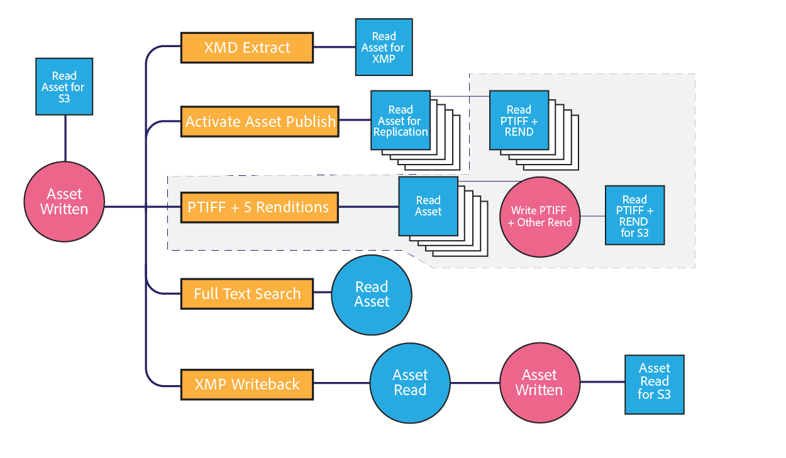

# Überlegungen zum Assets-Netzwerk {#assets-network-considerations}

Das Verständnis Ihres Netzwerks ist ebenso wichtig wie das Verständnis von Adobe Experience Manager (AEM). Das Netzwerk kann Uploads, Downloads und Benutzererlebnisse beeinflussen. Eine grafische Darstellung Ihrer Netzwerktopologie hilft bei der Erkennung von Engpässen und unzureichend optimierten Bereichen im Netzwerk, die Sie beseitigen bzw. korrigieren müssen, um die Netzwerkleistung und das Benutzererlebnis zu verbessern.

Stellen Sie sicher, dass Sie Folgendes in Ihre Netzwerkgrafik einbeziehen:

* Möglichkeit der Verbindung des Client-Geräts (z. B. Computer, Mobilgerät oder Tablet) mit dem Netzwerk
* Topologie des Unternehmensnetzwerks
* Uplink zum Internet vom Unternehmensnetzwerk und von der AEM-Umgebung
* Topologie der AEM-Umgebung
* Definition gleichzeitiger Nutzer der AEM-Netzwerkschnittstelle
* Definierte Workflows der AEM-Instanz

## Möglichkeit der Verbindung des Client-Geräts mit dem Unternehmensnetzwerk {#connectivity-from-the-client-device-to-the-corporate-network}

Beginnen Sie, indem Sie die Verbindungsmöglichkeit zwischen den einzelnen Client-Geräten und dem Unternehmensnetzwerk grafisch darstellen. In dieser Phase ermitteln Sie gemeinsam genutzte Ressourcen wie WLAN-Verbindungen, bei denen mehrere Benutzer Zugriff auf denselben Punkt oder Ethernet-Switch haben, wodurch sie Assets hoch- bzw. herunterladen können.

Client-Geräte stellen auf verschiedene Arten eine Verbindung mit einem Unternehmensnetzwerk her, z. B. über freigegebenes WLAN, Ethernet mit gemeinsam genutztem Switch und VPN. Das Erkennen und Verstehen von Engpässen in diesem Netzwerk ist für die Planung von Assets und die Netzwerkmodifizierung unerlässlich.

Oben links im Diagramm sind drei Geräte dargestellt, die gemeinsam einen 48 MBit/s schnellen WLAN-Zugangspunkt nutzen. Wenn alle Geräte gleichzeitig hochladen, wird die WLAN-Netzbandbreite von den Geräten gemeinsam genutzt. Im Vergleich zu einem System als Ganzes kann ein Benutzer auf einen Engpass stoßen, der daraus resultiert, dass die drei Clients diesen Kanal gemeinsam nutzen.

Es ist eine Herausforderung, die wahre Geschwindigkeit eines WLAN-Netzes zu messen, weil ein langsames Gerät die Leistung anderer Clients am Zugangspunkt beeinträchtigen kann. Wenn Sie beabsichtigen, WLAN für Asset-Interaktionen zu verwenden, führen Sie einen Geschwindigkeitstest mit mehreren Clients gleichzeitig durch, um die Leistung zu bewerten.

Unten links im Diagramm sind zwei Geräte dargestellt, die mit dem Unternehmensnetzwerk über unabhängige Kanäle verbunden sind. Daher kann jedes Gerät eine Mindestgeschwindigkeit von 10 MBit/s und 100 MBit/s nutzen.

Der rechts gezeigte Computer hat einen begrenzten Upstream zum Unternehmensnetzwerk über eine VPN-Verbindung mit einer Geschwindigkeit von 1 MBit/s. Das Benutzererlebnis bei der 1 MBit/s schnellen Verbindung unterscheidet sich erheblich vom Benutzererlebnis bei der 1 GBit/s schnellen Verbindung. Je nach Größe der Assets, mit denen Benutzer interagieren, kann ihr VPN-Uplink für die Aufgabe nicht ausreichend sein.

## Topologie des Unternehmensnetzwerks  {#topology-of-the-corporate-network}

Das Diagramm zeigt höhere Uplinkgeschwindigkeiten innerhalb des Unternehmensnetzwerks, als im Allgemeinen üblich sind. Diese Leitungen sind freigegebene Ressourcen. Wenn erwartet wird, dass ein freigegebener Switch die Vorgänge von 50 Clients abwickelt, kann es möglicherweise zu einem Engpass kommen. Im anfangs gezeigten Diagramm nutzen nur zwei Computer die betreffende Verbindung.

## Uplink zum Internet vom Unternehmensnetzwerk und von der AEM-Umgebung     {#uplink-to-the-internet-from-the-corporate-network-and-aem-environment}

Es ist wichtig, unbekannte Faktoren des Internets und der VPC-Verbindung zu berücksichtigen, da die Bandbreite im Internet durch Spitzenlasten oder umfangreiche Anbieterausfälle verringert werden kann. Im Allgemeinen ist eine Internetverbindung zuverlässig. Manchmal kann es allerdings zu Engpässen kommen.

Am Uplink von einem Unternehmensnetzwerk zum Internet können andere Dienste die Bandbreite nutzen. Es ist wichtig, zu verstehen, wie viel Bandbreite für AEM Assets bereitgestellt oder priorisiert werden kann. Beispielsweise können Sie bei einer 1 GBit/s schnellen Verbindung mit 80 % Auslastung nur maximal 20 % der Bandbreite für AEM Assets zuteilen.

Unternehmens-Firewalls und Proxys können Bandbreite zudem auf vielfältige Weise anpassen. Diese Geräteart kann Bandbreite mithilfe der Dienstgüte, der Bandbreitenbeschränkungen pro Benutzer oder der Bitratenbeschränkungen pro Host priorisieren. Dies sind wichtige Engpässe, die zu untersuchen sind, da sie das Assets-Benutzererlebnis erheblich beeinträchtigen können.

In diesem Beispiel nutzt das Unternehmen einen 10 GBit/s schnellen Uplink. Dieser sollte für mehrere Clients ausreichen. Außerdem beschränkt die Firewall die Hostgeschwindigkeit auf 10 MBit/s. Diese Beschränkung kann möglicherweise den Traffic zu einem einzelnen Host bis auf 10 MBit/s drosseln, obwohl der Uplink zum Internet auf 10 GBit/s ausgelegt ist.

Dies ist der kleinste Engpass in Bezug auf Clients. Sie können jedoch die für die Firewall verantwortliche Netzwerkbetriebsgruppe kontaktieren, um festzustellen, ob eine Änderung oder ein Whitelist-Eintrag in Frage kommt.

Aus den Beispieldiagrammen ist ersichtlich, dass sechs Geräte einen konzeptionellen, 10 MBit/s schnellen Kanal gemeinsam nutzen. Je nach Größe der genutzten Assets reicht dies möglicherweise aus, um die Erwartungen der Benutzer zu erfüllen.

## Topologie der AEM-Umgebung  {#topology-of-the-aem-environment}

Das Entwerfen der Topologie der AEM-Umgebung erfordert detaillierte Kenntnisse der Systemkonfiguration sowie der Art der Netzwerkverbindung innerhalb der Benutzerumgebung.

Das Beispielszenario umfasst eine Veröffentlichungsfarm mit fünf Servern, einen binären S3-Speicher und konfigurierte dynamische Medien.

Der Dispatcher nutzt seine 100 MBit/s schnelle Verbindung gemeinsam mit zwei Entitäten, der Außenwelt und der AEM-Instanz. Für gleichzeitiges Hoch- und Herunterladen sollten Sie diesen Wert durch zwei teilen. Der zugeordnete externe Speicher verwendet eine separate Verbindung.

Die AEM-Instanz nutzt ihre 1 GBit/s schnelle Verbindung gemeinsam mit mehreren Diensten. Aus Sicht der Netzwerktopologie entspricht das der Nutzung eines einzelnen Kanals mit verschiedenen Diensten.

## Definierte Workflows der AEM-Instanz {#defined-workflows-of-the-aem-instance}

Bei Überlegungen zur Netzwerkleistung ist es möglicherweise wichtig, die Workflows und die im System stattfindenden Veröffentlichungen zu berücksichtigen. Außerdem beanspruchen S3 oder Speicher, der im Netzwerk zugeteilt ist und von Ihnen verwendet wird, und I/O-Anforderungen Netzwerkbandbreite. Daher wird die Leistung selbst in einem voll optimierten Netzwerk durch die Anzahl der Datenträger-I/O beschränkt.

Um Prozesse zu optimieren, die mit der Asset-Aufnahme zu tun haben (insbesondere, wenn eine große Anzahl von Assets hochgeladen wird), sind die Asset-Workflows zu untersuchen, um mehr über ihre Konfiguration zu erfahren.

Bei der Untersuchung der internen Workflow-Topologie sollten Sie Folgendes analysieren:

* Verfahren zum Schreiben eines Assets
* Workflows/Ereignisse, die ausgelöst werden, wenn Assets/Metadaten geändert werden
* Verfahren zum Lesen eines Assets

Es folgen einige Punkte, die zu berücksichtigen sind:

* Lesen von XMP-Metadaten/Writeback
* Automatische Aktivierung und Replikation
* Unter-Asset-Aufnahme/Seitenextraktion
* Überlappende Workflows

Es folgt ein Kundenbeispiel für die Definition eines Asset-Workflows.

