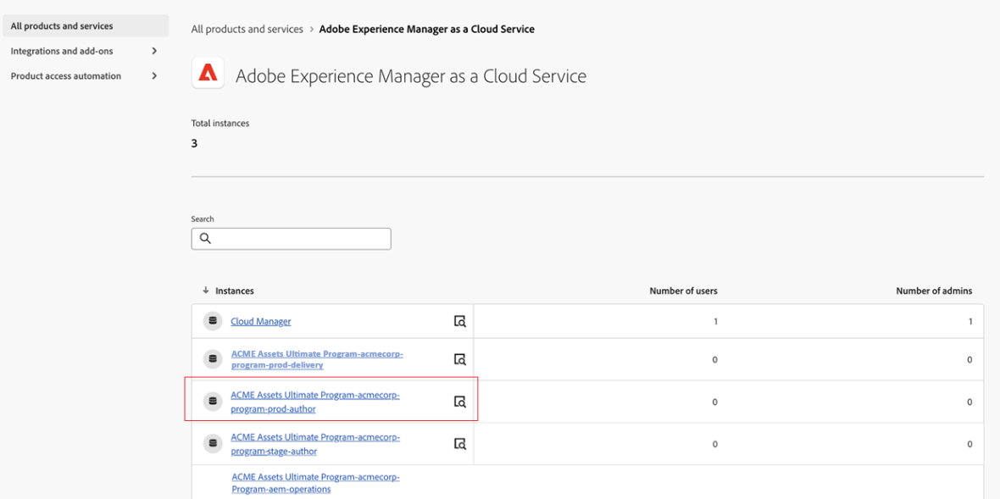
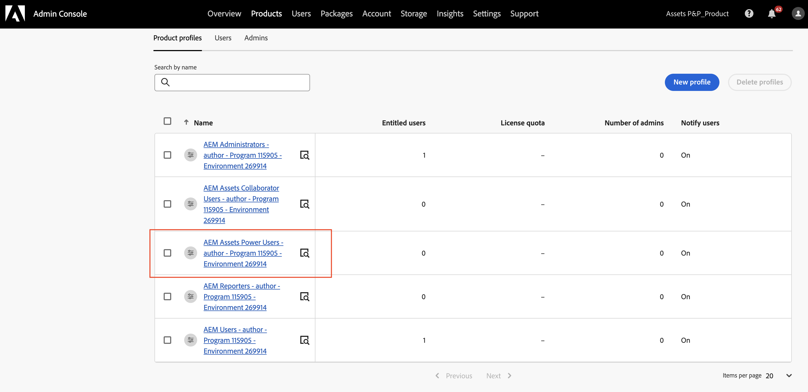

# [!DNL Assets] as a Cloud Service Prime  {#assets-prime}

| [Best Practices für die Suche](/help/assets/search-best-practices.md) | [Best Practices für Metadaten](/help/assets/metadata-best-practices.md) | [Content Hub](/help/assets/product-overview.md) | [Dynamic Media mit OpenAPI-Funktionen](/help/assets/dynamic-media-open-apis-overview.md) | [Entwicklerdokumentation zu AEM Assets](https://developer.adobe.com/experience-cloud/experience-manager-apis/) |
| ------------- | --------------------------- |---------|----|-----|

Assets as a Cloud Service Prime enthält ein einfaches DAM, mit dem Sie verschiedene wichtige Funktionen ausführen können, z. B.:

* **Asset-Verwaltung und Bibliotheksdienste**: Tools, mit denen Benutzende digitale Assets einer Marke in einem zentralisierten Repository aufnehmen, speichern, katalogisieren, kontrollieren, verwalten und steuern können

* **Suche, Entdeckung und Zusammenarbeit**: Tools, mit denen Benutzende Assets, die sie zum Erstellen umfassender Kundenerlebnisse benötigen, durchsuchen, entdecken, freigeben und gemeinsam bearbeiten können.

* **Sicherheit und Rights Management**: Tools zum Verwalten von Zugriff, Berechtigungen, Rechten und Sicherheit, um die Konformität, Konsistenz und Markenintegrität sicherzustellen.

* **Creative Cloud-Verbindungen**: Tools, die es Marketing- und Kreativ-Teams ermöglichen, mit vereinfachten Zugriffs-, Kommentar-, Überprüfungs- und Anmerkungsfunktionen zusammenzuarbeiten, um digitale Assets zu aktualisieren oder fertigzustellen.

* **Experience Cloud-Verbindungen**: Tools zur Unterstützung des nativen Zugriffs auf digitale Assets von anderen Experience Cloud-Anwendungen und -Diensten aus.

* **Verteilungsportal-Erlebnis ohne Erweiterungsoptionen (Content Hub)**: Tools zum Erweitern des Zugriffs auf die genehmigten digitalen Assets einer Marke auf weitere Stakeholder, um die Nutzungs- und Markenkonsistenz sicherzustellen.

* **Integrationen**: Integrationen in andere Adobe- und Adobe-fremde Anwendungen.

* **Dynamic Media (Add-on)**: Tools zum skalierten Transformieren und Bereitstellen von Bildern, Videos und anderen neu entstehenden Inhalten für umfassende interaktive Multimedia-Erlebnisse für alle Geräte.

Da die Anforderungen Ihres DAM jedoch steigen und Sie mehr Funktionen wie die Erweiterbarkeit der Benutzeroberfläche, API-gesteuerte Automatisierung und Bereitstellung von benutzerdefiniertem Code benötigen, sollten Sie ein Upgrade auf [Assets Ultimate](/help/assets/assets-ultimate-overview.md) in Erwägung ziehen.

Dieser Artikel enthält einen durchgängigen Arbeitsablauf zur Aktivierung von Assets as a Cloud Service Prime.

## Aktivieren von Assets as a Cloud Service Prime{#enable-assets-prime}

Aktivieren Sie Assets Prime bei der Erstellung eines neuen Programms mit Cloud Manager. Führen Sie die folgenden Schritte aus:

1. Melden Sie sich als Systemadmin bei Cloud Manager an. Stellen Sie sicher, dass Sie beim Anmelden die richtige Organisation auswählen.

   >[!NOTE]
   >
   >Achten Sie darauf, dass Sie zum richtigen Cloud Manager-Produktprofil hinzugefügt wurden, um ein neues Programm hinzuzufügen. Weitere Informationen finden Sie unter [Rollenbasierte Berechtigungen in Cloud Manager](/help/onboarding/cloud-manager-introduction.md#role-based-permissions).

1. [Erstellen Sie ein neues Programm](/help/journey-onboarding/create-program.md).

   Wählen Sie beim Erstellen des neuen Programms auf der Registerkarte **[!UICONTROL Lösungen und Add-ons]** die Option **[!UICONTROL Assets Prime]** aus. Sie können **[!UICONTROL Assets Prime]** auch erweitern und **[!UICONTROL Content Hub]** auswählen, um [Content Hub](/help/assets/product-overview.md) für die Asset-Verteilung zu aktivieren.

   

1. Klicken Sie auf **[!UICONTROL Erstellen]**, um das Programm zu erstellen.

1. Klicken Sie auf die Programmkarte und dann auf **[!UICONTROL Umgebung hinzufügen]**.

1. Geben Sie den Umgebungsnamen an, definieren Sie eine Region und klicken Sie auf **[!UICONTROL Speichern]**, um die Umgebung zu erstellen.

   

>[!NOTE]
>
>Mit Assets Prime können Sie nur eine Produktionsumgebung erstellen. Die Option zum Hinzufügen einer Umgebung ist nicht mehr verfügbar, nachdem die Produktionsumgebung erfolgreich erstellt wurde.

Assets Prime ist jetzt für Experience Manager Assets as a Cloud Service aktiviert.

Systemadmins sind automatisch berechtigte AEM-Admins und erhalten eine E-Mail, um zur Admin Console zur Verwaltung von Produktprofilen zu navigieren.

Ihre Instanz von AEM as a Cloud Service in der Admin Console umfasst die folgenden Produktprofile:

* AEM-Admins

* AEM-Benutzende

* [AEM Assets-Mitarbeiter-Benutzende](#onboard-collaborator-users)

* [AEM Assets-Power-Benutzende](#onboard-power-users)

Sie können damit beginnen, Benutzende oder Benutzergruppen zu den Produktprofilen „AEM Assets-Mitarbeiter-Benutzende“ und „AEM Assets-Power-Benutzende“ hinzuzufügen. Weitere Informationen finden Sie unter [Onboarding von AEM Assets-Mitarbeiter-Benutzenden](#onboard-collaborator-users) und [Onboarding von AEM Assets-Power-Benutzenden](#onboard-power-users).

Wenn Sie Content Hub für Assets as a Cloud Service aktiviert haben, wird in AEM Assets as a Cloud Service eine neue Instanz für die Admin Console mit dem Suffix `delivery` erstellt:

>[!NOTE]
>
>Wenn Sie Content Hub vor dem 14. August 2024 bereitgestellt haben, wird die neue Instanz mit `contenthub` als Suffix erstellt.

Beachten Sie, dass der Instanzname für Content Hub weder `author` noch `publish` enthält.

Klicken Sie auf den Instanznamen, um das Content Hub-Produktprofil `AEM Assets Limited Users` anzuzeigen.

Sie können diesem Produktprofil Benutzende oder Benutzergruppen hinzufügen, um ihnen Zugriff auf Content Hub zu gewähren.

>[!NOTE]
>
>Wenn Sie Content Hub vor dem 14. August 2024 bereitgestellt haben, wird für das Content Hub-Produktprofil nach `Limited Users` anstelle von `delivery` `contenthub` angegeben.

## Onboarding von AEM Assets-Mitarbeiter-Benutzenden {#onboard-collaborator-users}

AEM Assets-Mitarbeiter-Benutzende können mit Assets aus Experience Manager über Integrationen von Assets arbeiten, die für Ihr Unternehmen in anderen Adobe-Produkten und Adobe-fremden Anwendungen zur Verfügung stehen, Assets mit dem integrierten Adobe Express und Firefly erstellen und bearbeiten, indem sie professionell entwickelte Vorlagen, Marken-Kits und Adobe Stock-Assets nutzen und mithilfe des AEM Assets Content Hub-Portals auf genehmigte Assets in Ihrem Unternehmen zugreifen und diese nutzen.

So führen Sie das Onboarding von Mitarbeiter-Benutzenden durch:

1. Greifen Sie auf Experience Manager Assets-Produktprofile zu, indem Sie in der Produktliste in der Admin Console auf den AEM as a Cloud Service-Produktnamen klicken.

1. Klicken Sie auf die Produktions-Autoreninstanz für AEM as a Cloud Service:
   

1. Klicken Sie auf das Produktprofil „Mitarbeiter-Benutzende“ und klicken Sie auf **[!UICONTROL Benutzende hinzufügen]**, um die Person zum Produktprofil hinzuzufügen.
   

1. Klicken Sie auf **[!UICONTROL Speichern]**, um die Änderungen zu speichern.

Sie können auch auf die den Mitarbeiter-Benutzenden zugewiesenen Dienste zugreifen und diese anzeigen, wie in der folgenden Abbildung dargestellt:

Die Dienste `Adobe Express` und `AEM Assets Collaborator Users` sind standardmäßig aktiviert. Sie können den Umschalter entsprechend Ihren Anforderungen deaktivieren und aktivieren. Adobe empfiehlt jedoch, die standardmäßig für die Produktprofile aktivierten Dienste zu verwenden.

## Onboarding von AEM Assets Power-Benutzenden {#onboard-power-users}

AEM Assets-Power-Benutzende können auf alle AEM Assets-Funktionen zugreifen, einschließlich dem Verwalten von Assets, Berechtigungen, Metadaten und der allgemeinen Governance und Automatisierung von digitalen Assets. Sie können mit Assets aus Experience Manager über Integrationen von Assets arbeiten, die für Ihr Unternehmen in anderen Adobe-Produkten und Adobe-fremden Anwendungen zur Verfügung stehen, Assets mit dem integrierten Adobe Express und Firefly erstellen und bearbeiten, indem sie professionell entwickelte Vorlagen, Marken-Kits und Adobe Stock-Assets nutzen und mithilfe des AEM Assets Content Hub-Portals auf genehmigte Assets in Ihrem Unternehmen zugreifen und diese nutzen.

So führen Sie das Onboarding von Power-Benutzenden durch:

1. Greifen Sie auf Experience Manager Assets-Produktprofile zu, indem Sie in der Produktliste in der Admin Console auf den AEM as a Cloud Service-Produktnamen klicken.

1. Klicken Sie auf die Produktions-Autoreninstanz für AEM as a Cloud Service:
   

1. Klicken Sie auf das Produktprofil „Power-Benutzende“ und klicken Sie auf **[!UICONTROL Benutzende hinzufügen]**, um die Person zum Produktprofil hinzuzufügen.
   

1. Klicken Sie auf **[!UICONTROL Speichern]**, um die Änderungen zu speichern.

Sie können auch auf die den Power-Benutzenden zugewiesenen Dienste zugreifen und diese anzeigen, wie in der folgenden Abbildung dargestellt:

Die Dienste `Adobe Express` und `AEM Assets Power Users` sind standardmäßig aktiviert. Sie können den Umschalter entsprechend Ihren Anforderungen deaktivieren und aktivieren. Adobe empfiehlt jedoch, die standardmäßig für die Produktprofile aktivierten Dienste zu verwenden.
