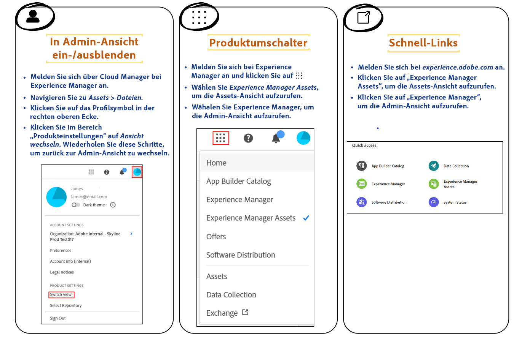

# Einführung in die Assets-Ansicht {#assets-view}

In der heutigen schnelllebigen digitalen Welt, in der die Erstellung und Bereitstellung von Inhalten in Echtzeit von entscheidender Bedeutung ist, sollten Sie Digital Asset Management (DAM) erleben, das für die Geschwindigkeit des Downstream-Marketing entwickelt wurde. Adobe nutzt sein Know-how bei der Unterstützung von Marketing- und Kreativ-Profis und bietet damit ein völlig neues Anwendungserlebnis. Dieser Workflow-orientierte Ansatz revolutioniert die Art und Weise, wie Unternehmen mit ihren dynamischen digitalen Assets umgehen, und ermöglicht es Marketing-Fachleuten, die Effizienz beim Auffinden, Zusammenarbeiten, Personalisieren und Bereitstellen von Assets zu maximieren. Diese optimierten Workflows erhöhen die Geschwindigkeit von Inhalten und verhelfen Ihren Marketing-Maßnahmen zu neuen Höhenflügen.

Weitere Informationen zu den verfügbaren Persona-basierten Erlebnissen für Assets as a Cloud Service finden Sie unter [Einführung in Assets as a Cloud Service](/help/assets/overview.md#persona-based-experiences).

## Wie wird auf die Assets-Ansicht zugegriffen? {#access-assets-view}

Sie können wie folgt auf die Assets-Ansicht zugreifen:

<!--

* **Toggle in Admin view**

    * Log into [!DNL Experience Manager] using Cloud Manager.
    * Navigate to **[!UICONTROL Assets]** > **[!UICONTROL Files]**.
    * Click the profile icon on the top right corner.
    * Click **[!UICONTROL Switch View]** from the **[!UICONTROL Profile Settings]** section.
    Repeat these steps to switch back to the Admin view.

* **Product Switcher**
    * Log into [!DNL Experience Manager] and click .
    * Select **[!UICONTROL Experience Manager Assets]** to access the Assets view.
    * Select **[!UICONTROL Experience Manager]** to access the Admin view.

* **Quick Links** 
    * Log into experience.adobe.com.
    * Click **[!UICONTROL Experience Manager Assets]** to access the Assets view.
    * Click **[!UICONTROL Experience Manager Assets]** to access the Assets view.

    -->

## Was spricht für die Assets-Ansicht?

Die Assets-Ansicht hat gegenüber der Admin-Ansicht die folgenden wesentlichen Vorteile:

* [Dashboard „Mein Arbeitsbereich“ zur Bereitstellung optimierter Erlebnisse](#my-workspace-for-streamlined-experience)
* [Search-First-Ansatz für mehr Effizienz](#search-first)
* [Insights für datenbasierte Entscheidungen](#insights-data)
* [Adobe Photoshop Express-Integration für eine schnellere Zusammenarbeit](#accelerate-collaboration)
* [Ordner-Uploads zum Einrichten einer hierarchischen Struktur für Ihr Unternehmen](#folder-uploads)
* [Abonnieren von Repository-Inhalten für effizientes Asset-Management](#subscribe-content)
* [Vorläufiges Löschen von Assets für eine bessere Kontrolle durch Admins](#soft-delete-assets)

### Dashboard „Mein Arbeitsbereich“ zur Bereitstellung optimierter Erlebnisse {#my-workspace-for-streamlined-experience}

Freuen Sie sich auf eine Digital Asset Management-Lösung, die die unterschiedlichen Anforderungen verschiedener Unternehmensrollen berücksichtigt. Die Assets-Ansicht mit ihrem eleganten Design priorisiert Benutzerfreundlichkeit und Schnelligkeit sowie die Vorlieben von Marketing-Fachleuten, die sich eine ansprechende Ästhetik und übersichtliche Arbeitsbereiche wünschen. Mit dem benutzerspezifischen Dashboard „Mein Arbeitsbereich“ können Marketing-Fachleute Assets schnell finden, in der Vorschau anzeigen, bearbeiten, verwalten und bereitstellen – und das mit bemerkenswerter Effizienz. Sie brauchen nicht mehr Stunden mit der Suche nach bestimmten Assets zu verbringen, sondern erhalten ein optimiertes Erlebnis, bei dem Sie alles Nötige sofort finden.

<!--

### Insights to take data-driven decisions {#insights-data}

To keep pace with content velocity, actionable insights are essential. The Assets view offers advanced insights within the My Workspace, providing valuable data on asset performance, audience usage, and engagements. Marketers can make data-driven decisions, optimize content strategies, and refine their downstream delivery to achieve optimal results. With access to meaningful insights, businesses can stay ahead of the competition and drive exceptional outcomes.

-->

### Adobe Photoshop Express-Integration für eine schnellere Zusammenarbeit {#accelerate-collaboration}

Das neue Erlebnis bietet eine Reihe von zuverlässigen Funktionen für die Zusammenarbeit, darunter die Echtzeitbearbeitung mit integrierten Adobe Photoshop-Funktionen, Versionskontrolle und Anmerkungs-Tools. Dies ermöglicht eine nahtlose Zusammenarbeit zwischen Design-, Kreativ-, Branding- und Marketing-Teams, sodass diese Engpässe überwinden und den Marketing-Prozess beschleunigen können. Marketing-Fachleute verfügen nun über leistungsstarke Tools, mit denen sie Projekte schneller bereitstellen und ihre Gesamtproduktivität steigern können.

Sehen Sie sich dieses Video an, um zu erfahren, wie leistungsstark die Integration der Assets-Ansicht in Adobe Photoshop Express ist:

>[!VIDEO](https://video.tv.adobe.com/v/3420922)

Zukünftige Versionen von Assets as a Cloud Service werden auch eine [Adobe Firefly-Integration über Adobe Express](https://firefly.adobe.com/?gclid=EAIaIQobChMIlZeKuNfj_wIVeyCtBh3e5g2cEAAYASAAEgL56_D_BwE&sdid=JM4FW6VL&mv=search&mv2=paidsearch&ef_id=EAIaIQobChMIlZeKuNfj_wIVeyCtBh3e5g2cEAAYASAAEgL56_D_BwE:G:s&s_kwcid=AL!3085!3!652077237594!e!!g!!adobe%20firefly!19870733758!148140507838) umfassen.

### Ordner-Uploads zum Einrichten einer hierarchischen Struktur für Ihr Unternehmen {#folder-uploads}

Richten Sie mithilfe der Assets-Ansicht schnell eine Ordnerstruktur für Ihre Organisation ein, indem Sie Ordner hochladen, die in Ihrem lokalen Dateisystem vorhanden sind. Sie müssen nicht erst Ordner im Stammordner erstellen und dann Assets manuell in diese Ordner hochladen, um die logische hierarchische Struktur beizubehalten. Alle Ordner und Assets im Stammordner werden automatisch in Experience Manager Assets hochgeladen.

### Search-First-Ansatz für mehr Effizienz {#search-first}

Erschließen Sie das Potenzial der digitalen Asset-Bibliothek Ihrer Organisation durch Suchvorgänge mit modernsten Funktionen. Sie müssen nicht mehr mühevoll unzählige Dateien und Ordner manuell durchgehen. Alle Benutzenden können sofort das perfekte Bild, Video oder Dokument für beeindruckende Marketing-Kampagnen, faszinierende Präsentationen und ansprechende Inhalte finden. Mit unserer Search-First-Suchmaschine können Sie mühelos durch Asset-Typen, Metadaten, Smarttags und sogar den Inhalt selbst navigieren, ohne das genaue Keyword zu kennen. Nutzen Sie die Zukunft des DAM mit unserem Search-First-Ansatz und schöpfen Sie das volle Potenzial Ihrer digitalen Asset-Bibliothek aus.

### Abonnieren von Repository-Inhalten für effizientes Asset-Management {#subscribe-content}

Die Assets-Ansicht ermöglicht Ihnen die Überwachung der Vorgänge, die mit den im Repository verfügbaren Assets, Ordnern oder Sammlungen durchgeführt werden.  Sie müssen den Inhalt auswählen und abonnieren, für den die Benachrichtigungen an Sie gesendet werden. Sie können auch die Ereignistypen konfigurieren, z. B. das Löschen oder Ändern von abonnierten Inhalten. Die Benachrichtigungen werden Ihnen dann nur für diese Ereignistypen gesendet.

### Vorläufiges Löschen von Assets für eine bessere Kontrolle durch Admins {#soft-delete-assets}

Im Papierkorb-Ordner, der in der Assets-Ansicht verfügbar ist, sind die aus dem Assets-Stammordner gelöschten Assets aufgelistet. Sie können ein Asset im Papierkorb-Ordner auswählen, um es entweder am ursprünglichen Speicherort wiederherzustellen oder dauerhaft zu löschen. Sie können auch einen Suchbegriff angeben oder standardmäßige bzw. benutzerdefinierte Filter anwenden, um nach geeigneten Assets im Papierkorb-Ordner zu suchen.

Zusätzlich zu diesen Funktionen können Sie mit der Assets-Ansicht auch die folgenden Funktionen ausführen, die in der Admin-Ansicht nicht verfügbar sind:

* Hochladen einer neuen Asset-Version mit einem anderen Namen aus Ihrem lokalen Dateisystem in das Asset-Repository. Das hochgeladene Asset ist als neue Version mit demselben Namen wie das ursprüngliche Asset verfügbar.

* Umbenennen der im Repository verfügbaren Assets und Ordner.

Die Assets-Ansicht ist darauf zugeschnitten, Workflows zu optimieren, die Zusammenarbeit zu fördern und die Bereitstellung von Assets zu beschleunigen.  Durch die schnelle Bereitstellung von Inhalten können Marketing-Fachleute das gesamte Potenzial ihrer digitalen Assets ausschöpfen und eine beispiellose Kreativität freisetzen.

Verwenden Sie diese Links, um schnell mit der Assets-Ansicht zu beginnen:

* [Mein Arbeitsbereich](/help/assets/my-workspace-assets-view.md)
* [Erste Schritte mit der Assets-Ansicht](/help/assets/get-started-assets-view.md)
