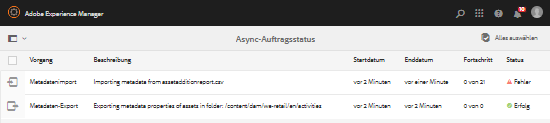
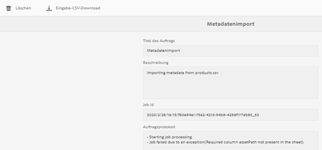

# Asynchrone Vorgänge {#asynchronous-operations}

Um negative Auswirkungen auf die Leistung einzuschränken, werden bestimmte lang laufende und ressourcenintensive Asset-Vorgänge in Adobe Experience Manager (AEM) Assets asynchron verarbeitet.

Zu diesen Vorgängen gehören u. a.:

* Löschen vieler Assets
* Verschieben vieler Assets oder Assets mit vielen Verweisen
* Exportieren/Importieren von Asset-Metadaten in großen Mengen.
* Abrufen von Assets, die über dem festgelegten Schwellenwert liegen, aus einer Remote-AEM-Bereitstellung.

Die asynchrone Verarbeitung umfasst den Aufbau einer Warteschlange mit mehreren Aufträgen und schließlich deren serielle Ausführung gemäß der Verfügbarkeit von Systemressourcen.

You can view the status of asynchronous jobs from the **[!UICONTROL Async Job Status]** page.

>[!NOTE]
>
>Standardmäßig werden Aufträge in AEM Assets parallel ausgeführt. Wenn N die Anzahl der CPU-Kerne ist, können standardmäßig N/2 Aufträge parallel ausgeführt werden. Um benutzerdefinierte Einstellungen für die Auftragswarteschlange festzulegen, passen Sie die Konfiguration **Async Operation Default Queue** über die Web-Konsole an. For more information, see [Queue Configurations](https://sling.apache.org/documentation/bundles/apache-sling-eventing-and-job-handling.html#queue-configurations).

## Überwachen des Status asynchroner Vorgänge {#monitoring-the-status-of-asynchronous-operations}

Whenever AEM Assets processes an operation asynchronously, you receive a notification at your inbox <!-- and through email -->.

To view the status of the asynchronous operations in detail, navigate to the **[!UICONTROL Async Job Status]** page.

1. Tippen/Klicken Sie auf das AEM-Logo und gehen Sie zu **[!UICONTROL Assets]** > **[!UICONTROL Aufträge]**.
1. In the **[!UICONTROL Async Job Status]** page, review the details of the operations.

   

   Den Fortschritt einzelner Vorgänge finden Sie in der Spalte **[!UICONTROL Status]**. Abhängig vom Fortschritt wird eine der folgenden Statusmeldungen angezeigt:

   **[!UICONTROL Aktiv]**: Der Vorgang wird verarbeitet

   **[!UICONTROL Erfolg]**: Der Vorgang wurde abgeschlossen

   **[!UICONTROL Fehlschlag]** oder **[!UICONTROL Fehler]**: Der Vorgang konnte nicht bearbeitet werden.

   **[!UICONTROL Geplant]**: Die Verarbeitung des Vorgangs ist für einen späteren Zeitpunkt geplant

1. Um einen aktiven Vorgang abzubrechen, wählen Sie ihn in der Liste aus und tippen/klicken Sie auf das Symbol **[!UICONTROL Stopp]** in der Symbolleiste.

   

1. Um zusätzliche Details anzuzeigen, beispielsweise eine Beschreibung und Protokolle, wählen Sie den Vorgang aus und tippen/klicken Sie auf das Symbol **[!UICONTROL Öffnen]** in der Symbolleiste.

   

   Die Detailseite für den Auftrag wird angezeigt.

   

1. Um den Vorgang aus der Liste zu löschen, wählen Sie die Option **[!UICONTROL Löschen]** in der Symbolleiste aus. Um die Details als CSV-Datei herunterzuladen, tippen/klicken Sie auf das Symbol **[!UICONTROL Herunterladen]**.

   >[!NOTE]
   >
   >Sie können einen Auftrag nicht löschen, wenn er aktiv ist oder sich in der Warteschlange befindet.

## Bereinigen abgeschlossener Aufträge {#purging-completed-jobs}

AEM Assets führt jeden Tag um 1:00 Uhr einen Bereinigungsauftrag aus, um abgeschlossene asynchrone Aufträge zu löschen, die älter als einen Tag sind.

Sie können den Zeitplan für den Bereinigungsauftrag bearbeiten. Außerdem können Sie anpassen, wie lange die Details zu abgeschlossenen Aufträgen gespeichert werden sollen, bevor sie gelöscht werden. Darüber hinaus können Sie die maximale Anzahl abgeschlossener Aufträge konfigurieren, deren Details zu einem beliebigen Zeitpunkt gespeichert werden.

1. Tippen/Klicken Sie auf das AEM-Logo und gehen Sie zu **[!UICONTROL Werkzeuge]** > **[!UICONTROL Vorgänge]** > **[!UICONTROL Web Console]**.
1. Open the **[!UICONTROL Adobe CQ DAM Async Jobs Purge Scheduled]** job.
1. Geben Sie die Schwellenzahl der Tage an, nach denen abgeschlossene Aufträge gelöscht werden, und die maximale Anzahl von Aufträgen, für die Details im Verlauf beibehalten werden.

   
   *Abbildung: Konfiguration zum Planen des Bereinigens asynchroner Aufträge*

1. Speichern Sie die Änderungen.

## Konfigurieren von Schwellenwerten für die asynchrone Verarbeitung {#configuring-thresholds-for-asynchronous-processing}

Sie können den Schwellenwert für Assets oder Verweise festlegen, damit AEM Assets einen bestimmten Vorgang asynchron verarbeitet.

### Konfigurieren der Schwellenwerte für asynchrone Löschvorgänge {#configuring-thresholds-for-asynchronous-delete-operations}

Wenn die Anzahl der Assets oder der zu löschenden Ordner den Schwellenwert überschreitet, wird der Löschvorgang asynchron verarbeitet.

1. Tippen/Klicken Sie auf das AEM-Logo und gehen Sie zu **[!UICONTROL Werkzeuge]** > **[!UICONTROL Vorgänge]** > **[!UICONTROL Web Console]**.
1. From the web console, open the **[!UICONTROL Async Delete Operation Job Processing]** configuration.
1. In the **[!UICONTROL Threshold number of assets]** box, specify the threshold number of assets/folders for asynchronous processing of delete operations.

   

1. Speichern Sie die Änderungen.

### Konfigurieren der Schwellenwerte für asynchrone Verschiebevorgänge {#configuring-thresholds-for-asynchronous-move-operations}

Wenn die Anzahl der Assets oder der zu löschenden Ordner den Schwellenwert überschreitet, wird der Löschvorgang asynchron verarbeitet.

1. Tippen/Klicken Sie auf das AEM-Logo und gehen Sie zu **[!UICONTROL Werkzeuge]** > **[!UICONTROL Vorgänge]** > **[!UICONTROL Web Console]**.
1. From the web console, open the **[!UICONTROL Async Move Operation Job Processing]** configuration.
1. In the **[!UICONTROL Threshold number of assets/references]** box, specify the threshold number of assets/folders or references for asynchronous processing of move operations.

   

1. Speichern Sie die Änderungen.
