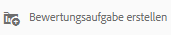
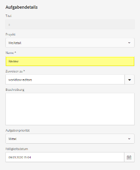
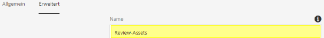
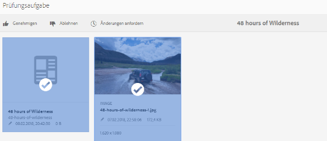
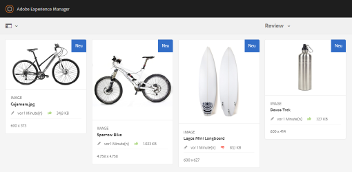
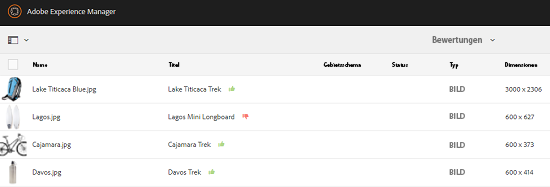
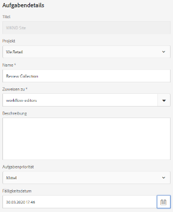
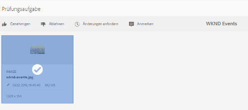
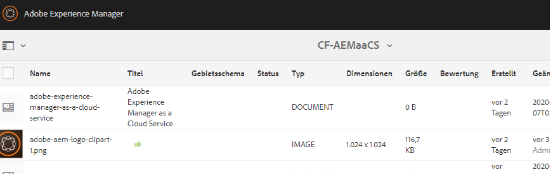

# Überprüfen von Assets in Ordnern und Sammlungen {#review-folder-assets-and-collections}

| Version | Artikel-Link |
| -------- | ---------------------------- |
| AEM 6.5 | [Hier klicken](https://experienceleague.adobe.com/docs/experience-manager-65/assets/using/bulk-approval.html?lang=de) |
| AEM as a Cloud Service | Dieser Artikel |

Mit Adobe Experience Manager Assets können Sie Ad-hoc-Prüfungs-Workflows für Assets festlegen, die sich in einem Ordner oder in einer Sammlung befinden. Sie können sie für Prüfer oder kreative Partner freigeben, um deren Feedback einzuholen. Sie können einen Prüfungs-Workflow entweder mit einem Projekt verbinden oder eine eigenständige Prüfungsaufgabe erstellen.

Nachdem Sie die Assets freigegeben haben, können Überprüfende sie genehmigen oder ablehnen. Benachrichtigungen werden in verschiedenen Phasen des Workflows gesendet, um die vorgesehenen Empfangenden über den Abschluss verschiedener Aufgaben zu informieren. Wenn Sie beispielsweise einen Ordner oder eine Sammlung freigeben, erhalten Prüfende eine Benachrichtigung, dass ein Ordner/eine Sammlung zur Überprüfung freigegeben wurde.

Nachdem Überprüfende die Überprüfung abgeschlossen haben (Assets genehmigt oder ablehnt), erhalten Sie eine Benachrichtigung zum Abschluss der Überprüfung.

## Erstellen einer Prüfungsaufgabe für Ordner {#creating-a-review-task-for-folders}

1. Wählen Sie in der Assets-Benutzeroberfläche den Ordner aus, für den Sie eine Prüfungsaufgabe erstellen möchten.
1. Wählen Sie in der Symbolleiste **[!UICONTROL Prüfungsaufgabe erstellen]** aus, um die Seite **[!UICONTROL Prüfungsaufgabe]** zu öffnen. Wenn Sie das Symbol in der Symbolleiste nicht sehen können, wählen Sie **[!UICONTROL Mehr]** und dann das Symbol aus.

   

1. (Optional) Wählen Sie in der Liste **[!UICONTROL Projekt]** das Projekt aus, mit dem Sie die Prüfungsaufgabe verbinden möchten. Standardmäßig ist die Option **[!UICONTROL Ohne]** ausgewählt. Wenn Sie kein Projekt mit der Prüfungsaufgabe verknüpfen möchten, behalten Sie diese Auswahl bei.

   >[!NOTE]
   >
   >Nur die Projekte, für die Sie über Berechtigungen auf Editor-Ebene (oder höher) verfügen, sind in der Liste **[!UICONTROL Projekte]** sichtbar.

1. Geben Sie einen Namen für die Prüfungsaufgabe ein und wählen Sie einen Genehmigenden aus der Liste **[!UICONTROL Zuweisen zu]** aus.

   >[!NOTE]
   >
   >Die Mitglieder/Gruppen des ausgewählten Projekts sind als Genehmigende in der Liste **[!UICONTROL Zuweisen zu]** verfügbar.

1. Geben Sie eine Beschreibung, die Aufgabenpriorität und das Fälligkeitsdatum für die Prüfungsaufgabe ein.

   

1. Geben Sie auf der Registerkarte „Erweitert“ eine Beschriftung ein, die zum Erstellen der URI verwendet werden soll.

   

1. Wählen Sie **[!UICONTROL Absenden]** und dann **[!UICONTROL Fertig]** aus, um die Bestätigungsmeldung zu schließen. Eine Benachrichtigung für die neue Aufgabe wird an die genehmigende Person gesendet.
1. Melden Sie sich bei [!DNL Experience Manager Assets] als Genehmiger an und gehen Sie zur Assets-Benutzeroberfläche. Um Assets zu genehmigen, wählen Sie das Symbol **[!UICONTROL Benachrichtigungen]** und dann die Prüfungsaufgabe aus der Liste aus.

   

1. Überprüfen Sie auf der Seite **[!UICONTROL Prüfungsaufgabe]** die Details der Prüfungsaufgabe und wählen Sie dann **[!UICONTROL Überprüfen]**.
1. Wählen Sie auf der Seite **[!UICONTROL Prüfungsaufgabe]** Assets aus und wählen Sie dann das Symbol **[!UICONTROL Genehmigen/Ablehnen]** aus, um die Assets je nach Bedarf zu genehmigen oder abzulehnen.

   

1. Wählen Sie in der Symbolleiste das Symbol **[!UICONTROL Abschließen]** aus. Geben Sie im Dialogfeld einen Kommentar ein und wählen Sie zur Bestätigung **[!UICONTROL Abschließen]** aus.
1. Navigieren Sie zur Assets-Benutzeroberfläche und öffnen Sie den Ordner. Die Symbole für den Genehmigungsstatus für die Assets werden sowohl in der Karten- als auch in der Listenansicht angezeigt.

   **Kartenansicht**

   

   **Listenansicht**

   

## Erstellen einer Prüfungsaufgabe für Sammlungen {#creating-a-review-task-for-collections}

1. Wählen Sie auf der Seite „Sammlungen“ die Sammlung aus, für die Sie eine Prüfungsaufgabe erstellen möchten.
1. Wählen Sie in der Symbolleiste **[!UICONTROL Prüfungsaufgabe erstellen]** aus, um die Seite **[!UICONTROL Prüfungsaufgabe]** zu öffnen. Wenn Sie das Symbol in der Symbolleiste nicht sehen können, wählen Sie **[!UICONTROL Mehr]** und dann das Symbol aus.

   

1. (Optional) Wählen Sie in der Liste **[!UICONTROL Projekt]** das Projekt aus, mit dem Sie die Prüfungsaufgabe verbinden möchten. Standardmäßig ist die Option **[!UICONTROL Ohne]** ausgewählt. Wenn Sie kein Projekt mit der Prüfungsaufgabe verknüpfen möchten, behalten Sie diese Auswahl bei.

   >[!NOTE]
   >
   >Nur die Projekte, für die Sie über Berechtigungen auf Editor-Ebene (oder höher) verfügen, sind in der Liste **[!UICONTROL Projekte]** sichtbar.

1. Geben Sie einen Namen für die Prüfungsaufgabe ein und wählen Sie einen Genehmigenden aus der Liste **[!UICONTROL Zuweisen zu]** aus.

   >[!NOTE]
   >
   >Die Mitglieder/Gruppen des ausgewählten Projekts sind als Genehmigende in der Liste **[!UICONTROL Zuweisen zu]** verfügbar.

1. Geben Sie eine Beschreibung, die Aufgabenpriorität und das Fälligkeitsdatum für die Prüfungsaufgabe ein.

   

1. Wählen Sie **[!UICONTROL Absenden]** und dann **[!UICONTROL Fertig]** aus, um die Bestätigungsmeldung zu schließen. Eine Benachrichtigung für die neue Aufgabe wird an die genehmigende Person gesendet.
1. Melden Sie sich bei [!DNL Experience Manager Assets] als Genehmiger an und gehen Sie zur Assets-Konsole. Um Assets zu genehmigen, wählen Sie das Symbol **[!UICONTROL Benachrichtigungen]** und dann die Prüfungsaufgabe aus der Liste aus.
1. Überprüfen Sie auf der Seite **[!UICONTROL Prüfungsaufgabe]** die Details der Prüfungsaufgabe und wählen Sie dann **[!UICONTROL Überprüfen]** aus.
1. Alle Assets in der Sammlung sind auf der Prüfungsseite sichtbar. Wählen Sie die Assets und das Symbol **[!UICONTROL Genehmigen/Ablehnen]** aus, um die Assets je nach Bedarf zu genehmigen bzw. abzulehnen.

   

1. Wählen Sie in der Symbolleiste das Symbol **[!UICONTROL Abschließen]** aus. Geben Sie im Dialogfeld einen Kommentar ein und wählen Sie zur Bestätigung **[!UICONTROL Abschließen]** aus.
1. Gehen Sie zur Konsole „Sammlungen“ und öffnen Sie die Sammlung. Die Symbole für den Genehmigungsstatus für die Assets werden sowohl in der Karten- als auch in der Listenansicht angezeigt.

   **Kartenansicht**

   

   **Listenansicht**

   

**Siehe auch**

* [Assets übersetzen](translate-assets.md)
* [Assets-HTTP-API](mac-api-assets.md)
* [Von AEM Assets unterstützte Dateiformate](file-format-support.md)
* [Suchen von Assets](search-assets.md)
* [Connected Assets](use-assets-across-connected-assets-instances.md)
* [Asset-Berichte](asset-reports.md)
* [Metadatenschemata](metadata-schemas.md)
* [Herunterladen von Assets](download-assets-from-aem.md)
* [Verwalten von Metadaten](manage-metadata.md)
* [Suchfacetten](search-facets.md)
* [Verwalten von Sammlungen](manage-collections.md)
* [Massenimport von Metadaten](metadata-import-export.md)
* [Veröffentlichen von Assets in AEM und Dynamic Media](/help/assets/publish-assets-to-aem-and-dm.md)
