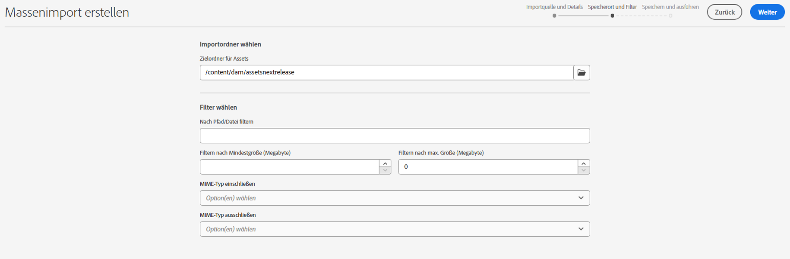
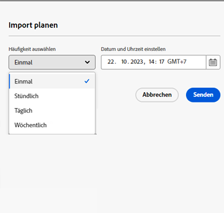
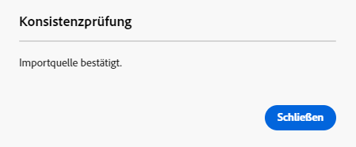
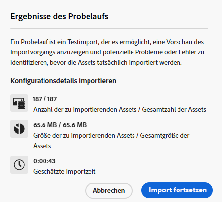

# Massenimport von Assets mithilfe der Assets-Ansicht  {#bulk-import-assets-view}

Der Massenimport in der AEM Assets-Ansicht bietet Admins die Möglichkeit, eine große Anzahl von Assets aus einer Datenquelle in AEM Assets zu importieren. Die Admins müssen keine einzelnen Assets oder Ordner mehr in AEM Assets hochladen.

>[!NOTE]
>
>Der Massenimport für die Assets-Ansicht verwendet dasselbe Backend wie der Massenimport für die Admin-Ansicht. Er bietet jedoch mehr Datenquellen, aus denen importiert werden kann, und ein optimiertes Anwendererlebnis.

Sie können Assets aus den folgenden Datenquellen importieren:

* Azure
* AWS
* Google Cloud
* Dropbox
* OneDrive

## Voraussetzungen {#prerequisites}

| Datenquelle | Voraussetzungen |
|-----|------|
| Azure | <ul> <li>Azure-Speicherkonto </li> <li> Azure-Blob-Container <li> Azure-Zugriffsschlüssel oder SAS-Token basierend auf dem Authentifizierungsmodus </li></ul> |
| AWS | <ul> <li>AWS-Region </li> <li> AWS-Bucket <li> AWS-Zugriffsschlüssel </li><li> AWS-Zugriffsgeheimnis </li></ul> |
| Google Cloud | <ul> <li>GCP-Bucket </li> <li> E-Mail für GCP-Service-Konto <li> Privater Schlüssel für GCP-Service-Konto</li></ul> |
| Dropbox | <ul> <li>Dropbox Client-ID (App-Schlüssel) </li> <li> Dropbox-Client-Geheimnis (App-Geheimnis)</li></ul> |
| OneDrive | <ul> <li>OneDrive Mandanten-ID  </li> <li> OneDrive Client-ID</li><li> OneDrive Client-Geheimnis</li></ul> |

Zusätzlich zu diesen Voraussetzungen, die auf der Datenquelle basieren, müssen Sie den in Ihrer Datenquelle verfügbaren Namen des Quellordners kennen, der alle Assets enthält, die in AEM Assets importiert werden müssen.

## Konfigurieren der Dropbox-Entwickleranwendung {#dropbox-developer-application}

Bevor Sie Assets aus Ihrem Dropbox-Konto in AEM Assets importieren können, müssen Sie die Dropbox-Entwickleranwendung erstellen und konfigurieren.

Führen Sie die folgenden Schritte aus:

1. Anmelden bei [Dropbox-Konto](https://www.dropbox.com/developers) und klicken **[!UICONTROL Apps erstellen]**.  Wenn Sie ein Enterprise Dropbox-Konto verwenden, benötigen Sie Zugriff auf die Inhaltsadministratorrolle.

1. Wählen Sie im Abschnitt **[!UICONTROL API auswählen]** das einzige verfügbare Optionsfeld aus.

1. Wählen Sie im Abschnitt **[!UICONTROL Benötigten Zugriffstyp auswählen]** eine der folgenden Optionen aus:

   * Wählen Sie **[!UICONTROL App-Ordner]**, wenn Sie Zugriff auf einen einzelnen Ordner benötigen, der in Ihrer Anwendung in Ihrem Dropbox-Konto erstellt wurde.

   * Wählen Sie **[!UICONTROL Vollständige Dropbox]**, wenn Sie Zugriff auf alle Dateien und Ordner in Ihrem Dropbox-Konto benötigen.

1. Geben Sie einen Namen für das Formular ein und klicken Sie auf **[!UICONTROL App erstellen]**. 

1. Im **[!UICONTROL Einstellungen]** Registerkarte Ihrer Anwendung, fügen Sie https://experience.adobe.com zum **[!UICONTROL Umleitungs-URIs]** Abschnitt.

1. Kopieren Sie die Werte für die Felder **[!UICONTROL App-Schlüssel]** und **[!UICONTROL App-Geheimnis]**. Die Werte sind erforderlich, um das Tool für den Massenimport in AEM Assets zu konfigurieren.

1. Fügen Sie in der Registerkarte **[!UICONTROL Berechtigungen]** folgende Berechtigungen im Abschnitt **[!UICONTROL Individuelle Bereiche]** hinzu.

   * account_info.read

   * files.metadata.read

   * files.content.read

   * files.content.write

1. Klicken Sie auf **[!UICONTROL Senden]**, um die Änderungen zu speichern.

## Konfigurieren der OneDrive-Entwickleranwendung {#onedrive-developer-application}

Bevor Sie Assets aus Ihrem OneDrive-Konto in AEM Assets importieren können, müssen Sie die OneDrive-Entwickleranwendung erstellen und konfigurieren.

### Erstellen eines Programms

1. Anmelden bei [OneDrive-Konto](https://portal.azure.com/#view/Microsoft_AAD_RegisteredApps/ApplicationsListBlade) und klicken **[!UICONTROL Neue Registrierung]**.

1. Geben Sie einen Namen für die Anwendung an, wählen Sie **[!UICONTROL Nur Konten in diesem Organisationsverzeichnis (nur Adobe - Einzelmandant)]** von **[!UICONTROL Unterstützte Kontotypen]**.

1. Gehen Sie wie folgt vor, um Umleitungs-URIs hinzuzufügen:

   1. Im **[!UICONTROL Plattform auswählen]** Dropdown-Menü auswählen **[!UICONTROL Web]**.

   1. Fügen Sie https://experience.adobe.com zum **[!UICONTROL Umleitungs-URIs]** Abschnitt.
   <!-- Add the first URI and click **[!UICONTROL Configure]** to add it. You can add more by clicking **[!UICONTROL Add URI]** option available in the **[!UICONTROL Web]** section on the **[!UICONTROL Authentication]** page. -->

1. Klicken Sie auf **[!UICONTROL Registrieren]**. Die Anwendung wurde erfolgreich erstellt.

1. Kopieren Sie die Werte für die **[!UICONTROL Anwendungs-ID (client)]** und **[!UICONTROL Verzeichnis-ID (Mandant)]** -Felder. Die Werte sind erforderlich, um das Tool für den Massenimport in AEM Assets zu konfigurieren.

1. Klicks **[!UICONTROL Zertifikat oder Geheimnis hinzufügen]** entspricht **[!UICONTROL Client-Anmeldeinformationen]** -Option.

1. Klicks **[!UICONTROL Neues Client-Geheimnis]**, geben Sie eine geheime Beschreibung für den Client an und klicken Sie auf **[!UICONTROL Hinzufügen]**.

1. Kopieren Sie nach der Erstellung des Client-Geheimnisses das Feld **[!UICONTROL Wert]** (das Feld „Geheimnis-ID“ nicht kopieren). Dies ist erforderlich, um den Massenimport in AEM Assets zu konfigurieren.

### Hinzufügen von API-Berechtigungen

Gehen Sie wie folgt vor, um API-Berechtigungen für die Anwendung hinzuzufügen:

1. Klicken Sie auf **[!UICONTROL API-Berechtigungen]** im linken Bereich und dann auf **[!UICONTROL Berechtigung hinzufügen]**.
1. Klicken Sie auf **[!UICONTROL Microsoft-Diagramm]** > **[!UICONTROL Delegierte Berechtigungen]**. Im Abschnitt **[!UICONTROL Berechtigung auswählen]** werden die verfügbaren Berechtigungen angezeigt.
1. Wählen Sie `offline_access`-Berechtigung von `OpenId permissions` und `Files.ReadWrite.All`-Berechtigung von `Files`.
1. Klicken Sie auf **[!UICONTROL Berechtigungen hinzufügen]**, um die Aktualisierungen zu speichern.

## Erstellen einer Konfiguration für den Massenimport {#create-bulk-import-configuration}

Führen Sie die folgenden Schritte aus, um eine Konfiguration für den Massenimport im [!DNL Experience Manager Assets]:

1. Klicks **[!UICONTROL Massenimport]** im linken Bereich auf **[!UICONTROL Import erstellen]**.
1. Wählen Sie die Datenquelle aus. Zu den verfügbaren Optionen gehören **[!UICONTROL Azure]**, **[!UICONTROL AWS]**, **[!UICONTROL Google Cloud]**, **[!UICONTROL Dropbox]** und **[!UICONTROL OneDrive]**.
1. Geben Sie im Feld **[!UICONTROL Name]** einen Namen für die Konfiguration des Massenimports an.
1. Geben Sie die datenquellenspezifischen Anmeldeinformationen an, wie unter [Voraussetzungen](#prerequisites) beschrieben.
1. Geben Sie den Namen des Stammordners an, der Assets in der Datenquelle im **[!UICONTROL Quellordner]** -Feld.

   >[!NOTE]
   >
   >Wenn Sie Dropbox als Datenquelle verwenden, geben Sie den Quellordnerpfad anhand der folgenden Regeln an:
   >* Wenn Sie beim Erstellen der Dropbox-Anwendung die Option **Vollständige Dropbox** wählen und der Ordner mit den Assets in `https://www.dropbox.com/home/bulkimport-assets` vorhanden ist, geben Sie `bulkimport-assets` in das Feld **[!UICONTROL Quellordner]** ein.
   >* Wenn Sie beim Erstellen der Dropbox-Anwendung die Option **App-Ordner** wählen und der Ordner mit den Assets in `https://www.dropbox.com/home/Apps/BulkImportAppFolderScope/bulkimport-assets` vorhanden ist, geben Sie `bulkimport-assets` in das Feld **[!UICONTROL Quellordner]** ein, wobei sich `BulkImportAppFolderScope` auf den Namen der Anwendung bezieht. `Apps` wird in diesem Fall automatisch hinter `home` eingefügt.

1. (Optional) Wählen Sie die Option **[!UICONTROL Quelldatei nach Import löschen]** aus, um die Originaldateien aus dem Quelldatenspeicher zu löschen, nachdem die Dateien in Experience Manager Assets importiert wurden.
1. Wählen Sie den **[!UICONTROL Importmodus]**. Wählen Sie **[!UICONTROL Überspringen]**, **[!UICONTROL Ersetzen]** oder **[!UICONTROL Version erstellen]**. Der Modus „Überspringen“ ist der Standardmodus. In diesem Modus überspringt das Aufnahme-Tool den Import eines Assets, wenn es bereits vorhanden ist.
   

1. (Optional) Geben Sie im Feld **[!UICONTROL Metadatendatei]** die zu importierende Metadatendatei im CSV-Format an. Die Metadaten-Quelldatei muss sich im Quellordner befinden. Klicks **[!UICONTROL Nächste]** , um zu navigieren **[!UICONTROL Standort und Filter]**.
1. Um einen Speicherort in DAM zu definieren, in den Assets importiert werden sollen, geben Sie im Feld **[!UICONTROL Zielordner für Assets]** einen Pfad an. Zum Beispiel: `/content/dam/imported_assets`.
1. (Optional) Geben Sie im Abschnitt **[!UICONTROL Filter wählen]** im Feld **[!UICONTROL Filtern nach Mindestgröße]** die minimale Dateigröße der Assets in MB an, die in den Aufnahmeprozess einbezogen werden sollen.
1. (Optional) Geben Sie im Feld **[!UICONTROL Filtern nach max. Größe]** die maximale Dateigröße der Assets in MB an, die in den Aufnahmeprozess einbezogen werden sollen.
1. (Optional) Wählen Sie mithilfe des Felds **[!UICONTROL MIME-Typ einschließen]** die MIME-Typen aus, die in den Aufnahmeprozess miteinbezogen werden sollen. In diesem Feld können Sie mehrere MIME-Typen auswählen. Wenn Sie keinen Wert definieren, werden alle MIME-Typen in den Aufnahmeprozess einbezogen.

1. (Optional) Wählen Sie mithilfe des Feldes **[!UICONTROL MIME-Typ ausschließen]** die MIME-Typen aus, die ausgeschlossen werden sollen. In diesem Feld können Sie mehrere MIME-Typen auswählen. Wenn Sie keinen Wert definieren, werden alle MIME-Typen in den Aufnahmeprozess einbezogen.

   

1. Klicken Sie auf **[!UICONTROL Weiter]**. Wählen Sie je nach Voreinstellung eine der folgenden Optionen aus:

   * **[!UICONTROL Import speichern]** , um die Konfiguration für jetzt zu speichern, damit Sie sie später ausführen können.
   * **[!UICONTROL Import speichern und ausführen]** , um die Konfiguration zu speichern und den Massenimport auszuführen.
   * **[!UICONTROL Import speichern und planen]** , um die Konfiguration zu speichern und den Massenimport für einen späteren Zeitpunkt zu planen. Sie können die Häufigkeit des Massenimports sowie Datum und Uhrzeit des Imports festlegen. Der Massenimport wird am festgelegten Datum und zur festgelegten Uhrzeit in der ausgewählten Häufigkeit ausgeführt.

   

1. Klicken Sie auf **[!UICONTROL Speichern]**, um die ausgewählte Option auszuführen.

### Umgang mit Dateinamen beim Massenimport {#filename-handling-bulkimport-assets-view}

Wenn Sie Assets oder Ordner massenhaft importieren, importiert [!DNL Experience Manager Assets] die gesamte Struktur dessen, was in der Importquelle vorhanden ist. [!DNL Experience Manager] befolgt die integrierten Regeln für Sonderzeichen in den Asset- und Ordnernamen. Daher müssen diese Dateinamen bereinigt werden. Sowohl für den Ordnernamen als auch für den Asset-Namen bleibt der von den Benutzerinnen oder Benutzern definierte Titel unverändert und wird in `jcr:title` gespeichert.

Während des Massenimports sucht [!DNL Experience Manager] nach den vorhandenen Ordnern, um das erneute Importieren der Assets und Ordner zu vermeiden, und überprüft auch die Bereinigungsregeln, die im übergeordneten Ordner angewendet werden, in dem der Import stattfindet. Wenn die Bereinigungsregeln im übergeordneten Ordner angewendet werden, werden dieselben Regeln auf die Importquelle angewendet. Für neue Importe werden die folgenden Bereinigungsregeln angewendet, um die Dateinamen von Assets und Ordnern zu verwalten.

Weitere Informationen zu unzulässigen Namen, zum Umgang mit Asset-Namen und zum Umgang mit Ordnernamen beim Massenimport finden Sie unter [Umgang mit Dateinamen beim Massenimport in der Admin-Ansicht](add-assets.md##filename-handling-bulkimport).

## Anzeigen der vorhandenen Massenimportkonfigurationen {#view-import-configuration}

Um die vorhandenen Massenimporte anzuzeigen, wählen Sie die **[!UICONTROL Massenimporte]** im linken Bereich. Die Seite mit den Massenimporten wird mit der Liste der **[!UICONTROL Ausgeführte Importe]**.  
Sie können auch die **[!UICONTROL Gespeicherte Importe]** und **[!UICONTROL Geplante Importe]** aus der Dropdown-Option aus.

## Bearbeiten einer Massenimportkonfiguration {#edit-import-configuration}

Um die Konfigurationsdetails zu bearbeiten, klicken Sie auf  entspricht dem Konfigurationsnamen und klicken Sie auf **[!UICONTROL Bearbeiten]**. Sie können den Titel der Konfiguration und die Importdatenquelle beim Ausführen des Bearbeitungsvorgangs nicht bearbeiten. Sie können die Konfiguration mit den Registerkarten „Ausgeführte Importe“, „Geplante Importe“ oder „Gespeicherte Importe“ bearbeiten.

## Planen von einmaligen oder wiederkehrenden Importen {#schedule-imports}

Gehen Sie wie folgt vor, um einen einmaligen oder einen wiederkehrenden Massenimport zu planen:

1. Klicks  entspricht dem Konfigurationsnamen, der in der **[!UICONTROL Ausgeführte Importe]** oder **[!UICONTROL Gespeicherte Importe]** Registerkarte und klicken Sie auf **[!UICONTROL Zeitplan]**. Sie können auch einen vorhandenen geplanten Import neu planen, indem Sie zur Registerkarte **[!UICONTROL Geplante Importe]** gehen und auf **[!UICONTROL Planen]** klicken.

1. Legen Sie eine einmalige Aufnahme fest oder erstellen Sie einen stündlichen, täglichen oder wöchentlichen Zeitplan. Klicken Sie auf **[!UICONTROL Senden]**.

   

## Durchführen einer Konsistenzprüfung für den Import {#import-health-check}

Um die Verbindung zur Datenquelle zu überprüfen, klicken Sie auf  dem Konfigurationsnamen entspricht, und klicken Sie dann auf **[!UICONTROL Überprüfen]**. Wenn die Verbindung erfolgreich hergestellt wurde, zeigt Experience Manager Assets die folgende Meldung an:

## Führen Sie vor dem Ausführen eines Imports einen Probelauf durch. {#dry-run-bulk-import}

Klicks  entspricht dem Konfigurationsnamen und klicken Sie auf **[!UICONTROL Trockenlauf]** , um einen Testlauf für den Massenimportauftrag aufzurufen. Experience Manager Assets zeigt die folgenden Details zum Massenimportvorgang an:

## Ausführen eines Massenimports {#run-bulk-import}

Wenn Sie den Import während der Erstellung der Konfiguration gespeichert haben, können Sie zur Registerkarte Gespeicherte Importe navigieren und auf  Symbol, das der Konfiguration entspricht, und klicken Sie auf **[!UICONTROL Ausführen]**.

Wenn Sie einen bereits ausgeführten Import ausführen müssen, klicken Sie auf die Registerkarte Ausgeführte Importe .  entspricht dem Konfigurationsnamen und klicken Sie auf **[!UICONTROL Ausführen]**.

## Stoppen oder Planen eines laufenden Imports {#schedule-stop-ongoing-report}

Sie können einen fortlaufenden Massenimport planen oder stoppen, indem Sie das Dialogfeld mit dem Massenimport-Status verwenden, das während eines Imports auf der Startseite des Massenimports angezeigt wird.

Sie können auch die im Zielordner importierten Assets anzeigen, indem Sie auf **[!UICONTROL Assets anzeigen]** klicken.

## Löschen einer Konfiguration für den Massenimport {#delete-bulk-import-configuration}

Klicks  entspricht dem in vorhandenen Konfigurationsnamen **[!UICONTROL Ausgeführte Importe]**, **[!UICONTROL Geplante Importe]** oder **[!UICONTROL Gespeicherte Importe]** Registerkarten und klicken Sie **[!UICONTROL Löschen]** , um die Konfiguration Massenimport zu löschen.

## Navigieren zu Assets nach einem Massenimport {#view-assets-after-bulk-import}

Um den Zielspeicherort für Assets anzuzeigen, in den die Assets importiert werden, nachdem der Massenimportauftrag ausgeführt wurde, klicken Sie auf  dem Konfigurationsnamen entspricht, und klicken Sie dann auf **[!UICONTROL Anzeigen von Assets]**.

## Video: Massen-Import von Assets mit der Asset-Ansicht

>[!VIDEO](https://video.tv.adobe.com/v/3428012)
