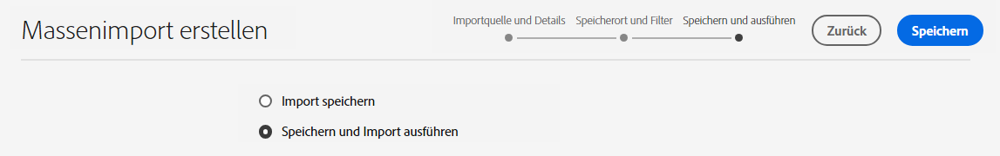
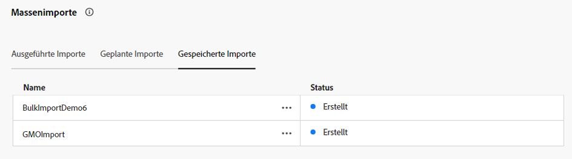
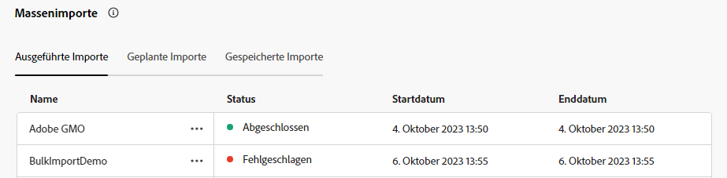
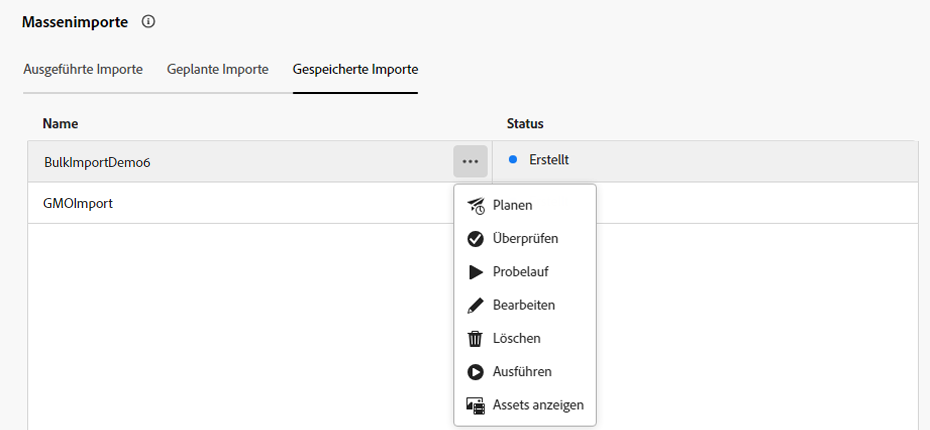

# Massenimport von Assets mithilfe der Assets-Ansicht  {#bulk-import-assets-view}

Der Massenimport in der AEM Assets-Ansicht bietet Admins die Möglichkeit, eine große Anzahl von Assets aus einer Datenquelle in AEM Assets zu importieren. Die Admins müssen keine einzelnen Assets oder Ordner mehr in AEM Assets hochladen.

>[!NOTE]
>
>Der Massenimport für die Assets-Ansicht verwendet dasselbe Backend wie der Massenimport für die Admin-Ansicht. Er bietet jedoch mehr Datenquellen, aus denen importiert werden kann, und ein optimiertes Anwendererlebnis.

Sie können Assets aus den folgenden Datenquellen importieren:

* Azure
* AWS
* Google Cloud
* Dropbox
* OneDrive

## Voraussetzungen {#prerequisites}

| Datenquelle | Voraussetzungen |
|-----|------|
| Azure | <ul> <li>Azure-Speicherkonto </li> <li> Azure-Blob-Container <li> Azure-Zugriffsschlüssel oder SAS-Token basierend auf dem Authentifizierungsmodus </li></ul> |
| AWS | <ul> <li>AWS-Region </li> <li> AWS-Bucket <li> AWS-Zugriffsschlüssel </li><li> AWS-Zugriffsgeheimnis </li></ul> |
| Google Cloud | <ul> <li>GCP-Bucket </li> <li> E-Mail für GCP-Service-Konto <li> Privater Schlüssel für GCP-Service-Konto</li></ul> |
| Dropbox | <ul> <li>Dropbox-Client-ID (App-Schlüssel) </li> <li> Dropbox Client Secret (App-Geheimnis)</li></ul> |
| OneDrive | <ul> <li>OneDrive-Mandantenkennung  </li> <li> OneDrive-Client-ID</li><li> OneDrive Client Secret</li></ul> |

Zusätzlich zu diesen Voraussetzungen, die auf der Datenquelle basieren, müssen Sie den in Ihrer Datenquelle verfügbaren Namen des Quellordners kennen, der alle Assets enthält, die in AEM Assets importiert werden müssen.

## Konfigurieren der Dropbox-Entwickleranwendung {#dropbox-developer-application}

Bevor Sie Assets aus Ihrem Dropbox-Konto in AEM Assets importieren, erstellen und konfigurieren Sie die Dropbox-Entwickleranwendung.

Führen Sie die folgenden Schritte aus:

1. Melden Sie sich bei Ihrem [Dropbox-Konto](https://www.dropbox.com/developers) und klicken **[!UICONTROL Apps erstellen]**.

1. Im **[!UICONTROL API auswählen]** wählen Sie das einzige verfügbare Optionsfeld aus.

1. Im **[!UICONTROL Wählen Sie den benötigten Zugriffstyp aus.]** eine der folgenden Optionen auswählen:

   * Auswählen **[!UICONTROL App-Ordner]**, wenn Sie Zugriff auf einen einzelnen Ordner benötigen, der in Ihrer Anwendung in Ihrem Dropbox-Konto erstellt wurde.

   * Auswählen **[!UICONTROL Vollständige Dropbox]**, wenn Sie Zugriff auf alle Dateien und Ordner in Ihrem Dropbox-Konto benötigen.

1. Geben Sie einen Namen für Ihre Anwendung ein und klicken Sie auf **[!UICONTROL App erstellen]**.

1. Im **[!UICONTROL Einstellungen]** in der Anwendung Folgendes hinzufügen, **[!UICONTROL Umleitungs-URIs]** Abschnitt:

   * https://exc-unifiedcontent.experience.adobe.net

   * https://exc-unifiedcontent.experience-stage.adobe.net (nur für Staging-Umgebungen gültig)

1. Kopieren Sie die Werte für die **[!UICONTROL App-Schlüssel]** und **[!UICONTROL App-Geheimnis]** -Felder. Die Werte sind beim Konfigurieren des Tools für den Massenimport in AEM Assets erforderlich.

1. Im **[!UICONTROL Berechtigungen]** Fügen Sie die folgenden Berechtigungen im **[!UICONTROL Individuelle Bereiche]** Abschnitt.

   * account_info.read

   * files.metadata.read

   * files.content.read

   * files.content.write

1. Klicks **[!UICONTROL Einsenden]** , um die Änderungen zu speichern.

## Konfigurieren der OneDrive-Entwickleranwendung {#onedrive-developer-application}

Bevor Sie Assets aus Ihrem OneDrive-Konto in AEM Assets importieren, erstellen und konfigurieren Sie die OneDrive-Entwickleranwendung.

Führen Sie die folgenden Schritte aus:

1. Melden Sie sich bei Ihrem [OneDrive-Konto](https://portal.azure.com/#view/Microsoft_AAD_RegisteredApps/ApplicationsListBlade) und klicken **[!UICONTROL Neue Registrierung]**.

1. Geben Sie einen Namen für die Anwendung an, wählen Sie **[!UICONTROL Nur Konten in diesem Organisationsverzeichnis (nur Adobe - Einzelmandant)]** von **[!UICONTROL Unterstützte Kontotypen]** und klicken Sie auf **[!UICONTROL registrieren]**. Die Anwendung wurde erfolgreich erstellt.

1. Kopieren Sie die Werte für die Felder Client-ID der Anwendung und Mandanten-ID . Die Werte sind beim Konfigurieren des Tools für den Massenimport in AEM Assets erforderlich.

1. Führen Sie die folgenden Schritte aus, um ein Zertifikat hinzuzufügen:
   1. Klicken Sie auf der Übersichtsseite der Anwendung auf **[!UICONTROL Zertifikat oder Geheimnis hinzufügen]** und klicken Sie anschließend auf **[!UICONTROL Neues Client-Geheimnis]**.
   1. Geben Sie die Client-geheime Beschreibung und den Ablauf an und klicken Sie auf **[!UICONTROL Hinzufügen]**.
   1. Kopieren Sie nach der Erstellung des Client-Geheimnisses die **[!UICONTROL Wert]** (Kopieren Sie nicht das Feld Geheimnis-ID ). Dies ist beim Konfigurieren des Massenimports in AEM Assets erforderlich.

1. Führen Sie die folgenden Schritte aus, um Umleitungs-URIs hinzuzufügen:
   1. Klicken Sie auf der Übersichtsseite der Anwendung auf **[!UICONTROL Hinzufügen eines Umleitungs-URI]** > **[!UICONTROL Plattform hinzufügen]** > **[!UICONTROL Web]**.
   1. Fügen Sie Folgendes zum **[!UICONTROL Umleitungs-URIs]** Abschnitt:

      * https://exc-unifiedcontent.experience.adobe.net

      * https://exc-unifiedcontent.experience-stage.adobe.net (nur für Staging-Umgebungen gültig)

      Fügen Sie den ersten URI hinzu und klicken Sie auf **[!UICONTROL Konfigurieren]** , um es hinzuzufügen. Sie können weitere hinzufügen, indem Sie auf **[!UICONTROL URI hinzufügen]** -Option verfügbar im **[!UICONTROL Web]** im Abschnitt **[!UICONTROL Authentifizierung]** Seite.

1. Führen Sie die folgenden Schritte aus, um API-Berechtigungen für die Anwendung hinzuzufügen:
   1. Klicks **[!UICONTROL API-Genehmigungen]** im linken Bereich auf **[!UICONTROL Berechtigung hinzufügen]**.
   1. Klicks **[!UICONTROL Microsoft-Diagramm]** > **[!UICONTROL Delegierte Berechtigungen]**. Die **[!UICONTROL Berechtigung auswählen]** -Abschnitt zeigt die verfügbaren Berechtigungen an.
   1. Auswählen `offline_access` Berechtigung von `OpenId permissions` und `Files.ReadWrite.All` Berechtigung von `Files`.
   1. Klicks **[!UICONTROL Berechtigungen hinzufügen]** , um die Aktualisierungen zu speichern.

## Erstellen einer Konfiguration für den Massenimport {#create-bulk-import-configuration}

Führen Sie die folgenden Schritte aus, um eine Konfiguration für den Massenimport zu erstellen:

1. Navigieren Sie zu **[!UICONTROL Einstellungen]** > **[!UICONTROL Massenimport]** und klicken Sie auf **[!UICONTROL Import erstellen]**.
1. Wählen Sie die Datenquelle aus. Zu den verfügbaren Optionen gehören Azure, AWS, Google Cloud und Dropbox.
1. Geben Sie im Feld **[!UICONTROL Name]** einen Namen für die Konfiguration des Massenimports an.
1. Geben Sie die datenquellenspezifischen Anmeldeinformationen an, wie unter [Voraussetzungen](#prerequisites) beschrieben.
1. Geben Sie den Namen des Ordners an, der Assets in der Datenquelle im Ordner **[!UICONTROL Quellordner]** -Feld.

   >[!NOTE]
   >
   >Wenn Sie Dropbox als Datenquelle verwenden, geben Sie den Quellordnerpfad anhand der folgenden Regeln an:
   >* Wenn Sie **Vollständige Dropbox** beim Erstellen der Dropbox-Anwendung und des Ordners, der die Assets enthält, ist vorhanden unter `https://www.dropbox.com/home/bulkimport-assets`, geben Sie `bulkimport-assets` im **[!UICONTROL Quellordner]** -Feld.
   >* Wenn Sie **App-Ordner** beim Erstellen der Dropbox-Anwendung und des Ordners, der die Assets enthält, ist vorhanden unter `https://www.dropbox.com/home/Apps/BulkImportAppFolderScope/bulkimport-assets`, geben Sie `bulkimport-assets` im **[!UICONTROL Quellordner]** Feld, wobei `BulkImportAppFolderScope` bezieht sich auf den Namen der Anwendung. `Apps` wird automatisch hinzugefügt nach `home` in diesem Fall.

1. (Optional) Wählen Sie die Option **[!UICONTROL Quelldatei nach Import löschen]** aus, um die Originaldateien aus dem Quelldatenspeicher zu löschen, nachdem die Dateien in Experience Manager Assets importiert wurden.
1. Wählen Sie den **[!UICONTROL Importmodus]**. Wählen Sie **[!UICONTROL Überspringen]**, **[!UICONTROL Ersetzen]** oder **[!UICONTROL Version erstellen]**. Der Modus „Überspringen“ ist der Standardmodus. In diesem Modus überspringt das Aufnahme-Tool den Import eines Assets, wenn es bereits vorhanden ist.
   

1. (Optional) Geben Sie die zu importierende Metadatendatei im CSV-Format im Feld „Metadatendatei“ an und klicken Sie auf **[!UICONTROL Weiter]**, um zu **[!UICONTROL Speicherort und Filter]** zu navigieren.
1. Um einen Speicherort in DAM zu definieren, in den Assets importiert werden sollen, geben Sie im Feld **[!UICONTROL Zielordner für Assets]** einen Pfad an. Zum Beispiel: `/content/dam/imported_assets`.
1. (Optional) Geben Sie im Abschnitt **[!UICONTROL Filter wählen]** im Feld **[!UICONTROL Filtern nach Mindestgröße]** die minimale Dateigröße der Assets in MB an, die in den Aufnahmeprozess einbezogen werden sollen.
1. (Optional) Geben Sie im Feld **[!UICONTROL Filtern nach max. Größe]** die maximale Dateigröße der Assets in MB an, die in den Aufnahmeprozess einbezogen werden sollen.
1. (Optional) Wählen Sie mithilfe des Felds **[!UICONTROL MIME-Typ einschließen]** die MIME-Typen aus, die in den Aufnahmeprozess miteinbezogen werden sollen. In diesem Feld können Sie mehrere MIME-Typen auswählen. Wenn Sie keinen Wert definieren, werden alle MIME-Typen in den Aufnahmeprozess einbezogen.

1. (Optional) Wählen Sie mithilfe des Feldes **[!UICONTROL MIME-Typ ausschließen]** die MIME-Typen aus, die ausgeschlossen werden sollen. In diesem Feld können Sie mehrere MIME-Typen auswählen. Wenn Sie keinen Wert definieren, werden alle MIME-Typen in den Aufnahmeprozess einbezogen.

   

1. Klicken Sie auf **[!UICONTROL Weiter]**. Wählen Sie **[!UICONTROL Import speichern und ausführen]** aus, um die Konfiguration zu speichern und den Massenimport auszuführen. Wählen Sie **[!UICONTROL Import speichern]** aus, um die Konfiguration vorerst zu speichern, damit Sie ihn später ausführen können.

   

1. Klicken Sie auf **[!UICONTROL Speichern]**, um die ausgewählte Option auszuführen.

### Umgang mit Dateinamen beim Massenimport {#filename-handling-bulkimport-assets-view}

Wenn Sie Assets oder Ordner massenhaft importieren, importiert [!DNL Experience Manager Assets] die gesamte Struktur dessen, was in der Importquelle vorhanden ist. [!DNL Experience Manager] befolgt die integrierten Regeln für Sonderzeichen in den Asset- und Ordnernamen. Daher müssen diese Dateinamen bereinigt werden. Sowohl für den Ordnernamen als auch für den Asset-Namen bleibt der von den Benutzerinnen oder Benutzern definierte Titel unverändert und wird in `jcr:title` gespeichert.

Während des Massenimports sucht [!DNL Experience Manager] nach den vorhandenen Ordnern, um das erneute Importieren der Assets und Ordner zu vermeiden, und überprüft auch die Bereinigungsregeln, die im übergeordneten Ordner angewendet werden, in dem der Import stattfindet. Wenn die Bereinigungsregeln im übergeordneten Ordner angewendet werden, werden dieselben Regeln auf die Importquelle angewendet. Für neue Importe werden die folgenden Bereinigungsregeln angewendet, um die Dateinamen von Assets und Ordnern zu verwalten.

Weitere Informationen zu unzulässigen Namen, zum Umgang mit Asset-Namen und zum Umgang mit Ordnernamen beim Massenimport finden Sie unter [Umgang mit Dateinamen beim Massenimport in der Admin-Ansicht](add-assets.md##filename-handling-bulkimport).

## Anzeigen der vorhandenen Massenimportkonfigurationen {#view-import-configuration}

Wenn Sie die Konfiguration speichern, nachdem Sie sie erstellt haben, wird die Konfiguration auf der Registerkarte **[!UICONTROL Gespeicherte Importe]** angezeigt.

Wenn Sie speichern und den Import ausführen, wird die Importkonfiguration auf der Registerkarte **[!UICONTROL Ausgeführte Importe]** angezeigt.

Wenn Sie einen Import planen, wird er auf der Registerkarte **[!UICONTROL Geplante Importe]** angezeigt.

## Bearbeiten einer Massenimportkonfiguration {#edit-import-configuration}

Um die Konfigurationsdetails zu bearbeiten, klicken Sie auf Mehr Optionen (...), die dem Konfigurationsnamen entsprechen, und klicken Sie auf **[!UICONTROL Bearbeiten]**. Sie können den Titel der Konfiguration und die Importdatenquelle beim Ausführen des Bearbeitungsvorgangs nicht bearbeiten. Sie können die Konfiguration mit den Registerkarten „Ausgeführte Importe“, „Geplante Importe“ oder „Gespeicherte Importe“ bearbeiten.

## Planen von einmaligen oder wiederkehrenden Importen {#schedule-imports}

Gehen Sie wie folgt vor, um einen einmaligen oder einen wiederkehrenden Massenimport zu planen:

1. Klicken Sie auf Mehr Optionen (..) , die dem Konfigurationsnamen entsprechen, der in der **[!UICONTROL Ausgeführte Importe]** oder **[!UICONTROL Gespeicherte Importe]** Registerkarte und klicken Sie auf **[!UICONTROL Zeitplan]**. Sie können auch einen vorhandenen geplanten Import neu planen, indem Sie zur Registerkarte **[!UICONTROL Geplante Importe]** gehen und auf **[!UICONTROL Planen]** klicken.

1. Legen Sie eine einmalige Aufnahme fest oder erstellen Sie einen stündlichen, täglichen oder wöchentlichen Zeitplan. Klicken Sie auf **[!UICONTROL Senden]**.

   

## Durchführen einer Konsistenzprüfung für den Import {#import-health-check}

Um die Verbindung zur Datenquelle zu überprüfen, klicken Sie auf Mehr Optionen (..), die dem Konfigurationsnamen entsprechen, und klicken Sie dann auf **[!UICONTROL Überprüfen]**. Wenn die Verbindung erfolgreich hergestellt wurde, zeigt Experience Manager Assets die folgende Meldung an:

## Führen Sie vor dem Ausführen eines Imports einen Probelauf durch. {#dry-run-bulk-import}

Klicken Sie auf Mehr Optionen (..) neben dem Konfigurationsnamen und klicken Sie auf **[!UICONTROL Trockenlauf]** , um einen Testlauf für den Massenimportauftrag aufzurufen. Experience Manager Assets zeigt die folgenden Details zum Massenimportvorgang an:

## Ausführen eines Massenimports {#run-bulk-import}

Wenn Sie den Import während der Erstellung der Konfiguration gespeichert haben, können Sie zur Registerkarte Gespeicherte Importe navigieren, auf der der Konfiguration entsprechenden Schaltfläche Mehr Optionen (..) klicken und auf **[!UICONTROL Ausführen]**.

Wenn Sie einen bereits ausgeführten Import ausführen müssen, navigieren Sie zur Registerkarte Ausgeführte Importe , klicken Sie auf Mehr Optionen (...) , die dem Konfigurationsnamen entsprechen, und klicken Sie auf **[!UICONTROL Ausführen]**.

## Stoppen oder Planen eines laufenden Imports {#schedule-stop-ongoing-report}

Sie können einen fortlaufenden Massenimport planen oder stoppen, indem Sie das Dialogfeld mit dem Massenimport-Status verwenden, das während eines Imports auf der Startseite des Massenimports angezeigt wird.

Sie können auch die im Zielordner importierten Assets anzeigen, indem Sie auf **[!UICONTROL Assets anzeigen]** klicken.

## Löschen einer Konfiguration für den Massenimport {#delete-bulk-import-configuration}

Klicken Sie auf Mehr Optionen (...), die dem in vorhandenen Konfigurationsnamen entsprechen. **[!UICONTROL Ausgeführte Importe]**, **[!UICONTROL Geplante Importe]** oder **[!UICONTROL Gespeicherte Importe]** Registerkarten und klicken Sie **[!UICONTROL Löschen]** , um die Konfiguration Massenimport zu löschen.

## Navigieren zu Assets nach einem Massenimport {#view-assets-after-bulk-import}

Um den Zielspeicherort für Assets anzuzeigen, in den die Assets importiert werden, nachdem der Massenimportauftrag ausgeführt wurde, klicken Sie auf Mehr Optionen (..) , der dem Konfigurationsnamen entspricht, und klicken Sie dann auf **[!UICONTROL Anzeigen von Assets]**.
