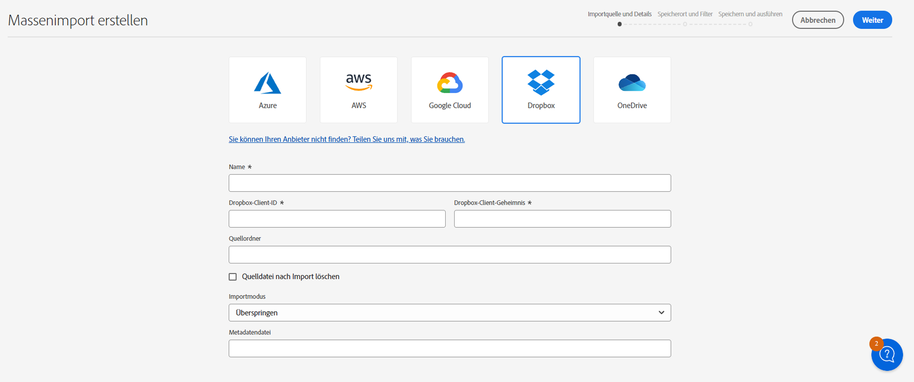

# Massenimport von Assets mithilfe der Asset-Ansicht  {#bulk-import-assets-view}

Der Massenimport in die AEM Assets-Ansicht bietet Administratoren die Möglichkeit, eine große Anzahl von Assets aus einer Datenquelle in AEM Assets zu importieren. Administratoren müssen keine einzelnen Assets oder Ordner mehr in AEM Assets hochladen.

>[!NOTE]
>
>Das Bulk Importer für die Asset-Ansicht verwendet dasselbe Backend wie das Bulk Importer für die Admin-Ansicht. Es bietet jedoch mehr Datenquellen, aus denen importiert werden kann, und eine optimierte Benutzererfahrung.

Sie können Assets aus den folgenden Datenquellen importieren:

* Azure
* AWS
* Google Cloud
* Dropbox

## Voraussetzungen {#prerequisites}

| Datenquelle | Voraussetzungen |
|-----|------|
| Azure | <ul> <li>Azure-Speicherkonto </li> <li> Azure-Blob-Container <li> Azure Access Key oder SAS Token basierend auf dem Authentifizierungsmodus </li></ul> |
| AWS | <ul> <li>AWS-Region </li> <li> AWS-Bucket <li> AWS-Zugriffsschlüssel </li><li> AWS-Zugriffsgeheimnis </li></ul> |
| Google Cloud | <ul> <li>GCP-Bucket </li> <li> E-Mail für GCP-Service-Konto <li> Privater Schlüssel für GCP-Service-Konto</li></ul> |
| Dropbox | <ul> <li>Dropbox-Client-ID </li> <li> Dropbox Client Secret</li></ul> |

Zusätzlich zu diesen Voraussetzungen, die auf der Datenquelle basieren, müssen Sie den in Ihrer Datenquelle verfügbaren Quellordnernamen kennen, der alle Assets enthält, die in AEM Assets importiert werden müssen.

## Konfiguration für Massenimport erstellen {#create-bulk-import-configuration}

Führen Sie die folgenden Schritte aus, um eine Konfiguration für den Massenimport zu erstellen:

1. Navigieren Sie zu **[!UICONTROL Einstellungen]** > **[!UICONTROL Massenimport]** und klicken **[!UICONTROL Import erstellen]**.
1. Wählen Sie die Datenquelle aus. Zu den verfügbaren Optionen gehören Azure, AWS, Google Cloud und Dropbox.
1. Geben Sie einen Namen für die Massenimportkonfiguration im **[!UICONTROL Name]** -Feld.
1. Geben Sie die datenquellenspezifischen Anmeldeinformationen an, wie unter [Voraussetzungen](#prerequisites).
1. Geben Sie den Namen des Stammordners, der Assets in der Datenquelle enthält, im Feld **[!UICONTROL Quellordner]** an.
1. (Optional) Wählen Sie die **[!UICONTROL Quelldatei nach Import löschen]** Option zum Löschen der Originaldateien aus dem Quelldatenspeicher, nachdem die Dateien in Experience Manager Assets importiert wurden.
1. Wählen Sie den **[!UICONTROL Importmodus]**. Wählen Sie **[!UICONTROL Überspringen]**, **[!UICONTROL Ersetzen]** oder **[!UICONTROL Version erstellen]**. Der Modus &quot;Überspringen&quot;ist der Standardmodus. In diesem Modus überspringt der Aufnahmevorgang den Import eines Assets, sofern es bereits vorhanden ist.
   

1. (Optional) Geben Sie die zu importierende Metadatendatei im CSV-Format im Feld Metadatendatei an und klicken Sie auf **[!UICONTROL Nächste]** , um zu navigieren **[!UICONTROL Standort und Filter]**.
1. So definieren Sie einen Speicherort in DAM, an dem Assets mit dem **[!UICONTROL Asset-Zielordner]** -Feld einen Pfad angeben. Zum Beispiel: `/content/dam/imported_assets`.
1. (Optional) Im **[!UICONTROL Filter auswählen]** -Abschnitt die Mindestdateigröße für Assets in MB angeben, um sie in den Aufnahmeprozess in die **[!UICONTROL Nach Mindestgröße filtern]** -Feld.
1. (Optional) Geben Sie im Feld **[!UICONTROL Nach Maximalgröße filtern]** die maximale Dateigröße der Assets in MB an, die in den Aufnahmeprozess einbezogen werden sollen.
1. (Optional) Wählen Sie mithilfe der **[!UICONTROL MIME-Typ einschließen]** -Feld. In diesem Feld können Sie mehrere MIME-Typen auswählen. Wenn Sie keinen Wert definieren, werden alle MIME-Typen in den Aufnahmeprozess einbezogen.

1. (Optional) Wählen Sie mithilfe der **[!UICONTROL MIME-Typ ausschließen]** -Feld. In diesem Feld können Sie mehrere MIME-Typen auswählen. Wenn Sie keinen Wert definieren, werden alle MIME-Typen in den Aufnahmeprozess einbezogen.

   

1. Klicken Sie auf **[!UICONTROL Weiter]**. Auswählen **[!UICONTROL Import speichern und ausführen]** , um die Konfiguration zu speichern und den Massenimport auszuführen. Auswählen **[!UICONTROL Import speichern]** , um die Konfiguration für jetzt zu speichern, damit Sie sie später ausführen können.

   

1. Klicks **[!UICONTROL Speichern]** , um die ausgewählte Option auszuführen.

### Umgang mit Dateinamen beim Massenimport {#filename-handling-bulkimport-assets-view}

Wenn Sie Assets oder Ordner massenhaft importieren, importiert [!DNL Experience Manager Assets] die gesamte Struktur dessen, was in der Importquelle vorhanden ist. [!DNL Experience Manager] befolgt die integrierten Regeln für Sonderzeichen in den Asset- und Ordnernamen. Daher müssen diese Dateinamen bereinigt werden. Sowohl für den Ordnernamen als auch für den Asset-Namen bleibt der von den Benutzerinnen oder Benutzern definierte Titel unverändert und wird in `jcr:title` gespeichert.

Während des Massenimports sucht [!DNL Experience Manager] nach den vorhandenen Ordnern, um das erneute Importieren der Assets und Ordner zu vermeiden, und überprüft auch die Bereinigungsregeln, die im übergeordneten Ordner angewendet werden, in dem der Import stattfindet. Wenn die Bereinigungsregeln im übergeordneten Ordner angewendet werden, werden dieselben Regeln auf die Importquelle angewendet. Für neue Importe werden die folgenden Bereinigungsregeln angewendet, um die Dateinamen von Assets und Ordnern zu verwalten.

Weitere Informationen zu unzulässigen Namen, zum Umgang mit Asset-Namen und zum Umgang mit Ordnernamen beim Massenimport finden Sie unter [Umgang mit Dateinamen beim Massenimport in der Admin-Ansicht](add-assets.md##filename-handling-bulkimport).

## Vorhandene Massenimportkonfigurationen anzeigen {#view-import-configuration}

Wenn Sie die Konfiguration speichern möchten, nachdem Sie sie erstellt haben, wird die Konfiguration im **[!UICONTROL Gespeicherte Importe]** Registerkarte.

Wenn Sie das Speichern auswählen und den Import ausführen, wird die Importkonfiguration im **[!UICONTROL Ausgeführte Importe]** Registerkarte.

Wenn Sie einen Import planen, wird er im **[!UICONTROL Geplante Importe]** Registerkarte.

## Konfiguration des Massenimports bearbeiten {#edit-import-configuration}

Um die Konfigurationsdetails zu bearbeiten, klicken Sie auf ..., der dem Konfigurationsnamen entspricht, und klicken Sie auf **[!UICONTROL Bearbeiten]**. Sie können den Titel der Konfiguration und die Importdatenquelle beim Ausführen des Bearbeitungsvorgangs nicht bearbeiten. Sie können die Konfiguration mit den Registerkarten &quot;Ausgeführte&quot;, &quot;Geplante&quot;oder &quot;Gespeicherte Importe&quot;bearbeiten.

## Einmalige oder wiederkehrende Importe planen {#schedule-imports}

Gehen Sie wie folgt vor, um einen einmaligen oder einen wiederkehrenden Massenimport zu planen:

1. Klicken Sie auf ... , der dem im Abschnitt **[!UICONTROL Ausgeführte Importe]** oder **[!UICONTROL Gespeicherte Importe]** Registerkarte und klicken Sie auf **[!UICONTROL Zeitplan]**. Sie können auch einen vorhandenen geplanten Import neu planen, indem Sie zu **[!UICONTROL Geplante Importe]** Registerkarte und Klicken **[!UICONTROL Zeitplan]**.

1. Legen Sie eine einmalige Aufnahme fest oder erstellen Sie einen stündlichen, täglichen oder wöchentlichen Zeitplan. Klicken Sie auf **[!UICONTROL Senden]**.

   

## Konsistenzprüfung des Imports durchführen {#import-health-check}

Um die Verbindung zur Datenquelle zu überprüfen, klicken Sie auf ..., der dem Konfigurationsnamen entspricht, und klicken Sie dann auf **[!UICONTROL Überprüfen]**. Wenn die Verbindung erfolgreich hergestellt wurde, zeigt Experience Manager Assets die folgende Meldung an:

## Führen Sie vor dem Ausführen eines Imports einen Testlauf durch. {#dry-run-bulk-import}

Klicken Sie auf ... neben dem Konfigurationsnamen und klicken Sie auf . **[!UICONTROL Trockenlauf]** , um einen Testlauf für den Massenimportauftrag aufzurufen. Experience Manager Assets zeigt die folgenden Details zum Massenimportauftrag an:

## Massenimport ausführen {#run-bulk-import}

Wenn Sie den Import bei der Erstellung der Konfiguration gespeichert haben, können Sie zur Registerkarte Gespeicherte Importe navigieren, auf die der Konfiguration entsprechende Schaltfläche klicken und auf **[!UICONTROL Ausführen]**.

Wenn Sie einen bereits ausgeführten Import ausführen müssen, navigieren Sie zur Registerkarte Ausgeführte Importe , klicken Sie auf ... neben dem Konfigurationsnamen und klicken Sie auf . **[!UICONTROL Ausführen]**.

## Beenden oder planen Sie einen laufenden Import {#schedule-stop-ongoing-report}

Sie können einen fortlaufenden Massenimport planen oder stoppen, indem Sie das Dialogfeld mit dem Massenimport-Status verwenden, das während eines Imports auf der Startseite Massenimport angezeigt wird.

Sie können auch die im Zielordner importierten Assets anzeigen, indem Sie auf **[!UICONTROL Anzeigen von Assets]**.

## Massenimportkonfiguration löschen {#delete-bulk-import-configuration}

Klicken Sie auf ... , der dem in vorhandenen Konfigurationsnamen entspricht. **[!UICONTROL Ausgeführte Importe]**, **[!UICONTROL Geplante Importe]** oder **[!UICONTROL Gespeicherte Importe]** Registerkarten und klicken Sie **[!UICONTROL Löschen]** , um die Konfiguration Massenimport zu löschen.

## Navigieren zu Assets nach einem Massenimport {#view-assets-after-bulk-import}

Um den Zielspeicherort für Assets anzuzeigen, in den die Assets importiert werden, nachdem der Massenimportauftrag ausgeführt wurde, klicken Sie auf ..., der dem Konfigurationsnamen entspricht, und klicken Sie dann auf . **[!UICONTROL Anzeigen von Assets]**.

