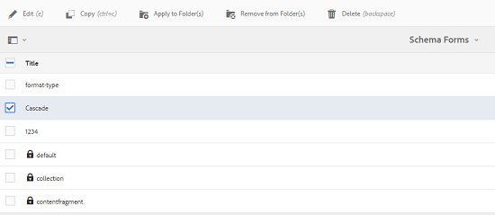

# Kaskadierende Metadaten {#cascading-metadata}

Beim Erfassen der Metadateninformationen eines Assets stellen Benutzende Informationen in den verschiedenen verfügbaren Feldern bereit. Sie können bestimmte Metadatenfelder oder Feldwerte anzeigen, die von den in den anderen Feldern gewählten Optionen abhängig sind. Solche bedingt angezeigten Metadaten werden als „kaskadierende Metadaten“ bezeichnet. Mit anderen Worten: Sie können eine Abhängigkeit zwischen einem bestimmten Metadatenfeld/-wert und einem oder mehreren Feldern und/oder deren Werten schaffen.

Verwenden Sie Metadatenschemata, um Regeln für die Anzeige kaskadierender Metadaten zu definieren. Wenn Ihr Metadatenschema beispielsweise ein Feld vom Typ Asset enthält, können Sie einen entsprechenden Satz von Feldern definieren, die je nach ausgewähltem Asset-Typ angezeigt werden sollen.

Im Folgenden finden Sie einige Anwendungsfälle, für die Sie kaskadierende Metadaten definieren können:

* Wenn der Benutzerstandort erforderlich ist, können Sie die Namen relevanter Städte basierend auf der von Personen angegebenen Land und Bundesland anzeigen.
* Laden Sie relevante Markennamen basierend auf der von Benutzenden ausgewählten Produktgruppe in einer Liste.
* Aktivieren/Deaktivieren Sie die Sichtbarkeit eines bestimmten Felds, basierend auf dem in einem anderen Feld angegebenen Wert. Zeigen Sie beispielsweise separate Felder für die Versandadresse an, wenn Benutzende die Sendung an eine andere Adresse liefern lassen möchten.
* Legen Sie ein Feld basierend auf dem in einem anderen Feld angegebenen Wert als Pflichtfeld fest.
* Ändern Sie die für ein bestimmtes Feld angezeigten Optionen basierend auf dem in einem anderen Feld angegebenen Wert.
* Legen Sie den standardmäßigen Metadatenwert in einem bestimmten Feld basierend auf dem in einem anderen Feld angegebenen Wert fest.

## Erstellen kaskadierender Metadaten in [!DNL Experience Manager] {#configure-cascading-metadata-in-aem}

Stellen Sie sich ein Szenario vor, in dem kaskadierende Metadaten basierend auf dem ausgewählten Asset-Typ angezeigt werden sollen. Beispiele

* Zeigen Sie für ein Video geeignete Felder wie Format, Codec, Dauer usw. an.
* Zeigen Sie für ein Word- oder PDF-Dokument Felder wie Seitenzahl, Autor usw. an.

Zeigen Sie unabhängig vom ausgewählten Asset-Typ die Copyright-Informationen als erforderliches Feld an.

1. Wählen Sie das [!DNL Experience Manager]-Logo aus und navigieren Sie zu **[!UICONTROL Tools]** > **[!UICONTROL Assets]** > **[!UICONTROL Metadatenschemata]**.
1. Wählen Sie auf der Seite **[!UICONTROL Schemaformulare]** ein Schemaformular und dann in der Symbolleiste die Option **[!UICONTROL Bearbeiten]** aus, um das Schema zu bearbeiten.

   

1. (Optional) Erstellen Sie im Metadatenschema-Editor ein Feld zur Konditionalisierung.  Geben Sie auf der Registerkarte **[!UICONTROL Einstellungen]** einen Namen und einen Eigenschaftspfad an. 

   Um eine Registerkarte zu erstellen, wählen Sie `+` aus, um eine Registerkarte sowie anschließend ein Metadatenfeld hinzuzufügen.

   

1. Fügen Sie ein Dropdown-Feld für den Asset-Typ hinzu. Geben Sie einen Namen und einen Eigenschaftspfad auf der Registerkarte **[!UICONTROL Einstellungen]** an. Fügen Sie eine optionale Beschreibung hinzu.

   

1. Schlüssel-Wert-Paare sind die Optionen, die einem Formularbenutzenden zur Verfügung gestellt werden. Sie können die Schlüssel-Wert-Paare entweder manuell oder aus einer JSON-Datei bereitstellen.

   * Um die Werte manuell anzugeben, wählen Sie **[!UICONTROL Manuell hinzufügen]** und **[!UICONTROL Auswahl hinzufügen]** aus und geben Sie den Optionstext und -wert an. Legen Sie z. B. die Asset-Typen „Video“, „PDF“, „Wort“ und „Bild“ fest.

   * Um die Werte dynamisch aus einer JSON-Datei abzurufen, wählen Sie **[!UICONTROL Über JSON-Pfad hinzufügen]** aus und geben Sie den Pfad einer JSON-Datei an. [!DNL Experience Manager] ruft die Schlüssel-Wert-Paare in Echtzeit ab, wenn das Formular dem Anwender angezeigt wird.

   Beide Optionen schließen sich gegenseitig aus. Sie können die Optionen nicht aus einer JSON-Datei importieren und manuell bearbeiten.

   

   >[!NOTE]
   >
   >Wenn Sie eine JSON-Datei hinzufügen, werden die Schlüssel-Wert-Paare nicht im Metadatenschema-Editor angezeigt, sind jedoch im veröffentlichten Formular verfügbar.

   >[!NOTE]
   >
   >Wenn Sie Auswahlmöglichkeiten hinzufügen, wird beim Klicken auf das Popup-Feld die Benutzeroberfläche verzerrt dargestellt und das Löschsymbol für die Auswahlmöglichkeiten funktioniert nicht mehr. Klicken Sie nicht auf das Dropdown-Element, bis Sie die Änderungen gespeichert haben. Wenn dieses Problem auftritt, speichern Sie das Schema und öffnen Sie es erneut, um die Bearbeitung fortzusetzen.

1. (Optional) Fügen Sie die anderen erforderlichen Felder hinzu. Beispielsweise das Format, den Codec und die Dauer für den Asset-Typ „Video“.

   Fügen Sie auf ähnliche Weise abhängige Felder für andere Asset-Typen hinzu. Fügen Sie bei Dokumenten-Assets wie PDF- und Word-Dateien beispielsweise die Felder „Seitenanzahl“ und „Autor“ hinzu.

   

1. Um eine Abhängigkeit zwischen dem Feld „Asset-Typ“ und anderen Feldern zu erstellen, wählen Sie das abhängige Feld aus und öffnen Sie die Registerkarte **[!UICONTROL Regeln]**.

   

1. Wählen Sie unter **[!UICONTROL Anforderung]** die Option **[!UICONTROL Erforderlich, basierend auf neuer Regel]** aus.
1. Wählen Sie **[!UICONTROL Regel hinzufügen]** und dann das Feld **[!UICONTROL Asset-Typ]** aus, um eine Abhängigkeit zu erstellen. Wählen Sie außerdem den Feldwert aus, für den die Abhängigkeit erstellt werden soll. Wählen Sie in diesem Fall **[!UICONTROL Video]** aus. Wählen Sie **[!UICONTROL Fertig]**, um die Änderungen zu speichern.

   

   >[!NOTE]
   >
   >Dropdown-Menüs mit manuell vordefinierten Werten können mit Regeln verwendet werden. Dropdown-Menüs mit konfiguriertem JSON-Pfad können nicht mit Regeln verwendet werden, die vordefinierte Werte zur Anwendung von Bedingungen nutzen. Wenn die Werte zur Laufzeit aus einer JSON-Datei geladen werden, ist es nicht möglich, vordefinierte Regeln anzuwenden.

1. Wählen Sie unter **[!UICONTROL Sichtbarkeit]** die Option **[!UICONTROL Sichtbar, basierend auf neuer Regel]** aus.

1. Wählen Sie **[!UICONTROL Regel hinzufügen]** und dann das Feld **[!UICONTROL Asset-Typ]** aus, um eine Abhängigkeit zu erstellen. Wählen Sie auch den Feldwert, auf dessen Grundlage die Abhängigkeit erstellt werden soll. Wählen Sie in diesem Fall **[!UICONTROL Video]** aus. Wählen Sie **[!UICONTROL Fertig]**, um die Änderungen zu speichern.

   

   >[!CAUTION]
   >
   >Wählen Sie zum Zurücksetzen der Werte eine beliebige Stelle auf der Benutzeroberfläche aus, die nicht die Werte enthält. Nachdem die Werte zurückgesetzt wurden, wählen Sie die Werte erneut aus.

   >[!NOTE]
   >
   >Sie können die Bedingungen **[!UICONTROL Anforderung]** und **[!UICONTROL Sichtbarkeit]** unabhängig voneinander anwenden.

1. Erstellen Sie auf ähnliche Weise eine Abhängigkeit zwischen dem Wert „Video“ im Feld „Asset-Typ“ und anderen Feldern wie „Codec“ und „Dauer“.
1. Wiederholen Sie die Schritte, um eine Abhängigkeit zwischen Dokumenten-Assets (PDF und Word) im Feld [!UICONTROL Asset-Typ] und Feldern wie [!UICONTROL Seitenzahl] und [!UICONTROL Autor] zu erstellen.
1. Klicken Sie auf **[!UICONTROL Speichern]**. Wenden Sie das Metadatenschema auf einen Ordner an.

1. Navigieren Sie zu dem Ordner, auf den Sie das Metadatenschema angewendet haben, und öffnen Sie die Eigenschaftenseite eines Assets. Je nach Ihrer Auswahl im Feld „Asset-Typ“ werden relevante kaskadierende Metadatenfelder angezeigt.

   
   *Abbildung: Kaskadierende Metadaten für Video-Assets*

   
   *Abbildung: Kaskadierende Metadaten für Dokumenten-Assets*

**Siehe auch**

* [Assets übersetzen](translate-assets.md)
* [Assets-HTTP-API](mac-api-assets.md)
* [Von AEM Assets unterstützte Dateiformate](file-format-support.md)
* [Suchen von Assets](search-assets.md)
* [Connected Assets](use-assets-across-connected-assets-instances.md)
* [Asset-Berichte](asset-reports.md)
* [Metadatenschemata](metadata-schemas.md)
* [Herunterladen von Assets](download-assets-from-aem.md)
* [Verwalten von Metadaten](manage-metadata.md)
* [Suchfacetten](search-facets.md)
* [Verwalten von Sammlungen](manage-collections.md)
* [Massenimport von Metadaten](metadata-import-export.md)
* [Veröffentlichen von Assets in AEM und Dynamic Media](/help/assets/publish-assets-to-aem-and-dm.md)
