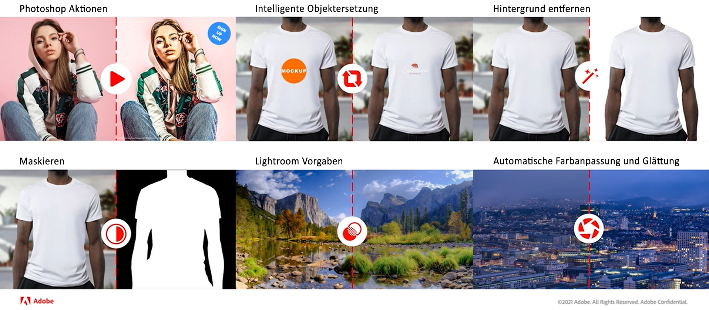

# Generieren von Varianten von Assets mithilfe der Integration von [!DNL Adobe Creative Cloud] {#content-automation}

Das Add-on zur Inhaltsautomatisierung integriert [!DNL Adobe Experience Manager Assets as a Cloud Service]- und [!DNL Adobe Creative Cloud]-APIs, um Ihre Assets im Maßstab kreativ zu verarbeiten. [!DNL Experience Manager] verwendet Cloud-basierte  [Asset-](/help/assets/asset-microservices-overview.md) Microservices, um die  [!DNL Adobe Creative Cloud] Funktionen zu verwenden und die Asset-Erstellung und Medienverarbeitung zu automatisieren.

Um Assets in [!DNL Adobe Photoshop] und [!DNL Adobe Lightroom] zu bearbeiten, müssen Sie keine Assets von [!DNL Experience Manager Assets] herunterladen, sie bearbeiten und erneut hochladen. Sie erstellen und konfigurieren ein Verarbeitungsprofil in [!DNL Experience Manager], wenden das Profil auf einen Ordner an und laden die Assets in den Ordner hoch. Ihre hochgeladenen Assets werden basierend auf den Verarbeitungsprofilen erneut verarbeitet und Sie erhalten Varianten dieser Assets. Die konsistente und mühelose Massenverarbeitung spart manuelle Arbeit und erhöht die Content-Geschwindigkeit, auch das ohne die Notwendigkeit von kreativen Fähigkeiten. Außerdem können die Entwickler und Partner die Asset-Microservices mit direktem Zugriff auf diese APIs erweitern und benutzerdefinierte Logik einschließen.

Benutzer können Verarbeitungsprofile erstellen, um die folgenden kreativen Vorgänge für ihre Assets zu automatisieren:\

* **Auto-Ton**: Verwendet künstliche Intelligenz, um den Inhalt des Bildes zu analysieren und basierend auf den einzigartigen Eigenschaften des Bildes intelligent Licht- und Farbkorrekturen vorzunehmen.
* **Auto-Upright**: Verwendet künstliche Intelligenz, um den Inhalt des Bildes zu analysieren und verzerrte Perspektiven in Bildern zu korrigieren. So erstellen Sie beispielsweise Horizonte auf Ebene.
* **Lightroom-Vorgaben**: Wendet einen benutzerdefinierten Look auf Bilder an, um ein konsistentes Erscheinungsbild mit benutzerdefinierten Vorgaben zu erzielen.
* **Bild-Cutout**: Verwendet künstliche Intelligenz, um Auswahlmöglichkeiten für Alison-Objekte zu erstellen und Hintergrund mit einem einzigen Befehl zu entfernen.
* **Bildmaske**: Verwendet künstliche Intelligenz zum Erstellen von Masken um visuelle Objekte mit einem einzigen Befehl.
* **Photoshop-Aktionen**: Wendet eine Reihe von Aufgaben (in Photoshop) auf eine Datei oder einen Dateistapel an.
* **Smart Object Replacement**: Personalisierung im Maßstab, indem Sie Bilder austauschen und dabei alle Effekte und Anpassungen beibehalten, die in einer PSD-Datei vorgenommen werden.

## Verwenden eines Verarbeitungsprofils, um Ihre kreativen Assets stapelweise zu bearbeiten {#process-assets}

Gehen Sie wie folgt vor, um mithilfe von Verarbeitungsprofilen automatisch Varianten zu erstellen:

1. Wenden Sie sich an [Adobe Customer Care](https://experienceleague.adobe.com/#support), um die Lizenz zu erhalten.

1. Navigieren Sie zu **[!UICONTROL Tools]** > **[!UICONTROL Assets]** > **[!UICONTROL Verarbeitungsprofile]**.

1. Wählen Sie **[!UICONTROL Erstellen]** und geben Sie einen **[!UICONTROL Namen]** an.

1. Wählen Sie die Registerkarte **[!UICONTROL Creative]** aus, geben Sie den Ausgabeordner an und wählen Sie **[!UICONTROL Neu hinzufügen]** aus, um eine kreative Konfiguration hinzuzufügen.

1. Geben Sie **[!UICONTROL Ausgabedarstellungsname]** (oder Ausgabename), **[!UICONTROL Erweiterung]** (oder Dateityp), wählen Sie **[!UICONTROL Qualität]** (oder Ausgabeparameter), wählen Sie **[!UICONTROL Includes]** und **[!UICONTROL Excludes]** MIME-Listen (oder Eingabe-Asset-Filter) und wählen Sie die erforderlichen operation. 

   

1. Einige Vorgänge erfordern zusätzliche Parameter (Asset). Geben Sie bei Bedarf Werte für diese zusätzlichen Parameter an.

1. Fügen Sie weitere kreative Vorgänge als Teil desselben Verarbeitungsprofils hinzu oder speichern Sie das Profil.

1. Wenden Sie das Verarbeitungsprofil auf einen Ordner an. Wählen Sie auf der Seite **[!UICONTROL Eigenschaften]** eines Ordners **[!UICONTROL Asset-Verarbeitung]** und wählen Sie das anzuwendende Verarbeitungsprofil aus.

Nachdem das Verarbeitungsprofil auf einen DAM-Ordner angewendet wurde, führen alle in diesen Ordner hochgeladenen oder aktualisierten Assets zusätzlich zur Standardverarbeitung die definierten Vorgänge aus. Die Unterordner übernehmen dieselben Profile wie auf die übergeordneten Ordner angewendet. Benutzer können diese Vererbung überschreiben.

Um die vorhandenen Assets zu verarbeiten, wählen Sie die Assets aus, wählen Sie die Option **[!UICONTROL Neu verarbeiten]** und wählen Sie dann das erforderliche Verarbeitungsprofil aus.

## Tipps und Einschränkungen {#limitations-best-practices}

* [!DNL Experience Manager] begrenzt die Asset-Verarbeitung auf 300 Anforderungen pro Minute und 700 Anforderungen pro Minute und Organisation.
* Die Dateigröße ist bei API-Vorgängen von [!DNL Adobe Photoshop] auf 4 GB und bei [!DNL Adobe Lightroom]-Vorgängen auf 1 GB beschränkt.

>[!MORELIKETHIS]
>
>* [Konfigurieren und verwenden Sie Asset-Microservices über Verarbeitungsprofile](/help/assets/asset-microservices-configure-and-use.md).
>* [ [!DNL Experience Manager] Integrieren mit [!DNL Creative Cloud]](/help/assets/aem-cc-integration-best-practices.md).
>* [Asset-Erfassung und -Verarbeitung mit Asset-Microservices: Eine Übersicht](/help/assets/asset-microservices-overview.md).

