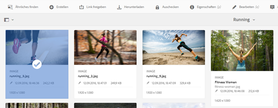
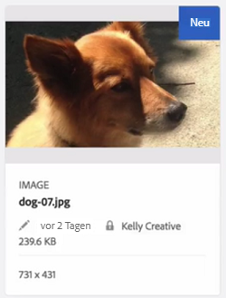
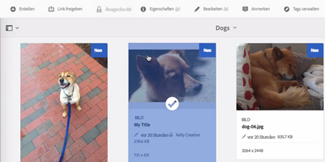
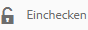

# Ein- und Auschecken von Dateien in Assets {#check-in-and-check-out-files-in-assets}

Mit Adobe Experience Manager (AEM) Assets können Sie Assets zum Bearbeiten auschecken und dann wieder einchecken, wenn Sie keine weiteren Änderungen vornehmen möchten. Wenn Sie ein Asset ausgecheckt haben, können nur Sie das Asset bearbeiten, mit Anmerkungen versehen, veröffentlichen, verschieben oder löschen. Beim Auschecken eines Assets wird das Asset gesperrt. Andere Benutzer können diese Vorgänge erst dann für das Asset ausführen, wenn Sie das Asset wieder in AEM Assets eingecheckt haben. Allerdings können Sie nach wie vor die Metadaten für das gesperrte Asset ändern.

Um Assets aus-/einchecken zu können, benötigen Sie entsprechenden Schreibzugriff.

Mithilfe dieser Funktion können Sie verhindern, dass Benutzer die von einem Autor vorgenommenen Änderungen überschreiben, wenn mehrere Benutzer Team-übergreifend im Rahmen von Bearbeitungs-Workflows zusammenarbeiten.

## Auschecken von Assets  {#checking-out-assets}

1. Wählen Sie in der Assets-Benutzeroberfläche das Asset aus, das ausgecheckt werden soll. Sie können auch mehrere Assets zum Auschecken auswählen.

   

1. Klicken Sie in der Symbolleiste auf das Symbol **[!UICONTROL Auschecken]**.

   

   Das Symbol **[!UICONTROL Auschecken]** verändert sich zum Symbol **[!UICONTROL Einchecken]** mit geöffnetem Schloss.

   

   Um zu überprüfen, ob andere Benutzer das von Ihnen ausgecheckte Asset bearbeiten können, melden Sie sich unter einem anderen Benutzernamen an. Ein Schlosssymbol wird auf der Miniatur des Assets angezeigt, das Sie ausgecheckt haben.

   

   Wählen Sie das Asset aus. In der Symbolleiste werden keine Optionen zum Bearbeiten, Kommentieren, Veröffentlichen oder Löschen des Assets angezeigt.

   

   Sie können jedoch auf das Symbol **[!UICONTROL Eigenschaften anzeigen]** klicken/tippen, um die Metadaten für das gesperrte Asset zu bearbeiten.

1. Klicken/tippen Sie auf das Symbol „Bearbeiten“, um das Asset im Bearbeitungsmodus zu öffnen.

   

1. Bearbeiten Sie das Asset und speichern Sie die Änderungen. Schneiden Sie beispielsweise das Bild zu und speichern Sie es.

   

   Sie können das Asset auch mit Anmerkungen versehen oder es veröffentlichen.

1. Wählen Sie das bearbeitete Asset in der Assets-Benutzeroberfläche aus und klicken Sie auf das Symbol **[!UICONTROL Checkin]** in der Symbolleiste.

   

   Das geänderte Asset wird in AEM Assets eingecheckt und steht anderen Benutzern zur Bearbeitung zur Verfügung.

## Erzwungenes Einchecken {#forced-check-in}

Administratoren können von anderen Benutzern ausgecheckte Assets einchecken.

1. Melden Sie sich bei AEM Assets als Administrator an.
1. Wählen Sie in der Assets-Benutzeroberfläche ein bzw. mehrere Assets, das bzw. die von anderen Benutzern ausgecheckt wurde(n).

   

1. Klicken/tippen Sie in der Symbolleiste auf das Symbol **[!UICONTROL Sperre lösen]**. Das Asset wird wieder eingecheckt und steht anderen Benutzern zur Bearbeitung zur Verfügung.

   