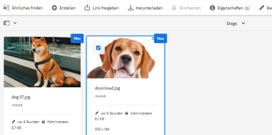

# Ein- und Auschecken von Dateien in [!DNL Experience Manager] DAM {#check-in-and-check-out-files-in-assets}

Mit [!DNL Adobe Experience Manager Assets] können Sie Assets zum Bearbeiten auschecken und dann wieder einchecken, wenn Sie keine weiteren Änderungen vornehmen möchten. Wenn Sie ein Asset ausgecheckt haben, können nur Sie das Asset bearbeiten, mit Anmerkungen versehen, veröffentlichen, verschieben oder löschen. Beim Auschecken eines Assets wird das Asset gesperrt. Andere Benutzer können diese Vorgänge erst dann für das Asset ausführen, wenn Sie das Asset wieder in [!DNL Assets] einchecken. Allerdings können Sie nach wie vor die Metadaten für das gesperrte Asset ändern.

Um Assets aus-/einchecken zu können, benötigen Sie entsprechenden Schreibzugriff.

Mithilfe dieser Funktion können Sie verhindern, dass Benutzer die von einem Autor vorgenommenen Änderungen überschreiben, wenn mehrere Benutzer Team-übergreifend im Rahmen von Bearbeitungs-Workflows zusammenarbeiten.

## Auschecken von Assets {#checking-out-assets}

1. Wählen Sie in der [!DNL Assets]-Benutzeroberfläche das Asset aus, das Sie auschecken möchten. Sie können auch mehrere Assets zum Auschecken auswählen.

1. Klicken Sie in der Symbolleiste auf **[!UICONTROL Checkout]**. Die Option **[!UICONTROL Checkout]** wird zu **[!UICONTROL Checkin]** umgeschaltet.
Um zu überprüfen, ob andere Benutzer das von Ihnen ausgecheckte Asset bearbeiten können, melden Sie sich unter einem anderen Benutzernamen an. Das Symbol  wird auf der Miniaturansicht des Assets angezeigt, das Sie ausgecheckt haben.

   

   Wählen Sie das Asset aus. In der Symbolleiste werden keine Optionen zum Bearbeiten, Kommentieren, Veröffentlichen oder Löschen des Assets angezeigt.

   

   Um die Metadaten für das gesperrte Asset zu bearbeiten, klicken Sie auf **[!UICONTROL Eigenschaften anzeigen]**.

1. Klicken Sie auf **[!UICONTROL Bearbeiten]** , um das Asset im Bearbeitungsmodus zu öffnen.

1. Bearbeiten Sie das Asset und speichern Sie die Änderungen. Schneiden Sie beispielsweise das Bild zu und speichern Sie es. Sie können das Asset auch mit Anmerkungen versehen oder es veröffentlichen.

1. Wählen Sie das bearbeitete Asset in der [!DNL Assets]-Benutzeroberfläche aus und klicken Sie in der Symbolleiste auf **[!UICONTROL Einchecken]** . Das geänderte Asset wird in [!DNL Assets] eingecheckt und steht anderen Benutzern zur Bearbeitung zur Verfügung.

## Erzwungenes Einchecken {#forced-check-in}

Administratoren können von anderen Benutzern ausgecheckte Assets einchecken.

1. Melden Sie sich bei [!DNL Assets] als Administrator an.
1. Wählen Sie in der Benutzeroberfläche [!DNL Assets] ein oder mehrere Assets aus, die von anderen Benutzern ausgecheckt wurden.

   

1. Klicken Sie in der Symbolleiste auf **[!UICONTROL Sperre freigeben]**. Das Asset wird wieder eingecheckt und steht anderen Benutzern zur Bearbeitung zur Verfügung.

## Best Practices und Einschränkungen {#tips-limitations}

* Es ist möglich, einen *Ordner* zu löschen, der ausgecheckte Asset-Dateien enthält. Stellen Sie vor dem Löschen eines Ordners sicher, dass keine digitalen Assets von Benutzern ausgecheckt werden.

>[!MORELIKETHIS]
>
>* [Einchecken und Auschecken in der  [!DNL Experience Manager] Desktop-App](https://experienceleague.adobe.com/docs/experience-manager-desktop-app/using/using.html?lang=en#how-app-works2)
>* [Video-Tutorial zum Ein- und Auschecken [!DNL Assets]](https://experienceleague.adobe.com/docs/experience-manager-learn/assets/collaboration/check-in-and-check-out.html)

