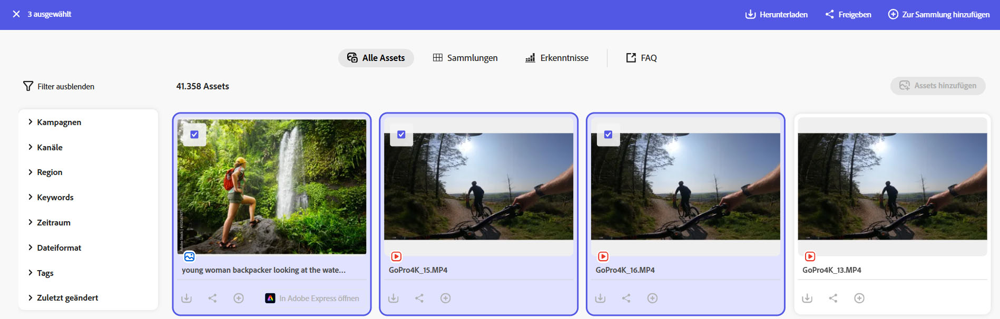
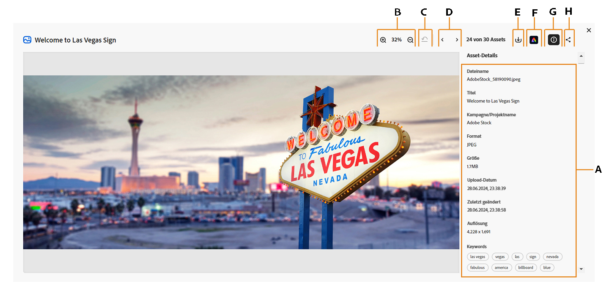

# Verwalten von Sammlungen in [!DNL Content Hub] {#manage-collections}

| [Best Practices für die Suche](/help/assets/search-best-practices.md) | [Best Practices für Metadaten](/help/assets/metadata-best-practices.md) | [Content Hub](/help/assets/product-overview.md) | [Dynamic Media mit OpenAPI-Funktionen](/help/assets/dynamic-media-open-apis-overview.md) | [Entwicklerdokumentation zu AEM Assets](https://developer.adobe.com/experience-cloud/experience-manager-apis/) |
| ------------- | --------------------------- |---------|----|-----|

<!--  -->

>[!AVAILABILITY]
>
>Das Content Hub-Handbuch ist jetzt im PDF-Format verfügbar. Laden Sie das gesamte Handbuch herunter und verwenden Sie den Adobe Acrobat AI-Assistenten, um Ihre Fragen zu beantworten.
>
>[!BADGE Content Hub Guide PDF]{type=Informative url="https://helpx.adobe.com/content/dam/help/en/experience-manager/aem-assets/content-hub.pdf"}

Eine Sammlung bezieht sich auf einen Satz von Assets, die für Benutzer freigegeben werden können. Eine Sammlung kann Assets aus verschiedenen Speicherorten enthalten, wobei die referenzielle Integrität dieser Assets gewahrt bleibt.

Mit [!DNL Content Hub] können Sie öffentliche Sammlungen erstellen. Diese Sammlungen stehen allen berechtigten Benutzern zur Verfügung und schaffen einen gemeinsamen Bereich, in dem mehrere Benutzer effizient auf Inhalte zugreifen und diese nutzen können. Sammlungen fördern die partizipative Nutzung von Ressourcen für mehr Effizienz und Komfort. Auf der Durchsuchen-Seite der Sammlung haben Sie folgende Möglichkeiten:

* **Erstellen**: Erstellen Sie eine oder mehrere Sammlungen.
* **Ansicht**: Zeigen Sie die Assets und ihre Eigenschaften an.
* **Freigeben**: Geben Sie Assets als Link für andere frei.
* **Herunterladen**: Laden Sie die Assets herunter.
* **Entfernen**: Entfernen Sie bestimmte Assets aus einer Sammlung.
* **Löschen**: Löscht die gesamte Sammlung.

Dies erleichtert Benutzern den einfachen Zugriff auf und die Verwaltung der verschiedenen Assets, die in [!DNL Content Hub] verfügbar sind.

## Voraussetzungen {#prerequisites}

[Content Hub-Benutzer](deploy-content-hub.md#onboard-content-hub-users) können die in diesem Artikel erwähnten Aktionen ausführen.

## Erstellen von Sammlungen{#create-collections}

Sie können [eine neue Sammlung erstellen](#create-new-collection) oder [Assets zu einer vorhandenen Sammlung hinzufügen](#add-assets-to-existing-collection).

### Neue Sammlung erstellen{#create-new-collection}

Wählen Sie die Assets aus, die Sie einer Sammlung hinzufügen müssen, und klicken Sie auf **[!UICONTROL Zu Sammlung hinzufügen]**.

Um eine neue Sammlung zu erstellen, navigieren Sie zur Registerkarte **[!UICONTROL Sammlungen]** und klicken Sie auf **[!UICONTROL Neue Sammlung erstellen]**. Geben Sie den **[!UICONTROL Titel]** ein und geben Sie eine optionale **[!UICONTROL Beschreibung]** für die Assets an. Klicken Sie auf **[!UICONTROL Erstellen]**.

### Hinzufügen von Assets zu einer vorhandenen Sammlung{#add-assets-to-existing-collection}

Um Assets zu einer vorhandenen Sammlung hinzuzufügen, wählen Sie die Assets aus, die Sie der Sammlung hinzufügen müssen. Klicken Sie auf **[!UICONTROL Zur Sammlung hinzufügen]**. Sie werden aufgefordert, die Sammlung auszuwählen.

Wählen Sie die Sammlung aus, der Sie das Asset hinzufügen müssen. Sie können die vorhandene Sammlung auch über die Suchleiste durchsuchen.  Wählen Sie die Sammlung(en) aus, zu denen Sie die Assets hinzufügen müssen, und klicken Sie auf **[!UICONTROL Zu Sammlung hinzufügen]**.

## Anzeigen von Sammlungen{#view-collections}

Navigieren Sie zur Registerkarte **[!UICONTROL Sammlungen]** und suchen Sie nach dem Sammlungsnamen. Um die Liste der in einer Sammlung verfügbaren Assets anzuzeigen, klicken Sie auf den Sammlungsnamen. Sie können auch Filter innerhalb einer Sammlung anwenden, um die Asset-Ergebnisse einzugrenzen.

Klicken Sie auf das Asset, das Sie in einer Sammlung anzeigen möchten. [!DNL Content Hub] zeigt die Detailansicht für das Asset an. [Siehe Asset-Details](asset-properties-content-hub.md).

<!--

* **A**: Details and metadata of the asset 
* **B**: Zoom In or Zoom Out the asset 
* **C**: Reset Zoom view 
* **D**: View the previous or next asset 
* **E**: Download the asset 
* **F**: Open the asset in Adobe Express 
* **G**: Hide the metadata of the asset 
* **H**: Share the asset as a link 
-->

## Herunterladen von Assets, die in einer Sammlung verfügbar sind{#download-assets-within-collection}

Um in einer Sammlung verfügbare Assets herunterzuladen, navigieren Sie zur Registerkarte **[!UICONTROL Sammlungen]** .\
Klicken Sie auf der Sammlungskarte auf das Symbol  .

Alle Assets in der Sammlung werden heruntergeladen.

Sie können die Sammlung auch öffnen, um die Assets einzeln herunterzuladen. Klicken Sie auf die Sammlung mit den Assets, die Sie herunterladen müssen. Wählen Sie die Assets aus und klicken Sie auf &quot;**[!UICONTROL Download]**&quot;.

Erfahren Sie, wie Sie [ein Asset aus dem  [!DNL Content Hub]](download-assets-content-hub.md) herunterladen.

## Freigeben von in einer Sammlung verfügbaren Assets {#share-assets-available-within-collection}

Sie können auch die in einer Sammlung verfügbaren Assets freigeben. Navigieren Sie zur Registerkarte **[!UICONTROL Sammlungen]** . Wählen Sie auf der Sammlungskarte das Symbol  aus. Der Freigabe-Link wird kopiert. Sie können den kopierten Link für den Empfänger freigeben. Erfahren Sie mehr über [Freigeben von Assets in der  [!DNL Content Hub]](share-assets-content-hub.md).

## Details einer Sammlung bearbeiten {#edit-details-of-collection}

Um **[!UICONTROL Titel]** und **[!UICONTROL Beschreibung]** einer Sammlung zu bearbeiten, klicken Sie auf den Sammlungsnamen und dann auf das Symbol . Der Bildschirm [!UICONTROL Sammlungsdetails] wird angezeigt, in dem Sie den **[!UICONTROL Titel]** und die **[!UICONTROL Beschreibung]** einer Sammlung bearbeiten können. Klicken Sie auf **[!UICONTROL Änderungen speichern]** , um die Änderungen zu bestätigen.

## Entfernen von Assets aus einer Sammlung{#remove-assets-from-a-collection}

Sie können einzelne oder mehrere Assets aus einer Sammlung entfernen. Um Assets aus einer Sammlung zu entfernen, klicken Sie auf die Sammlung, aus der Sie Assets entfernen müssen, wählen Sie die Assets aus und klicken Sie auf **[!UICONTROL Aus Sammlung entfernen]**.

Sie werden aufgefordert, das Entfernen des Assets zu bestätigen. Klicken Sie auf **[!UICONTROL Entfernen]**.\
Die ausgewählten Assets wurden erfolgreich aus der Sammlung entfernt.

## Löschen von Sammlungen{#delete-collection}

Um eine Sammlung zu löschen, navigieren Sie zur Registerkarte **[!UICONTROL Sammlungen]** und klicken Sie auf die Sammlung, die Sie löschen müssen. Klicken Sie auf das Symbol , um die Sammlung zu löschen.
