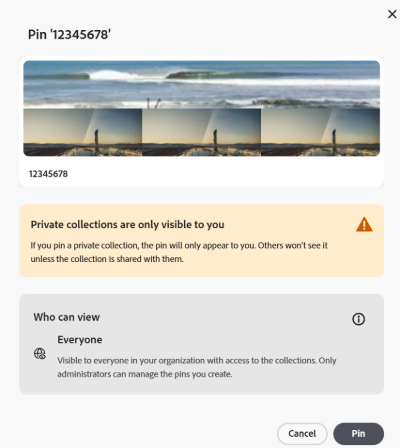

# Verwalten von Sammlungen in [!DNL Content Hub] {#manage-collections}

<!--  -->

Eine Sammlung bezieht sich auf einen Satz von Assets, die zwischen Benutzenden freigegeben werden können. Eine Sammlung kann Assets von verschiedenen Speicherorten enthalten, wobei die referenzielle Integrität dieser Assets gewahrt bleibt.

Mit [!DNL Content Hub] können Sie öffentliche Sammlungen erstellen. Diese Sammlungen stehen allen berechtigten Benutzenden zur Verfügung und schaffen einen gemeinsamen Bereich, in dem mehrere Benutzende effizient auf Inhalte zugreifen und diese nutzen können. Sammlungen fördern die gemeinsame Nutzung von Ressourcen und sorgen so für mehr Effizienz und Komfort. Auf der Browser-Seite der Sammlung stehen Ihnen die folgenden Optionen zur Verfügung:

* **Erstellen**: Erstellen Sie eine oder mehrere Sammlungen.
* **Anzeigen**: Zeigen Sie die Assets und ihre Eigenschaften an.
* **Freigeben**: Geben Sie Assets als Link für andere frei.
* **Herunterladen**: Laden Sie die Assets herunter.
* **Entfernen**: Entfernen Sie bestimmte Assets aus einer Sammlung.
* **Löschen**: Löschen Sie die gesamte Sammlung.
* **Pin/Unpin**: Sammlung anheften oder lösen.
* **Favorit**: Sammlung als Favorit markieren.

Dies ermöglicht Benutzenden, auf einfache Weise auf die verschiedenen in [!DNL Content Hub] verfügbaren Assets zuzugreifen und diese zu verwalten.

## Voraussetzungen {#prerequisites}

[Content Hub-Benutzende](deploy-content-hub.md#onboard-content-hub-users) können die in diesem Artikel genannten Aktionen ausführen.

## Erstellen von Sammlungen{#create-collections}

Sie können wählen, ob Sie [eine neue Sammlung erstellen](#create-new-collection) oder [Assets zu einer bestehenden Sammlung hinzufügen](#add-assets-to-existing-collection) möchten, während Sie die Governance verwalten.

### Erstellen einer neuen Sammlung{#create-new-collection}

Führen Sie die folgenden Schritte aus, um den Zugriff beim Erstellen von Sammlungen zu steuern:

1. Wechseln Sie zu Registerkarte **[!DNL Collections]** und klicken Sie auf **[!UICONTROL Sammlung erstellen]**. Ein neues Sammlungsfenster wird angezeigt.

1. Fügen Sie **[!UICONTROL Titel]** und **[!UICONTROL Beschreibung]** für die Sammlung hinzu.

   

1. Wählen Sie im Dropdown-Menü **[!UICONTROL Wer hat Zugriff]** den Zugriffskontrolltyp aus. Die folgenden Optionen sind verfügbar:

   | Zugriffsmethode | Zugriffstyp | Beschreibung |
   |---|---|---|
   | **Nur Sie und Admins können bearbeiten** | Privat | Nur die erstellende Person und die Admins können diese Sammlung bearbeiten und darauf zugreifen. |
   | **Alle können anzeigen** | Öffentlich | Jeder kann auf diese Sammlung zugreifen, aber nur die erstellende Person und die Admins können sie bearbeiten. |
   | **Alle können anzeigen und bearbeiten** | Öffentlich | Diese Sammlung ist für alle zugänglich, mit uneingeschränktem Zugriff und Bearbeitungsrechten ohne Einschränkungen. |

   >[!NOTE]
   >
   > Die oder der [!DNL Content Hub]-Admin kann alle Optionen anzeigen, die im Dropdown-Menü **[!UICONTROL Wer hat Zugriff]** verfügbar sind. Für reguläre Benutzende müssen Sie dagegen [angeben und konfigurieren](configure-content-hub-ui-options.md), auf welche Optionen sie zugreifen können.

1. Klicken Sie auf **[!UICONTROL Erstellen]**. Anschließend können Sie [Assets zur Sammlung hinzufügen](#add-assets-to-existing-collection).

>[!VIDEO](https://video.tv.adobe.com/v/3463336)

<!--
>[!NOTE]
>
>Collections governance is a limited availability feature. You can get it enabled  by creating a support ticket. Once enabled, you need to [Configure Collections in Content Hub](configure-content-hub-ui-options.md#configure-collections-content-hub).-->

<!--To create a new collection, navigate to the **[!UICONTROL Collections]** tab and click **[!UICONTROL Create new collection]**. Enter the **[!UICONTROL Title]** and provide an optional **[!UICONTROL Description]** for the assets. Click **[!UICONTROL Create]**.
          
-->

### Hinzufügen von Assets zu einer vorhandenen Sammlung{#add-assets-to-existing-collection}

Um Assets zu einer vorhandenen Sammlung hinzuzufügen, wählen Sie die Assets aus, die der Sammlung hinzugefügt werden sollen. Klicken Sie auf **[!UICONTROL Zu Sammlung hinzufügen]**. Sie werden aufgefordert, die Sammlung auszuwählen.

Wählen Sie die Sammlung aus, der das Asset hinzugefügt werden soll. Sie können die vorhandene Sammlung auch über die Suchleiste durchsuchen.  Wählen Sie die Sammlungen aus, denen die Assets hinzugefügt werden sollen, und klicken Sie auf **[!UICONTROL Zu Sammlung hinzufügen]**.

## Anzeigen von Sammlungen{#view-collections}

Navigieren Sie zur Registerkarte **[!UICONTROL Sammlungen]** und suchen Sie nach dem Sammlungsnamen. Sie können Filter verwenden, um Ihre Suchergebnisse zu verfeinern, indem Sie bestimmte Kriterien auswählen, sodass Sie schnell die relevantesten Sammlungen finden können.

Um die Liste der in einer Sammlung verfügbaren Assets anzuzeigen, klicken Sie auf den Sammlungsnamen. Sie können auch Filter innerhalb einer Sammlung anwenden, um die Asset-Ergebnisse einzugrenzen. Klicken Sie auf das Asset, das in einer Sammlung angezeigt werden soll. [!DNL Content Hub] zeigt die Detailansicht für das Asset an. Siehe [Asset-Details](asset-properties-content-hub.md).

### Filtern der Sammlungsansicht {#filter-collections-view}

Mit Content Hub können Sie die Sammlungsansicht filtern, um genau das zu finden, was Sie suchen, indem Sie die Optionen entsprechend Ihren Präferenzen eingrenzen. Stellen Sie die [Konfiguration von Sammlungen in Content Hub](configure-content-hub-ui-options.md#configure-collections-content-hub) sicher.

Um die Sammlungsansicht zu filtern, gehen Sie zur Registerkarte **[!DNL Collections]** und navigieren Sie zur Dropdown-Liste „Sammlungen“. Wählen Sie unter den folgenden Optionen:

* **[!UICONTROL Alle Sammlungen]:** Wählen Sie diese Option aus, um alle Sammlungen anzuzeigen und zu bearbeiten, die privat und für Sie freigegeben sind.
* **[!UICONTROL Nur ich]:** Wählen Sie diese Option aus, um Sammlungen anzuzeigen, auf die Sie zugreifen können.
* **[!UICONTROL Alle können anzeigen]:** Mit dieser Option können Sie Sammlungen filtern, die für alle zugänglich sind, aber nur von der erstellenden Person bearbeitet werden können.
* **[!UICONTROL Alle können bearbeiten]:** Wählen Sie diese Option, um Sammlungen zu filtern, die für alle zugänglich und bearbeitbar sind.

  

Um die Sammlungsansicht auf der Grundlage von Zugriffsberechtigungen zu filtern, gehen Sie zur Registerkarte **[!DNL Collections]** und navigieren Sie zu einer der folgenden Optionen:

* **[!UICONTROL Von jedem erstellt]:** Dieser Filter beschränkt Sie auf die Anzeige von Sammlungen, die von beliebigen Benutzenden erstellt wurden.

* **[!UICONTROL Von mir erstellt]:** Dieser Filter beschränkt Sie auf die Anzeige von Sammlungen, die von Ihnen erstellt wurden.

  

<!--

* **A**: Details and metadata of the asset 
* **B**: Zoom In or Zoom Out the asset 
* **C**: Reset Zoom view 
* **D**: View the previous or next asset 
* **E**: Download the asset 
* **F**: Open the asset in Adobe Express 
* **G**: Hide the metadata of the asset 
* **H**: Share the asset as a link 
-->

## Herunterladen von in einer Sammlung verfügbaren Assets{#download-assets-within-collection}

Um in einer Sammlung verfügbare Assets herunterzuladen, navigieren Sie zur Registerkarte **[!UICONTROL Sammlungen]**.\
Klicken Sie auf der Sammlungskarte auf das Symbol .

Alle Assets in der Sammlung werden heruntergeladen.

Sie können die Sammlung auch öffnen, um die Assets einzeln herunterzuladen. Klicken Sie auf die Sammlung mit den Assets, die heruntergeladen werden sollen. Wählen Sie die Assets aus und klicken Sie auf **[!UICONTROL Herunterladen]**.

Erfahren Sie, wie Sie [ein Asset aus [!DNL Content Hub]](download-assets-content-hub.md)herunterladen.

## Freigeben von in einer Sammlung verfügbaren Assets {#share-assets-available-within-collection}

Sie können auch die in einer Sammlung verfügbaren Assets freigeben. Stellen Sie sicher, dass [die öffentliche Link-Freigabe in Content Hub aktiviert ist](configure-content-hub-ui-options.md#enable-public-link-sharing). Navigieren Sie zur Registerkarte **[!UICONTROL Sammlungen]**. Wählen Sie auf der Sammlungskarte das Symbol  aus. Der Freigabe-Link wird kopiert. Sie können den Link an die Empfängerin oder den Empfänger weitergeben. Erfahren Sie mehr über das [Freigeben von Assets in [!DNL Content Hub]](share-assets-content-hub.md).

Content Hub Collections bietet umfassende Governance-Tools für ein effektives Asset-Management, einschließlich anpassbarer Freigabeberechtigungen und Zusammenarbeitsfunktionen. Vom schreibgeschützten Zugriff bis hin zur vollständigen administrativen Kontrolle unterstützen diese Einstellungen eine ordnungsgemäße Governance über die Asset-Verteilung. Beim Freigeben eines Assets entweder einzeln oder als Teil einer Sammlung wird der Zugriffsbereich durch die aktuelle Zugriffsebene der Sammlung bestimmt, die der Benutzerin bzw. dem Benutzer zugewiesen ist. Alternativ können Sie keine private Sammlung freigeben.

## Bearbeiten der Details einer Sammlung {#edit-details-of-collection}

Um den **[!UICONTROL Titel]** und die **[!UICONTROL Beschreibung]** einer Sammlung zu bearbeiten, klicken Sie auf den Sammlungsnamen und dann auf das Symbol . Der Bildschirm [!UICONTROL Details zur Sammlung] wird angezeigt. Dort können Sie den **[!UICONTROL Titel]** und die **[!UICONTROL Beschreibung]** einer Sammlung bearbeiten. Klicken Sie auf **[!UICONTROL Änderungen speichern]**, um die Änderungen zu bestätigen. Darüber hinaus können Sie den Zugriff auf die Sammlung je nach Konfiguration über das Dialogfeld „Sammlung bearbeiten“ aktualisieren.

## Entfernen von Assets aus einer Sammlung{#remove-assets-from-a-collection}

Folgende Benutzende können ein Asset oder mehrere Assets aus einer Sammlung entfernen:

* Eine oder ein Admin
* Inhaberin oder Inhaber der Sammlung
* Benutzerin oder Benutzer ohne Administratorrechte mit Bearbeitungsrechten

Um Assets aus einer Sammlung zu entfernen, klicken Sie auf die Sammlung, aus der Assets entfernt werden sollen, wählen Sie die Assets aus und klicken Sie auf **[!UICONTROL Aus Sammlung löschen]**.

Sie werden aufgefordert, das Entfernen der Assets zu bestätigen. Klicken Sie auf **[!UICONTROL Entfernen]**.\
Die ausgewählten Assets werden erfolgreich aus der Sammlung entfernt.

## Löschen von Sammlungen{#delete-collection}

Nur Admins und erstellende Personen können eine Sammlung löschen. Um eine Sammlung zu löschen, navigieren Sie zur Registerkarte **[!UICONTROL Sammlungen]** und klicken Sie auf die Sammlung, die gelöscht werden soll. Klicken Sie auf das Symbol , um die Sammlung zu löschen.

## Sammlung anheften oder lösen {#pin-unpin-collection}

Content Hub-Administratoren können Sammlungen in Content Hub anheften, um schnell darauf zugreifen zu können. Angeheftete Sammlungen werden in einem eigenen Abschnitt auf der Startseite von Sammlungen angezeigt, wodurch es einfacher ist, wichtige Sammlungen in Reichweite zu halten. Für den Schnellzugriff können Sie eine Sammlung anheften oder entfernen, indem Sie die folgenden Schritte ausführen:

1. Durchsuchen Sie die Sammlungen, die Sie anheften oder entfernen möchten.

1. Klicken Sie auf **[!UICONTROL Mehr Aktionen]**  und wählen Sie **[!UICONTROL An Schnellzugriff anheften]**. Ein Bestätigungsfeld wird angezeigt.

   

1. Klicken Sie **[!UICONTROL Pin]** zur Bestätigung. Die Warnmeldung wird angezeigt, wenn Sie eine private Sammlung anheften.

   

   Die angehefteten Sammlungen werden oben angezeigt, um einen schnellen Zugriff zu ermöglichen. Um die angeheftete Sammlung aufzuheben, klicken Sie alternativ auf **[!UICONTROL Mehr Aktionen]**  und wählen Sie **[!UICONTROL Anheften]** aus.

   

## Sammlungen als Favoriten markieren {#favorite-collection}

Sie können Sammlungen in Content Hub als Favoriten markieren, was das Organisieren und Abrufen erleichtert. Nach dem Hinzufügen sind Ihre Lieblingssammlungen bequem über die Registerkarte Favoriten auf der Content Hub-Startseite verfügbar. Darüber hinaus können Sie Assets in Favoritensammlungen suchen. Gehen Sie wie folgt vor, um Sammlungen als Favoriten zu markieren:

1. Durchsuchen Sie die Sammlungen, die Sie anheften oder entfernen möchten.

1. Klicken Sie auf **[!UICONTROL Mehr Aktionen]**  und wählen Sie **[!UICONTROL Zu Favoriten hinzufügen]** aus, um die Sammlung als Favorit zu markieren.

   

   Sammlungen, die als Favoriten markiert sind, werden jetzt auf **[!UICONTROL Registerkarte „Meine Favoriten]** angezeigt. Alternativ können Sie die Sammlungen aus &quot;**[!UICONTROL Favoriten“]**. Klicken Sie dazu auf **[!UICONTROL Mehr Aktionen]**  und wählen Sie **[!UICONTROL Aus Favoriten entfernen]**.

   

>[!NOTE]
>
>[Sammlung anheften oder &#x200B;](#pin-unpin-collection) und Sammlungen [als Favoriten kennzeichnen](#favorite-collection) sind Funktionen mit begrenzter Verfügbarkeit. Sie können einen Fall für den Kunden-Support von Adobe erstellen und senden, um ihn für Ihre Bereitstellung zu aktivieren.

