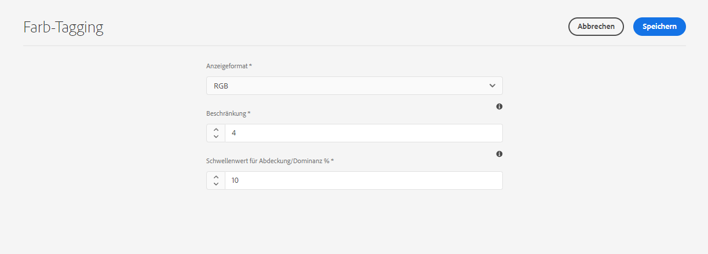
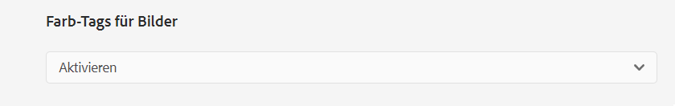
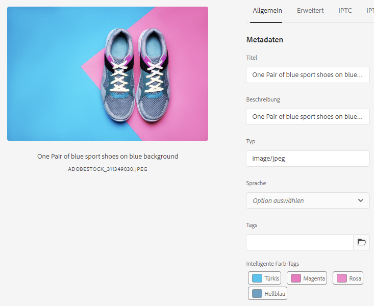
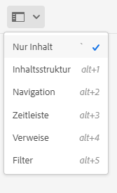
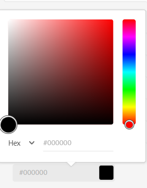

# Farb-Tags für Bilder {#color-tag-images}

Experience Manager Assets verwendet AI-Funktionen von Adobe Sensei, um zwischen Farben in einem Bild zu unterscheiden und diese bei der Aufnahme automatisch als Tags anzuwenden. Diese Tags ermöglichen ein verbessertes Sucherlebnis, das auf der Farbkomposition des Bildes basiert.

Sie können die Anzahl der Farben zwischen 1 und 40 konfigurieren, die mit einem Bild getaggt sind, sodass Sie später nach Bildern suchen können, die auf diesen Farben basieren. Experience Manager Assets wendet die Tags auf Grundlage der Farbabdeckung eines Bildes an. Sie können auch das Anzeigeformat für ein Farb-Tag konfigurieren.

>[!NOTE]
>
>Diese Funktion ist im Kanal für die Vorabversions verfügbar. Weitere Informationen zur Aktivierung der Funktion in Ihrer Umgebung finden Sie in der [Dokumentation zum Vorabversionskanal](https://experienceleague.adobe.com/docs/experience-manager-cloud-service/content/release-notes/prerelease.html?lang=de#enable-prerelease).

Die folgende Abbildung zeigt die Abfolge von Aufgaben zum Konfigurieren und Verwalten des Farb-Tagging für Bilder in Experience Manager Assets:

## Unterstützte Dateiformate {#supported-file-formats-color-tags}

| Dateiformat | Erweiterung | MIME-Typ | Eingabe-Farbraum | Maximale unterstützte Quelldateigröße | Maximale unterstützte Dateigrößenauflösung |
|---|---|---|---|---|---|
| JPEG | .jpg, .jpeg | image/jpeg | sRGB | 15 GB | 20000px X 20000px |
| PNG | .png | image/png | sRGB | 15 GB | 20000px X 20000px |
| TIFF | .tif, .tiff | image/tiff | sRGB | 4 GB (begrenzt durch Formatspezifikationen) | 20000px X 20000px |
| PSD | .psd | image/vnd.adobe.photoshop | sRGB | 2 GB (begrenzt durch Formatspezifikationen) | 20000px X 20000px |
| GIF | .gif | image/gif | sRGB | 15 GB | 20000px X 20000px |
| BMP | .bmp | image/bmp | sRGB | 4 GB (begrenzt durch Formatspezifikationen) | 20000px X 20000px |

## Verwalten von Farb-Tagging-Eigenschaften {#manage-color-tagging-properties}

So verwalten Sie die Farb-Tagging-Eigenschaften für Bilder:

1. Navigieren Sie zu **[!UICONTROL Tools > Assets > Farb-Tagging]**.

   

1. Geben Sie ein Anzeigeformat für das Farb-Tag im **[!UICONTROL Anzeigeformat]** -Feld. Zu den möglichen Optionen gehören der Farbname, das RGB- oder HEX-Format.

1. Geben Sie die Anzahl der Farben an, die für die Bilder in der **[!UICONTROL Limit]** -Feld. Diese Farben werden angezeigt, wenn Sie die Eigenschaften für ein Bild anzeigen.  In diesem Feld können Sie eine Zahl zwischen 1 und 40 definieren. Der Standardwert für dieses Feld ist zehn Farben.

1. Geben Sie den minimalen Farbabdeckungsprozentsatz an, um ein Farb-Tag in die Suchergebnisse in die **[!UICONTROL Schwellenwert für Abdeckung/Dominanz %]** -Feld. Wenn die Abdeckung der roten Farbe in einem Bild beispielsweise 10 Prozent beträgt und Sie in diesem Feld neun Prozent definieren, wird das Bild bei der Suche nach Bildern mit roter Farbe einbezogen. Wenn die rote Farbabdeckung in einem Bild jedoch 10 Prozent beträgt und Sie elf Prozent in diesem Feld definieren, wird das Bild bei der Suche nach Bildern mit roter Farbe nicht einbezogen.

   In diesem Feld können Sie eine beliebige Zahl zwischen 5 und 10 angeben. Der Standardwert ist elf.

   >[!NOTE]
   >
   >Adobe empfiehlt, einen Wert zu verwenden, der in diesem Feld dem Standardwert ähnelt. Wenn Sie einen hohen Zahlenwert für dieses Feld festlegen (z. B. größer als 25), kann dies nur zu sehr wenigen Suchergebnissen führen. Auf ähnliche Weise kann die Festlegung eines niedrigen Zahlenwerts (z. B. unter 6) zu vielen Suchergebnissen führen, was möglicherweise nicht nützlich ist.

1. Klicken Sie auf **[!UICONTROL Speichern]**.

   >[!VIDEO](https://video.tv.adobe.com/v/340108)

### Farb-Tagging deaktivieren {#disable-color-tagging}

Das Farb-Tagging für Bilder ist standardmäßig aktiviert. Sie können das Farb-Tagging auf Ordnerebene deaktivieren. Alle untergeordneten Ordner übernehmen die Farb-Tagging-Eigenschaften vom übergeordneten Ordner.

So deaktivieren Sie das Farb-Tagging auf Ordnerebene:

1. Navigieren Sie zu **[!UICONTROL Adobe Experience Manager > Assets > Dateien]**.

1. Wählen Sie den Ordner aus und klicken Sie auf **[!UICONTROL Eigenschaften]**.

1. Im **[!UICONTROL Asset-Verarbeitung]** Registerkarte navigieren, navigieren Sie zum **[!UICONTROL Farb-Tags für Bilder]** Ordner. Wählen Sie einen der folgenden Werte aus der Dropdown-Liste aus:

   * Vererbt - Der Ordner übernimmt die Optionen zum Aktivieren oder Deaktivieren vom übergeordneten Ordner.

   * Aktivieren - Aktiviert das Farb-Tagging für den ausgewählten Ordner.

   * Deaktivieren - Deaktiviert das Farb-Tagging für den ausgewählten Ordner.

   

## Konfigurieren des Metadatenschemas zum Hinzufügen der Smart-Color-Tags-Komponente {#configure-metadata-schema}

Metadatenschemata enthalten spezifische Felder für spezifische Informationen, die ausgefüllt werden sollen. Es enthält auch Layout-Informationen, um Metadatenfelder benutzerfreundlich anzuzeigen. Zu den Metadaten-Eigenschaften zählen u. a. Titel, Beschreibung, MIME-Typen, Tags usw. Mit dem Editor für [!UICONTROL Metadatenschema-Formulare] können Sie vorhandene Schemas ändern oder benutzerdefinierte Metadatenschemas hinzufügen.

>[!NOTE]
>
>Das Feld Smart Color Tag ist im Standard-Metadatenschema verfügbar. Wenn Sie ein benutzerdefiniertes Metadatenschema verwenden, konfigurieren Sie Ihr Schema so, dass es ein Smart-Farb-Tag-Feld hinzufügt.

So fügen Sie die Komponente Smart Color Tags zum Metadatenschema-Formular-Editor hinzu:

1. Navigieren Sie zu **[!UICONTROL Tools > Assets > Metadatenschemas]**.

1. Wählen Sie den Schemanamen aus und klicken Sie auf **[!UICONTROL Bearbeiten]**.

1. Ziehen **[!UICONTROL Smart Color Tags]** von **[!UICONTROL Formular erstellen]** zum **[!UICONTROL Metadatenschema-Formular-Editor]**.

1. Klicken Sie auf **[!UICONTROL Smart Color Tag Field]** im **[!UICONTROL Metadatenschema-Formular-Editor]**.

1. Geben Sie den entsprechenden Wert in der **[!UICONTROL Feldbezeichnung]** im Feld **[!UICONTROL Einstellungen]**  Registerkarte.

1. Klicken Sie auf **[!UICONTROL Speichern]**.

   >[!VIDEO](https://video.tv.adobe.com/v/340124)

## Farb-Tags für vorhandene Bilder in DAM {#color-tags-existing-images}

Die bereits in DAM vorhandenen Bilder werden nicht automatisch mit Farbfeldern versehen. Sie müssen [!UICONTROL Assets erneut verarbeiten] manuell erstellen, um Farb-Tags für sie zu generieren.

Gehen Sie wie folgt vor, um Tag-Bilder oder Ordner (einschließlich Unterordner) von Assets zu farbig zu kennzeichnen, die bereits im Assets-Repository vorhanden sind:

1. Klicken oder tippen Sie auf das [!DNL Adobe Experience Manager]-Logo und wählen Sie dann Assets auf der [!UICONTROL Navigationsseite] aus.

1. Klicken oder tippen Sie auf [!UICONTROL Dateien], um die Oberfläche für Assets anzuzeigen.

1. Navigieren Sie zu dem Ordner, auf den Sie Farb-Tags anwenden möchten.

1. Wählen Sie den gesamten Ordner oder bestimmte Bilder aus.

1. Klicken oder tippen Sie auf das Symbol  [!UICONTROL Assets erneut verarbeiten] und wählen Sie die Option [!UICONTROL Vollständiger Prozess] aus.

Nachdem der Prozess abgeschlossen ist, navigieren Sie zum [!UICONTROL Eigenschaften] -Seite eines Bildes im Ordner. Die automatisch hinzugefügten Tags werden in [!UICONTROL Smart Color Tags] Abschnitt in [!UICONTROL Allgemein] Registerkarte.

## Anzeigen von Smart-Farb-Tags für Bilder {#view-color-tags}

So zeigen Sie Smart-Farb-Tags für Bilder an:

1. Navigieren Sie zu **[!UICONTROL Adobe Experience Manager > Assets > Dateien]**.

1. Klicken Sie auf den entsprechenden Ordner und wählen Sie das Bild aus.

1. Auswählen **[!UICONTROL Eigenschaften]** und zeigen Sie die Tags in der **[!UICONTROL Smart Color Tags]** -Feld.

   

   Bewegen Sie den Mauszeiger über ein Farbtag, um die **[!UICONTROL Schwellenwert für Abdeckung/Dominanz %]** einer Farbe in einem Bild.

## AEM Assets-Farbprädikat konfigurieren {#configure-search-predicate}

Sie können den Suchfilter für Bilder konfigurieren. Anschließend können Sie Ihre Suchkriterien auf einer bestimmten Farbe basieren, um die Ergebnisse zu filtern.

>[!NOTE]
>
>Konfigurieren Sie die AEM Assets-Farbeigenschaft nur, wenn Sie nicht das Standardsuchformular verwenden.

Um den Suchfilter zu konfigurieren, erstellen Sie mit der Asset-Admin-Suchleiste ein Asset-Farbprädikat.

So konfigurieren Sie den Suchfilter:

1. Navigieren Sie zu **[!UICONTROL Tools > Allgemein > Forms durchsuchen]**.

1. Auswählen **[!UICONTROL Asset-Admin-Suchleiste]** und klicken Sie auf **[!UICONTROL Bearbeiten]**.

1. Ziehen **[!UICONTROL Asset-Farbeigenschaft]** von **[!UICONTROL Eigenschaft auswählen]** zum **[!UICONTROL Suchformular-Editor]**.

1. Geben Sie den entsprechenden Wert in der **[!UICONTROL Feldbezeichnung]** im Feld **[!UICONTROL Einstellungen]**  Registerkarte.

1. Klicken Sie auf **[!UICONTROL Fertig]**, um die Einstellungen zu speichern.

   >[!VIDEO](https://video.tv.adobe.com/v/340110)

## Suchen nach Bildern anhand von Farben {#search-images-based-on-colors}

>[!VIDEO](https://video.tv.adobe.com/v/340761)

Nach dem Konfigurieren aller Farb-Tagging-Eigenschaften und [Konfigurieren des Assets-Farbprädikats](#search-images-based-on-colors)können Sie Bilder basierend auf einer Farbe als Filter suchen.

So suchen Sie Bilder basierend auf Farben:

1. Gehen Sie zu **[!UICONTROL Assets > Dateien]**.

1. Auswählen **[!UICONTROL Filter]** aus der Dropdown-Liste aus.
   

1. Wählen Sie die [AEM Assets-Farbeigenschaft](#configure-search-predicate).

1. Ziehen Sie die Farbauswahl, um die gewünschte Farbe auszuwählen. Die ausgewählte Farbe wird im schreibgeschützten Feld angezeigt, das unter der Farbauswahl verfügbar ist. Sie können RGB oder HEX als Anzeigeformat für die Farbe auswählen.

   

   Sie können Bilder anhand einer Farbe filtern. Die Bilder, die die ausgewählte Farbe als eines der Smart-Color-Tags und über dem [Deckungsschwellenwert/Dominanzschwellenwert %](#manage-color-tagging-settings) im rechten Bereich angezeigt.

1. Klicken Sie in der Suchleiste auf x , um den Filter zu löschen.
