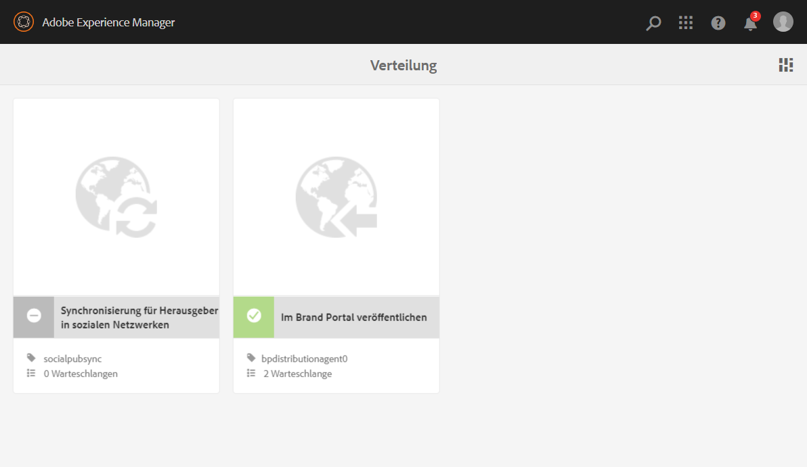
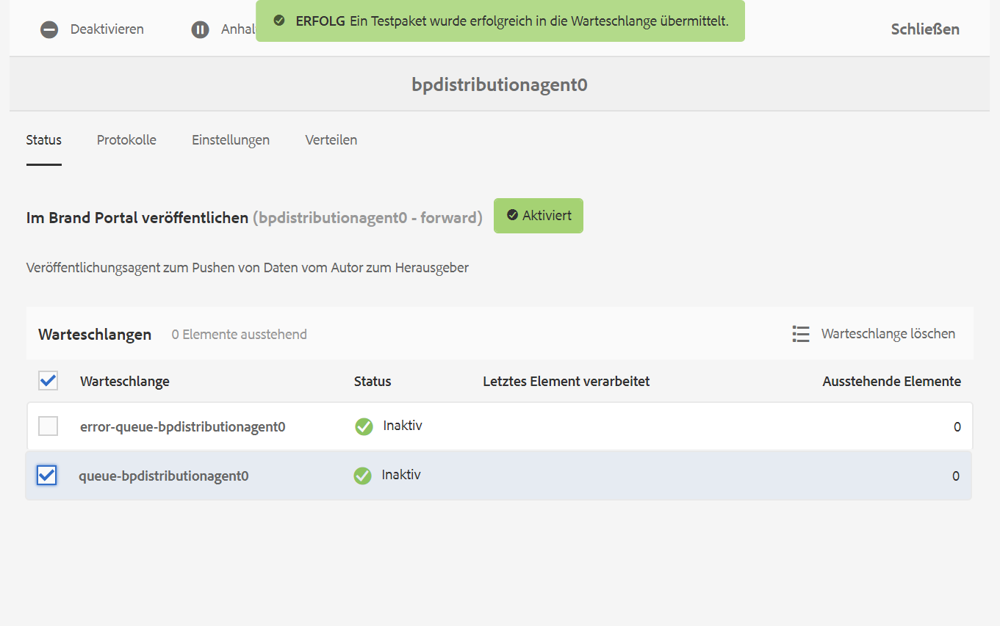
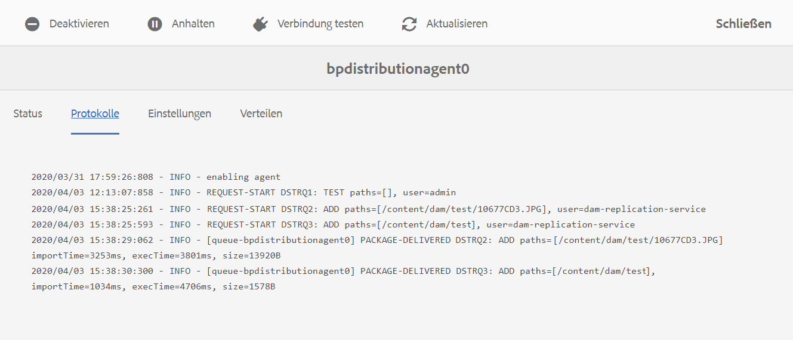
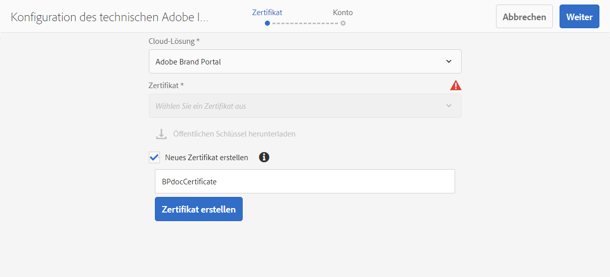
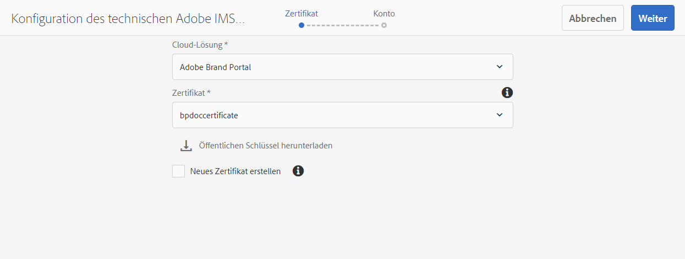
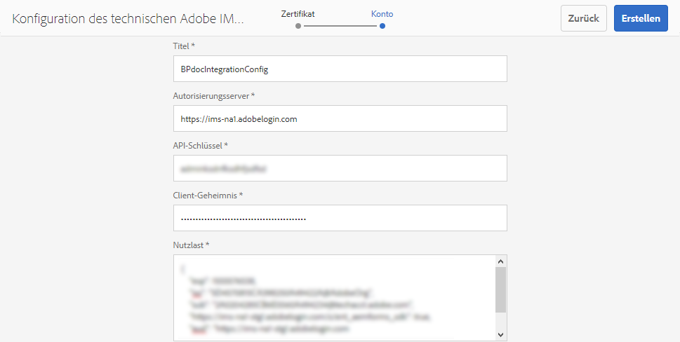
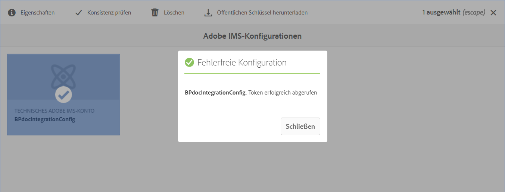
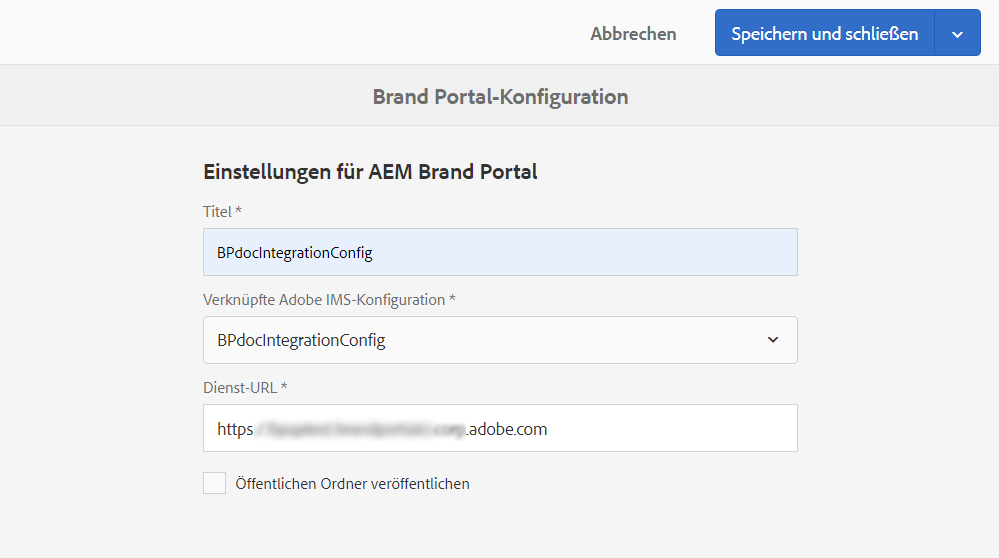

# Konfigurieren von Experience Manager Assets mit Brand Portal {#configure-aem-assets-with-brand-portal}

<table>
    <tr>
        <td>
            <i>Neu</i> <a href="/help/assets/dynamic-media/dm-prime-ultimate.md"><b>Dynamic Media Prime und Ultimate</b></a>
        </td>
        <td>
            <i>Neu</i> <a href="/help/assets/assets-ultimate-overview.md"><b>AEM Assets Ultimate</b></a>
        </td>
        <td>
            <i>Neu</i> <a href="/help/assets/integrate-aem-assets-edge-delivery-services.md"><b>AEM Assets-Integration mit Edge Delivery Services</b></a>
        </td>
        <td>
            <i>Neu</i> <a href="/help/assets/aem-assets-view-ui-extensibility.md"><b>Erweiterbarkeit der Benutzeroberfläche</b></a>
        </td>
          <td>
            <i>Neu</i> <a href="/help/assets/dynamic-media/enable-dynamic-media-prime-and-ultimate.md"><b>Aktivieren von Dynamic Media Prime und Ultimate</b></a>
        </td>
    </tr>
    <tr>
        <td>
            <a href="/help/assets/search-best-practices.md"><b>Best Practices für die Suche</b></a>
        </td>
        <td>
            <a href="/help/assets/metadata-best-practices.md"><b>Best Practices für Metadaten</b></a>
        </td>
        <td>
            <a href="/help/assets/product-overview.md"><b>Content Hub</b></a>
        </td>
        <td>
            <a href="/help/assets/dynamic-media-open-apis-overview.md"><b>Dynamic Media mit OpenAPI-Funktionen</b></a>
        </td>
        <td>
            <a href="https://developer.adobe.com/experience-cloud/experience-manager-apis/"><b>Entwicklerdokumentation zu AEM Assets</b></a>
        </td>
    </tr>
</table>

| Version | Artikel-Link |
| -------- | ---------------------------- |
| AEM 6.5 | [Hier klicken](https://experienceleague.adobe.com/docs/experience-manager-65/assets/brandportal/configure-aem-assets-with-brand-portal.html?lang=de) |
| AEM as a Cloud Service | Dieser Artikel |

Durch das Konfigurieren von Adobe Experience Manager Assets Brand Portal können Sie genehmigte Marken-Assets aus der Adobe Experience Manager Assets as a [!DNL Cloud Service]-Instanz in Brand Portal veröffentlichen und an die Brand Portal-Benutzerinnen und -Benutzer verteilen.

## Aktivieren von Brand Portal mit Cloud Manager {#activate-brand-portal}

Der Cloud Manager-Benutzer aktiviert Brand Portal für eine Instanz von Experience Manager Assets as a [!DNL Cloud Service]. Der Aktivierungs-Workflow erstellt die erforderlichen Konfigurationen (Autorisierungs-Token, IMS-Konfiguration und Brand Portal Cloud Service) am Backend und zeigt den Status des Brand Portal-Mandanten in Cloud Manager an. Durch die Aktivierung von Brand Portal können Benutzer von Experience Manager Assets ihre Assets in Brand Portal veröffentlichen und an Brand die Portal-Benutzer verteilen.

**Voraussetzungen**

Sie benötigen Folgendes, um Brand Portal in Ihrer Instanz von Experience Manager Assets as a [!DNL Cloud Service] zu aktivieren:

* Eine Instanz von Experience Manager Assets as a [!DNL Cloud Service], die ausgeführt wird.
* Einen Benutzer, der Zugriff auf Cloud Manager hat und Profilen des Cloud Manager-Produkts zugewiesen ist. Weitere Informationen finden Sie unter [Zugriff auf Cloud Manager](https://experienceleague.adobe.com/docs/experience-manager-cloud-service/security/ims-support.html?lang=de#accessing-cloud-manager).

>[!NOTE]
>
>Für eine Instanz von Experience Manager Assets as a [!DNL Cloud Service] ist eine konfigurierte Produktionsumgebung erforderlich, um eine Verbindung mit dem Brand Portal-Mandanten herzustellen.

**Schritte zur Aktivierung von Brand Portal**

Sie können Brand Portal während der Erstellung der Produktionsumgebungen für Ihre Instanz von Experience Manager Assets as a [!DNL Cloud Service] oder separat aktivieren. Angenommen, die Umgebung wurde bereits erstellt und Sie müssen nun Brand Portal aktivieren.

1. Melden Sie sich bei Adobe Cloud Manager an und navigieren Sie zu **[!UICONTROL Umgebungen]**.

   Auf der Seite **[!UICONTROL Umgebungen]** wird die Liste aller vorhandenen Umgebung angezeigt.

1. Wählen Sie die Umgebungen (einzeln) in der Liste aus, um die Details zur Umgebung anzuzeigen.

   Brand Portal darf für eine der verfügbaren Umgebungen verwendet werden und wird unter **[!UICONTROL Umgebungsinformationen]** angezeigt.

   Sobald Sie die mit Brand Portal verknüpfte Umgebung gefunden haben, klicken Sie auf die Schaltfläche **[!UICONTROL Brand Portal aktivieren]**, um den Workflow für die Aktivierung zu starten.

   

1. Die Aktivierung des Brand Portal-Mandanten dauert einige Minuten, da der Workflow für die Aktivierung die erforderlichen Konfigurationen am Backend erstellt. Sobald der Brand Portal-Mandant aktiviert ist, ändert sich der Status zu „aktiviert“.

   

>[!NOTE]
>
>Brand Portal muss für dieselbe IMS-Organisation aktiviert werden wie die Instanz von Experience Manager Assets as a [!DNL Cloud Service].
>
>Wenn Sie eine bestehende Cloud-Konfiguration für Brand Portal ([manuell mit der Adobe-Entwicklerkonsole konfiguriert](#manual-configuration)) für eine IMS-Organisation (org1-existing) haben und Ihre Instanz von Experience Manager Assets as a [!DNL Cloud Service] für eine andere IMS-Organisation (org2-new) konfiguriert ist, wird die IMS-Organisation beim Aktivieren von Brand Portal über Cloud Manager auf `org2-new` zurückgesetzt. Obwohl die manuell konfigurierte Cloud-Konfiguration auf `org1-existing` in der Authoring-Instanz von Experience Manager Assets sichtbar ist, wird sie nach der Aktivierung von Brand Portal nicht mehr in Cloud Manager verwendet.
>
>Wenn die bestehende Cloud-Konfiguration für Brand Portal und die Instanz von Experience Manager Assets as a [!DNL Cloud Service] dieselbe IMS-Organisation (org1) verwenden, müssen Sie lediglich Brand Portal über Cloud Manager aktivieren.
>
>Ändern Sie keine automatisch generierten Einstellungen.

**Siehe auch**:

* [Hinzufügen von Benutzern und Rollen in Experience Manager Assets as a Cloud Service](https://experienceleague.adobe.com/docs/experience-manager-cloud-manager/using/requirements/setting-up-users-and-roles.html?lang=de)

* [Verwalten von Umgebungen in Cloud Manager](https://experienceleague.adobe.com/docs/experience-manager-cloud-service/implementing/using-cloud-manager/manage-environments.html?lang=de#adding-environments)

**Melden Sie sich bei Ihrem Brand Portal-Mandanten an**:

Nach der Aktivierung Ihres Brand Portal-Mandanten in Cloud Manager können Sie sich über die Admin Console oder direkt über die Mandanten-URL bei Brand Portal anmelden.

Die Standard-URL des Brand Portal-Mandanten lautet: `https://<tenant-id>.brand-portal.adobe.com/`.

In diesem Fall ist die Mandanten-ID die IMS-Org.

Führen Sie die folgenden Schritte aus, wenn Sie sich nicht sicher sind, wie die URL von Brand Portal aussieht:

1. Melden Sie sich bei der [Admin Console](https://adminconsole.adobe.com/) an und navigieren Sie zu **[!UICONTROL Produkte]**.
1. Wählen Sie im linken Bedienfeld **[!UICONTROL Adobe Experience Manager Brand Portal – Brand Portal]** aus.
1. Klicken Sie auf **[!UICONTROL Zu Brand Portal wechseln]**, um das Brand Portal direkt im Browser zu öffnen.

   Oder kopieren Sie die URL des Brand Portal-Mandanten aus dem Link **[!UICONTROL Wechseln zu Brand Portal]** und fügen Sie sie in Ihren Browser ein, um die Benutzeroberfläche von Brand Portal zu öffnen.

   

**Testen Sie die Verbindung.**

Führen Sie die folgenden Schritte durch, um die Verbindung zwischen Ihrer Instanz von Experience Manager Assets as a [!DNL Cloud Service] und dem Brand Portal-Mandanten zu validieren:

1. Melden Sie sich bei Experience Manager Assets an.

1. Navigieren Sie im Bedienfeld **Tools** zu **[!UICONTROL Bereitstellung]** > **[!UICONTROL Verteilung]**.

   

   Ein Brand Portal-Verteilungsagent (**[!UICONTROL bpdistributionagent0]**) wird unter **[!UICONTROL In Brand Portal veröffentlichen]** erstellt.

   

1. Klicken Sie auf **[!UICONTROL In Brand Portal veröffentlichen]**, um den Verteilungsagenten zu öffnen.

   Ihnen werden dann die Verteilungswarteschlangen auf der Registerkarte **[!UICONTROL Status]** angezeigt.

   Ein Verteilungsagent enthält zwei Warteschlangen:
   * **Verarbeitungswarteschlange (processing-queue)**: für die Verteilung von Assets an Brand Portal.

   * **Fehlerwarteschlange (error-queue)**: für die Assets, bei denen die Verteilung fehlgeschlagen ist.

   >[!NOTE]
   >
   >Es wird empfohlen, die Fehler zu überprüfen und die **Fehlerwarteschlange** regelmäßig zu löschen.

   

1. Um die Verbindung zwischen Experience Manager Assets as a [!DNL Cloud Service] und Brand Portal zu überprüfen, klicken Sie auf das Symbol **[!UICONTROL Verbindung testen]**.

   

   Ihnen wird eine Meldung angezeigt, dass Ihr *Testpaket erfolgreich bereitgestellt wurde*.

   >[!NOTE]
   >
   >Vermeiden Sie das Deaktivieren des Verteilungsagenten, da dies dazu führen kann, dass die Verteilung der Assets (in der Warteschlange) fehlschlägt.

Um die Verbindung zwischen Ihrer Instanz von Experience Manager Assets as a [!DNL Cloud Service] und dem Brand Portal-Mandanten zu überprüfen, veröffentlichen Sie ein Asset aus Experience Manager Assets in Brand Portal. Wenn die Verbindung erfolgreich hergestellt wurde, ist das veröffentlichte Asset in der Benutzeroberfläche von Brand Portal sichtbar.

Sie haben nun die folgenden Möglichkeiten:

* [Veröffentlichen von Assets aus Experience Manager Assets in Brand Portal](publish-to-brand-portal.md)
* [Veröffentlichen von Ordnern aus Experience Manager Assets in Brand Portal](publish-to-brand-portal.md#publish-folders-to-brand-portal)
* [Veröffentlichen von Sammlungen aus Experience Manager Assets in Brand Portal](publish-to-brand-portal.md#publish-collections-to-brand-portal)
* [Veröffentlichen von Assets aus Brand Portal in Experience Manager Assets](https://experienceleague.adobe.com/docs/experience-manager-brand-portal/using/asset-sourcing-in-brand-portal/brand-portal-asset-sourcing.html?lang=de) – Asset-Beschaffung in Brand Portal
* [Veröffentlichen von Vorgaben, Schemata und Facetten in Brand Portal](https://experienceleague.adobe.com/docs/experience-manager-brand-portal/using/publish/publish-schema-search-facets-presets.html?lang=de)
* [Veröffentlichen von Tags in Brand Portal](https://experienceleague.adobe.com/docs/experience-manager-brand-portal/using/publish/brand-portal-publish-tags.html?lang=de)

Weitere Informationen finden Sie in der [Dokumentation zu Brand Portal](https://experienceleague.adobe.com/docs/experience-manager-brand-portal/using/home.html?lang=de).

**Verteilungsprotokolle**

Sie können die Verteilungsagenten-Protokolle für den Asset-Veröffentlichungs-Workflow überwachen.

Wir veröffentlichen nun ein Asset aus Experience Manager Assets in Brand Portal und sehen uns die Protokolle an.

1. Führen Sie die Schritte 1–4 aus, wie im Bereich **Verbindung testen** gezeigt, und navigieren Sie zur Seite des Verteilungsagenten.
1. Klicken Sie auf **[!UICONTROL Protokolle]**, um die Verarbeitungs- und Fehlerprotokolle anzuzeigen.

   

Der Verteilungsagent hat die folgenden Protokolle generiert:

* INFO: Dies ist ein vom System erstelltes Protokoll, das bei einer erfolgreichen Konfiguration des Verteilungsagenten ausgelöst wird.
* DSTRQ1 (Anfrage 1): Wird bei der Testverbindung ausgelöst.

Beim Veröffentlichen des Assets werden die folgenden Anfrage- und Antwortprotokolle generiert:

**Anfrage des Verteilungsagenten**:

* DSTRQ2 (Anfrage 2): Die Anfrage zur Veröffentlichung des Assets wird ausgelöst.
* DSTRQ3 (Anfrage 3): Das System löst eine weitere Anfrage zum Veröffentlichen des Experience Manager Assets-Ordners aus, in dem sich das Asset befindet, und repliziert den Ordner in Brand Portal.

**Antwort des Verteilungsagenten**:

* queue-bpdistributionagent0 (DSTRQ2): Das Asset wird in Brand Portal veröffentlicht.
* queue-bpdistributionagent0 (DSTRQ3): Das System repliziert den Experience Manager Assets-Ordner (in dem sich das Asset befindet) in Brand Portal.

Im obigen Beispiel werden eine zusätzliche Anfrage und Antwort ausgelöst. Das System konnte den übergeordneten Ordner (Hinzufügen-Pfad) in Brand Portal nicht finden, da das Asset zum ersten Mal veröffentlicht wurde. Daher wurde eine zusätzliche Anfrage ausgelöst, einen übergeordneten Ordner mit demselben Namen in Brand Portal zu erstellen, in dem das Asset veröffentlicht wird.

>[!NOTE]
>
>Wenn der übergeordnete Ordner nicht in Brand Portal vorhanden ist oder in Experience Manager Assets geändert wurde, wird eine zusätzliche Anfrage generiert.

Neben dem Automatisierungs-Workflow zur Aktivierung von Brand Portal in Experience Manage Assets as a [!DNL Cloud Service] gibt es eine weitere Methode, um Experience Manager Assets as a [!DNL Cloud Service] manuell mit Brand Portal zu konfigurieren. Dafür wird die Adobe-Entwicklerkonsole verwendet, was nicht mehr empfohlen wird.

>[!NOTE]
>
>Kontaktieren Sie den Adobe-Support, wenn beim Aktivieren des Brand Portal-Mandanten Probleme auftreten.

## Manuelle Konfiguration mit der Adobe-Entwicklerkonsole {#manual-configuration}

>[!NOTE]
>
> Sie können ab Juni 2024 keine neuen JWT-Anmeldedaten mehr erstellen. Von nun an werden nur noch OAuth-Anmeldedaten erstellt. 
> Weitere Informationen finden Sie unter [Erstellen einer OAuth-Konfiguration](https://experienceleague.adobe.com/de/docs/experience-manager-cloud-service/content/security/setting-up-ims-integrations-for-aem-as-a-cloud-service#creating-oauth-configuration:~:text=For%20example%3A-,Creating%20an%20OAuth%20configuration,-To%20create%20a).

Im folgenden Abschnitt wird die manuelle Konfiguration von Experience Manager Assets as a [!DNL Cloud Service] mit Brand Portal mithilfe der Adobe-Entwicklerkonsole beschrieben.

Experience Manager Assets as a [!DNL Cloud Service] wurde früher manuell über die Adobe-Entwicklerkonsole mit Brand Portal konfiguriert. Dadurch wird ein Konto-Token für Adobe Identity Management Services (IMS) zur Autorisierung Ihres Brand Portal-Mandanten abgerufen. Dazu müssen sowohl in Experience Manager Assets als auch in der Adobe-Entwicklerkonsole Einstellungen konfiguriert werden.

<!--1. In Experience Manager Assets, create an IMS account and generate a public key (certificate).-->
<!--1. Under the project, configure an API using the public key to create a service account connection.
1. Get the service account credentials and JSON Web Token (JWT) payload information.
1. In Experience Manager Assets, configure the IMS account using the service account credentials and JWT payload.-->
1. Erstellen Sie in der Adobe Developer Console ein Projekt für Ihren Brand Portal-Mandanten (Organisation).
1. Konfigurieren Sie in Experience Manager Assets den Brand Portal-Cloud-Service mithilfe des IMS-Kontos und des Brand Portal-Endpunkts (Organisations-URL).
1. Testen Sie die Konfiguration, indem Sie ein Asset aus Experience Manager Assets in Brand Portal veröffentlichen.

>[!NOTE]
>
>Eine Instanz von Experience Manager Assets as a [!DNL Cloud Service] darf nur mit genau einem Brand Portal-Mandanten konfiguriert werden.

**Voraussetzungen**

Um Experience Manager Assets mit Brand Portal zu konfigurieren, benötigen Sie Folgendes:

* Eine Instanz von Experience Manager Assets as a [!DNL Cloud Service], die ausgeführt wird
* Eine Brand Portal-Mandanten-URL
* Ein Anwender mit Systemadministrator-Berechtigungen für die IMS-Organisation des Brand Portal-Mandanten

## Erstellen einer Konfiguration {#create-new-configuration}

Führen Sie die folgenden Schritte in der angegebenen Reihenfolge aus, um Experience Manager Assets mit Brand Portal zu konfigurieren.

1. [Konfigurieren der OAuth-Anmeldedaten in der Adobe Developer Console](#config-oauth)
1. [Erstellen einer neuen Adobe IMS-Integration mithilfe von OAuth](#create-ims-account-configuration)
1. [Konfigurieren von Cloud Service](#configure-cloud-service)
   <!--1. [Obtain public certificate](#public-certificate)-->
<!--1. [Create service account (JWT) connection](#createnewintegration) 
1. [Configure IMS account](#create-ims-account-configuration)-->

<!--
### Create IMS configuration {#create-ims-configuration}

The IMS configuration authenticates your Experience Manager Assets as a [!DNL Cloud Service] instance with the Brand Portal tenant. 

IMS configuration includes two steps:

* [Obtain public certificate](#public-certificate) 
* [Configure IMS account](#create-ims-account-configuration)
-->
<!--

### Obtain public certificate {#public-certificate}

The public key (certificate) authenticates your profile on Adobe Developer Console.

1. Login to Experience Manager Assets.
1. From the **Tools** panel, navigate to **[!UICONTROL Security]** > **[!UICONTROL Adobe IMS Configurations]**.
1. In Adobe IMS Configurations page, click **[!UICONTROL Create]**. It will redirect to the **[!UICONTROL Adobe IMS Technical Account Configuration]** page. By default, the **Certificate** tab opens.
1. Select **[!UICONTROL Adobe Brand Portal]** in the **[!UICONTROL Cloud Solution]** drop-down list.  
1. Select the **[!UICONTROL Create new certificate]** check box and specify an **alias** for the public key. The alias serves as name of the public key. 
1. Click **[!UICONTROL Create certificate]**. Then, click **[!UICONTROL OK]** to generate the public key.

   

1. Click the **[!UICONTROL Download Public Key]** icon and save the public key (CRT) file on your machine.

   The public key is used later to configure API for your Brand Portal tenant and generate service account credentials in Adobe Developer Console.  

   

1. Click **[!UICONTROL Next]**.

    In the **Account** tab, Adobe IMS account is created which requires the service account credentials that are generated in Adobe Developer Console. Keep this page open for now.

    Open a new tab and [create a service account (JWT) connection in Adobe Developer Console](#createnewintegration) to get the credentials and JWT payload for configuring the IMS account. 
-->
<!--

### Create service account (JWT) connection {#createnewintegration}

In Adobe Developer Console, projects and APIs are configured at Brand Portal tenant (organization) level. Configuring an API creates a service account (JWT) connection. There are two methods to configure API, by generating a key pair (private and public keys) or by uploading a public key. To configure Experience Manager Assets with Brand Portal, you must generate a public key (certificate) in Experience Manager Assets and create credentials in Adobe Developer Console by uploading the public key. These credentials are required to configure the IMS account in Experience Manager Assets. Once the IMS account is configured, you can configure the Brand Portal cloud service in Experience Manager Assets.

Perform the following steps to generate the service account credentials and JWT payload:

1. Login to Adobe Developer Console with system administrator privileges on the IMS organization (Brand Portal tenant). The default URL is [https://www.adobe.com/go/devs_console_ui](https://www.adobe.com/go/devs_console_ui).

   >[!NOTE]
   >
   >Ensure that you have selected the correct IMS organization (Brand Portal tenant) from the drop-down (organization) list located at the upper-right corner.

1. Click **[!UICONTROL Create new project]**. A blank project with a system-generated name is created for your organization. 

   Click **[!UICONTROL Edit project]** to update the **[!UICONTROL Project Title]** and **[!UICONTROL Description]**, and click **[!UICONTROL Save]**.
   
1. In the **[!UICONTROL Project overview]** tab, click **[!UICONTROL Add API]**.

1. In the **[!UICONTROL Add an API window]**, select **[!UICONTROL AEM Brand Portal]** and click **[!UICONTROL Next]**. 

   Ensure that you have access to the Experience Manager Brand Portal service.

1. In the **[!UICONTROL Configure API]** window, click **[!UICONTROL Upload your public key]**. Then, click **[!UICONTROL Select a File]** and upload the public key (.crt file) that you have downloaded in the [obtain public certificate](#public-certificate) section. 

   Click **[!UICONTROL Next]**.

   

1. Verify the public key and click **[!UICONTROL Next]**.

1. Select **[!UICONTROL Assets Brand Portal]** as the default product profile and click **[!UICONTROL Save configured API]**. 

   

1. Once the API is configured, you are redirected to the API overview page. From the left navigation under **[!UICONTROL Credentials]**, click the **[!UICONTROL Service Account (JWT)]** option.

   >[!NOTE] 
   >
   >* You can view the credentials and perform actions such as generate JWT tokens, copy credential details, retrieve client secret, and so on.
   >* Currently, only the Adobe's Developer Console Service Account (JWT) credential type is supported. Do not use the `OAuth Server-to-Server` credential type until it is supported in mid-April. Read more at [JWT Credentials Deprecation in Adobe Developer Console](https://experienceleague.adobe.com/docs/experience-manager-cloud-service/content/security/jwt-credentials-deprecation-in-adobe-developer-console.html).

1. From the **[!UICONTROL Client Credentials]** tab, copy the **[!UICONTROL client ID]**. 

   Click **[!UICONTROL Retrieve Client Secret]** and copy the **[!UICONTROL client secret]**.

   

1. Navigate to the **[!UICONTROL Generate JWT]** tab and copy the **[!UICONTROL JWT Payload]** information. 

You can now use the client ID (API key), client secret, and JWT payload to [configure the IMS account](#create-ims-account-configuration) in Experience Manager Assets.
-->
<!--
1. Click **[!UICONTROL Create Integration]**.

1. Select **[!UICONTROL Access an API]**, and click **[!UICONTROL Continue]**.

   

1. Create an integration page. 
   
   Select your organization from the drop-down list.

   In **[!UICONTROL Experience Cloud]**, Select **[!UICONTROL AEM Brand Portal]** and click **[!UICONTROL Continue]**. 

   If the Brand Portal option is disabled for you, ensure that you have selected correct organization from the drop-down box above the **[!UICONTROL Adobe Services]** option. If you do not know your organization, contact your administrator.

   

1. Specify a name and description for the integration. Click **[!UICONTROL Select a File from your computer]** and upload the `AEM-Adobe-IMS.crt` file downloaded in the [obtain public certificates](#public-certificate) section.

1. Select the profile of your organization. 

   Or, select the default profile **[!UICONTROL Assets Brand Portal]** and click **[!UICONTROL Create Integration]**. The integration is created.

1. Click **[!UICONTROL Continue to integration details]** to view the integration information. 

   Copy the **[!UICONTROL API Key]** 
   
   Click **[!UICONTROL Retrieve Client Secret]** and copy the Client Secret key.

   

1. Navigate to **[!UICONTROL JWT]** tab, and copy the **[!UICONTROL JWT payload]**.

   The API Key, Client Secret key, and JWT payload information is used to create IMS account configuration.

-->

### Konfigurieren der OAuth-Anmeldedaten in der Adobe Developer Console {#config-oauth}

[Konfigurieren Sie die OAuth-Anmeldedaten in der Adobe Developer Console](https://experienceleague.adobe.com/de/docs/experience-manager-cloud-service/content/security/setting-up-ims-integrations-for-aem-as-a-cloud-service#credentials-in-the-developer-console) und wählen Sie die Brand Portal-API aus.

### Erstellen einer neuen Adobe IMS-Integration mithilfe von OAuth {#create-ims-account-configuration}

[Erstellen Sie eine neue Adobe IMS-Integration mit OAuth](https://experienceleague.adobe.com/de/docs/experience-manager-cloud-service/content/security/setting-up-ims-integrations-for-aem-as-a-cloud-service#creating-oauth-configuration) und wählen Sie Brand Portal aus dem Dropdown-Menü unter „Cloud-Lösung“ aus.

<!--
Ensure that you have performed the following steps:

* [Obtain public certificate](#public-certificate)
* [Create service account (JWT) connection](#createnewintegration)
-->

<!--1. Open the IMS Configuration and navigate to the **[!UICONTROL Account]** tab. Keep the page open while [obtaining the public certificate](#public-certificate).

1. Specify a **[!UICONTROL Title]** for the IMS account.

   In the **[!UICONTROL Authorization Server]** field, specify the URL: [https://ims-na1.adobelogin.com/](https://ims-na1.adobelogin.com/)  
-->
<!--
1. Complete the configuration based on details from the [Developer Console](https://developer.adobe.com/developer-console/docs/guides/authentication/ServerToServerAuthentication/implementation/). Click **[!UICONTROL Create]**.
-->
<!--Specify client ID in the **[!UICONTROL API key]** field, **[!UICONTROL Client Secret]**, and **[!UICONTROL Payload]** (JWT payload) that you have copied while [creating the service account (JWT) connection](#createnewintegration).

   The IMS account is configured. 

   

 <!--  
1. Select the IMS account configuration and click **[!UICONTROL Check Health]**.

   Click **[!UICONTROL Check]** in the dialog box. On successful configuration, a message appears that the *Token is retrieved successfully*.

   
-->
<!--
>[!CAUTION]
>
>You must have only one IMS configuration.
>
>Ensure that the IMS configuration passes the health check. If the configuration does not pass the health check, it is invalid. You must delete it and create another valid configuration.
-->

### Konfigurieren von Cloud Service {#configure-cloud-service}

Führen Sie die folgenden Schritte aus, um den Brand Portal-Cloud-Service zu konfigurieren:

1. Melden Sie sich bei Experience Manager Assets an.

1. Navigieren Sie im Bedienfeld **Tools** zu **[!UICONTROL Cloud Services]** > **[!UICONTROL AEM Brand Portal]**.

1. Klicken Sie auf der Seite mit den Brand Portal-Konfigurationen auf **[!UICONTROL Erstellen]**.

1. Geben Sie einen **[!UICONTROL Titel]** für die Konfiguration ein.

   Wählen Sie die IMS-Konfiguration aus, die Sie beim [Konfigurieren des IMS-Kontos](#create-ims-account-configuration) erstellt haben.

   Geben Sie im Feld **[!UICONTROL Dienst-URL]** Ihre Brand Portal-Mandanten-URL (Organisations-URL) ein.

   

1. Klicken Sie auf **[!UICONTROL Speichern und schließen]**. Die Cloud-Konfiguration wird erstellt.

   Ihre Instanz von Experience Manager Assets as a [!DNL Cloud Service] ist jetzt mit dem Brand Portal-Mandanten konfiguriert.

Sie können die Konfiguration jetzt testen, indem Sie den Verteilungsagenten überprüfen und Assets in Brand Portal veröffentlichen.

**Hinzufügen von Ausgangs-IPs zur Zulassungsliste in SPS bei aktivierter sicherer Vorschau**
Bei Verwendung von Dynamic Media-Scene 7 (mit [aktivierter sicherer Vorschau](#https://experienceleague.adobe.com/docs/dynamic-media-classic/using/upload-publish/testing-assets-making-them-public.html?lang=en) für Unternehmen) sollten Scene 7-Firmenadmins mithilfe der Flash-Benutzeroberfläche von SPS (Scene 7 Publishing System) [öffentliche Ausgangs-IPs der Zulassungsliste](#https://experienceleague.adobe.com/docs/dynamic-media-classic/using/upload-publish/testing-assets-making-them-public.html?lang=en#testing-the-secure-testing-service) für die entsprechenden Regionen hinzufügen.
Die Egress-IPs lauten wie folgt:

| **Region** | **Egress-IP** |
|--- |--- |
| nicht vorhanden | 130.248.160.68, 20.94.203.130 |
| EMEA | 51.132.146.75, 130.248.244.202, 130.248.244.203, 130.248.244.204, 130.248.244.210, 130.248.244.211, 130.248.244.212 |
| APAC | 63.140.44.54 |

<!--
### Test configuration {#test-configuration}

Perform the following steps to validate the configuration:

1. Login to AEM Assets.

1. From the **Tools** panel, navigate to **[!UICONTROL Deployment]** > **[!UICONTROL Distribution]**.

    

   A Brand Portal distribution agent (**[!UICONTROL bpdistributionagent0]**) is created under **[!UICONTROL Publish to Brand Portal]**.

   

1. Click **[!UICONTROL Publish to Brand Portal]** to open the distribution agent. 

   You can see the distribution queues under the **[!UICONTROL Status]** tab. 
   
   A distribution agent contains two queues: 
   * **processing-queue**: for the distribution of assets to Brand Portal. 

   * **error-queue**: for the assets where distribution has failed. 
   
   >[!NOTE]
   >
   >It is recommended to review the failures and  clear the **error-queue** periodically.  

   

1. To verify the connection between AEM Assets as a [!DNL Cloud Service] and Brand Portal, click the **[!UICONTROL Test Connection]** icon.

   

   A message appears that your *test package is successfully delivered*.

   >[!NOTE]
   >
   >Avoid disabling the distribution agent, as it can cause the distribution of the assets (running-in-queue) to fail.

You can now:

* [Publish assets from AEM Assets to Brand Portal](publish-to-brand-portal.md)
* [Publish folders from AEM Assets to Brand Portal](publish-to-brand-portal.md#publish-folders-to-brand-portal)
* [Publish collections from AEM Assets to Brand Portal](publish-to-brand-portal.md#publish-collections-to-brand-portal)
* [Publish assets from Brand Portal to AEM Assets](https://experienceleague.adobe.com/docs/experience-manager-brand-portal/using/asset-sourcing-in-brand-portal/brand-portal-asset-sourcing.html) - Asset Sourcing in Brand Portal
* [Publish presets, schemas, and facets to Brand Portal](https://experienceleague.adobe.com/docs/experience-manager-brand-portal/using/publish/publish-schema-search-facets-presets.html)
* [Publish tags to Brand Portal](https://experienceleague.adobe.com/docs/experience-manager-brand-portal/using/publish/brand-portal-publish-tags.html)

See [Brand Portal documentation](https://experienceleague.adobe.com/docs/experience-manager-brand-portal/using/home.html) for more information.

## Distribution logs {#distribution-logs}

You can monitor the distribution agent logs for the asset publishing workflow. 

For example, we have published an asset from AEM Assets to Brand Portal to validate the configuration. 

1. Follow the steps (from 1 to 4) as shown in the [Test Configuration](#test-configuration) section and navigate to the distribution agent page.
1. Click **[!UICONTROL Logs]** to view the processing and error logs.

   

The distribution agent has generated the following logs:

* INFO: This is a system-generated log that triggers on successful configuration of the distribution agent. 
* DSTRQ1 (Request 1): Triggers on test connection.

On publishing the asset, the following request and response logs are generated:

**Distribution agent request**:

* DSTRQ2 (Request 2): The asset publishing request is triggered.
* DSTRQ3 (Request 3): The system triggers another request to publish the AEM Assets folder (in which the asset exists) and replicates the folder in Brand Portal.

**Distribution agent response**:

* queue-bpdistributionagent0 (DSTRQ2): The asset is published to Brand Portal.
* queue-bpdistributionagent0 (DSTRQ3): The system replicates the AEM Assets folder (containing the asset) in Brand Portal.

In the above example, an additional request and response is triggered. The system could not find the parent folder (Add Path) in Brand Portal because the asset was published for the first time, therefore, it triggered an additional request to create a parent folder with the same name in Brand Portal where the asset is published.  

>[!NOTE]
>
>Additional request is generated in case the parent folder does not exist in Brand Portal or has been modified in AEM Assets. 
-->

<!--

## Additional information {#additional-information}

Go to `/system/console/slingmetrics` for statistics related to the distributed content:

1. **Counter metrics**
   * sling: `mac_sync_request_failure`
   * sling: `mac_sync_request_received`
   * sling: `mac_sync_request_success`

1. **Time metrics**
   * sling: `mac_sync_distribution_duration`
   * sling: `mac_sync_enqueue_package_duration`
   * sling: `mac_sync_setup_request_duration`

-->

<!--
   Comment Type: draft

   <li> </li>
   -->

<!--
   Comment Type: draft

   <li>Step text</li>
-->

**Siehe auch**

* [Assets übersetzen](translate-assets.md)
* [Assets-HTTP-API](mac-api-assets.md)
* [Von AEM Assets unterstützte Dateiformate](file-format-support.md)
* [Suchen von Assets](search-assets.md)
* [Connected Assets](use-assets-across-connected-assets-instances.md)
* [Asset-Berichte](asset-reports.md)
* [Metadatenschemata](metadata-schemas.md)
* [Herunterladen von Assets](download-assets-from-aem.md)
* [Verwalten von Metadaten](manage-metadata.md)
* [Suchfacetten](search-facets.md)
* [Verwalten von Sammlungen](manage-collections.md)
* [Massenimport von Metadaten](metadata-import-export.md)
* [Veröffentlichen von Assets in AEM und Dynamic Media](/help/assets/publish-assets-to-aem-and-dm.md)
