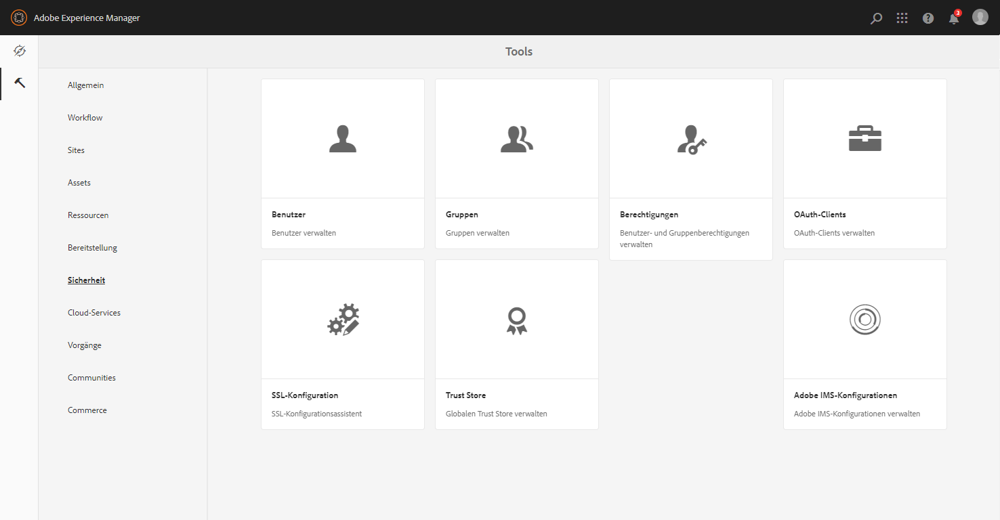

# Konfigurieren von AEM Assets mit Brand Portal {#configure-aem-assets-with-brand-portal}

Adobe Experience Manager (AEM)-Assets werden über die Adobe Developer Console mit dem Markenportal konfiguriert, wodurch ein IMS-Token zur Autorisierung Ihres Markenportal-Mandanten abgerufen wird.

**Wie funktioniert die Konfiguration?**

Die Konfiguration einer AEM Assets-Cloud-Instanz mit Ihrem Markenportal-Mandanten (Unternehmen) ist ein mehrstufiger Prozess, der Konfigurationen sowohl in der AEM Assets-Cloud-Instanz als auch in der Adobe Developer Console erfordert.

1. Erstellen Sie in der AEM Assets-Cloud-Instanz ein IMS-Konto und erstellen Sie ein öffentliches Zertifikat (öffentlicher Schlüssel).
1. Erstellen Sie in Adobe Developer Console ein Projekt für Ihren Markenportal-Mandanten (Unternehmen).
1. Konfigurieren Sie unter dem Projekt eine API mithilfe des öffentlichen Schlüssels, um eine JWT-Verbindung (Dienstkonto) zu erstellen.
1. Rufen Sie die Anmeldeinformationen für das Dienstkonto und die JWT-Nutzdaten ab.
1. Konfigurieren Sie in der AEM Assets-Cloud-Instanz das IMS-Konto mit den Dienstkontoanmeldeinformationen und der JWT-Payload.
1. Konfigurieren Sie in der AEM Assets-Cloud-Instanz den Markenportal-Cloud-Dienst mit dem IMS-Konto und dem Markenportal-Endpunkt (Organisations-URL).
1. Testen Sie die Konfiguration, indem Sie ein Asset aus der AEM Assets-Cloud-Instanz in Brand Portal veröffentlichen.

>[!NOTE]
>>Ein Markenportal-Mandant darf nur mit einer AEM Assets-Cloud-Instanz konfiguriert werden.
>>Konfigurieren Sie keinen Markenportal-Mandanten mit mehreren AEM Assets-Cloud-Instanzen.
>

## Voraussetzungen {#prerequisites}

Sie benötigen Folgendes, um AEM Assets mit Brand Portal zu konfigurieren:

* Eine AEM Assets-Cloud-Instanz, die ausgeführt wird.
* Brand Portal-Mandanten-URL
* Ein Benutzer mit Systemadministrator-Berechtigungen für die IMS-Organisation des Brand Portal-Mandanten

**Wenden Sie sich für weitere Abfragen an den Kundendienst** .

## Erstellen der Konfiguration {#create-new-configuration}

Führen Sie die folgenden Schritte in der angegebenen Reihenfolge aus, um die AEM Assets-Cloud-Instanz mit dem Markenportal zu konfigurieren.

1. [Abrufen eines öffentlichen Zertifikats](#public-certificate)
1. [Verbindung zum Erstellen eines Dienstkontos (JWT)](#createnewintegration)
1. [IMS-Konto konfigurieren](#create-ims-account-configuration)
1. [Konfigurieren von Cloud Service](#configure-the-cloud-service)
1. [Testen der Konfiguration](#test-configuration)

### Erstellen der IMS-Konfiguration {#create-ims-configuration}

Die IMS-Konfiguration authentifiziert Ihren Brand Portal-Mandanten mit der Autoreninstanz von AEM Assets.

Die IMS-Konfiguration umfasst zwei Schritte:

* [Abrufen eines öffentlichen Zertifikats](#public-certificate)
* [IMS-Konto konfigurieren](#create-ims-account-configuration)

### Abrufen eines öffentlichen Zertifikats {#public-certificate}

Mit dem öffentlichen Zertifikat können Sie Ihr Profil in der Adobe Developer Console authentifizieren.

1. Melden Sie sich bei Ihrer AEM Assets-Cloud-Instanz an.

1. Navigieren Sie im **Tool** -Bedienfeld zu **[!UICONTROL Sicherheit]** > **[!UICONTROL Adobe IMS-Konfigurationen]**.

   

1. Klicken Sie auf der Seite &quot;Adobe IMS-Konfigurationen&quot;auf **[!UICONTROL Erstellen]**.

1. Sie werden zur Seite &quot;Konfiguration des technischen **[!UICONTROL Adobe IMS-Kontos]** &quot;weitergeleitet. By default, the **Certificate** tab opens.

   Wählen Sie die Cloud-Lösung **[!UICONTROL Adobe Brand Portal]**.

1. Markieren Sie das Kontrollkästchen **[!UICONTROL Neues Zertifikat erstellen]** und geben Sie einen **Alias** für das Zertifikat an. Der Alias dient als Name des Dialogfelds.

1. Klicken Sie auf **[!UICONTROL Zertifikat erstellen]**. Klicken Sie dann im Dialogfeld auf **[!UICONTROL OK]** , um das öffentliche Zertifikat zu generieren.

   

1. Click **[!UICONTROL Download Public Key]** and save the certificate (.crt) file on your machine.

   Die Zertifikatdatei wird in weiteren Schritten zum Konfigurieren der API für Ihren Markenportal-Mandanten und zum Generieren von Dienstkontoanmeldeinformationen in der Adobe Developer Console verwendet.

   

1. Klicken Sie auf **[!UICONTROL Weiter]**.

   Auf der Registerkarte &quot; **Konto** &quot;erstellen Sie das Adobe IMS-Konto, dafür benötigen Sie jedoch die Dienstkontoanmeldeinformationen, die in der Adobe Developer Console generiert werden. Lassen Sie diese Seite vorerst offen.

   Öffnen Sie eine neue Registerkarte und [erstellen Sie eine JWT-Verbindung (Dienstkonto) in Adobe Developer Console](#createnewintegration) , um die Anmeldeinformationen und die JWT-Nutzlast zum Konfigurieren des IMS-Kontos abzurufen.

### Verbindung zum Erstellen eines Dienstkontos (JWT) {#createnewintegration}

In der Adobe Developer Console werden Projekte und APIs auf Unternehmensebene (Pächter des Markenportals) konfiguriert. Beim Konfigurieren einer API wird eine JWT-Verbindung (Service Account) in der Adobe Developer Console erstellt. Es gibt zwei Methoden zum Konfigurieren der API, indem ein Schlüsselpaar (private und öffentliche Schlüssel) generiert oder ein öffentlicher Schlüssel hochgeladen wird. Um die AEM Assets-Cloud-Instanz mit dem Markenportal zu konfigurieren, müssen Sie ein öffentliches Zertifikat (öffentlichen Schlüssel) in der AEM Assets-Cloud-Instanz generieren und Anmeldeinformationen in Adobe Developer Console erstellen, indem Sie den öffentlichen Schlüssel hochladen. Dieser öffentliche Schlüssel wird zum Konfigurieren der API für das ausgewählte Markenportal-Unternehmen verwendet und generiert die Anmeldeinformationen und die JWT-Nutzlast für das Dienstkonto. Diese Anmeldeinformationen werden außerdem zum Konfigurieren des IMS-Kontos in der AEM Assets-Cloud-Instanz verwendet. Nachdem das IMS-Konto konfiguriert wurde, können Sie den Markenportal-Cloud-Dienst in der AEM Assets-Cloud-Instanz konfigurieren.

Führen Sie die folgenden Schritte aus, um die Dienstkontoberechtigungen und die JWT-Nutzlast zu generieren:

1. Melden Sie sich bei der Adobe Developer Console mit Systemadministrator-Berechtigungen für die IMS-Organisation (Brand Portal-Mandant) an. Die Standardeinstellung ist

   [https://www.adobe.com/go/devs_console_ui](https://www.adobe.com/go/devs_console_ui)

   >[!NOTE]
   >
   >Vergewissern Sie sich, dass Sie die richtige IMS-Organisation (Markenportal-Mieter) aus der Dropdown-Liste (Organisations-Liste) oben rechts ausgewählt haben.

1. Click **[!UICONTROL Create new project]**. Ein leeres Projekt wird für Ihre Organisation erstellt.

   Klicken Sie auf Projekt **[!UICONTROL bearbeiten]** , um den **[!UICONTROL Projekttitel]** und die **[!UICONTROL Projektbeschreibung]** zu aktualisieren, und klicken Sie auf **[!UICONTROL Speichern]**.

   

1. Klicken Sie auf der Registerkarte Projektübersicht auf **[!UICONTROL Hinzufügen API]**.

   

1. Wählen Sie im Fenster Hinzufügen API die Option **[!UICONTROL AEM Brand Portal]** und klicken Sie auf **[!UICONTROL Weiter]**.

   Stellen Sie sicher, dass Sie Zugriff auf den AEM Brand Portal-Dienst haben.

1. Klicken Sie im Fenster &quot;API konfigurieren&quot;auf Ihren öffentlichen Schlüssel **[!UICONTROL hochladen]**. Klicken Sie dann auf &quot;Datei **** auswählen&quot;und laden Sie das öffentliche Zertifikat (.crt-Datei) hoch, das Sie im Abschnitt zum [Abrufen des öffentlichen Zertifikats](#public-certificate) heruntergeladen haben.

   Klicken Sie auf **[!UICONTROL Weiter]**.

   

1. Überprüfen Sie das öffentliche Zertifikat und klicken Sie auf **[!UICONTROL Weiter]**.

1. Im Markenportal wird für jede Organisation ein Standard-Profil erstellt. Die Profil &quot;Produkt&quot;werden in der Admin-Konsole erstellt, um Benutzern Gruppen zuzuweisen (je nach Rollen und Berechtigungen). Für die Konfiguration mit dem Markenportal wird das OAuth-Token auf Unternehmensebene erstellt. Daher müssen Sie das standardmäßige Produkt-Profil für Ihr Unternehmen konfigurieren.

   Wählen Sie das Standardprodukt- **[!UICONTROL Asset-Markenportal]** aus.

   

1. Wenn die API konfiguriert ist, werden Sie zur API-Übersicht weitergeleitet. Klicken Sie in der linken Navigation unter **[!UICONTROL Berechtigungen]** auf **[!UICONTROL Dienstkonto (JWT)]**.

   >[!NOTE]
   >
   >Sie können die Anmeldeinformationen nach Bedarf Ansicht und andere Aktionen ausführen (JWT-Token generieren, Berechtigungsdetails kopieren, Clientgeheimnisse abrufen usw.).

1. Kopieren Sie auf der Registerkarte &quot; **[!UICONTROL Clientanmeldeinformationen]** &quot;die **[!UICONTROL Client-ID]**.

   Click **[!UICONTROL Retrieve Client Secret]** and copy the **[!UICONTROL client secret]**.

   

1. Navigate to the **[!UICONTROL Generate JWT]** tab and copy the **[!UICONTROL JWT Payload]**.

Sie können jetzt die Client-ID (API-Schlüssel), das Clientgeheimnis und die JWT-Nutzlast verwenden, um das IMS-Konto [in der AEM Assets-Cloud-Instanz zu](#create-ims-account-configuration) konfigurieren.

<!--
1. Click **[!UICONTROL Create Integration]**.

1. Select **[!UICONTROL Access an API]**, and click **[!UICONTROL Continue]**.

   

1. Create a new integration page opens. 
   
   Select your organization from the drop-down list.

   In **[!UICONTROL Experience Cloud]**, Select **[!UICONTROL AEM Brand Portal]** and click **[!UICONTROL Continue]**. 

   If the Brand Portal option is disabled for you, ensure that you have selected correct organization from the drop-down box above the **[!UICONTROL Adobe Services]** option. If you do not know your organization, contact your administrator.

   

1. Specify a name and description for the integration. Click **[!UICONTROL Select a File from your computer]** and upload the `AEM-Adobe-IMS.crt` file downloaded in the [obtain public certificates](#public-certificate) section.

1. Select the profile of your organization. 

   Or, select the default profile **[!UICONTROL Assets Brand Portal]** and click **[!UICONTROL Create Integration]**. The integration is created.

1. Click **[!UICONTROL Continue to integration details]** to view the integration information. 

   Copy the **[!UICONTROL API Key]** 
   
   Click **[!UICONTROL Retrieve Client Secret]** and copy the Client Secret key.

   

1. Navigate to **[!UICONTROL JWT]** tab, and copy the **[!UICONTROL JWT payload]**.

   The API Key, Client Secret key, and JWT payload information will be used to create IMS account configuration.

-->

### IMS-Konto konfigurieren {#create-ims-account-configuration}

Stellen Sie sicher, dass Sie die folgenden Schritte ausgeführt haben:

* [Abrufen eines öffentlichen Zertifikats](#public-certificate)
* [Verbindung zum Erstellen eines Dienstkontos (JWT)](#createnewintegration)

Führen Sie die folgenden Schritte aus, um das IMS-Konto zu konfigurieren, das Sie im [Abrufen des öffentlichen Zertifikats](#public-certificate)erstellt haben.

1. Öffnen Sie die IMS-Konfiguration und navigieren Sie zur Registerkarte &quot; **[!UICONTROL Konten]** &quot;. Sie haben die Seite geöffnet, während Sie das öffentliche Zertifikat [erhalten haben](#public-certificate).

1. Geben Sie einen **[!UICONTROL Titel]** für das IMS-Konto an.

   Geben Sie in **[!UICONTROL Autorisierungsserver]** die URL ein: [https://ims-na1.adobelogin.com/](https://ims-na1.adobelogin.com/)

   Fügen Sie die Client-ID in den API-Schlüssel, den Clientschlüssel und die JWT-Nutzlast ein, die Sie beim [Erstellen der JWT-Verbindung](#createnewintegration)kopiert haben.

   Klicken Sie auf **[!UICONTROL Erstellen]**.

   Das IMS-Konto ist konfiguriert.

   

1. Select the IMS account configuration and click **[!UICONTROL Check Health]**.

   Klicken Sie im Dialogfeld auf **[!UICONTROL Aktivieren]** . Bei erfolgreicher Konfiguration wird eine Meldung angezeigt, dass das *Token erfolgreich* abgerufen wurde.

   

>[!CAUTION]
>
>Sie dürfen nur eine IMS-Konfiguration haben. Erstellen Sie nicht mehrere IMS-Konfigurationen.
>
>Vergewissern Sie sich, dass die IMS-Konfiguration die Konsistenzprüfung besteht. Wenn die Konfiguration die Konsistenzprüfung nicht besteht, ist sie ungültig. Sie müssen sie löschen und eine neue gültige Konfiguration erstellen.

### Konfigurieren von Cloud Service {#configure-the-cloud-service}

Führen Sie die folgenden Schritte aus, um den Markenportal-Cloud-Dienst zu konfigurieren:

1. Melden Sie sich bei Ihrer AEM Assets-Cloud-Instanz an.

1. Navigieren Sie im **Tool** -Bedienfeld zu **[!UICONTROL Cloud Services]** > **[!UICONTROL AEM Brand Portal]**.

1. Klicken Sie auf der Seite &quot;Markenportal-Konfigurationen&quot;auf **[!UICONTROL Erstellen]**.

1. Geben Sie einen **[!UICONTROL Titel]** für die Konfiguration ein.

   Wählen Sie die IMS-Konfiguration aus, die Sie beim [Konfigurieren des IMS-Kontos](#create-ims-account-configuration)erstellt haben.

   In the **[!UICONTROL Service URL]**, enter your Brand Portal tenant (organization URL).

   

1. Klicken Sie auf **[!UICONTROL Speichern und schließen]**. Die Cloud-Konfiguration wird erstellt. Ihre AEM Assets-Cloud-Instanz ist jetzt mit dem Brand Portal-Mandanten konfiguriert.

### Testen der Konfiguration {#test-configuration}

Führen Sie die folgenden Schritte aus, um die Konfiguration zu validieren:

1. Melden Sie sich bei Ihrer AEM Assets-Cloud-Instanz an.

1. Navigieren Sie im **Tool** -Bedienfeld zu **[!UICONTROL Bereitstellung]** > **[!UICONTROL Verteilung]**.

   

1. Auf der Seite &quot;Distribution&quot;können Sie sehen, dass ein Distributionsagent für das Markenportal `bpdistributionagent0` für die **[!UICONTROL Veröffentlichung im Markenportal]** erstellt wurde.

   Klicken Sie auf **[!UICONTROL In Brand Portal veröffentlichen]**.

   

   >[!NOTE]
   >
   >Standardmäßig wird für einen Brand Portal-Mandanten ein Verteilungsagent erstellt.

1. Auf der Seite &quot;Distribution Agent&quot;werden die Verteilungswarteschlangen auf der Registerkarte &quot; **[!UICONTROL Status]** &quot;angezeigt.

   Ein Verteilungsagent enthält zwei Warteschlangen:
   * **Verarbeitungswarteschlange (processing-queue)**: für die Verteilung von Assets an Brand Portal.

   * **Fehlerwarteschlange (error-queue)**: für die Assets, bei denen die Verteilung fehlgeschlagen ist.
   >[!NOTE]
   >
   >Es wird empfohlen, die Fehler zu überprüfen und die **Fehlerwarteschlange** regelmäßig zu löschen.

   

1. Um die Verbindung zwischen AEM Assets und Brand Portal zu überprüfen, klicken Sie auf **[!UICONTROL Verbindung testen]**.

   

   Unten auf der Seite wird eine Meldung angezeigt, dass Ihr Testpaket erfolgreich bereitgestellt wurde.

   >[!NOTE]
   >
   >Vermeiden Sie das Deaktivieren des Verteilungsagenten, da dies dazu führen kann, dass die Verteilung der Assets (in der Warteschlange) fehlschlägt.

Ihre AEM Assets-Cloud-Instanz wurde erfolgreich mit Brand Portal konfiguriert. Jetzt können Sie Folgendes ausführen:

* [Veröffentlichen von Assets aus AEM Assets in Brand Portal](publish-to-brand-portal.md)
* [Veröffentlichen von Ordnern aus AEM Assets in Brand Portal](publish-to-brand-portal.md#publish-folders-to-brand-portal)
* [Veröffentlichen von Sammlungen aus AEM Assets in Brand Portal](publish-to-brand-portal.md#publish-collections-to-brand-portal)

Darüber hinaus können Sie Metadatenschemata, Bildvorgaben, Suchfacetten und Tags von AEM Assets in Brand Portal veröffentlichen.

* [Veröffentlichen von Vorgaben, Schemata und Facetten in Brand Portal](https://docs.adobe.com/content/help/de-DE/experience-manager-brand-portal/using/publish/publish-schema-search-facets-presets.html)
* [Veröffentlichen von Tags in Brand Portal](https://docs.adobe.com/content/help/de-DE/experience-manager-brand-portal/using/publish/brand-portal-publish-tags.html)

Weitere Informationen finden Sie in der [Dokumentation zu Brand Portal](https://docs.adobe.com/content/help/de-DE/experience-manager-brand-portal/using/home.html).

## Verteilungsprotokolle {#distribution-logs}

In den Protokollen finden Sie detaillierte Informationen zu den Aktionen des Distributionsagenten.

Beispielsweise haben wir ein Asset aus AEM Assets in Brand Portal veröffentlicht, um die Konfiguration zu validieren.

1. Follow the steps (from 1 to 4) as shown in **[!UICONTROL Test Connection]** and navigate to the distribution agent page.

1. Klicken Sie auf **[!UICONTROL Protokolle]**, um die Verteilungsprotokolle anzuzeigen. Hier können Sie die Verarbeitungs- und Fehlerprotokolle sehen.

   

Der Verteilungsagenten generiert die folgenden Protokolle:

* INFO: Dies ist ein vom System erstelltes Protokoll, das bei einer erfolgreichen Konfiguration ausgelöst wird, die den Verteilungsagenten aktiviert.
* DSTRQ1 (Anfrage 1): Wird bei der Testverbindung ausgelöst.

Beim Veröffentlichen des Assets werden die folgenden Anfrage- und Antwortprotokolle generiert:

**Anfrage des Verteilungsagenten**:
* DSTRQ2 (Anfrage 2): Die Anfrage zur Veröffentlichung des Assets wird ausgelöst.
* DSTRQ3 (Anfrage 3): Das System löst eine weitere Anfrage zum Veröffentlichen des Ordners aus, in dem sich das Asset befindet, und repliziert den Ordner in Brand Portal.

**Antwort des Verteilungsagenten**:
* queue-bpdistributionagent0 (DSTRQ2): Das Asset wird in Brand Portal veröffentlicht.
* queue-bpdistributionagent0 (DSTRQ3): Das System repliziert den Ordner, der das Asset enthält, in Brand Portal.

Im obigen Beispiel werden eine zusätzliche Anfrage und Antwort ausgelöst. Das System konnte den übergeordneten Ordner (auch als Hinzufügen-Pfad bezeichnet) in Brand Portal nicht finden, da das Asset zum ersten Mal veröffentlicht wurde. Daher wird eine zusätzliche Anfrage ausgelöst, einen übergeordneten Ordner mit demselben Namen in Brand Portal zu erstellen, in dem das Asset veröffentlicht wird.

>[!NOTE]
>
>Es wird eine zusätzliche Anfrage generiert, wenn der übergeordnete Ordner nicht in Brand Portal vorhanden ist (im oben stehenden Beispiel) oder der übergeordnete Ordner in AEM Assets geändert wurde.

<!--

## Additional information {#additional-information}

Go to `/system/console/slingmetrics` for statistics related to the distributed content:

1. **Counter metrics**
   * sling: `mac_sync_request_failure`
   * sling: `mac_sync_request_received`
   * sling: `mac_sync_request_success`

1. **Time metrics**
   * sling: `mac_sync_distribution_duration`
   * sling: `mac_sync_enqueue_package_duration`
   * sling: `mac_sync_setup_request_duration`

-->

<!--
   Comment Type: draft

   <li> </li>
   -->

<!--
   Comment Type: draft

   <li>Step text</li>
   -->
