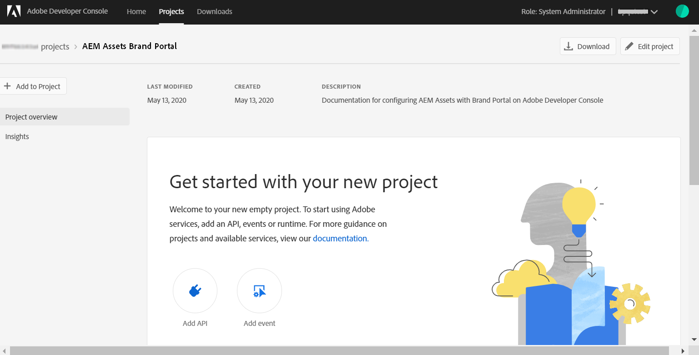

# Konfigurieren von AEM Assets mit Brand Portal {#configure-aem-assets-with-brand-portal}

Adobe Experience Manager (AEM) Assets wird über die Adobe Developer Console mit Brand Portal konfiguriert. Dadurch wird ein IMS-Token zur Autorisierung Ihres Brand Portal-Mandanten abgerufen.

**Wie funktioniert die Konfiguration?**

Zum Konfigurieren der AEM Assets-Cloud-Instanz mit einem Brand Portal-Mandanten (Unternehmen) sind Konfigurationen sowohl in der AEM Assets-Cloud-Instanz als auch in der Adobe Developer Console erforderlich.

1. Erstellen Sie in der AEM Assets-Cloud-Instanz ein IMS-Konto und in öffentliches Zertifikat (einen öffentlichen Schlüssel).
1. Erstellen Sie in der Adobe Developer Console ein Projekt für Ihren Brand Portal-Mandanten (Unternehmen).
1. Konfigurieren Sie unter dem Projekt eine API mithilfe des öffentlichen Schlüssels, um eine JWT-Verbindung (Dienstkonto) zu erstellen.
1. Rufen Sie die Anmeldedaten für das Dienstkonto und die JWT-Payload-Informationen ab.
1. Konfigurieren Sie in der AEM Assets-Cloud-Instanz das IMS-Konto mit den Anmeldedaten für das Dienstkonto und die JWT-Payload.
1. Konfigurieren Sie in der AEM Assets-Cloud-Instanz den Brand Portal-Cloud Service mit dem IMS-Konto und dem Brand Portal-Endpunkt (Organisations-URL).
1. Testen Sie die Konfiguration, indem Sie ein Asset aus der AEM Assets-Cloud-Instanz in Brand Portal veröffentlichen.

>[!NOTE]
>
>Ein Brand Portal-Mandant darf nur mit einer AEM Assets-Cloud-Instanz konfiguriert werden.
>
>Konfigurieren Sie keinen Brand Portal-Mandanten mit mehreren AEM Assets-Cloud-Instanzen.

## Voraussetzungen {#prerequisites}

Sie benötigen Folgendes, um AEM Assets mit Brand Portal zu konfigurieren:

* Eine AEM Assets-Cloud-Instanz, die ausgeführt wird.
* Brand Portal-Mandanten-URL
* Ein Benutzer mit Systemadministrator-Berechtigungen für die IMS-Organisation des Brand Portal-Mandanten

Wenden Sie sich mit weiteren Fragen an die **Kundenunterstützung**.

## Erstellen der Konfiguration {#create-new-configuration}

Führen Sie die folgenden Schritte in der angegebenen Reihenfolge aus, um die AEM Assets-Cloud-Instanz mit Brand Portal zu konfigurieren.

1. [Abrufen eines öffentlichen Zertifikats](#public-certificate)
1. [Erstellen einer JWT-Verbindung (Dienstkonto)](#createnewintegration)
1. [Konfigurieren des IMS-Kontos](#create-ims-account-configuration)
1. [Konfigurieren von Cloud Service](#configure-the-cloud-service)
1. [Testen der Konfiguration](#test-configuration)

### Erstellen der IMS-Konfiguration {#create-ims-configuration}

Die IMS-Konfiguration authentifiziert Ihren Brand Portal-Mandanten bei der Cloud-Instanz von AEM Assets.

Die IMS-Konfiguration umfasst zwei Schritte:

* [Abrufen eines öffentlichen Zertifikats](#public-certificate)
* [Konfigurieren des IMS-Kontos](#create-ims-account-configuration)

### Abrufen eines öffentlichen Zertifikats {#public-certificate}

Ein öffentliches Zertifikat ermöglicht Ihnen die Authentifizierung Ihres Profils in der Adobe Developer Console.

1. Melden Sie sich bei Ihrer AEM Assets-Cloud-Instanz an.

1. Navigieren Sie im Bedienfeld **Tools**  zu **[!UICONTROL Sicherheit]** > **[!UICONTROL Adobe IMS-Konfigurationen]**.

   

1. Klicken Sie auf der Seite mit den Adobe IMS-Konfigurationen auf **[!UICONTROL Erstellen]**.

1. Sie gelangen auf die Seite für die **[!UICONTROL Konfiguration des technischen Adobe IMS-Kontos]**. Standardmäßig wird die Registerkarte **Zertifikat** geöffnet.

   Wählen Sie die Cloud-Lösung **[!UICONTROL Adobe Brand Portal]** aus.

1. Markieren Sie das Kontrollkästchen **[!UICONTROL Neues Zertifikat erstellen]** und geben Sie einen **Alias** für das Zertifikat an. Der Alias dient als Name des Dialogfelds.

1. Klicken Sie auf **[!UICONTROL Zertifikat erstellen]**. Klicken Sie dann im Dialogfeld auf **[!UICONTROL OK]**, um das öffentliche Zertifikat zu generieren.

   

1. Klicken Sie auf **[!UICONTROL Öffentlichen Schlüssel herunterladen]** und speichern Sie die Zertifikatdatei (.crt) auf Ihrem Computer.

   Die Zertifikatdatei wird in weiteren Schritten zum Konfigurieren der API für Ihren Brand Portal-Mandanten und zum Generieren von Anmeldedaten für Dienstkonten in der Adobe Developer Console verwendet.

   

1. Klicken Sie auf **[!UICONTROL Weiter]**.

   Erstellen Sie auf der Registerkarte **Konto** das Adobe IMS-Konto. Dafür benötigen Sie jedoch die Anmeldedaten für Dienstkonten, die in der Adobe Developer Console generiert werden. Lassen Sie diese Seite vorerst offen.

   Öffnen Sie eine neue Registerkarte und [erstellen Sie in der Adobe Developer Console eine JWT-Verbindung (Dienstkonto)](#createnewintegration), um die Anmeldedaten und die JWT-Payload für die Konfiguration des IMS-Kontos abzurufen.

### Erstellen einer JWT-Verbindung (Dienstkonto) {#createnewintegration}

In der Adobe Developer Console werden Projekte und APIs auf Unternehmensebene (Brand Portal-Mandant) konfiguriert. Beim Konfigurieren einer API wird eine JWT-Verbindung (Dienstkonto) in der Adobe Developer Console erstellt. Es gibt zwei Methoden zum Konfigurieren der API: Generieren eines Schlüsselpaars (privater und öffentlicher Schlüssel) oder Hochladen eines öffentlichen Schlüssels. Um die AEM Assets-Cloud-Instanz mit Brand Portal zu konfigurieren, müssen Sie ein öffentliches Zertifikat (öffentlichen Schlüssel) in der AEM Assets-Cloud-Instanz generieren und Anmeldedaten in der Adobe Developer Console erstellen, indem Sie den öffentlichen Schlüssel hochladen. Dieser öffentliche Schlüssel wird zum Konfigurieren der API für das ausgewählte Brand Portal-Unternehmen verwendet und generiert die Anmeldedaten und die JWT-Payload für das Dienstkonto. Diese Anmeldedaten werden außerdem zum Konfigurieren des IMS-Kontos in der AEM Assets-Cloud-Instanz verwendet. Sobald das IMS-Konto konfiguriert ist, können Sie den Brand Portal-Cloud Service in der Cloud-Instanz von AEM Assets konfigurieren.

Führen Sie die folgenden Schritte aus, um die Anmeldedaten für das Dienstkonto und die JWT-Payload zu generieren:

1. Melden Sie sich bei der Adobe Developer Console mit Systemadministratorrechten für die IMS-Organisation (den Brand Portal-Mandanten) an. Die Standardeinstellung ist

   [https://www.adobe.com/go/devs_console_ui](https://www.adobe.com/go/devs_console_ui)

   >[!NOTE]
   >
   >Vergewissern Sie sich, dass Sie die richtige IMS-Organisation (Brand Portal-Mandant) aus der Dropdown-Liste (Organisationsliste) oben rechts ausgewählt haben.

1. Klicken Sie auf **[!UICONTROL Neues Projekt erstellen]**. Für Ihre Organisation wird ein leeres Projekt erstellt.

   Klicken Sie auf **[!UICONTROL Projekt bearbeiten]**, um den **[!UICONTROL Projekttitel]** und die **[!UICONTROL Projektbeschreibung]** zu aktualisieren, und klicken Sie auf **[!UICONTROL Speichern]**.

   

1. Klicken Sie auf der Registerkarte mit der Projektübersicht auf **[!UICONTROL API hinzufügen]**.

   

1. Wählen Sie im Fenster „API hinzufügen“ die Option **[!UICONTROL AEM Brand Portal]** aus und klicken Sie auf **[!UICONTROL Weiter]**.

   Stellen Sie sicher, dass Sie Zugriff auf den AEM Brand Portal-Dienst haben.

1. Klicken Sie im Fenster „API konfigurieren“ auf **[!UICONTROL Öffentlichen Schlüssel hochladen]**. Klicken Sie dann auf **[!UICONTROL Datei auswählen]** und laden Sie das öffentliche Zertifikat (.crt-Datei) hoch, das Sie im Abschnitt zum [Abrufen des öffentlichen Zertifikats](#public-certificate) heruntergeladen haben.

   Klicken Sie auf **[!UICONTROL Weiter]**.

   

1. Überprüfen Sie das öffentliche Zertifikat und klicken Sie auf **[!UICONTROL Weiter]**.

1. Wählen Sie das Standardproduktprofil **[!UICONTROL Assets Brand Portal]** aus und klicken Sie auf **[!UICONTROL Konfiguration speichern]**.

   <!-- 
   In Brand Portal, a default profile is created for each organization. The Product Profiles are created in admin console for assigning users to groups (based on the roles and permissions). For configuration with Brand Portal, the OAuth token is created at organization level. Therefore, you must configure the default Product Profile for your organization. 
   -->

   

1. Sobald die API konfiguriert ist, werden Sie zur API-Übersicht weitergeleitet. Klicken Sie in der linken Navigation unter **[!UICONTROL Anmeldedaten]** auf **[!UICONTROL Dienstkonto (JWT)]**.

   >[!NOTE]
   >
   >Sie können die Anmeldedaten einsehen und bei Bedarf weitere Aktionen durchführen (JWT-Token generieren, Anmeldedaten kopieren, Client-Geheimnisse abrufen usw.).

1. Kopieren Sie auf der Registerkarte **[!UICONTROL Client-Anmeldedaten]** die **[!UICONTROL Client-ID]**.

   Klicken Sie auf **[!UICONTROL Client-Geheimnis abrufen]** und kopieren Sie das **[!UICONTROL Client-Geheimnis]**.

   

1. Navigieren Sie zur Registerkarte **[!UICONTROL JWT generieren]** und kopieren Sie die **[!UICONTROL JWT-Payload]**.

Sie können jetzt die Client-ID (API-Schlüssel), das Client-Geheimnis und die JWT-Payload verwenden, um das [IMS-Konto in der AEM Assets Cloud-Instanz zu konfigurieren](#create-ims-account-configuration).

<!--
1. Click **[!UICONTROL Create Integration]**.

1. Select **[!UICONTROL Access an API]**, and click **[!UICONTROL Continue]**.

   

1. Create a new integration page opens. 
   
   Select your organization from the drop-down list.

   In **[!UICONTROL Experience Cloud]**, Select **[!UICONTROL AEM Brand Portal]** and click **[!UICONTROL Continue]**. 

   If the Brand Portal option is disabled for you, ensure that you have selected correct organization from the drop-down box above the **[!UICONTROL Adobe Services]** option. If you do not know your organization, contact your administrator.

   

1. Specify a name and description for the integration. Click **[!UICONTROL Select a File from your computer]** and upload the `AEM-Adobe-IMS.crt` file downloaded in the [obtain public certificates](#public-certificate) section.

1. Select the profile of your organization. 

   Or, select the default profile **[!UICONTROL Assets Brand Portal]** and click **[!UICONTROL Create Integration]**. The integration is created.

1. Click **[!UICONTROL Continue to integration details]** to view the integration information. 

   Copy the **[!UICONTROL API Key]** 
   
   Click **[!UICONTROL Retrieve Client Secret]** and copy the Client Secret key.

   

1. Navigate to **[!UICONTROL JWT]** tab, and copy the **[!UICONTROL JWT payload]**.

   The API Key, Client Secret key, and JWT payload information will be used to create IMS account configuration.

-->

### Konfigurieren des IMS-Kontos {#create-ims-account-configuration}

Stellen Sie sicher, dass Sie die folgenden Schritte ausgeführt haben:

* [Abrufen eines öffentlichen Zertifikats](#public-certificate)
* [Erstellen einer JWT-Verbindung (Dienstkonto)](#createnewintegration)

Führen Sie die folgenden Schritte aus, um das IMS-Konto zu konfigurieren, das Sie unter [Abrufen des öffentlichen Zertifikats](#public-certificate) erstellt haben.

1. Öffnen Sie die IMS-Konfiguration und navigieren Sie zur Registerkarte **[!UICONTROL Konten]**. Sie haben die Seite offen gelassen, während Sie das [öffentliche Zertifikat abgerufen](#public-certificate) haben.

1. Geben Sie einen **[!UICONTROL Titel]** für das IMS-Konto an.

   Geben Sie in **[!UICONTROL Autorisierungsserver]** die URL ein: [https://ims-na1.adobelogin.com/](https://ims-na1.adobelogin.com/)

   Fügen Sie die Client-ID in den API-Schlüssel, das Client-Geheimnis und die JWT-Payload ein, die Sie beim [Erstellen der JWT-Verbindung (Dienstkonto)](#createnewintegration) kopiert haben.

   Klicken Sie auf **[!UICONTROL Erstellen]**.

   Das IMS-Konto ist konfiguriert.

   

1. Wählen Sie die IMS-Kontokonfiguration aus und klicken Sie auf **[!UICONTROL Systemdiagnose]**.

   Klicken Sie im Dialogfeld auf **[!UICONTROL Prüfen]**. Bei erfolgreicher Konfiguration wird eine Meldung angezeigt, dass das *Token erfolgreich abgerufen* wurde.

   

>[!CAUTION]
>
>Sie dürfen nur eine IMS-Konfiguration haben. Erstellen Sie nicht mehrere IMS-Konfigurationen.
>
>Vergewissern Sie sich, dass die IMS-Konfiguration die Konsistenzprüfung besteht. Wenn die Konfiguration die Konsistenzprüfung nicht besteht, ist sie ungültig. Sie müssen sie löschen und eine neue gültige Konfiguration erstellen.

### Konfigurieren von Cloud Service {#configure-the-cloud-service}

Führen Sie die folgenden Schritte aus, um den Brand Portal-Cloud Service zu konfigurieren:

1. Melden Sie sich bei Ihrer AEM Assets-Cloud-Instanz an.

1. Navigieren Sie im **Tool** -Bedienfeld zu **[!UICONTROL Cloud Services]** > **[!UICONTROL AEM Brand Portal]**.

1. Klicken Sie auf der Seite mit den Brand Portal-Konfigurationen auf **[!UICONTROL Erstellen]**.

1. Geben Sie einen **[!UICONTROL Titel]** für die Konfiguration ein.

   Wählen Sie die IMS-Konfiguration aus, die Sie beim [Konfigurieren des IMS-Kontos](#create-ims-account-configuration) erstellt haben.

   Geben Sie in **[!UICONTROL Dienst-URL]** Ihre Brand Portal-Mandanten (Organisations)-URL ein.

   

1. Klicken Sie auf **[!UICONTROL Speichern und schließen]**. Die Cloud-Konfiguration wird erstellt. Ihre AEM Assets-Cloud-Instanz ist jetzt mit dem Brand Portal-Mandanten konfiguriert.

### Testen der Konfiguration {#test-configuration}

Führen Sie zur Validierung der Konfiguration folgende Schritte aus:

1. Melden Sie sich bei Ihrer AEM Assets-Cloud-Instanz an.

1. Navigieren Sie im Bedienfeld **Tool**  zu **[!UICONTROL Bereitstellung]** > **[!UICONTROL Verteilung]**.

   

1. Auf der Seite „Verteilung“ können Sie sehen, dass ein Brand Portal-Verteilungsagent `bpdistributionagent0` für die **[!UICONTROL Veröffentlichung in Brand Portal]** erstellt wurde.

   Klicken Sie auf **[!UICONTROL In Brand Portal veröffentlichen]**.

   

   >[!NOTE]
   >
   >Standardmäßig wird für einen Brand Portal-Mandanten ein Verteilungsagent erstellt.

1. Auf der Seite des Verteilungsagenten werden die Verteilungswarteschlangen auf der Registerkarte **[!UICONTROL Status]** angezeigt.

   Ein Verteilungsagent enthält zwei Warteschlangen:
   * **Verarbeitungswarteschlange (processing-queue)**: für die Verteilung von Assets an Brand Portal.

   * **Fehlerwarteschlange (error-queue)**: für die Assets, bei denen die Verteilung fehlgeschlagen ist.
   >[!NOTE]
   >
   >Es wird empfohlen, die Fehler zu überprüfen und die **Fehlerwarteschlange** regelmäßig zu löschen.

   

1. Um die Verbindung zwischen AEM Assets und Brand Portal zu überprüfen, klicken Sie auf **[!UICONTROL Verbindung testen]**.

   

   Unten auf der Seite wird eine Meldung angezeigt, dass Ihr Testpaket erfolgreich bereitgestellt wurde.

   >[!NOTE]
   >
   >Vermeiden Sie das Deaktivieren des Verteilungsagenten, da dies dazu führen kann, dass die Verteilung der Assets (in der Warteschlange) fehlschlägt.

Ihre AEM Assets-Cloud-Instanz wurde erfolgreich mit Brand Portal konfiguriert. Jetzt können Sie Folgendes ausführen:

* [Veröffentlichen von Assets aus AEM Assets in Brand Portal](publish-to-brand-portal.md)
* [Veröffentlichen von Ordnern aus AEM Assets in Brand Portal](publish-to-brand-portal.md#publish-folders-to-brand-portal)
* [Veröffentlichen von Sammlungen aus AEM Assets in Brand Portal](publish-to-brand-portal.md#publish-collections-to-brand-portal)

Darüber hinaus können Sie Metadatenschemata, Bildvorgaben, Suchfacetten und Tags von AEM Assets in Brand Portal veröffentlichen.

* [Veröffentlichen von Vorgaben, Schemata und Facetten in Brand Portal](https://docs.adobe.com/content/help/de-DE/experience-manager-brand-portal/using/publish/publish-schema-search-facets-presets.html)
* [Veröffentlichen von Tags in Brand Portal](https://docs.adobe.com/content/help/de-DE/experience-manager-brand-portal/using/publish/brand-portal-publish-tags.html)

Weitere Informationen finden Sie in der [Dokumentation zu Brand Portal](https://docs.adobe.com/content/help/de-DE/experience-manager-brand-portal/using/home.html).

## Verteilungsprotokolle {#distribution-logs}

In den Protokollen finden Sie detaillierte Informationen zu den Aktionen, die durch den Verteilungsagenten ausgeführt werden.

Beispielsweise haben wir ein Asset aus AEM Assets in Brand Portal veröffentlicht, um die Konfiguration zu validieren.

1. Follow the steps (from 1 to 4) as shown in the [Test Configuration](#test-configuration) section and navigate to the distribution agent page.

1. Klicken Sie auf **[!UICONTROL Protokolle]**, um die Verteilungsprotokolle anzuzeigen. Hier können Sie die Verarbeitungs- und Fehlerprotokolle sehen.

   

Der Verteilungsagenten generiert die folgenden Protokolle:

* INFO: Dies ist ein vom System erstelltes Protokoll, das bei einer erfolgreichen Konfiguration ausgelöst wird, die den Verteilungsagenten aktiviert.
* DSTRQ1 (Anfrage 1): Wird bei der Testverbindung ausgelöst.

Beim Veröffentlichen des Assets werden die folgenden Anfrage- und Antwortprotokolle generiert:

**Anfrage des Verteilungsagenten**:
* DSTRQ2 (Anfrage 2): Die Anfrage zur Veröffentlichung des Assets wird ausgelöst.
* DSTRQ3 (Anfrage 3): Das System löst eine weitere Anfrage zum Veröffentlichen des Ordners aus, in dem sich das Asset befindet, und repliziert den Ordner in Brand Portal.

**Antwort des Verteilungsagenten**:
* queue-bpdistributionagent0 (DSTRQ2): Das Asset wird in Brand Portal veröffentlicht.
* queue-bpdistributionagent0 (DSTRQ3): Das System repliziert den Ordner, der das Asset enthält, in Brand Portal.

Im obigen Beispiel werden eine zusätzliche Anfrage und Antwort ausgelöst. Das System konnte den übergeordneten Ordner (auch als Hinzufügen-Pfad bezeichnet) in Brand Portal nicht finden, da das Asset zum ersten Mal veröffentlicht wurde. Daher wird eine zusätzliche Anfrage ausgelöst, einen übergeordneten Ordner mit demselben Namen in Brand Portal zu erstellen, in dem das Asset veröffentlicht wird.

>[!NOTE]
>
>Es wird eine zusätzliche Anfrage generiert, wenn der übergeordnete Ordner nicht in Brand Portal vorhanden ist (im oben stehenden Beispiel) oder der übergeordnete Ordner in AEM Assets geändert wurde.

<!--

## Additional information {#additional-information}

Go to `/system/console/slingmetrics` for statistics related to the distributed content:

1. **Counter metrics**
   * sling: `mac_sync_request_failure`
   * sling: `mac_sync_request_received`
   * sling: `mac_sync_request_success`

1. **Time metrics**
   * sling: `mac_sync_distribution_duration`
   * sling: `mac_sync_enqueue_package_duration`
   * sling: `mac_sync_setup_request_duration`

-->

<!--
   Comment Type: draft

   <li> </li>
   -->

<!--
   Comment Type: draft

   <li>Step text</li>
   -->
