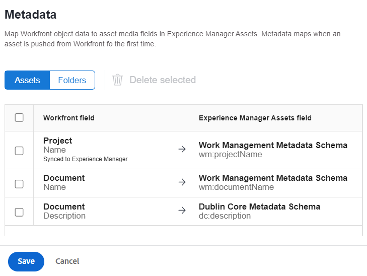
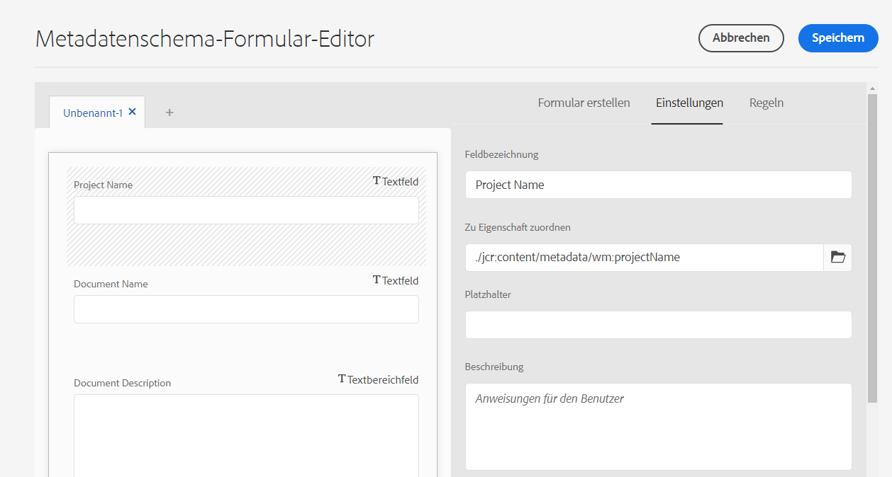

# Konfigurieren der Asset-Metadatenzuordnung zwischen Adobe Workfront und Experience Manager Assets {#asset-metadata-mapping-workfront-aem-assets}

Sie können die Asset-Metadatenfelder zwischen Adobe Workfront und Experience Manager as a Cloud Service-Programmen zuordnen. Durch die Zuordnung von Metadatenfeldern können Sie beim Senden eines Assets von Workfront an Experience Manager Assets die zugeordneten Asset-Metadaten in Experience Manager Assets anzeigen.

Wenn Sie beispielsweise die Metadatenfelder für ein Bild wie Namen, Beschreibung und das Projekt, zu dem es gehört, beim Senden des Bildes an Experience Manager Assets beibehalten müssen, konfigurieren und ordnen Sie diese Felder den Experience Manager Assets-Eigenschaften zu.

**Nutzungsszenario**

Ein Bild `add-users-workfront.png` ist im Projekt `Metadata Syncs` im Adobe Workfront-Programm vorhanden. Sie müssen dieses Bild mit den folgenden Metadaten an Experience Manager Assets as a Cloud Service senden:

* Projektname

* Dokumentname

* Dokumentbeschreibung

## Voraussetzungen {#prerequisites}

* Admin-Zugriff auf Workfront und Experience Manager Assets as a Cloud Service-Programme.

* Eine Integration zwischen [Workfront und Experience Manager Assets as a Cloud Service-Programmen](https://experienceleague.adobe.com/docs/workfront/using/administration-and-setup/configure-integrations/setup-asset-essentials.html?lang=de).

## Einrichten der Metadatenzuordnung in Workfront {#set-up-metadata-mapping}

So legen Sie die Metadatenzuordnung für die Felder „Projektname“, „Dokumentname“ und „Dokumentbeschreibung“ in Workfront fest:

1. Klicken Sie auf das Hauptmenüsymbol  in der oberen rechten Ecke des Adobe Workfront-Programms und dann auf **[!UICONTROL Setup]**.

1. Wählen Sie **[!UICONTROL Dokumente]** im linken Bereich und dann **[!UICONTROL Experience Manager Assets]** aus.

1. Wählen Sie die Experience Manager Assets-Integration aus und klicken Sie auf **[!UICONTROL Bearbeiten]**.

1. Klicken Sie auf **[!UICONTROL Metadaten]**. Ordnen Sie auf der Registerkarte **[!UICONTROL Assets]** das Workfront-Feld [!UICONTROL Projekt] > [!UICONTROL Name] dem `wm:projectName` Experience Manager Assets-Feld zu. Wenn Sie die exakte Übereinstimmung nicht finden, empfiehlt Adobe, nach der besten Übereinstimmung zu suchen, um das Feld zwischen Workfront und Experience Manager Assets zuzuordnen. Sie können die Zuordnung von Feldern unterschiedlicher Datentypen vermeiden. Sie können beispielsweise ein Datumsfeld in Workfront einem Beschreibungsfeld in Assets zuordnen.
1. Ordnen Sie das Workfront-Feld [!UICONTROL Dokument] > [!UICONTROL Name] dem `wm:documentName` Experience Manager Assets-Feld zu.

   

1. Ordnen Sie das Workfront-Feld [!UICONTROL Dokument] > [!UICONTROL Beschreibung] dem `dc:description` Experience Manager Assets-Feld zu.

   >[!VIDEO](https://video.tv.adobe.com/v/344255)

## Senden des Bildes von Workfront an Experience Manager Assets {#send-image-workfront-assets}

So senden Sie das Bild von Workfront an Experience Manager Assets:

1. Klicken Sie auf das Hauptmenüsymbol  in der oberen rechten Ecke des Adobe Workfront-Programms und dann auf **[!UICONTROL Projekte]**.

1. Klicken Sie auf **[!UICONTROL Neues Projekt]**, um ein Projekt zu erstellen.

1. Klicken Sie auf **[!UICONTROL Dokumente]** im linken Bereich, ziehen Sie das Bild, das Sie an Experience Manager Assets senden möchten, und wählen Sie es aus.

1. Klicken Sie auf **[!UICONTROL Senden an]** und wählen Sie dann den Experience Manager Assets Essentials-Integrationsnamen aus.

   

1. Wählen Sie den Zielordner für das Asset aus und klicken Sie auf **[!UICONTROL Ordner auswählen]**.

1. Klicken Sie auf **[!UICONTROL Speichern]**.

## Konfigurieren der Asset-Metadatenzuordnung in Experience Manager as a Cloud Service {#metadata-mapping-aem}

Wenn Sie [die Asset-Metadatenzuordnung in Adobe Workfront konfiguriert](#set-up-metadata-mapping) haben, müssen Sie dieselbe Zuordnung im Experience Manager Assets as a Cloud Service-Programm verwenden, um die entsprechenden Metadaten-Ergebnisse für das Bild anzuzeigen.

Die Metadaten-Zuordnung wird mithilfe von Metadatenschemata in Experience Manager Assets durchgeführt. Sie können ein neu hinzugefügtes oder vorhandenes Metadatenschema-Formular bearbeiten. Das Metadatenschema-Formular enthält Registerkarten und Formularelemente auf Registerkarten. Sie können diese Formularelemente einem Feld innerhalb eines Metdatenknotens im CRX-Repository zuordnen bzw. dafür konfigurieren. Sie können dem Metadatenschema-Formular Registerkarten oder Formularelemente hinzufügen. Weitere Informationen finden Sie unter [Metadatenschemata](metadata-schemas.md).

So konfigurieren Sie die Metadatenzuordnung mit einem neuen Metadatenformular in Experience Manager Assets as a Cloud Service:

1. Navigieren Sie zu **[!UICONTROL Tools]** > **[!UICONTROL Assets]** > **[!UICONTROL Metadatenschemata]**.

1. Klicken Sie in der Symbolleiste auf **[!UICONTROL Erstellen]**. Geben Sie im Dialogfeld den Titel des Schemaformulars ein und klicken Sie auf **[!UICONTROL Erstellen]**, um den Prozess zur Formularerstellung abzuschließen.

1. Wählen Sie das Schemaformular aus und klicken Sie auf **[!UICONTROL Bearbeiten]**.

1. (Optional) Klicken Sie im Metadatenschema-Formular-Editor auf `+`, um eine neue Registerkarte für die Workfront-Felder zu erstellen.

1. Klicken Sie auf **[!UICONTROL Formular erstellen]** und ziehen Sie die **[!UICONTROL Einzelzeilentext]**-Komponente in das Formular. Klicken Sie auf die Komponente im Formular. Gehen Sie auf der Registerkarte **[!UICONTROL Formular erstellen]** folgendermaßen vor:

   1. Geben Sie `Project Name` im Feld **[!UICONTROL Feldbezeichnung]** an.

   1. Geben Sie `./jcr:content/metadata/wm:projectName` im Feld **[!UICONTROL Zu Eigenschaft zuordnen]** an. Verwenden Sie als Richtlinie die folgende Vorlage, um die Feldzuordnungen in Experience Manager Assets zu definieren:
      `./jcr:content/metadata/<mapping defined for the field in workfront>`.

      Beim Konfigurieren von Zuordnungen in Workfront haben Sie das `wm:projectName` Experience Manager Assets-Feld dem Feld „Projekt“ > „Name Workfront“ zugeordnet.

      `wm` bezieht sich auf den Namespace-Namen und `projectName` verweist auf den Eigenschaftstitel. Verwenden Sie das `namespace:propertyTitle`-Format, um Metadatenfeld-Zuordnungen zu definieren.

      

1. Klicken Sie auf **[!UICONTROL Formular erstellen]** und ziehen Sie die **[!UICONTROL Einzelzeilentext]**-Komponente in das Formular. Klicken Sie auf die Komponente im Formular. Gehen Sie auf der Registerkarte **[!UICONTROL Formular erstellen]** folgendermaßen vor:

   1. Geben Sie `Document Name` im Feld **[!UICONTROL Feldbezeichnung]** an.

   1. Geben Sie `./jcr:content/metadata/wm:documentName` im Feld **[!UICONTROL Zu Eigenschaft zuordnen]** an.
Beim Konfigurieren von Zuordnungen in Workfront haben Sie das Feld `wm:documentName` Experience Manager Assets dem Feld Dokument > Workfront zugeordnet.

1. Klicken Sie auf die Registerkarte **[!UICONTROL Formular erstellen]** und ziehen Sie die Komponente **[!UICONTROL Mehrzeiliger Text]** in das Formular. Klicken Sie auf die Komponente im Formular. Gehen Sie auf der Registerkarte **[!UICONTROL Formular erstellen]** folgendermaßen vor:

   1. Geben Sie `Document Description` im Feld **[!UICONTROL Feldbezeichnung]** an.

   1. Geben Sie `./jcr:content/metadata/dc:description` im Feld **[!UICONTROL Zu Eigenschaft zuordnen]** ein.
Beim Konfigurieren von Zuordnungen in Workfront haben Sie das Feld `dc:description` Experience Manager Assets dem Feld „Dokument“ > „Beschreibung Workfront“ zugeordnet.

1. Klicken Sie auf **[!UICONTROL Speichern]**, um die Änderungen zu speichern.

   >[!VIDEO](https://video.tv.adobe.com/v/344314)

## Metadateneinstellungen auf Bildordner anwenden {#apply-metadata-settings-image-folder}

Wenden Sie diese Einstellungen nach dem Konfigurieren der Metadateneinstellungen im Experience Manager as a Cloud Service-Programm auf den Ordner [mit dem Bild an, das vom Workfront-Programm gesendet wird](#send-image-workfront-assets).

So wenden Sie Metadateneinstellungen auf den Bildordner an:

1. Navigieren Sie zu **[!UICONTROL Tools]** > **[!UICONTROL Assets]** > **[!UICONTROL Metadatenschemata]**.

1. Wählen Sie das Metadatenschema aus der verfügbaren Liste aus und klicken Sie auf **[!UICONTROL Auf Ordner anwenden]**.

1. Wählen Sie den Zielordner aus, an den [das Bild vom Adobe Workfront-Programm gesendet wird](#send-image-workfront-assets) und klicken Sie auf **[!UICONTROL Anwenden]**.

Sie können zum Bild in Experience Manager Assets navigieren und die mit dem Bild verknüpften Metadaten anzeigen. Wählen Sie das Bild aus und klicken Sie auf **[!UICONTROL Eigenschaften]**, um die Bildmetadaten anzuzeigen.

**Siehe auch**

* [Assets übersetzen](translate-assets.md)
* [Assets-HTTP-API](mac-api-assets.md)
* [Von AEM Assets unterstützte Dateiformate](file-format-support.md)
* [Suchen von Assets](search-assets.md)
* [Connected Assets](use-assets-across-connected-assets-instances.md)
* [Asset-Berichte](asset-reports.md)
* [Metadatenschemata](metadata-schemas.md)
* [Herunterladen von Assets](download-assets-from-aem.md)
* [Verwalten von Metadaten](manage-metadata.md)
* [Suchfacetten](search-facets.md)
* [Verwalten von Sammlungen](manage-collections.md)
* [Massenimport von Metadaten](metadata-import-export.md)
* [Veröffentlichen von Assets in AEM und Dynamic Media](/help/assets/publish-assets-to-aem-and-dm.md)
