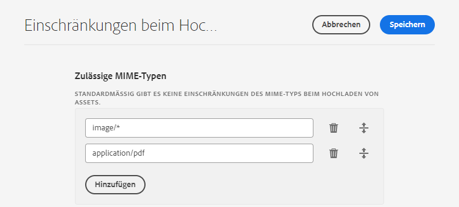
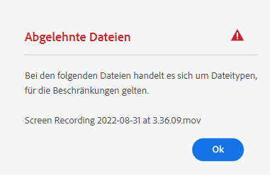
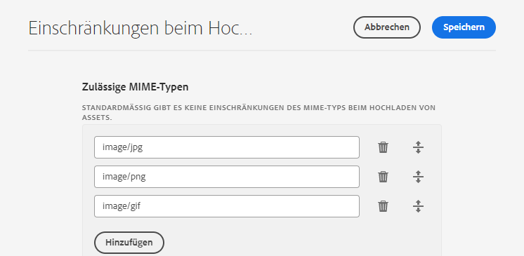

# Konfigurieren von Asset-Upload-Beschränkungen {#configure-asset-upload-restrictions}

<table>
    <tr>
        <td>
            <i>Neu</i> <a href="/help/assets/dynamic-media/dm-prime-ultimate.md"><b>Dynamic Media Prime und Ultimate</b></a>
        </td>
        <td>
            <i>Neu</i> <a href="/help/assets/assets-ultimate-overview.md"><b>AEM Assets Ultimate</b></a>
        </td>
        <td>
            <i>Neu</i> <a href="/help/assets/integrate-aem-assets-edge-delivery-services.md"><b>AEM Assets-Integration mit Edge Delivery Services</b></a>
        </td>
        <td>
            <i>Neu</i> <a href="/help/assets/aem-assets-view-ui-extensibility.md"><b>Erweiterbarkeit der Benutzeroberfläche</b></a>
        </td>
          <td>
            <i>Neu</i> <a href="/help/assets/dynamic-media/enable-dynamic-media-prime-and-ultimate.md"><b>Aktivieren von Dynamic Media Prime und Ultimate</b></a>
        </td>
    </tr>
    <tr>
        <td>
            <a href="/help/assets/search-best-practices.md"><b>Best Practices für die Suche</b></a>
        </td>
        <td>
            <a href="/help/assets/metadata-best-practices.md"><b>Best Practices für Metadaten</b></a>
        </td>
        <td>
            <a href="/help/assets/product-overview.md"><b>Content Hub</b></a>
        </td>
        <td>
            <a href="/help/assets/dynamic-media-open-apis-overview.md"><b>Dynamic Media mit OpenAPI-Funktionen</b></a>
        </td>
        <td>
            <a href="https://developer.adobe.com/experience-cloud/experience-manager-apis/"><b>Entwicklerdokumentation zu AEM Assets</b></a>
        </td>
    </tr>
</table>

Sie können Adobe Experience Manager Assets so konfigurieren, dass der Typ der Assets, die Benutzende hochladen können, anhand des MIME-Typs eingeschränkt wird.

>[!IMPORTANT]
>
>Standardmäßig erlaubt Experience Manager Assets Benutzenden das Hochladen von Assets aller MIME-Typen. Sie können die Einstellungen jedoch so konfigurieren, dass Benutzende auf das Hochladen von Dateien bestimmter MIME-Typen beschränkt werden.

## Voraussetzungen {#prerequisites-asset-upload-restrictions}

Sie müssen über Administratorberechtigungen verfügen, um Asset-Upload-Beschränkungen zu konfigurieren.

## Anwenden von Einschränkungen für Asset-Uploads {#apply-restrictions-asset-uploadsssssss}

So konfigurieren Sie [!DNL Experience Manager], sodass Benutzende auf das Hochladen von Dateien bestimmter MIME-Typen beschränkt sind:

1. Gehen Sie zu **[!UICONTROL Tools > Assets > Asset-Konfigurationen]**.

1. Klicken Sie auf **[!UICONTROL Upload-Einschränkungen]**.

1. Klicken Sie auf **[!UICONTROL Hinzufügen]**, um die zulässigen MIME-Typen zu definieren.

1. Geben Sie den MIME-Typ im Textfeld an. Sie können erneut auf **[!UICONTROL Hinzufügen]** klicken, um weitere zulässige MIME-Typen anzugeben. Durch Klicken auf das Symbol  können Sie auch einen beliebigen MIME-Typ aus der Liste löschen.

1. Klicken Sie auf **[!UICONTROL Speichern]**.

**Beispiel 1: Hochladen aller Bilder und PDF-Dateien in Experience Manager Assets zulassen**

Gehen Sie wie folgt vor, um das Hochladen von Bildern in allen Formaten und PDF-Dateien in Experience Manager Assets zuzulassen:

`image/*` als MIME-Typ lässt das Hochladen von Bildern in allen Formaten zu. `application/pdf` als MIME-Typ lässt das Hochladen von PDF-Dateien in Experience Manager Assets zu.

Wenn Sie versuchen, eine Datei hochzuladen, die nicht in der Liste der zulässigen MIME-Typen enthalten ist, zeigt Experience Manager Assets die folgende Fehlermeldung an:

`Screen Recording 2022-08-31 at 3.36.09 PM.mov` bezieht sich auf einen Dateinamen, der nicht in den zulässigen MIME-Typen enthalten ist.

**Beispiel 2: Hochladen bestimmter Bildformate in Experience Manager Assets zulassen**

Gehen Sie wie folgt vor, um den zulässigen MIME-Typen bestimmte Bildformate hinzuzufügen und das Hochladen aller anderen Asset-Formate zu beschränken:

Basierend auf den im Bild dargestellten Einstellungen können Sie Bilder in den Formaten .JPG, .PNG und .GIF in Experience Manager Assets hochladen.

**Siehe auch**

* [Assets übersetzen](translate-assets.md)
* [Assets-HTTP-API](mac-api-assets.md)
* [Von AEM Assets unterstützte Dateiformate](file-format-support.md)
* [Suchen von Assets](search-assets.md)
* [Connected Assets](use-assets-across-connected-assets-instances.md)
* [Asset-Berichte](asset-reports.md)
* [Metadatenschemata](metadata-schemas.md)
* [Herunterladen von Assets](download-assets-from-aem.md)
* [Verwalten von Metadaten](manage-metadata.md)
* [Suchfacetten](search-facets.md)
* [Verwalten von Sammlungen](manage-collections.md)
* [Massenimport von Metadaten](metadata-import-export.md)
* [Veröffentlichen von Assets in AEM und Dynamic Media](/help/assets/publish-assets-to-aem-and-dm.md)
