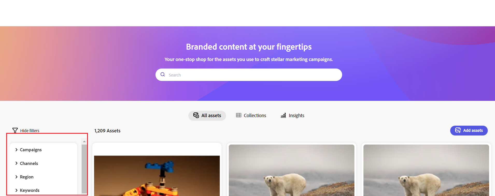

# Konfigurieren der Benutzeroberfläche von Content Hub {#configure-content-hub-user-interface}

| [Best Practices für die Suche](/help/assets/search-best-practices.md) | [Best Practices für Metadaten](/help/assets/metadata-best-practices.md) | [Content Hub](/help/assets/product-overview.md) | [Dynamic Media mit OpenAPI-Funktionen](/help/assets/dynamic-media-open-apis-overview.md) | [Entwicklerdokumentation zu AEM Assets](https://developer.adobe.com/experience-cloud/experience-manager-apis/) |
| ------------- | --------------------------- |---------|----|-----|

>[!CONTEXTUALHELP]
>id="configure_content_hub"
>title="Konfigurieren der Benutzeroberfläche von Content Hub"
>abstract="Mit Experience Manager Assets können Admins die in der Benutzeroberfläche von Content Hub verfügbaren Optionen konfigurieren. Abhängig von den Konfigurationsoptionen, die von den Admins ausgewählt wurden, können Benutzende von Content Hub Felder in Content Hub anzeigen. Zu den Konfigurationsoptionen gehören Metadaten beim Importieren von Assets, Filter, Asset-Eigenschaften, Metadaten bei der Suche nach Assets, personalisiertes Branding und benutzerspezifische Links."
>additional-url="https://images-tv.adobe.com/mpcv3/4477/74a81d1c-0cfe-41f4-8a06-18ff70604e45_1732023385.854x480at800_h264.mp4" text="Video ansehen"

<!--  -->

>[!AVAILABILITY]
>
>Das Content Hub-Handbuch ist jetzt im PDF-Format verfügbar. Laden Sie das gesamte Handbuch herunter und verwenden Sie den KI-Assistenten von Adobe Acrobat, um Ihre Fragen zu beantworten.
>
>[!BADGE Content Hub-Handbuch als PDF]{type=Informative url="https://helpx.adobe.com/content/dam/help/en/experience-manager/aem-assets/content-hub.pdf"}

Mit Experience Manager Assets können Admins die in der Benutzeroberfläche von Content Hub verfügbaren Optionen konfigurieren. Abhängig von den Konfigurationsoptionen, die von den Admins ausgewählt wurden, können Benutzende von Content Hub Felder in Content Hub anzeigen. Zu den Konfigurationsoptionen gehören:

* Filter, die Benutzenden bei der Suche nach Assets zur Verfügung stehen.

* Asset-Details oder Eigenschaften, die für jedes Asset verfügbar sind.

* Metadatenfelder, die Benutzenden beim Hinzufügen von Assets zu Content Hub zur Verfügung stehen.

* Asset-Metadatenfelder, die für die Suche in Content Hub verfügbar sind.

* Branding-Inhalte, die Sie für Ihre Organisation anzeigen müssen.

* alle benutzerspezifischen Links, die Sie zusätzlich zu Assets, Sammlungen und Erkenntnissen in Content Hub einschließen müssen.

## Voraussetzungen {#prerequisites-configuration-ui}

[Content Hub-Admins](/help/assets/deploy-content-hub.md#step-3-onboard-content-hub-administrator) können die Konfigurationsoptionen für andere Benutzende in Ihrer Organisation festlegen.

## Zugreifen auf Konfigurationsoptionen in Content Hub {#access-configuration-options-content-hub}

So greifen Sie auf Konfigurationsoptionen in Content Hub zu:

1. Klicken Sie auf das Benutzersymbol im rechten Bereich.

1. Wählen Sie im Abschnitt **[!UICONTROL Produkteinstellungen]** die Option **[!UICONTROL Konfigurationen]** aus.

   

## Verwalten von Konfigurationsoptionen in Content Hub {#manage-configuration-options}

Verwalten Sie als Admin die folgenden Konfigurationsoptionen für Ihre Benutzenden:

* [Importieren](#configure-import-options-content-hub)

* [Filter](#configure-filters-content-hub)

* [Asset-Details](#configure-asset-details-content-hub)
* [Asset-Karte](#asset-card)

* [Suchen](#configure-metadata-search-content-hub)

* [Branding](#configure-branding-content-hub)

* [Abgelaufene Assets](#expired-assets-content-hub)

* [Benutzerspezifische Links](#configure-custom-links-content-hub)

### Importieren {#configure-import-options-content-hub}

Sie können die Metadatenfelder konfigurieren, die den Benutzenden beim Hochladen oder Importieren von Assets in das Content Hub-Portal angezeigt werden, z. B. Kampagnenname, Keywords, Kanäle, Zeitraum, Region usw. Führen Sie dazu die folgenden Schritte aus:

1. Klicken Sie in der Benutzeroberfläche [Konfigurationen](#access-configuration-options-content-hub) auf **[!UICONTROL Importieren]**.

1. Klicken Sie auf **[!UICONTROL Metadaten hinzufügen]**.

1. Geben Sie ein Label für die Eigenschaft an, ordnen Sie sie mithilfe des Felds **[!UICONTROL Metadaten]** einer Eigenschaft zu und wählen Sie den Eingabetyp für die neuen Asset-Metadaten aus.

1. Klicken Sie auf den Umschalter **[!UICONTROL Pflichtfeld]**, um das neue Metadatenfeld für Benutzende beim Hochladen neuer Assets als obligatorisch festzulegen.

1. Klicken Sie auf **[!UICONTROL Bestätigen]**. Die neuen Metadaten werden in der Liste der vorhandenen Asset-Eigenschaften angezeigt.

1. Klicken Sie auf **[!UICONTROL Speichern]**, um die Änderungen zu speichern.

Sie können auch auf  neben jeder verfügbaren Eigenschaft klicken, um die Labels zu bearbeiten oder diese Felder mit dem Umschalter **[!UICONTROL Pflichtfeld]** für Benutzende beim Hochladen von Assets als obligatorisch bzw. als nicht obligatorisch festzulegen. Oder klicken Sie auf das Symbol „Löschen“, um eine Metadateneigenschaft zu löschen.

Klicken Sie auf den Umschalter **[!UICONTROL Automatische Genehmigung]**, wenn alle Assets, die Sie zum Experience Manager Assets-Repository hinzufügen, automatisch genehmigt werden müssen, damit sie in Content Hub sofort verfügbar sind. Andernfalls müssen DAM-Autorinnen bzw. -Autoren oder DAM-Admins die Assets manuell genehmigen, damit sie in Content Hub verfügbar sind. Der Umschalter ist standardmäßig auf den Status „Aus“ eingestellt.

Klicken Sie auf **[!UICONTROL Speichern]**, um alle vorgenommenen Änderungen zu übernehmen.

In der Konfigurationsoberfläche aktivierte Metadaten werden auf der Asset-Upload-Seite angezeigt:

### Filter {#configure-filters-content-hub}

Mit Content Hub können Admins Filter konfigurieren, die bei der Suche nach Assets angezeigt werden. Führen Sie die folgenden Schritte aus, um einen neuen Filter hinzuzufügen:

1. Klicken Sie in der Benutzeroberfläche [Konfigurationen](#access-configuration-options-content-hub) auf **[!UICONTROL Filter]**.

1. Klicken Sie auf **[!UICONTROL Filter hinzufügen]**.

1. Geben Sie ein Label für den Filter an, ordnen Sie ihn mithilfe des Felds **[!UICONTROL Metadaten]** einer Eigenschaft zu und wählen Sie den Eingabetyp für den neuen Filter aus.
1. Klicken Sie auf **[!UICONTROL Bestätigen]**. Der neue Filter wird in der Liste der vorhandenen Filter angezeigt.

1. Klicken Sie auf **[!UICONTROL Speichern]**, um die Änderungen anzuwenden, sodass der neue Filter beim Filtern von Assets auf der Suchseite angezeigt wird.

   >[!NOTE]
   >
   Der neue Filter wird nur dann auf der Suchseite angezeigt, wenn im Repository mindestens ein Asset vorhanden ist, das den Filterkriterien entspricht.

Sie können auch auf  neben jedem verfügbaren Filter klicken, um die Labels zu bearbeiten, oder klicken Sie auf das Symbol „Löschen“, um einen vorhandenen Filter zu löschen. Klicken Sie auf **[!UICONTROL Speichern]**, um alle vorgenommenen Änderungen zu übernehmen.

Die auf der Konfigurationsoberfläche aktivierten Filter werden auf der Suchseite angezeigt:

### Asset-Details {#configure-asset-details-content-hub}

Sie können auch die Asset-Eigenschaften konfigurieren, die für jedes Asset angezeigt werden, z. B. Dateiname, Titel, Format, Größe usw. Führen Sie dazu die folgenden Schritte aus:

1. Klicken Sie in der Benutzeroberfläche [Konfigurationen](#access-configuration-options-content-hub) auf **[!UICONTROL Asset-Details]**.

1. Klicken Sie auf **[!UICONTROL Metadaten hinzufügen]**.

1. Geben Sie ein Label für die Eigenschaft an, ordnen Sie sie mithilfe des Felds **[!UICONTROL Metadaten]** einer Eigenschaft zu und wählen Sie den Eingabetyp für die neuen Asset-Metadaten aus.
1. Klicken Sie auf **[!UICONTROL Bestätigen]**. Die neuen Metadaten werden in der Liste der vorhandenen Asset-Eigenschaften angezeigt.

1. Klicken Sie auf **[!UICONTROL Speichern]**, um die Änderungen anzuwenden, sodass die neue Eigenschaft auf der Seite „Asset-Details“ angezeigt wird.

Sie können auch auf  neben jeder verfügbaren Eigenschaft klicken, um die Labels zu bearbeiten, oder klicken Sie auf das Symbol „Löschen“, um vorhandene Asset-Details zu löschen. Klicken Sie auf **[!UICONTROL Speichern]**, um alle vorgenommenen Änderungen zu übernehmen.

Die auf der Konfigurationsoberfläche aktivierten Eigenschaften werden auf der Seite „Asset-Details“ angezeigt:

### Asset-Karte {#asset-card}

Sie können auch die wichtigsten Metadatenfelder (maximal 6) konfigurieren, die auf der **Asset-Karte** angezeigt werden sollen. Führen Sie dazu die folgenden Schritte aus:

1. Klicken Sie in der Benutzeroberfläche [Konfigurationen](#access-configuration-options-content-hub) auf **Asset-Karte**.
2. Klicken Sie auf **Metadaten hinzufügen**. Das Dialogfeld **Asset-Karten-Metadaten hinzufügen** wird angezeigt.
3. Geben Sie den Metadatennamen im Feld **Label** an und wählen Sie eine Metadateneigenschaft im Feld **Metadaten** aus.
4. Klicken Sie auf **Bestätigen** und dann auf **Speichern**, um die Änderungen anzuwenden, sodass die neue Eigenschaft auf der Seite „Asset-Details“ angezeigt wird.
   

Sie können auch auf  neben jeder verfügbaren Eigenschaft klicken, um erforderliche Änderungen vorzunehmen, oder klicken Sie auf , um eine vorhandene Metadateneigenschaft zu löschen. Klicken Sie auf **Speichern**, um alle vorgenommenen Änderungen zu übernehmen.

### Suchen {#configure-metadata-search-content-hub}

Admins können die Metadatenfelder definieren, die durchsucht werden, wenn jemand ein Suchkriterium in Content Hub angibt. Führen Sie die folgenden Schritte aus:

1. Klicken Sie in der Benutzeroberfläche [Konfigurationen](#access-configuration-options-content-hub) auf **[!UICONTROL Metadaten hinzufügen]**.

1. Geben Sie das Metadatenfeld an und klicken Sie auf **[!UICONTROL Bestätigen]**.

1. Klicken Sie auf **[!UICONTROL Speichern]**, um die Änderungen anzuwenden, sodass die neue Metadateneigenschaft in der Liste der Metadatenfelder angezeigt wird.

Sie können auch auf ähnliche Weise auf  neben jeder verfügbaren Metadateneigenschaft klicken, um die Eigenschaft zu bearbeiten, oder klicken Sie auf das Symbol „Löschen“, um eine vorhandene Eigenschaft zu löschen. Klicken Sie auf **[!UICONTROL Speichern]**, um alle vorgenommenen Änderungen zu übernehmen.

### Branding {#configure-branding-content-hub}

Admins können auch den Titel und den Textkörper im Banner des Content Hub-Portals entsprechend Ihren Branding-Anforderungen personalisieren. Führen Sie dazu die folgenden Schritte aus:

1. Klicken Sie in der Benutzeroberfläche [Konfigurationen](#access-configuration-options-content-hub) auf **[!UICONTROL Branding]**.

1. Geben Sie Text in den Feldern **[!UICONTROL Titeltext auf Banner]** und **[!UICONTROL Textkörper auf Banner]** an.

1. Klicken Sie auf **[!UICONTROL Speichern]**, um die Änderungen zu speichern.

Die in der Benutzeroberfläche „Konfiguration“ aktivierten Branding-Aktualisierungen werden im Banner des Content Hub-Portals angezeigt:

### Abgelaufene Assets{#expired-assets-content-hub}

Admins können steuern, ob abgelaufene Assets in Content Hub sichtbar sein sollen. Wenn die abgelaufenen Assets sichtbar gemacht werden, können sie auch festlegen, ob Benutzende diese herunterladen können.

Abgelaufene Assets werden standardmäßig nicht in Content Hub angezeigt.

Führen Sie dazu die folgenden Schritte aus:

1. Klicken Sie in der Benutzeroberfläche [Konfigurationen](#access-configuration-options-content-hub) auf **[!UICONTROL Abgelaufene Assets]**.

1. Aktivieren Sie im Abschnitt **[!UICONTROL Sichtbar]** den Umschalter **[!UICONTROL Benutzenden erlauben, abgelaufene Assets anzuzeigen]**, um alle abgelaufenen Assets in Content Hub sichtbar zu machen.

1. Nachdem Sie die Sichtbarkeit von Assets aktiviert haben, können Sie die Möglichkeit zum Herunterladen abgelaufener Assets mit dem Umschalter **[!UICONTROL Benutzenden erlauben, abgelaufene Assets herunterzuladen]** aktivieren oder deaktivieren.

1. Klicken Sie auf **[!UICONTROL Speichern]**, um die Änderungen zu speichern.

   

Nachdem Sie die Sichtbarkeit von Assets aktiviert haben, können Sie die abgelaufenen Assets in Content Hub anzeigen, wie in der folgenden Abbildung dargestellt:

Wenn die Admins den Download aktiviert haben, können Content Hub-Benutzende sie ebenfalls herunterladen, wie im Bild hervorgehoben.

Wenn die Sichtbarkeit abgelaufener Assets aktiviert ist, werden in Content Hub auch Assets, die innerhalb der nächsten 15 Tage ablaufen, mit der Meldung `Expiring in n days` auf der Asset-Karte hervorgehoben.

### Benutzerspezifische Links {#configure-custom-links-content-hub}

Zusätzlich zu den Standardregisterkarten **[!UICONTROL Alle Assets]**, **[!UICONTROL Sammlungen]** und **[!UICONTROL Erkenntnisse]** im Content Hub-Portal direkt unterhalb des Banners können Sie auch benutzerdefinierte Registerkarten hinzufügen. Führen Sie dazu die folgenden Schritte aus:

1. Klicken Sie in der Benutzeroberfläche [Konfigurationen](#access-configuration-options-content-hub) auf **[!UICONTROL Benutzerspezifische Links]**.

1. Klicken Sie auf **[!UICONTROL Link hinzufügen]**.

1. Geben Sie Text in den Feldern **[!UICONTROL Label]** und **[!UICONTROL URL]** an. Das von Ihnen definierte Label wird als Registerkarte angezeigt. Wenn Sie auf das Label klicken, navigieren Sie zu der im Feld **[!UICONTROL URL]** definierten URL.

1. Klicken Sie auf **[!UICONTROL Bestätigen]**.

1. Klicken Sie auf **[!UICONTROL Speichern]**, um die Änderungen zu speichern.

Sie können auch auf ähnliche Weise auf  neben jeder verfügbaren Metadateneigenschaft klicken, um die Links zu bearbeiten, oder klicken Sie auf das Symbol „Löschen“, um eine vorhandene URL zu löschen. Klicken Sie auf **[!UICONTROL Speichern]**, um alle vorgenommenen Änderungen zu übernehmen.

Der benutzerspezifische Link wird auf der Content Hub-Startseite neben der Registerkarte „Erkenntnisse“ als neue Registerkarte angezeigt.

