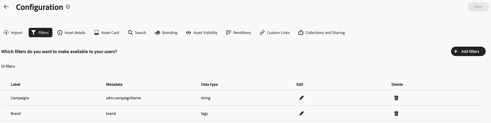

# Konfigurieren der Benutzeroberfläche von Content Hub {#configure-content-hub-user-interface}

>[!CONTEXTUALHELP]
>id="configure_content_hub"
>title="Konfigurieren der Benutzeroberfläche von Content Hub"
>abstract="Mit Experience Manager Assets können Admins die in der Benutzeroberfläche von Content Hub verfügbaren Optionen konfigurieren. Abhängig von den Konfigurationsoptionen, die von den Admins ausgewählt wurden, können Benutzende von Content Hub Felder in Content Hub anzeigen. Zu den Konfigurationsoptionen gehören Metadaten beim Importieren von Assets, Filter, Asset-Eigenschaften, Metadaten bei der Suche nach Assets, personalisiertes Branding und benutzerspezifische Links."
>additional-url="https://images-tv.adobe.com/mpcv3/4477/74a81d1c-0cfe-41f4-8a06-18ff70604e45_1732023385.854x480at800_h264.mp4" text="Video ansehen"

<!--  -->

Mit Experience Manager Assets können Admins die in der Benutzeroberfläche von Content Hub verfügbaren Optionen konfigurieren. Abhängig von den Konfigurationsoptionen, die von den Admins ausgewählt wurden, können Benutzende von Content Hub Felder in Content Hub anzeigen. Zu den Konfigurationsoptionen gehören:

* Filter, die Benutzenden bei der Suche nach Assets zur Verfügung stehen.

* Asset-Details oder Eigenschaften, die für jedes Asset verfügbar sind.

* Metadatenfelder, die Benutzenden beim Hinzufügen von Assets zu Content Hub zur Verfügung stehen.

* Asset-Metadatenfelder, die für die Suche in Content Hub verfügbar sind.

* Branding-Inhalte, die Sie für Ihre Organisation anzeigen müssen.

* alle benutzerspezifischen Links, die Sie zusätzlich zu Assets, Sammlungen und Erkenntnissen in Content Hub einschließen müssen.

## Voraussetzungen {#prerequisites-configuration-ui}

[Content Hub-Admins](/help/assets/deploy-content-hub.md#step-3-onboard-content-hub-administrator) können die Konfigurationsoptionen für andere Benutzende in Ihrer Organisation festlegen.

## Zugreifen auf Konfigurationsoptionen in Content Hub {#access-configuration-options-content-hub}

So greifen Sie auf Konfigurationsoptionen in Content Hub zu:

1. Klicken Sie auf das Benutzersymbol im rechten Bereich.

1. Wählen Sie im Abschnitt **[!UICONTROL Produkteinstellungen]** die Option **[!UICONTROL Konfigurationen]** aus.

   

## Verwalten von Konfigurationsoptionen in Content Hub {#manage-configuration-options}

Verwalten Sie als Admin die folgenden Konfigurationsoptionen für Ihre Benutzenden:

* [Importieren](#configure-import-options-content-hub)

* [Filter](#configure-filters-content-hub)

* [Asset-Details](#configure-asset-details-content-hub)
* [Asset-Karte](#asset-card)

* [Suchen](#configure-metadata-search-content-hub)

* [Branding](#configure-branding-content-hub)

* [Abgelaufene Assets](#expired-assets-content-hub)

* [Ausgabedarstellungen](#renditions-content-hub)

* [Benutzerdefinierte Links](#configure-custom-links-content-hub)

* [Sammlungen und Freigabe](#configure-collections-content-hub)

<!--* [Enable public link sharing](#enable-public-link-sharing)-->

### Importieren {#configure-import-options-content-hub}

Sie können die Metadatenfelder konfigurieren, die den Benutzenden beim Hochladen oder Importieren von Assets in das Content Hub-Portal angezeigt werden, z. B. Kampagnenname, Keywords, Kanäle, Zeitraum, Region usw. Führen Sie dazu die folgenden Schritte aus:

1. Klicken Sie in der Benutzeroberfläche [Konfigurationen](#access-configuration-options-content-hub) auf **[!UICONTROL Importieren]**.

1. Klicken Sie auf **[!UICONTROL Metadaten hinzufügen]**.

1. Geben Sie ein Label für die Eigenschaft an, ordnen Sie sie mithilfe des Felds **[!UICONTROL Metadaten]** einer Eigenschaft zu und wählen Sie den Eingabetyp für die neuen Asset-Metadaten aus.

1. Klicken Sie auf den Umschalter **[!UICONTROL Pflichtfeld]**, um das neue Metadatenfeld für Benutzende beim Hochladen neuer Assets als obligatorisch festzulegen.

1. Klicken Sie auf **[!UICONTROL Bestätigen]**. Die neuen Metadaten werden in der Liste der vorhandenen Asset-Eigenschaften angezeigt.

1. Klicken Sie auf **[!UICONTROL Speichern]**, um die Änderungen zu speichern.

Sie können auch auf  neben jeder verfügbaren Eigenschaft klicken, um die Labels zu bearbeiten oder diese Felder mit dem Umschalter **[!UICONTROL Pflichtfeld]** für Benutzende beim Hochladen von Assets als obligatorisch bzw. als nicht obligatorisch festzulegen. Oder klicken Sie auf das Symbol „Löschen“, um eine Metadateneigenschaft zu löschen.

Klicken Sie auf den Umschalter **[!UICONTROL Automatische Genehmigung]**, wenn alle Assets, die Sie zum Experience Manager Assets-Repository hinzufügen, automatisch genehmigt werden müssen, damit sie in Content Hub sofort verfügbar sind. Andernfalls müssen DAM-Autorinnen bzw. -Autoren oder DAM-Admins die Assets manuell genehmigen, damit sie in Content Hub verfügbar sind. Der Umschalter ist standardmäßig auf den Status „Aus“ eingestellt.

Klicken Sie auf **[!UICONTROL Speichern]**, um alle vorgenommenen Änderungen zu übernehmen.

Auf der Konfigurationsoberfläche aktivierte Metadaten werden auf der Seite zum Hochladen von Assets angezeigt:

### Filter {#configure-filters-content-hub}

Mit Content Hub können Admins Filter konfigurieren, die bei der Suche nach Assets angezeigt werden. Führen Sie die folgenden Schritte aus, um einen neuen Filter hinzuzufügen:

1. Klicken Sie in der Benutzeroberfläche [Konfigurationen](#access-configuration-options-content-hub) auf **[!UICONTROL Filter]**.

1. Klicken Sie auf **[!UICONTROL Filter hinzufügen]**.

1. Geben Sie ein Label für den Filter an, ordnen Sie ihn mithilfe des Felds **[!UICONTROL Metadaten]** einer Eigenschaft zu und wählen Sie den Eingabetyp für den neuen Filter aus.
1. Klicken Sie auf **[!UICONTROL Bestätigen]**. Der neue Filter wird in der Liste der vorhandenen Filter angezeigt.

1. Klicken Sie auf **[!UICONTROL Speichern]**, um die Änderungen anzuwenden, sodass der neue Filter beim Filtern von Assets auf der Suchseite angezeigt wird.

   >[!NOTE]
   >
   >Der neue Filter wird nur dann auf der Suchseite angezeigt, wenn im Repository mindestens ein Asset vorhanden ist, das den Filterkriterien entspricht.

Sie können auch auf  neben jedem verfügbaren Filter klicken, um die Labels zu bearbeiten, oder klicken Sie auf das Symbol „Löschen“, um einen vorhandenen Filter zu löschen. Klicken Sie auf **[!UICONTROL Speichern]**, um alle vorgenommenen Änderungen zu übernehmen.

Die auf der Konfigurationsoberfläche aktivierten Filter werden auf der Suchseite angezeigt:

### Asset-Details {#configure-asset-details-content-hub}

Sie können auch die Asset-Eigenschaften konfigurieren, die für jedes Asset angezeigt werden, z. B. Dateiname, Titel, Format, Größe usw. Führen Sie dazu die folgenden Schritte aus:

1. Klicken Sie in der Benutzeroberfläche [Konfigurationen](#access-configuration-options-content-hub) auf **[!UICONTROL Asset-Details]**.

1. Klicken Sie auf **[!UICONTROL Metadaten hinzufügen]**.

1. Geben Sie ein Label für die Eigenschaft an, ordnen Sie sie mithilfe des Felds **[!UICONTROL Metadaten]** einer Eigenschaft zu und wählen Sie den Eingabetyp für die neuen Asset-Metadaten aus.
1. Klicken Sie auf **[!UICONTROL Bestätigen]**. Die neuen Metadaten werden in der Liste der vorhandenen Asset-Eigenschaften angezeigt.

1. Klicken Sie auf **[!UICONTROL Speichern]**, um die Änderungen anzuwenden, sodass die neue Eigenschaft auf der Seite „Asset-Details“ angezeigt wird.

Sie können auch auf  neben jeder verfügbaren Eigenschaft klicken, um die Labels zu bearbeiten, oder klicken Sie auf das Symbol „Löschen“, um vorhandene Asset-Details zu löschen. Klicken Sie auf **[!UICONTROL Speichern]**, um alle vorgenommenen Änderungen zu übernehmen.

Die auf der Konfigurationsoberfläche aktivierten Eigenschaften werden auf der Seite „Asset-Details“ angezeigt:

### Asset-Karte {#asset-card}

Sie können auch die wichtigsten Metadateneigenschaften (maximal 6 Felder) konfigurieren, die auf der **Asset-Karte** angezeigt werden sollen.

Führen Sie die folgenden Schritte aus, um die Metadateneigenschaften so zu konfigurieren, dass sie auf der **[!UICONTROL Asset-Karte]** angezeigt werden:

1. Klicken Sie in der Benutzeroberfläche [Konfigurationen](#access-configuration-options-content-hub) auf **Asset-Karte**.
2. Klicken Sie auf **Metadaten hinzufügen**. Das Dialogfeld **Asset-Karten-Metadaten hinzufügen** wird angezeigt.
3. Geben Sie den Metadatennamen im Feld **Label** an und wählen Sie eine Metadateneigenschaft im Feld **Metadaten** aus.
4. Klicken Sie auf **Bestätigen** und dann auf **Speichern**, um die Änderungen anzuwenden, sodass die neue Eigenschaft auf der Seite „Asset-Details“ angezeigt wird.
   
Sie können auch neben jeder verfügbaren Eigenschaft auf  klicken, um erforderliche Änderungen vorzunehmen, oder auf , um eine vorhandene Metadateneigenschaft zu löschen. Klicken Sie auf **Speichern**, um alle vorgenommenen Änderungen zu übernehmen.

### Suchen {#configure-metadata-search-content-hub}

Admins können die Metadatenfelder definieren, die durchsucht werden, wenn jemand ein Suchkriterium in Content Hub angibt. Führen Sie die folgenden Schritte aus:

1. Klicken Sie in der Benutzeroberfläche [Konfigurationen](#access-configuration-options-content-hub) auf **[!UICONTROL Metadaten hinzufügen]**.

1. Geben Sie das Metadatenfeld an und klicken Sie auf **[!UICONTROL Bestätigen]**.

1. Klicken Sie auf **[!UICONTROL Speichern]**, um die Änderungen anzuwenden, sodass die neue Metadateneigenschaft in der Liste der Metadatenfelder angezeigt wird.

Sie können auch auf ähnliche Weise auf  neben jeder verfügbaren Metadateneigenschaft klicken, um die Eigenschaft zu bearbeiten, oder klicken Sie auf das Symbol „Löschen“, um eine vorhandene Eigenschaft zu löschen. Klicken Sie auf **[!UICONTROL Speichern]**, um alle vorgenommenen Änderungen zu übernehmen.

### Branding {#configure-branding-content-hub}

Passen Sie als Admin Ihr [!DNL Content Hub]-Portal an Ihre Branding-Anforderungen an.

Verwenden Sie auf der Seite  **[!UICONTROL Branding]** die Abschnitte **[!UICONTROL Banner]**, **[!UICONTROL Farben]** und **[!UICONTROL Bannerbild]**, um die folgenden Anpassungen vorzunehmen:

1. [Ändern Sie das Bannerbild im Abschnitt [!UICONTROL Bannerbild].](#Change-the-banner-image)
1. [Aktualisieren Sie den Titel und Textkörper des Banners und ändern Sie die Textfarbe im Abschnitt [!UICONTROL Banner].](#Add-title-and-body-text-to-your-banner-and-change-the-text-color)
1. [Ändern Sie die primäre und sekundäre Farbe aus dem Abschnitt [!UICONTROL Farben], um ein Farbschema anzuwenden, das dem Design Ihrer Marke entspricht](#Change-the-primary-and-secondary-color)

Wählen Sie die Option **[!UICONTROL Standardeinstellungen zurücksetzen]**, um Ihre Änderungen rückgängig zu machen und das Standard-Design wiederherzustellen.

#### Ändern des Bannerbilds{#Change-the-banner-image}

Führen Sie auf der Seite  **[!UICONTROL Branding]** die folgenden Schritte aus, um das Bannerbild Ihrer [!DNL Content Hub]-Bereitstellung zu ändern:

1. Klicken Sie auf  **[!UICONTROL Aus Galerie auswählen]**, um im Dialogfeld für die Asset-Auswahl ein Bannerbild auszuwählen. Der Asset-Wähler zeigt nur genehmigte Bilder an.
1. Wählen Sie das Bild aus, klicken Sie auf **[!UICONTROL Auswählen]** und anschließend auf **[!UICONTROL Speichern]**, um es als Bannerbild Ihrer [!DNL Content Hub]-Bereitstellung anzuzeigen.
   

#### Fügen Sie dem Banner Titel und Textinhalte hinzu und ändern Sie die Textfarbe{#Add-title-and-body-text-to-your-banner-and-change-the-text-color}

Verwenden Sie auf der Seite  **[!UICONTROL Branding]** die entsprechenden Felder im Abschnitt **[!UICONTROL Banner]**, um dem Banner Titel- und Textinhalte hinzuzufügen.
Klicken Sie auf das quadratische Feld neben **[!UICONTROL Bannertextfarbe]**, um mit dem Farbwähler eine Textfarbe für Ihren Bannertext auszuwählen, oder geben Sie den Hexadezimal-Code der Farbe in das Feld neben dem quadratischen Farbwählerfeld ein.

#### Ändern der primären und sekundären Farbe{#Change-the-primary-and-secondary-color}

Verwenden Sie auf der Seite  **[!UICONTROL Branding]** den Abschnitt **[!UICONTROL Farben]**, um primäre und sekundäre Farben festzulegen, indem Sie diese entweder mit dem Farbwähler auswählen oder den Hexadezimal-Code der Farbe definieren. Diese Farben legen die Hintergrund-, Text- und Symbolfarben von Benutzeroberflächenelementen fest, um Ihre [!DNL Content Hub]-Benutzeroberfläche an das Design Ihrer Marke anzupassen.

**[!UICONTROL Primäre Farbe]:** Das Primärfarbschema gilt für Auswahlaktionen, interaktive Elemente wie Kontrollkästchen, Suchleisten und Umschalter in [!DNL Content Hub] einschließlich der [!DNL Content Hub]-Startseite und der Seite [!UICONTROL Konfiguration]. Dies gilt auch für Aktionsoptionen, die auf primären [!DNL Content Hub]-Oberflächen verfügbar sind, z. B. Optionen auf den Seiten **[!UICONTROL Alle Assets]** und **[!UICONTROL Sammlungen]**.

**[!UICONTROL Sekundäre Farbe]:** Auf der [!DNL Content Hub]-Startseite gilt das sekundäre Farbschema für Benutzeroberflächenoptionen und Eingabefelder, die in Dialogfeldern verfügbar sind. Dies gilt für alle Konfigurationsmenüoptionen auf der Seite [!UICONTROL Konfiguration] mit Ausnahme von Auswahlaktionen, Kontrollkästchen, Suchleisten und Umschaltern.

### Sichtbarkeit von Assets{#asset-visibility-content-hub}

Admins können steuern, ob abgelaufene Assets in Content Hub sichtbar sein sollen. Wenn die abgelaufenen Assets sichtbar gemacht werden, können sie auch festlegen, ob Benutzende diese herunterladen können.

Abgelaufene Assets werden standardmäßig nicht in Content Hub angezeigt.

Führen Sie dazu die folgenden Schritte aus:

1. Klicken Sie in der Benutzeroberfläche [Konfigurationen](#access-configuration-options-content-hub) auf **[!UICONTROL Asset-Sichtbarkeit]**.

1. Aktivieren Sie im Abschnitt **[!UICONTROL Sichtbar]** den Umschalter **[!UICONTROL Benutzenden erlauben, abgelaufene Assets anzuzeigen]**, um alle abgelaufenen Assets in Content Hub sichtbar zu machen.

1. Nachdem Sie die Sichtbarkeit von Assets aktiviert haben, können Sie die Möglichkeit zum Herunterladen abgelaufener Assets mit dem Umschalter **[!UICONTROL Benutzenden erlauben, abgelaufene Assets herunterzuladen]** aktivieren oder deaktivieren.
1. Aktivieren Sie den Umschalter **[!UICONTROL Benutzenden erlauben, für die Bereitstellung genehmigten Assets anzuzeigen]**, um alle für die Bereitstellung genehmigten Assets in Content Hub anzuzeigen.
1. Klicken Sie auf **[!UICONTROL Speichern]**, um die Änderungen zu speichern.

   

Nachdem Sie die Sichtbarkeit von Assets aktiviert haben, können Sie die abgelaufenen Assets in Content Hub anzeigen, wie in der folgenden Abbildung dargestellt:

Wenn die Admins den Download aktiviert haben, können Content Hub-Benutzende sie ebenfalls herunterladen, wie im Bild hervorgehoben.

Wenn die Sichtbarkeit abgelaufener Assets aktiviert ist, werden in Content Hub auch Assets, die innerhalb der nächsten 15 Tage ablaufen, mit der Meldung `Expiring in n days` auf der Asset-Karte hervorgehoben.

### Ausgabedarstellungen {#renditions-content-hub}

Ausgabedarstellungen sind benutzerdefinierte Versionen digitaler Assets wie Bilder, Dokumente usw., die für verschiedene Geräte und Plattformen entwickelt wurden, um eine optimale Leistung zu gewährleisten. Weitere Informationen finden Sie unter [Ausgabedarstellungen in Adobe Experience Manager Assets](https://experienceleague.adobe.com/de/docs/experience-manager-cloud-service/content/assets/assets-view/renditions).

Führen Sie dazu die folgenden Schritte aus:

Klicken Sie in der Benutzeroberfläche [Konfigurationen](#access-configuration-options-content-hub) auf **[!UICONTROL Ausgabedarstellungen]**. Die folgenden Optionen sind verfügbar:

* Aktivieren Sie den Umschalter [!UICONTROL Verfügbarkeit von Ausgabedarstellungen aktivieren], um alle Ausgabedarstellungen in Content Hub anzuzeigen.

* Aktivieren oder deaktivieren Sie den Umschalter **[!UICONTROL Download der Original-Assets zulassen]**, um zu steuern, ob Original-Assets heruntergeladen werden können.

  

Informationen zum Anzeigen und Herunterladen von Ausgabedarstellungen in Content Hub finden Sie unter [Herunterladen von Assets in Content Hub](/help/assets/download-assets-content-hub.md).

### Benutzerdefinierte Links {#configure-custom-links-content-hub}

Zusätzlich zu den Standardregisterkarten **[!UICONTROL Alle Assets]**, **[!UICONTROL Sammlungen]** und **[!UICONTROL Erkenntnisse]** im Content Hub-Portal direkt unterhalb des Banners können Sie auch benutzerdefinierte Registerkarten hinzufügen. Führen Sie dazu die folgenden Schritte aus:

1. Klicken Sie in der Benutzeroberfläche [Konfigurationen](#access-configuration-options-content-hub) auf **[!UICONTROL Benutzerspezifische Links]**.

1. Klicken Sie auf **[!UICONTROL Link hinzufügen]**.

1. Geben Sie Text in den Feldern **[!UICONTROL Label]** und **[!UICONTROL URL]** an. Das von Ihnen definierte Label wird als Registerkarte angezeigt. Wenn Sie auf das Label klicken, navigieren Sie zu der im Feld **[!UICONTROL URL]** definierten URL.

1. Klicken Sie auf **[!UICONTROL Bestätigen]**.

1. Klicken Sie auf **[!UICONTROL Speichern]**, um die Änderungen zu speichern.

Sie können auch auf ähnliche Weise auf  neben jeder verfügbaren Metadateneigenschaft klicken, um die Links zu bearbeiten, oder klicken Sie auf das Symbol „Löschen“, um eine vorhandene URL zu löschen. Klicken Sie auf **[!UICONTROL Speichern]**, um alle vorgenommenen Änderungen zu übernehmen.

Der benutzerspezifische Link wird auf der Content Hub-Startseite neben der Registerkarte „Erkenntnisse“ als neue Registerkarte angezeigt.

### Sammlungen und Freigabe {#configure-collections-content-hub}

Admins können beim Erstellen von Sammlungen Benutzerberechtigungen definieren. Gehen Sie wie folgt vor, um diese Einstellungen zu aktivieren:

1. Klicken Sie in der Benutzeroberfläche [Konfigurationen](#access-configuration-options-content-hub) auf **[!UICONTROL Sammlungen]**.

1. Aktivieren Sie den Umschalter **[!UICONTROL Öffentlichen Link aktivieren]**, um die Erstellung öffentlicher Links zuzulassen, über die externe Benutzende auf Assets zugreifen und diese herunterladen können, ohne sich bei Content-Hub anzumelden.

1. Aktivieren Sie den Umschalter **[!UICONTROL Nur schreibgeschützte Sammlungen]**, um Sammlungen zuzulassen, die für alle zugänglich sind, aber nur von der erstellenden Person und den Admins bearbeitet werden können.

1. Aktivieren Sie den Umschalter **[!UICONTROL Öffentliche Sammlungen]**, um Sammlungen zuzulassen, die für alle zugänglich und bearbeitbar sind. Wenn die Umschalter **[!UICONTROL Nur schreibgeschützte Sammlungen]** und **[!UICONTROL Öffentliche Sammlungen]** deaktiviert sind, können Benutzende ohne Administratorrechte standardmäßig nur private Sammlungen erstellen.

1. Klicken Sie auf **[!UICONTROL Speichern]**, um die Änderungen zu anzuwenden.

   

<!--
### Enable public link sharing {#enable-public-link-sharing}

Enable the following setting on the Configurations user interface to allow Content Hub users to generate a public link:

1. On the [Configurations](#access-configuration-options-content-hub) user interface, click **[!UICONTROL Collections and Sharing]**.

1. Enable the **[!UICONTROL Enable Public Link]** toggle and click **[!UICONTROL Save]** to apply the changes.

    

-->

Erfahren Sie mehr über das [Freigeben von Assets in [!DNL Content Hub]](share-assets-content-hub.md).
