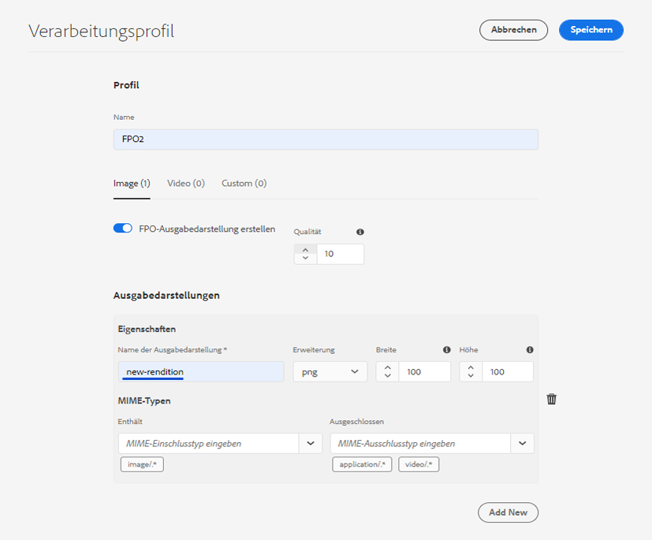
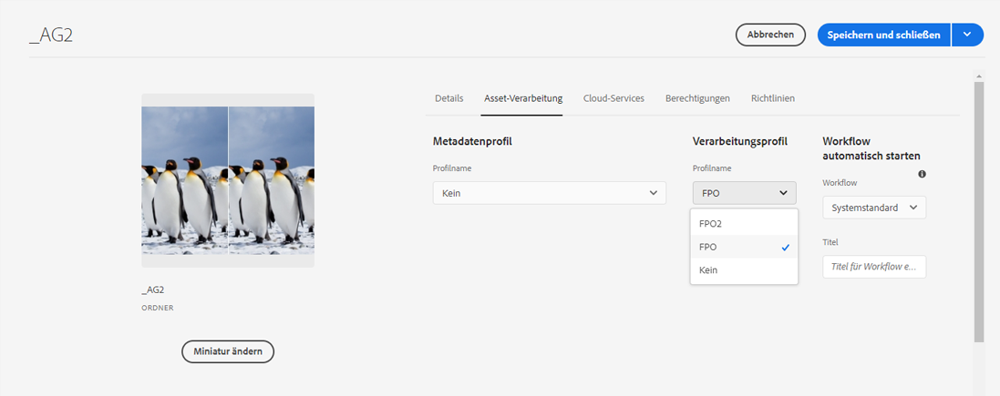
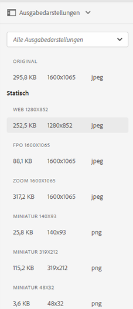

# Erzeugen von FPO (For Placement Only)-Ausgabedarstellungen (also nur für die Platzierung) für Adobe InDesign {#fpo-renditions}

| [Best Practices für die Suche](/help/assets/search-best-practices.md) | [Best Practices für Metadaten](/help/assets/metadata-best-practices.md) | [Content Hub](/help/assets/product-overview.md) | [Dynamic Media mit OpenAPI-Funktionen](/help/assets/dynamic-media-open-apis-overview.md) | [Entwicklerdokumentation zu AEM Assets](https://developer.adobe.com/experience-cloud/experience-manager-apis/) |
| ------------- | --------------------------- |---------|----|-----|

| Version | Artikel-Link |
| -------- | ---------------------------- |
| AEM 6.5 | [Hier klicken](https://experienceleague.adobe.com/en/docs/experience-manager-65/content/assets/administer/configure-fpo-renditions) |
| AEM as a Cloud Service | Dieser Artikel |

Wenn großformatige Assets von Experience Manager in Adobe InDesign-Dokumente einfügt werden, muss der Kreativprofi nach dem [Platzieren eines Assets](https://helpx.adobe.com/de/indesign/using/placing-graphics.html) eine beträchtliche Zeit warten. In der Zwischenzeit kann der Benutzer InDesign nicht verwenden. Dies unterbricht den kreativen Fluss und wirkt sich negativ auf das Kundenerlebnis aus. Adobe ermöglicht die zeitweilige Platzierung kleinformatiger Ausgabedarstellungen in InDesign-Dokumenten. Wenn die endgültige Ausgabe erforderlich ist, z. B. für Druck- und Veröffentlichungs-Workflows, ersetzen die ursprünglichen Assets mit voller Auflösung im Hintergrund die temporäre Ausgabedarstellung. Diese asynchrone Aktualisierung im Hintergrund beschleunigt den Design-Prozess, um die Produktivität zu steigern, ohne den kreativen Prozess zu behindern.

Assets bietet Ausgabedarstellungen, die nur für die Platzierung (For Placement Only, FPO) verwendet werden. Diese FPO-Ausgabedarstellungen haben eine kleine Dateigröße, weisen aber dasselbe Seitenverhältnis auf. Wenn für ein Asset keine FPO-Ausgabedarstellung verfügbar ist, verwendet Adobe InDesign stattdessen das Original-Asset. Dieser Fallback-Mechanismus stellt sicher, dass der kreative Workflow ohne Unterbrechung fortgesetzt wird.

Experience Manager as a Cloud Service bietet Cloud-native Asset-Verarbeitungsfunktionen zum Erzeugen der FPO-Ausgabedarstellungen. Verwenden Sie Asset-Microservices für die Erzeugung von Ausgabedarstellungen. Sie können die Erzeugung von Ausgabedarstellungen für neu hochgeladene Assets und für die in Experience Manager vorhandenen Assets konfigurieren.

Im Folgenden werden die Schritte zum Erzeugen von FPO-Ausgabedarstellungen beschrieben:

1. [Erstellen eines Verarbeitungsprofils](#create-processing-profile)

1. Konfigurieren Sie Experience Manager für die Verwendung dieses Profils, um [neue Assets zu verarbeiten](#generate-renditions-of-new-assets).
1. Verwenden Sie die Profile, um [vorhandene Assets zu verarbeiten](#generate-renditions-of-existing-assets).

## Erstellen eines Verarbeitungsprofils {#create-processing-profile}

Um FPO-Ausgabedarstellungen zu erzeugen, erstellen Sie ein **[!UICONTROL Verarbeitungsprofil]**. Die Profile verwenden Cloud-native Asset-Microservices für die Verarbeitung. Anweisungen finden Sie unter [Erstellen von Verarbeitungsprofilen für Asset-Microservices](asset-microservices-configure-and-use.md).

Wählen Sie **[!UICONTROL FPO-Ausgabedarstellung erstellen]** aus, um die FPO-Ausgabedarstellung zu erzeugen. Klicken Sie optional auf **[!UICONTROL Neue hinzufügen]**, um demselben Profil weitere Ausgabedarstellungs-Einstellungen hinzuzufügen.

## Erzeugen von Ausgabedarstellungen neuer Assets {#generate-renditions-of-new-assets}

Um FPO-Ausgabedarstellungen neuer Assets zu erzeugen, wenden Sie in den Ordnereigenschaften das **[!UICONTROL Verarbeitungsprofil]** auf den Ordner an. Klicken Sie auf der Eigenschaftsseite eines Ordners auf die Registerkarte **[!UICONTROL Asset-Verarbeitung]**, wählen Sie das **[!UICONTROL FPO-Profil]** als **[!UICONTROL Verarbeitungsprofil]** aus und speichern Sie die Änderungen. Alle neuen Assets, die in den Ordner hochgeladen wurden, werden mit diesem Profil verarbeitet.

## Erzeugen von Ausgabedarstellungen vorhandener Assets {#generate-renditions-of-existing-assets}

Um Ausgabedarstellungen zu erzeugen, wählen Sie die Assets aus und führen Sie die folgenden Schritte aus.

## Anzeigen von FPO-Ausgabedarstellungen {#view-fpo-renditions}

Sie können überprüfen, ob die erzeugten FPO-Ausgabedarstellungen vorliegen, nachdem der Workflow abgeschlossen ist. Klicken Sie in der Benutzeroberfläche von Experience Manager Assets auf das Asset, um eine große Vorschau zu öffnen. Öffnen Sie die linke Leiste und wählen Sie **[!UICONTROL Ausgabedarstellungen]** aus. Alternativ können Sie den Tastaturbefehl `Alt + 3` verwenden, wenn die Vorschau geöffnet ist.

Klicken Sie auf **[!UICONTROL FPO-Ausgabedarstellung]**, um die Vorschau zu laden. Optional können Sie mit der rechten Maustaste auf die Ausgabedarstellung klicken und sie in Ihrem Dateisystem speichern. Suchen Sie in der linken Leiste nach verfügbaren Ausgabedarstellungen.

**Siehe auch**

* [Assets übersetzen](translate-assets.md)
* [Assets-HTTP-API](mac-api-assets.md)
* [Von AEM Assets unterstützte Dateiformate](file-format-support.md)
* [Suchen von Assets](search-assets.md)
* [Connected Assets](use-assets-across-connected-assets-instances.md)
* [Asset-Berichte](asset-reports.md)
* [Metadatenschemata](metadata-schemas.md)
* [Herunterladen von Assets](download-assets-from-aem.md)
* [Verwalten von Metadaten](manage-metadata.md)
* [Suchfacetten](search-facets.md)
* [Verwalten von Sammlungen](manage-collections.md)
* [Massenimport von Metadaten](metadata-import-export.md)
* [Veröffentlichen von Assets in AEM und Dynamic Media](/help/assets/publish-assets-to-aem-and-dm.md)