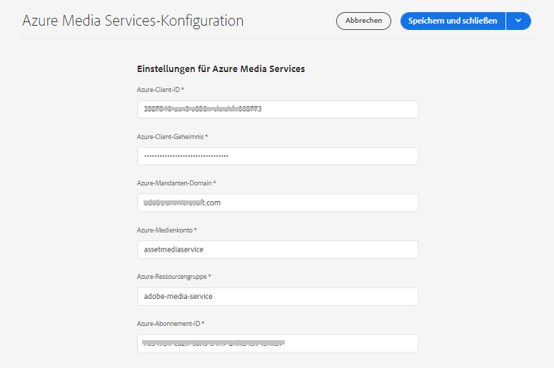
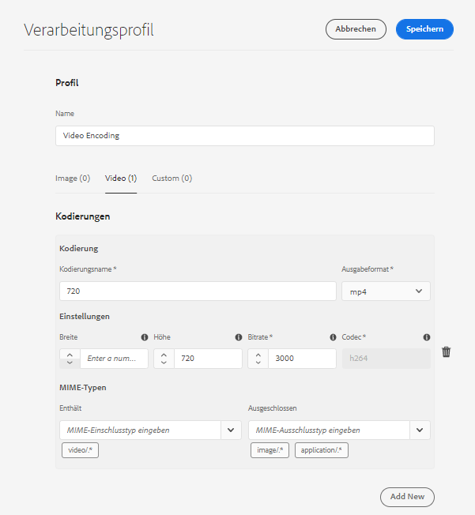
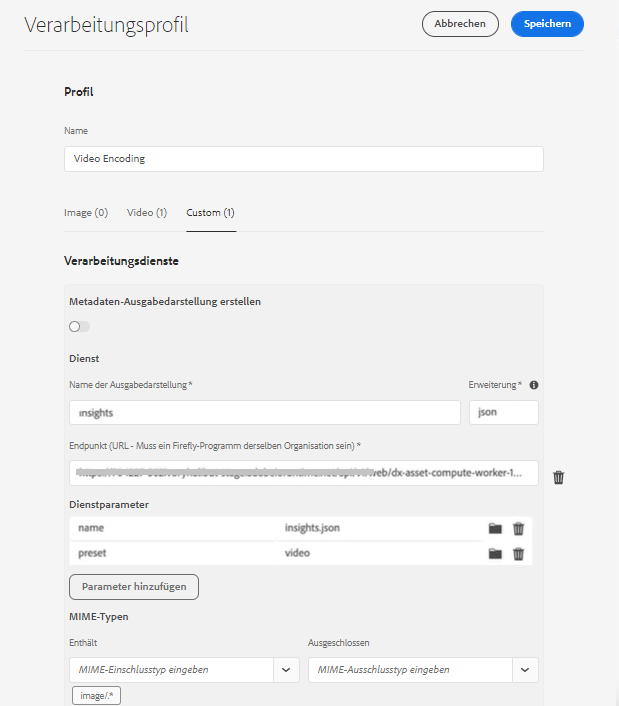
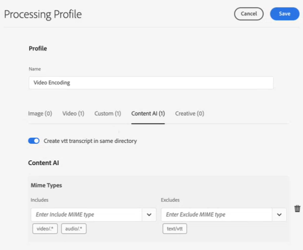
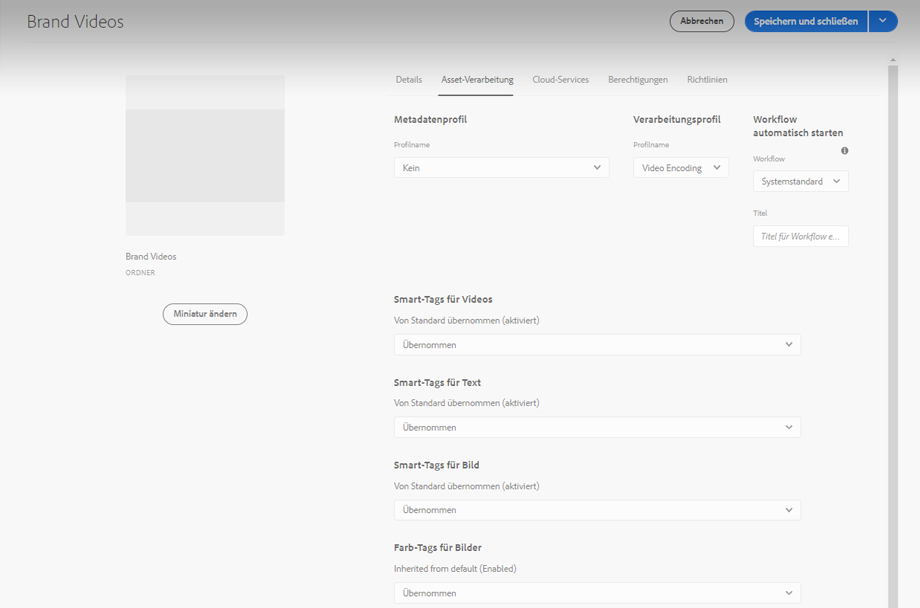

# Konfigurieren der Transkription in [!DNL Experience Manager Assets] {#configure-transcription-service}

Transkription ist der Prozess der Übersetzung des Audioinhalts aus einer Audio- oder Videodatei in Text (Sprache in Text) mithilfe der Spracherkennungstechnologie.
[!DNL Adobe Experience Manager Assets] wurde mit [!DNL Azure Media Services] konfiguriert, wodurch automatisch ein Texttranskript der gesprochenen Sprache in einer unterstützten Audio- oder Videodatei im WebVTT-Format (.vtt) generiert wird. Wenn ein Audio- oder Video-Asset in [!DNL Experience Manager Assets] verarbeitet wird, generiert der Transkriptions-Service automatisch die Texttranskript-Ausgabedarstellung des Audio- oder Video-Assets und speichert sie an demselben Speicherort in Ihrem Assets-Repository, in dem sich das Original-Asset befindet. Der Transkriptions-Service von [!DNL Experience Manager Assets] ermöglicht Marketing-Fachleuten die effektive Verwaltung ihrer Audio- und Videoinhalte mit zusätzlicher Auffindbarkeit des Textinhalts und die Steigerung des ROI dieser Assets durch Unterstützung von Barrierefreiheit und Lokalisierung.

Transkripte sind Textversionen gesprochener Inhalte. Ein Beispiel ist ein Film, den Sie auf einer OTT-Plattform ansehen, der an vielen Stellen Untertitel enthält, um die Barrierefreiheit zu verbessern oder den Inhalt in anderen Sprachen zu zeigen. Oder eine Audio- oder Videodatei, die für Marketing-, Lern- oder Unterhaltungszwecke verwendet wird. Diese Erlebnisse beginnen mit einer Transkription, die dann entsprechend formatiert oder übersetzt wird. Das Transskribieren von Audio oder Video ist bei manueller Ausführung zeitintensiv und fehleranfällig. Angesichts des immer größeren Bedarfs an Audio-Video-Inhalten ist es auch eine Herausforderung, den manuellen Prozess zu skalieren. [!DNL Experience Manager Assets] verwendet die KI-basierte Transkription von Azure, die eine groß angelegte Verarbeitung der Audio- und Video-Assets ermöglicht und die Text-Transkripte (.vtt-Dateien) zusammen mit den Zeitstempeldetails erzeugt. Neben Assets wird die Transkriptionsfunktion auch in Dynamic Media unterstützt.

Die Transkriptionsfunktion ist in [!DNL Experience Manager Assets] kostenlos verfügbar. Die Admins benötigen jedoch die Azure-Anmeldeinformationen der Benutzenden, um den Transkriptions-Service in [!DNL Experience Manager Assets] zu konfigurieren. Sie können die [Testanmeldedaten auch direkt von Microsoft® erhalten](https://azure.microsoft.com/de-de/pricing/details/media-services/), um die Audio- oder Videotranskriptionsfunktion in Assets auszuprobieren.

## Voraussetzungen für die Transkription {#prerequisites}

1. Eine [!DNL Experience Manager Assets as a Cloud Service]-Instanz, die ausgeführt wird.
1. Die folgenden Azure-Anmeldedaten sind für die Konfiguration in [!DNL Experience Manager Assets] erforderlich:

   * Client-ID (API-Schlüssel)
   * Client-Geheimnis-Schlüssel
   * Mandanten-Endpunkt (Domain)
   * Medienkonto
   * Ressourcengruppe
   * Abonnement-ID

   Siehe [Azure-Dokumentation](https://docs.microsoft.com/de-de/azure/media-services/latest/access-api-howto?tabs=portal), um Anmeldedaten für den Zugriff auf die Azure Media Services-API zu erhalten.

1. Stellen Sie sicher, dass das Azure-Konto über ein ausreichendes Guthaben für die Verarbeitung neuer Anfragen verfügt.

## Konfigurieren der Transkription in [!DNL Experience Manager Assets] {#configure-transcription}

Die folgenden Konfigurationen sind erforderlich, um die Transkriptionsfunktion in [!DNL Experience Manager Assets] zu aktivieren:

1. [Konfigurieren von Azure Media Services](#configure-azure-media-service)
1. [Konfigurieren des Verarbeitungsprofils für die Audio-/Videotranskription](#configure-processing-profile-for-transcription)

### Konfigurieren von Azure Media Services {#configure-azure-media-services}

[!DNL Experience Manager Assets] verwendet die [!DNL Azure Media Services], wodurch automatisch Texttranskripte der gesprochenen Sprache in einer [unterstützten Audio- oder Videodatei](#supported-file-formats-for-transcription) im WebVTT-Format (.vtt) erzeugt werden. Administratoren können [!DNL Azure Media Services] in [!DNL Experience Manager Assets] mit den Azure-Anmeldedaten konfigurieren. In [Voraussetzungen für die Transkription](#transcription-prerequisites) werden die [!DNL Azure]-Anmeldedaten, die für die Konfiguration erforderlich sind, aufgeführt. Wenn Sie kein [!DNL Azure]-Konto und -Anmeldedaten haben, siehe [Dokumentation zu Azure Media Services](https://azure.microsoft.com/de-de/pricing/details/media-services/), um Testanmeldedaten zu erhalten.

Gehen Sie zu **[!UICONTROL Tools]** > **[!UICONTROL Cloud Services]** > **[!UICONTROL Azure Media Services-Konfiguration]**. Wählen Sie in der linken Leiste einen Ordner (Speicherort) aus und klicken Sie zum Konfigurieren der Verbindung mit dem [!DNL Azure]-Konto auf die Schaltfläche [!UICONTROL Erstellen]. Dieser Ordner ist der Speicherort, an dem Ihre [!DNL Azure] Cloud-Konfiguration in Experience Manager Assets gespeichert wird. Geben Sie die [!DNL Azure] Anmeldedaten ein und klicken Sie auf **[!UICONTROL Speichern und schließen]**.

### Konfigurieren des Verarbeitungsprofils für die Transkription {#configure-processing-profile}

Sobald die [!DNL Azure Media Services] in Experience Manager Assets konfiguriert sind, besteht der nächste Schritt darin, ein Asset-Verarbeitungsprofil zu erstellen, um eine KI-basierte Transkription der Audio- und Video-Assets zu erzeugen. Das KI-basierte Verarbeitungsprofil erzeugt Transkripte der [unterstützten Audio- oder Video-Assets](#supported-file-formats-for-transcription) als Ausgabedarstellung in Experience Manager Assets und speichert das Transkript (.vtt-Datei) in demselben Ordner, in dem sich das Original-Asset befindet. Somit ist es für die Benutzerinnen und Benutzer einfacher, das Asset und seine Transkriptausgabedarstellung zu suchen und zu finden.

Gehen Sie zu **[!UICONTROL Tools]** > **[!UICONTROL Assets]** > **[!UICONTROL Verarbeitungsprofile]** und klicken Sie auf die Schaltfläche **[!UICONTROL Erstellen]**, um ein KI-basiertes Verarbeitungsprofil zur Generierung einer Transkription Ihrer Audio- und Videodateien zu erstellen. Standardmäßig zeigt die Seite mit dem Verarbeitungsprofil nur drei Registerkarten an (Bild, Video und Benutzerdefiniert). Eine Registerkarte **[!UICONTROL Content-KI]** ist jedoch sichtbar, wenn Sie [!DNL Azure Media Services] in Ihrer [!DNL Experience Manager Assets]-Instanz konfiguriert haben. Überprüfen Sie Ihre [!DNL Azure]-Anmeldedaten, wenn Sie die Registerkarte **[!UICONTROL Content-KI]** beim Erstellen eines Verarbeitungsprofils nicht angezeigt bekommen.

Klicken Sie auf der Registerkarte **[!UICONTROL Content-KI]** zum Konfigurieren der Transkription auf die Schaltfläche **[!UICONTROL Neue hinzufügen]**. Hier können Sie die Dateiformate (MIME-Typen) zum Generieren von Transkripten ein- und ausschließen, indem Sie Dateitypen aus der Dropdown-Liste auswählen. In der folgenden Abbildung werden alle unterstützten Audio- und Videodateien eingeschlossen und die Textdateien ausgeschlossen.

Aktivieren Sie den Umschalter **[!UICONTROL VTT-Transkript im selben Verzeichnis erstellen]**, um die Transkript-Ausgabedarstellung (.vtt-Datei) in demselben Ordner zu erstellen und zu speichern, in dem sich das Original-Asset befindet. Die anderen Ausgabedarstellungen werden auch vom standardmäßigen DAM-Asset-Verarbeitungs-Workflow erzeugt, unabhängig von dieser Einstellung.

Die folgende Abbildung zeigt ein benutzerdefiniertes Videoprofil, das in Experience Manager Assets erstellt wird.

Das Videoprofil enthält außerdem die folgenden benutzerdefinierten Konfigurationen. Einzelheiten zur Erstellung eines benutzerdefinierten Verarbeitungsprofils finden Sie in der [Dokumentation zum Verarbeitungsprofil](/help/assets/asset-microservices-configure-and-use.md).

Konfigurieren wir nun die Transkription in diesem Videoprofil. Gehen Sie zur Registerkarte **[!UICONTROL Content-KI]** und klicken Sie auf die Schaltfläche **[!UICONTROL Neue hinzufügen]**. Schließen Sie alle Audio- und Videodateien ein und schließen Sie die Bild- und Anwendungsdateien aus. Aktivieren Sie den Umschalter **[!UICONTROL VTT-Transkript im selben Verzeichnis erstellen]** und speichern Sie die Konfiguration.

Nachdem das Verarbeitungsprofil für die Transkription von Audio- und Videodateien konfiguriert wurde, können Sie dieses Verarbeitungsprofil mit einer der folgenden Methoden auf Ordner anwenden:

* Wählen Sie unter **[!UICONTROL Tools]** > **[!UICONTROL Assets]** > **[!UICONTROL Verarbeitungsprofile]** eine Verarbeitungsprofildefinition aus und verwenden Sie die Aktion **[!UICONTROL Profil auf Ordner anwenden]**. Mit dem Inhaltsbrowser können Sie zu einem bestimmten Ordner navigieren, den Ordner auswählen und die Anwendung des Profils bestätigen.
* Wählen Sie einen Ordner in der Assets-Benutzeroberfläche aus und klicken Sie zum Öffnen der Ordnereigenschaften auf die Aktion **[!UICONTROL Eigenschaften]**. Klicken Sie auf die Registerkarte **[!UICONTROL Asset-Verarbeitung]** und wählen Sie das entsprechende Verarbeitungsprofil für den Ordner aus der Liste **[!UICONTROL Verarbeitungsprofil]** aus. Klicken Sie auf **[!UICONTROL Speichern und schließen]**, um die Änderungen zu speichern.

  

* Benutzerinnen und Benutzer können in der Assets-Benutzeroberfläche Ordner oder bestimmte Assets auswählen, um ein Verarbeitungsprofil anzuwenden, und dann die Option **[!UICONTROL Assets erneut verarbeiten]** aus den oben verfügbaren Optionen auswählen.

>[!TIP]
>Auf einen Ordner kann nur ein Verarbeitungsprofil angewendet werden.
>
>Nachdem ein Verarbeitungsprofil auf einen Ordner angewendet wurde, werden alle neuen Assets, die in diesen Ordner oder einen seiner Unterordner hochgeladen (oder aktualisiert) werden, mit dem konfigurierten zusätzlichen Verarbeitungsprofil verarbeitet. Diese Verarbeitung erfolgt zusätzlich zum Standardprofil.

>[!NOTE]
>
>Ein Verarbeitungsprofil, das auf einen Ordner angewendet wird, funktioniert für die gesamte Struktur, kann aber mit einem anderen Profil überschrieben werden, das auf einen Unterordner angewendet wird.
>
>Wenn Assets in einen Ordner hochgeladen werden, kommuniziert Experience Manager mit den enthaltenen Eigenschaften des Ordners, um das Verarbeitungsprofil zu ermitteln. Wenn nichts angewendet wird, wird in einem übergeordneten Ordner in der Hierarchie geprüft, ob ein Verarbeitungsprofil angewendet werden soll.

## Generieren der Transkription Ihrer Audio- oder Video-Assets {#generate-transcription}

Bei der Verarbeitung eines Video-Assets erzeugt das [KI-basierte Verarbeitungsprofil](#configure-processing-profile-for-transcription) automatisch das Transkript (.vtt-Datei) als Ausgabedarstellung zusammen mit dem Original-Asset im selben Ordner.

Sie können die Transkript-Ausgabedarstellung auch anzeigen, indem Sie auf die Ausgabedarstellungen des Original-Video-Assets zugreifen. Um auf das Bedienfeld **[!UICONTROL Ausgabedarstellungen]** zuzugreifen, wählen Sie das ursprüngliche Video-Asset aus und öffnen Sie die linke Leiste. Sie können sehen, dass die Transkript-Ausgabedarstellung (.vtt-Datei) unter dem Kopf **[!UICONTROL TRANSCRIPTVTT]** angezeigt wird.

Sie können das Transkript (.vtt-Textdatei) direkt aus dem Ordner als separate Ausgabedarstellung des Assets oder aus dem Bedienfeld **[!UICONTROL Ausgabedarstellungen]** des ursprünglichen Assets herunterladen, indem Sie alle Ausgabedarstellungen des Assets herunterladen.

Derzeit unterstützt Experience Manager die Volltextvorschau oder die Bearbeitung von VTT-Dateien nicht nativ. Sie können jedoch die Transkriptausgabedarstellung herunterladen und einen beliebigen Texteditor verwenden, um das Transkript zu bearbeiten oder zu überprüfen. Das Transkript spiegelt die gesprochene Sprache als Text zum gegebenen Zeitstempel im Video mit dem Konfidenzwert (Genauigkeit) der Transkription wieder.

## Verwenden von Transkripten in Dynamic Media {#using-transcription-in-dynamic-media}

Wenn Sie [Dynamic Media in Ihrer Experience Manager Assets-Instanz konfiguriert](/help/assets/dynamic-media/config-dm.md) haben, können Sie das Asset (Audio- oder Videodatei) und das zugehörige Transkript (.vtt-Datei) in Dynamic Media veröffentlichen. Auf diese Weise werden das Original-Asset (Audio- oder Videodatei) und seine transkribierte Ausgabedarstellung (.vtt-Datei) im selben Ordner in Dynamic Media veröffentlicht. Der Dynamic Media-Administrator kann [CC Closed Caption](/help/assets/dynamic-media/video.md#adding-captions-to-video) für die Audio- oder Videodatei mithilfe der Transkriptions-Ausgabedarstellung (.vtt-Datei) aktivieren.

Siehe auch:

* [Video-Tutorial zum Hinzufügen von CC Closed Caption zu Dynamic Media](https://experienceleague.adobe.com/docs/experience-manager-learn/assets/dynamic-media/dynamic-media-overview-feature-video-use.html?lang=de#add-cc-closed-captioning-to-dynamic-media-video)
* [Veröffentlichen von Dynamic Media-Videos in YouTube](/help/assets/dynamic-media/video.md#publishing-videos-to-youtube)

In der folgenden Abbildung spiegelt die URL den Teil der Untertitelung wider, der sich auf das Transkript (.vtt-Datei) bezieht. Das Video spiegelt die gesprochene Sprache (transkribierter Text) als **[!UICONTROL Closed Caption]** zum angegebenen Zeitstempel im Video wider. Benutzerinnen und Benutzer können die Untertitel mithilfe der Schaltfläche **[!UICONTROL CC]** aktivieren oder deaktivieren.

## Unterstützte Dateiformate für die Transkription {#supported-file-format}

Die folgenden Audio- und Videodateiformate werden für die Transkription unterstützt:

| Unterstützte Audio-/Videoformate | Erweiterungen |
|----|----|
| FLV (mit H.264- und AAC-Codecs) | (.flv) |
| MXF | (.mxf) |
| MPEG2-PS, MPEG2-TS, 3GP | (.ts, .ps, .3gp, .3gpp, .mpg) |
| Windows Media Video (WMV)/ASF | (.wmv, .asf) |
| AVI (unkomprimiert, 8 Bit/10 Bit) | (.avi) |
| MP4 | (.mp4, .m4a, .m4v) |
| Microsoft® Digital Video Recording (DVR-MS) | (.dvr-ms) |
| Matroska/WebM | (.mkv) |
| WAVE/WAV | (.wav) |
| QuickTime | (.mov) |

>[!NOTE]
>
>Die Assets (Audio- oder Videodateien), die vom Typ Anwendung sind, werden für die Transkription nicht unterstützt.

## Bekannte Einschränkungen {#known-limitations}

* Die Transkriptionsfunktion wird für Videos mit einer Dauer von bis zu 10 Minuten unterstützt.
* Der Videotitel darf maximal 80 Zeichen lang sein.
* Die unterstützte Dateigröße beträgt bis zu 15 GB.
* Die maximal unterstützte Verarbeitungsdauer beträgt 60 Minuten.
* Mit einem kostenpflichtigen [!DNL Azure]-Konto können bis zu 50 Filme pro Minute hochgeladen werden. In einem Testkonto können Sie jedoch nur bis zu fünf Filme pro Minute hochladen.

## Tipps zur Fehlerbehebung {#troubleshooting}

Melden Sie sich bei Ihrem [!DNL Azure Media Services]-Konto mit denselben Anmeldedaten an (die Sie für die Konfiguration verwendet haben), um den Status der Anfrage zu überprüfen.  Wenden Sie sich an den [!DNL Azure]-Support, wenn Ihre Anfrage nicht erfolgreich verarbeitet wurde.

**Siehe auch**

* [Assets übersetzen](translate-assets.md)
* [Assets-HTTP-API](mac-api-assets.md)
* [Von AEM Assets unterstützte Dateiformate](file-format-support.md)
* [Suchen von Assets](search-assets.md)
* [Connected Assets](use-assets-across-connected-assets-instances.md)
* [Asset-Berichte](asset-reports.md)
* [Metadatenschemata](metadata-schemas.md)
* [Herunterladen von Assets](download-assets-from-aem.md)
* [Verwalten von Metadaten](manage-metadata.md)
* [Suchfacetten](search-facets.md)
* [Verwalten von Sammlungen](manage-collections.md)
* [Massenimport von Metadaten](metadata-import-export.md)
* [Veröffentlichen von Assets in AEM und Dynamic Media](/help/assets/publish-assets-to-aem-and-dm.md)
