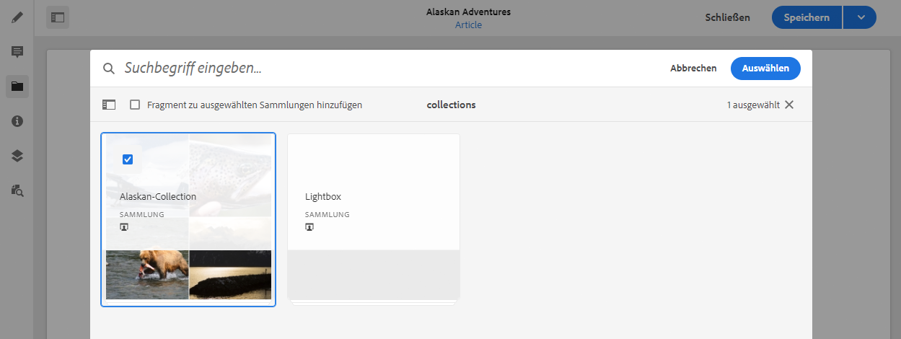

# Zugehörige Inhalte {#associated-content}

AEM Funktion &quot;Verknüpfter Inhalt&quot;stellt die Verbindung bereit, damit Assets optional mit dem Fragment verwendet werden können, wenn es einer Inhaltsseite hinzugefügt wird. Dies bietet Flexibilität für Ihren Versand ohne Kopfdaten, indem [eine Reihe von Assets bereitgestellt wird, auf die Sie zugreifen können, wenn Sie das Inhaltsfragment auf einer Seite verwenden,](/help/sites-cloud/authoring/fundamentals/content-fragments.md#using-associated-content), und gleichzeitig die für die Suche nach dem entsprechenden Asset erforderliche Zeit verkürzt wird.

## Hinzufügen von zugehörigen Inhalten {#adding-associated-content}

>[!NOTE]
>
>Es gibt verschiedene Methoden, um [visuelle Assets (z. B. Bilder)](/help/assets/content-fragments/content-fragments.md#fragments-with-visual-assets) einem Fragment und/oder einer Seite hinzuzufügen.

Um zugehörige Inhalte zu verknüpfen, müssen zunächst [Medien-Assets zu einer Sammlung hinzugefügt werden](/help/assets/manage-collections.md). Danach können Sie Folgendes tun:

1. Öffnen Sie das Fragment und wählen Sie im seitlichen Bedienfeld **Zugehörige Inhalte** aus.

   

1. Je nachdem, ob bereits Sammlungen zugeordnet wurden oder nicht, wählen Sie eine der folgenden Optionen aus:

   * **Inhalt verknüpfen**: dies wird die erste zugehörige Sammlung
   * **Sammlung verknüpfen**: Zugehörige Sammlungen sind bereits konfiguriert

1. Wählen Sie die erforderliche Sammlung aus.

   Optional können Sie das eigentliche Fragment zur ausgewählten Sammlung hinzufügen. Dies hilft bei der Nachverfolgung.

   

1. Bestätigen (mit **Auswählen**). Die Sammlung wird als verknüpft aufgeführt.

   

## Bearbeiten zugehöriger Inhalte {#editing-associated-content}

Nachdem Sie eine Sammlung zugewiesen haben, können Sie Folgendes tun:

* Die Verknüpfung **entfernen**.
* Der Sammlung **Assets hinzufügen**.
* Ein Asset für weitere Aktionen auswählen.
* Das Asset bearbeiten.
