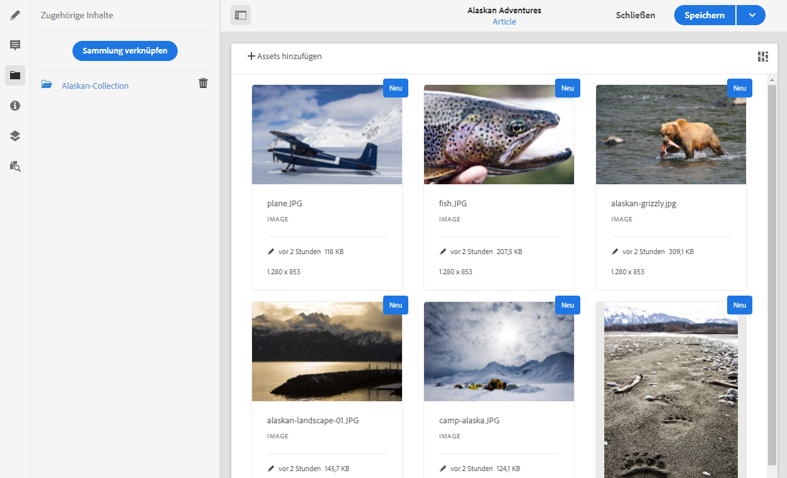

# Zugehörige Inhalte{#associated-content}

Bei den Inhaltsfragmenten von Adobe Experience Manager (AEM) as a Cloud Service stellt die zugehörige Inhaltsfunktion (verfügbar im Original-Editor) die Verbindung her, sodass Assets optional mit dem Fragment verwendet werden können. Dies bietet Ihnen mehr Flexibilität, wenn es darum geht, [eine Reihe von Assets bereitzustellen, auf die bei der Verwendung des Inhaltsfragments zugegriffen werden soll](/help/assets/content-fragments/content-fragments.md#using-associated-content). Darüber hinaus wird so der Zeitaufwand für die Suche nach dem passenden Asset reduziert. Diese Funktion kann sowohl für Ihre Headless Content-Bereitstellung als auch für die Seitenbearbeitung verwendet werden.

>[!NOTE]
>
>Inhaltsfragmente sind eine Sites-Eigenschaft, werden jedoch als **Assets** gespeichert.
>
>Es gibt zwei Editoren für die Bearbeitung von Inhaltsfragmenten. Obwohl die grundlegende Funktionalität identisch ist, gibt es einige Unterschiede. In diesem Abschnitt wird der ursprüngliche Editor behandelt. Der Zugriff auf diesen erfolgt hauptsächlich über die **Assets**-Konsole.

## Hinzufügen von zugehörigen Inhalten {#adding-associated-content}

>[!NOTE]
>
>Es gibt diverse Methoden, um [visuelle Assets (zum Beispiel Fotos)](/help/assets/content-fragments/content-fragments.md#fragments-with-visual-assets) zum Fragment und/oder der Seite hinzuzufügen.

Um zugehörige Inhalte zu verknüpfen, müssen zunächst [Medien-Assets zu einer Sammlung hinzugefügt werden](/help/assets/manage-collections.md). Danach können Sie Folgendes tun:

1. Öffnen Sie das Fragment und wählen Sie im seitlichen Bedienfeld **Zugehörige Inhalte** aus.

   

1. Je nachdem, ob bereits Sammlungen zugeordnet wurden oder nicht, wählen Sie eine der folgenden Optionen aus:

   * **Inhalt verknüpfen**: Die erste verknüpfte Sammlung
   * **Sammlung verknüpfen**: Zugeordnete Sammlungen sind bereits konfiguriert

1. Wählen Sie die erforderliche Sammlung aus.

   Optional können Sie das eigentliche Fragment zur ausgewählten Sammlung hinzufügen. Dies hilft bei der Nachverfolgung.

   

1. Bestätigen (mit **Auswählen**). Die Sammlung wird als zugeordnet aufgelistet.

   

## Bearbeiten zugehöriger Inhalte {#editing-associated-content}

Nachdem Sie eine Sammlung zugewiesen haben, können Sie Folgendes tun:

* Die Verknüpfung **aufheben**.
* **Assets zur Sammlung hinzufügen**.
* Ein Asset für weitere Aktionen auswählen.
* Das ausgewählte Asset bearbeiten.
